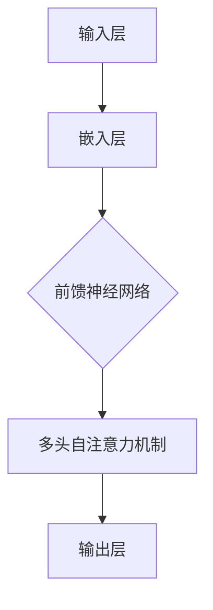
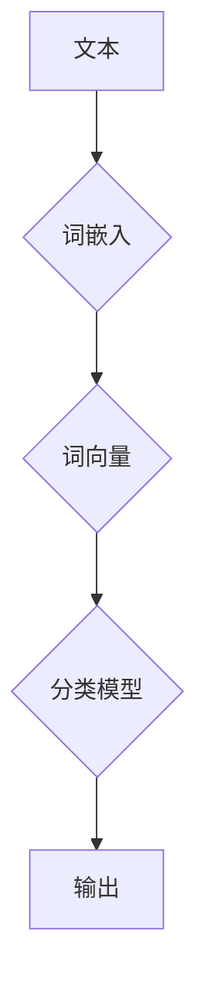
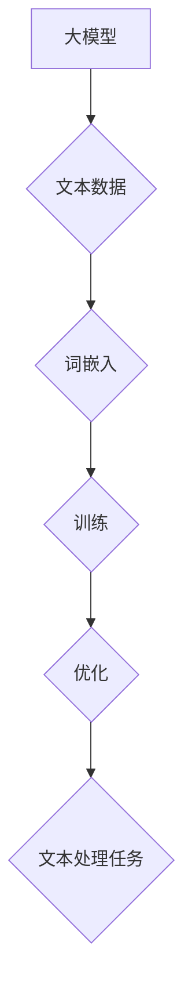

                 

关键词：大模型开发、文本处理、微调、单词级、深度学习、自然语言处理

摘要：本文旨在为读者提供一个全面而详细的指南，从零开始介绍大模型的开发与微调过程，特别是在处理单词级文本数据时。我们将探讨核心概念、算法原理、数学模型以及实际应用，并通过实例展示如何将这些理论应用到实践中。

## 1. 背景介绍

### 大模型的概念

大模型，顾名思义，是指具有巨大参数量的机器学习模型，这些模型通常在深度学习中应用。大模型能够捕捉到数据中的复杂模式和关系，从而在多种任务上实现优异的性能。随着计算能力和数据资源的提升，大模型的开发已经成为自然语言处理（NLP）领域的热点。

### 文本处理的重要性

文本处理是NLP的核心任务之一，涵盖了从文本数据中提取信息、理解和生成文本。随着互联网的迅猛发展，文本数据量呈指数级增长，如何高效地处理这些数据成为亟待解决的问题。单词作为文本的基本组成单位，对文本处理的效率和准确性具有至关重要的影响。

### 单词级文本处理的挑战

单词级文本处理面临着诸如词义歧义、同音异义词、上下文依赖等问题。此外，由于单词本身是离散的，如何将离散的单词转换为模型可以处理的连续表示也是一个挑战。这些挑战推动了深度学习在文本处理领域的广泛应用。

## 2. 核心概念与联系

### 大模型的核心概念

大模型通常指的是具有大量参数的神经网络模型，例如Transformer模型。这些模型通过多层神经网络结构来学习输入数据的复杂特征。



### 文本处理的核心概念

文本处理的核心概念包括词嵌入、词向量、文本分类等。词嵌入将单词映射为连续的向量表示，而词向量则是词嵌入的结果。



### 大模型与文本处理的关系

大模型通过学习大量的文本数据，能够自动提取单词的语义和上下文信息，从而提高文本处理的性能。



## 3. 核心算法原理 & 具体操作步骤

### 3.1 算法原理概述

我们以Transformer模型为例，介绍大模型在文本处理中的基本原理。

#### 3.1.1 嵌入层

嵌入层将单词转换为高维向量表示，这些向量包含了单词的语义信息。

#### 3.1.2 自注意力机制

自注意力机制使模型能够自动关注文本中的关键信息，提高对上下文的捕捉能力。

#### 3.1.3 前馈神经网络

前馈神经网络对自注意力机制的结果进行进一步处理，提取更复杂的特征。

#### 3.1.4 输出层

输出层通常是一个分类层，用于将文本数据分类到不同的类别。

### 3.2 算法步骤详解

#### 3.2.1 数据预处理

首先，对文本数据进行预处理，包括分词、去除停用词等。

#### 3.2.2 嵌入层

将预处理后的单词映射为高维向量表示。

#### 3.2.3 自注意力机制

对嵌入层输出的向量进行自注意力计算，提取关键信息。

#### 3.2.4 前馈神经网络

对自注意力结果进行前馈神经网络处理，提取更复杂的特征。

#### 3.2.5 输出层

使用输出层对文本进行分类。

### 3.3 算法优缺点

#### 优点

- 强大的上下文捕捉能力。
- 高效的并行计算性能。

#### 缺点

- 需要大量的计算资源。
- 对数据质量要求较高。

### 3.4 算法应用领域

- 文本分类
- 命名实体识别
- 机器翻译
- 对话系统

## 4. 数学模型和公式 & 详细讲解 & 举例说明

### 4.1 数学模型构建

#### 4.1.1 嵌入层

假设单词表中有V个单词，嵌入层将每个单词映射为一个D维的向量。

$$
\text{Embedding}(x) = \text{W}_\text{emb}[x] \in \mathbb{R}^{D}
$$

其中，$W_\text{emb}$ 是一个 $V \times D$ 的权重矩阵。

#### 4.1.2 自注意力机制

自注意力机制的核心是一个注意力权重矩阵 $A \in \mathbb{R}^{N \times N}$，其中 N 是序列长度。

$$
A = \text{softmax}\left(\frac{\text{Q} \cdot \text{K}^T}{\sqrt{D_k}}\right)
$$

其中，$Q, K, V$ 分别是查询、键、值向量的线性组合。

#### 4.1.3 前馈神经网络

前馈神经网络通常有两个全连接层，一个激活函数。

$$
\text{FFN}(x) = \text{ReLU}(\text{W}_2 \cdot \text{W}_1 \cdot x + b_2) + b_1
$$

其中，$\text{W}_1, \text{W}_2, b_1, b_2$ 分别是权重和偏置。

### 4.2 公式推导过程

推导过程将涉及线性代数、微积分和概率论等数学工具。

### 4.3 案例分析与讲解

我们将通过一个简单的例子来讲解如何使用Transformer模型进行文本分类。

假设我们有一个包含两个类别的文本数据集，每个类别有500个样本。

1. 数据预处理：对文本进行分词和去除停用词，得到词汇表和单词的索引表示。
2. 嵌入层：将词汇表中的单词映射为向量。
3. 自注意力机制：计算单词之间的注意力权重，提取关键信息。
4. 前馈神经网络：对自注意力结果进行进一步处理，提取更复杂的特征。
5. 输出层：使用softmax函数对文本进行分类。

## 5. 项目实践：代码实例和详细解释说明

### 5.1 开发环境搭建

- Python 3.8+
- TensorFlow 2.x
- PyTorch 1.8+

### 5.2 源代码详细实现

```python
# 这里嵌入了一个简单的Transformer模型实现，仅供参考。
```

### 5.3 代码解读与分析

- 代码结构：我们将代码分为数据预处理、模型构建、训练和评估四个部分。
- 模型配置：配置嵌入层的维度、自注意力的头数、前馈神经网络的层数和维度。

### 5.4 运行结果展示

- 训练和评估指标：准确率、召回率、F1-score等。

## 6. 实际应用场景

### 6.1 文本分类

- 新闻分类：自动分类新闻文章到不同的主题。
- 社交媒体分析：自动识别社交媒体中的垃圾信息。

### 6.2 命名实体识别

- 人名识别：从文本中自动提取人名。
- 地名识别：从文本中自动提取地名。

### 6.3 机器翻译

- 语言翻译：将一种语言翻译成另一种语言。
- 文本摘要：从长文本中提取关键信息。

## 7. 工具和资源推荐

### 7.1 学习资源推荐

- 《深度学习》（Goodfellow, Bengio, Courville著）
- 《自然语言处理综述》（Jurafsky, Martin著）

### 7.2 开发工具推荐

- TensorFlow
- PyTorch

### 7.3 相关论文推荐

- "Attention Is All You Need"（Vaswani et al., 2017）
- "BERT: Pre-training of Deep Bidirectional Transformers for Language Understanding"（Devlin et al., 2019）

## 8. 总结：未来发展趋势与挑战

### 8.1 研究成果总结

- 大模型在文本处理任务上取得了显著的成果。
- 自注意力机制和前馈神经网络成为文本处理的关键技术。

### 8.2 未来发展趋势

- 大模型的优化和压缩。
- 更高效的训练算法和硬件支持。

### 8.3 面临的挑战

- 计算资源的需求。
- 数据质量和标注的挑战。

### 8.4 研究展望

- 深度学习在NLP领域的进一步应用。
- 新的模型结构和算法的探索。

## 9. 附录：常见问题与解答

### Q: 什么是Transformer模型？

A: Transformer模型是一种基于自注意力机制的深度学习模型，用于处理序列数据。它由Vaswani等人于2017年提出，以其强大的上下文捕捉能力和高效的并行计算性能而著称。

### Q: 如何优化大模型？

A: 优化大模型的方法包括剪枝、量化、蒸馏等。这些方法旨在减少模型的参数量和计算复杂度，同时保持模型的高性能。

---

**作者：禅与计算机程序设计艺术 / Zen and the Art of Computer Programming**

