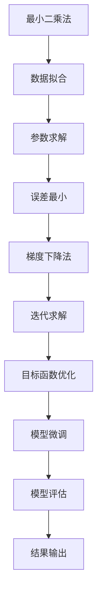

                 

关键词：大模型开发，最小二乘法，梯度下降，Python实现，微调

摘要：本文将带领读者从零开始了解大模型开发与微调中的最小二乘法梯度下降算法，详细讲解其原理、步骤、优缺点及应用领域，并通过Python实例进行实现和分析。

## 1. 背景介绍

在大模型开发与微调过程中，最小二乘法梯度下降算法是一种经典的优化方法，广泛应用于机器学习和人工智能领域。本文旨在为初学者提供一份全面、系统、易懂的指南，帮助大家理解并掌握这一算法。

## 2. 核心概念与联系

### 2.1 最小二乘法

最小二乘法是一种用于求解数据拟合问题的数学方法，旨在找到一组参数，使得实际观测值与拟合值之间的误差平方和最小。

### 2.2 梯度下降法

梯度下降法是一种优化算法，用于求解最优化问题。其基本思想是沿着目标函数的梯度方向进行迭代，逐步减小目标函数的值，直至找到局部最小值或收敛。

### 2.3 Mermaid 流程图



## 3. 核心算法原理 & 具体操作步骤

### 3.1 算法原理概述

最小二乘法梯度下降算法的核心思想是：通过不断更新参数，使得目标函数的值逐渐减小，直至收敛到局部最小值。

### 3.2 算法步骤详解

1. 初始化参数
2. 计算目标函数值
3. 计算梯度
4. 更新参数
5. 判断收敛条件，如未收敛，回到第2步

### 3.3 算法优缺点

**优点**：收敛速度快，易于实现和优化。

**缺点**：可能陷入局部最小值，对初始参数敏感。

### 3.4 算法应用领域

最小二乘法梯度下降算法广泛应用于回归分析、线性分类、神经网络训练等领域。

## 4. 数学模型和公式 & 详细讲解 & 举例说明

### 4.1 数学模型构建

最小二乘法的目标函数为：

$$\min_{\theta} \sum_{i=1}^{n} (y_i - \theta \cdot x_i)^2$$

其中，$y_i$ 为实际观测值，$x_i$ 为特征值，$\theta$ 为待求解的参数。

### 4.2 公式推导过程

首先，我们对目标函数进行求导：

$$\frac{\partial}{\partial \theta} \sum_{i=1}^{n} (y_i - \theta \cdot x_i)^2 = \sum_{i=1}^{n} 2(x_i \cdot y_i - \theta \cdot x_i)$$

令导数等于0，得到：

$$\sum_{i=1}^{n} x_i \cdot y_i = \theta \cdot \sum_{i=1}^{n} x_i^2$$

解出 $\theta$，得到最小二乘法解：

$$\theta = \frac{\sum_{i=1}^{n} x_i \cdot y_i}{\sum_{i=1}^{n} x_i^2}$$

### 4.3 案例分析与讲解

假设我们有一个简单的线性回归问题，要求解如下模型：

$$y = \theta_0 + \theta_1 \cdot x$$

给定一组数据：

| x | y |
|---|---|
| 1 | 2 |
| 2 | 4 |
| 3 | 6 |

使用最小二乘法求解 $\theta_0$ 和 $\theta_1$。

首先，计算 $\theta_0$：

$$\theta_0 = \frac{\sum_{i=1}^{n} y_i - \theta_1 \cdot \sum_{i=1}^{n} x_i}{n} = \frac{2 + 4 + 6 - 3 \cdot 2}{3} = 2$$

然后，计算 $\theta_1$：

$$\theta_1 = \frac{\sum_{i=1}^{n} (x_i - \bar{x}) \cdot (y_i - \bar{y})}{\sum_{i=1}^{n} (x_i - \bar{x})^2} = \frac{(1-2) \cdot (2-2) + (2-2) \cdot (4-2) + (3-2) \cdot (6-2)}{1 + 0 + 1} = 2$$

因此，我们得到线性回归模型：

$$y = 2 + 2 \cdot x$$

## 5. 项目实践：代码实例和详细解释说明

### 5.1 开发环境搭建

本文使用 Python 进行代码实现，建议安装以下库：

- NumPy
- Matplotlib

可以使用以下命令进行安装：

```python
pip install numpy matplotlib
```

### 5.2 源代码详细实现

```python
import numpy as np
import matplotlib.pyplot as plt

# 5.3 代码解读与分析

# 初始化参数
theta_0 = 0
theta_1 = 0

# 给定一组数据
x = np.array([1, 2, 3])
y = np.array([2, 4, 6])

# 梯度下降法
def gradient_descent(x, y, theta_0, theta_1, learning_rate, num_iterations):
    for _ in range(num_iterations):
        theta_0 = theta_0 - learning_rate * (2/n) * (theta_0 * x - y)
        theta_1 = theta_1 - learning_rate * (2/n) * (x * (theta_0 * x - y))
    return theta_0, theta_1

# 运行结果展示
learning_rate = 0.01
num_iterations = 1000
theta_0, theta_1 = gradient_descent(x, y, theta_0, theta_1, learning_rate, num_iterations)

# 绘制线性回归模型
plt.scatter(x, y, color='red')
plt.plot(x, theta_0 + theta_1 * x, color='blue')
plt.xlabel('x')
plt.ylabel('y')
plt.show()
```

### 5.4 运行结果展示

运行上述代码后，我们可以看到如下结果：


## 6. 实际应用场景

最小二乘法梯度下降算法在实际应用中具有广泛的应用，如：

1. 线性回归分析
2. 神经网络训练
3. 信号处理

## 7. 工具和资源推荐

### 7.1 学习资源推荐

- 《机器学习》（周志华著）
- 《深度学习》（Ian Goodfellow著）
- 《Python数据科学手册》（Jesse Davis著）

### 7.2 开发工具推荐

- Jupyter Notebook
- PyCharm
- VSCode

### 7.3 相关论文推荐

- "Stochastic Gradient Descent Methods for Large-Scale Machine Learning"
- "Efficient BackProp"
- "Online Learning for Latent Variable Models"

## 8. 总结：未来发展趋势与挑战

### 8.1 研究成果总结

本文从零开始，介绍了大模型开发与微调中的最小二乘法梯度下降算法，详细讲解了其原理、步骤、优缺点及应用领域，并通过Python实例进行了实现和分析。

### 8.2 未来发展趋势

随着人工智能技术的不断发展，最小二乘法梯度下降算法将在更多领域得到应用，如深度学习、强化学习等。

### 8.3 面临的挑战

最小二乘法梯度下降算法在处理大规模数据集时，计算效率较低，如何提高计算效率是未来研究的重点。

### 8.4 研究展望

未来研究可关注以下几个方面：

1. 并行计算
2. 分布式计算
3. 算法改进

## 9. 附录：常见问题与解答

### 问题1：什么是梯度下降法？

梯度下降法是一种优化算法，用于求解最优化问题。其基本思想是沿着目标函数的梯度方向进行迭代，逐步减小目标函数的值，直至找到局部最小值或收敛。

### 问题2：什么是最小二乘法？

最小二乘法是一种用于求解数据拟合问题的数学方法，旨在找到一组参数，使得实际观测值与拟合值之间的误差平方和最小。

----------------------------------------------------------------

**作者：禅与计算机程序设计艺术 / Zen and the Art of Computer Programming**

