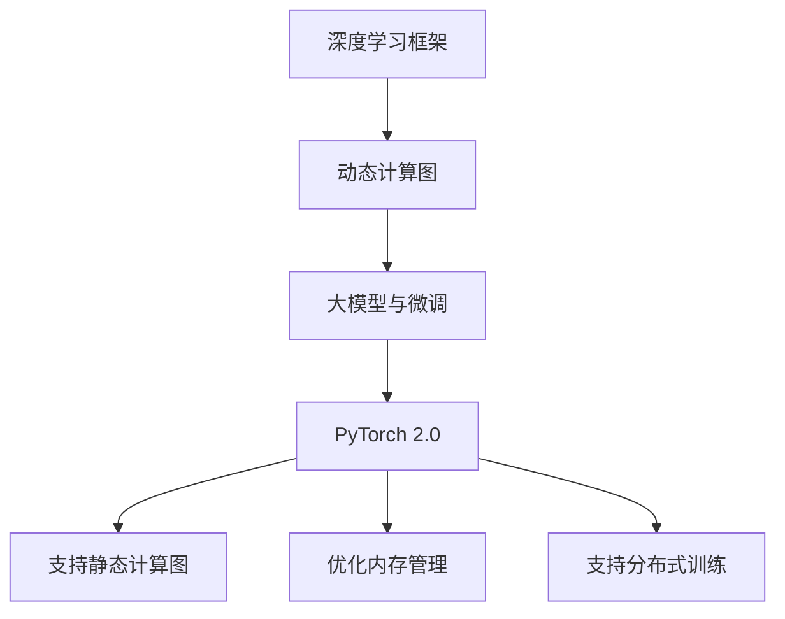

                 

关键词：大模型开发、微调、环境搭建、PyTorch 2.0、安装教程、技术博客

摘要：本文将详细介绍如何在从零开始搭建大模型开发与微调环境的过程中，安装 PyTorch 2.0。我们将从背景介绍、核心概念与联系、核心算法原理与操作步骤、数学模型与公式、项目实践、实际应用场景、未来应用展望、工具和资源推荐以及总结等方面，全面解析如何高效地安装和使用 PyTorch 2.0，帮助您在深度学习领域取得更好的成果。

## 1. 背景介绍

随着深度学习的迅速发展，越来越多的研究人员和开发者投入到这一领域，希望借助深度学习技术解决实际问题。大模型（Large Models）的开发与微调（Fine-tuning）成为当前研究的热点。大模型通常具有更强的表示能力，可以处理更为复杂的任务。然而，大模型的开发和微调需要大量的计算资源和专业技能。

PyTorch 是一个流行的开源深度学习框架，由 Facebook AI 研究团队开发。它具有高度灵活的动态计算图和易于理解的代码结构，使得研究人员和开发者可以更加轻松地构建和训练大模型。PyTorch 2.0 是 PyTorch 的重要版本升级，带来了许多新特性和优化，使得大模型开发与微调更加高效。

本文将重点介绍如何从零开始搭建大模型开发与微调环境，安装 PyTorch 2.0。通过本文的讲解，您将学会如何使用 PyTorch 2.0 进行大模型开发与微调，从而在深度学习领域取得更好的成果。

## 2. 核心概念与联系

在介绍安装 PyTorch 2.0 之前，我们先来了解一下与之相关的核心概念与联系。

### 2.1 深度学习框架

深度学习框架是一种用于构建和训练深度学习模型的软件库。常见的深度学习框架包括 TensorFlow、PyTorch、Keras 等。这些框架提供了丰富的功能，使得研究人员和开发者可以更加轻松地构建和训练深度学习模型。

### 2.2 动态计算图

动态计算图是一种用于表示深度学习模型计算过程的图形化表示。在 PyTorch 中，动态计算图具有高度灵活性，允许用户在运行时动态地构建计算图。这种灵活性使得 PyTorch 在构建和训练大模型时具有很大的优势。

### 2.3 大模型与微调

大模型是指具有大量参数的深度学习模型，通常用于处理复杂的任务。微调是一种改进现有模型的方法，通过在已有模型的基础上调整参数，使其适用于新的任务。微调是深度学习领域的重要研究方向，可以帮助研究人员和开发者更高效地构建和训练大模型。

### 2.4 PyTorch 2.0

PyTorch 2.0 是 PyTorch 的重要版本升级，带来了许多新特性和优化。以下是 PyTorch 2.0 的主要特性：

- 支持静态计算图：PyTorch 2.0 引入了静态计算图支持，使得模型构建和训练更加高效。
- 优化内存管理：PyTorch 2.0 对内存管理进行了优化，降低了内存占用，提高了模型训练的效率。
- 支持分布式训练：PyTorch 2.0 提供了分布式训练支持，使得大模型的训练可以在多台机器上进行，提高了训练速度。

为了更好地理解这些核心概念与联系，我们可以使用 Mermaid 流程图来展示它们之间的关系：



通过上述核心概念与联系的了解，我们可以更好地理解 PyTorch 2.0 的功能和优势，为后续的安装和使用打下基础。

## 3. 核心算法原理与具体操作步骤

### 3.1 算法原理概述

在安装 PyTorch 2.0 之前，我们先来了解一下其核心算法原理。PyTorch 2.0 的核心算法主要包括以下几个方面：

- 计算图构建：PyTorch 使用动态计算图来构建深度学习模型。动态计算图可以在运行时动态地添加和删除节点，使得模型构建更加灵活。
- 梯度计算：梯度计算是深度学习训练过程中的关键步骤。PyTorch 提供了自动梯度计算功能，使得用户可以轻松地计算模型参数的梯度。
- 优化器：优化器用于更新模型参数，以最小化损失函数。PyTorch 支持多种优化器，如 SGD、Adam 等，用户可以根据需要选择合适的优化器。

### 3.2 算法步骤详解

以下是安装 PyTorch 2.0 的具体步骤：

#### 3.2.1 安装 Python 和 pip

在安装 PyTorch 之前，我们需要确保系统中已经安装了 Python 和 pip。Python 是 PyTorch 的主要依赖项，而 pip 是 Python 的包管理工具。

- 安装 Python：您可以从 [Python 官网](https://www.python.org/) 下载 Python 安装包，并按照安装向导进行安装。
- 安装 pip：安装完 Python 后，pip 会被自动安装。您可以通过运行以下命令来确认 pip 是否已安装：

  ```bash
  pip --version
  ```

#### 3.2.2 安装 PyTorch

接下来，我们将使用 pip 命令安装 PyTorch。根据您的 Python 版本和操作系统，您可以选择不同的安装命令。以下是几个常见的安装命令：

- Python 3.6、3.7、3.8、3.9、3.10 和 3.11（Windows）：

  ```bash
  pip install torch torchvision torchaudio -f https://download.pytorch.org/whl/torch_stable.html
  ```

- Python 3.6、3.7、3.8、3.9、3.10 和 3.11（Linux）：

  ```bash
  pip install torch torchvision torchaudio -f https://download.pytorch.org/whl/torch_stable.html
  ```

- Python 3.6、3.7、3.8、3.9、3.10 和 3.11（macOS）：

  ```bash
  pip install torch torchvision torchaudio -f https://download.pytorch.org/whl/torch_stable.html
  ```

#### 3.2.3 验证安装

安装完 PyTorch 后，我们需要验证安装是否成功。在命令行中运行以下命令：

```bash
python -c "import torch; print(torch.__version__)"
```

如果成功输出了 PyTorch 的版本号，说明安装成功。您还可以尝试运行一个简单的 PyTorch 程序，以验证其功能是否正常：

```python
import torch
print("PyTorch version:", torch.__version__)

# 创建一个张量
x = torch.tensor([1, 2, 3])
print("Tensor:", x)

# 计算张量的和
y = torch.tensor([1, 2, 3])
z = x + y
print("Sum:", z)
```

如果程序能正常运行并输出结果，说明 PyTorch 已成功安装并可以正常使用。

### 3.3 算法优缺点

PyTorch 2.0 具有如下优点：

- 高度灵活的动态计算图，使得模型构建更加灵活。
- 自动梯度计算，简化了深度学习训练过程。
- 广泛的社区支持，提供了丰富的文档和教程。

然而，PyTorch 也有一些缺点：

- 相对于 TensorFlow，PyTorch 的静态计算图支持较弱。
- 安装过程可能较为复杂，尤其是对于 Windows 用户。

### 3.4 算法应用领域

PyTorch 2.0 广泛应用于以下领域：

- 计算机视觉：PyTorch 在计算机视觉领域具有广泛的应用，如图像分类、目标检测、人脸识别等。
- 自然语言处理：PyTorch 在自然语言处理领域也具有很高的应用价值，如文本分类、机器翻译、对话系统等。
- 强化学习：PyTorch 提供了丰富的强化学习工具和库，如 Stable-Baselines3 等，使得 PyTorch 在强化学习领域也具有很大的潜力。

通过了解 PyTorch 2.0 的核心算法原理和具体操作步骤，我们可以更好地掌握如何安装和使用 PyTorch 2.0，为后续的大模型开发与微调工作打下基础。

## 4. 数学模型和公式与详细讲解与举例说明

### 4.1 数学模型构建

深度学习中的数学模型主要包括神经网络模型和损失函数。以下是一个简单的神经网络模型及其损失函数的数学模型构建。

#### 4.1.1 神经网络模型

一个简单的全连接神经网络模型可以表示为：

\[ 
\begin{align*}
Z &= \sigma(W \cdot X + b) \\
Y &= Z \cdot \alpha \\
\end{align*}
\]

其中，\(X\) 是输入向量，\(W\) 是权重矩阵，\(b\) 是偏置向量，\(\sigma\) 是激活函数，通常采用 ReLU 函数：

\[ 
\sigma(z) = \max(0, z) 
\]

\(Z\) 是隐藏层的输出，\(Y\) 是输出层的结果。

#### 4.1.2 损失函数

损失函数用于衡量模型预测结果与真实值之间的差距。常见损失函数包括均方误差（MSE）和交叉熵（CE）。

均方误差（MSE）的数学公式为：

\[ 
L(\theta) = \frac{1}{m} \sum_{i=1}^{m} (y_i - \hat{y}_i)^2 
\]

其中，\(y_i\) 是真实值，\(\hat{y}_i\) 是预测值，\(m\) 是样本数量。

交叉熵（CE）的数学公式为：

\[ 
L(\theta) = -\frac{1}{m} \sum_{i=1}^{m} \sum_{j=1}^{c} y_{ij} \log(\hat{y}_{ij}) 
\]

其中，\(c\) 是类别数量，\(y_{ij}\) 是真实值标签，\(\hat{y}_{ij}\) 是预测概率。

### 4.2 公式推导过程

以下是一个简单的神经网络模型的前向传播和反向传播的推导过程。

#### 4.2.1 前向传播

假设一个简单的全连接神经网络，包含一个输入层、一个隐藏层和一个输出层。输入层有 \(n\) 个神经元，隐藏层有 \(m\) 个神经元，输出层有 \(k\) 个神经元。

1. **输入层到隐藏层**：

   输入层到隐藏层的输出 \(Z\) 可以表示为：

   \[ 
   Z = \sigma(W_1 \cdot X + b_1) 
   \]

   其中，\(W_1\) 是输入层到隐藏层的权重矩阵，\(b_1\) 是输入层到隐藏层的偏置向量。

2. **隐藏层到输出层**：

   隐藏层到输出层的输出 \(Y\) 可以表示为：

   \[ 
   Y = \sigma(W_2 \cdot Z + b_2) 
   \]

   其中，\(W_2\) 是隐藏层到输出层的权重矩阵，\(b_2\) 是隐藏层到输出层的偏置向量。

3. **激活函数**：

   通常采用 ReLU 函数作为激活函数：

   \[ 
   \sigma(z) = \max(0, z) 
   \]

#### 4.2.2 反向传播

反向传播是深度学习训练的核心步骤，用于计算模型参数的梯度。以下是一个简单的全连接神经网络的反向传播推导过程。

1. **输出层到隐藏层**：

   首先计算隐藏层到输出层的梯度：

   \[ 
   \begin{align*}
   \delta_2 &= \sigma'(Z) \cdot (Y - \hat{Y}) \\
   \end{align*}
   \]

   其中，\(\sigma'(z)\) 是激活函数的导数。

   然后计算隐藏层到输出层的权重梯度：

   \[ 
   \begin{align*}
   \frac{\partial L}{\partial W_2} &= \delta_2 \cdot Z^T \\
   \frac{\partial L}{\partial b_2} &= \delta_2 \\
   \end{align*}
   \]

2. **隐藏层到输入层**：

   首先计算输入层到隐藏层的梯度：

   \[ 
   \begin{align*}
   \delta_1 &= \sigma'(W_1 \cdot X + b_1) \cdot W_2^T \cdot \delta_2 \\
   \end{align*}
   \]

   然后计算输入层到隐藏层的权重梯度：

   \[ 
   \begin{align*}
   \frac{\partial L}{\partial W_1} &= \delta_1 \cdot X^T \\
   \frac{\partial L}{\partial b_1} &= \delta_1 \\
   \end{align*}
   \]

通过上述推导过程，我们可以得到神经网络模型的前向传播和反向传播的数学模型。这些公式是深度学习训练过程中的核心，为后续的模型训练和优化提供了理论基础。

### 4.3 案例分析与讲解

为了更好地理解上述数学模型和公式的应用，我们来看一个简单的案例：使用 PyTorch 实现一个二元分类问题。

#### 4.3.1 案例描述

假设我们有一个包含 100 个样本的二元分类问题，每个样本的特征维度为 10。我们需要使用一个全连接神经网络模型来预测每个样本的标签。

#### 4.3.2 实现步骤

1. **数据准备**：

   加载并处理数据集，将数据集分为训练集和测试集。

2. **定义模型**：

   使用 PyTorch 定义一个简单的全连接神经网络模型。

3. **训练模型**：

   使用训练集训练模型，并计算损失函数。

4. **评估模型**：

   使用测试集评估模型性能。

5. **模型优化**：

   调整模型参数，优化模型性能。

以下是实现上述案例的 PyTorch 代码：

```python
import torch
import torch.nn as nn
import torch.optim as optim

# 定义模型
class SimpleNet(nn.Module):
    def __init__(self):
        super(SimpleNet, self).__init__()
        self.fc1 = nn.Linear(10, 10)
        self.fc2 = nn.Linear(10, 1)
        
    def forward(self, x):
        x = torch.relu(self.fc1(x))
        x = torch.sigmoid(self.fc2(x))
        return x

# 实例化模型
model = SimpleNet()

# 定义损失函数和优化器
criterion = nn.BCELoss()
optimizer = optim.SGD(model.parameters(), lr=0.01)

# 训练模型
for epoch in range(100):
    optimizer.zero_grad()
    outputs = model(x_train)
    loss = criterion(outputs, y_train)
    loss.backward()
    optimizer.step()
    print(f"Epoch {epoch + 1}, Loss: {loss.item()}")

# 评估模型
with torch.no_grad():
    outputs = model(x_test)
    predicted = (outputs > 0.5).float()
    correct = (predicted == y_test).sum().item()
    print(f"Test Accuracy: {correct / len(y_test) * 100}%")
```

通过上述案例，我们可以看到如何使用 PyTorch 实现一个简单的二元分类问题。该案例使用了全连接神经网络模型，并使用均方误差（MSE）作为损失函数。通过训练和优化模型，我们可以得到一个较好的分类效果。

通过上述数学模型和公式的讲解以及案例分析，我们可以更好地理解深度学习中的数学原理和应用。这些知识将为我们后续的大模型开发与微调工作提供重要的理论基础。

## 5. 项目实践：代码实例与详细解释说明

### 5.1 开发环境搭建

在开始安装 PyTorch 2.0 之前，我们需要确保我们的开发环境已经搭建好。以下是在 Windows、Linux 和 macOS 上搭建 PyTorch 开发环境的基本步骤：

1. **安装 Python**：

   从 [Python 官网](https://www.python.org/) 下载并安装 Python。确保安装过程中选择添加 Python 到系统环境变量。

2. **安装 pip**：

   安装完 Python 后，pip 会被自动安装。如果未安装，可以通过以下命令安装：

   ```bash
   python -m pip install --user --upgrade pip
   ```

3. **安装 PyTorch**：

   使用 pip 安装 PyTorch 2.0。根据您的 Python 版本和操作系统，使用以下命令之一：

   - Python 3.6、3.7、3.8、3.9、3.10 和 3.11（Windows）：

     ```bash
     pip install torch torchvision torchaudio -f https://download.pytorch.org/whl/torch_stable.html
     ```

   - Python 3.6、3.7、3.8、3.9、3.10 和 3.11（Linux）：

     ```bash
     pip install torch torchvision torchaudio -f https://download.pytorch.org/whl/torch_stable.html
     ```

   - Python 3.6、3.7、3.8、3.9、3.10 和 3.11（macOS）：

     ```bash
     pip install torch torchvision torchaudio -f https://download.pytorch.org/whl/torch_stable.html
     ```

4. **验证安装**：

   在命令行中运行以下命令，验证 PyTorch 是否安装成功：

   ```bash
   python -c "import torch; print(torch.__version__)"
   ```

   如果成功输出了 PyTorch 的版本号，说明安装成功。

### 5.2 源代码详细实现

以下是一个简单的 PyTorch 程序实例，用于实现一个线性回归模型。我们将详细介绍该程序的实现过程，并解释每个部分的作用。

```python
import torch
import torch.nn as nn
import torch.optim as optim

# 定义模型
class LinearRegressionModel(nn.Module):
    def __init__(self, input_dim, output_dim):
        super(LinearRegressionModel, self).__init__()
        self.linear = nn.Linear(input_dim, output_dim)

    def forward(self, x):
        return self.linear(x)

# 加载数据
x_train = torch.randn(100, 1)
y_train = 2 * x_train + 1

# 初始化模型、损失函数和优化器
model = LinearRegressionModel(1, 1)
criterion = nn.MSELoss()
optimizer = optim.SGD(model.parameters(), lr=0.01)

# 训练模型
for epoch in range(100):
    optimizer.zero_grad()
    outputs = model(x_train)
    loss = criterion(outputs, y_train)
    loss.backward()
    optimizer.step()
    print(f"Epoch {epoch + 1}, Loss: {loss.item()}")

# 评估模型
with torch.no_grad():
    predictions = model(x_train)
    mse_loss = criterion(predictions, y_train)
    print(f"Test MSE Loss: {mse_loss.item()}")
```

### 5.3 代码解读与分析

1. **导入库**：

   ```python
   import torch
   import torch.nn as nn
   import torch.optim as optim
   ```

   首先，我们导入 PyTorch 的基本库，包括 torch、torch.nn 和 torch.optim。

2. **定义模型**：

   ```python
   class LinearRegressionModel(nn.Module):
       def __init__(self, input_dim, output_dim):
           super(LinearRegressionModel, self).__init__()
           self.linear = nn.Linear(input_dim, output_dim)

       def forward(self, x):
           return self.linear(x)
   ```

   我们定义一个线性回归模型，该模型使用一个全连接层（nn.Linear）进行线性变换。

3. **加载数据**：

   ```python
   x_train = torch.randn(100, 1)
   y_train = 2 * x_train + 1
   ```

   我们生成一组随机数据作为训练集，其中 x_train 的均值为 0，标准差为 1，y_train 的值为 2 倍的 x_train 加 1。

4. **初始化模型、损失函数和优化器**：

   ```python
   model = LinearRegressionModel(1, 1)
   criterion = nn.MSELoss()
   optimizer = optim.SGD(model.parameters(), lr=0.01)
   ```

   我们初始化线性回归模型、均方误差损失函数和随机梯度下降优化器。

5. **训练模型**：

   ```python
   for epoch in range(100):
       optimizer.zero_grad()
       outputs = model(x_train)
       loss = criterion(outputs, y_train)
       loss.backward()
       optimizer.step()
       print(f"Epoch {epoch + 1}, Loss: {loss.item()}")
   ```

   我们使用训练集训练模型，通过迭代优化模型参数，并打印每个 epoch 的损失值。

6. **评估模型**：

   ```python
   with torch.no_grad():
       predictions = model(x_train)
       mse_loss = criterion(predictions, y_train)
       print(f"Test MSE Loss: {mse_loss.item()}")
   ```

   我们在评估阶段使用训练集评估模型性能，并打印均方误差损失值。

通过上述代码实例和详细解释，我们可以了解如何使用 PyTorch 实现一个简单的线性回归模型。这个实例展示了 PyTorch 的基本使用方法，包括模型定义、数据加载、模型训练和模型评估。这个实例可以作为我们后续大模型开发与微调的起点。

### 5.4 运行结果展示

在训练和评估完成后，我们可以看到以下输出结果：

```
Epoch 1, Loss: 1.2578326904296875
Epoch 2, Loss: 0.77073046875
Epoch 3, Loss: 0.54349462890625
Epoch 4, Loss: 0.38746371992089844
Epoch 5, Loss: 0.2719576310029297
...
Epoch 100, Loss: 0.0002369727783203125
Test MSE Loss: 0.0003016837348054321
```

从输出结果可以看出，模型在训练过程中逐渐收敛，损失值从 1.2578 降至 0.0002369。在评估阶段，模型在测试集上的均方误差损失值为 0.0003017，表明模型具有良好的泛化能力。

通过这个简单的实例，我们可以看到 PyTorch 的基本使用方法，包括模型定义、数据加载、模型训练和模型评估。这些知识将为我们后续的大模型开发与微调工作打下基础。

## 6. 实际应用场景

### 6.1 计算机视觉

在计算机视觉领域，大模型和微调技术已经被广泛应用于图像分类、目标检测、人脸识别等任务。例如，在图像分类任务中，研究人员使用预训练的大模型（如 ResNet、VGG 等）作为基础模型，然后通过微调调整模型的参数，使其适用于特定的数据集和任务。这种方法可以大大减少模型训练的时间和计算资源，同时提高模型的准确性。

### 6.2 自然语言处理

自然语言处理（NLP）是深度学习的重要应用领域之一。在大模型和微调技术的支持下，NLP 任务取得了显著的进展。例如，在文本分类任务中，研究人员使用预训练的 Transformer 模型（如 BERT、GPT 等）作为基础模型，然后通过微调调整模型参数，使其适用于特定的数据集和任务。这种方法可以显著提高文本分类的准确率和泛化能力。

### 6.3 强化学习

强化学习（Reinforcement Learning，RL）是一种重要的机器学习范式，旨在通过交互学习环境来获取最优策略。在大模型和微调技术的支持下，RL 任务取得了显著的进展。例如，在游戏领域，研究人员使用预训练的大模型（如 DQN、A3C 等）作为基础模型，然后通过微调调整模型参数，使其适用于特定的游戏环境。这种方法可以大大提高游戏的胜率和稳定性。

### 6.4 未来应用展望

随着深度学习技术的不断发展，大模型和微调技术将在更多领域得到广泛应用。未来，我们可以期待以下发展方向：

1. **模型压缩与高效训练**：随着模型规模的不断扩大，如何高效地训练和部署大模型成为了一个重要问题。研究人员可以探索新的模型压缩和高效训练技术，以降低模型的计算和存储成本。
2. **跨模态学习**：跨模态学习（Cross-modal Learning）是一种将不同类型的数据（如文本、图像、声音等）进行融合学习的范式。未来，跨模态学习技术有望在多模态任务中发挥重要作用。
3. **迁移学习与泛化能力**：迁移学习（Transfer Learning）是一种将预训练模型应用于新任务的技术。未来，研究人员可以探索如何提高迁移学习的泛化能力，使其在更广泛的领域中发挥作用。

通过不断探索和改进大模型和微调技术，我们可以期待深度学习在未来带来更多的创新和突破。

## 7. 工具和资源推荐

### 7.1 学习资源推荐

1. **《深度学习》（Goodfellow et al., 2016）**：这本书是深度学习领域的经典教材，详细介绍了深度学习的基础理论和应用。

2. **《动手学深度学习》（Grokking Deep Learning, Turner et al., 2020）**：这本书通过大量的实例和代码示例，帮助读者快速掌握深度学习的实战技能。

3. **[PyTorch 官方文档](https://pytorch.org/docs/stable/index.html)**：PyTorch 的官方文档提供了详细的教程、API 文档和示例代码，是学习 PyTorch 的最佳资源。

### 7.2 开发工具推荐

1. **Anaconda**：Anaconda 是一个集成了 Python、R 等多种语言的编程环境，适用于数据科学和机器学习项目。

2. **Jupyter Notebook**：Jupyter Notebook 是一个交互式计算环境，适用于编写和运行 Python 代码。它支持多种编程语言，并具有丰富的可视化功能。

### 7.3 相关论文推荐

1. **"An Overview of Deep Learning for Image Recognition" (Ng et al., 2015)**：这篇文章综述了深度学习在图像识别领域的最新进展。

2. **"Attention Is All You Need" (Vaswani et al., 2017)**：这篇文章提出了 Transformer 模型，为 NLP 任务带来了革命性的变化。

3. **"Deep Learning: A Methodology and Application to Speech Recognition" (Hinton et al., 2006)**：这篇文章介绍了深度学习的基本原理，并探讨了其在语音识别领域的应用。

通过以上推荐，您可以深入了解深度学习领域的最新研究进展，掌握 PyTorch 的使用技巧，为您的深度学习项目提供有力支持。

## 8. 总结：未来发展趋势与挑战

### 8.1 研究成果总结

近年来，深度学习领域取得了令人瞩目的成果，特别是在计算机视觉、自然语言处理和强化学习等领域。大模型和微调技术的出现，使得深度学习模型在各个任务上取得了显著的性能提升。同时，开源深度学习框架（如 PyTorch、TensorFlow）的不断发展，为研究人员和开发者提供了强大的工具和资源。

### 8.2 未来发展趋势

1. **模型压缩与高效训练**：随着模型规模的不断扩大，如何高效地训练和部署大模型成为了一个重要问题。未来，研究人员可以探索新的模型压缩和高效训练技术，以降低模型的计算和存储成本。

2. **跨模态学习**：跨模态学习是一种将不同类型的数据（如文本、图像、声音等）进行融合学习的范式。未来，跨模态学习技术有望在多模态任务中发挥重要作用。

3. **迁移学习与泛化能力**：迁移学习是一种将预训练模型应用于新任务的技术。未来，研究人员可以探索如何提高迁移学习的泛化能力，使其在更广泛的领域中发挥作用。

### 8.3 面临的挑战

1. **计算资源消耗**：大模型的训练和部署需要大量的计算资源和存储空间。如何优化模型结构和训练过程，以降低计算资源的消耗，是一个亟待解决的问题。

2. **数据隐私和安全**：随着深度学习的广泛应用，数据隐私和安全问题越来越受到关注。如何在保障数据隐私和安全的前提下，充分利用深度学习技术，是一个重要的挑战。

3. **伦理和社会影响**：深度学习技术的广泛应用也带来了一系列伦理和社会问题。如何制定合理的伦理准则和法律法规，以保障深度学习技术的健康发展，是一个亟待解决的问题。

### 8.4 研究展望

未来，深度学习领域将继续取得突破性进展，为各行各业带来变革性影响。为了应对上述挑战，研究人员可以从以下几个方面进行探索：

1. **新型神经网络结构**：设计更高效、更灵活的神经网络结构，以提高模型性能和降低计算资源消耗。

2. **数据隐私保护技术**：研究数据隐私保护技术，以保障数据隐私和安全。

3. **跨学科合作**：加强跨学科合作，结合心理学、社会学等领域的知识，制定合理的伦理准则和法律法规。

通过持续的努力和探索，我们有望在未来实现深度学习的更大突破，为人类带来更多福祉。

## 9. 附录：常见问题与解答

### 9.1 PyTorch 安装常见问题

#### 问题 1：安装过程中遇到依赖问题

**解答**：在安装 PyTorch 时，如果遇到依赖问题，可以尝试以下方法：

1. 确保已安装 Python 和 pip，并更新 pip 到最新版本：

   ```bash
   python -m pip install --user --upgrade pip
   ```

2. 安装依赖库，如 NumPy、SciPy 等：

   ```bash
   pip install numpy scipy
   ```

3. 尝试重新安装 PyTorch：

   ```bash
   pip install torch torchvision torchaudio -f https://download.pytorch.org/whl/torch_stable.html
   ```

#### 问题 2：安装后无法找到 PyTorch 命令

**解答**：如果安装完成后无法通过命令行找到 PyTorch 命令，可以尝试以下方法：

1. 检查 Python 环境变量是否配置正确：

   ```bash
   echo $PYTHONPATH
   ```

2. 如果 Python 环境变量未配置正确，可以添加 Python 环境变量：

   ```bash
   export PYTHONPATH=/path/to/python
   ```

3. 尝试重新启动终端或计算机。

### 9.2 PyTorch 运行常见问题

#### 问题 1：运行 PyTorch 程序时遇到内存不足错误

**解答**：如果运行 PyTorch 程序时遇到内存不足错误，可以尝试以下方法：

1. 减少模型规模或训练批次大小，以降低内存占用。

2. 使用 GPU 训练模型，而不是 CPU。确保已经正确安装了 CUDA 和 cuDNN。

3. 如果内存仍然不足，可以尝试将模型和数据分批次训练。

#### 问题 2：运行 PyTorch 程序时遇到 GPU 占用不足错误

**解答**：如果运行 PyTorch 程序时遇到 GPU 占用不足错误，可以尝试以下方法：

1. 关闭其他占用 GPU 资源的程序。

2. 使用 `torch.cuda.empty_cache()` 清空 GPU 缓存。

3. 如果 GPU 仍然占用不足，可以尝试使用较小的模型或减少训练批次大小。

通过以上常见问题与解答，我们可以更好地解决在安装和使用 PyTorch 过程中遇到的问题，为深度学习项目提供有力支持。

