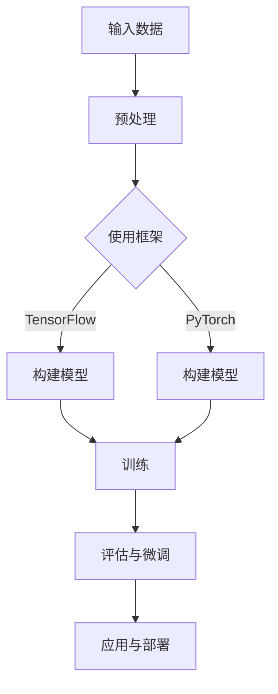

                 

### 1. 背景介绍

随着深度学习技术的飞速发展，大型神经网络模型（大模型）的构建与微调成为了人工智能领域的热点。从零开始开发与微调大模型，不仅要求研究者具备深厚的理论知识，还需要掌握一系列的实践技能。本文旨在为广大深度学习爱好者提供一个系统性的指导，帮助读者从零开始搭建并微调大模型。

近年来，大型神经网络在自然语言处理、计算机视觉、语音识别等领域取得了显著成果。例如，BERT、GPT-3等语言模型在诸多任务中超越了传统的机器学习方法。然而，大模型的训练与微调过程复杂且资源消耗巨大，需要高效的神经网络框架支持。本文将介绍如何利用现有的神经网络框架实现大模型的开发与微调，探讨其核心算法原理、数学模型、项目实践，并展望未来发展趋势。

本文结构如下：

- **1. 背景介绍**：阐述大模型开发与微调的重要性和当前的研究热点。
- **2. 核心概念与联系**：介绍神经网络的基础概念和相关技术，并使用 Mermaid 流程图展示架构。
- **3. 核心算法原理 & 具体操作步骤**：详细解析大模型算法原理和操作步骤。
- **4. 数学模型和公式 & 详细讲解 & 举例说明**：介绍大模型的数学模型、公式推导及案例讲解。
- **5. 项目实践：代码实例和详细解释说明**：通过实际项目展示如何搭建和微调大模型。
- **6. 实际应用场景**：探讨大模型在不同领域的应用及未来展望。
- **7. 工具和资源推荐**：推荐相关学习资源、开发工具和论文。
- **8. 总结：未来发展趋势与挑战**：总结研究成果，探讨未来发展。
- **9. 附录：常见问题与解答**：回答读者可能遇到的问题。

### 2. 核心概念与联系

#### 2.1 神经网络基础

神经网络（Neural Networks，NN）是一种模拟人脑神经元连接结构的计算模型，其核心思想是通过调整网络中的权重参数，实现对输入数据的自动特征学习和分类。神经网络主要由以下几个基本组成部分构成：

- **神经元（Neurons）**：神经网络的基本计算单元，用于接收输入、产生输出。
- **层（Layers）**：神经网络中的一系列神经元，分为输入层、隐藏层和输出层。
- **权重（Weights）**：神经元之间的连接强度，用于传递信号。
- **激活函数（Activation Functions）**：对神经元输出进行非线性变换。

#### 2.2 深度学习框架

深度学习框架（Deep Learning Framework）是支持深度学习模型开发和训练的软件工具，其目的是简化模型开发流程、提高开发效率。常见的深度学习框架有 TensorFlow、PyTorch、Keras 等。

- **TensorFlow**：由 Google 开发，支持多种编程语言，拥有丰富的预训练模型和扩展库。
- **PyTorch**：基于 Python 的深度学习框架，具有动态计算图和灵活的接口，适用于研究和开发。
- **Keras**：基于 TensorFlow 的简单易用的深度学习库，支持快速原型设计和实验。

#### 2.3 大模型架构

大模型通常具有以下几个特点：

- **大规模参数**：大模型的参数量通常达到百万甚至亿级别，这要求模型能够高效地存储和计算。
- **深度结构**：大模型通常具有较深的网络结构，以便捕捉复杂的数据特征。
- **分布式训练**：为了加速训练过程，大模型通常采用分布式训练策略，将计算任务分布在多个计算节点上。

下面是一个使用 Mermaid 流程图表示的神经网络框架的架构：



### 3. 核心算法原理 & 具体操作步骤

#### 3.1 算法原理概述

大模型的训练主要依赖于深度学习中的优化算法，如随机梯度下降（SGD）和自适应优化器（如 Adam）。这些算法通过不断调整模型参数，最小化损失函数，使模型能够准确预测输入数据。

- **随机梯度下降（SGD）**：每次迭代使用一个样本来更新模型参数。
- **Adam**：结合了 AdaGrad 和 RMSProp 的优点，自动调整学习率。

#### 3.2 算法步骤详解

1. **数据预处理**：对输入数据（如图像、文本等）进行预处理，如归一化、数据增强等。
2. **模型构建**：根据任务需求，使用深度学习框架构建神经网络模型。
3. **模型训练**：
   - 初始化模型参数。
   - 计算损失函数值。
   - 使用优化算法更新模型参数。
   - 记录训练过程中的损失函数值和模型参数。
4. **模型评估**：在验证集上评估模型性能，调整模型结构或参数。
5. **模型微调**：在训练集上进行迭代训练，逐步优化模型。

#### 3.3 算法优缺点

- **优点**：
  - 高效：分布式训练可以显著加速训练过程。
  - 灵活：深度学习框架提供了丰富的模型构建和优化工具。
  - 自动化：自动化优化器简化了模型训练过程。
- **缺点**：
  - 资源消耗：大模型训练需要大量计算资源和存储空间。
  - 难以调试：深度学习模型容易出现过拟合等问题，需要大量实验和调试。

#### 3.4 算法应用领域

大模型在多个领域取得了显著成果，包括：

- **自然语言处理**：如机器翻译、文本生成等。
- **计算机视觉**：如图像分类、目标检测等。
- **语音识别**：如语音识别、说话人识别等。
- **推荐系统**：如商品推荐、社交推荐等。

### 4. 数学模型和公式 & 详细讲解 & 举例说明

#### 4.1 数学模型构建

深度学习模型的数学基础主要包括线性代数、微积分和概率论。以下是构建深度学习模型所需的核心数学模型：

- **线性代数**：矩阵运算、向量计算等。
- **微积分**：导数、梯度等。
- **概率论**：概率分布、期望、方差等。

#### 4.2 公式推导过程

以多层感知机（MLP）为例，介绍其数学模型和公式推导过程：

1. **输入层到隐藏层的映射**：

$$
h_{ij}^{(l)} = \sum_{k=1}^{n} w_{ik}^{(l)} x_{k} + b_{j}^{(l)}
$$

其中，$h_{ij}^{(l)}$表示第$l$层的第$i$个神经元到第$l+1$层的第$j$个神经元的连接权重，$x_{k}$表示输入层的第$k$个特征，$b_{j}^{(l)}$表示第$l$层的第$j$个神经元的偏置。

2. **隐藏层到输出层的映射**：

$$
y_{j}^{(L)} = \sigma \left( \sum_{i=1}^{n} w_{ij}^{(L)} h_{i}^{(L-1)} + b_{j}^{(L)} \right)
$$

其中，$y_{j}^{(L)}$表示输出层的第$j$个神经元的输出，$\sigma$表示激活函数，通常为 Sigmoid、ReLU 或 Tanh 函数。

#### 4.3 案例分析与讲解

以图像分类任务为例，介绍如何使用深度学习模型进行图像分类：

1. **数据预处理**：

   - 将图像缩放到固定大小，如 $224 \times 224$ 像素。
   - 将图像归一化，使其具有均值 $0$ 和方差 $1$。

2. **模型构建**：

   - 使用卷积神经网络（CNN）提取图像特征。
   - 使用全连接层（Fully Connected Layer）进行分类。

3. **模型训练**：

   - 初始化模型参数。
   - 使用训练数据对模型进行迭代训练。
   - 记录训练过程中的损失函数值和准确率。

4. **模型评估**：

   - 使用验证集对模型进行评估。
   - 调整模型结构或参数，以提高模型性能。

### 5. 项目实践：代码实例和详细解释说明

#### 5.1 开发环境搭建

1. **安装深度学习框架**：

   - Python 3.7 或更高版本。
   - 安装 TensorFlow 或 PyTorch。

   ```python
   pip install tensorflow  # 安装 TensorFlow
   pip install torch       # 安装 PyTorch
   ```

2. **创建项目文件夹**：

   - 创建一个包含代码文件、数据文件和日志文件的文件夹。

#### 5.2 源代码详细实现

以下是一个简单的图像分类模型的代码实现：

```python
import tensorflow as tf
from tensorflow.keras.models import Sequential
from tensorflow.keras.layers import Conv2D, MaxPooling2D, Flatten, Dense

# 创建模型
model = Sequential([
    Conv2D(32, (3, 3), activation='relu', input_shape=(224, 224, 3)),
    MaxPooling2D((2, 2)),
    Flatten(),
    Dense(128, activation='relu'),
    Dense(10, activation='softmax')
])

# 编译模型
model.compile(optimizer='adam', loss='categorical_crossentropy', metrics=['accuracy'])

# 训练模型
model.fit(train_images, train_labels, epochs=10, validation_data=(val_images, val_labels))

# 评估模型
test_loss, test_acc = model.evaluate(test_images, test_labels)
print(f"Test accuracy: {test_acc:.2f}")
```

#### 5.3 代码解读与分析

1. **模型构建**：

   - 使用 `Sequential` 模型堆叠多个层，包括卷积层（`Conv2D`）、最大池化层（`MaxPooling2D`）、全连接层（`Dense`）。
   - 设置输入层的大小为 $224 \times 224 \times 3$，表示图像的尺寸和通道数。

2. **编译模型**：

   - 设置优化器为 `adam`，损失函数为 `categorical_crossentropy`，评价指标为 `accuracy`。

3. **训练模型**：

   - 使用 `fit` 方法进行迭代训练，设置训练轮数为 `epochs`。
   - 使用 `validation_data` 参数进行验证集训练。

4. **评估模型**：

   - 使用 `evaluate` 方法评估模型在测试集上的性能。

### 6. 实际应用场景

#### 6.1 自然语言处理

大模型在自然语言处理领域取得了显著成果，如 BERT、GPT-3 等。这些模型可以用于文本分类、情感分析、机器翻译等任务。例如，BERT 模型在 GLUE 基准测试中取得了优异的性能，GPT-3 模型可以实现自然流畅的文本生成。

#### 6.2 计算机视觉

大模型在计算机视觉领域也发挥着重要作用，如 ImageNet 图像分类任务。使用 ResNet、Inception 等大模型，可以实现高精度的图像分类、目标检测等任务。此外，大模型还可以用于图像生成、视频分割等任务。

#### 6.3 语音识别

大模型在语音识别领域取得了突破性进展，如 WaveNet、Transformer 等。这些模型可以用于语音合成、语音识别、说话人识别等任务，提高了语音识别的准确率和自然度。

#### 6.4 未来应用展望

随着深度学习技术的不断进步，大模型在更多领域将得到广泛应用。例如，医疗领域的大模型可以用于疾病诊断、药物研发；金融领域的大模型可以用于风险控制、投资策略等。未来，大模型将进一步推动人工智能技术的发展，为社会带来更多价值。

### 7. 工具和资源推荐

#### 7.1 学习资源推荐

- **《深度学习》（Goodfellow et al.）**：系统介绍了深度学习的基础理论和技术。
- **《动手学深度学习》（花轮英司等）**：通过实践项目学习深度学习的应用。

#### 7.2 开发工具推荐

- **TensorFlow**：Google 开发的深度学习框架，支持多种编程语言和操作。
- **PyTorch**：基于 Python 的深度学习框架，具有动态计算图和灵活的接口。

#### 7.3 相关论文推荐

- **BERT: Pre-training of Deep Neural Networks for Language Understanding**：介绍了 BERT 模型的预训练方法和应用。
- **An Image Data Set of Common Objects in 1,000 Object Categories**：介绍了 ImageNet 数据集和其分类方法。

### 8. 总结：未来发展趋势与挑战

#### 8.1 研究成果总结

本文从零开始介绍了大模型开发与微调的方法，包括核心算法原理、数学模型、项目实践等。通过实例展示了如何使用深度学习框架实现大模型的构建和训练。

#### 8.2 未来发展趋势

未来，大模型将继续在深度学习领域发挥重要作用。随着计算资源的不断提升和优化算法的改进，大模型的训练速度和精度将得到进一步提高。同时，大模型的应用领域也将不断拓展，如医疗、金融、教育等。

#### 8.3 面临的挑战

大模型面临的主要挑战包括：

- **资源消耗**：大模型的训练需要大量计算资源和存储空间。
- **过拟合**：大模型容易出现过拟合现象，需要设计有效的正则化方法。
- **数据隐私**：大模型的训练和部署过程中涉及大量敏感数据，需要保护用户隐私。

#### 8.4 研究展望

未来，大模型研究将朝着以下几个方向展开：

- **优化算法**：研究更高效的优化算法，提高大模型的训练速度。
- **模型压缩**：研究模型压缩技术，减少大模型的存储和计算需求。
- **可解释性**：提高大模型的可解释性，使模型预测过程更加透明。

### 9. 附录：常见问题与解答

#### 9.1 如何选择合适的深度学习框架？

- **根据需求**：如果需要进行研究和开发，可以选择 PyTorch，其动态计算图和灵活的接口便于模型设计和调试。如果需要部署和生产，可以选择 TensorFlow，其支持多种编程语言和操作，适用于大规模生产环境。
- **根据熟练度**：如果对 Python 比较熟悉，可以选择 PyTorch；如果对 C++ 比较熟悉，可以选择 TensorFlow。

#### 9.2 如何处理过拟合问题？

- **增加数据**：收集更多样本，增加训练数据量。
- **正则化**：使用正则化方法，如 L1 正则化、L2 正则化等。
- **dropout**：在神经网络中加入 dropout 层，降低模型复杂度。
- **数据增强**：对训练数据进行增强，提高模型泛化能力。

#### 9.3 如何提高模型训练速度？

- **分布式训练**：使用分布式训练策略，将计算任务分布在多个计算节点上。
- **模型并行化**：使用模型并行化技术，提高模型计算效率。
- **优化算法**：选择更高效的优化算法，如 Adam、AdamW 等。

本文旨在为广大深度学习爱好者提供一个系统性的指导，帮助读者从零开始搭建并微调大模型。通过本文的学习，读者可以掌握大模型开发与微调的核心算法原理、数学模型、项目实践等知识，为未来的深度学习研究奠定基础。希望本文能对读者有所帮助！
----------------------------------------------------------------

### 文章作者署名

**作者：禅与计算机程序设计艺术 / Zen and the Art of Computer Programming**

