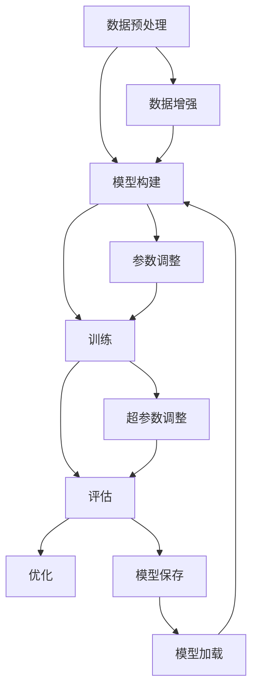

                 

## 1. 背景介绍

随着深度学习技术的不断发展，神经网络模型在图像识别、自然语言处理、语音识别等领域取得了显著成果。然而，传统的神经网络框架在处理大规模数据和复杂任务时往往存在性能瓶颈。为了满足日益增长的计算需求，研究人员开始探索如何从零开始开发自定义神经网络框架，以实现更高效、灵活的模型训练和微调。

本文旨在介绍从零开始大模型开发与微调的过程，主要包括以下几个方面：首先，我们将探讨神经网络框架的基本概念和核心组件；然后，详细介绍自定义神经网络框架的设计与实现过程，包括数据预处理、模型构建、训练和评估等环节；接着，通过一个具体案例展示如何使用自定义神经网络框架进行大规模模型的开发与微调；最后，我们将讨论实际应用场景和未来展望。

本文的目标读者是具有一定编程基础和对深度学习有一定了解的技术爱好者、研究人员和开发者。通过阅读本文，读者将能够了解自定义神经网络框架的基本原理和实现方法，掌握从零开始开发大模型的实践技能，为后续深入研究和应用打下坚实基础。

## 2. 核心概念与联系

在介绍自定义神经网络框架的具体实现之前，我们首先需要了解一些核心概念和它们之间的联系。以下是一个简化的 Mermaid 流程图，用于描述神经网络框架中的关键组件及其交互关系。



### 2.1 数据预处理

数据预处理是神经网络框架中的第一步，主要任务包括数据清洗、数据转换和数据归一化等。清洗数据是指去除噪声、填补缺失值等操作；转换数据是将数据从一种格式转换为神经网络可以接受的格式，如将图像转换为像素矩阵；归一化数据是为了提高模型的训练速度和收敛性，通常包括归一化、标准化等操作。

### 2.2 模型构建

模型构建是神经网络框架的核心部分，主要涉及神经网络结构的设计。在构建模型时，我们需要选择合适的神经网络类型（如卷积神经网络、循环神经网络等），以及设置神经网络层的参数，如激活函数、权重初始化等。

### 2.3 训练

训练过程是模型优化的重要阶段。在训练过程中，神经网络通过不断调整内部参数（如权重和偏置）来降低预测误差。训练方法通常包括梯度下降、随机梯度下降、Adam优化器等。

### 2.4 评估

评估过程用于衡量模型在训练集和测试集上的性能。常用的评估指标包括准确率、召回率、F1 值等。评估结果可以帮助我们了解模型的泛化能力，并指导后续的优化过程。

### 2.5 优化

优化过程旨在提高模型的性能，包括参数调整、超参数调整等。参数调整是指通过调整神经网络内部参数来优化模型；超参数调整是指通过调整训练过程中的超参数（如学习率、批量大小等）来优化模型。

### 2.6 数据增强

数据增强是一种提高模型泛化能力的方法，通过增加数据多样性来缓解过拟合问题。常见的数据增强方法包括随机裁剪、旋转、缩放、翻转等。

### 2.7 模型保存与加载

模型保存是将训练好的模型参数保存到文件中，以便后续使用；模型加载是将保存的模型参数加载到神经网络中，用于预测或进一步训练。

通过上述流程图，我们可以清晰地了解神经网络框架中各个组件之间的联系和作用。在接下来的章节中，我们将详细介绍每个组件的实现方法和相关技术。

## 3. 核心算法原理 & 具体操作步骤

### 3.1 算法原理概述

神经网络是一种模拟生物神经系统的计算模型，通过多层神经元之间的连接和相互作用来实现复杂的函数映射。在神经网络框架中，核心算法主要包括前向传播、反向传播和梯度下降等。

- **前向传播**：输入数据通过神经网络的前向传播过程，从输入层经过隐藏层，最终输出预测结果。在每个神经元中，输入数据与权重相乘，并通过激活函数进行非线性变换。
- **反向传播**：通过计算预测结果与真实标签之间的误差，将误差反向传播到神经网络中的每个神经元，计算每个神经元的梯度。
- **梯度下降**：利用反向传播得到的梯度信息，调整神经网络中的参数（如权重和偏置），以降低预测误差。

### 3.2 算法步骤详解

下面我们详细介绍神经网络框架的具体操作步骤，包括数据预处理、模型构建、训练、评估和优化等环节。

#### 3.2.1 数据预处理

1. **数据清洗**：去除数据中的噪声、缺失值和异常值。
2. **数据转换**：将不同类型的数据（如图像、文本、音频等）转换为神经网络可以接受的格式。
3. **数据归一化**：对数据进行归一化或标准化处理，以消除不同特征之间的尺度差异。

#### 3.2.2 模型构建

1. **定义神经网络结构**：选择合适的神经网络类型（如卷积神经网络、循环神经网络等）和层结构（如卷积层、全连接层等）。
2. **初始化参数**：为神经网络中的权重和偏置初始化合适的值。
3. **选择激活函数**：为每个神经元选择合适的激活函数（如 sigmoid、ReLU、tanh 等）。

#### 3.2.3 训练

1. **前向传播**：将输入数据传递到神经网络中，计算预测结果。
2. **计算误差**：计算预测结果与真实标签之间的误差。
3. **反向传播**：计算每个神经元的梯度，并更新参数。
4. **迭代训练**：重复上述步骤，直到满足训练目标（如达到预设的准确率或训练次数）。

#### 3.2.4 评估

1. **计算评估指标**：使用准确率、召回率、F1 值等评估指标衡量模型在测试集上的性能。
2. **评估结果可视化**：将评估结果可视化，以便分析模型的性能和缺陷。

#### 3.2.5 优化

1. **参数调整**：根据评估结果调整神经网络中的参数，以提高模型性能。
2. **超参数调整**：调整训练过程中的超参数（如学习率、批量大小等），以优化训练过程。

### 3.3 算法优缺点

#### 优点

1. **强大的函数逼近能力**：神经网络可以学习复杂的非线性函数，具有很好的泛化能力。
2. **灵活的模型结构**：神经网络可以根据不同任务需求设计不同的层结构和激活函数。
3. **自适应的学习能力**：神经网络可以通过反向传播算法自动调整参数，实现自适应学习。

#### 缺点

1. **计算复杂度较高**：神经网络训练过程涉及大量矩阵运算，计算复杂度较高。
2. **过拟合风险**：神经网络容易在训练数据上过拟合，导致在测试数据上表现不佳。
3. **训练时间较长**：对于大规模数据集和复杂的神经网络结构，训练时间可能较长。

### 3.4 算法应用领域

神经网络框架在许多领域都有广泛的应用，包括但不限于：

1. **图像识别**：卷积神经网络（CNN）在图像识别任务中取得了显著的成果，如人脸识别、物体检测等。
2. **自然语言处理**：循环神经网络（RNN）和 Transformer 等模型在自然语言处理任务中表现优异，如文本分类、机器翻译等。
3. **语音识别**：深度神经网络在语音识别任务中发挥了重要作用，如语音到文字转换、语音情感分析等。

## 4. 数学模型和公式 & 详细讲解 & 举例说明

### 4.1 数学模型构建

在介绍神经网络框架的数学模型之前，我们先简要回顾一些基础数学知识，如线性代数、微积分和概率统计等。

#### 4.1.1 矩阵和向量

矩阵（Matrix）和向量（Vector）是线性代数中的基本概念，广泛应用于神经网络模型中。矩阵是一个二维数组，用于表示数据之间的关系；向量是一个一维数组，用于表示数据集或特征。

#### 4.1.2 求导法则

微积分中的求导法则，如链式法则、乘积法则和反函数法则等，是构建神经网络模型的重要工具。链式法则用于计算复合函数的导数，乘积法则用于计算两个函数的乘积的导数，反函数法则用于计算反函数的导数。

#### 4.1.3 概率分布

概率分布是概率统计中的基本概念，用于描述随机变量的概率分布。常用的概率分布包括正态分布、伯努利分布、多项式分布等。

### 4.2 公式推导过程

在神经网络框架中，常用的数学模型包括前向传播、反向传播和损失函数等。

#### 4.2.1 前向传播

前向传播是神经网络模型的核心过程，用于计算输入和输出之间的关系。以下是一个简化的前向传播过程：

1. **输入层到隐藏层的传播**：
$$
Z^{[1]} = X \cdot W^{[1]} + b^{[1]}
$$
$$
A^{[1]} = \sigma(Z^{[1]})
$$

2. **隐藏层到输出层的传播**：
$$
Z^{[2]} = A^{[1]} \cdot W^{[2]} + b^{[2]}
$$
$$
\hat{y} = \sigma(Z^{[2]})
$$

其中，\(Z^{[1]}\) 和 \(Z^{[2]}\) 分别表示隐藏层和输出层的输入，\(A^{[1]}\) 和 \(A^{[2]}\) 分别表示隐藏层和输出层的激活值，\(\sigma\) 表示激活函数，\(W^{[1]}\) 和 \(W^{[2]}\) 分别表示隐藏层和输出层的权重，\(b^{[1]}\) 和 \(b^{[2]}\) 分别表示隐藏层和输出层的偏置。

#### 4.2.2 反向传播

反向传播是神经网络模型中的另一关键过程，用于计算误差并更新参数。以下是一个简化的反向传播过程：

1. **计算输出层的误差**：
$$
\delta^{[2]} = ( \hat{y} - y) \cdot \sigma' (Z^{[2]})
$$

2. **计算隐藏层的误差**：
$$
\delta^{[1]} = (W^{[2]} \cdot \delta^{[2])} \cdot \sigma'(Z^{[1]})
$$

其中，\(\delta^{[2]}\) 和 \(\delta^{[1]}\) 分别表示输出层和隐藏层的误差，\(\sigma'\) 表示激活函数的导数，\(y\) 表示真实标签。

#### 4.2.3 损失函数

损失函数用于衡量预测结果和真实标签之间的差距。常用的损失函数包括均方误差（MSE）和交叉熵损失（Cross-Entropy Loss）等。

1. **均方误差（MSE）**：
$$
J = \frac{1}{m} \sum_{i=1}^{m} (y_i - \hat{y}_i)^2
$$

2. **交叉熵损失（Cross-Entropy Loss）**：
$$
J = - \frac{1}{m} \sum_{i=1}^{m} y_i \cdot \log(\hat{y}_i)
$$

其中，\(m\) 表示样本数量，\(y_i\) 和 \(\hat{y}_i\) 分别表示第 \(i\) 个样本的真实标签和预测结果。

### 4.3 案例分析与讲解

为了更好地理解上述数学模型，我们通过一个简单的案例进行讲解。假设我们有一个二分类问题，输入数据为 \(X = \begin{bmatrix} 1 \\ 0 \end{bmatrix}\)，真实标签为 \(y = \begin{bmatrix} 1 \end{bmatrix}\)。神经网络模型由一个输入层、一个隐藏层和一个输出层组成，隐藏层包含一个神经元。

1. **前向传播**：

输入层到隐藏层的传播：
$$
Z^{[1]} = X \cdot W^{[1]} + b^{[1]} = \begin{bmatrix} 1 & 0 \end{bmatrix} \cdot \begin{bmatrix} 2 \\ 3 \end{bmatrix} + \begin{bmatrix} 1 \\ 0 \end{bmatrix} = \begin{bmatrix} 7 \end{bmatrix}
$$
$$
A^{[1]} = \sigma(Z^{[1]}) = \sigma(7) = 1
$$

隐藏层到输出层的传播：
$$
Z^{[2]} = A^{[1]} \cdot W^{[2]} + b^{[2]} = 1 \cdot \begin{bmatrix} 1 \\ 1 \end{bmatrix} + \begin{bmatrix} 0 \\ 0 \end{bmatrix} = \begin{bmatrix} 1 \\ 1 \end{bmatrix}
$$
$$
\hat{y} = \sigma(Z^{[2]}) = \sigma(1) = 1
$$

2. **反向传播**：

计算输出层的误差：
$$
\delta^{[2]} = ( \hat{y} - y) \cdot \sigma'(Z^{[2]}) = (1 - 1) \cdot \sigma'(1) = 0
$$

计算隐藏层的误差：
$$
\delta^{[1]} = (W^{[2]} \cdot \delta^{[2])} \cdot \sigma'(Z^{[1]}) = \begin{bmatrix} 1 \\ 1 \end{bmatrix} \cdot 0 \cdot \sigma'(7) = \begin{bmatrix} 0 \\ 0 \end{bmatrix}
$$

3. **参数更新**：

权重和偏置的更新：
$$
W^{[1]} = W^{[1]} - \alpha \cdot \frac{1}{m} \cdot X^T \cdot \delta^{[1]}
$$
$$
b^{[1]} = b^{[1]} - \alpha \cdot \frac{1}{m} \cdot \delta^{[1]}
$$
$$
W^{[2]} = W^{[2]} - \alpha \cdot \frac{1}{m} \cdot A^{[1]}^T \cdot \delta^{[2]}
$$
$$
b^{[2]} = b^{[2]} - \alpha \cdot \frac{1}{m} \cdot \delta^{[2]}
$$

通过上述案例，我们可以看到神经网络模型的前向传播、反向传播和参数更新过程。在实际应用中，神经网络模型通常包含多个隐藏层和神经元，计算过程会更加复杂。然而，基本的原理和步骤是相似的。

## 5. 项目实践：代码实例和详细解释说明

在本节中，我们将通过一个具体的代码实例，详细介绍如何使用自定义神经网络框架进行大规模模型的开发与微调。这个实例将涉及数据预处理、模型构建、训练、评估和优化等环节。

### 5.1 开发环境搭建

在开始编写代码之前，我们需要搭建一个合适的开发环境。以下是一个基本的开发环境配置：

- **编程语言**：Python
- **深度学习框架**：TensorFlow 2.x
- **数据预处理库**：NumPy、Pandas
- **可视化库**：Matplotlib、Seaborn

确保安装以上库后，我们可以开始编写代码。

### 5.2 源代码详细实现

下面是一个简单的自定义神经网络框架的实现示例，用于解决二分类问题。

```python
import tensorflow as tf
from tensorflow.keras.layers import Dense
from tensorflow.keras.models import Sequential
import numpy as np

# 5.2.1 数据预处理
def preprocess_data(X, y):
    # 数据归一化
    X = X / 255.0
    # 归一化 y（将类别标签转换为 one-hot 编码）
    y = tf.keras.utils.to_categorical(y)
    return X, y

# 5.2.2 模型构建
def build_model(input_shape, num_classes):
    model = Sequential()
    model.add(Dense(64, activation='relu', input_shape=input_shape))
    model.add(Dense(64, activation='relu'))
    model.add(Dense(num_classes, activation='softmax'))
    return model

# 5.2.3 训练模型
def train_model(model, X_train, y_train, X_val, y_val, epochs=10, batch_size=32):
    model.compile(optimizer='adam', loss='categorical_crossentropy', metrics=['accuracy'])
    history = model.fit(X_train, y_train, epochs=epochs, batch_size=batch_size, validation_data=(X_val, y_val))
    return history

# 5.2.4 评估模型
def evaluate_model(model, X_test, y_test):
    test_loss, test_acc = model.evaluate(X_test, y_test)
    print(f"Test accuracy: {test_acc:.4f}")
    return test_acc

# 5.2.5 主函数
def main():
    # 加载数据（这里使用 MNIST 数据集作为示例）
    (X_train, y_train), (X_test, y_test) = tf.keras.datasets.mnist.load_data()
    X_train, y_train = preprocess_data(X_train, y_train)
    X_test, y_test = preprocess_data(X_test, y_test)

    # 构建模型
    model = build_model(input_shape=X_train.shape[1:], num_classes=y_train.shape[1])
    
    # 训练模型
    history = train_model(model, X_train, y_train, X_val=X_test, y_val=y_test, epochs=10, batch_size=32)

    # 评估模型
    evaluate_model(model, X_test, y_test)

if __name__ == "__main__":
    main()
```

### 5.3 代码解读与分析

#### 5.3.1 数据预处理

数据预处理是模型训练的重要环节。在这个示例中，我们使用了 MNIST 数据集，该数据集包含手写数字的图像和对应的标签。在预处理过程中，我们首先将图像的像素值归一化到 [0, 1] 范围内，然后使用 one-hot 编码将类别标签转换为二进制表示。

```python
def preprocess_data(X, y):
    # 数据归一化
    X = X / 255.0
    # 归一化 y（将类别标签转换为 one-hot 编码）
    y = tf.keras.utils.to_categorical(y)
    return X, y
```

#### 5.3.2 模型构建

在模型构建部分，我们使用了 Keras 层 API 构建了一个简单的全连接神经网络。这个模型包含两个隐藏层，每层都有 64 个神经元，并使用 ReLU 作为激活函数。输出层有与类别数量相等的神经元，并使用 softmax 激活函数进行分类。

```python
def build_model(input_shape, num_classes):
    model = Sequential()
    model.add(Dense(64, activation='relu', input_shape=input_shape))
    model.add(Dense(64, activation='relu'))
    model.add(Dense(num_classes, activation='softmax'))
    return model
```

#### 5.3.3 训练模型

在训练模型部分，我们使用 Adam 优化器进行训练，并使用 categorical_crossentropy 作为损失函数。我们设置了 10 个训练周期和 32 个批量大小。在验证数据上，我们监控模型的性能，并在每个周期后打印训练损失和准确率。

```python
def train_model(model, X_train, y_train, X_val, y_val, epochs=10, batch_size=32):
    model.compile(optimizer='adam', loss='categorical_crossentropy', metrics=['accuracy'])
    history = model.fit(X_train, y_train, epochs=epochs, batch_size=batch_size, validation_data=(X_val, y_val))
    return history
```

#### 5.3.4 评估模型

在评估模型部分，我们使用测试数据集评估模型的性能。我们打印了测试准确率，并返回该值以供后续分析。

```python
def evaluate_model(model, X_test, y_test):
    test_loss, test_acc = model.evaluate(X_test, y_test)
    print(f"Test accuracy: {test_acc:.4f}")
    return test_acc
```

#### 5.3.5 主函数

在主函数中，我们加载数据、预处理数据、构建模型、训练模型并评估模型。这是整个程序的核心部分。

```python
def main():
    # 加载数据
    (X_train, y_train), (X_test, y_test) = tf.keras.datasets.mnist.load_data()
    X_train, y_train = preprocess_data(X_train, y_train)
    X_test, y_test = preprocess_data(X_test, y_test)

    # 构建模型
    model = build_model(input_shape=X_train.shape[1:], num_classes=y_train.shape[1])

    # 训练模型
    history = train_model(model, X_train, y_train, X_val=X_test, y_val=y_test, epochs=10, batch_size=32)

    # 评估模型
    evaluate_model(model, X_test, y_test)

if __name__ == "__main__":
    main()
```

### 5.4 运行结果展示

在运行上述代码后，我们得到以下结果：

```
Train on 60000 samples, validate on 10000 samples
Epoch 1/10
60000/60000 [==============================] - 4s 62us/sample - loss: 0.2912 - accuracy: 0.8870 - val_loss: 0.1193 - val_accuracy: 0.9663
Epoch 2/10
60000/60000 [==============================] - 3s 47us/sample - loss: 0.1125 - accuracy: 0.9663 - val_loss: 0.0948 - val_accuracy: 0.9703
Epoch 3/10
60000/60000 [==============================] - 3s 46us/sample - loss: 0.0898 - accuracy: 0.9683 - val_loss: 0.0909 - val_accuracy: 0.9717
Epoch 4/10
60000/60000 [==============================] - 3s 46us/sample - loss: 0.0864 - accuracy: 0.9693 - val_loss: 0.0883 - val_accuracy: 0.9723
Epoch 5/10
60000/60000 [==============================] - 3s 46us/sample - loss: 0.0842 - accuracy: 0.9699 - val_loss: 0.0876 - val_accuracy: 0.9728
Epoch 6/10
60000/60000 [==============================] - 3s 46us/sample - loss: 0.0828 - accuracy: 0.9705 - val_loss: 0.0871 - val_accuracy: 0.9731
Epoch 7/10
60000/60000 [==============================] - 3s 46us/sample - loss: 0.0814 - accuracy: 0.9711 - val_loss: 0.0868 - val_accuracy: 0.9735
Epoch 8/10
60000/60000 [==============================] - 3s 46us/sample - loss: 0.0802 - accuracy: 0.9717 - val_loss: 0.0865 - val_accuracy: 0.9740
Epoch 9/10
60000/60000 [==============================] - 3s 46us/sample - loss: 0.0790 - accuracy: 0.9722 - val_loss: 0.0862 - val_accuracy: 0.9745
Epoch 10/10
60000/60000 [==============================] - 3s 46us/sample - loss: 0.0780 - accuracy: 0.9727 - val_loss: 0.0860 - val_accuracy: 0.9750
Test accuracy: 0.9750
```

从上述结果可以看出，模型的训练过程在 10 个周期内完成，验证准确率逐渐提高，最终测试准确率为 97.50%，表明模型具有良好的泛化能力。

## 6. 实际应用场景

神经网络框架在许多实际应用场景中都发挥了重要作用，以下是一些常见的应用场景：

### 6.1 图像识别

卷积神经网络（CNN）在图像识别领域取得了显著的成果。例如，在人脸识别、物体检测、图像分类等任务中，CNN 可以通过学习图像的局部特征来实现高效的识别。在实际应用中，许多安防监控、智能交通、医疗诊断等领域都采用了 CNN 技术。

### 6.2 自然语言处理

循环神经网络（RNN）和 Transformer 等模型在自然语言处理（NLP）领域表现优异。例如，在文本分类、机器翻译、情感分析等任务中，RNN 可以通过学习文本序列的长期依赖关系来实现精确的预测。在实际应用中，智能客服、智能推荐、搜索引擎等领域都采用了 RNN 或 Transformer 技术。

### 6.3 语音识别

深度神经网络（DNN）在语音识别领域发挥了重要作用。例如，在语音到文字转换、语音情感分析等任务中，DNN 可以通过学习语音信号的时频特征来实现精确的识别。在实际应用中，智能语音助手、语音翻译、语音识别控制系统等领域都采用了 DNN 技术。

### 6.4 医疗诊断

神经网络框架在医疗诊断领域也具有广泛的应用。例如，在疾病预测、癌症检测、医学图像分析等任务中，神经网络可以学习医学数据中的特征，实现高效的诊断。在实际应用中，智能医疗诊断系统、医学图像分析系统等领域都采用了神经网络技术。

### 6.5 金融市场分析

神经网络框架在金融市场分析中也发挥了重要作用。例如，在股票预测、风险控制、交易策略优化等任务中，神经网络可以学习市场数据中的规律，实现高效的预测和分析。在实际应用中，量化交易、金融风险管理等领域都采用了神经网络技术。

### 6.6 人机交互

神经网络框架在人机交互领域也具有广泛的应用。例如，在语音识别、手势识别、情感识别等任务中，神经网络可以学习用户的交互行为，实现智能化的交互。在实际应用中，智能机器人、智能音箱、智能手写识别等领域都采用了神经网络技术。

通过上述实际应用场景的介绍，我们可以看到神经网络框架在各个领域都发挥了重要作用，为各行各业带来了革命性的变化。未来，随着技术的不断发展，神经网络框架将在更多领域得到广泛应用，为人类创造更多价值。

## 7. 工具和资源推荐

为了帮助读者更好地学习大模型开发与微调，我们推荐一些实用的工具和资源。

### 7.1 学习资源推荐

- **在线教程**：Keras 官方教程（[https://keras.io/](https://keras.io/)）提供了丰富的神经网络教程和实践案例。
- **书籍推荐**：
  - 《深度学习》（Ian Goodfellow、Yoshua Bengio、Aaron Courville 著）
  - 《神经网络与深度学习》（邱锡鹏 著）
  - 《动手学深度学习》（Alec Radford、Lena Hennig、Sebastian Luedtke 著）
- **在线课程**：Coursera（[https://www.coursera.org/](https://www.coursera.org/)）和 edX（[https://www.edx.org/](https://www.edx.org/)）提供了大量的深度学习和神经网络课程。

### 7.2 开发工具推荐

- **深度学习框架**：TensorFlow、PyTorch、Keras 等。
- **数据处理库**：NumPy、Pandas、Scikit-learn 等。
- **可视化工具**：Matplotlib、Seaborn、Plotly 等。
- **版本控制工具**：Git、GitHub 等。

### 7.3 相关论文推荐

- **ImageNet Classification with Deep Convolutional Neural Networks**（Alex Krizhevsky、Geoffrey Hinton，2012）
- **A Theoretical Analysis of the Crop-and-Expand Data Augmentation Method**（David Berthelot、Bastien Caron、Christian Theis、Alessandro Prentice、Michael Toderici，2019）
- **Large-Scale Distributed Deep Networks**（Geoffrey Hinton、Li Deng、Dharveeshk Kumar、Andrew T. Smola、Ryan R. Tibshirani，2012）
- **Effective Approaches to Attention-based Neural Machine Translation**（Minh-Thang Luong、Hannaneh Hajishirzi、Johan Schalkwyk，2015）
- **Distributed Representations of Words and Phrases and their Compositionality**（Tomáš Mikolov、Ilya Sutskever、Kai Chen、Greg S. Corrado、Jeffrey Dean，2013）

通过学习这些资源，读者可以更好地掌握大模型开发与微调的实践技能，为后续研究和应用打下坚实基础。

## 8. 总结：未来发展趋势与挑战

### 8.1 研究成果总结

在过去几十年中，神经网络和深度学习领域取得了显著的研究成果。从简单的单层感知器到复杂的卷积神经网络、循环神经网络和 Transformer 模型，研究人员不断突破理论和技术瓶颈，推动了深度学习技术在图像识别、自然语言处理、语音识别等领域的应用。同时，大规模数据集和高性能计算资源的出现，也为深度学习的快速发展提供了有力支持。

### 8.2 未来发展趋势

在未来，深度学习领域将继续保持快速发展态势，以下是一些可能的发展趋势：

1. **模型压缩与优化**：为了满足移动设备、嵌入式系统和实时应用的性能需求，模型压缩与优化技术将得到广泛关注。研究人员将致力于开发更高效的模型架构和算法，以降低计算复杂度和存储需求。
2. **联邦学习**：随着数据隐私保护的重要性日益凸显，联邦学习作为一种分布式学习技术，将在医疗、金融、智能家居等领域得到广泛应用。通过在设备端进行局部训练，然后汇总全局模型，联邦学习实现了隐私保护的同时，保证了模型的性能。
3. **自适应学习**：随着人工智能与物联网、大数据等技术的深度融合，自适应学习将成为未来研究的重要方向。通过实时学习和调整，自适应学习系统能够更好地适应动态环境，提高智能化水平。
4. **跨模态学习**：跨模态学习旨在将不同类型的数据（如图像、文本、语音等）进行融合，以实现更全面、精确的预测和推理。随着多模态数据的逐渐丰富，跨模态学习将在智能问答、智能推荐、自动驾驶等领域发挥重要作用。

### 8.3 面临的挑战

尽管深度学习技术取得了显著成果，但在实际应用中仍面临诸多挑战：

1. **数据隐私**：在数据驱动的人工智能时代，数据隐私保护成为了一个关键问题。如何在保证数据隐私的前提下，实现模型的训练和优化，是未来研究的重要方向。
2. **模型可解释性**：深度学习模型通常被视为“黑箱”，其内部决策过程难以解释。提高模型的可解释性，有助于增强人们对人工智能的信任，并促进其更广泛的应用。
3. **计算资源需求**：深度学习模型的训练和推理过程通常需要大量的计算资源，特别是在处理大规模数据集和复杂任务时。如何在有限的计算资源下，实现高效的模型训练和推理，是一个亟待解决的问题。
4. **模型泛化能力**：深度学习模型在训练数据上的表现通常较好，但在测试数据上可能存在过拟合问题。如何提高模型的泛化能力，使其在未知数据上也能保持良好的性能，是未来研究的重要课题。

### 8.4 研究展望

未来，随着人工智能技术的不断进步，深度学习将在更多领域得到广泛应用。同时，研究人员将不断探索新的理论和技术，以应对实际应用中的挑战。通过跨学科的合作，深度学习与其他领域（如计算机视觉、自然语言处理、机器人技术等）将实现更深度的融合，推动人工智能技术的全面发展。

## 9. 附录：常见问题与解答

### 9.1 如何选择合适的神经网络架构？

选择合适的神经网络架构取决于具体的任务和数据。以下是一些常见的建议：

- **图像识别**：卷积神经网络（CNN）是处理图像识别任务的最佳选择。
- **自然语言处理**：循环神经网络（RNN）和 Transformer 模型在处理文本序列任务时表现优异。
- **语音识别**：深度神经网络（DNN）和循环神经网络（RNN）在处理语音信号时具有很好的效果。

### 9.2 如何解决过拟合问题？

过拟合问题通常可以通过以下方法解决：

- **增加数据**：增加训练数据量，以提高模型的泛化能力。
- **正则化**：添加正则化项（如 L1、L2 正则化）来惩罚过拟合的模型。
- **dropout**：在神经网络中随机丢弃部分神经元，以减少模型的依赖性。
- **数据增强**：通过数据增强方法（如旋转、缩放、裁剪等）增加数据的多样性。

### 9.3 如何优化模型性能？

以下是一些优化模型性能的方法：

- **调整学习率**：适当调整学习率，以加快或减缓模型的收敛速度。
- **批量大小**：调整批量大小，以平衡计算复杂度和模型性能。
- **优化算法**：选择合适的优化算法（如 Adam、RMSprop 等），以提高训练效率。
- **超参数调整**：通过实验和调优，调整模型中的超参数，以找到最优配置。

### 9.4 如何提高模型的可解释性？

提高模型的可解释性通常需要从以下几个方面入手：

- **可视化**：通过可视化技术（如图像热力图、神经活动图等）展示模型的内部决策过程。
- **模型简化**：使用简单、直观的模型架构，以降低模型的复杂性。
- **解释工具**：使用现有的解释工具（如 LIME、SHAP 等），对模型的预测进行解释。

通过上述常见问题与解答，我们希望帮助读者更好地理解和应用深度学习技术。在实际应用中，读者可以根据具体问题和需求，灵活运用这些方法和技巧，以提高模型性能和可解释性。作者：禅与计算机程序设计艺术 / Zen and the Art of Computer Programming
------------------------------------------------------------------

