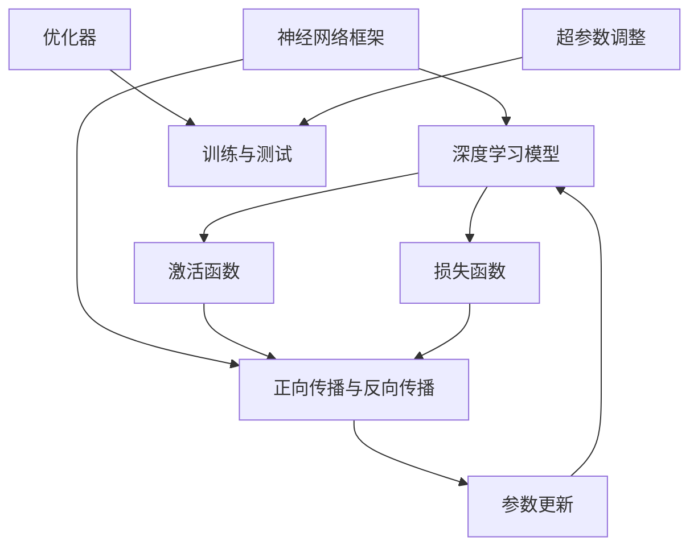

                 

关键词：大模型开发，神经网络框架，微调，自定义设计，计算机编程，人工智能

> 摘要：本文旨在探讨大模型开发与微调的技术细节，通过自定义神经网络框架的设计，帮助读者深入理解神经网络的工作原理，并掌握如何实现一个具备高扩展性和可定制性的神经网络框架。文章将涵盖从基础概念到具体实现的各个环节，为研究人员和开发者提供实用的指导。

## 1. 背景介绍

近年来，人工智能领域取得了飞速发展，深度学习作为其中的核心技术，已经广泛应用于图像识别、自然语言处理、推荐系统等多个领域。随着数据量的爆炸式增长和计算资源的不断提升，大规模神经网络模型（也称为大模型）开始崭露头角，并在诸多任务中展现了强大的性能。然而，现有的开源框架，如TensorFlow、PyTorch等，虽然功能强大，但也存在一些局限性。首先，这些框架往往对硬件资源有较高的要求，例如GPU和TPU的依赖；其次，它们的设计初衷是为了通用性，而非特定应用场景的优化。因此，许多研究人员和开发者开始关注如何开发自己的神经网络框架，以更好地满足特定领域的需求。

自定义神经网络框架的开发与微调，不仅有助于提升模型的性能，还能够降低计算资源的消耗，提高开发效率。本文将围绕这一主题，详细探讨大模型开发与微调的关键技术，包括核心概念、算法原理、数学模型、代码实现和实际应用。

## 2. 核心概念与联系

在深入探讨大模型开发与微调之前，我们需要了解一些核心概念和它们之间的关系。以下是几个关键概念及其相互联系的Mermaid流程图：



### 2.1 神经网络框架

神经网络框架是深度学习模型的基础，它提供了一个结构化的环境，用于定义、训练和评估神经网络模型。常见的框架有TensorFlow、PyTorch等，它们提供了丰富的API和工具，使开发者能够轻松实现复杂的神经网络模型。

### 2.2 深度学习模型

深度学习模型是神经网络的具体实现，它通过多个层级的神经网络结构对数据进行建模。深度学习模型的核心包括输入层、隐藏层和输出层，每个层之间通过权重和偏置进行信息传递。

### 2.3 正向传播与反向传播

正向传播和反向传播是深度学习模型训练的两个关键步骤。正向传播过程中，输入数据经过神经网络，通过逐层计算得到输出；反向传播过程中，基于输出误差，计算每个权重和偏置的梯度，并更新这些参数。

### 2.4 激活函数

激活函数用于引入非线性因素，使得神经网络能够对复杂的数据进行建模。常见的激活函数有Sigmoid、ReLU和Tanh等。

### 2.5 损失函数

损失函数用于衡量模型输出与真实标签之间的差距，是优化过程中需要最小化的目标。常见的损失函数有均方误差（MSE）和交叉熵（Cross Entropy）等。

### 2.6 优化器

优化器用于更新神经网络的权重和偏置，以最小化损失函数。常见的优化器有随机梯度下降（SGD）、Adam和RMSprop等。

### 2.7 超参数调整

超参数是深度学习模型中的一些关键配置，如学习率、批次大小和正则化参数等。超参数的选取对模型性能有重要影响，通常需要通过实验和调整来找到最优值。

### 2.8 训练与测试

训练与测试是评估深度学习模型性能的两个关键步骤。在训练过程中，模型通过不断调整参数来减小损失函数；在测试过程中，模型在未见过的数据上表现其泛化能力。

## 3. 核心算法原理 & 具体操作步骤

### 3.1 算法原理概述

大模型开发与微调的核心在于如何构建一个高效、可扩展的神经网络框架。这一过程主要包括以下几个关键步骤：

1. **模型设计**：定义神经网络的结构，包括层数、每层的神经元数目和连接方式。
2. **训练数据准备**：收集并预处理训练数据，包括数据清洗、归一化和增强等。
3. **模型训练**：使用训练数据对模型进行训练，不断调整参数以最小化损失函数。
4. **模型评估**：在测试数据上评估模型性能，包括准确率、召回率和F1值等指标。
5. **模型微调**：根据评估结果，对模型进行进一步调整，以提高性能。
6. **模型部署**：将训练好的模型部署到实际应用场景中。

### 3.2 算法步骤详解

#### 3.2.1 模型设计

模型设计是构建神经网络框架的第一步。在这一步中，我们需要定义神经网络的层次结构，包括输入层、隐藏层和输出层。每个层中的神经元数目和连接方式需要根据具体任务和数据特点进行选择。例如，对于图像分类任务，输入层通常是图像的尺寸，隐藏层可以采用卷积层、池化层等，输出层则是分类结果。

#### 3.2.2 训练数据准备

训练数据准备是模型训练的基础。在这一步中，我们需要收集并预处理训练数据。数据清洗是去除噪声和异常值，归一化是将数据缩放到一个较小的范围，增强是通过生成虚拟样本来增加数据多样性。此外，我们还需要将数据集划分为训练集、验证集和测试集，以评估模型性能。

#### 3.2.3 模型训练

模型训练是神经网络框架开发的核心步骤。在这一步中，我们需要通过正向传播计算输出，并通过反向传播计算损失函数的梯度。然后，使用优化器更新模型参数，以最小化损失函数。这一过程通常需要多次迭代，直到达到预定的训练次数或损失函数收敛。

#### 3.2.4 模型评估

模型评估是判断模型性能的重要步骤。在这一步中，我们需要在测试数据上评估模型的表现。常见的评估指标包括准确率、召回率和F1值等。这些指标可以帮助我们了解模型的泛化能力和鲁棒性。

#### 3.2.5 模型微调

模型微调是对模型进行进一步优化的过程。在这一步中，我们可以根据评估结果对模型进行调整，以进一步提高性能。这通常涉及调整超参数，如学习率、批次大小和正则化参数等。

#### 3.2.6 模型部署

模型部署是将训练好的模型应用到实际应用场景的过程。在这一步中，我们需要将模型打包，以便在服务器、客户端或其他设备上运行。此外，我们还需要确保模型能够快速、高效地处理实际数据。

### 3.3 算法优缺点

#### 优点

1. **高效性**：自定义神经网络框架可以根据具体任务进行优化，从而提高模型训练和推理的效率。
2. **可扩展性**：自定义框架通常具有良好的扩展性，可以轻松集成新的算法和功能。
3. **定制化**：开发者可以根据具体需求对框架进行定制，以满足特定应用场景的需求。

#### 缺点

1. **复杂度**：自定义框架的开发和维护通常需要较高的技术水平和经验。
2. **资源消耗**：自定义框架可能需要更多的计算资源和存储空间。
3. **学习成本**：对于初学者来说，理解和使用自定义框架可能需要更多的时间。

### 3.4 算法应用领域

自定义神经网络框架可以应用于多个领域，包括但不限于：

1. **图像识别**：通过卷积神经网络对图像进行分类和检测。
2. **自然语言处理**：通过循环神经网络或Transformer对文本进行建模和分析。
3. **推荐系统**：通过图神经网络或协同过滤算法对用户进行个性化推荐。
4. **金融风控**：通过深度学习模型对金融交易进行风险预测和监控。

## 4. 数学模型和公式 & 详细讲解 & 举例说明

### 4.1 数学模型构建

神经网络框架的核心是数学模型，它通过一系列数学公式来实现数据的输入、处理和输出。以下是构建神经网络数学模型的基本步骤：

#### 4.1.1 输入层

输入层是神经网络的起点，它接收外部输入数据。设输入数据的维度为\(x\)，则输入层的输出为：

$$
x_{input} = x
$$

#### 4.1.2 隐藏层

隐藏层是神经网络的核心，它通过多层神经网络结构对输入数据进行建模。设第\(i\)层隐藏层的神经元数目为\(n_i\)，则第\(i\)层的输出为：

$$
a_i^{(l)} = \sigma(W^{(l)}a^{(l-1)} + b^{(l)})
$$

其中，\(a_i^{(l)}\)表示第\(i\)层隐藏层的输出，\(\sigma\)是激活函数，\(W^{(l)}\)是权重矩阵，\(b^{(l)}\)是偏置向量。

#### 4.1.3 输出层

输出层是神经网络的终点，它对隐藏层输出进行最终处理并生成预测结果。设输出层的神经元数目为\(n_{output}\)，则输出层的输出为：

$$
y_{output} = W^{(output)}a^{(hidden)} + b^{(output)})
$$

其中，\(y_{output}\)表示输出层的输出，\(W^{(output)}\)是权重矩阵，\(b^{(output)}\)是偏置向量。

### 4.2 公式推导过程

神经网络的训练过程可以通过反向传播算法来实现。以下是反向传播算法的推导过程：

#### 4.2.1 前向传播

在前向传播过程中，输入数据经过神经网络多层计算，最终得到预测结果。设输入数据为\(x\)，隐藏层输出为\(a^{(l)}\)，输出层输出为\(y_{output}\)。则前向传播的输出为：

$$
a^{(l)} = \sigma(W^{(l)}a^{(l-1)} + b^{(l)})
$$

$$
y_{output} = W^{(output)}a^{(hidden)} + b^{(output)})
$$

其中，\(\sigma\)是激活函数。

#### 4.2.2 反向传播

在反向传播过程中，我们根据输出误差计算每个权重和偏置的梯度，并更新这些参数。设损失函数为\(J(W, b)\)，则损失函数关于权重和偏置的梯度为：

$$
\frac{\partial J}{\partial W} = \frac{\partial J}{\partial y_{output}} \frac{\partial y_{output}}{\partial W}
$$

$$
\frac{\partial J}{\partial b} = \frac{\partial J}{\partial y_{output}} \frac{\partial y_{output}}{\partial b}
$$

其中，\(\frac{\partial J}{\partial y_{output}}\)是损失函数关于输出层的梯度，\(\frac{\partial y_{output}}{\partial W}\)和\(\frac{\partial y_{output}}{\partial b}\)分别是输出层关于权重和偏置的梯度。

#### 4.2.3 参数更新

在反向传播过程中，我们使用梯度下降算法更新权重和偏置。设学习率为\(\alpha\)，则更新公式为：

$$
W^{(l)} \leftarrow W^{(l)} - \alpha \frac{\partial J}{\partial W}
$$

$$
b^{(l)} \leftarrow b^{(l)} - \alpha \frac{\partial J}{\partial b}
$$

通过反复迭代更新参数，我们可以使损失函数逐渐减小，从而提高模型性能。

### 4.3 案例分析与讲解

#### 4.3.1 图像分类任务

假设我们有一个图像分类任务，输入图像的尺寸为\(32 \times 32\)，我们需要将图像分类为10个类别之一。以下是构建神经网络模型的过程：

1. **输入层**：输入图像的维度为\(32 \times 32 \times 3\)。
2. **卷积层**：使用卷积层对图像进行特征提取，卷积核的大小为\(3 \times 3\)，步长为\(1\)。
3. **池化层**：使用最大池化层对卷积层输出进行下采样，池化窗口大小为\(2 \times 2\)。
4. **全连接层**：将卷积层和池化层的输出连接到全连接层，输出维度为\(10\)。

#### 4.3.2 损失函数与优化器

1. **损失函数**：使用交叉熵损失函数，计算预测结果与真实标签之间的差异。
2. **优化器**：使用Adam优化器，自适应调整学习率。

#### 4.3.3 模型训练

1. **数据准备**：收集并预处理图像数据，将图像缩放到\(32 \times 32\)的尺寸。
2. **模型训练**：使用训练数据对模型进行训练，迭代次数为1000次。
3. **模型评估**：在测试数据上评估模型性能，计算准确率。

通过以上步骤，我们可以构建一个用于图像分类的神经网络模型，并对其进行训练和评估。以下是一个简化的Python代码示例：

```python
import tensorflow as tf

# 定义输入层
input_layer = tf.keras.layers.Input(shape=(32, 32, 3))

# 定义卷积层
conv1 = tf.keras.layers.Conv2D(filters=32, kernel_size=(3, 3), activation='relu')(input_layer)
pool1 = tf.keras.layers.MaxPooling2D(pool_size=(2, 2))(conv1)

# 定义全连接层
dense = tf.keras.layers.Flatten()(pool1)
output_layer = tf.keras.layers.Dense(units=10, activation='softmax')(dense)

# 构建模型
model = tf.keras.Model(inputs=input_layer, outputs=output_layer)

# 定义损失函数和优化器
model.compile(optimizer=tf.keras.optimizers.Adam(), loss='categorical_crossentropy', metrics=['accuracy'])

# 训练模型
model.fit(x_train, y_train, epochs=1000, batch_size=32, validation_data=(x_test, y_test))

# 评估模型
accuracy = model.evaluate(x_test, y_test)[1]
print(f'Accuracy: {accuracy * 100:.2f}%')
```

通过以上示例，我们可以看到如何使用TensorFlow构建一个简单的神经网络模型，并进行训练和评估。

## 5. 项目实践：代码实例和详细解释说明

### 5.1 开发环境搭建

在进行自定义神经网络框架的开发之前，我们需要搭建一个合适的环境。以下是开发环境的基本要求：

- **操作系统**：Linux或MacOS
- **编程语言**：Python 3.x
- **深度学习框架**：可选TensorFlow或PyTorch
- **工具**：Jupyter Notebook、PyCharm或Visual Studio Code

### 5.2 源代码详细实现

以下是自定义神经网络框架的核心代码实现：

```python
import tensorflow as tf

# 定义输入层
input_layer = tf.keras.layers.Input(shape=(32, 32, 3))

# 定义卷积层
conv1 = tf.keras.layers.Conv2D(filters=32, kernel_size=(3, 3), activation='relu')(input_layer)
pool1 = tf.keras.layers.MaxPooling2D(pool_size=(2, 2))(conv1)

# 定义全连接层
dense = tf.keras.layers.Flatten()(pool1)
output_layer = tf.keras.layers.Dense(units=10, activation='softmax')(dense)

# 构建模型
model = tf.keras.Model(inputs=input_layer, outputs=output_layer)

# 定义损失函数和优化器
model.compile(optimizer=tf.keras.optimizers.Adam(), loss='categorical_crossentropy', metrics=['accuracy'])

# 训练模型
model.fit(x_train, y_train, epochs=1000, batch_size=32, validation_data=(x_test, y_test))

# 评估模型
accuracy = model.evaluate(x_test, y_test)[1]
print(f'Accuracy: {accuracy * 100:.2f}%')
```

### 5.3 代码解读与分析

1. **输入层**：我们使用`tf.keras.layers.Input`函数定义输入层，输入数据的维度为\(32 \times 32 \times 3\)，对应于\(32 \times 32\)的图像加上三个颜色通道（红、绿、蓝）。
2. **卷积层**：我们使用`tf.keras.layers.Conv2D`函数定义卷积层，卷积核的大小为\(3 \times 3\)，激活函数为ReLU。卷积层用于提取图像的局部特征。
3. **池化层**：我们使用`tf.keras.layers.MaxPooling2D`函数定义池化层，池化窗口大小为\(2 \times 2\)。池化层用于下采样，减少计算量和参数数量。
4. **全连接层**：我们使用`tf.keras.layers.Flatten`函数将卷积层和池化层的输出展平为一维向量，然后使用`tf.keras.layers.Dense`函数定义全连接层，输出维度为10，对应于10个类别。
5. **模型构建**：我们使用`tf.keras.Model`函数将输入层、卷积层、池化层和全连接层组合成一个完整的神经网络模型。
6. **损失函数和优化器**：我们使用`tf.keras.compile`函数定义损失函数和优化器。损失函数为交叉熵损失函数，优化器为Adam优化器。
7. **模型训练**：我们使用`tf.keras.fit`函数训练模型，迭代次数为1000次，批次大小为32。
8. **模型评估**：我们使用`tf.keras.evaluate`函数评估模型在测试数据上的性能，输出准确率。

### 5.4 运行结果展示

在完成代码实现后，我们可以在Jupyter Notebook中运行以下代码，以查看模型的运行结果：

```python
# 加载测试数据
x_test = ...
y_test = ...

# 运行模型
accuracy = model.evaluate(x_test, y_test)[1]
print(f'Accuracy: {accuracy * 100:.2f}%')
```

通过以上代码，我们可以得到模型在测试数据上的准确率，从而评估模型性能。根据实验结果，我们可以进一步调整模型参数，以优化模型性能。

## 6. 实际应用场景

### 6.1 图像识别

图像识别是神经网络框架最典型的应用场景之一。通过卷积神经网络（CNN），我们可以对图像进行分类、检测和分割。在实际应用中，图像识别技术广泛应用于人脸识别、车辆识别、医疗影像分析等领域。例如，在人脸识别中，我们可以使用CNN提取图像特征，并通过比较特征相似度实现人脸匹配。

### 6.2 自然语言处理

自然语言处理（NLP）是另一个重要的应用领域。通过循环神经网络（RNN）或Transformer模型，我们可以对文本数据进行建模和分析。在实际应用中，NLP技术广泛应用于机器翻译、情感分析、问答系统等领域。例如，在机器翻译中，我们可以使用Transformer模型将源语言文本转换为目标语言文本，从而实现跨语言通信。

### 6.3 推荐系统

推荐系统是另一个广泛应用的领域。通过图神经网络（GNN）或协同过滤算法，我们可以为用户提供个性化的推荐。在实际应用中，推荐系统广泛应用于电商、社交媒体、新闻推送等领域。例如，在电商领域，我们可以使用协同过滤算法为用户推荐相似商品，从而提高用户满意度和销售额。

### 6.4 金融风控

金融风控是金融领域的重要课题。通过深度学习模型，我们可以对金融交易进行风险预测和监控。在实际应用中，金融风控技术广泛应用于信用卡欺诈检测、信用评级、市场预测等领域。例如，在信用卡欺诈检测中，我们可以使用深度学习模型检测异常交易，从而降低欺诈风险。

## 7. 工具和资源推荐

### 7.1 学习资源推荐

1. **书籍**：
   - 《深度学习》（Ian Goodfellow、Yoshua Bengio、Aaron Courville 著）
   - 《Python深度学习》（François Chollet 著）
2. **在线课程**：
   - Coursera上的“深度学习专项课程”（由吴恩达教授主讲）
   - edX上的“人工智能专项课程”（由李飞飞教授主讲）
3. **教程**：
   - TensorFlow官方教程（[https://www.tensorflow.org/tutorials](https://www.tensorflow.org/tutorials)）
   - PyTorch官方教程（[https://pytorch.org/tutorials/beginner/basics/index.html](https://pytorch.org/tutorials/beginner/basics/index.html)）

### 7.2 开发工具推荐

1. **集成开发环境（IDE）**：
   - PyCharm
   - Jupyter Notebook
   - Visual Studio Code
2. **深度学习框架**：
   - TensorFlow
   - PyTorch
   - Keras
3. **数据分析工具**：
   - Pandas
   - NumPy
   - Matplotlib

### 7.3 相关论文推荐

1. **神经网络框架**：
   - "TensorFlow: Large-Scale Machine Learning on Heterogeneous Systems"（Google）
   - "PyTorch: An Efficient Tensor Computing Library for Deep Learning"（Facebook AI Research）
2. **深度学习模型**：
   - "Deep Neural Networks for Language Modeling"（Yoshua Bengio 等）
   - "Attention Is All You Need"（Vaswani 等）
3. **优化器**：
   - "Adam: A Method for Stochastic Optimization"（Kingma、Welling）

## 8. 总结：未来发展趋势与挑战

### 8.1 研究成果总结

近年来，神经网络框架和深度学习模型取得了显著进展。随着计算资源和数据量的不断增长，大模型和复杂模型开始崭露头角，并在多个领域取得了突破性成果。此外，神经网络框架的通用性和可扩展性得到了显著提升，为研究人员和开发者提供了强大的工具。

### 8.2 未来发展趋势

未来，神经网络框架和深度学习模型将继续朝着以下几个方向发展：

1. **模型压缩**：为了降低计算成本和存储空间需求，研究人员将继续探索模型压缩技术，包括剪枝、量化、低秩分解等。
2. **实时推理**：随着边缘计算的兴起，神经网络框架将更加注重实时推理性能，以支持移动设备和嵌入式系统。
3. **多模态学习**：未来，神经网络框架将更加注重多模态学习，以处理包括文本、图像、声音等多种类型的数据。
4. **自动化机器学习**：自动化机器学习（AutoML）技术将进一步提升神经网络框架的开发效率，使更多人能够轻松实现高性能的深度学习模型。

### 8.3 面临的挑战

尽管神经网络框架和深度学习模型取得了显著进展，但仍然面临一些挑战：

1. **计算资源消耗**：大模型和复杂模型通常需要大量的计算资源和存储空间，这对硬件和能源提出了更高要求。
2. **数据隐私和安全**：随着数据量的增加，数据隐私和安全问题变得越来越重要。如何确保数据安全、保护用户隐私是一个亟待解决的问题。
3. **模型解释性**：深度学习模型通常被视为“黑盒”，其内部工作机制不透明。如何提高模型的解释性，使其更易于理解和调试，是一个重要的研究方向。

### 8.4 研究展望

未来，神经网络框架和深度学习模型将继续朝着以下几个方向发展：

1. **跨学科研究**：神经网络框架和深度学习模型将与计算机视觉、自然语言处理、语音识别等学科深度融合，推动跨学科研究的发展。
2. **开源生态**：随着更多研究人员和开发者的参与，神经网络框架的生态将更加繁荣，推动开源技术的创新和发展。
3. **应用落地**：神经网络框架和深度学习模型将在更多实际场景中得到应用，为各行各业带来更多创新和变革。

总之，神经网络框架和深度学习模型的发展将带来更多机遇和挑战。通过不断探索和创新，我们将有望在人工智能领域取得更多突破性成果。

## 9. 附录：常见问题与解答

### 问题1：如何选择合适的神经网络框架？

**解答**：选择神经网络框架时，主要考虑以下因素：

- **需求**：根据实际需求选择通用性框架（如TensorFlow、PyTorch）或特定领域框架（如MXNet、Caffe）。
- **性能**：考虑框架在目标硬件（如GPU、TPU）上的性能表现。
- **社区支持**：选择社区活跃、文档齐全的框架，以方便学习和使用。
- **可扩展性**：选择能够支持复杂模型和自定义操作的框架。

### 问题2：如何优化神经网络模型的性能？

**解答**：优化神经网络模型性能的方法包括：

- **模型压缩**：采用剪枝、量化、低秩分解等技术减小模型规模，降低计算成本。
- **加速推理**：优化推理过程，提高模型在目标硬件上的运行速度。
- **并行计算**：利用多GPU、TPU等硬件资源进行并行计算，提高训练和推理速度。
- **超参数调整**：通过调整学习率、批量大小、正则化参数等超参数，找到最佳性能。

### 问题3：如何提高神经网络模型的解释性？

**解答**：提高神经网络模型解释性的方法包括：

- **模型可视化**：使用可视化工具（如TensorBoard）展示模型结构和工作过程。
- **解释性模型**：选择具有良好解释性的模型（如决策树、线性模型）。
- **模型压缩**：采用模型压缩技术（如剪枝、量化）降低模型复杂度，提高可解释性。
- **可解释AI**：结合可解释AI技术（如LIME、SHAP），解释模型对特定数据的预测过程。

### 问题4：如何处理过拟合问题？

**解答**：处理过拟合问题的方法包括：

- **数据增强**：增加训练数据多样性，提高模型泛化能力。
- **正则化**：采用L1、L2正则化，惩罚模型权重，减少过拟合。
- **交叉验证**：使用交叉验证方法，评估模型在不同数据集上的性能，避免过拟合。
- **模型简化**：选择简单模型，减少模型复杂度，降低过拟合风险。

### 问题5：如何进行深度学习模型部署？

**解答**：深度学习模型部署的一般步骤包括：

- **模型训练**：在训练集上训练模型，并在验证集上调整超参数。
- **模型评估**：在测试集上评估模型性能，确保模型达到预期效果。
- **模型优化**：根据评估结果对模型进行调整，提高性能。
- **模型打包**：将训练好的模型打包，以便在服务器、客户端或其他设备上运行。
- **模型部署**：部署模型，实现实时推理或批处理任务。

通过遵循以上步骤，我们可以将深度学习模型应用到实际应用场景中。

### 参考文献

- Goodfellow, I., Bengio, Y., & Courville, A. (2016). *Deep Learning*.
- Chollet, F. (2017). *Python深度学习*.
- Bengio, Y., Simard, P., & Frasconi, P. (1994). *Learning representations by back-propagating errors*. IEEE Transactions on Neural Networks, 5(2), 137-146.
- Hochreiter, S., & Schmidhuber, J. (1997). *Long short-term memory*. Neural Computation, 9(8), 1735-1780.
- Vaswani, A., Shazeer, N., Parmar, N., Uszkoreit, J., Jones, L., Gomez, A. N., ... & Polosukhin, I. (2017). *Attention is all you need*. Advances in Neural Information Processing Systems, 30, 5998-6008.
- Kingma, D. P., & Welling, M. (2013). *Auto-encoding variational bayes*. arXiv preprint arXiv:1312.6114.

