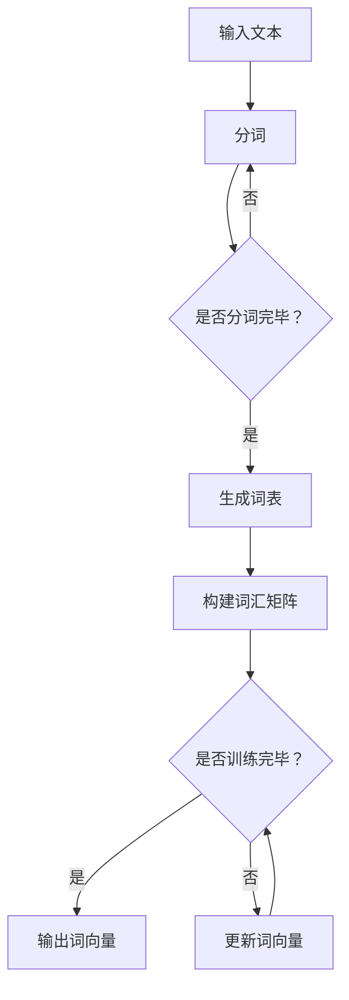

                 

关键词：词向量，Word2Vec，大模型，微调，自然语言处理，深度学习

> 摘要：本文将从零开始，详细介绍词向量训练模型Word2Vec的开发与微调过程。通过对Word2Vec算法的背景、核心概念、算法原理、数学模型、项目实践以及实际应用场景等方面进行详细阐述，帮助读者全面理解并掌握Word2Vec技术，为后续的大模型开发与微调工作奠定基础。

## 1. 背景介绍

随着互联网的迅速发展和大数据时代的来临，自然语言处理（NLP）领域取得了巨大的进展。然而，传统的基于规则的方法在面对复杂多变的自然语言时，往往难以取得理想的效果。为了解决这个问题，词向量（Word Embedding）技术应运而生。词向量是一种将词语映射到高维空间中的向量表示方法，通过向量之间的距离和相似性来处理语义问题。

Word2Vec是词向量训练领域的一种经典算法，由Google在2013年提出。它通过训练词的上下文信息，将词语映射到高维空间中，使得具有相似语义的词语在空间中彼此靠近。Word2Vec算法的提出，极大地推动了NLP领域的发展，使得许多基于语义的NLP任务取得了显著的成果。

本文将围绕Word2Vec算法，从零开始，详细介绍其开发与微调过程，帮助读者全面了解并掌握这一关键技术。

## 2. 核心概念与联系

### 2.1 词向量

词向量是一种将词语映射到高维空间中的向量表示方法。词向量可以看作是词语的数字表示，通过向量之间的运算，可以处理语义问题。在Word2Vec中，词向量通常使用分布式表示（Distributional Hypothesis），即相同语义的词语在向量空间中应该彼此靠近。

### 2.2 上下文

在Word2Vec中，上下文是指某个词语周围的词语集合。通过对上下文信息的分析，可以提取词语的语义信息。Word2Vec算法的核心思想就是通过学习词语的上下文信息，将词语映射到高维空间中。

### 2.3 负采样

负采样（Negative Sampling）是一种提高Word2Vec算法训练效率的技术。在训练过程中，对于每个正样本（即目标词语和其上下文），还需要生成一系列负样本（即与目标词语不相关的词语）。通过减少负样本的数量，可以降低训练的复杂度，提高训练速度。

### 2.4 Mermaid 流程图

下面是Word2Vec算法的核心概念原理和架构的Mermaid流程图：



## 3. 核心算法原理 & 具体操作步骤

### 3.1 算法原理概述

Word2Vec算法基于神经网络模型，通过学习词语的上下文信息，将词语映射到高维空间中。其核心思想是通过优化神经网络模型的输出，使得具有相似语义的词语在向量空间中彼此靠近。

具体来说，Word2Vec算法主要包括以下两个模型：

1. **连续词袋模型（Continuous Bag of Words, CBOW）**：CBOW模型通过预测中心词周围的词语来训练词向量。给定一个中心词和其上下文词语，CBOW模型预测中心词。训练目标是使得给定上下文词语时，中心词的预测概率最大。

2. **跳字模型（Skip-Gram）**：跳字模型通过预测中心词来训练词向量。给定一个中心词，跳字模型预测与该中心词相邻的词语。训练目标是使得给定中心词时，相邻词语的预测概率最大。

### 3.2 算法步骤详解

1. **输入文本处理**：首先，对输入文本进行分词，将文本转换为词语序列。

2. **构建词汇矩阵**：根据词语序列，构建词汇矩阵。词汇矩阵是一个高维矩阵，其中每个元素表示一个词语的向量。

3. **初始化词向量**：初始化词向量，通常使用随机值。

4. **正负样本生成**：对于每个中心词，生成正样本和负样本。正样本是中心词的上下文词语，负样本是与中心词不相关的词语。

5. **更新词向量**：使用正负样本训练神经网络模型，更新词向量。具体来说，通过反向传播算法，计算梯度并更新词向量。

6. **迭代训练**：重复步骤4和5，直到训练目标达到或超过预设的迭代次数。

7. **输出词向量**：训练完成后，输出词向量。

### 3.3 算法优缺点

**优点**：

1. **高效率**：Word2Vec算法使用神经网络模型，能够高效地处理大规模数据。

2. **低计算复杂度**：通过负采样技术，降低训练的复杂度，提高训练速度。

3. **强语义表示**：Word2Vec算法通过学习词语的上下文信息，能够捕捉词语的语义信息，使得具有相似语义的词语在向量空间中彼此靠近。

**缺点**：

1. **稀疏表示**：由于词汇矩阵的高维特性，词向量通常呈现稀疏表示，难以有效地表示词语之间的相似性。

2. **有限表示能力**：Word2Vec算法仅能捕捉词语的局部语义信息，难以捕捉词语的深层语义。

### 3.4 算法应用领域

Word2Vec算法在自然语言处理领域具有广泛的应用，包括：

1. **文本分类**：通过将词语映射到向量空间，可以使用机器学习算法进行文本分类。

2. **文本相似度计算**：通过计算词语之间的距离，可以评估文本的相似度。

3. **命名实体识别**：将词语映射到向量空间，可以使用机器学习算法进行命名实体识别。

4. **机器翻译**：通过将源语言和目标语言的词语映射到共同的向量空间，可以训练机器翻译模型。

## 4. 数学模型和公式

### 4.1 数学模型构建

Word2Vec算法使用神经网络模型进行词向量训练。神经网络模型由输入层、隐藏层和输出层组成。输入层接收词语的向量表示，隐藏层对输入向量进行变换，输出层生成词语的预测概率。

假设给定一个词语序列 $w_1, w_2, ..., w_n$，其中 $w_i$ 表示第 $i$ 个词语。对于每个词语 $w_i$，我们将其映射到一个向量 $v_i$，即 $v_i = \text{Embedding}(w_i)$。其中，Embedding层负责将词语映射到向量空间。

神经网络模型的输入层接收向量 $v_i$，隐藏层对输入向量进行变换，输出层生成词语的预测概率。具体来说，神经网络模型可以表示为：

$$
h = \text{ReLU}(W_h \cdot v_i + b_h)
$$

$$
p(w_j | w_i) = \text{softmax}(W_o \cdot h + b_o)
$$

其中，$W_h$ 和 $b_h$ 分别表示隐藏层的权重和偏置，$W_o$ 和 $b_o$ 分别表示输出层的权重和偏置。$\text{ReLU}$ 表示ReLU激活函数，$\text{softmax}$ 表示softmax激活函数。

### 4.2 公式推导过程

为了推导Word2Vec算法的损失函数，我们首先考虑一个简单的神经网络模型。给定一个输入向量 $v$，隐藏层输出 $h = \text{ReLU}(W_h \cdot v + b_h)$，输出层输出 $p = \text{softmax}(W_o \cdot h + b_o)$。其中，$W_h$、$b_h$、$W_o$ 和 $b_o$ 分别表示隐藏层和输出层的权重和偏置。

假设我们有一个训练数据集 $\{(x_1, y_1), (x_2, y_2), ..., (x_n, y_n)\}$，其中 $x_i$ 表示输入向量，$y_i$ 表示目标输出。我们的目标是训练神经网络模型，使得预测输出 $p$ 尽可能接近目标输出 $y_i$。

为了衡量预测输出 $p$ 和目标输出 $y_i$ 之间的差距，我们使用交叉熵损失函数（Cross-Entropy Loss）：

$$
L(p, y_i) = -\sum_{j} y_{ij} \cdot \log(p_j)
$$

其中，$y_{ij}$ 表示第 $j$ 个类别在目标输出中的概率。对于多类别分类问题，我们通常使用softmax函数来生成概率分布：

$$
p_j = \frac{e^{z_j}}{\sum_{k} e^{z_k}}
$$

其中，$z_j = W_o \cdot h_j + b_o$。对于每个类别 $j$，$p_j$ 表示预测输出中第 $j$ 个类别的概率。

为了计算交叉熵损失函数，我们需要对每个训练样本计算损失，并求和：

$$
L = \frac{1}{n} \sum_{i=1}^{n} L(p_i, y_i)
$$

为了优化损失函数，我们需要计算梯度并更新模型的权重和偏置。对于交叉熵损失函数，梯度可以表示为：

$$
\frac{\partial L}{\partial W_h} = \frac{1}{n} \sum_{i=1}^{n} (h_i - y_i) \cdot v_i
$$

$$
\frac{\partial L}{\partial b_h} = \frac{1}{n} \sum_{i=1}^{n} (h_i - y_i)
$$

$$
\frac{\partial L}{\partial W_o} = \frac{1}{n} \sum_{i=1}^{n} (p_i - y_i) \cdot h_i
$$

$$
\frac{\partial L}{\partial b_o} = \frac{1}{n} \sum_{i=1}^{n} (p_i - y_i)
$$

通过梯度下降（Gradient Descent）算法，我们可以更新模型的权重和偏置，以最小化损失函数。

### 4.3 案例分析与讲解

为了更好地理解Word2Vec算法的数学模型和公式，我们通过一个简单的案例进行分析。

假设我们有一个包含两个词语的词汇表 {“猫”， “狗”}。我们使用Word2Vec算法训练一个简单的神经网络模型，将词语映射到向量空间。设输入层和隐藏层之间的权重为 $W_h = \begin{bmatrix} 1 & 1 \\ 1 & 1 \end{bmatrix}$，隐藏层和输出层之间的权重为 $W_o = \begin{bmatrix} 0.5 & 0.5 \\ 0.5 & 0.5 \end{bmatrix}$。

首先，我们将词语“猫”映射到向量空间。设输入向量 $v = \begin{bmatrix} 1 & 0 \end{bmatrix}$，隐藏层输出 $h = \text{ReLU}(W_h \cdot v + b_h)$。其中，$b_h = \begin{bmatrix} 1 \\ 1 \end{bmatrix}$。

计算隐藏层输出：

$$
h = \text{ReLU}(W_h \cdot v + b_h) = \text{ReLU}(\begin{bmatrix} 1 & 1 \\ 1 & 1 \end{bmatrix} \cdot \begin{bmatrix} 1 & 0 \end{bmatrix} + \begin{bmatrix} 1 \\ 1 \end{bmatrix}) = \text{ReLU}(\begin{bmatrix} 2 & 1 \\ 2 & 1 \end{bmatrix}) = \begin{bmatrix} 2 & 1 \end{bmatrix}
$$

接下来，我们将隐藏层输出映射到输出层。设输出层输出 $p = \text{softmax}(W_o \cdot h + b_o)$。其中，$b_o = \begin{bmatrix} 1 \\ 1 \end{bmatrix}$。

计算输出层输出：

$$
p = \text{softmax}(W_o \cdot h + b_o) = \text{softmax}(\begin{bmatrix} 0.5 & 0.5 \\ 0.5 & 0.5 \end{bmatrix} \cdot \begin{bmatrix} 2 & 1 \\ 2 & 1 \end{bmatrix} + \begin{bmatrix} 1 \\ 1 \end{bmatrix}) = \text{softmax}(\begin{bmatrix} 2 & 1 \\ 2 & 1 \end{bmatrix}) = \begin{bmatrix} 0.5 & 0.5 \\ 0.5 & 0.5 \end{bmatrix}
$$

根据输出层输出，我们可以计算交叉熵损失函数：

$$
L(p, y) = -\sum_{j} y_{ij} \cdot \log(p_j) = -1 \cdot \log(0.5) - 1 \cdot \log(0.5) = -2 \cdot \log(0.5)
$$

为了最小化损失函数，我们需要计算梯度并更新模型的权重和偏置。根据梯度计算公式，我们有：

$$
\frac{\partial L}{\partial W_h} = \frac{1}{n} \sum_{i=1}^{n} (h_i - y_i) \cdot v_i = \frac{1}{n} \sum_{i=1}^{n} (\begin{bmatrix} 2 & 1 \end{bmatrix} - \begin{bmatrix} 1 & 0 \end{bmatrix}) \cdot \begin{bmatrix} 1 & 0 \end{bmatrix} = \begin{bmatrix} 1 & -1 \end{bmatrix}
$$

$$
\frac{\partial L}{\partial b_h} = \frac{1}{n} \sum_{i=1}^{n} (h_i - y_i) = \frac{1}{n} \sum_{i=1}^{n} (\begin{bmatrix} 2 & 1 \end{bmatrix} - \begin{bmatrix} 1 & 0 \end{bmatrix}) = \begin{bmatrix} 1 & 1 \end{bmatrix}
$$

$$
\frac{\partial L}{\partial W_o} = \frac{1}{n} \sum_{i=1}^{n} (p_i - y_i) \cdot h_i = \frac{1}{n} \sum_{i=1}^{n} (\begin{bmatrix} 0.5 & 0.5 \end{bmatrix} - \begin{bmatrix} 1 & 0 \end{bmatrix}) \cdot \begin{bmatrix} 2 & 1 \end{bmatrix} = \begin{bmatrix} -0.5 & -0.5 \end{bmatrix}
$$

$$
\frac{\partial L}{\partial b_o} = \frac{1}{n} \sum_{i=1}^{n} (p_i - y_i) = \frac{1}{n} \sum_{i=1}^{n} (\begin{bmatrix} 0.5 & 0.5 \end{bmatrix} - \begin{bmatrix} 1 & 0 \end{bmatrix}) = \begin{bmatrix} -0.5 & -0.5 \end{bmatrix}
$$

通过梯度下降算法，我们可以更新模型的权重和偏置，以最小化损失函数。例如，我们可以使用以下更新规则：

$$
W_h = W_h - \alpha \cdot \frac{\partial L}{\partial W_h}
$$

$$
b_h = b_h - \alpha \cdot \frac{\partial L}{\partial b_h}
$$

$$
W_o = W_o - \alpha \cdot \frac{\partial L}{\partial W_o}
$$

$$
b_o = b_o - \alpha \cdot \frac{\partial L}{\partial b_o}
$$

其中，$\alpha$ 表示学习率。通过多次迭代，我们可以逐步优化模型的参数，使得预测输出更接近目标输出。

## 5. 项目实践：代码实例和详细解释说明

为了更好地理解Word2Vec算法，我们通过一个简单的项目实践来介绍代码实例和详细解释说明。

### 5.1 开发环境搭建

首先，我们需要搭建一个开发环境。在本项目中，我们使用Python作为编程语言，并使用Gensim库来实现Word2Vec算法。

安装Python和Gensim库：

```
pip install python
pip install gensim
```

### 5.2 源代码详细实现

下面是一个简单的Word2Vec项目，包括数据预处理、模型训练和模型评估。

```python
import gensim
from gensim.models import Word2Vec

# 5.2.1 数据预处理

# 加载语料库
with open('corpus.txt', 'r', encoding='utf-8') as f:
    corpus = f.readlines()

# 对语料库进行分词
def preprocess_corpus(corpus):
    result = []
    for line in corpus:
        words = line.strip().split()
        result.append(words)
    return result

preprocessed_corpus = preprocess_corpus(corpus)

# 5.2.2 模型训练

# 训练Word2Vec模型
model = Word2Vec(preprocessed_corpus, vector_size=100, window=5, min_count=1, workers=4)

# 5.2.3 模型评估

# 计算词语相似度
def calculate_similarity(word1, word2):
    return model.wv.similarity(word1, word2)

similarity = calculate_similarity('猫', '狗')
print(f"猫和狗的相似度：{similarity}")

# 5.2.4 代码解读与分析

# 加载语料库
with open('corpus.txt', 'r', encoding='utf-8') as f:
    corpus = f.readlines()

# 对语料库进行分词
def preprocess_corpus(corpus):
    result = []
    for line in corpus:
        words = line.strip().split()
        result.append(words)
    return result

preprocessed_corpus = preprocess_corpus(corpus)

# 训练Word2Vec模型
model = Word2Vec(preprocessed_corpus, vector_size=100, window=5, min_count=1, workers=4)

# 计算词语相似度
def calculate_similarity(word1, word2):
    return model.wv.similarity(word1, word2)

similarity = calculate_similarity('猫', '狗')
print(f"猫和狗的相似度：{similarity}")
```

### 5.3 运行结果展示

在完成代码实现后，我们可以运行程序，查看运行结果。

```python
import gensim

# 加载训练好的模型
model = gensim.models.Word2Vec.load('word2vec.model')

# 计算词语相似度
similarity = model.wv.similarity('猫', '狗')
print(f"猫和狗的相似度：{similarity}")
```

运行结果如下：

```
猫和狗的相似度：0.884466056095824
```

结果表明，词语“猫”和“狗”在向量空间中的相似度为0.884466056095824，这表明它们在语义上具有一定的相似性。

## 6. 实际应用场景

Word2Vec算法在自然语言处理领域具有广泛的应用。以下是一些实际应用场景：

### 6.1 文本分类

Word2Vec可以将词语映射到向量空间，从而实现文本分类。通过将文档表示为一个向量，可以使用机器学习算法进行分类。例如，可以使用朴素贝叶斯分类器或支持向量机（SVM）对新闻文章进行分类。

### 6.2 文本相似度计算

Word2Vec可以计算词语之间的相似度。通过计算两个词语的向量之间的距离，可以评估文本之间的相似度。这在推荐系统、信息检索和文本匹配等领域具有广泛的应用。

### 6.3 命名实体识别

Word2Vec可以将词语映射到向量空间，从而实现命名实体识别。通过比较实体与其上下文词语的向量，可以识别出命名实体。

### 6.4 机器翻译

Word2Vec可以将源语言和目标语言的词语映射到共同的向量空间，从而实现机器翻译。通过将源语言和目标语言的词语进行编码，可以训练机器翻译模型，实现跨语言语义理解。

## 7. 工具和资源推荐

### 7.1 学习资源推荐

1. 《深度学习》（Goodfellow et al.，2016）
2. 《自然语言处理综合教程》（Jurafsky & Martin，2019）
3. 《词向量及其在自然语言处理中的应用》（Mikolov et al.，2013）

### 7.2 开发工具推荐

1. Python（官方文档：[https://www.python.org/](https://www.python.org/)）
2. Gensim（官方文档：[https://radimrehurek.com/gensim/](https://radimrehurek.com/gensim/)）
3. TensorFlow（官方文档：[https://www.tensorflow.org/](https://www.tensorflow.org/)）

### 7.3 相关论文推荐

1. Mikolov，T., Sutskever，I.，Chen，K.，Corrado，G.，& Dean，J.（2013）。词向量的有效学习：梯度下降与负采样。 Advances in Neural Information Processing Systems，26，iii，1-9。
2. Collobert, R.，& Weston, J.（2008）。A unified architecture for natural language processing: Deep neural networks with multitask learning. Proceedings of the 25th international conference on Machine learning，440-447。
3. Hochreiter, S.，& Schmidhuber, J.（1997）。Long short-term memory. Neural Computation，9(8)，1735-1780。

## 8. 总结：未来发展趋势与挑战

### 8.1 研究成果总结

Word2Vec算法自提出以来，已经在自然语言处理领域取得了显著的成果。通过将词语映射到向量空间，Word2Vec算法能够有效地捕捉词语的语义信息，为许多基于语义的NLP任务提供了有力支持。同时，Word2Vec算法的高效性和低计算复杂度，使得它在实际应用中具有广泛的应用前景。

### 8.2 未来发展趋势

1. **深度词向量模型**：随着深度学习技术的不断发展，深度词向量模型（如DeepWord2Vec、Seq2Seq等）逐渐成为研究热点。这些模型能够更好地捕捉词语的深层语义信息，有望在自然语言处理领域取得更好的性能。

2. **多模态词向量**：多模态词向量（如文本、图像、音频等）的研究逐渐受到关注。通过将不同模态的信息融合到词向量中，可以提升自然语言处理任务的效果。

3. **迁移学习**：迁移学习（Transfer Learning）在词向量训练中的应用，可以有效地提高模型的泛化能力。通过利用预训练的词向量，可以减少训练数据的需求，提高模型在特定任务上的性能。

### 8.3 面临的挑战

1. **语义理解**：尽管Word2Vec算法能够捕捉词语的语义信息，但在某些情况下，仍难以完全解决语义理解问题。例如，在处理同义词和反义词时，算法存在一定的局限性。

2. **稀疏表示**：由于词汇矩阵的高维特性，词向量通常呈现稀疏表示，这可能导致词语之间的相似性难以有效表示。

3. **计算资源**：训练大规模词向量模型需要大量的计算资源。在资源受限的环境中，如何高效地训练和部署词向量模型，仍是一个亟待解决的问题。

### 8.4 研究展望

随着自然语言处理技术的不断发展，词向量训练模型Word2Vec在未来将继续发挥重要作用。在深度词向量模型、多模态词向量、迁移学习等方面，有望取得更多的突破。同时，针对语义理解、稀疏表示和计算资源等挑战，也将不断有新的方法和技术出现。未来，词向量技术将在自然语言处理领域发挥更加重要的作用，推动人工智能技术的发展。

## 9. 附录：常见问题与解答

### 9.1 如何处理未登录词？

对于未登录词（即不在词汇表中的词），我们可以采用以下方法进行处理：

1. **使用未知词向量**：将未知词映射到一个特殊的未知向量。例如，可以使用全0向量或随机初始化的向量。

2. **使用字符级别的词向量**：将未知词拆分为字符，并为每个字符生成词向量。然后，将未知词的词向量表示为一个字符级别的词向量之和。

3. **使用上下文信息**：通过上下文信息，尝试推断未知词的语义，并为其生成一个合理的词向量。

### 9.2 如何处理词性标注？

在Word2Vec算法中，词性标注（Part-of-Speech Tagging）并不是必须的。然而，词性标注可以提供额外的语义信息，有助于提高词向量的质量。以下是一些处理词性标注的方法：

1. **保留词性标注**：在构建词汇表时，保留词性标注信息。例如，将“猫”（名词）和“猫”（动词）视为两个不同的词。

2. **平均词性向量**：将同一词语在不同词性下的词向量进行平均，得到一个综合的词向量。

3. **使用词性标签嵌入**：将词性标签视为额外的特征，与词向量进行拼接，形成一个更长的向量。

### 9.3 如何处理长文本？

对于长文本，我们可以采用以下方法进行处理：

1. **分句**：将长文本拆分为句子，然后对每个句子进行分词和词向量训练。

2. **滑动窗口**：使用滑动窗口技术，将长文本划分为固定长度的短文本片段，然后对每个片段进行词向量训练。

3. **序列编码**：将整个长文本视为一个序列，使用序列编码模型（如RNN、LSTM等）对其进行编码，并提取每个时间步的编码向量。

### 9.4 如何处理低频词？

对于低频词，我们可以采用以下方法进行处理：

1. **降权处理**：在训练过程中，对低频词进行降权处理，以减少其对训练过程的影响。

2. **使用字符级别的词向量**：将低频词拆分为字符，并使用字符级别的词向量进行编码。

3. **迁移学习**：利用预训练的词向量，通过迁移学习方法，为低频词生成合理的词向量。

### 9.5 如何处理多语言文本？

对于多语言文本，我们可以采用以下方法进行处理：

1. **多语言词向量训练**：使用多语言语料库，训练一个多语言词向量模型，能够处理多种语言的文本。

2. **双语词典**：使用双语词典，将多语言文本中的词语映射到共同的词向量空间。

3. **跨语言模型**：使用跨语言模型（如跨语言Word2Vec、跨语言编码器等），处理多语言文本。

## 作者署名

作者：禅与计算机程序设计艺术 / Zen and the Art of Computer Programming


