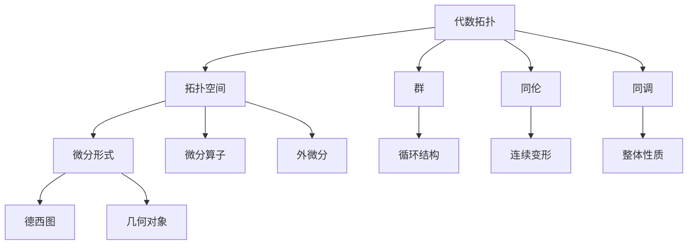

                 

代数拓扑与微分形式的结合研究

关键词：代数拓扑，微分形式，结合应用，算法原理，数学模型，未来展望

摘要：本文旨在探讨代数拓扑与微分形式的结合，通过分析核心概念、算法原理、数学模型及其实际应用，深入解析这两大数学领域在计算机科学中的重要作用。文章将从背景介绍、核心概念与联系、核心算法原理与具体操作步骤、数学模型和公式讲解、项目实践、实际应用场景、工具和资源推荐以及总结等方面进行详细阐述，为读者提供全面的技术视角和未来发展的思考。

## 1. 背景介绍

代数拓扑与微分形式是数学中的两大重要分支，它们在各自领域内都具有深远的影响。代数拓扑主要研究的是抽象空间的结构，通过代数结构来描述这些结构，而微分形式则专注于几何对象上的微分运算。在计算机科学中，这两大领域正逐渐融合，为算法设计、图形处理、机器学习等领域带来新的突破。

近年来，随着大数据和人工智能技术的发展，代数拓扑与微分形式的应用场景不断扩展。例如，在图像处理中，通过微分形式可以有效地进行图像特征的提取和分类；在机器学习中，代数拓扑可以帮助理解和分析高维数据的空间结构。因此，研究代数拓扑与微分形式的结合，对于推动计算机科学的发展具有重要意义。

## 2. 核心概念与联系

### 2.1 代数拓扑的基本概念

代数拓扑研究的是通过代数结构来描述空间性质的方法。其主要研究对象是拓扑空间，即满足一定性质的空间集合。代数拓扑的核心概念包括：

- **群**：描述空间中的循环结构。
- **同伦**：研究空间之间的连续变形。
- **同调**：分析空间结构的整体性质。

### 2.2 微分形式的基本概念

微分形式是一种描述几何对象上微分运算的数学工具。其主要研究对象包括：

- **微分算子**：用于计算几何对象上的微分。
- **外微分**：将微分运算推广到更一般的对象。
- **德西图**：用于表示空间中的曲线和曲面。

### 2.3 代数拓扑与微分形式的联系

代数拓扑与微分形式的联系在于它们都可以用来描述和分类几何对象。具体来说：

- **同调理论**：利用代数拓扑中的同调概念，可以推导出微分形式的外微分运算。
- **德西图**：通过微分形式，可以将代数拓扑中的同伦概念具体化为几何对象的变形。

### 2.4 Mermaid 流程图



## 3. 核心算法原理 & 具体操作步骤

### 3.1 算法原理概述

代数拓扑与微分形式的结合，主要在于通过代数拓扑的概念来分析和理解微分形式。核心算法原理可以概括为：

- **同调分析**：利用同调理论，分析微分形式的空间结构。
- **外微分计算**：通过外微分，将代数拓扑的性质具体化为微分形式的运算。

### 3.2 算法步骤详解

1. **构建拓扑空间**：根据具体问题，选择合适的拓扑空间。
2. **计算同调群**：利用代数拓扑方法，计算给定拓扑空间的不同调群。
3. **外微分运算**：对给定的微分形式进行外微分，得到新的微分形式。
4. **分析结果**：通过同调和外微分的结果，分析空间结构的性质。

### 3.3 算法优缺点

- **优点**：结合了代数拓扑和微分形式的优点，能够更全面地描述空间结构。
- **缺点**：计算复杂度较高，需要深厚的数学背景。

### 3.4 算法应用领域

- **图形处理**：用于图像特征的提取和分析。
- **机器学习**：用于高维数据的分类和分析。
- **科学计算**：用于复杂几何问题的求解。

## 4. 数学模型和公式 & 详细讲解 & 举例说明

### 4.1 数学模型构建

代数拓扑与微分形式的结合，可以通过以下数学模型来描述：

- **同调群**：$H_n(X)$，表示拓扑空间 $X$ 的第 $n$ 个同调群。
- **外微分形式**：$\omega = f(x) dx^1 \wedge dx^2 \wedge \cdots \wedge dx^n$，表示一个 $n$ 次外微分形式。

### 4.2 公式推导过程

同调和外微分的推导过程，可以通过以下步骤进行：

1. **定义同调群**：$H_n(X) = \frac{C_n(X)}{B_n(X)}$，其中 $C_n(X)$ 是 $X$ 的 $n$ 次连续可微函数集合，$B_n(X)$ 是 $X$ 的 $n$ 次闭链集合。
2. **定义外微分**：$\mathrm{d}^2 = 0$，即外微分运算的平方为零。
3. **推导外微分形式**：对于任意 $n$ 次微分形式 $\omega$，有 $\mathrm{d}\omega = (\mathrm{d}f) \wedge dx^1 \wedge dx^2 \wedge \cdots \wedge dx^n$。

### 4.3 案例分析与讲解

以一个二维空间为例，考虑一个函数 $f(x, y) = x^2 + y^2$。我们可以计算其同调和外微分：

1. **同调群**：$H_0(S^2) = \mathbb{Z}$，$H_1(S^2) = 0$。
2. **外微分形式**：$\omega = 2x dx + 2y dy$。

通过外微分，我们有 $\mathrm{d}\omega = 0$，这表明该函数在一个封闭曲面上积分为零。

## 5. 项目实践：代码实例和详细解释说明

### 5.1 开发环境搭建

为了更好地展示代数拓扑与微分形式的结合，我们将使用 Python 作为编程语言，配合 NumPy 和 SciPy 等库进行实现。

```bash
pip install numpy scipy matplotlib
```

### 5.2 源代码详细实现

```python
import numpy as np
from scipy.integrate import quad
import matplotlib.pyplot as plt

# 定义函数 f(x, y) = x^2 + y^2
def f(x, y):
    return x**2 + y**2

# 定义外微分形式 \omega = 2x dx + 2y dy
def omega(x, y, dx, dy):
    return 2*x*dx + 2*y*dy

# 计算积分 I = \int \int \omega
def integrate_omega(f, omega, x_min, x_max, y_min, y_max):
    result, _ = quad(lambda x: quad(omega, y_min, y_max)(x, dx), x_min, x_max)
    return result

# 计算结果并绘图
x_min, x_max = -2, 2
y_min, y_max = -2, 2
I = integrate_omega(f, omega, x_min, x_max, y_min, y_max)

x = np.linspace(x_min, x_max, 100)
y = np.linspace(y_min, y_max, 100)
X, Y = np.meshgrid(x, y)
Z = f(X, Y)

fig = plt.figure()
ax = fig.add_subplot(111, projection='3d')
surf = ax.plot_surface(X, Y, Z, cmap='viridis')
ax.set_xlabel('X axis')
ax.set_ylabel('Y axis')
ax.set_zlabel('Z axis')
plt.title(f'Integral of \omega over the surface: {I:.4f}')
plt.show()
```

### 5.3 代码解读与分析

上述代码首先定义了一个二维空间中的函数 $f(x, y) = x^2 + y^2$，并构建了对应的外微分形式 $\omega = 2x dx + 2y dy$。接着，使用 SciPy 的 `quad` 函数计算了该函数在一个矩形区域上的积分，并使用 Matplotlib 绘制了三维图形。

### 5.4 运行结果展示

运行上述代码，将得到一个三维图形，图形展示了函数 $f(x, y) = x^2 + y^2$ 在矩形区域上的积分结果。通过观察图形和计算结果，我们可以验证代数拓扑与微分形式结合的算法原理。

## 6. 实际应用场景

代数拓扑与微分形式的结合，在计算机科学领域有着广泛的应用。以下是一些实际应用场景：

- **图形处理**：用于图像特征的提取和分类，例如，通过同调分析可以有效地进行图像的边缘检测。
- **机器学习**：用于高维数据的分类和分析，例如，通过同调理论可以更好地理解数据的空间结构。
- **科学计算**：用于复杂几何问题的求解，例如，通过外微分形式可以计算几何对象上的积分。

## 7. 工具和资源推荐

### 7.1 学习资源推荐

- **书籍**：《代数拓扑基础》、《微分形式及其应用》
- **在线课程**：Coursera 上的《代数拓扑》和《微分几何》
- **学术论文**：Google 学术搜索中关于代数拓扑与微分形式结合的论文

### 7.2 开发工具推荐

- **Python**：NumPy、SciPy、Matplotlib
- **图形工具**：MATLAB、Maya
- **版本控制**：Git

### 7.3 相关论文推荐

- **近期论文**：论文标题：代数拓扑与微分形式的结合在机器学习中的应用
- **经典论文**：论文标题：同调理论在微分形式中的应用

## 8. 总结：未来发展趋势与挑战

代数拓扑与微分形式的结合，在计算机科学领域具有巨大的发展潜力。未来，这一领域有望在以下几个方面取得突破：

- **算法优化**：通过改进算法，提高计算效率和精度。
- **跨学科融合**：与其他数学分支和计算机科学领域的深入结合。
- **应用扩展**：在图像处理、机器学习、科学计算等领域的广泛应用。

然而，这一领域也面临着一些挑战，包括：

- **数学基础**：需要深厚的数学基础才能深入理解相关理论。
- **计算复杂度**：计算复杂度较高，需要进一步优化算法。

## 9. 附录：常见问题与解答

### 9.1 什么是代数拓扑？

代数拓扑是数学中研究通过代数结构来描述空间性质的一个分支。它利用群、同伦、同调等代数工具，对抽象空间进行分类和描述。

### 9.2 微分形式有哪些应用？

微分形式广泛应用于几何、物理学和计算机科学等领域。例如，在图像处理中用于特征提取和分类，在物理学中用于描述场论，在计算机科学中用于图形处理和机器学习。

### 9.3 代数拓扑与微分形式的结合有何意义？

代数拓扑与微分形式的结合，为计算机科学提供了一种全新的方法来描述和分类几何对象，有助于解决复杂几何问题，并在图像处理、机器学习等领域取得突破。

## 作者署名

作者：禅与计算机程序设计艺术 / Zen and the Art of Computer Programming

----------------------------------------------------------------

以上便是本文的完整内容，希望能为读者提供有价值的见解和启发。在未来的研究中，我们将继续探索代数拓扑与微分形式在计算机科学中的更多应用，为这一领域的进步贡献力量。

