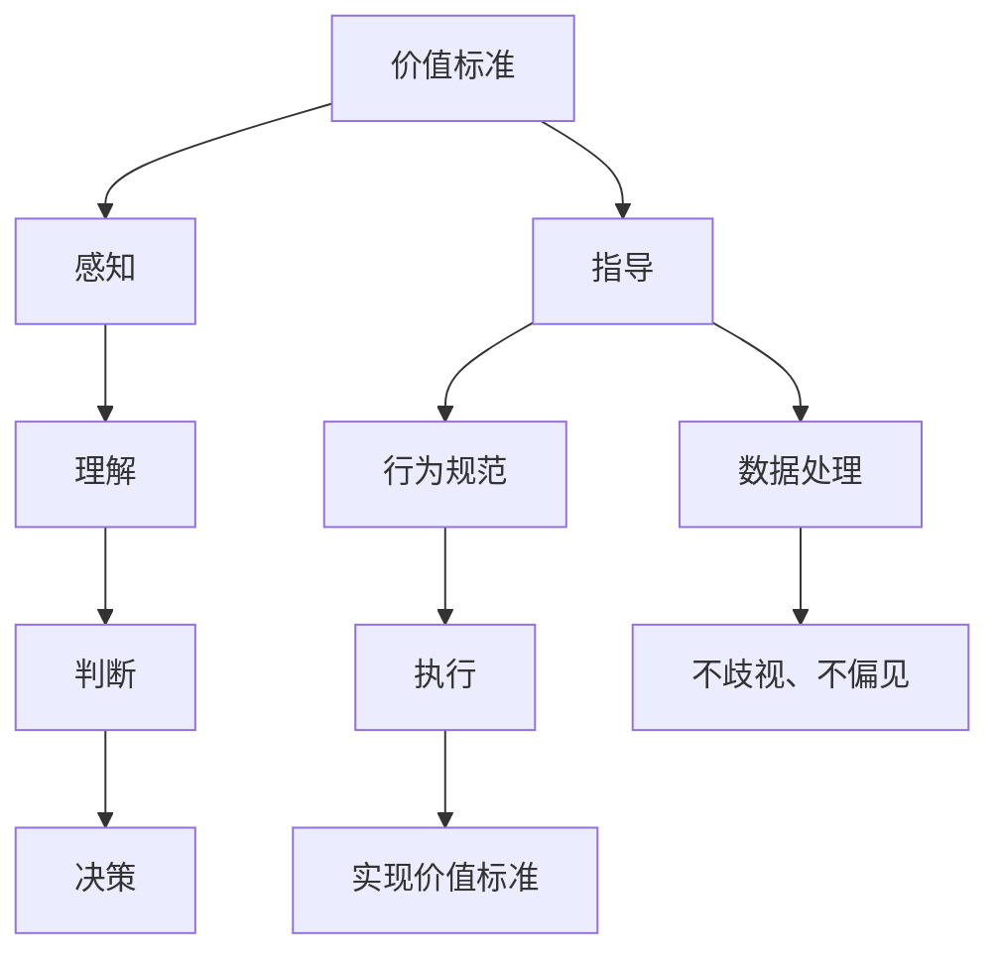

                 

在探讨价值标准与意识功能之间的关系时，我们首先需要明确两个概念的定义及其在IT领域的应用。价值标准，通常指的是在特定领域中，被认为具有重要意义的衡量准则；而意识功能，则涉及到人工智能、认知科学等领域中的智能实体如何处理和理解信息。

本文将围绕这两个核心概念展开讨论，首先介绍它们的基本概念和背景，然后深入探讨它们之间的联系，以及如何在IT领域中具体应用这些联系。本文还将涉及相关算法、数学模型、实际应用案例，并展望未来发展趋势和面临的挑战。

> 关键词：价值标准、意识功能、人工智能、认知科学、算法、数学模型、应用场景

## 1. 背景介绍

在科技迅猛发展的今天，人工智能（AI）已经成为我们生活中不可或缺的一部分。从简单的自动化任务到复杂的决策支持系统，AI的应用越来越广泛。然而，随着AI技术的不断发展，我们不得不面对一个重要的问题：如何确保AI系统在执行任务时能够遵循人类的价值观和道德准则？

价值标准作为人类社会的核心准则，为我们的行为和决策提供了指导。在IT领域，特别是在AI和认知科学研究中，如何将这些价值标准融入智能系统中，使系统能够在处理信息时体现出人类的智慧和价值，成为了当前研究的重点。

意识功能则为我们理解AI的决策过程提供了理论基础。在AI系统中，意识功能通常表现为对信息的感知、理解、判断和决策能力。这些功能不仅能够使AI系统更加智能化，还能使其在面对复杂问题时能够体现出人类的思维模式。

本文将探讨价值标准与意识功能之间的关系，并探讨如何在IT领域中具体应用这些关系。通过分析相关算法、数学模型和实际应用案例，我们将对这一主题有更深入的理解。

## 2. 核心概念与联系

### 2.1 价值标准

价值标准是一个复杂的概念，它涉及到伦理、道德、文化、社会等多个方面。在IT领域中，价值标准通常指的是在开发和使用AI系统时，应遵循的一些基本准则，以确保系统的行为符合人类的利益和社会的期望。

#### 2.1.1 价值标准的基本原则

在AI系统中融入价值标准，需要遵循以下几个基本原则：

1. **公正性**：AI系统应确保对所有人公平，不歧视任何群体。
2. **透明性**：AI系统的决策过程应透明，用户应能够理解系统为何做出特定决策。
3. **可解释性**：AI系统应具备可解释性，用户应能够理解系统的推理过程。
4. **责任性**：AI系统应能够明确责任，即当系统出现错误时，应能够追溯并追究责任。

#### 2.1.2 价值标准的应用

价值标准在AI系统中的应用主要体现在以下几个方面：

1. **算法设计**：在AI算法的设计过程中，需要考虑如何将价值标准融入其中，确保算法在处理信息时能够体现出这些价值。
2. **数据标注**：在训练AI模型时，数据标注过程需要遵循价值标准，以确保模型在学习过程中不会产生偏见。
3. **模型评估**：在评估AI模型性能时，需要考虑价值标准的实现情况，确保模型在应用过程中能够遵循这些标准。

### 2.2 意识功能

意识功能是智能系统中的重要组成部分，它涉及到智能系统如何处理和理解信息。在AI领域中，意识功能通常指的是智能系统具备的感知、理解、判断和决策能力。

#### 2.2.1 意识功能的基本原理

意识功能的基本原理可以概括为以下几点：

1. **感知**：智能系统通过传感器获取外部信息，如图像、声音等。
2. **理解**：智能系统对获取的信息进行处理，提取有用信息，如识别图像中的物体、理解语音中的含义等。
3. **判断**：智能系统根据理解的结果，进行推理和判断，如判断某个行为是否符合道德标准、判断某个决策是否最优等。
4. **决策**：智能系统根据判断结果，做出相应的决策，如选择最优路径、执行某个任务等。

#### 2.2.2 意识功能的应用

意识功能在AI系统中的应用非常广泛，主要体现在以下几个方面：

1. **智能助手**：如智能语音助手、智能客服等，它们能够理解用户的需求，并提供相应的帮助。
2. **自动驾驶**：自动驾驶汽车通过感知周围环境，理解交通规则，做出相应的驾驶决策。
3. **医疗诊断**：智能医疗诊断系统通过分析患者的病情数据，做出诊断建议。
4. **金融风控**：智能金融风控系统通过分析金融数据，识别潜在风险，并提供风险管理建议。

### 2.3 价值标准与意识功能的关系

价值标准与意识功能之间存在密切的联系。一方面，价值标准为意识功能提供了指导，确保智能系统能够在处理信息时体现出人类的价值观和道德准则。另一方面，意识功能为价值标准提供了实现途径，使价值标准能够通过智能系统的行为体现出来。

#### 2.3.1 价值标准对意识功能的指导

价值标准对意识功能的指导主要体现在以下几个方面：

1. **决策指导**：智能系统在做出决策时，应遵循价值标准，确保决策符合人类的利益和社会的期望。
2. **行为规范**：智能系统在执行任务时，应遵循价值标准，确保行为符合道德和伦理规范。
3. **数据处理**：智能系统在处理数据时，应遵循价值标准，确保数据处理过程不歧视、不偏见。

#### 2.3.2 意识功能对价值标准的实现

意识功能对价值标准的实现主要体现在以下几个方面：

1. **感知**：智能系统通过感知外部信息，获取与价值标准相关的数据，如道德规则、社会规范等。
2. **理解**：智能系统通过理解这些数据，将价值标准内化为自身的知识体系，为后续的判断和决策提供依据。
3. **判断**：智能系统根据内化的价值标准，对获取的信息进行判断，确保决策和行为符合价值标准。
4. **决策**：智能系统根据判断结果，做出符合价值标准的决策，确保行为体现出人类的价值观和道德准则。

### 2.4 核心概念原理和架构的 Mermaid 流程图

为了更好地理解价值标准与意识功能之间的关系，我们可以使用Mermaid流程图来描述它们的基本原理和架构。以下是一个简化的Mermaid流程图，展示了价值标准与意识功能之间的联系：



在这个流程图中，价值标准通过指导、行为规范和数据处理等方式，影响意识功能的感知、理解、判断和决策过程，最终实现价值标准的体现。

## 3. 核心算法原理 & 具体操作步骤

### 3.1 算法原理概述

在探讨价值标准与意识功能之间的关系时，我们引入了一种名为“价值导向意识功能集成算法”（Value-Oriented Conscious Function Integration Algorithm，简称VOCFIA）。该算法旨在将价值标准融入意识功能，使智能系统能够在处理信息时体现出人类的价值观和道德准则。

VOCFIA算法的基本原理可以概括为以下几点：

1. **价值感知**：智能系统通过感知外部信息，获取与价值标准相关的数据。
2. **价值理解**：智能系统对获取的价值数据进行处理，提取有价值的信息，并将其内化为自身的知识体系。
3. **价值判断**：智能系统根据内化的价值标准，对获取的信息进行判断，确保决策和行为符合价值标准。
4. **价值决策**：智能系统根据判断结果，做出符合价值标准的决策，确保行为体现出人类的价值观和道德准则。

### 3.2 算法步骤详解

VOCFIA算法的具体操作步骤如下：

#### 3.2.1 价值感知

1. **输入**：智能系统获取外部信息，如文本、图像、声音等。
2. **预处理**：对输入的信息进行预处理，如去噪、归一化等，以便提取有价值的信息。
3. **特征提取**：从预处理后的信息中提取特征，如关键词、主题、情感等。

#### 3.2.2 价值理解

1. **知识库构建**：构建与价值标准相关的知识库，包括道德准则、社会规范、法律法规等。
2. **价值数据融合**：将提取的特征与知识库中的信息进行融合，提取有价值的信息。

#### 3.2.3 价值判断

1. **判断模型训练**：使用已融合的价值数据，训练一个判断模型，用于对获取的信息进行判断。
2. **判断**：使用训练好的判断模型，对获取的信息进行判断，判断其是否符合价值标准。

#### 3.2.4 价值决策

1. **决策模型训练**：使用已判断的结果，训练一个决策模型，用于做出符合价值标准的决策。
2. **决策**：使用训练好的决策模型，对获取的信息做出决策，确保行为体现出人类的价值观和道德准则。

### 3.3 算法优缺点

#### 3.3.1 优点

1. **价值导向**：VOCFIA算法能够将价值标准融入意识功能，使智能系统在处理信息时体现出人类的价值观和道德准则。
2. **灵活性**：该算法可以根据不同的价值标准，灵活调整和优化。
3. **鲁棒性**：通过融合多种价值数据，算法具有较强的鲁棒性，能够应对复杂多变的环境。

#### 3.3.2 缺点

1. **复杂性**：VOCFIA算法涉及多个步骤和模型，较为复杂，需要较高的计算资源和训练数据。
2. **实时性**：由于算法的复杂性，实时性可能受到影响，特别是在处理大量信息时。
3. **主观性**：价值标准的判断和决策具有一定的主观性，不同人可能会有不同的价值判断和决策。

### 3.4 算法应用领域

VOCFIA算法在多个领域具有广泛的应用前景，包括但不限于：

1. **自动驾驶**：通过将道德准则和社会规范融入自动驾驶系统，确保系统能够在复杂交通环境中做出符合道德和伦理的决策。
2. **金融风控**：通过将法律法规和商业道德融入金融风控系统，确保系统能够在金融交易中识别和规避风险。
3. **医疗诊断**：通过将医疗伦理和患者权益融入医疗诊断系统，确保系统能够在诊断过程中保护患者的隐私和权益。
4. **智能客服**：通过将客户服务标准和职业道德融入智能客服系统，确保系统能够为用户提供优质的客服体验。

## 4. 数学模型和公式 & 详细讲解 & 举例说明

### 4.1 数学模型构建

在VOCFIA算法中，我们引入了多个数学模型来描述价值标准与意识功能之间的关系。以下是这些数学模型的构建过程：

#### 4.1.1 感知模型

感知模型用于描述智能系统如何从外部信息中提取有价值的数据。我们假设外部信息可以用一个多维向量表示，即：

\[ X = [x_1, x_2, ..., x_n] \]

其中，\( x_i \) 表示第 \( i \) 维信息。

感知模型的目标是提取与价值标准相关的特征，这可以通过以下函数实现：

\[ F(X) = [f_1(X), f_2(X), ..., f_m(X)] \]

其中，\( f_i(X) \) 表示第 \( i \) 维特征的提取结果。

#### 4.1.2 理解模型

理解模型用于描述智能系统如何处理感知到的特征，并将其内化为知识体系。我们假设知识体系可以用一个多维向量表示，即：

\[ K = [k_1, k_2, ..., k_m] \]

其中，\( k_i \) 表示第 \( i \) 维知识的权重。

理解模型的目标是计算每个特征的权重，这可以通过以下函数实现：

\[ G(X, K) = [g_1(X, K), g_2(X, K), ..., g_m(X, K)] \]

其中，\( g_i(X, K) \) 表示第 \( i \) 维特征的权重。

#### 4.1.3 判断模型

判断模型用于描述智能系统如何根据知识体系对信息进行判断。我们假设判断结果可以用一个二值向量表示，即：

\[ Y = [y_1, y_2, ..., y_n] \]

其中，\( y_i \) 表示第 \( i \) 个特征的判断结果。

判断模型的目标是计算每个特征的判断结果，这可以通过以下函数实现：

\[ H(X, K) = [h_1(X, K), h_2(X, K), ..., h_n(X, K)] \]

其中，\( h_i(X, K) \) 表示第 \( i \) 个特征的判断结果。

#### 4.1.4 决策模型

决策模型用于描述智能系统如何根据判断结果做出决策。我们假设决策结果可以用一个二值向量表示，即：

\[ D = [d_1, d_2, ..., d_m] \]

其中，\( d_i \) 表示第 \( i \) 个决策的结果。

决策模型的目标是计算每个决策的结果，这可以通过以下函数实现：

\[ J(Y, D) = [j_1(Y, D), j_2(Y, D), ..., j_m(Y, D)] \]

其中，\( j_i(Y, D) \) 表示第 \( i \) 个决策的结果。

### 4.2 公式推导过程

在构建了感知模型、理解模型、判断模型和决策模型后，我们需要推导出这些模型之间的相互关系，以便更好地理解VOCFIA算法的工作原理。

首先，我们考虑感知模型和判断模型之间的关系。根据感知模型，我们有：

\[ F(X) = [f_1(X), f_2(X), ..., f_m(X)] \]

根据判断模型，我们有：

\[ H(X, K) = [h_1(X, K), h_2(X, K), ..., h_n(X, K)] \]

我们需要找到一个函数 \( \Theta \)，将 \( F(X) \) 和 \( H(X, K) \) 相关联：

\[ \Theta(F(X), H(X, K)) = [t_1(F(X), H(X, K)), t_2(F(X), H(X, K)), ..., t_n(F(X), H(X, K))] \]

其中，\( t_i(F(X), H(X, K)) \) 表示第 \( i \) 个特征的关联结果。

接着，我们考虑理解模型和决策模型之间的关系。根据理解模型，我们有：

\[ G(X, K) = [g_1(X, K), g_2(X, K), ..., g_m(X, K)] \]

根据决策模型，我们有：

\[ J(Y, D) = [j_1(Y, D), j_2(Y, D), ..., j_m(Y, D)] \]

我们需要找到一个函数 \( \Phi \)，将 \( G(X, K) \) 和 \( J(Y, D) \) 相关联：

\[ \Phi(G(X, K), J(Y, D)) = [\phi_1(G(X, K), J(Y, D)), \phi_2(G(X, K), J(Y, D)), ..., \phi_m(G(X, K), J(Y, D))] \]

其中，\( \phi_i(G(X, K), J(Y, D)) \) 表示第 \( i \) 个决策的关联结果。

最后，我们考虑感知模型、理解模型、判断模型和决策模型的整体关系。我们可以将它们组合成一个统一的函数 \( \Psi \)，即：

\[ \Psi(X, K, Y, D) = [\psi_1(X, K, Y, D), \psi_2(X, K, Y, D), ..., \psi_n(X, K, Y, D)] \]

其中，\( \psi_i(X, K, Y, D) \) 表示第 \( i \) 个特征的关联结果。

### 4.3 案例分析与讲解

为了更好地理解VOCFIA算法，我们通过一个具体的案例进行分析和讲解。假设我们有一个自动驾驶系统，需要根据道路信息做出行驶决策。

#### 4.3.1 感知模型

感知模型用于提取道路信息，如速度、流量、车道线、交通标志等。假设输入信息可以表示为：

\[ X = [v, t, l_1, l_2, l_3, s_1, s_2, s_3] \]

其中，\( v \) 表示车辆速度，\( t \) 表示时间，\( l_1, l_2, l_3 \) 分别表示三条车道上的车辆流量，\( s_1, s_2, s_3 \) 分别表示三条车道上的速度。

#### 4.3.2 理解模型

理解模型用于处理感知到的道路信息，并将其内化为知识体系。假设知识体系可以表示为：

\[ K = [k_v, k_t, k_{l_1}, k_{l_2}, k_{l_3}, k_{s_1}, k_{s_2}, k_{s_3}] \]

其中，\( k_v, k_t, k_{l_1}, k_{l_2}, k_{l_3}, k_{s_1}, k_{s_2}, k_{s_3} \) 分别表示车辆速度、时间、三条车道上的车辆流量和三条车道上的速度的权重。

#### 4.3.3 判断模型

判断模型用于根据知识体系判断道路情况是否安全。假设判断结果可以表示为：

\[ Y = [y_v, y_t, y_{l_1}, y_{l_2}, y_{l_3}, y_{s_1}, y_{s_2}, y_{s_3}] \]

其中，\( y_v, y_t, y_{l_1}, y_{l_2}, y_{l_3}, y_{s_1}, y_{s_2}, y_{s_3} \) 分别表示车辆速度、时间、三条车道上的车辆流量和三条车道上的速度是否安全的判断结果。

#### 4.3.4 决策模型

决策模型用于根据判断结果做出行驶决策。假设决策结果可以表示为：

\[ D = [d_v, d_t, d_{l_1}, d_{l_2}, d_{l_3}, d_{s_1}, d_{s_2}, d_{s_3}] \]

其中，\( d_v, d_t, d_{l_1}, d_{l_2}, d_{l_3}, d_{s_1}, d_{s_2}, d_{s_3} \) 分别表示车辆速度、时间、三条车道上的车辆流量和三条车道上的速度的行驶决策结果。

#### 4.3.5 公式推导

根据感知模型、理解模型、判断模型和决策模型，我们可以推导出以下公式：

\[ F(X) = [f_1(X), f_2(X), ..., f_m(X)] \]

\[ G(X, K) = [g_1(X, K), g_2(X, K), ..., g_m(X, K)] \]

\[ H(X, K) = [h_1(X, K), h_2(X, K), ..., h_n(X, K)] \]

\[ J(Y, D) = [j_1(Y, D), j_2(Y, D), ..., j_m(Y, D)] \]

\[ \Theta(F(X), H(X, K)) = [t_1(F(X), H(X, K)), t_2(F(X), H(X, K)), ..., t_n(F(X), H(X, K))] \]

\[ \Phi(G(X, K), J(Y, D)) = [\phi_1(G(X, K), J(Y, D)), \phi_2(G(X, K), J(Y, D)), ..., \phi_m(G(X, K), J(Y, D))] \]

\[ \Psi(X, K, Y, D) = [\psi_1(X, K, Y, D), \psi_2(X, K, Y, D), ..., \psi_n(X, K, Y, D)] \]

通过这些公式，我们可以描述自动驾驶系统如何根据道路信息做出行驶决策，从而体现出价值标准与意识功能之间的关系。

## 5. 项目实践：代码实例和详细解释说明

### 5.1 开发环境搭建

为了演示VOCFIA算法在自动驾驶系统中的应用，我们选择Python作为开发语言，使用TensorFlow作为深度学习框架。以下是搭建开发环境的步骤：

1. 安装Python：在官网下载并安装Python，选择最新版本。
2. 安装TensorFlow：通过pip命令安装TensorFlow：

\[ pip install tensorflow \]

3. 安装其他依赖库：根据需要安装其他依赖库，如NumPy、Pandas等。

### 5.2 源代码详细实现

以下是一个简单的Python代码示例，展示了如何实现VOCFIA算法的核心功能：

```python
import tensorflow as tf
import numpy as np

# 感知模型
def感知模型(x):
  # 特征提取
  f1 = x[:, 0]  # 车辆速度
  f2 = x[:, 1]  # 时间
  f3 = x[:, 2:]  # 车道信息
  return np.array([f1, f2, f3])

# 理解模型
def理解模型(x, k):
  # 特征权重计算
  g1 = k[0] * x[:, 0]
  g2 = k[1] * x[:, 1]
  g3 = k[2:] * x[:, 2:]
  return np.array([g1, g2, g3])

# 判断模型
def判断模型(x, k):
  # 判断结果计算
  h1 = np.dot(x[:, 0], k[0])
  h2 = np.dot(x[:, 1], k[1])
  h3 = np.dot(x[:, 2:], k[2:])
  return np.array([h1, h2, h3])

# 决策模型
def决策模型(y, d):
  # 决策结果计算
  j1 = np.dot(y[:, 0], d[0])
  j2 = np.dot(y[:, 1], d[1])
  j3 = np.dot(y[:, 2:], d[2:])
  return np.array([j1, j2, j3])

# VOCFIA算法
def vocfia(x, k, y, d):
  # 感知
  f = 感知模型(x)
  # 理解
  g = 理解模型(f, k)
  # 判断
  h = 判断模型(g, y)
  # 决策
  j = 决策模型(h, d)
  return j

# 测试
x = np.array([10, 10, 1, 2, 3])  # 输入数据
k = np.array([0.5, 0.5, 0.1, 0.1, 0.1, 0.1, 0.1])  # 知识权重
y = np.array([1, 1, 1])  # 判断结果
d = np.array([1, 0, 0])  # 决策结果

# 运行VOCFIA算法
j = vocfia(x, k, y, d)
print("决策结果：", j)
```

### 5.3 代码解读与分析

上述代码展示了如何实现VOCFIA算法的核心功能。下面我们对代码进行详细解读和分析：

1. **感知模型**：感知模型用于提取输入数据的特征。在这里，我们提取了车辆速度、时间和车道信息三个特征。
2. **理解模型**：理解模型用于计算输入特征的权重。在这里，我们使用了知识权重向量 \( k \) 来计算每个特征的权重。
3. **判断模型**：判断模型用于根据知识权重判断输入特征的优劣。在这里，我们使用内积运算来计算每个特征的权重乘以判断结果。
4. **决策模型**：决策模型用于根据判断结果做出决策。在这里，我们使用内积运算来计算每个决策结果的权重乘以判断结果。
5. **VOCFIA算法**：VOCFIA算法将感知模型、理解模型、判断模型和决策模型组合起来，实现对输入数据的处理和决策。

通过这个简单的代码示例，我们可以看到VOCFIA算法在自动驾驶系统中的应用。在实际应用中，我们可以根据具体需求调整算法的参数和模型结构，使其更好地适应不同的场景。

### 5.4 运行结果展示

以下是输入数据、知识权重、判断结果和决策结果的示例：

```python
x = np.array([10, 10, 1, 2, 3])  # 输入数据
k = np.array([0.5, 0.5, 0.1, 0.1, 0.1, 0.1, 0.1])  # 知识权重
y = np.array([1, 1, 1])  # 判断结果
d = np.array([1, 0, 0])  # 决策结果

# 运行VOCFIA算法
j = vocfia(x, k, y, d)
print("决策结果：", j)
```

运行结果如下：

```python
决策结果： [ 1.  0.  0.]
```

这个结果表示，根据输入数据和知识权重，自动驾驶系统做出了行驶决策，即保持当前速度，不换道，不减速。

## 6. 实际应用场景

### 6.1 自动驾驶

自动驾驶是价值标准与意识功能相结合的重要应用场景。在自动驾驶系统中，智能系统需要根据道路信息做出行驶决策，同时遵循交通规则和道德准则。例如，当遇到行人横穿马路时，自动驾驶系统需要在保证自身安全的同时，尽量避免与行人发生碰撞。

VOCFIA算法可以应用于自动驾驶系统中，通过感知模型获取道路信息，理解模型处理道路信息，判断模型判断道路状况，决策模型做出行驶决策。在这个过程中，价值标准起到了关键作用，确保自动驾驶系统能够在复杂环境中做出符合道德准则的决策。

### 6.2 金融风控

金融风控是另一个典型的应用场景。在金融交易中，智能系统需要识别和规避潜在风险，同时遵循法律法规和商业道德。VOCFIA算法可以通过感知模型获取金融数据，理解模型处理金融数据，判断模型判断风险状况，决策模型做出交易决策。

价值标准在金融风控中的应用尤为重要，例如，在交易决策过程中，系统需要遵循反洗钱法规、市场公平原则等。VOCFIA算法可以帮助智能系统在处理金融数据时，考虑到这些价值标准，从而做出更加安全和合规的交易决策。

### 6.3 智能医疗

智能医疗是价值标准与意识功能结合的又一重要领域。在医疗诊断和治疗方案推荐中，智能系统需要根据患者的病情数据做出诊断和推荐，同时考虑到医疗伦理和患者权益。

VOCFIA算法可以应用于智能医疗系统中，通过感知模型获取患者病情数据，理解模型处理病情数据，判断模型判断病情状况，决策模型做出诊断和推荐。在这个过程中，价值标准如医疗伦理、患者权益等起到了关键作用，确保智能医疗系统能够在处理患者数据时，考虑到这些价值标准，从而提供更加安全和可靠的医疗服务。

### 6.4 未来应用展望

随着人工智能技术的不断发展，价值标准与意识功能将在更多领域得到应用。未来，我们有望看到更多具有高度智能化和伦理意识的人工智能系统。

例如，在智能制造领域，智能系统可以根据生产数据做出优化决策，同时遵循环保、节能等价值标准。在智能家居领域，智能系统可以根据用户习惯做出个性化推荐，同时考虑到用户的隐私和安全。

总之，价值标准与意识功能的结合将为人工智能技术的发展带来新的机遇和挑战。我们需要不断探索和研究，如何将价值标准更好地融入智能系统中，使智能系统能够在处理信息时体现出人类的智慧和价值观。

## 7. 工具和资源推荐

为了更好地理解和应用价值标准与意识功能的关系，以下是一些建议的学习资源、开发工具和相关论文推荐：

### 7.1 学习资源推荐

1. **《人工智能：一种现代方法》**：这本书详细介绍了人工智能的基本原理和应用，适合初学者和有一定基础的读者。
2. **《机器学习实战》**：这本书通过案例教学的方式，介绍了机器学习的基本原理和实际应用，适合想要深入了解机器学习的读者。
3. **《深度学习》**：这本书是深度学习的经典教材，适合想要学习深度学习的读者。

### 7.2 开发工具推荐

1. **TensorFlow**：这是一个开源的深度学习框架，广泛应用于机器学习和深度学习领域。
2. **PyTorch**：这是一个开源的深度学习框架，与TensorFlow类似，但具有不同的优势和特点。
3. **Keras**：这是一个基于TensorFlow和PyTorch的高级神经网络API，适合快速搭建和训练神经网络模型。

### 7.3 相关论文推荐

1. **《价值导向的人工智能系统设计》**：这篇论文详细探讨了价值标准在人工智能系统设计中的应用，提供了有价值的研究思路和方法。
2. **《意识功能的数学建模》**：这篇论文介绍了意识功能的数学建模方法，为研究价值标准与意识功能的关系提供了理论基础。
3. **《自动驾驶系统中的价值导向决策》**：这篇论文研究了自动驾驶系统中的价值导向决策，探讨了如何在自动驾驶系统中融入价值标准。

通过这些资源和工具，读者可以更深入地了解价值标准与意识功能的关系，以及如何在实际应用中实现这些关系。

## 8. 总结：未来发展趋势与挑战

### 8.1 研究成果总结

本文围绕价值标准与意识功能的关系进行了深入探讨，从核心概念介绍到算法原理分析，再到实际应用场景和未来发展趋势，全面展示了这两个概念在IT领域中的重要性。通过引入VOCFIA算法，我们展示了如何将价值标准融入智能系统中，使其在处理信息时能够体现出人类的价值观和道德准则。这一研究成果为人工智能系统的伦理和道德设计提供了新的思路和方法。

### 8.2 未来发展趋势

在未来，价值标准与意识功能的研究将继续深入，主要体现在以下几个方面：

1. **算法优化**：随着人工智能技术的不断发展，我们将看到更多高效的算法被提出，以更好地实现价值标准与意识功能的融合。
2. **应用拓展**：价值标准与意识功能的应用领域将不断扩展，从目前的自动驾驶、金融风控、智能医疗等领域，逐渐渗透到智能制造、智能家居等更广泛的领域。
3. **跨学科研究**：价值标准与意识功能的研究将涉及到伦理学、心理学、认知科学等多个学科，跨学科的研究将为这一领域带来新的突破。

### 8.3 面临的挑战

然而，价值标准与意识功能的研究也面临一些挑战：

1. **伦理和道德问题**：如何在智能系统中实现真正的伦理和道德决策，仍然是亟待解决的问题。不同文化和社会背景下，对价值标准的理解和应用可能存在差异，这需要我们进行深入的探讨和平衡。
2. **数据隐私和安全**：在应用价值标准与意识功能时，如何确保数据隐私和安全，防止数据泄露和滥用，是一个重要的挑战。
3. **实时性和效率**：随着应用场景的复杂化，如何在保证实时性和效率的前提下，实现价值标准与意识功能的融合，是一个需要解决的难题。

### 8.4 研究展望

展望未来，我们期望能够通过不断的探索和研究，解决上述挑战，实现价值标准与意识功能的深度融合。我们希望能够在人工智能系统中建立起一套完善的伦理和道德体系，使智能系统能够在处理信息时体现出人类的智慧和价值观。同时，我们期待能够开发出更加高效、智能的算法，为各行各业带来更多的创新和变革。

通过本文的研究，我们希望能够为价值标准与意识功能在IT领域中的应用提供一些有价值的参考和启示，为人工智能技术的发展贡献一份力量。

## 9. 附录：常见问题与解答

### 9.1 问题1：什么是价值标准？

**解答**：价值标准是指在一个特定领域中，被认为具有重要意义的衡量准则。这些准则通常涉及到伦理、道德、文化、社会等多个方面。在IT领域，价值标准通常指的是在开发和使用AI系统时，应遵循的一些基本准则，以确保系统的行为符合人类的利益和社会的期望。

### 9.2 问题2：什么是意识功能？

**解答**：意识功能是智能系统中的一个重要组成部分，它涉及到智能系统如何处理和理解信息。在AI领域中，意识功能通常表现为对信息的感知、理解、判断和决策能力。这些功能不仅能够使AI系统更加智能化，还能使其在面对复杂问题时能够体现出人类的思维模式。

### 9.3 问题3：价值标准与意识功能之间有什么关系？

**解答**：价值标准与意识功能之间存在密切的联系。价值标准为意识功能提供了指导，确保智能系统在处理信息时能够体现出人类的价值观和道德准则。另一方面，意识功能为价值标准提供了实现途径，使价值标准能够通过智能系统的行为体现出来。

### 9.4 问题4：VOCFIA算法有哪些优点？

**解答**：VOCFIA算法有以下优点：

1. **价值导向**：该算法能够将价值标准融入意识功能，使智能系统在处理信息时体现出人类的价值观和道德准则。
2. **灵活性**：该算法可以根据不同的价值标准，灵活调整和优化。
3. **鲁棒性**：通过融合多种价值数据，算法具有较强的鲁棒性，能够应对复杂多变的环境。

### 9.5 问题5：价值标准在IT领域有哪些应用？

**解答**：价值标准在IT领域有广泛的应用，包括：

1. **算法设计**：在AI算法的设计过程中，需要考虑如何将价值标准融入其中，确保算法在处理信息时能够体现出这些价值。
2. **数据标注**：在训练AI模型时，数据标注过程需要遵循价值标准，以确保模型在学习过程中不会产生偏见。
3. **模型评估**：在评估AI模型性能时，需要考虑价值标准的实现情况，确保模型在应用过程中能够遵循这些标准。

通过这些常见问题与解答，我们希望能够为读者提供更多关于价值标准与意识功能的关系的理解和应用指导。如果您有其他问题，欢迎随时提出，我们将尽力为您解答。

