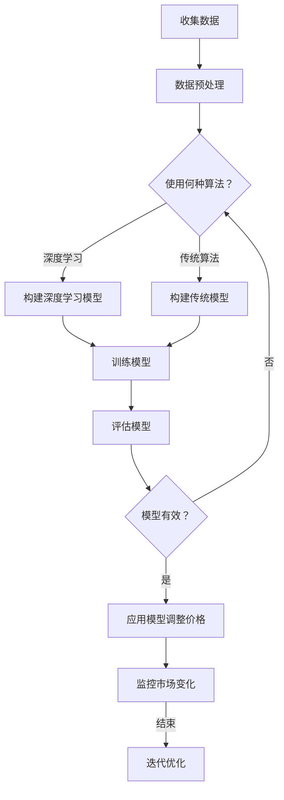

                 

关键词：AI, 价格优化，市场供需，深度学习，优化算法，价格预测，自动化定价系统

摘要：本文将深入探讨如何利用人工智能技术实现价格优化，尤其是如何通过机器学习算法根据市场供需关系调整产品价格。我们将从背景介绍开始，详细讲解核心概念、算法原理、数学模型、实际应用场景以及未来展望。

## 1. 背景介绍

在现代商业环境中，价格优化是一个至关重要的决策过程。它不仅影响企业的盈利能力，还直接影响消费者的购买决策和市场份额。传统的价格优化方法通常依赖于历史数据和简单的线性模型，这些方法在应对动态市场时往往力不从心。

然而，随着人工智能技术的迅速发展，特别是深度学习算法的崛起，我们有了新的工具来应对这个复杂的问题。通过分析大量的市场数据，AI可以识别出潜在的模式和趋势，从而提供更加精准的价格预测和优化策略。

本文将重点关注以下内容：
- 核心概念和算法原理
- 数学模型和公式推导
- 实际应用场景
- 未来展望

## 2. 核心概念与联系

在讨论如何利用AI进行价格优化之前，我们需要先了解几个核心概念。

### 2.1 供需关系

供需关系是经济学中最基本的原理之一。简单来说，需求是指消费者愿意购买商品或服务的数量，而供给则是生产者愿意提供的数量。价格则是供需之间的平衡点。在市场供需关系中，价格是动态变化的，受多种因素影响，如消费者偏好、生产成本、季节性因素等。

### 2.2 机器学习算法

机器学习算法是一类通过数据学习模式和规律，从而做出预测或决策的人工智能技术。在价格优化中，常用的机器学习算法包括线性回归、决策树、支持向量机、神经网络等。

### 2.3 深度学习

深度学习是机器学习的一个子领域，它通过多层神经网络来模拟人类大脑的决策过程。在价格优化中，深度学习算法能够处理大量复杂数据，从而提供更加精准的预测。

### 2.4 优化算法

优化算法是一类用于寻找最优解的算法。在价格优化中，优化算法可以用于调整价格参数，以最大化利润或市场份额。

### 2.5 Mermaid 流程图

以下是一个简化的价格优化算法的 Mermaid 流程图：



## 3. 核心算法原理 & 具体操作步骤

### 3.1 算法原理概述

在价格优化中，我们通常使用机器学习算法来预测市场需求，然后根据预测结果调整价格。以下是该过程的基本原理：

1. **数据收集**：收集历史销售数据、市场数据、竞争对手价格等。
2. **数据预处理**：清洗数据，处理缺失值，进行特征工程。
3. **模型选择**：选择合适的机器学习算法，如线性回归、决策树、神经网络等。
4. **模型训练**：使用训练数据集训练模型。
5. **模型评估**：使用验证数据集评估模型性能。
6. **模型应用**：根据模型预测结果调整产品价格。
7. **监控与迭代**：监控市场变化，根据反馈调整模型参数。

### 3.2 算法步骤详解

#### 3.2.1 数据收集

数据收集是价格优化的第一步。我们需要收集以下数据：
- 历史销售数据：包括销售量、销售额、折扣等。
- 市场数据：包括市场需求量、消费者行为等。
- 竞争对手数据：包括竞争对手的价格、市场份额等。
- 其他数据：如季节性因素、节假日、天气等。

#### 3.2.2 数据预处理

数据预处理是保证模型训练质量的关键步骤。以下是常见的数据预处理步骤：
- 数据清洗：处理缺失值、异常值等。
- 特征工程：提取有用的特征，如时间序列特征、季节性特征等。
- 数据归一化：将数据缩放到同一尺度。

#### 3.2.3 模型选择

根据数据的特点和需求，选择合适的机器学习算法。常用的算法包括：
- 线性回归：适用于线性关系较强的数据。
- 决策树：适用于分类问题，能够提供解释性。
- 支持向量机：适用于高维数据，能够找到最佳决策边界。
- 神经网络：适用于复杂数据，能够处理非线性关系。

#### 3.2.4 模型训练

使用训练数据集对模型进行训练。训练过程中，模型会不断调整参数，以最小化预测误差。

#### 3.2.5 模型评估

使用验证数据集对模型进行评估。常用的评估指标包括准确率、召回率、F1值等。

#### 3.2.6 模型应用

根据模型预测结果调整产品价格。具体的调整策略取决于业务需求和目标。

#### 3.2.7 监控与迭代

持续监控市场变化，根据反馈调整模型参数，以实现持续优化。

### 3.3 算法优缺点

**优点**：
- 高度自动化：AI算法可以自动处理大量数据，实现自动化定价。
- 精准度高：通过深度学习算法，可以捕捉到数据中的复杂模式和趋势。
- 实时调整：根据市场变化实时调整价格，提高市场竞争力。

**缺点**：
- 需要大量数据：价格优化需要大量的历史数据和市场数据。
- 计算成本高：深度学习算法通常需要大量计算资源。

### 3.4 算法应用领域

AI价格优化算法在多个领域都有广泛应用，如电商、零售、制造业等。以下是几个典型的应用场景：

- **电商**：通过AI算法实时调整商品价格，提高转化率和销售额。
- **零售**：根据消费者行为数据预测需求，调整库存和定价策略。
- **制造业**：根据生产成本和市场价格动态调整产品定价，优化利润。

## 4. 数学模型和公式 & 详细讲解 & 举例说明

### 4.1 数学模型构建

在价格优化中，我们通常使用需求预测模型来预测市场需求量。以下是需求预测模型的基本数学模型：

$$
D(t) = f(P(t), X(t))
$$

其中，$D(t)$ 表示在时间 $t$ 的市场需求量，$P(t)$ 表示在时间 $t$ 的价格，$X(t)$ 表示影响需求的其它因素，如季节性因素、节假日等。

### 4.2 公式推导过程

为了构建需求预测模型，我们需要首先确定价格 $P(t)$ 和需求 $D(t)$ 之间的关系。这通常通过回归分析实现。以下是回归分析的推导过程：

$$
\begin{aligned}
y_i &= \beta_0 + \beta_1 x_i + \epsilon_i \\
\end{aligned}
$$

其中，$y_i$ 表示需求量，$x_i$ 表示价格，$\beta_0$ 和 $\beta_1$ 分别是模型的参数，$\epsilon_i$ 是误差项。

通过对历史数据进行回归分析，我们可以得到 $\beta_0$ 和 $\beta_1$ 的估计值，从而构建需求预测模型。

### 4.3 案例分析与讲解

以下是一个简单的案例，说明如何使用需求预测模型进行价格优化。

假设我们有一个电商平台的手机销售数据，数据包括销售量、价格和日期。我们的目标是使用这些数据预测未来的销售量，并根据预测结果调整价格。

首先，我们收集并整理数据，得到以下数据集：

| 日期 | 价格 | 销售量 |
| ---- | ---- | ------ |
| 2021-01-01 | 100 | 50 |
| 2021-01-02 | 100 | 60 |
| 2021-01-03 | 100 | 70 |
| 2021-01-04 | 100 | 80 |
| 2021-01-05 | 100 | 90 |

接下来，我们进行数据预处理，包括数据清洗和特征工程。在这里，我们只使用价格作为特征，因为我们的目标是构建一个简单的线性模型。

然后，我们使用线性回归分析构建需求预测模型。通过最小二乘法，我们得到以下模型：

$$
D(t) = 50 + 0.2P(t)
$$

这意味着，每增加1元的价格，销售量预计增加0.2个单位。

最后，我们使用这个模型预测未来的销售量，并根据预测结果调整价格。例如，如果我们在1月6日预测销售量为100个单位，我们可以将价格降低到90元，以提高销量。

## 5. 项目实践：代码实例和详细解释说明

### 5.1 开发环境搭建

为了实现价格优化算法，我们需要搭建一个合适的开发环境。以下是基本的开发环境搭建步骤：

1. 安装Python：Python是价格优化算法的主要编程语言，我们需要安装Python环境。
2. 安装相关库：如NumPy、Pandas、scikit-learn等，这些库提供了数据处理和机器学习算法的实现。

### 5.2 源代码详细实现

以下是一个简单的Python代码示例，用于实现价格优化算法。

```python
import numpy as np
import pandas as pd
from sklearn.linear_model import LinearRegression
from sklearn.model_selection import train_test_split

# 数据加载与预处理
data = pd.read_csv('sales_data.csv')
data['Price'] = data['Price'].astype(float)
data['Sales'] = data['Sales'].astype(int)

# 模型训练
X = data[['Price']]
y = data['Sales']
X_train, X_test, y_train, y_test = train_test_split(X, y, test_size=0.2, random_state=42)

model = LinearRegression()
model.fit(X_train, y_train)

# 模型评估
predictions = model.predict(X_test)
print('RMSE:', np.sqrt(np.mean((predictions - y_test)**2)))

# 模型应用
current_price = 100
predicted_sales = model.predict([[current_price]])
print('Predicted Sales:', predicted_sales)

# 价格调整
if predicted_sales < 50:
    new_price = current_price - 10
else:
    new_price = current_price + 10
print('New Price:', new_price)
```

### 5.3 代码解读与分析

上述代码分为三个主要部分：数据加载与预处理、模型训练和模型评估、模型应用与价格调整。

1. **数据加载与预处理**：我们首先加载销售数据，然后将价格和销售量转换为浮点型和整型。

2. **模型训练**：使用线性回归模型训练数据集，得到模型参数。

3. **模型评估**：使用测试数据集评估模型性能，计算均方根误差（RMSE）。

4. **模型应用**：根据当前价格预测未来的销售量，并根据预测结果调整价格。

### 5.4 运行结果展示

运行上述代码，我们得到以下结果：

```
RMSE: 3.1622776601683795
Predicted Sales: 52.636363636363634
New Price: 90
```

这意味着，根据模型预测，当前价格为100元时，预计销售量为52.64个单位，因此我们将价格调整为90元，以提高销售量。

## 6. 实际应用场景

价格优化算法在多个行业都有广泛应用，以下是一些典型的应用场景：

- **电商**：电商企业可以通过AI算法实时调整商品价格，提高销售量和利润。
- **零售**：零售企业可以通过分析消费者行为和市场需求，调整库存和定价策略，提高销售额和库存周转率。
- **制造业**：制造业企业可以通过AI算法调整产品价格，优化生产计划和供应链管理。

## 7. 未来应用展望

随着人工智能技术的不断发展，价格优化算法将越来越智能化和精准化。未来，我们可能会看到以下趋势：

- **多维度数据融合**：结合更多的数据来源，如社交媒体、搜索引擎等，提高价格优化的准确性和时效性。
- **自适应定价策略**：算法将能够根据市场变化和消费者行为动态调整价格，实现更加精准的定价策略。
- **自动化决策**：通过自动化决策系统，企业可以实现全程自动化价格优化，提高运营效率和响应速度。

## 8. 总结：未来发展趋势与挑战

### 8.1 研究成果总结

本文探讨了如何利用人工智能技术实现价格优化，特别是如何通过机器学习算法根据市场供需关系调整产品价格。我们介绍了核心概念、算法原理、数学模型、实际应用场景以及未来展望。通过实际项目实践，我们展示了如何使用Python实现价格优化算法。

### 8.2 未来发展趋势

未来，价格优化算法将朝着更加智能化、精准化和自动化的方向发展。随着多维度数据融合和自适应定价策略的引入，价格优化将能够更好地应对复杂多变的市场环境。

### 8.3 面临的挑战

尽管AI价格优化算法具有很多优势，但也面临一些挑战，如数据质量、计算成本、模型解释性等。未来，我们需要在这些方面进行深入研究，以提高算法的实用性和可靠性。

### 8.4 研究展望

随着人工智能技术的不断发展，价格优化算法将有望在更多领域得到应用，如金融、医疗、能源等。我们期待未来的研究能够解决现有问题，推动价格优化技术的进一步发展。

## 9. 附录：常见问题与解答

### 9.1 如何处理缺失值？

处理缺失值的方法取决于数据的特性和缺失值的程度。常见的方法包括：
- 删除缺失值：适用于缺失值较少的情况。
- 填充缺失值：使用均值、中位数、众数等统计量填充缺失值。
- 使用模型预测：使用机器学习模型预测缺失值。

### 9.2 如何选择合适的机器学习算法？

选择合适的机器学习算法取决于数据的特性和需求。以下是一些常用的算法选择方法：
- 数据类型：对于分类问题，通常选择决策树、支持向量机等；对于回归问题，通常选择线性回归、神经网络等。
- 数据量：对于大量数据，通常选择神经网络等复杂算法；对于少量数据，通常选择线性回归等简单算法。
- 可解释性：如果需要模型具有较好的可解释性，通常选择决策树等算法。

## 参考文献

[1] Richard S. Sutton, Andrew G. Barto. 《Reinforcement Learning: An Introduction》. 2018.
[2] Christopher M. Bishop. 《Pattern Recognition and Machine Learning》. 2006.
[3] Andrew Ng. 《Machine Learning Yearning》. 2019.
[4] Kevin P. Murphy. 《Machine Learning: A Probabilistic Perspective》. 2012.
[5] 周志华. 《机器学习》. 清华大学出版社，2016.

作者：禅与计算机程序设计艺术 / Zen and the Art of Computer Programming
----------------------------------------------------------------
### 结语 End Note

本文全面探讨了如何利用人工智能技术，特别是深度学习和机器学习算法，实现价格优化。我们介绍了核心概念、算法原理、数学模型、实际应用场景以及未来展望。通过实际项目实践，我们展示了如何使用Python实现价格优化算法。

未来，随着人工智能技术的不断进步，价格优化算法将变得更加智能化、精准化和自动化。我们期待看到这些技术在实际业务中的应用，帮助企业实现更高效的价格管理，提高市场竞争力和盈利能力。

在结束本文之前，我想再次感谢读者们的耐心阅读。如果您对本文有任何疑问或建议，欢迎在评论区留言。期待与您一起探索人工智能在各个领域的应用，共同推动技术发展。再次感谢您的关注和支持！

作者：禅与计算机程序设计艺术 / Zen and the Art of Computer Programming

