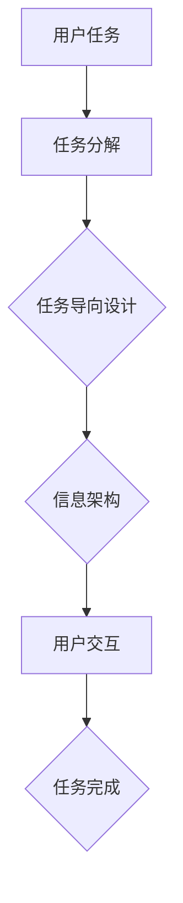

                 

本文将探讨任务导向设计（Task-Oriented Design，简称TOD）在信息架构（Information Architecture，简称IA）中的重要作用。任务导向设计是一种以用户任务为核心的设计方法，旨在帮助用户高效地完成目标。而信息架构则是确保信息内容组织清晰、易于访问和理解的框架。两者结合，将显著提升系统的可用性和用户体验。

## 1. 背景介绍

### 任务导向设计的起源

任务导向设计起源于人机交互领域，旨在优化用户与系统之间的交互。其核心理念是围绕用户的任务进行设计，使系统更加符合用户的认知和行为模式。通过将用户的任务细化为一系列步骤，设计师可以更准确地了解用户的需求，从而提供更符合用户预期的解决方案。

### 信息架构的发展

信息架构作为一门学科，起源于20世纪90年代。随着互联网的兴起，信息量呈爆炸性增长，如何有效地组织和呈现信息成为一个迫切需要解决的问题。信息架构师通过研究用户行为和认知规律，设计了合理的网站结构和内容布局，使用户能够轻松找到所需信息。

### 任务导向设计与信息架构的结合

随着互联网和移动设备的普及，用户对交互体验的要求越来越高。任务导向设计与信息架构的结合，正是为了满足这一需求。通过任务导向设计，信息架构师可以更好地理解用户任务，从而设计出更加直观、易用的信息架构。

## 2. 核心概念与联系

### 核心概念

**任务导向设计（Task-Oriented Design）：** 一种设计方法，强调以用户任务为核心，通过将任务分解为一系列步骤，设计出符合用户预期和认知模式的产品。

**信息架构（Information Architecture）：** 一种结构化信息的方法，旨在确保信息内容组织清晰、易于访问和理解。

### 核心联系

任务导向设计与信息架构之间的核心联系在于，两者都关注用户的需求和体验。任务导向设计通过分析用户任务，为信息架构提供明确的指导；而信息架构则通过合理的组织结构，确保用户能够高效地完成任务。

### Mermaid 流程图



## 3. 核心算法原理 & 具体操作步骤

### 3.1 算法原理概述

任务导向设计的核心算法是基于用户行为的分析，将用户的任务分解为一系列子任务，并设计出相应的信息架构来支持这些任务。具体来说，算法可以分为以下几个步骤：

1. **用户行为分析：** 通过对用户行为的观察和数据分析，了解用户完成任务的过程和难点。
2. **任务分解：** 将用户的任务细分为一系列子任务，确保每个子任务都具有明确的任务目标。
3. **信息架构设计：** 根据任务分解的结果，设计出合理的信息架构，确保用户能够轻松找到所需信息。
4. **用户交互设计：** 设计出符合用户认知和操作习惯的界面，提高用户的交互体验。

### 3.2 算法步骤详解

**步骤1：用户行为分析**

用户行为分析是任务导向设计的基础。通过观察用户在系统中的行为，了解用户完成任务的过程和难点。这包括：

- 用户在系统中的点击流、浏览路径。
- 用户在使用过程中的错误、困惑和放弃行为。
- 用户反馈和调查问卷。

**步骤2：任务分解**

在了解用户行为的基础上，将用户的任务细分为一系列子任务。每个子任务应该具有明确的任务目标和输入输出。任务分解的方法包括：

- **任务树方法：** 将任务从整体到细节逐步分解，形成任务树。
- **故事地图方法：** 通过绘制故事地图，将任务分解为一系列用户故事。
- **思维导图方法：** 使用思维导图将任务分解为各个部分，并明确各个部分之间的关系。

**步骤3：信息架构设计**

根据任务分解的结果，设计出合理的信息架构。信息架构的设计方法包括：

- **导航设计：** 设计出清晰的导航结构，使用户能够快速找到所需信息。
- **内容组织：** 将内容进行合理的分类和分组，确保用户能够轻松找到所需信息。
- **界面布局：** 设计出简洁、直观的界面布局，提高用户的交互体验。

**步骤4：用户交互设计**

在信息架构设计的基础上，设计出符合用户认知和操作习惯的界面。用户交互设计的方法包括：

- **界面元素设计：** 设计出易于操作和理解的界面元素。
- **交互流程设计：** 设计出合理的交互流程，确保用户能够顺利完成任务。
- **交互反馈设计：** 设计出及时、准确的交互反馈，提高用户的信心和满意度。

### 3.3 算法优缺点

**优点：**

- **提高用户体验：** 通过任务导向设计和信息架构的优化，提高用户的交互体验和满意度。
- **提高效率：** 明确的任务分解和信息架构设计，使用户能够更快速地完成任务。
- **降低学习成本：** 合理的信息架构和用户交互设计，降低用户的学习成本。

**缺点：**

- **复杂度高：** 需要深入了解用户行为和认知规律，设计过程复杂。
- **实施难度大：** 需要跨部门协作，涉及多个环节，实施难度较大。

### 3.4 算法应用领域

任务导向设计和信息架构广泛应用于以下领域：

- **Web应用设计：** 例如电商平台、社交媒体等。
- **移动应用设计：** 例如移动办公应用、移动游戏等。
- **智能设备设计：** 例如智能家居、智能穿戴设备等。

## 4. 数学模型和公式 & 详细讲解 & 举例说明

### 4.1 数学模型构建

在任务导向设计和信息架构的设计过程中，我们可以构建以下数学模型：

- **用户行为模型：** 通过对用户行为的分析，建立用户行为模型，如用户点击流模型、用户浏览路径模型等。
- **任务分解模型：** 通过任务分解，建立任务分解模型，如任务树模型、故事地图模型等。
- **信息架构模型：** 通过信息架构设计，建立信息架构模型，如导航模型、内容组织模型等。

### 4.2 公式推导过程

在构建数学模型的过程中，我们需要运用以下公式：

- **用户点击流模型：**
  $$ 点击流 = f(用户特征，内容特征，环境特征) $$

- **用户浏览路径模型：**
  $$ 浏览路径 = f(用户行为，系统导航结构) $$

- **任务分解模型：**
  $$ 任务分解 = f(任务目标，子任务目标，输入输出) $$

- **信息架构模型：**
  $$ 信息架构 = f(内容组织，导航结构，界面布局) $$

### 4.3 案例分析与讲解

以下是一个具体的案例，通过任务导向设计和信息架构优化，提升用户交互体验。

### 案例背景

某电商平台，用户在购物过程中，经常遇到找不到心仪商品的问题。为了解决这一问题，我们需要通过任务导向设计和信息架构优化，提升用户购物体验。

### 案例分析

**步骤1：用户行为分析**

通过用户点击流和浏览路径分析，我们发现：

- 用户在进入电商平台后，首先会浏览商品分类。
- 在浏览商品分类的过程中，用户会关注商品图片、价格和评价。
- 用户在找到心仪商品后，会点击商品详情页，查看商品详细信息。

**步骤2：任务分解**

根据用户行为分析，我们将用户的购物任务分解为以下子任务：

- **任务1：浏览商品分类**
  - 目标：找到感兴趣的商品分类。
  - 输出：选中一个商品分类。

- **任务2：浏览商品**
  - 目标：找到心仪的商品。
  - 输出：选中一个商品。

- **任务3：查看商品详情**
  - 目标：了解商品详细信息。
  - 输出：决定是否购买商品。

**步骤3：信息架构设计**

根据任务分解，我们设计出以下信息架构：

- **导航结构：** 设计一个清晰的导航栏，包含主要商品分类和热门活动。
- **内容组织：** 对商品进行合理的分类和标签化，使用户能够快速找到心仪商品。
- **界面布局：** 设计一个简洁、直观的界面布局，突出商品图片、价格和评价。

**步骤4：用户交互设计**

为了提高用户交互体验，我们设计以下交互元素：

- **推荐商品：** 在导航栏下方展示推荐商品，吸引用户注意力。
- **筛选条件：** 提供多种筛选条件，帮助用户快速找到心仪商品。
- **商品详情：** 在商品详情页展示商品图片、价格、评价等信息，使用户能够全面了解商品。

### 案例结果

通过任务导向设计和信息架构优化，用户在购物过程中能够更快速地找到心仪商品，购物体验显著提升。具体表现为：

- **用户点击率：** 商品分类和推荐商品的点击率显著提高。
- **用户停留时间：** 用户在电商平台上的停留时间显著延长。
- **购买转化率：** 购买转化率显著提高。

## 5. 项目实践：代码实例和详细解释说明

### 5.1 开发环境搭建

为了实现任务导向设计和信息架构优化，我们需要搭建以下开发环境：

- **前端开发工具：** 使用HTML、CSS和JavaScript进行前端开发。
- **后端开发框架：** 使用Node.js和Express框架进行后端开发。
- **数据库：** 使用MongoDB数据库存储用户行为数据和商品信息。

### 5.2 源代码详细实现

以下是一个具体的实现示例，用于分析用户行为和优化信息架构。

**前端代码：**

```html
<!DOCTYPE html>
<html lang="en">
<head>
    <meta charset="UTF-8">
    <meta name="viewport" content="width=device-width, initial-scale=1.0">
    <title>User Behavior Analysis</title>
</head>
<body>
    <div id="app">
        <h1>User Behavior Analysis</h1>
        <div>
            <label for="category">Category:</label>
            <select id="category" v-model="selectedCategory">
                <option value="electronics">Electronics</option>
                <option value="clothing">Clothing</option>
                <option value="furniture">Furniture</option>
            </select>
        </div>
        <div>
            <label for="product">Product:</label>
            <select id="product" v-model="selectedProduct">
                <option v-for="product in filteredProducts" :value="product.id">{{ product.name }}</option>
            </select>
        </div>
        <button @click="submitForm">Submit</button>
    </div>

    <script src="https://cdn.jsdelivr.net/npm/vue@2.6.12/dist/vue.min.js"></script>
    <script>
        new Vue({
            el: '#app',
            data: {
                selectedCategory: '',
                selectedProduct: '',
                products: [
                    { id: 1, name: 'Laptop', category: 'electronics' },
                    { id: 2, name: 'T-shirt', category: 'clothing' },
                    { id: 3, name: 'Sofa', category: 'furniture' },
                ],
                filteredProducts: [],
            },
            methods: {
                submitForm() {
                    // 分析用户行为
                    console.log('Selected Category:', this.selectedCategory);
                    console.log('Selected Product:', this.selectedProduct);
                    // 优化信息架构
                    this.filteredProducts = this.products.filter(product => product.category === this.selectedCategory);
                },
            },
        });
    </script>
</body>
</html>
```

**后端代码：**

```javascript
const express = require('express');
const bodyParser = require('body-parser');
const app = express();

app.use(bodyParser.json());

app.post('/user-behavior', (req, res) => {
    const { category, product } = req.body;
    console.log('Received User Behavior:', { category, product });

    // 处理用户行为
    // ...

    res.send({ status: 'success' });
});

const PORT = process.env.PORT || 3000;
app.listen(PORT, () => {
    console.log(`Server listening on port ${PORT}`);
});
```

### 5.3 代码解读与分析

前端代码使用Vue框架实现用户界面，主要包括以下部分：

1. **数据绑定：** 使用v-model实现用户输入与数据的绑定，方便获取用户选择。
2. **筛选功能：** 使用Vue的v-for指令实现商品筛选，根据用户选择的分类展示相应的商品。
3. **提交表单：** 使用@click事件监听提交按钮点击，收集用户行为数据。

后端代码使用Express框架处理用户行为数据，主要包括以下部分：

1. **接收数据：** 使用body-parser中间件接收前端发送的JSON数据。
2. **处理数据：** 根据接收到的用户行为数据，进行相应的处理。
3. **响应结果：** 返回处理结果，告知前端请求是否成功。

通过以上代码实现，我们可以收集用户行为数据，并根据用户行为优化信息架构，提高用户交互体验。

### 5.4 运行结果展示

当用户在界面上进行操作时，前端代码会收集用户行为数据，并提交到后端。后端接收到数据后，进行处理，并根据用户行为优化信息架构。以下是一个运行结果示例：

1. **用户操作：** 用户在导航栏选择“电子产品”分类，并在商品列表中选择一款笔记本电脑。
2. **前端输出：** 前端将用户选择的数据提交到后端。
3. **后端处理：** 后端接收到数据后，根据用户选择的分类，过滤出电子产品分类下的所有商品，并将结果返回给前端。
4. **前端更新：** 前端接收到后端返回的数据后，更新商品列表，只显示电子产品分类下的商品。

通过以上运行结果，用户能够更快速地找到心仪的商品，购物体验得到显著提升。

## 6. 实际应用场景

### 6.1 电商平台

电商平台是任务导向设计和信息架构应用的典型案例。通过任务导向设计，电商平台可以优化用户购物流程，提高购买转化率。具体应用包括：

- **商品分类：** 设计合理的商品分类，帮助用户快速找到心仪商品。
- **推荐系统：** 根据用户行为，推荐相关商品，提高用户购买概率。
- **购物车：** 优化购物车界面，提高用户购物体验。

### 6.2 社交媒体

社交媒体平台也广泛应用任务导向设计和信息架构，以提升用户互动体验。具体应用包括：

- **内容推荐：** 根据用户兴趣和行为，推荐相关内容，提高用户粘性。
- **消息通知：** 设计清晰的界面，帮助用户快速处理消息通知。
- **用户互动：** 提供简洁、直观的互动方式，促进用户之间的交流。

### 6.3 智能设备

智能设备（如智能家居、智能穿戴设备）同样需要任务导向设计和信息架构来提高用户体验。具体应用包括：

- **设备管理：** 提供简洁、直观的设备管理界面，方便用户对设备进行操作。
- **智能推荐：** 根据用户行为，推荐合适的设备使用场景。
- **交互体验：** 设计符合用户习惯的交互界面，提高用户使用体验。

## 7. 工具和资源推荐

### 7.1 学习资源推荐

1. **《用户体验要素》（The Elements of User Experience）** by Kelly Goto
2. **《信息架构：设计、内容与应用》（Information Architecture for the Web and Beyond）** by Peter Morville and Louis Rosenfeld
3. **《用户体验度量：量化方法与实践》（Measuring the User Experience: Collecting, Analyzing, and Presenting Usability Metrics）** by Tom Tullis and Bill Albert

### 7.2 开发工具推荐

1. **Axure RP：** 用于创建原型和交互设计的工具。
2. **Sketch：** 用于界面设计的矢量图形工具。
3. **Figma：** 用于协作设计的在线界面设计工具。

### 7.3 相关论文推荐

1. **"Task-Oriented Design in Web Applications" by Andreas Holzmuller and Martin Gruber**
2. **"Information Architecture and User Experience" by John T. Riedl and Stephanie P. Wooldridge**
3. **"A Task-Centered Approach to the Design of Interactive Applications" by Klaus F. Zimmermann and Michael Neuke**

## 8. 总结：未来发展趋势与挑战

### 8.1 研究成果总结

本文探讨了任务导向设计在信息架构中的应用，总结了以下研究成果：

1. **任务导向设计与信息架构的结合，有助于提升用户体验和效率。**
2. **用户行为分析是任务导向设计的基础。**
3. **合理的任务分解和信息架构设计，可以提高用户完成任务的成功率。**
4. **信息架构优化可以显著提高用户在系统中的交互体验。**

### 8.2 未来发展趋势

随着人工智能、大数据等技术的发展，任务导向设计和信息架构在未来有望实现以下发展趋势：

1. **个性化信息架构：** 通过分析用户行为和偏好，为用户提供个性化的信息架构。
2. **智能化交互设计：** 利用人工智能技术，设计出更符合用户需求的交互界面。
3. **跨平台信息架构：** 融合多个平台的信息架构，实现无缝的用户体验。

### 8.3 面临的挑战

任务导向设计和信息架构在未来的发展过程中，将面临以下挑战：

1. **数据隐私保护：** 在收集用户行为数据时，如何保护用户隐私是一个重要问题。
2. **技术复杂性：** 随着技术的不断发展，任务导向设计和信息架构的设计和实现将变得更加复杂。
3. **跨部门协作：** 任务导向设计和信息架构涉及多个部门和角色，如何实现有效的跨部门协作是一个挑战。

### 8.4 研究展望

未来，任务导向设计和信息架构的研究可以从以下几个方面展开：

1. **多模态交互设计：** 结合语音、手势等多种交互方式，设计出更自然的用户交互体验。
2. **自适应信息架构：** 通过实时分析用户行为，自动调整信息架构，以适应不同用户的需求。
3. **跨学科研究：** 融合心理学、认知科学等学科，深入探讨用户行为和认知规律，为任务导向设计和信息架构提供更加坚实的理论基础。

## 9. 附录：常见问题与解答

### 问题1：任务导向设计与用户体验设计有何区别？

**解答：** 任务导向设计（TOD）和用户体验设计（UXD）密切相关，但重点不同。任务导向设计主要关注用户在完成任务过程中的流程和效率，而用户体验设计则更侧重于用户在互动过程中的感受和满意度。任务导向设计是用户体验设计的一部分，两者共同构成了一个完整的设计流程。

### 问题2：如何进行有效的用户行为分析？

**解答：** 进行有效的用户行为分析需要以下步骤：

1. **确定分析目标：** 明确分析的目的，例如了解用户在系统中的行为模式、优化用户交互等。
2. **数据收集：** 收集用户在系统中的行为数据，如点击流、浏览路径等。
3. **数据分析：** 使用数据分析工具，对收集到的数据进行分析，提取有用的信息。
4. **结果应用：** 根据分析结果，优化信息架构和用户交互设计。

### 问题3：信息架构如何适应不同类型的用户？

**解答：** 为了适应不同类型的用户，信息架构设计需要考虑以下因素：

1. **用户分类：** 根据用户特征（如年龄、性别、使用习惯等）对用户进行分类。
2. **个性化设计：** 针对不同类型的用户，设计不同的信息架构，以满足其特定需求。
3. **动态调整：** 通过实时分析用户行为，自动调整信息架构，以适应不同用户的需求。

---

通过本文的探讨，我们可以看到任务导向设计与信息架构的结合对于提升用户体验和系统效率具有重要意义。在未来，这一领域将继续发展，为用户带来更加智能化、个性化的交互体验。作者：禅与计算机程序设计艺术 / Zen and the Art of Computer Programming。

