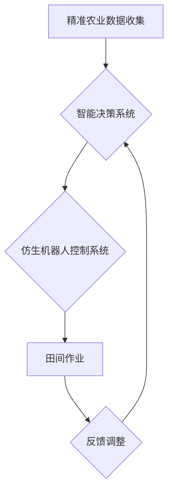

                 

关键词：仿生机器人、精准农业、种植、收获、智能农业、自动化、农业科技

摘要：随着全球人口的增长和资源的有限性，农业面临着巨大的挑战。仿生机器人作为智能农业的重要技术，已经在种植和收获过程中展现了其独特的优势。本文将深入探讨仿生机器人在农业中的应用，包括精准种植和收获的技术原理、算法、数学模型、实际应用场景、未来展望以及面临的挑战。

## 1. 背景介绍

农业作为人类生存的基础，随着科技的发展，农业也在不断变革。传统的农业模式依靠人力和简单机械，效率低下，且难以应对复杂的农业生产环境。随着精准农业和智能农业的兴起，农业科技开始向自动化、智能化方向发展。

仿生机器人是智能农业的重要组成部分，它们模仿自然生物的某些结构和功能来工作。这些机器人能够在复杂环境中执行任务，如监测土壤湿度、进行精准施肥、移栽作物、以及收获果实等。仿生机器人的应用，不仅提高了农业生产效率，还减少了资源消耗，有助于实现可持续农业发展。

## 2. 核心概念与联系

### 2.1. 仿生机器人

仿生机器人是指那些模仿自然界生物的结构、功能和行为特点，用于执行特定任务的机器人。在农业领域，仿生机器人主要模仿昆虫、鸟类和人类的某些行为。

### 2.2. 精准农业

精准农业是一种通过现代信息技术手段，如GPS、GIS、传感器等，对农田进行精准管理，以提高作物产量和资源利用率的农业生产方式。

### 2.3. 智能农业

智能农业是将物联网、大数据、云计算、人工智能等技术应用于农业生产，实现农业生产的智能化和自动化。

### 2.4. 仿生机器人与精准农业、智能农业的联系

仿生机器人作为智能农业的一部分，它们的应用不仅依赖于精准农业的数据支持，还与智能农业的自动化系统紧密结合。通过传感器收集的农田数据，仿生机器人能够做出精准的种植和收获决策。

### 2.5. Mermaid 流程图



## 3. 核心算法原理 & 具体操作步骤

### 3.1. 算法原理概述

仿生机器人在农业中的应用，主要通过以下几种核心算法实现：

- **图像识别算法**：用于识别农田中的作物和病害。
- **路径规划算法**：用于规划机器人在农田中的行走路径。
- **传感器数据处理算法**：用于处理土壤湿度、养分含量等数据。

### 3.2. 算法步骤详解

1. **数据收集**：通过安装在机器人上的传感器收集土壤湿度、温度、养分含量等数据。
2. **图像识别**：利用图像识别算法分析作物生长状况，识别病虫害。
3. **路径规划**：根据农田布局和作物生长情况，利用路径规划算法规划机器人的行走路径。
4. **作业执行**：机器人根据规划路径执行施肥、移栽、收获等作业。
5. **反馈调整**：通过传感器和图像识别的数据，对机器人的作业效果进行实时调整。

### 3.3. 算法优缺点

**优点**：
- 提高农业生产效率。
- 减少人力成本。
- 实现农业生产的精准化和智能化。

**缺点**：
- 投资成本较高。
- 技术维护和更新需求大。

### 3.4. 算法应用领域

- **种植环节**：精准施肥、病虫害监测、移栽作物。
- **收获环节**：果实采摘、作物收割。

## 4. 数学模型和公式 & 详细讲解 & 举例说明

### 4.1. 数学模型构建

在农业中，常见的数学模型包括：

- **土壤水分含量模型**：通过土壤湿度传感器收集数据，建立土壤水分含量与湿度之间的关系模型。
- **作物生长模型**：根据作物的生长周期和生长特性，建立作物生长模型。
- **收获模型**：根据作物成熟度和农田条件，建立作物收获模型。

### 4.2. 公式推导过程

以土壤水分含量模型为例：

$$
\text{土壤水分含量} = f(\text{传感器湿度数据})
$$

其中，$f$ 为土壤水分含量与传感器湿度数据之间的函数关系。

### 4.3. 案例分析与讲解

以某农田为例，通过传感器收集到土壤湿度为60%，利用土壤水分含量模型计算得到土壤水分含量为50%。

根据作物生长模型，当土壤水分含量在40%-60%之间时，作物生长状态良好。因此，机器人将根据这一数据调整灌溉计划，确保作物得到适宜的水分。

## 5. 项目实践：代码实例和详细解释说明

### 5.1. 开发环境搭建

- 操作系统：Ubuntu 20.04
- 编程语言：Python 3.8
- 开发工具：PyCharm

### 5.2. 源代码详细实现

以下是一个简单的土壤水分监测代码实例：

```python
import serial
import time

# 连接串口
ser = serial.Serial('/dev/ttyUSB0', 9600, timeout=1)

# 循环读取数据
while True:
    # 读取传感器数据
    data = ser.readline().decode('utf-8')
    # 转换为浮点数
    humidity = float(data)
    
    # 计算土壤水分含量
    moisture = f(humidity)
    
    # 打印结果
    print(f"当前土壤湿度：{humidity}%，土壤水分含量：{moisture}%")
    
    # 等待1秒
    time.sleep(1)
```

### 5.3. 代码解读与分析

- `serial.Serial`：用于连接串口。
- `readline()`：读取一行数据。
- `decode()`：将字节转换为字符串。
- `float()`：将字符串转换为浮点数。
- `f`：函数，用于计算土壤水分含量。

### 5.4. 运行结果展示

运行代码后，将实时显示土壤湿度数据和计算出的土壤水分含量。

## 6. 实际应用场景

### 6.1. 精准种植

仿生机器人可以根据土壤水分、养分含量等数据，精准施肥和播种，提高作物生长效率。

### 6.2. 精准收获

仿生机器人可以通过图像识别和路径规划，实现果实的精准采摘和作物的精准收割。

### 6.3. 病虫害监测

仿生机器人可以实时监测农田中的病虫害，及时采取措施，减少损失。

### 6.4. 未来应用展望

随着技术的不断发展，仿生机器人在农业中的应用将更加广泛，包括智能灌溉、智能施肥、智能除草等。

## 7. 工具和资源推荐

### 7.1. 学习资源推荐

- 《精准农业技术》
- 《智能农业：概念、技术和应用》

### 7.2. 开发工具推荐

- PyCharm
- MATLAB

### 7.3. 相关论文推荐

- "A Survey on Precision Agriculture: Technologies, Platforms, and Applications"
- "Smart Farming: From the Internet of Things to Artificial Intelligence in Agriculture"

## 8. 总结：未来发展趋势与挑战

### 8.1. 研究成果总结

仿生机器人在农业中的应用取得了显著成果，提高了农业生产效率，减少了资源消耗。

### 8.2. 未来发展趋势

随着人工智能、物联网等技术的发展，仿生机器人在农业中的应用将更加智能化、自动化。

### 8.3. 面临的挑战

- 投资成本和技术维护。
- 农业环境的复杂性和多样性。

### 8.4. 研究展望

未来研究应重点关注降低成本、提高可靠性和适应性，以及与现代农业体系的深度融合。

## 9. 附录：常见问题与解答

### 9.1. 问题1

**问题**：仿生机器人的成本是否很高？

**解答**：目前仿生机器人的成本相对较高，但随着技术的进步和市场的扩大，成本有望逐步降低。

### 9.2. 问题2

**问题**：仿生机器人在复杂农田中的适应性如何？

**解答**：仿生机器人通过先进的传感器和算法，能够适应复杂农田环境，但还需要不断优化以提高适应性。

### 9.3. 问题3

**问题**：仿生机器人能否完全替代人力？

**解答**：仿生机器人能够在很多环节替代人力，但完全替代人力还需要解决一系列技术和社会问题。

---

作者：禅与计算机程序设计艺术 / Zen and the Art of Computer Programming

以上是关于仿生机器人在农业中的应用：精准种植和收获的文章，希望对您有所帮助。如果您有任何问题或建议，欢迎随时提问。|>

