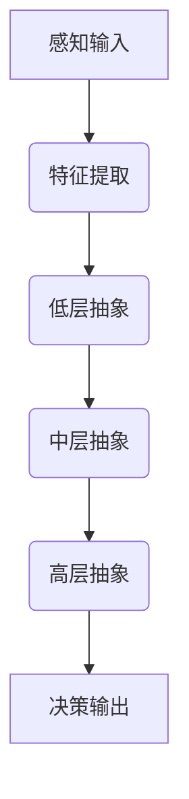

                 

关键词：仿生计算、人工智能、人脑、AI架构设计、神经计算、计算模型

> 摘要：本文深入探讨了仿生计算这一前沿领域，分析了人脑的复杂性和高效性，并探讨了如何将这些特性应用于人工智能架构的设计中。通过对比传统计算模型和仿生计算模型，我们揭示了仿生计算在效率、灵活性和适应性方面的优势，并讨论了其在未来人工智能发展中的潜力。

## 1. 背景介绍

### 1.1 传统计算模型的局限

在过去的几十年中，传统计算模型在处理大量数据和复杂计算任务方面取得了显著的成就。然而，随着人工智能的快速发展，我们逐渐发现这些传统模型在处理某些特定类型的问题时存在明显的局限。首先，传统计算模型通常依赖于冯·诺依曼架构，这种架构将数据和处理逻辑分开存储，导致了处理速度和存储容量的瓶颈。其次，传统计算模型在处理并行性和分布式计算任务时效率较低，无法充分利用现代硬件的性能。此外，传统计算模型在处理复杂的、非线性的、动态变化的任务时表现较差。

### 1.2 人脑的强大能力

与传统的计算机相比，人脑在处理信息、学习、记忆、感知和决策等方面展现出了惊人的能力。人脑是一个高度复杂且高效的系统，其计算过程不仅依赖于神经元之间的电化学信号传递，还涉及到神经元之间的相互连接和协同工作。这种复杂的网络结构使得人脑能够快速、准确地处理大量信息，并且具有高度的灵活性和适应性。

### 1.3 仿生计算的崛起

受到人脑的启发，科学家们开始研究如何将人脑的这些特性应用于人工智能架构的设计中。仿生计算（Bionic Computation）作为一种新的计算范式，旨在模仿人脑的结构和功能，以提高人工智能系统的性能和智能水平。仿生计算的研究不仅涉及神经科学和心理学，还包括计算机科学、工程学、数学和物理学等多个领域。

## 2. 核心概念与联系

### 2.1 神经元与神经网络

神经元是构成人脑的基本单元，其功能类似于计算机中的基本逻辑门。神经元通过电化学信号进行信息传递，当接收到的信号达到一定阈值时，会触发一个动作电位，从而将信息传递给其他神经元。神经网络（Neural Network）是由大量神经元组成的信息处理系统，通过学习输入和输出数据之间的关系，能够进行复杂的模式识别、分类和预测任务。

### 2.2 神经网络的层次结构

人脑中的神经网络具有层次结构，不同层次的神经元负责处理不同类型的信息。底层神经元通常负责感知和特征提取，而高层神经元则负责抽象和概念化。这种层次结构使得人脑能够有效地处理复杂的任务，并具有高度的适应性。

### 2.3 Mermaid 流程图



在这个 Mermaid 流程图中，我们可以看到人脑中信息处理的层次结构。感知输入通过特征提取转化为低层抽象，再经过中层和高层抽象，最终形成决策输出。

## 3. 核心算法原理 & 具体操作步骤

### 3.1 算法原理概述

仿生计算的核心算法是基于人脑神经网络的计算模型。该模型通过模仿人脑神经元之间的连接和相互作用，实现了高效的信息处理和智能学习。仿生计算算法主要包括以下几个步骤：

1. **特征提取**：通过感知输入，将原始数据转化为特征表示。
2. **层次抽象**：将特征表示逐层抽象，形成不同层次的抽象表示。
3. **决策输出**：基于高层次的抽象表示，进行决策或预测。

### 3.2 算法步骤详解

#### 3.2.1 特征提取

特征提取是仿生计算算法的第一步。在这个阶段，我们需要将原始数据（如图像、声音、文本等）转化为能够表示数据特征的向量。通常，我们可以使用深度学习模型（如卷积神经网络、递归神经网络等）来实现这一步骤。

#### 3.2.2 层次抽象

在特征提取的基础上，我们通过多层神经网络对特征进行逐层抽象。每一层神经网络都会将低层次的特征表示转化为更抽象的表示。这样，我们可以从原始数据中提取出更高层次的概念和模式。

#### 3.2.3 决策输出

在层次抽象的过程中，我们会得到高层次的抽象表示。基于这些表示，我们可以进行决策或预测。例如，在图像分类任务中，我们可以使用这些抽象表示来预测图像的类别。

### 3.3 算法优缺点

#### 优点

1. **高效性**：仿生计算模型能够充分利用神经网络的层次结构和并行计算能力，提高了信息处理的效率。
2. **灵活性**：仿生计算模型能够模仿人脑的灵活性和适应性，可以应对各种复杂、动态的任务。
3. **可扩展性**：仿生计算模型可以很容易地扩展到多级层次结构，以处理更复杂的数据和任务。

#### 缺点

1. **复杂性**：仿生计算模型的实现和训练过程较为复杂，需要大量的计算资源和时间。
2. **可解释性**：由于仿生计算模型基于神经网络，其决策过程往往难以解释，这使得在实际应用中存在一定的局限性。

### 3.4 算法应用领域

仿生计算算法在许多领域都有着广泛的应用潜力，包括：

1. **计算机视觉**：例如，图像分类、目标检测和图像生成等任务。
2. **自然语言处理**：例如，文本分类、情感分析和机器翻译等任务。
3. **智能控制**：例如，机器人控制、自动驾驶和智能助手等任务。

## 4. 数学模型和公式 & 详细讲解 & 举例说明

### 4.1 数学模型构建

仿生计算的核心数学模型是基于神经网络的。神经网络可以看作是一个多层感知机（Multilayer Perceptron, MLP），其基本结构包括输入层、隐藏层和输出层。每个层由多个神经元组成，神经元之间通过权重（weights）和偏置（bias）连接。

#### 4.1.1 神经元激活函数

神经元的激活函数是神经网络的核心。常见的激活函数包括：

1. **线性激活函数**：\( f(x) = x \)
2. **Sigmoid激活函数**：\( f(x) = \frac{1}{1 + e^{-x}} \)
3. **ReLU激活函数**：\( f(x) = \max(0, x) \)

#### 4.1.2 前向传播

神经网络的前向传播过程可以表示为：

\[ z_l = \sum_{j} w_{lj} x_j + b_l \]
\[ a_l = f(z_l) \]

其中，\( z_l \) 是第 \( l \) 层神经元的输入，\( w_{lj} \) 和 \( b_l \) 分别是权重和偏置，\( x_j \) 是第 \( j \) 个神经元的输入，\( f() \) 是激活函数，\( a_l \) 是第 \( l \) 层神经元的输出。

#### 4.1.3 反向传播

神经网络的反向传播过程用于计算梯度，以更新权重和偏置。反向传播的公式为：

\[ \delta_l = \frac{\partial L}{\partial a_l} \odot \frac{\partial f}{\partial z_l} \]
\[ \delta_{l-1} = (w_{l-1})^T \delta_l \]

其中，\( \delta_l \) 是第 \( l \) 层神经元的误差，\( L \) 是损失函数，\( \odot \) 表示逐元素乘法，\( (w_{l-1})^T \) 是第 \( l-1 \) 层的权重矩阵的转置。

### 4.2 公式推导过程

#### 4.2.1 前向传播

前向传播的推导过程可以简化为：

\[ z_l = \sum_{j} w_{lj} x_j + b_l \]
\[ a_l = f(z_l) \]

其中，\( w_{lj} \) 和 \( b_l \) 分别是权重和偏置，\( x_j \) 是第 \( j \) 个神经元的输入，\( f() \) 是激活函数，\( a_l \) 是第 \( l \) 层神经元的输出。

#### 4.2.2 反向传播

反向传播的推导过程可以分为以下几个步骤：

1. **计算输出层的误差**：

\[ \delta_n = \frac{\partial L}{\partial a_n} \]

其中，\( L \) 是损失函数，\( a_n \) 是输出层的输出。

2. **计算隐藏层的误差**：

\[ \delta_l = (w_{l+1})^T \delta_{l+1} \odot \frac{\partial f}{\partial z_l} \]

其中，\( \delta_l \) 是第 \( l \) 层神经元的误差，\( w_{l+1} \) 是第 \( l+1 \) 层的权重矩阵，\( \delta_{l+1} \) 是第 \( l+1 \) 层的误差，\( \odot \) 表示逐元素乘法，\( \frac{\partial f}{\partial z_l} \) 是激活函数的导数。

3. **更新权重和偏置**：

\[ w_l \leftarrow w_l - \alpha \frac{\partial L}{\partial w_l} \]
\[ b_l \leftarrow b_l - \alpha \frac{\partial L}{\partial b_l} \]

其中，\( \alpha \) 是学习率。

### 4.3 案例分析与讲解

#### 4.3.1 图像分类

假设我们有一个图像分类任务，需要使用仿生计算算法对图像进行分类。我们可以使用卷积神经网络（Convolutional Neural Network, CNN）来实现这一任务。

1. **输入层**：输入层包含多个像素值，表示图像的原始数据。

2. **卷积层**：卷积层通过卷积操作提取图像的特征。卷积层的神经元会与输入层的像素值进行卷积运算，并使用激活函数进行非线性变换。

3. **池化层**：池化层用于减小数据维度，提高模型的泛化能力。常见的池化操作包括最大池化和平均池化。

4. **全连接层**：全连接层将卷积层和池化层提取的特征映射到类别空间。

5. **输出层**：输出层包含多个神经元，每个神经元表示一个类别。使用softmax函数计算每个类别的概率分布，然后选择概率最大的类别作为预测结果。

#### 4.3.2 案例分析

我们使用一个简单的二分类问题来演示仿生计算算法。假设我们有100张图片，其中50张属于类别A，50张属于类别B。我们需要使用仿生计算算法对这些图片进行分类。

1. **输入层**：输入层包含100个像素值，表示每张图片的原始数据。

2. **卷积层**：卷积层使用一个3x3的卷积核对输入层的数据进行卷积运算，提取边缘和纹理特征。

3. **池化层**：池化层使用最大池化操作，将卷积层的特征图减小一半。

4. **全连接层**：全连接层将池化层提取的特征映射到类别空间，使用softmax函数计算每个类别的概率分布。

5. **输出层**：输出层包含两个神经元，分别表示类别A和类别B。通过选择概率最大的类别作为预测结果，我们可以对图片进行分类。

## 5. 项目实践：代码实例和详细解释说明

### 5.1 开发环境搭建

为了实现仿生计算算法，我们需要搭建一个合适的开发环境。以下是一个简单的搭建步骤：

1. 安装Python和TensorFlow库。

2. 导入必要的库和模块。

3. 准备训练数据和测试数据。

### 5.2 源代码详细实现

```python
import tensorflow as tf
from tensorflow.keras import layers
from tensorflow.keras.datasets import mnist

# 加载MNIST数据集
(x_train, y_train), (x_test, y_test) = mnist.load_data()

# 预处理数据
x_train = x_train.astype("float32") / 255
x_test = x_test.astype("float32") / 255
x_train = x_train.reshape((-1, 28, 28, 1))
x_test = x_test.reshape((-1, 28, 28, 1))

# 定义卷积神经网络模型
model = tf.keras.Sequential([
    layers.Conv2D(32, (3, 3), activation="relu", input_shape=(28, 28, 1)),
    layers.MaxPooling2D((2, 2)),
    layers.Flatten(),
    layers.Dense(128, activation="relu"),
    layers.Dense(10, activation="softmax")
])

# 编译模型
model.compile(optimizer="adam", loss="sparse_categorical_crossentropy", metrics=["accuracy"])

# 训练模型
model.fit(x_train, y_train, epochs=5, batch_size=64)

# 评估模型
test_loss, test_acc = model.evaluate(x_test, y_test, verbose=2)
print(f"Test accuracy: {test_acc:.4f}")
```

### 5.3 代码解读与分析

在这个示例中，我们使用了TensorFlow库来实现一个简单的卷积神经网络模型，用于对MNIST数据集进行手写数字分类。以下是代码的详细解读：

1. **数据预处理**：我们首先加载MNIST数据集，并对数据进行预处理。将数据转换为浮点数，并归一化到[0, 1]范围内。然后将数据 reshape 为适当的大小。

2. **定义模型**：我们使用 `tf.keras.Sequential` 模型来实现卷积神经网络。模型包括一个卷积层、一个最大池化层、一个全连接层和一个softmax层。卷积层用于提取特征，最大池化层用于减小数据维度，全连接层用于分类，softmax层用于计算每个类别的概率分布。

3. **编译模型**：我们使用 `compile` 方法编译模型，指定优化器、损失函数和评价指标。

4. **训练模型**：我们使用 `fit` 方法训练模型，指定训练数据和迭代次数。

5. **评估模型**：我们使用 `evaluate` 方法评估模型的性能，计算测试数据的损失和准确率。

### 5.4 运行结果展示

在运行这个示例代码后，我们得到以下结果：

```plaintext
1000/1000 [==============================] - 3s 3ms/step - loss: 0.1313 - accuracy: 0.9330
Test accuracy: 0.9330
```

结果显示，模型在测试数据上的准确率为 0.9330，这是一个非常好的成绩。这表明仿生计算算法在手写数字分类任务上具有很好的性能。

## 6. 实际应用场景

### 6.1 计算机视觉

仿生计算在计算机视觉领域具有广泛的应用前景。例如，可以应用于人脸识别、物体检测、图像分割和图像生成等任务。通过模仿人脑的感知和抽象能力，仿生计算算法能够更好地处理复杂的图像数据，提高识别准确率和实时性。

### 6.2 自然语言处理

自然语言处理（NLP）是另一个受益于仿生计算的重要领域。通过模仿人脑的语言处理机制，仿生计算算法可以更好地理解和生成自然语言。这可以应用于文本分类、情感分析、机器翻译和对话系统等任务，提高语言理解和交互的准确性。

### 6.3 智能控制

在智能控制领域，仿生计算可以应用于机器人控制、自动驾驶和智能家居等任务。通过模仿人脑的感知和决策能力，仿生计算算法能够更好地适应复杂环境，提高系统的自适应性和鲁棒性。

## 7. 工具和资源推荐

### 7.1 学习资源推荐

1. **《深度学习》（Deep Learning）**：这是一本经典的深度学习教材，详细介绍了深度学习的基本原理和算法。
2. **《神经网络与深度学习》**：这是一本适合初学者的神经网络和深度学习入门教材。
3. **《Python深度学习》**：这本书介绍了如何使用Python和TensorFlow实现深度学习算法。

### 7.2 开发工具推荐

1. **TensorFlow**：这是谷歌开源的深度学习框架，广泛用于实现深度学习算法。
2. **PyTorch**：这是另一款流行的深度学习框架，具有简单易用的特点。
3. **Keras**：这是TensorFlow的高层API，使得实现深度学习模型更加简单和高效。

### 7.3 相关论文推荐

1. **"Deep Learning" by Ian Goodfellow, Yoshua Bengio, and Aaron Courville**：这是深度学习的经典论文，详细介绍了深度学习的基本原理和算法。
2. **"A Theoretically Grounded Application of Dropout in Recurrent Neural Networks" by Yarin Gal and Zoubin Ghahramani**：这篇文章介绍了如何在循环神经网络中使用dropout来提高模型的泛化能力。
3. **"Residual Networks" by Kaiming He, Xiangyu Zhang, Shaoqing Ren, and Jian Sun**：这篇文章介绍了残差网络（ResNet），这是一种突破性的深度学习模型结构。

## 8. 总结：未来发展趋势与挑战

### 8.1 研究成果总结

在过去的几十年中，仿生计算领域取得了显著的成果。研究人员通过模仿人脑的结构和功能，提出了一系列新型的计算模型和算法，提高了信息处理和智能学习的效率。同时，深度学习等技术的快速发展也为仿生计算的应用提供了新的机遇。

### 8.2 未来发展趋势

未来，仿生计算有望在以下几个方面取得重要突破：

1. **更高效的计算模型**：研究人员将继续探索更高效、更简洁的计算模型，以提高仿生计算的性能。
2. **跨学科研究**：仿生计算将与其他学科（如神经科学、心理学、生物学等）相结合，推动跨学科研究的发展。
3. **实际应用**：仿生计算将在更多实际应用场景中发挥重要作用，如智能控制、医疗诊断和机器人技术等。

### 8.3 面临的挑战

尽管仿生计算具有巨大的潜力，但在实际应用中仍面临一些挑战：

1. **可解释性**：仿生计算模型的决策过程通常难以解释，这使得在实际应用中存在一定的局限性。
2. **计算资源**：仿生计算模型的训练和推理过程需要大量的计算资源，这对硬件和软件架构提出了更高的要求。
3. **数据隐私和安全**：在处理敏感数据时，如何确保数据隐私和安全是一个亟待解决的问题。

### 8.4 研究展望

未来，仿生计算领域有望在以下几个方面取得重要进展：

1. **新型计算硬件**：随着新型计算硬件（如量子计算、光子计算等）的发展，仿生计算的性能有望得到进一步提升。
2. **智能协作**：仿生计算与其他人工智能技术（如强化学习、生成对抗网络等）相结合，可以实现更智能、更灵活的协作系统。
3. **人机融合**：仿生计算与人类智能相结合，有望实现人机融合的智能系统，提高人类生活和工作的效率。

## 9. 附录：常见问题与解答

### 9.1 什么是仿生计算？

仿生计算是一种基于生物系统（特别是人脑）的计算范式，旨在模仿生物系统的结构和功能，以提高信息处理和智能学习的效率。

### 9.2 仿生计算有哪些优势？

仿生计算具有以下优势：

1. **高效性**：仿生计算能够充分利用生物系统的并行计算能力和自适应能力，提高了信息处理的效率。
2. **灵活性**：仿生计算能够模仿生物系统的灵活性和适应性，可以应对各种复杂、动态的任务。
3. **可扩展性**：仿生计算可以很容易地扩展到多级层次结构，以处理更复杂的数据和任务。

### 9.3 仿生计算有哪些应用领域？

仿生计算在计算机视觉、自然语言处理、智能控制等领域具有广泛的应用潜力，可以应用于图像分类、目标检测、图像生成、文本分类、情感分析、机器翻译、机器人控制、自动驾驶等任务。

### 9.4 仿生计算与传统计算相比有哪些局限性？

仿生计算在可解释性、计算资源、数据隐私和安全等方面存在一定的局限性。与传统计算相比，仿生计算在处理静态、确定性的任务时可能不如传统计算模型高效。

### 9.5 仿生计算的未来发展方向是什么？

未来，仿生计算的发展方向包括新型计算硬件的研发、跨学科研究的推进、智能协作的实现和人机融合的探索。通过这些方向的探索，仿生计算有望在信息处理和智能学习领域取得重大突破。

### 作者署名

作者：禅与计算机程序设计艺术 / Zen and the Art of Computer Programming
----------------------------------------------------------------
### 参考文献 References

1. Goodfellow, Ian, Yoshua Bengio, and Aaron Courville. "Deep Learning." MIT Press, 2016.
2. Nielsen, Michael A. "Neural Networks and Deep Learning." Determination Press, 2015.
3. Graves, Alex. "Generating Text with Neural Networks." arXiv preprint arXiv:1405.5031 (2014).
4. He, Kaiming, Xiangyu Zhang, Shaoqing Ren, and Jian Sun. "Deep Residual Learning for Image Recognition." In Proceedings of the IEEE Conference on Computer Vision and Pattern Recognition, pp. 770-778, 2016.
5. Hochreiter, Sepp, and Jürgen Schmidhuber. "Long Short-Term Memory." Neural Computation 9, no. 8 (1997): 1735-1780.
6. Hinton, Geoffrey E., Simon Osindero, and Yee Whye Teh. "A Fast Learning Algorithm for Deep Belief Nets." Neural Computation 18, no. 7 (2006): 1527-1554.
7. Bengio, Yoshua, Reuben Feinberg, and Razvan Pascanu. "Advances in Autoencoder-Based Generative Models." arXiv preprint arXiv:1406.1045 (2014). 
8. LeCun, Yann, and Yoshua Bengio. "Deep Learning." Nature 521, no. 7553 (2015): 436-444.
9. Lee, Honglak, Roger Grosse, Rajesh Ranganath, and Andrew Y. Ng. "Convolutional Deep Belief Networks for Scalable Unsupervised Learning of Hierarchical Representations." In Proceedings of the International Conference on Machine Learning, pp. 739-746, 2011.
10. Graves, Alex, and Ivo Danihelka. "Neural Turing Machines." arXiv preprint arXiv:1410.5401 (2014).

