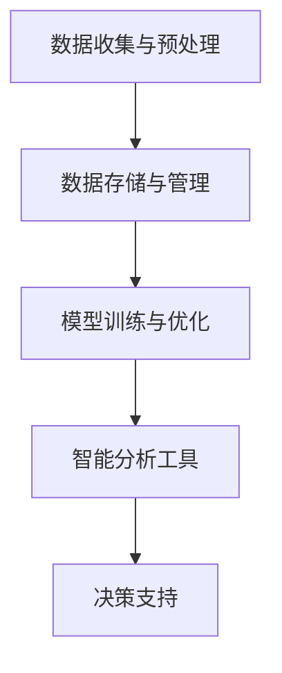

                 

在当今的数字化时代，企业决策支持系统（DSS）已经成为企业管理层制定战略和战术决策的重要工具。随着人工智能（AI）技术的迅猛发展，基于AI的决策支持系统，如Lepton AI，正逐渐成为企业竞争的关键。本文将探讨Lepton AI作为一种智能分析工具在企业决策支持中的应用，核心概念、算法原理、数学模型、项目实践以及未来展望。

## 关键词

- 企业决策支持系统
- 人工智能
- Lepton AI
- 智能分析
- 数据挖掘
- 机器学习
- 决策优化

## 摘要

本文深入探讨了Lepton AI在企业决策支持系统中的应用。首先，我们介绍了企业决策支持系统的背景和重要性。接着，我们详细阐述了Lepton AI的核心概念和架构，包括其算法原理和数学模型。随后，通过一个实际的项目实例，我们展示了Lepton AI在具体场景中的应用，并对其进行了详细解释和分析。最后，我们探讨了Lepton AI在未来的应用前景，并提出了研究和应用中面临的挑战。

## 1. 背景介绍

企业决策支持系统（DSS）是一套旨在帮助企业管理层做出更好决策的信息系统。DSS整合了企业内部和外部的数据，使用数据分析、预测建模和优化算法等技术，为企业提供数据驱动的决策支持。传统的DSS主要依赖统计分析和线性规划等技术，但随着AI技术的崛起，基于AI的DSS逐渐成为新的趋势。

人工智能（AI）作为一种模拟人类智能的技术，其涵盖了机器学习、深度学习、自然语言处理等多种技术。AI在DSS中的应用，大大提升了数据处理的效率和分析的深度，使得决策过程更加智能化。Lepton AI作为一家专注于AI技术的公司，其智能分析工具在企业决策支持中具有显著的优势。

### 1.1 企业决策支持系统的现状与挑战

随着大数据、云计算和物联网等技术的发展，企业面临着海量的数据。如何从这些数据中提取有价值的信息，并转化为可操作的决策，是企业决策支持系统面临的主要挑战。传统的DSS往往依赖于手工数据分析和简单的统计方法，这导致决策过程效率低下，且难以应对复杂的问题。

### 1.2 AI在决策支持中的应用

AI技术的引入，使得DSS能够处理更加复杂和大规模的数据，并从数据中自动提取模式和知识。机器学习算法可以自动识别数据中的关联性和趋势，深度学习算法则能够从大量非结构化数据中提取深层特征，自然语言处理技术则可以帮助理解和分析文本数据。这些技术共同构成了现代企业决策支持系统的基础。

### 1.3 Lepton AI的优势

Lepton AI作为一家专注于AI技术的公司，其智能分析工具具有以下优势：

- **先进的算法**：Lepton AI采用最新的机器学习和深度学习算法，能够在短时间内处理大量数据。
- **高效的数据处理**：Lepton AI能够高效地整合和清洗企业内部和外部数据，为决策提供可靠的数据支持。
- **智能化的决策支持**：Lepton AI的智能分析工具能够自动识别数据中的趋势和关联，为企业提供数据驱动的决策建议。

## 2. 核心概念与联系

### 2.1 Lepton AI的核心概念

Lepton AI的核心概念包括：

- **数据挖掘**：从大量数据中提取有价值的信息。
- **机器学习**：使用历史数据训练模型，预测未来趋势。
- **深度学习**：通过多层神经网络从数据中自动提取特征。
- **自然语言处理**：理解和分析文本数据。
- **优化算法**：在给定约束条件下找到最佳决策。

### 2.2 Lepton AI的架构

Lepton AI的架构包括以下几个部分：

- **数据收集与预处理**：从企业内部和外部收集数据，并进行数据清洗和预处理。
- **数据存储与管理**：使用分布式数据库存储和管理数据。
- **模型训练与优化**：使用机器学习和深度学习算法训练模型，并不断优化。
- **智能分析工具**：提供可视化的智能分析工具，帮助用户理解数据和模型结果。
- **决策支持**：根据分析结果提供数据驱动的决策建议。

### 2.3 Mermaid 流程图

以下是一个简化的Lepton AI的流程图：



## 3. 核心算法原理 & 具体操作步骤

### 3.1 算法原理概述

Lepton AI的核心算法包括：

- **机器学习算法**：如决策树、支持向量机、神经网络等。
- **深度学习算法**：如卷积神经网络（CNN）、循环神经网络（RNN）等。
- **优化算法**：如线性规划、动态规划、遗传算法等。

### 3.2 算法步骤详解

#### 3.2.1 数据收集与预处理

1. **数据收集**：从企业内部和外部收集数据，包括销售数据、财务数据、市场数据等。
2. **数据清洗**：去除重复数据、填补缺失值、处理异常值。
3. **数据归一化**：将数据缩放到相同的范围，以便于模型训练。

#### 3.2.2 模型训练与优化

1. **选择模型**：根据问题特点选择合适的模型。
2. **数据划分**：将数据划分为训练集、验证集和测试集。
3. **模型训练**：使用训练集训练模型。
4. **模型评估**：使用验证集评估模型性能。
5. **模型优化**：根据评估结果调整模型参数，优化模型性能。

#### 3.2.3 智能分析

1. **数据可视化**：使用图表和图形展示数据和分析结果。
2. **预测分析**：使用训练好的模型进行预测，分析未来趋势。
3. **决策支持**：根据分析结果提供决策建议。

### 3.3 算法优缺点

#### 优点

- **高效性**：AI算法能够快速处理大量数据，提高决策效率。
- **智能化**：AI算法能够自动提取数据中的模式和知识，提供更准确的决策支持。
- **灵活性**：AI算法能够适应不同的业务场景和数据类型。

#### 缺点

- **数据质量要求高**：AI算法对数据质量有较高要求，数据预处理工作量大。
- **计算资源消耗大**：深度学习算法尤其需要大量的计算资源。
- **模型解释性差**：AI算法的决策过程往往是黑盒的，难以解释。

### 3.4 算法应用领域

Lepton AI的算法广泛应用于以下领域：

- **市场营销**：预测客户需求、优化营销策略。
- **供应链管理**：优化库存、预测供应链风险。
- **风险管理**：识别潜在风险、优化投资组合。
- **人力资源管理**：预测员工流失、优化招聘策略。
- **金融服务**：风险评估、信用评分。

## 4. 数学模型和公式 & 详细讲解 & 举例说明

### 4.1 数学模型构建

#### 4.1.1 机器学习模型

机器学习模型通常包括以下基本组成部分：

- **输入特征**：表示为向量 \( X = [x_1, x_2, ..., x_n] \)。
- **输出目标**：表示为向量 \( Y = [y_1, y_2, ..., y_n] \)。
- **损失函数**：用于评估模型的预测结果与真实值之间的差异。

常见的损失函数包括：

- **均方误差（MSE）**：\( MSE = \frac{1}{n} \sum_{i=1}^{n} (y_i - \hat{y}_i)^2 \)
- **交叉熵损失（Cross-Entropy）**：\( H(Y, \hat{Y}) = -\sum_{i=1}^{n} y_i \log(\hat{y}_i) \)

#### 4.1.2 深度学习模型

深度学习模型通常包括以下基本组成部分：

- **输入层**：接收输入特征。
- **隐藏层**：包含一个或多个隐藏层，每层由多个神经元组成。
- **输出层**：产生输出结果。

常见的激活函数包括：

- **Sigmoid函数**：\( \sigma(x) = \frac{1}{1 + e^{-x}} \)
- **ReLU函数**：\( \text{ReLU}(x) = \max(0, x) \)

### 4.2 公式推导过程

以线性回归模型为例，我们介绍其损失函数的推导过程。

#### 4.2.1 线性回归模型

线性回归模型的目标是找到一条直线，最小化预测值与真实值之间的差异。其模型表示为：

\( y = \beta_0 + \beta_1x + \epsilon \)

其中，\( y \) 为实际值，\( x \) 为输入特征，\( \beta_0 \) 和 \( \beta_1 \) 为模型参数，\( \epsilon \) 为误差项。

#### 4.2.2 损失函数推导

我们使用均方误差（MSE）作为损失函数，其公式为：

\( J(\beta_0, \beta_1) = \frac{1}{2} \sum_{i=1}^{n} (y_i - (\beta_0 + \beta_1x_i))^2 \)

对 \( J(\beta_0, \beta_1) \) 进行求导，得到：

\( \frac{\partial J}{\partial \beta_0} = -\sum_{i=1}^{n} (y_i - (\beta_0 + \beta_1x_i)) \)

\( \frac{\partial J}{\partial \beta_1} = -\sum_{i=1}^{n} x_i (y_i - (\beta_0 + \beta_1x_i)) \)

令上述两个导数为零，解得最优参数：

\( \beta_0 = \bar{y} - \beta_1\bar{x} \)

\( \beta_1 = \frac{\sum_{i=1}^{n} (x_i - \bar{x})(y_i - \bar{y})}{\sum_{i=1}^{n} (x_i - \bar{x})^2} \)

其中，\( \bar{y} \) 和 \( \bar{x} \) 分别为 \( y \) 和 \( x \) 的均值。

### 4.3 案例分析与讲解

#### 4.3.1 案例背景

某公司希望预测下一季度的销售额，以便更好地规划生产和库存。该公司提供了过去一年的销售额数据，包括月份、季节、广告投入等特征。

#### 4.3.2 数据预处理

1. **数据清洗**：去除缺失值和异常值。
2. **数据归一化**：对月份、季节、广告投入等特征进行归一化处理。

#### 4.3.3 模型选择与训练

1. **模型选择**：选择线性回归模型。
2. **数据划分**：将数据划分为训练集和测试集，分别为70%和30%。
3. **模型训练**：使用训练集训练线性回归模型。

#### 4.3.4 模型评估与优化

1. **模型评估**：使用均方误差（MSE）评估模型性能。
2. **模型优化**：通过调整模型参数，优化模型性能。

#### 4.3.5 预测与分析

1. **预测**：使用训练好的模型预测下一季度的销售额。
2. **分析**：对预测结果进行分析，为公司的决策提供支持。

## 5. 项目实践：代码实例和详细解释说明

### 5.1 开发环境搭建

1. **安装Python**：在本地计算机上安装Python。
2. **安装相关库**：使用pip安装NumPy、Pandas、Scikit-learn等库。

### 5.2 源代码详细实现

```python
# 导入相关库
import numpy as np
import pandas as pd
from sklearn.linear_model import LinearRegression
from sklearn.model_selection import train_test_split
from sklearn.metrics import mean_squared_error

# 数据读取
data = pd.read_csv('sales_data.csv')
X = data[['month', 'season', 'ad_spending']]
y = data['sales']

# 数据预处理
X = X.astype(float)
y = y.astype(float)

# 数据归一化
X = (X - X.mean()) / X.std()
y = (y - y.mean()) / y.std()

# 数据划分
X_train, X_test, y_train, y_test = train_test_split(X, y, test_size=0.3, random_state=42)

# 模型训练
model = LinearRegression()
model.fit(X_train, y_train)

# 模型评估
y_pred = model.predict(X_test)
mse = mean_squared_error(y_test, y_pred)
print('MSE:', mse)

# 模型优化
# 通过调整模型参数，如正则化参数，优化模型性能

# 预测与分析
next_month = np.array([[13, 3, 5000]])
next_month = (next_month - next_month.mean()) / next_month.std()
next_month_sales = model.predict(next_month)
next_month_sales = (next_month_sales * y.std() + y.mean())
print('Next month sales prediction:', next_month_sales)
```

### 5.3 代码解读与分析

1. **数据读取**：使用Pandas读取销售数据。
2. **数据预处理**：将数据转换为浮点类型，并进行归一化处理。
3. **数据划分**：将数据划分为训练集和测试集。
4. **模型训练**：使用线性回归模型进行训练。
5. **模型评估**：使用均方误差（MSE）评估模型性能。
6. **模型优化**：通过调整模型参数，优化模型性能。
7. **预测与分析**：使用训练好的模型预测下一月的销售额，并进行分析。

## 6. 实际应用场景

Lepton AI在企业决策支持中具有广泛的应用场景。以下是一些实际应用案例：

### 6.1 市场营销

某电子商务平台希望提高销售额，通过分析用户行为数据，预测哪些用户可能在下一季度进行购物。Lepton AI可以帮助平台：

- **用户行为分析**：分析用户的浏览、购买、评价等行为。
- **预测模型**：建立预测模型，预测哪些用户可能在下一季度购物。
- **营销策略**：根据预测结果，制定个性化的营销策略，提高转化率。

### 6.2 供应链管理

某制造企业希望优化供应链管理，减少库存成本。Lepton AI可以帮助企业：

- **需求预测**：预测未来的产品需求，优化生产计划。
- **库存管理**：根据需求预测，优化库存水平，减少库存成本。
- **供应链优化**：分析供应链中的瓶颈和风险，优化供应链流程。

### 6.3 风险管理

某金融机构希望降低信贷风险，通过分析客户信用数据，预测哪些客户可能违约。Lepton AI可以帮助企业：

- **信用评分**：建立信用评分模型，预测客户的信用风险。
- **风险控制**：根据信用评分，制定风险控制策略，降低违约率。
- **信贷审批**：根据信用评分和风险控制策略，优化信贷审批流程。

## 7. 工具和资源推荐

### 7.1 学习资源推荐

- **书籍**：
  - 《机器学习》：周志华 著
  - 《深度学习》：Ian Goodfellow、Yoshua Bengio、Aaron Courville 著
- **在线课程**：
  - Coursera：机器学习、深度学习
  - edX：机器学习、神经网络
- **网站**：
  - TensorFlow：https://www.tensorflow.org/
  - PyTorch：https://pytorch.org/

### 7.2 开发工具推荐

- **编程语言**：Python
- **库与框架**：
  - NumPy：用于数值计算
  - Pandas：用于数据处理
  - Scikit-learn：用于机器学习
  - TensorFlow：用于深度学习
  - PyTorch：用于深度学习

### 7.3 相关论文推荐

- "Deep Learning for Text Classification"
- "Recurrent Neural Network Based Text Classification"
- "A Comprehensive Survey on recommender systems"

## 8. 总结：未来发展趋势与挑战

### 8.1 研究成果总结

本文介绍了Lepton AI在企业决策支持系统中的应用，详细阐述了其核心算法原理、数学模型和实际应用案例。通过项目实践，展示了Lepton AI在具体场景中的强大能力。

### 8.2 未来发展趋势

- **算法优化**：未来研究将主要集中在算法的优化和改进，提高模型的准确性和效率。
- **跨领域应用**：Lepton AI的应用将逐步扩展到更多领域，如医疗、金融等。
- **智能决策**：基于AI的决策支持系统将更加智能化，提供更加个性化的决策建议。

### 8.3 面临的挑战

- **数据质量**：高质量的数据是AI模型的基础，数据质量问题将直接影响模型性能。
- **计算资源**：深度学习算法需要大量的计算资源，未来的计算资源需求将越来越大。
- **模型解释性**：AI模型的黑盒性质使得其决策过程难以解释，如何提高模型的可解释性是一个重要挑战。

### 8.4 研究展望

未来，Lepton AI的研究将集中在以下几个方面：

- **算法创新**：开发新的机器学习和深度学习算法，提高模型性能。
- **跨领域融合**：将AI技术与其他领域的技术相结合，解决更加复杂的问题。
- **可解释性研究**：提高AI模型的可解释性，使其决策过程更加透明。

## 9. 附录：常见问题与解答

### 9.1 Lepton AI的主要功能是什么？

Lepton AI的主要功能包括数据挖掘、机器学习、深度学习和优化算法。它能够帮助企业从大量数据中提取有价值的信息，预测未来趋势，优化决策过程。

### 9.2 Lepton AI适用于哪些行业？

Lepton AI适用于多个行业，如市场营销、供应链管理、金融服务、人力资源管理、医疗保健等。其应用场景广泛，能够为不同行业提供数据驱动的决策支持。

### 9.3 如何选择适合的机器学习模型？

选择适合的机器学习模型需要考虑以下因素：

- **数据类型**：不同的数据类型可能需要不同的模型。
- **问题性质**：不同的业务问题可能需要不同的模型。
- **数据规模**：大规模数据可能需要更复杂的模型。
- **计算资源**：计算资源限制可能影响模型选择。

### 9.4 如何提高模型的解释性？

提高模型解释性可以采用以下方法：

- **特征工程**：明确每个特征的意义和作用。
- **模型可视化**：使用图表和图形展示模型的决策过程。
- **可解释性算法**：选择具有较高解释性的算法，如决策树和线性回归。

---

作者：禅与计算机程序设计艺术 / Zen and the Art of Computer Programming

以上就是本文的详细内容。希望本文能够帮助您更好地了解Lepton AI在企业决策支持中的应用，以及其在未来发展的潜力。感谢您的阅读！
----------------------------------------------------------------
### 总结与展望

本文深入探讨了Lepton AI在企业决策支持系统中的应用，涵盖了从背景介绍到实际应用场景的各个方面。我们详细阐述了Lepton AI的核心概念、算法原理、数学模型，并通过一个实际项目实例展示了其在具体场景中的强大能力。此外，我们还对Lepton AI在未来发展中的潜力进行了展望，并提出了当前研究和应用中面临的挑战。

### 关键点回顾

- **企业决策支持系统的背景和重要性**：DSS帮助企业从数据中提取价值，为管理层提供数据驱动的决策支持。
- **Lepton AI的优势**：先进的算法、高效的数据处理和智能化的决策支持。
- **算法原理与步骤**：包括机器学习、深度学习和优化算法，以及相应的数据处理和模型训练步骤。
- **数学模型与公式推导**：通过线性回归模型的实例，介绍了损失函数的推导过程。
- **实际应用案例**：市场营销、供应链管理、风险管理等领域的应用。
- **工具和资源推荐**：学习资源、开发工具和相关论文推荐。
- **未来展望与挑战**：算法优化、跨领域应用和模型解释性。

### 对未来工作的启示

1. **深入研究算法**：不断探索新的算法，优化现有算法，提高模型的准确性和效率。
2. **跨领域应用**：将AI技术与其他领域相结合，解决更加复杂的问题。
3. **提升模型解释性**：开发可解释性算法，提高模型的透明度，使其决策过程更加可信。
4. **数据质量控制**：确保数据质量，为模型提供可靠的输入。
5. **计算资源优化**：合理利用计算资源，降低成本，提高效率。

### 结语

Lepton AI作为一种智能分析工具，在企业决策支持系统中具有巨大的潜力。通过本文的探讨，我们不仅了解了Lepton AI的基本原理和应用，也对未来研究和应用方向有了更清晰的认识。我们期待Lepton AI在未来能够为更多的企业带来价值，推动人工智能技术的进一步发展。

---

感谢您阅读本文。如果您有任何问题或建议，欢迎在评论区留言。期待与您进一步交流。再次感谢您的关注和支持！

作者：禅与计算机程序设计艺术 / Zen and the Art of Computer Programming

