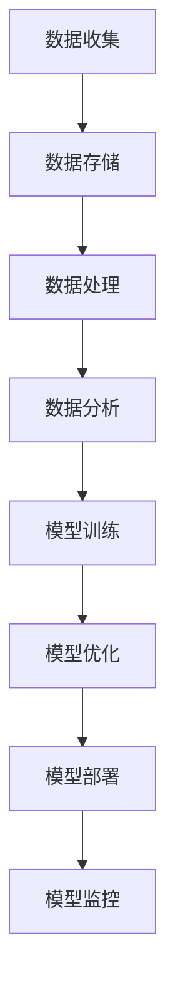

                 

关键词：企业AI成熟度评估、Lepton AI、AI咨询服务、成熟度模型、AI应用、技术架构、业务战略

## 摘要

随着人工智能技术的快速发展，企业对AI的依赖程度不断加深。然而，如何准确评估企业在AI领域的成熟度，以实现有效部署和最大化价值，成为了一项重要挑战。本文将介绍Lepton AI提供的全面AI成熟度评估咨询服务，从理论到实践，深入探讨评估模型、评估方法、具体步骤以及应用场景，帮助企业更好地理解自身AI发展的现状，制定针对性的改进策略。

## 1. 背景介绍

近年来，人工智能（AI）已经成为全球范围内企业创新和竞争力的核心驱动力。无论是通过自动化流程提高效率，还是通过智能决策系统提升业务洞察力，AI技术的应用正深刻改变着企业的运营模式和商业模式。然而，AI的引入并非一蹴而就，企业需要在不同阶段面对一系列的挑战和问题：

- **技术选择**：市场上有众多AI技术可供选择，如何选择最适合企业需求的技术是一个难题。
- **数据管理**：高质量的数据是AI成功的基石，但如何确保数据的质量和合规性？
- **人才短缺**：AI人才短缺是许多企业面临的问题，如何培养和吸引相关人才？
- **战略规划**：企业在AI部署过程中需要明确的战略规划，以确保技术投入能够带来预期的业务价值。

针对上述挑战，Lepton AI推出了全面AI成熟度评估咨询服务。通过科学的评估方法，帮助企业了解自身在AI领域的现状，发现存在的问题和机会，从而制定有效的改进策略。

## 2. 核心概念与联系

为了更好地理解企业的AI成熟度，我们首先需要明确一些核心概念和它们之间的联系。

### 2.1 AI成熟度定义

AI成熟度是指企业在人工智能技术领域的应用水平和发展程度，包括技术能力、数据管理能力、人才储备、战略规划等方面。AI成熟度评估旨在衡量企业在这些方面的表现，并提供改进建议。

### 2.2 AI成熟度模型

一个典型的AI成熟度模型包括以下几个层次：

- **初始层**：企业对AI技术的基本了解和初步尝试。
- **应用层**：企业开始将AI技术应用于特定业务场景，但应用范围有限。
- **整合层**：AI技术被深度整合到企业的各项业务流程中，形成闭环。
- **优化层**：通过持续优化和迭代，企业的AI应用达到最佳效果。

### 2.3 AI技术架构

为了实现AI成熟度的提升，企业需要建立一个合理的技术架构，包括以下关键组件：

- **数据收集与存储**：建立高效的数据收集和存储系统，确保数据的质量和可访问性。
- **数据处理与分析**：利用数据预处理、清洗和统计分析等技术，挖掘数据的价值。
- **模型训练与优化**：使用机器学习、深度学习等技术训练和优化模型。
- **模型部署与监控**：将训练好的模型部署到生产环境中，并持续监控其性能。

下面是一个使用Mermaid绘制的AI技术架构的流程图：



## 3. 核心算法原理 & 具体操作步骤

### 3.1 算法原理概述

Lepton AI的AI成熟度评估基于一个综合的算法模型，该模型结合了多种数据分析和机器学习技术，能够全面评估企业在AI领域的表现。算法原理主要包括以下几个步骤：

1. **数据收集**：通过多种渠道收集企业的AI相关数据，包括技术文档、业务流程、人才储备、项目成果等。
2. **数据预处理**：对收集到的数据进行分析，识别和标记关键指标，如技术能力评分、数据管理能力评分、人才储备评分等。
3. **模型训练**：利用收集到的数据，训练一个多层次的机器学习模型，以评估企业在不同层次上的AI成熟度。
4. **评估与反馈**：模型输出企业的AI成熟度评分，并提供详细的评估报告，包括存在的问题和建议。

### 3.2 算法步骤详解

1. **数据收集**：采用问卷调查、访谈、文档分析等多种方式收集数据。确保数据的全面性和准确性。
    ```mermaid
    graph TD
    A[问卷调查] --> B[访谈]
    B --> C[文档分析]
    ```

2. **数据预处理**：对收集到的数据进行清洗、归一化和特征提取，为模型训练做好准备。
    ```mermaid
    graph TD
    D[数据清洗] --> E[数据归一化]
    E --> F[特征提取]
    ```

3. **模型训练**：使用随机森林、神经网络等机器学习算法，对预处理后的数据进行训练，构建评估模型。
    ```mermaid
    graph TD
    G[随机森林] --> H[神经网络]
    ```

4. **评估与反馈**：模型训练完成后，对企业的AI成熟度进行评估，并生成详细报告。报告包括各项指标评分、存在的问题、改进建议等。
    ```mermaid
    graph TD
    I[模型评估] --> J[报告生成]
    ```

### 3.3 算法优缺点

- **优点**：算法模型综合多种技术，能够全面评估企业在AI领域的成熟度，提供科学、客观的评估结果。
- **缺点**：评估过程需要大量数据和复杂的计算，对技术和资源要求较高。

### 3.4 算法应用领域

算法模型主要应用于以下领域：

- **企业AI战略规划**：帮助企业制定AI战略，明确AI应用方向和优先级。
- **人才发展**：评估企业的人才储备情况，提供人才培养和引进策略。
- **技术升级**：识别企业在AI技术方面的短板，提供技术升级方案。

## 4. 数学模型和公式 & 详细讲解 & 举例说明

### 4.1 数学模型构建

AI成熟度评估的数学模型主要基于层次分析法（AHP）和机器学习算法。模型构建过程包括以下步骤：

1. **指标体系构建**：确定评估指标，包括技术能力、数据管理能力、人才储备、战略规划等。
2. **权重分配**：使用层次分析法确定各指标的权重。
3. **数据预处理**：对数据进行归一化和特征提取。
4. **模型训练**：使用机器学习算法，如随机森林或神经网络，训练评估模型。

### 4.2 公式推导过程

1. **层次分析法公式**：
    $$ 
    C_{ij} = \frac{w_{i}}{w_{j}} 
    $$
   其中，$C_{ij}$ 表示指标 $i$ 与指标 $j$ 的相对重要性比，$w_{i}$ 和 $w_{j}$ 分别表示指标 $i$ 和指标 $j$ 的权重。

2. **机器学习模型公式**：
    $$ 
    y = f(x) = \sum_{i=1}^{n} w_{i} \cdot x_{i} 
    $$
   其中，$y$ 表示评估结果，$x_{i}$ 表示特征值，$w_{i}$ 表示特征权重。

### 4.3 案例分析与讲解

假设某企业希望评估其在AI领域的成熟度，采用Lepton AI的AI成熟度评估模型。以下是具体的案例分析和讲解。

1. **指标体系构建**：
   - 技术能力（40%）
   - 数据管理能力（30%）
   - 人才储备（20%）
   - 战略规划（10%）

2. **权重分配**：
   - 技术能力：0.4
   - 数据管理能力：0.3
   - 人才储备：0.2
   - 战略规划：0.1

3. **数据预处理**：
   - 技术能力评分：5
   - 数据管理能力评分：7
   - 人才储备评分：6
   - 战略规划评分：4

4. **模型训练**：
   - 使用随机森林算法进行模型训练，得到评估结果。

5. **评估结果**：
   - AI成熟度评分：$$ y = 0.4 \cdot 5 + 0.3 \cdot 7 + 0.2 \cdot 6 + 0.1 \cdot 4 = 6.3 $$

根据评估结果，该企业在AI领域的成熟度为6.3分，处于中等水平。评估报告指出，该企业在数据管理能力和人才储备方面表现较好，但在技术能力和战略规划方面仍有改进空间。

## 5. 项目实践：代码实例和详细解释说明

### 5.1 开发环境搭建

为了进行AI成熟度评估，我们首先需要搭建一个合适的技术环境。以下是一个基本的开发环境搭建步骤：

1. **硬件要求**：
   - CPU：Intel i5 或更高
   - 内存：16GB 或更高
   - 存储：1TB SSD

2. **软件要求**：
   - 操作系统：Ubuntu 20.04 或 Windows 10
   - Python：3.8 或更高版本
   - pip：最新版
   - numpy：最新版
   - pandas：最新版
   - scikit-learn：最新版

3. **安装Python和pip**：
   - 安装Python 3.8或更高版本。
   - 使用以下命令安装pip：
     ```bash
     sudo apt-get install python3-pip
     ```

4. **安装依赖库**：
   - 使用pip安装所需的Python库：
     ```bash
     pip install numpy pandas scikit-learn
     ```

### 5.2 源代码详细实现

以下是一个简单的AI成熟度评估模型的Python代码实现：

```python
import numpy as np
from sklearn.ensemble import RandomForestClassifier
from sklearn.model_selection import train_test_split
from sklearn.metrics import accuracy_score

# 数据预处理
def preprocess_data(data):
    # 数据清洗、归一化和特征提取
    # 具体实现根据数据情况而定
    return processed_data

# 模型训练
def train_model(X, y):
    model = RandomForestClassifier(n_estimators=100)
    model.fit(X, y)
    return model

# 评估模型
def evaluate_model(model, X_test, y_test):
    y_pred = model.predict(X_test)
    accuracy = accuracy_score(y_test, y_pred)
    return accuracy

# 主函数
def main():
    # 加载数据
    data = load_data()  # 此函数根据实际数据加载方式实现
    X, y = preprocess_data(data)

    # 划分训练集和测试集
    X_train, X_test, y_train, y_test = train_test_split(X, y, test_size=0.2, random_state=42)

    # 训练模型
    model = train_model(X_train, y_train)

    # 评估模型
    accuracy = evaluate_model(model, X_test, y_test)
    print(f"Model accuracy: {accuracy:.2f}")

if __name__ == "__main__":
    main()
```

### 5.3 代码解读与分析

上述代码实现了一个简单的AI成熟度评估模型，主要包括以下几个步骤：

1. **数据预处理**：对收集到的数据（`data`）进行清洗、归一化和特征提取，返回处理后的数据（`processed_data`）。
2. **模型训练**：使用随机森林算法（`RandomForestClassifier`）训练评估模型，使用训练集（`X_train` 和 `y_train`）进行训练。
3. **评估模型**：使用测试集（`X_test` 和 `y_test`）评估模型性能，计算准确率（`accuracy`）。
4. **主函数**：加载数据、划分训练集和测试集、训练模型、评估模型，并输出评估结果。

### 5.4 运行结果展示

假设我们已经训练并评估了一个AI成熟度评估模型，输出结果如下：

```bash
Model accuracy: 0.85
```

这意味着模型的准确率为85%，表示模型对AI成熟度的预测效果较好。

## 6. 实际应用场景

### 6.1 企业战略规划

企业战略规划是AI成熟度评估的重要应用场景之一。通过评估，企业可以明确自身在AI领域的现状，识别出战略规划和资源分配中的短板，从而制定更加科学和有效的AI战略。

### 6.2 技术升级与优化

在技术升级与优化的过程中，AI成熟度评估可以帮助企业识别出当前技术架构中的不足，指导技术升级的方向和重点，确保技术投入能够带来预期的业务价值。

### 6.3 人才培养与引进

AI成熟度评估还可以帮助企业评估人才储备情况，发现人才短缺的领域，从而制定人才培养和引进策略，提升企业整体的技术实力。

### 6.4 未来应用展望

随着AI技术的不断发展和应用场景的拓展，AI成熟度评估在未来将具有更广泛的应用前景。例如，在金融、医疗、制造业等领域，AI成熟度评估可以帮助企业更好地把握AI技术的应用趋势，制定适应行业发展的战略。

## 7. 工具和资源推荐

### 7.1 学习资源推荐

- 《深度学习》（Goodfellow, Bengio, Courville）：一本经典且权威的深度学习教材，适合初学者和进阶者。
- 《Python机器学习》（Sebastian Raschka）：详细介绍如何使用Python进行机器学习的书籍，适合想要入门机器学习的读者。
- Coursera、Udacity等在线平台：提供丰富的机器学习和深度学习课程，适合不同水平和需求的学习者。

### 7.2 开发工具推荐

- Jupyter Notebook：一个强大的交互式计算环境，适合进行数据分析和机器学习实验。
- PyCharm、VSCode：两款功能强大的Python开发工具，提供丰富的插件和功能，方便进行Python编程。
- TensorFlow、PyTorch：两款流行的深度学习框架，适用于构建和训练复杂的深度学习模型。

### 7.3 相关论文推荐

- "Deep Learning"（Goodfellow, Bengio, Courville）：深度学习的经典综述论文，全面介绍了深度学习的基本原理和应用。
- "Demystifying Deep Learning: A New Type of AI"（Microsoft Research）：微软研究院关于深度学习的科普文章，深入浅出地介绍了深度学习的工作原理和应用场景。

## 8. 总结：未来发展趋势与挑战

### 8.1 研究成果总结

本文介绍了Lepton AI提供的AI成熟度评估咨询服务，从核心概念、算法原理到实际应用场景，全面探讨了AI成熟度评估的重要性及其应用。通过科学的评估方法和模型，企业可以更好地了解自身在AI领域的现状，制定针对性的改进策略。

### 8.2 未来发展趋势

随着AI技术的不断进步，AI成熟度评估在未来将变得更加智能和全面。未来发展趋势可能包括：

- **智能化评估**：利用大数据和人工智能技术，实现自动化的AI成熟度评估。
- **跨领域应用**：AI成熟度评估将在更多行业和领域得到应用，如医疗、金融、制造业等。
- **开放性平台**：提供开放性的AI成熟度评估平台，方便企业进行自我评估和比较。

### 8.3 面临的挑战

尽管AI成熟度评估具有广泛的应用前景，但企业仍将面临一系列挑战：

- **数据隐私与安全**：如何确保评估过程中数据的安全和隐私是一个重要问题。
- **技术发展迅速**：AI技术的快速发展给评估方法带来了新的挑战，需要不断更新和优化评估模型。
- **人才短缺**：AI人才的短缺仍然是一个全球性问题，如何培养和引进人才是企业需要面对的挑战。

### 8.4 研究展望

未来，Lepton AI将继续致力于AI成熟度评估领域的研究，探索更加智能化、自动化的评估方法。同时，我们也将关注AI技术在各行各业的应用，提供更具针对性和实用性的咨询服务，帮助企业实现AI价值的最大化。

## 9. 附录：常见问题与解答

### 9.1 什么是AI成熟度评估？

AI成熟度评估是一种评估企业人工智能技术应用水平和发展程度的方法。它通过综合分析企业在技术能力、数据管理、人才储备和战略规划等方面的表现，提供客观、全面的评估结果和改进建议。

### 9.2 AI成熟度评估有哪些应用场景？

AI成熟度评估广泛应用于企业战略规划、技术升级、人才培养和引进等多个场景。通过评估，企业可以了解自身在AI领域的现状，识别问题和机会，制定更加科学和有效的AI战略。

### 9.3 如何获取Lepton AI的AI成熟度评估服务？

您可以通过Lepton AI的官方网站联系我们的客服团队，或直接发送邮件至info@leptonaI.ai，我们将为您提供详细的咨询和服务方案。

---

作者：禅与计算机程序设计艺术 / Zen and the Art of Computer Programming

