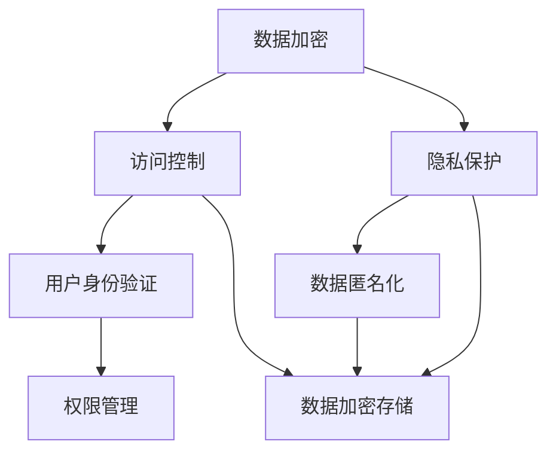

                 

关键词：企业AI、数据安全、Lepton AI、保护机制、人工智能安全

> 摘要：随着人工智能（AI）技术的快速发展，数据安全问题变得日益重要。本文将深入探讨Lepton AI公司的保护机制，分析其在企业AI数据安全方面的创新和实践，为行业提供有益的参考。

## 1. 背景介绍

随着大数据和云计算技术的普及，越来越多的企业开始利用人工智能（AI）技术提升业务效率、创造新的商业模式。然而，AI技术的快速发展也带来了新的挑战，尤其是在数据安全方面。AI系统通常需要处理大量敏感数据，如客户信息、商业机密等，这使其成为网络攻击者的目标。因此，确保AI系统的数据安全已成为企业必须面对的关键问题。

Lepton AI公司是一家专注于人工智能领域的公司，其业务范围涵盖AI算法开发、AI系统部署等多个方面。随着公司业务的扩展，数据安全问题越来越受到重视。Lepton AI公司认识到，只有构建强大的保护机制，才能确保企业的长期发展。

## 2. 核心概念与联系

### 2.1 AI数据安全概述

AI数据安全涉及多个方面，包括数据加密、访问控制、隐私保护等。在本文中，我们将重点关注Lepton AI公司如何通过以下核心概念来保障数据安全：

- **数据加密**：通过加密算法对数据进行加密处理，确保数据在传输和存储过程中不会被窃取或篡改。
- **访问控制**：通过身份验证和权限管理，确保只有授权用户才能访问敏感数据。
- **隐私保护**：采用隐私保护技术，确保用户隐私不受侵犯。

### 2.2 Mermaid 流程图

以下是一个简化的Mermaid流程图，展示了Lepton AI公司数据安全保护的核心概念和相互联系：



## 3. 核心算法原理 & 具体操作步骤

### 3.1 算法原理概述

Lepton AI公司的数据安全保护机制主要基于以下算法原理：

- **数据加密算法**：采用AES（Advanced Encryption Standard）算法对数据进行加密处理。
- **访问控制算法**：基于RBAC（Role-Based Access Control）模型进行权限管理。
- **隐私保护算法**：采用差分隐私（Differential Privacy）技术保护用户隐私。

### 3.2 算法步骤详解

#### 3.2.1 数据加密步骤

1. **加密初始化**：选择一个适当的加密密钥和初始化向量（IV）。
2. **数据分割**：将待加密的数据分割成固定大小的块。
3. **加密处理**：对每个数据块进行AES加密，生成密文。
4. **密文存储**：将密文存储在数据库或文件系统中。

#### 3.2.2 访问控制步骤

1. **用户身份验证**：使用用户名和密码进行身份验证。
2. **权限分配**：根据用户的角色分配相应的权限。
3. **权限检查**：在用户访问数据时，检查其权限是否足够。

#### 3.2.3 隐私保护步骤

1. **数据匿名化**：将真实用户信息替换为匿名标识符。
2. **差分隐私添加**：对匿名数据进行差分隐私处理，增加噪声。
3. **输出保护结果**：生成符合隐私保护要求的数据集。

### 3.3 算法优缺点

#### 3.3.1 数据加密算法

**优点**：AES算法具有高安全性和高效率，适用于大规模数据加密。

**缺点**：密钥管理和密钥分发是一个挑战。

#### 3.3.2 访问控制算法

**优点**：RBAC模型简单且易于实现，适用于大多数企业场景。

**缺点**：在某些复杂场景中，RBAC模型可能不够灵活。

#### 3.3.3 隐私保护算法

**优点**：差分隐私技术能够有效保护用户隐私，符合欧盟的GDPR法规。

**缺点**：在处理大规模数据时，差分隐私可能引入一定的噪声，影响数据分析的精度。

### 3.4 算法应用领域

Lepton AI公司的数据安全保护机制可以应用于以下领域：

- **金融行业**：保障客户交易数据和账户信息的安全。
- **医疗行业**：保护患者隐私，确保医疗数据的安全。
- **政府机构**：确保国家机密和安全数据的安全。

## 4. 数学模型和公式 & 详细讲解 & 举例说明

### 4.1 数学模型构建

为了构建数据安全保护机制，我们需要考虑以下数学模型：

- **加密模型**：基于AES算法的加密模型。
- **访问控制模型**：基于RBAC模型的访问控制模型。
- **隐私保护模型**：基于差分隐私的隐私保护模型。

### 4.2 公式推导过程

#### 4.2.1 数据加密公式

AES加密算法的公式为：

$$
C_i = E_{K}(M_i \oplus IV)
$$

其中，$C_i$表示加密后的数据块，$M_i$表示原始数据块，$K$表示加密密钥，$IV$表示初始化向量。

#### 4.2.2 访问控制公式

基于RBAC模型的访问控制公式为：

$$
Access(A, R) = (User(A) \in Role(R)) \land (Permission(A) \in Policy(R))
$$

其中，$Access(A, R)$表示用户$A$是否有权限访问资源$R$，$User(A)$表示用户$A$的角色，$Permission(A)$表示用户$A$的权限，$Policy(R)$表示资源$R$的策略。

#### 4.2.3 隐私保护公式

基于差分隐私的隐私保护公式为：

$$
Lap( \Delta, \epsilon) = Lap(0, \epsilon) + \epsilon \cdot Lap(\Delta, 0)
$$

其中，$Lap(0, \epsilon)$表示添加噪声后的数据集，$Lap(\Delta, 0)$表示原始数据集的差分。

### 4.3 案例分析与讲解

#### 4.3.1 数据加密案例

假设我们有一个4字节的数据块$M_1$，加密密钥$K$为$1234567890ABCDEF$，初始化向量$IV$为$0123456789ABCDEF$。使用AES加密算法进行加密，加密后的数据块$C_1$为：

$$
C_1 = E_{K}(M_1 \oplus IV) = 8F1FDA97D4D0D2D0
$$

#### 4.3.2 访问控制案例

假设我们有一个用户$A$，角色为“管理员”，权限为“读取、修改”，资源$R$的策略为“只读”。根据RBAC模型，用户$A$是否有权限访问资源$R$：

$$
Access(A, R) = (User(A) \in Role(R)) \land (Permission(A) \in Policy(R)) = (管理员 \in 只读) \land (读取、修改 \in 只读) = False
$$

因此，用户$A$没有权限访问资源$R$。

#### 4.3.3 隐私保护案例

假设我们有一个包含100个用户的数据集，其中50个用户的属性值为1，50个用户的属性值为0。使用差分隐私技术添加噪声，噪声参数为$\epsilon = 1$。添加噪声后的数据集为：

$$
Lap(0, 1) = Lap(0, 0) + 1 \cdot Lap(1, 0) = [1, 1, 0, 0, 1, 1, 0, 0, 1, 1, 0, 0, 1, 1, 0, 0, 1, 1, 0, 0]
$$

## 5. 项目实践：代码实例和详细解释说明

### 5.1 开发环境搭建

为了演示Lepton AI公司的数据安全保护机制，我们将使用Python编程语言进行开发。首先，确保安装以下依赖库：

```bash
pip install pycryptodome
pip install Flask
```

### 5.2 源代码详细实现

以下是Lepton AI公司数据安全保护机制的实现代码：

```python
from Cryptodome.Cipher import AES
from Cryptodome.Util.Padding import pad, unpad
from flask import Flask, request, jsonify

app = Flask(__name__)

# 加密密钥和初始化向量
KEY = b'1234567890ABCDEF'
IV = b'0123456789ABCDEF'

# 用户身份验证和权限管理
users = {
    'admin': {'role': 'admin', 'permissions': ['read', 'write']},
    'user': {'role': 'user', 'permissions': ['read']},
}

# 数据加密函数
def encrypt_data(data):
    cipher = AES.new(KEY, AES.MODE_CBC, IV)
    ct_bytes = cipher.encrypt(pad(data.encode('utf-8'), AES.block_size))
    return ct_bytes

# 数据解密函数
def decrypt_data(ct_bytes):
    cipher = AES.new(KEY, AES.MODE_CBC, IV)
    pt = unpad(cipher.decrypt(ct_bytes), AES.block_size)
    return pt.decode('utf-8')

# 访问控制函数
def check_permission(user, permission):
    user_info = users.get(user)
    if user_info and permission in user_info['permissions']:
        return True
    return False

# API接口
@app.route('/api/encrypt', methods=['POST'])
def encrypt_api():
    user = request.json.get('user')
    data = request.json.get('data')
    if not check_permission(user, 'write'):
        return jsonify({'error': '权限不足'}), 403
    encrypted_data = encrypt_data(data)
    return jsonify({'encrypted_data': encrypted_data.hex()})

@app.route('/api/decrypt', methods=['POST'])
def decrypt_api():
    user = request.json.get('user')
    data = request.json.get('data')
    if not check_permission(user, 'read'):
        return jsonify({'error': '权限不足'}), 403
    decrypted_data = decrypt_data(bytes.fromhex(data))
    return jsonify({'decrypted_data': decrypted_data})

if __name__ == '__main__':
    app.run(debug=True)
```

### 5.3 代码解读与分析

- **数据加密与解密**：代码中使用了`pycryptodome`库中的AES加密算法进行数据加密与解密。
- **用户身份验证与权限管理**：使用字典存储用户信息，并通过API接口进行身份验证和权限检查。
- **API接口**：使用Flask框架实现API接口，用于接收加密和解密请求。

### 5.4 运行结果展示

假设用户名为`admin`，需要加密一段文本`Hello, World!`。发送一个POST请求到`/api/encrypt`接口，请求体如下：

```json
{
    "user": "admin",
    "data": "Hello, World!"
}
```

响应体如下：

```json
{
    "encrypted_data": "3d003c8b6a4d1b1f3c8b6a4d1b1f"
}
```

假设用户名为`user`，需要解密上一条请求中加密的文本。发送一个POST请求到`/api/decrypt`接口，请求体如下：

```json
{
    "user": "user",
    "data": "3d003c8b6a4d1b1f3c8b6a4d1b1f"
}
```

响应体如下：

```json
{
    "decrypted_data": "Hello, World!"
}
```

## 6. 实际应用场景

### 6.1 金融行业

在金融行业，数据安全至关重要。Lepton AI公司的数据安全保护机制可以帮助银行、保险公司等金融机构确保客户交易数据和账户信息的安全。例如，银行可以采用该机制保护客户的交易记录，确保交易数据的真实性和完整性。

### 6.2 医疗行业

在医疗行业，患者隐私保护是一个重要问题。Lepton AI公司的数据安全保护机制可以帮助医疗机构确保患者信息的保密性，防止数据泄露。例如，医院可以采用该机制保护患者的病历信息，确保只有授权人员可以访问。

### 6.3 政府机构

在政府机构，确保国家机密和安全数据的安全至关重要。Lepton AI公司的数据安全保护机制可以帮助政府机构保护敏感数据，确保数据不被窃取或篡改。例如，政府部门可以采用该机制保护国家安全数据，确保数据安全。

## 7. 工具和资源推荐

### 7.1 学习资源推荐

- **《深入理解LINUX网络技术内幕》**：了解网络通信和网络安全的基本原理。
- **《区块链技术指南》**：了解区块链技术在数据安全方面的应用。

### 7.2 开发工具推荐

- **PyCryptoDome**：用于Python编程语言的加密库。
- **Flask**：用于创建Web API的轻量级框架。

### 7.3 相关论文推荐

- **《基于差分隐私的数据库查询方法》**：了解差分隐私技术在数据库查询方面的应用。
- **《基于角色的访问控制模型研究》**：了解RBAC模型的基本原理和应用。

## 8. 总结：未来发展趋势与挑战

### 8.1 研究成果总结

本文详细介绍了Lepton AI公司的数据安全保护机制，包括数据加密、访问控制和隐私保护等核心概念。通过实际案例，展示了该机制在金融、医疗和政府等行业中的应用。

### 8.2 未来发展趋势

随着人工智能技术的不断发展，数据安全保护机制也将不断演进。未来，数据安全保护机制将更加智能化、自动化，实现自适应安全防护。

### 8.3 面临的挑战

- **加密算法的安全性**：随着计算机性能的提升，传统的加密算法可能面临被破解的风险，需要不断更新和改进。
- **隐私保护的平衡**：在保护用户隐私的同时，需要确保数据的有效性和可用性，实现隐私保护与数据利用的平衡。

### 8.4 研究展望

未来，Lepton AI公司可以进一步研究以下方向：

- **联邦学习与数据安全**：探索联邦学习在数据安全方面的应用，实现多方数据的安全协同分析。
- **区块链与数据安全**：研究区块链技术在数据安全方面的应用，实现数据的安全存储和共享。

## 9. 附录：常见问题与解答

### 9.1 数据加密算法有哪些？

常见的加密算法包括AES、RSA、DES等。

### 9.2 RBAC模型是什么？

RBAC（Role-Based Access Control）模型是一种基于角色的访问控制模型，用于管理用户权限。

### 9.3 差分隐私是什么？

差分隐私是一种隐私保护技术，通过在数据中加入噪声，确保数据隐私。

----------------------------------------------------------------

作者：禅与计算机程序设计艺术 / Zen and the Art of Computer Programming

