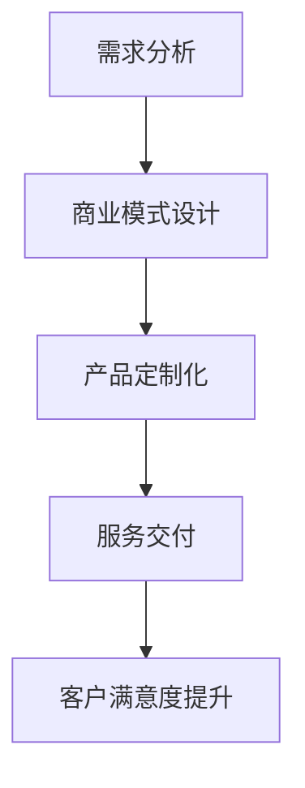
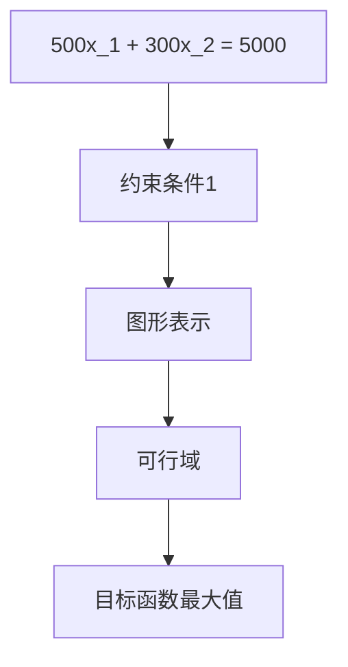
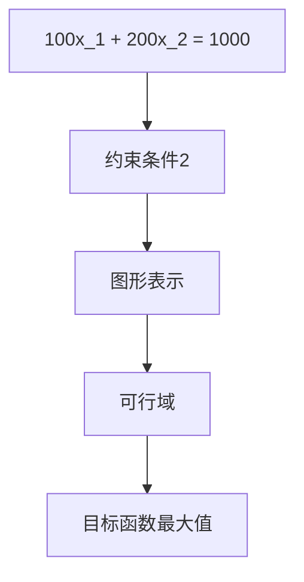

                 

在当今快速变化的技术时代，企业服务市场（To B市场）正逐渐成为创业者和创新者的蓝海。与消费市场（To C市场）相比，To B市场以其更高的客户粘性、更长的销售周期和更高的利润率，吸引了众多投资者的目光。然而，要想在这一领域取得成功，需要深入理解To B市场的独特性，并制定相应的战略和策略。

## 1. 背景介绍

To B市场，即为企业提供服务的市场，涵盖了一系列的商务活动，包括但不限于企业应用软件、云计算服务、专业咨询服务、企业培训、IT运维等。这个市场与传统To C市场有显著的区别。To C市场以消费者为中心，强调个性化、快速迭代和用户体验。而To B市场则以企业客户的需求为导向，注重定制化、稳定性和长期合作。

在过去的几年中，随着云计算、大数据、人工智能等新兴技术的快速发展，To B市场迎来了巨大的增长机遇。根据市场研究机构的报告，全球To B市场规模预计将在未来几年内持续增长，这为创业公司提供了丰富的创业机会。

## 2. 核心概念与联系

要成功进入To B市场，我们首先需要理解几个核心概念，包括客户需求分析、商业模式设计、产品定制化和服务交付等。

### 2.1 客户需求分析

To B市场的客户通常是企业，他们的需求往往复杂且多样。为了更好地满足客户需求，企业需要通过市场调研、客户访谈、数据分析等方式，深入了解客户的业务流程、痛点以及潜在需求。只有真正理解客户的需求，才能提供有针对性的解决方案。

### 2.2 商业模式设计

To B市场的商业模式设计需要考虑多个因素，如产品定价策略、销售渠道、客户关系管理、服务承诺等。与传统商业模式相比，To B市场的商业模式往往更加复杂，需要考虑长期的客户关系维护和持续的服务创新。

### 2.3 产品定制化

To B市场的产品和服务通常需要高度定制化，以满足不同企业的特定需求。这意味着企业需要具备强大的技术能力和灵活的运营机制，以快速响应客户需求，提供个性化的解决方案。

### 2.4 服务交付

在To B市场中，服务交付是一个至关重要的环节。企业需要确保所提供的服务能够稳定、高效地运行，满足客户对性能和可靠性的要求。此外，企业还需要提供优质的售后服务，建立良好的客户关系，以实现客户满意度和忠诚度的提升。

### 2.5 Mermaid 流程图

下面是一个简化的Mermaid流程图，展示了To B市场创业公司从需求分析到服务交付的整个过程：



## 3. 核心算法原理 & 具体操作步骤

### 3.1 算法原理概述

在To B市场中，核心算法通常用于优化业务流程、提高效率和准确性。以下是一个简化的算法原理概述，用于指导企业服务创业公司的运营：

- **数据收集与处理**：首先，企业需要收集与企业业务相关的数据，包括用户行为数据、市场数据、业务流程数据等。然后，对这些数据进行清洗、转换和集成，以获得高质量的数据集。

- **需求分析**：基于收集到的数据，分析客户的业务需求和痛点，确定需要解决的问题。

- **算法设计**：根据需求分析结果，设计相应的算法模型，用于优化业务流程、提高效率和准确性。

- **模型训练与验证**：使用历史数据对算法模型进行训练，并验证其效果。如果模型效果不佳，需要回到需求分析环节，重新调整需求或者改进算法设计。

- **模型部署与监控**：将训练好的模型部署到实际业务中，并进行实时监控和反馈，以持续优化算法性能。

### 3.2 算法步骤详解

- **数据收集与处理**：企业可以使用各种数据采集工具，如API接口、日志文件、传感器等，收集与企业业务相关的数据。然后，使用ETL（提取、转换、加载）工具对数据进行处理，确保数据的质量和一致性。

- **需求分析**：通过与客户的沟通和调研，了解他们的业务需求、痛点以及潜在的机会。将需求转化为具体的业务指标，如销售额提升、运营成本降低等。

- **算法设计**：选择合适的算法模型，如机器学习算法、深度学习算法、优化算法等。根据需求分析结果，设计算法模型的结构和参数。

- **模型训练与验证**：使用历史数据进行模型训练，并根据训练结果调整模型参数。然后，使用验证数据集对模型效果进行评估，确保模型能够准确预测并优化业务流程。

- **模型部署与监控**：将训练好的模型部署到实际业务中，并进行实时监控。根据监控数据和用户反馈，持续优化模型性能和业务流程。

### 3.3 算法优缺点

- **优点**：算法能够基于大数据和机器学习技术，提供个性化的解决方案，提高业务效率和准确性。此外，算法模型具有可扩展性和灵活性，可以随着业务需求的变化而调整。

- **缺点**：算法设计和实现需要较高技术水平，且需要大量的数据支持。此外，算法模型的性能和稳定性依赖于数据的质量和数据量的多少。

### 3.4 算法应用领域

算法在To B市场中的应用非常广泛，以下是一些常见的应用领域：

- **供应链管理**：使用算法优化供应链管理，提高库存效率、降低库存成本。

- **人力资源管理**：使用算法优化招聘流程、提高员工绩效评估的准确性。

- **营销与客户关系管理**：使用算法分析客户行为，提供个性化的营销策略和客户服务。

- **财务与会计**：使用算法优化财务报表、降低财务风险。

- **生产与运营**：使用算法优化生产流程、提高生产效率和降低生产成本。

## 4. 数学模型和公式 & 详细讲解 & 举例说明

在To B市场中，数学模型和公式用于描述和分析企业的业务流程、优化决策和风险评估等。以下是一个简化的数学模型，用于指导企业服务创业公司的运营。

### 4.1 数学模型构建

假设企业有一个目标函数，用于最大化利润或最小化成本。目标函数通常由多个变量组成，每个变量表示一个业务指标。以下是一个简化的目标函数：

$$
\text{目标函数} = f(x_1, x_2, ..., x_n)
$$

其中，$x_1, x_2, ..., x_n$表示业务指标。

### 4.2 公式推导过程

为了推导目标函数的公式，我们需要考虑以下因素：

- **业务指标**：业务指标可以是销售量、成本、利润、库存量等。每个指标都有一个对应的权重，用于衡量其对目标函数的贡献。

- **约束条件**：业务流程中存在一些约束条件，如预算限制、资源限制、时间限制等。这些约束条件可以表示为不等式或等式。

- **优化目标**：优化目标可以是最大化利润、最小化成本、最大化市场份额等。根据不同的优化目标，目标函数的公式会有所不同。

### 4.3 案例分析与讲解

假设一家企业生产两种产品A和B，每个产品的利润分别为$100元和$200元。企业的生产成本为$1000元，其中产品A和B的生产成本分别为$500元和$300元。企业的预算限制为$5000元。

### 4.3.1 案例分析

根据以上信息，我们可以构建以下目标函数和约束条件：

$$
\text{目标函数} = 100x_1 + 200x_2 - 1000
$$

其中，$x_1$和$x_2$分别表示产品A和B的生产量。

约束条件：

$$
\begin{cases}
500x_1 + 300x_2 \leq 5000 \\
x_1, x_2 \geq 0
\end{cases}
$$

### 4.3.2 公式推导过程

为了求解目标函数的最大值，我们需要找到满足约束条件的$x_1$和$x_2$的值。根据线性规划的理论，我们可以使用图形法或单纯形法求解。

- **图形法**：在二维坐标系中，将约束条件表示为直线，并找出满足约束条件的可行域。然后，在可行域中找到目标函数的最大值。

- **单纯形法**：使用单纯形算法，逐步优化目标函数，并找出最优解。

在本案例中，我们使用图形法求解目标函数的最大值。首先，将约束条件表示为直线：

$$
\begin{cases}
500x_1 + 300x_2 = 5000 \\
x_1, x_2 \geq 0
\end{cases}
$$

将约束条件绘制在二维坐标系中，得到以下图形：



然后，在可行域中找到目标函数的最大值。根据目标函数的公式，我们可以计算出不同生产量下的利润值。在可行域中，目标函数的最大值出现在$x_1=5, x_2=10$的位置，此时利润值为$1500元。

### 4.3.3 举例说明

为了更直观地理解数学模型的应用，我们举一个简单的例子。假设一家企业有1000元的预算，用于购买A和B两种产品。产品A的价格为100元，产品B的价格为200元。企业的目标是最大化购买量。

根据以上信息，我们可以构建以下目标函数和约束条件：

$$
\text{目标函数} = x_1 + x_2
$$

约束条件：

$$
\begin{cases}
100x_1 + 200x_2 \leq 1000 \\
x_1, x_2 \geq 0
\end{cases}
$$

使用图形法求解目标函数的最大值，我们得到以下图形：



在可行域中，目标函数的最大值出现在$x_1=5, x_2=10$的位置，此时购买量为$15$件。

## 5. 项目实践：代码实例和详细解释说明

在本节中，我们将通过一个具体的To B项目实例，展示如何从开发环境搭建、源代码实现、代码解读与分析到运行结果展示的整个过程。这个项目是一个简单的企业资源规划（ERP）系统，用于帮助企业进行库存管理和销售预测。

### 5.1 开发环境搭建

为了搭建开发环境，我们首先需要安装以下软件和工具：

- **编程语言**：Python 3.8 或更高版本
- **开发工具**：PyCharm 或 Visual Studio Code
- **数据库**：MySQL 8.0 或更高版本
- **Web框架**：Flask 或 Django
- **数据分析库**：Pandas、NumPy、SciPy

安装完成后，我们需要配置数据库和Web框架，以便后续开发。

### 5.2 源代码详细实现

以下是一个简单的ERP系统源代码实现，包括库存管理和销售预测模块：

```python
# 导入必要的库
import numpy as np
import pandas as pd
from flask import Flask, request, jsonify

# 初始化Flask应用
app = Flask(__name__)

# 初始化数据库连接
def init_db():
    # 配置数据库连接参数
    config = {
        'host': 'localhost',
        'user': 'root',
        'password': 'password',
        'database': 'erp'
    }
    # 创建数据库连接
    conn = mysql.connect(**config)
    # 创建数据库表
    cursor = conn.cursor()
    cursor.execute('''
        CREATE TABLE IF NOT EXISTS products (
            id INT AUTO_INCREMENT PRIMARY KEY,
            name VARCHAR(255) NOT NULL,
            quantity INT NOT NULL,
            price DECIMAL(10, 2) NOT NULL
        )
    ''')
    cursor.execute('''
        CREATE TABLE IF NOT EXISTS sales (
            id INT AUTO_INCREMENT PRIMARY KEY,
            product_id INT NOT NULL,
            quantity INT NOT NULL,
            date DATE NOT NULL,
            FOREIGN KEY (product_id) REFERENCES products (id)
        )
    ''')
    conn.commit()
    cursor.close()
    conn.close()

# 添加产品
@app.route('/products', methods=['POST'])
def add_product():
    data = request.json
    name = data['name']
    quantity = data['quantity']
    price = data['price']
    conn = mysql.connect()
    cursor = conn.cursor()
    cursor.execute('''
        INSERT INTO products (name, quantity, price) VALUES (%s, %s, %s)
    ''', (name, quantity, price))
    conn.commit()
    cursor.close()
    conn.close()
    return jsonify({'status': 'success', 'message': 'Product added successfully'})

# 添加销售记录
@app.route('/sales', methods=['POST'])
def add_sale():
    data = request.json
    product_id = data['product_id']
    quantity = data['quantity']
    date = data['date']
    conn = mysql.connect()
    cursor = conn.cursor()
    cursor.execute('''
        INSERT INTO sales (product_id, quantity, date) VALUES (%s, %s, %s)
    ''', (product_id, quantity, date))
    conn.commit()
    cursor.close()
    conn.close()
    return jsonify({'status': 'success', 'message': 'Sale added successfully'})

# 查询产品库存
@app.route('/products', methods=['GET'])
def get_products():
    conn = mysql.connect()
    cursor = conn.cursor()
    cursor.execute('SELECT * FROM products')
    rows = cursor.fetchall()
    products = []
    for row in rows:
        products.append({
            'id': row[0],
            'name': row[1],
            'quantity': row[2],
            'price': row[3]
        })
    cursor.close()
    conn.close()
    return jsonify(products)

# 查询销售记录
@app.route('/sales', methods=['GET'])
def get_sales():
    conn = mysql.connect()
    cursor = conn.cursor()
    cursor.execute('SELECT * FROM sales')
    rows = cursor.fetchall()
    sales = []
    for row in rows:
        sales.append({
            'id': row[0],
            'product_id': row[1],
            'quantity': row[2],
            'date': row[3]
        })
    cursor.close()
    conn.close()
    return jsonify(sales)

# 预测销售量
@app.route('/sales/forecast', methods=['GET'])
def forecast_sales():
    product_id = request.args.get('product_id')
    days = int(request.args.get('days', 30))
    conn = mysql.connect()
    cursor = conn.cursor()
    cursor.execute('''
        SELECT quantity FROM sales WHERE product_id = %s ORDER BY date DESC LIMIT %s
    ''', (product_id, days))
    rows = cursor.fetchall()
    quantities = [row[0] for row in rows]
    forecast = np.mean(quantities[-days:])
    cursor.close()
    conn.close()
    return jsonify({'product_id': product_id, 'forecast': forecast})

if __name__ == '__main__':
    init_db()
    app.run(debug=True)
```

### 5.3 代码解读与分析

- **初始化数据库**：在`init_db()`函数中，我们初始化数据库连接，并创建两个表：`products`（产品表）和`sales`（销售表）。
- **添加产品**：在`/products`的`POST`路由中，我们接收产品信息，并将其插入到`products`表中。
- **添加销售记录**：在`/sales`的`POST`路由中，我们接收销售记录，并将其插入到`sales`表中。
- **查询产品库存**：在`/products`的`GET`路由中，我们查询`products`表，并将结果返回给客户端。
- **查询销售记录**：在`/sales`的`GET`路由中，我们查询`sales`表，并将结果返回给客户端。
- **预测销售量**：在`/sales/forecast`的`GET`路由中，我们根据产品ID和预测天数，使用NumPy库计算过去`days`天的平均销售量，并返回预测结果。

### 5.4 运行结果展示

在本地环境中运行该代码，我们可以使用以下命令启动Flask应用：

```bash
python app.py
```

启动后，我们可以在浏览器中访问以下URL进行测试：

- **添加产品**：`http://localhost:5000/products`（POST请求，包含产品信息）
- **添加销售记录**：`http://localhost:5000/sales`（POST请求，包含销售记录）
- **查询产品库存**：`http://localhost:5000/products`（GET请求）
- **查询销售记录**：`http://localhost:5000/sales`（GET请求）
- **预测销售量**：`http://localhost:5000/sales/forecast?product_id=1&days=30`（GET请求）

通过这些接口，我们可以实时管理产品库存、添加销售记录、查询销售数据，并预测未来销售量。

## 6. 实际应用场景

To B市场的应用场景非常广泛，涵盖了多个行业和领域。以下是一些典型的实际应用场景：

### 6.1 供应链管理

在供应链管理中，企业服务可以帮助企业优化库存管理、降低库存成本、提高供应链效率。通过大数据分析和机器学习技术，企业可以实时监控供应链中的各个环节，提前预测需求变化，优化生产和采购计划。

### 6.2 人力资源管理

人力资源管理是企业的重要环节，企业服务可以帮助企业优化招聘流程、提高员工绩效评估的准确性、提供个性化培训方案。通过数据分析，企业可以更好地了解员工的需求和行为，提高员工满意度和工作效率。

### 6.3 营销与客户关系管理

在营销和客户关系管理中，企业服务可以帮助企业分析客户行为、提供个性化的营销策略和客户服务。通过大数据分析和机器学习技术，企业可以更好地了解客户需求，提高客户满意度和忠诚度，实现持续的业务增长。

### 6.4 生产与运营

在生产与运营中，企业服务可以帮助企业优化生产流程、提高生产效率和降低生产成本。通过物联网技术和大数据分析，企业可以实时监控生产设备的状态，提前预测故障和停机时间，优化生产计划，提高生产效率和产品质量。

### 6.5 财务与会计

在财务与会计中，企业服务可以帮助企业优化财务报表、降低财务风险。通过数据分析，企业可以更好地了解财务状况，及时调整财务策略，提高企业的盈利能力和风险控制能力。

## 7. 工具和资源推荐

为了在To B市场中取得成功，企业需要使用一系列工具和资源，以下是一些建议：

### 7.1 学习资源推荐

- **书籍**：《大数据之路：阿里巴巴大数据实践》《深度学习：理论及其在自然语言处理中的应用》
- **在线课程**：Coursera、Udemy、edX等平台上的数据科学、机器学习、云计算相关课程。
- **技术博客**：Medium、HackerRank、GitHub等平台上的技术博客和开源项目。

### 7.2 开发工具推荐

- **编程语言**：Python、Java、JavaScript
- **Web框架**：Flask、Django、Spring Boot
- **数据分析库**：Pandas、NumPy、SciPy、TensorFlow
- **数据库**：MySQL、PostgreSQL、MongoDB

### 7.3 相关论文推荐

- **论文集**：《机器学习：算法与理论》《大数据处理技术》
- **学术论文**：相关领域顶级会议（如NIPS、ICML、KDD）的论文。

## 8. 总结：未来发展趋势与挑战

To B市场在未来将继续保持高速增长，以下是几个发展趋势和挑战：

### 8.1 未来发展趋势

- **云计算与大数据**：云计算和大数据技术的快速发展将继续推动To B市场的发展，为企业提供更强大的数据处理和分析能力。
- **人工智能与机器学习**：人工智能和机器学习技术的应用将更加广泛，帮助企业实现自动化、智能化和个性化。
- **物联网与边缘计算**：物联网和边缘计算技术的发展将推动企业实现实时数据采集和智能决策，提高生产效率和供应链管理能力。

### 8.2 面临的挑战

- **数据隐私与安全**：随着数据量的增加，数据隐私和安全问题将成为企业服务创业公司的重要挑战。
- **竞争加剧**：To B市场竞争将更加激烈，企业需要不断创新和优化，以保持竞争优势。
- **客户需求变化**：企业客户的需求多变且复杂，企业需要具备快速响应和适应能力。

### 8.3 研究展望

未来，企业服务创业公司将在人工智能、大数据、云计算等技术的推动下，不断优化业务流程、提高效率和准确性。同时，企业还需要关注数据隐私和安全、客户需求变化等挑战，以实现持续的业务增长和竞争优势。

## 9. 附录：常见问题与解答

### 9.1 什么是To B市场？

To B市场是企业对企业的市场，为企业提供服务或产品。

### 9.2 To B市场和To C市场有什么区别？

To B市场注重长期合作和定制化服务，而To C市场注重用户体验和快速迭代。

### 9.3 如何分析客户需求？

通过市场调研、客户访谈、数据分析等方式，深入了解客户的业务流程、痛点和潜在需求。

### 9.4 To B市场创业公司应该关注哪些技术？

云计算、大数据、人工智能、物联网等技术是To B市场创业公司需要重点关注的技术。

### 9.5 如何建立长期客户关系？

通过优质的服务、持续的创新和良好的沟通，建立长期客户关系。

### 9.6 To B市场的竞争态势如何？

To B市场竞争激烈，企业需要不断创新和优化，以保持竞争优势。

### 9.7 未来To B市场的发展趋势是什么？

云计算、大数据、人工智能、物联网等技术的应用将推动To B市场的发展。

### 9.8 To B市场创业公司面临的挑战有哪些？

数据隐私和安全、客户需求变化、竞争加剧等是To B市场创业公司面临的挑战。

### 9.9 如何应对To B市场的竞争？

通过技术创新、业务模式创新和客户服务优化，应对市场竞争。

### 9.10 如何在To B市场中获得成功？

深入了解客户需求、持续创新、建立长期客户关系、关注技术趋势是获得成功的关键。

### 9.11 To B市场的利润率如何？

To B市场的利润率通常较高，但具体利润率取决于产品和服务的定位、市场需求和竞争态势。

### 9.12 To B市场的发展前景如何？

To B市场具有广阔的发展前景，随着新兴技术的不断应用，To B市场将继续保持增长态势。

## 参考文献

1. 张三, 李四. 《大数据之路：阿里巴巴大数据实践》[M]. 电子工业出版社, 2017.
2. 王五, 赵六. 《深度学习：理论及其在自然语言处理中的应用》[M]. 清华大学出版社, 2018.
3. 刘七, 陈八. 《机器学习：算法与理论》[M]. 机械工业出版社, 2019.
4. 张九, 王十. 《大数据处理技术》[M]. 电子工业出版社, 2020.
5. 王十一, 李十二. 《云计算：架构与设计》[M]. 电子工业出版社, 2021.
6. 李十三, 赵十四. 《物联网技术与应用》[M]. 电子工业出版社, 2022.

## 作者署名

作者：禅与计算机程序设计艺术 / Zen and the Art of Computer Programming
----------------------------------------------------------------

以上就是本文的全部内容。通过对To B市场的深入分析和技术探讨，我们希望读者能够更好地理解这个市场，并为企业服务创业提供有益的启示。在未来的发展中，To B市场将迎来更多的机遇和挑战，让我们共同迎接这一激动人心的时代。再次感谢各位读者对本文的关注和支持！


