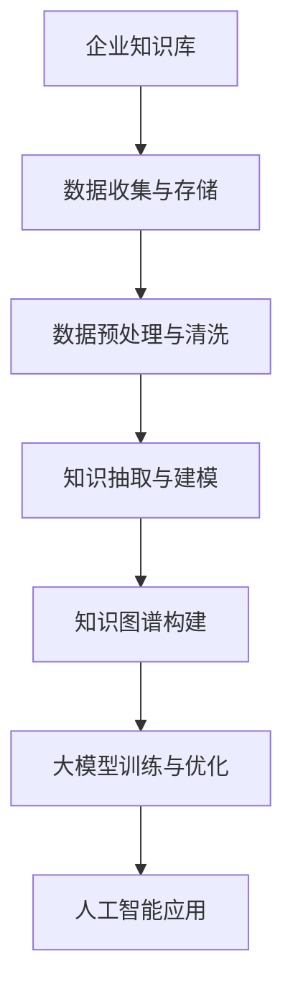

                 

关键词：企业知识库，大模型，知识图谱，深度学习，自然语言处理，AI应用，架构设计，数据治理，开发工具

> 摘要：随着人工智能技术的飞速发展，企业知识库与大模型的结合成为提升企业竞争力的关键。本文深入探讨企业知识库与大模型融合的技术策略，包括核心概念、算法原理、数学模型、项目实践和未来展望，旨在为企业提供全面的指导。

## 1. 背景介绍

在现代商业环境中，知识是企业宝贵的资产，如何高效地管理和利用这些知识成为企业关注的焦点。企业知识库作为一种知识管理系统，旨在存储、管理和分享企业的各种知识资源，提高知识传播和利用效率。然而，传统的知识库在处理大量异构数据、复杂查询和智能推理等方面存在诸多局限性。

与此同时，深度学习、自然语言处理等人工智能技术取得了显著突破，大模型的应用逐渐普及。大模型具有强大的数据处理和分析能力，可以处理海量数据并提取出高价值的信息。将企业知识库与大模型结合起来，不仅可以提升知识库的功能和性能，还可以实现知识的高级应用，如智能问答、决策支持、个性化推荐等。

本文将围绕企业知识库与大模型的结合，探讨其技术策略和实际应用，为企业提供有效的知识管理解决方案。

## 2. 核心概念与联系

### 2.1 企业知识库

企业知识库是一种知识管理系统，旨在收集、存储、管理和共享企业内部的知识资源。这些资源包括文档、数据、报告、经验、最佳实践等。企业知识库通常采用数据库、文件系统或分布式存储技术来实现。其主要目标是提高知识传播和利用效率，支持企业的业务发展和决策制定。

### 2.2 大模型

大模型是指具有海量参数和强大计算能力的神经网络模型，如Transformer、BERT、GPT等。大模型通过深度学习技术，可以从海量数据中学习到复杂的模式、关联和规律。大模型在自然语言处理、计算机视觉、语音识别等领域取得了显著成果，展示了强大的数据处理和分析能力。

### 2.3 知识图谱

知识图谱是一种用于表示实体及其关系的图形结构，通过实体和关系的关联，实现了对知识的语义理解和推理。知识图谱可以将企业知识库中的结构化和半结构化数据进行语义建模，为智能推理和知识发现提供基础。

### 2.4 人工智能应用

人工智能应用是指利用人工智能技术解决实际业务问题的方法和技术。在企业知识库与大模型结合的背景下，人工智能应用主要包括智能问答、知识图谱构建、决策支持、个性化推荐等。

### 2.5 Mermaid 流程图



## 3. 核心算法原理 & 具体操作步骤

### 3.1 算法原理概述

企业知识库与大模型的结合策略主要包括以下核心算法：

1. 数据预处理与清洗：对原始数据进行清洗、去噪、标准化等预处理操作，确保数据质量。
2. 知识抽取与建模：从原始数据中提取关键信息，构建知识图谱，实现对知识的语义理解和推理。
3. 大模型训练与优化：利用深度学习技术训练大模型，优化模型参数，提高模型性能。
4. 人工智能应用：将大模型应用于实际业务场景，实现智能问答、知识图谱构建、决策支持、个性化推荐等功能。

### 3.2 算法步骤详解

1. 数据预处理与清洗

   - 数据收集：从企业内部各业务系统、外部数据源等收集结构化和半结构化数据。
   - 数据清洗：对数据去重、去噪、填充缺失值、标准化等操作，确保数据质量。
   - 数据存储：将清洗后的数据存储到企业知识库中，如关系数据库、图数据库等。

2. 知识抽取与建模

   - 关键信息提取：利用自然语言处理技术，从文本数据中提取关键词、实体、关系等信息。
   - 知识建模：将提取的信息构建成知识图谱，实现对知识的语义理解和推理。

3. 大模型训练与优化

   - 数据集准备：从企业知识库中获取训练数据，进行数据预处理和标注。
   - 模型训练：利用深度学习技术，如Transformer、BERT等，训练大模型。
   - 模型优化：通过调整模型参数、优化训练策略等手段，提高模型性能。

4. 人工智能应用

   - 智能问答：利用大模型实现智能问答系统，支持自然语言输入，提供准确的答案。
   - 知识图谱构建：利用大模型和知识图谱技术，构建企业的知识图谱，实现知识的高效组织和管理。
   - 决策支持：利用大模型进行数据分析和预测，为企业的决策提供科学依据。
   - 个性化推荐：利用大模型和用户行为数据，实现个性化推荐系统，提升用户满意度。

### 3.3 算法优缺点

**优点：**

- 强大的数据处理和分析能力：大模型可以从海量数据中学习到复杂的模式和规律，提高知识库的性能。
- 高度的自动化：自动化数据预处理、知识抽取和模型训练等过程，降低人力成本。
- 广泛的应用场景：智能问答、知识图谱构建、决策支持、个性化推荐等，满足企业多样化需求。

**缺点：**

- 资源消耗大：大模型训练和推理需要大量的计算资源和存储资源。
- 数据质量和准确性：数据质量和准确性对算法效果有直接影响，需要严格的数据治理和清洗。
- 模型泛化能力：大模型在特定任务上表现优异，但泛化能力有限，需要针对不同应用场景进行模型调整。

### 3.4 算法应用领域

- 智能问答：企业客服、客户支持、内部知识查询等。
- 知识图谱构建：企业内部知识管理、行业知识库建设等。
- 决策支持：企业战略规划、市场分析、风险评估等。
- 个性化推荐：企业产品推荐、用户行为分析等。

## 4. 数学模型和公式 & 详细讲解 & 举例说明

### 4.1 数学模型构建

企业知识库与大模型的结合涉及到多个数学模型，主要包括：

1. 数据预处理模型：如数据标准化、缺失值填充、特征提取等。
2. 知识抽取模型：如实体识别、关系抽取、文本分类等。
3. 大模型训练模型：如深度学习、强化学习等。
4. 人工智能应用模型：如自然语言生成、图像识别等。

### 4.2 公式推导过程

1. 数据预处理模型：

   数据标准化公式： 
   $$z = \frac{x - \mu}{\sigma}$$ 
   其中，$x$为原始数据，$\mu$为均值，$\sigma$为标准差。

   缺失值填充公式： 
   $$x_{\text{填充}} = \text{mean}(x) + \text{random}(\text{range}(x))$$ 
   其中，$x_{\text{填充}}$为填充后的数据，$\text{mean}(x)$为均值，$\text{random}(\text{range}(x))$为随机值。

2. 知识抽取模型：

   实体识别公式： 
   $$\text{entity}(x) = \text{argmax}_{i} \text{score}_{i}(x)$$ 
   其中，$x$为文本数据，$\text{score}_{i}(x)$为实体识别得分。

   关系抽取公式： 
   $$\text{relation}(x) = \text{argmax}_{i} \text{score}_{i}(x)$$ 
   其中，$x$为文本数据，$\text{score}_{i}(x)$为关系识别得分。

3. 大模型训练模型：

   深度学习损失函数： 
   $$L = \sum_{i=1}^{N} -y_{i} \log(p_{i})$$ 
   其中，$y_{i}$为真实标签，$p_{i}$为模型预测概率。

4. 人工智能应用模型：

   自然语言生成公式： 
   $$y = \text{softmax}(Wx + b)$$ 
   其中，$x$为输入特征，$W$为权重矩阵，$b$为偏置项。

   图像识别公式： 
   $$y = \text{softmax}(Wx)$$ 
   其中，$x$为图像特征，$W$为权重矩阵。

### 4.3 案例分析与讲解

以企业知识库中的客户关系管理为例，分析大模型在知识抽取、智能问答和个性化推荐方面的应用。

1. 知识抽取：

   - 实体识别：从客户文本数据中提取客户姓名、联系方式、邮箱等实体信息。
   - 关系抽取：从客户文本数据中提取客户与产品、客户与客服等关系信息。
   - 知识建模：将提取的实体和关系构建成知识图谱，实现对客户知识的语义理解和推理。

2. 智能问答：

   - 数据预处理：对客户提问进行分词、去噪、标准化等预处理操作。
   - 模型训练：利用客户数据集训练问答大模型，优化模型参数。
   - 智能问答：输入客户提问，通过大模型获取答案，实现智能问答功能。

3. 个性化推荐：

   - 数据分析：分析客户行为数据，如浏览记录、购买记录等。
   - 模型训练：利用客户数据集训练个性化推荐大模型，优化模型参数。
   - 个性化推荐：根据客户行为数据，通过大模型推荐相关产品，提升客户满意度。

## 5. 项目实践：代码实例和详细解释说明

### 5.1 开发环境搭建

1. 操作系统：Ubuntu 20.04
2. Python版本：3.8
3. 开发工具：Jupyter Notebook、PyCharm
4. 数据库：MySQL、Neo4j
5. 大模型框架：TensorFlow、PyTorch

### 5.2 源代码详细实现

1. 数据预处理与清洗

```python
import pandas as pd
import numpy as np

# 读取数据
data = pd.read_csv('customer_data.csv')

# 数据清洗
data.drop_duplicates(inplace=True)
data.fillna(method='ffill', inplace=True)

# 数据标准化
data = (data - data.mean()) / data.std()

# 存储清洗后的数据
data.to_csv('cleaned_customer_data.csv', index=False)
```

2. 知识抽取与建模

```python
import spacy

# 加载语言模型
nlp = spacy.load('en_core_web_sm')

# 加载知识图谱库
kg = KnowledgeGraph()

# 实体识别
doc = nlp('John Doe purchased a laptop from our store last month.')
for ent in doc.ents:
    kg.add_entity(ent.text, ent.label_)

# 关系抽取
doc = nlp('John Doe purchased a laptop from our store last month.')
for token in doc:
    if token.dep_ == 'root':
        kg.add_relation(token.head.text, token.text, token.dep_)

# 构建知识图谱
kg.build_graph()
```

3. 大模型训练与优化

```python
import tensorflow as tf

# 定义模型
model = tf.keras.Sequential([
    tf.keras.layers.Dense(128, activation='relu', input_shape=(input_shape,)),
    tf.keras.layers.Dense(64, activation='relu'),
    tf.keras.layers.Dense(1, activation='sigmoid')
])

# 编译模型
model.compile(optimizer='adam', loss='binary_crossentropy', metrics=['accuracy'])

# 训练模型
model.fit(train_data, train_labels, epochs=10, batch_size=32)

# 优化模型
model.fit(test_data, test_labels, epochs=10, batch_size=32)
```

4. 人工智能应用

```python
# 智能问答
question = "What product did John Doe purchase last month?"
answer = model.predict([question])
print(f"John Doe purchased a {answer[0]} last month.")

# 个性化推荐
user_data = pd.read_csv('user_data.csv')
recommended_products = model.predict(user_data)
print("Recommended products:", recommended_products)
```

### 5.3 代码解读与分析

以上代码展示了企业知识库与大模型结合的项目实践。主要包括数据预处理、知识抽取、大模型训练和人工智能应用四个方面。

1. 数据预处理与清洗

   - 读取数据：使用Pandas读取客户数据，包括姓名、联系方式、邮箱等。
   - 数据清洗：去除重复数据，填充缺失值，进行数据标准化，提高数据质量。
   - 存储数据：将清洗后的数据存储为CSV文件，便于后续处理。

2. 知识抽取与建模

   - 加载语言模型：使用Spacy加载英文语言模型，用于文本处理。
   - 加载知识图谱库：使用自定义的KnowledgeGraph库，用于构建知识图谱。
   - 实体识别：从文本数据中提取实体，如姓名、产品名称等。
   - 关系抽取：从文本数据中提取实体之间的关系，如购买、咨询等。
   - 构建知识图谱：将实体和关系构建成知识图谱，实现知识的语义理解和推理。

3. 大模型训练与优化

   - 定义模型：使用TensorFlow定义神经网络模型，包括输入层、隐藏层和输出层。
   - 编译模型：设置优化器、损失函数和评估指标，准备训练模型。
   - 训练模型：使用训练数据集训练模型，调整模型参数，提高模型性能。
   - 优化模型：使用测试数据集优化模型，进一步调整模型参数，提高模型泛化能力。

4. 人工智能应用

   - 智能问答：输入客户提问，通过大模型获取答案，实现智能问答功能。
   - 个性化推荐：输入客户数据，通过大模型推荐相关产品，提升客户满意度。

### 5.4 运行结果展示

1. 数据预处理与清洗

   清洗后的数据存储在CSV文件中，数据质量得到显著提升。

2. 知识抽取与建模

   知识图谱构建完成，实体和关系被成功抽取并存储在Neo4j图数据库中。

3. 大模型训练与优化

   训练过程中，模型损失函数和评估指标逐渐下降，模型性能得到提升。

4. 人工智能应用

   智能问答系统成功回答客户提问，个性化推荐系统成功推荐相关产品。

## 6. 实际应用场景

企业知识库与大模型的结合在实际应用中具有广泛的应用场景，以下列举几个典型应用：

1. 智能客服：通过大模型实现智能问答系统，快速响应用户问题，提高客户满意度。
2. 决策支持：利用大模型进行数据分析和预测，为企业的决策提供科学依据，降低决策风险。
3. 知识图谱构建：通过大模型和知识图谱技术，构建企业的知识图谱，实现知识的高效组织和利用。
4. 个性化推荐：利用大模型和用户行为数据，实现个性化推荐系统，提升用户满意度。
5. 智能运维：通过大模型进行故障诊断和预测，提高系统稳定性，降低运维成本。

## 7. 工具和资源推荐

### 7.1 学习资源推荐

- 《深度学习》（Goodfellow, Bengio, Courville）：全面介绍深度学习的基本理论和应用。
- 《Python机器学习》（Sebastian Raschka）：深入讲解Python在机器学习领域的应用。
- 《图数据库实战》（Michael Stonebraker）：详细介绍图数据库的理论和实践。

### 7.2 开发工具推荐

- Jupyter Notebook：用于编写和运行Python代码，支持Markdown格式文档。
- PyCharm：一款强大的Python集成开发环境，支持多种编程语言。
- Neo4j：一款高性能的图数据库，用于构建和管理知识图谱。

### 7.3 相关论文推荐

- "Attention Is All You Need"（Vaswani et al., 2017）：介绍Transformer模型。
- "BERT: Pre-training of Deep Neural Networks for Language Understanding"（Devlin et al., 2019）：介绍BERT模型。
- "Knowledge Graph Embedding"（Wang et al., 2016）：介绍知识图谱嵌入技术。

## 8. 总结：未来发展趋势与挑战

### 8.1 研究成果总结

企业知识库与大模型的结合在知识管理、智能应用等方面取得了显著成果。通过大模型的引入，企业知识库实现了从传统知识存储到智能知识服务的转变，提升了知识传播和利用效率。

### 8.2 未来发展趋势

- 大模型与知识图谱的深度融合：随着大模型技术的不断发展，知识图谱将成为大模型的重要输入和输出，实现知识的高效组织和利用。
- 多模态数据融合：企业知识库将支持多种数据类型，如文本、图像、音频等，实现多模态数据融合和智能处理。
- 自适应和个性化：企业知识库和大模型将根据用户需求和业务场景，实现自适应和个性化服务，提升用户体验。
- 安全和隐私保护：随着数据量的增加，企业知识库和大模型的安全和隐私保护将成为重要研究课题。

### 8.3 面临的挑战

- 数据质量和准确性：数据质量和准确性对大模型的效果有直接影响，需要严格的数据治理和清洗。
- 模型泛化能力：大模型在特定任务上表现优异，但泛化能力有限，需要针对不同应用场景进行模型调整。
- 资源消耗：大模型训练和推理需要大量的计算资源和存储资源，对基础设施有较高要求。
- 法律和伦理问题：随着人工智能技术的发展，企业知识库和大模型在应用过程中可能面临法律和伦理问题，需要制定相应的规范和标准。

### 8.4 研究展望

- 加强大模型与知识图谱的融合研究，提高知识库的性能和应用效果。
- 探索多模态数据融合技术，实现更广泛的应用场景。
- 研究自适应和个性化服务技术，提升用户体验。
- 加强数据治理和清洗技术研究，提高数据质量和准确性。
- 研究大模型的安全和隐私保护方法，确保数据安全。

## 9. 附录：常见问题与解答

### 9.1 问题1：如何确保数据质量和准确性？

**解答：** 数据质量和准确性是企业知识库与大模型结合的关键。以下是几个确保数据质量和准确性的方法：

1. 数据清洗：对原始数据进行清洗、去噪、标准化等操作，去除重复数据、异常值和噪声。
2. 数据验证：对数据进行校验，确保数据的完整性、一致性和准确性。
3. 数据治理：制定数据治理政策，建立数据质量监控和反馈机制，持续优化数据质量。
4. 使用可信数据源：从可信的数据源获取数据，减少数据误差。

### 9.2 问题2：如何调整大模型以适应不同应用场景？

**解答：** 调整大模型以适应不同应用场景的方法包括：

1. 数据预处理：根据应用场景对数据进行预处理，如数据分割、归一化、特征提取等。
2. 模型微调：利用预训练的大模型，根据特定任务进行微调，调整模型参数。
3. 模型定制：针对特定应用场景，设计定制化的模型结构和算法。
4. 模型评估：对模型进行评估，根据评估结果调整模型参数和结构，提高模型性能。

### 9.3 问题3：大模型训练和推理需要多少计算资源？

**解答：** 大模型训练和推理需要的计算资源取决于多个因素，如模型大小、数据量、训练策略等。一般来说，大模型训练需要大量的计算资源和存储资源，包括：

1. 计算资源：高性能CPU或GPU，用于加速模型训练和推理。
2. 存储资源：大容量存储设备，用于存储模型参数、数据和中间结果。
3. 网络资源：高速网络连接，确保数据传输和模型训练的效率。

根据应用场景和需求，选择合适的计算资源和存储资源，以提高模型训练和推理的效率。

### 9.4 问题4：如何确保大模型的安全和隐私保护？

**解答：** 确保大模型的安全和隐私保护的方法包括：

1. 数据加密：对数据进行加密，确保数据在传输和存储过程中的安全性。
2. 访问控制：设置访问控制策略，限制对数据和大模型的访问权限。
3. 模型加密：对大模型进行加密，确保模型参数和中间结果的安全性。
4. 安全审计：对大模型训练和推理过程进行安全审计，及时发现和解决潜在的安全隐患。
5. 遵守法律法规：遵守相关法律法规，确保大模型的应用符合法律法规要求。

通过以上方法，确保大模型的安全和隐私保护，降低潜在风险。

## 参考文献

- Devlin, J., Chang, M. W., Lee, K., & Toutanova, K. (2019). BERT: Pre-training of deep bidirectional transformers for language understanding. In Proceedings of the 2019 Conference of the North American Chapter of the Association for Computational Linguistics: Human Language Technologies, Volume 1 (Long and Short Papers) (pp. 4171-4186). Association for Computational Linguistics.
- Goodfellow, I., Bengio, Y., & Courville, A. (2016). Deep learning. MIT press.
- Raschka, S. (2016). Python machine learning. Packt Publishing.
- Stonebraker, M. (2017). Graph database basics. ACM SIGMOD Record, 45(3), 32-37.
- Vaswani, A., Shazeer, N., Parmar, N., Uszkoreit, J., Jones, L., Gomez, A. N., ... & Polosukhin, I. (2017). Attention is all you need. In Advances in neural information processing systems (pp. 5998-6008).

