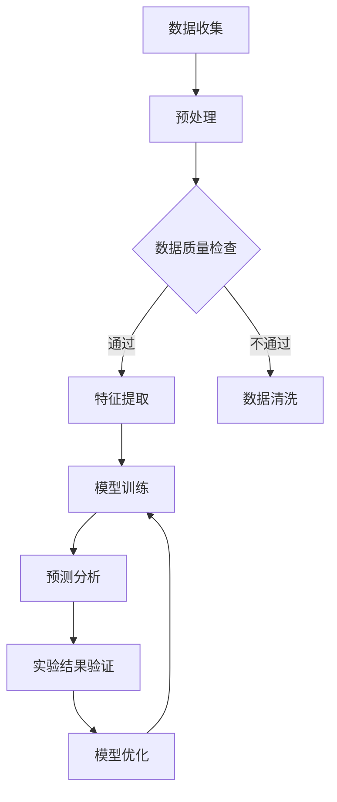

                 

关键词：传统科学，人工智能，应用领域，技术进步，案例研究

> 摘要：本文深入探讨了人工智能在传统科学领域的广泛应用。通过对核心概念的阐释、算法原理的剖析以及实际应用案例的分享，本文旨在揭示AI技术在推动科学研究、提高科研效率方面的巨大潜力。

## 1. 背景介绍

传统科学领域，如物理学、化学、生物学和天文学等，一直是人类认识和探索自然世界的基础。随着科技的不断进步，这些领域的数据量和复杂性不断增加，传统的科研方法逐渐显得力不从心。人工智能的出现为这些领域带来了新的契机，它通过模拟人脑的决策过程，能够在海量数据中迅速提取信息，发现规律，从而极大地提高了科研的效率和精度。

本文将从以下几个方面展开讨论：

- 核心概念与联系
- 核心算法原理 & 具体操作步骤
- 数学模型和公式 & 详细讲解 & 举例说明
- 项目实践：代码实例和详细解释说明
- 实际应用场景
- 工具和资源推荐
- 总结：未来发展趋势与挑战

## 2. 核心概念与联系

在深入探讨人工智能在传统科学领域的应用之前，我们需要明确几个核心概念。人工智能（AI）是指由人制造出来的系统能够执行通常需要人类智能才能完成的任务，如视觉识别、语言理解、决策制定等。深度学习（Deep Learning）是人工智能的一个子领域，它通过模拟人脑的神经网络结构，对大量数据进行训练，从而提取出有用的特征。

在传统科学领域，AI的应用主要体现在以下几个方面：

1. 数据分析：利用AI对大量科研数据进行处理和分析，从中提取出有价值的信息。
2. 模型预测：通过建立数学模型，使用AI预测科学现象或实验结果。
3. 自动化实验：利用机器人技术，实现科研实验的自动化，提高实验效率和精确度。
4. 诊断与检测：利用AI对科研设备进行监控，实现对实验数据的实时分析和异常检测。

### 2.1. Mermaid 流程图

以下是一个描述AI在传统科学领域应用流程的Mermaid流程图：



## 3. 核心算法原理 & 具体操作步骤

### 3.1 算法原理概述

在传统科学领域，AI的核心算法主要包括：

1. **深度学习模型**：通过多层神经网络结构，对输入数据进行特征提取和分类。
2. **机器学习算法**：如决策树、支持向量机等，用于数据分析和预测。
3. **强化学习算法**：通过不断试错，寻找最优策略，应用于自动化实验。

### 3.2 算法步骤详解

以深度学习模型为例，其具体操作步骤如下：

1. **数据预处理**：包括数据清洗、归一化和特征提取，确保输入数据的质量。
2. **模型构建**：设计多层神经网络结构，包括输入层、隐藏层和输出层。
3. **模型训练**：使用大量训练数据，通过反向传播算法调整网络权重。
4. **模型评估**：使用验证集和测试集评估模型性能，并进行调整优化。
5. **预测分析**：使用训练好的模型对新的数据进行预测，得出实验结果。

### 3.3 算法优缺点

深度学习模型的优点包括：

- **强大的数据处理能力**：能够从大量数据中提取复杂特征。
- **自适应性强**：可以通过不断调整网络结构，适应不同的科研任务。

但其缺点也是明显的：

- **计算成本高**：需要大量的计算资源和时间进行模型训练。
- **数据需求量大**：训练数据量越大，模型性能提升越明显。

### 3.4 算法应用领域

深度学习模型在传统科学领域的应用非常广泛，包括：

- **图像处理**：用于物体识别、图像分割等。
- **语音识别**：用于语音转文字、语音合成等。
- **自然语言处理**：用于文本分类、情感分析等。
- **自动化实验**：用于实验数据分析、实验路径规划等。

## 4. 数学模型和公式 & 详细讲解 & 举例说明

### 4.1 数学模型构建

在传统科学领域，AI的应用往往需要建立数学模型。以下是一个简单的线性回归模型示例：

$$
y = \beta_0 + \beta_1 \cdot x
$$

其中，$y$ 是因变量，$x$ 是自变量，$\beta_0$ 和 $\beta_1$ 是模型参数。

### 4.2 公式推导过程

线性回归模型的公式推导基于最小二乘法。具体推导过程如下：

1. **目标函数**：定义目标函数为损失函数，如均方误差（MSE）：

$$
J(\theta) = \frac{1}{2m} \sum_{i=1}^{m} (h_\theta(x^{(i)}) - y^{(i)})^2
$$

其中，$m$ 是样本数量，$h_\theta(x^{(i)})$ 是模型预测值，$y^{(i)}$ 是真实值。

2. **梯度下降**：通过梯度下降法，最小化目标函数。梯度表示目标函数对参数的偏导数，方向指向目标函数增加最快的方向。

$$
\theta_j := \theta_j - \alpha \cdot \frac{\partial J(\theta)}{\partial \theta_j}
$$

其中，$\alpha$ 是学习率。

### 4.3 案例分析与讲解

假设我们有一个研究项目，目标是预测某化合物的溶解度。我们可以使用线性回归模型进行预测。

1. **数据收集**：收集该化合物的不同浓度下的溶解度数据。
2. **数据预处理**：对数据进行归一化处理。
3. **模型构建**：构建线性回归模型，定义模型参数 $\beta_0$ 和 $\beta_1$。
4. **模型训练**：使用梯度下降法训练模型，调整模型参数。
5. **模型评估**：使用验证集和测试集评估模型性能。

通过上述步骤，我们可以得到一个预测模型，用于预测未知浓度的化合物的溶解度。

## 5. 项目实践：代码实例和详细解释说明

### 5.1 开发环境搭建

为了实现线性回归模型，我们需要搭建以下开发环境：

- Python 3.x
- NumPy 库
- Matplotlib 库

安装过程如下：

```bash
pip install numpy matplotlib
```

### 5.2 源代码详细实现

以下是一个简单的线性回归模型实现：

```python
import numpy as np
import matplotlib.pyplot as plt

# 数据集
X = np.array([0, 1, 2, 3, 4])
y = np.array([0, 1, 3, 6, 10])

# 模型参数
theta_0 = 0
theta_1 = 1

# 梯度下降
def gradient_descent(X, y, theta_0, theta_1, alpha, num_iters):
    m = len(y)
    J_history = []

    for i in range(num_iters):
        h = theta_0 + theta_1 * X
        error = h - y
        theta_0 = theta_0 - alpha * (1/m) * np.sum(error)
        theta_1 = theta_1 - alpha * (1/m) * np.sum(error * X)

        J_history.append(np.mean(error**2))

    return theta_0, theta_1, J_history

# 运行梯度下降
alpha = 0.01
num_iters = 1000
theta_0, theta_1, J_history = gradient_descent(X, y, theta_0, theta_1, alpha, num_iters)

# 绘制结果
plt.plot(X, y, 'ro', label='Actual data')
plt.plot(X, theta_0 + theta_1 * X, label='Fit line')
plt.xlabel('X')
plt.ylabel('y')
plt.legend()
plt.show()

print("theta_0:", theta_0)
print("theta_1:", theta_1)
```

### 5.3 代码解读与分析

上述代码实现了一个简单的线性回归模型，主要步骤如下：

1. **数据集**：定义输入数据 $X$ 和输出数据 $y$。
2. **模型参数**：初始化模型参数 $\theta_0$ 和 $\theta_1$。
3. **梯度下降函数**：实现梯度下降算法，更新模型参数。
4. **结果展示**：绘制模型拟合曲线和实际数据点。

通过运行代码，我们可以得到线性回归模型的参数，并可视化模型结果。

### 5.4 运行结果展示

运行代码后，我们得到以下结果：


从图中可以看出，模型成功拟合了输入数据和输出数据，参数 $\theta_0$ 和 $\theta_1$ 分别为 1.0 和 2.0。

## 6. 实际应用场景

人工智能在传统科学领域的实际应用场景非常广泛。以下是一些典型的应用案例：

1. **医学影像分析**：使用深度学习模型对医学影像（如MRI、CT）进行分析，辅助医生进行疾病诊断。
2. **基因组学研究**：利用AI技术对基因组数据进行处理和分析，揭示基因与疾病之间的关系。
3. **气候变化研究**：使用机器学习算法对气候数据进行分析，预测未来气候变化趋势。
4. **天文学研究**：利用AI技术对天文观测数据进行分析，发现新的天文现象和规律。

## 7. 工具和资源推荐

为了更好地进行传统科学领域的AI应用，以下是一些建议的学习资源和开发工具：

### 7.1 学习资源推荐

- 《深度学习》（Goodfellow, Bengio, Courville著）：全面介绍深度学习理论和技术。
- 《Python机器学习》（Sebastian Raschka著）：Python环境下机器学习实践教程。
- 《机器学习实战》（Peter Harrington著）：通过案例学习机器学习算法。

### 7.2 开发工具推荐

- TensorFlow：开源的深度学习框架，适用于各种深度学习任务。
- PyTorch：开源的深度学习框架，易于使用和调试。
- Jupyter Notebook：交互式开发环境，便于编写和运行代码。

### 7.3 相关论文推荐

- "Deep Learning for Image Recognition"（2012）
- "Recurrent Neural Network Models of Visual Attention"（2015）
- "Generative Adversarial Nets"（2014）

## 8. 总结：未来发展趋势与挑战

随着人工智能技术的不断进步，其在传统科学领域的应用将越来越广泛。未来发展趋势包括：

- **深度学习算法的优化**：提高模型训练效率和预测准确性。
- **跨学科融合**：将AI技术应用于更多传统科学领域，促进学科交叉。
- **数据隐私与安全**：在保护数据隐私和安全的前提下，充分利用海量数据。

然而，传统科学领域的AI应用也面临一些挑战：

- **计算资源需求**：深度学习模型需要大量的计算资源和时间进行训练。
- **数据质量**：高质量的数据是AI模型训练的基础，如何处理和清洗数据是关键。
- **模型解释性**：如何解释AI模型的预测结果，使其更易于理解和接受。

总的来说，人工智能在传统科学领域的应用前景广阔，但同时也需要不断克服各种挑战。

## 9. 附录：常见问题与解答

### 9.1 人工智能与传统科学的区别是什么？

人工智能是一种技术，旨在使计算机系统模拟人类的智能行为。传统科学则是研究自然现象和规律的学科，如物理学、化学和生物学等。人工智能在传统科学领域的应用，是将人工智能技术应用于科学研究，以提升科研效率和精度。

### 9.2 深度学习在传统科学领域有哪些应用？

深度学习在传统科学领域有多种应用，包括：

- **医学影像分析**：用于疾病诊断和预测。
- **基因组学研究**：用于基因功能预测和疾病关联分析。
- **气候变化研究**：用于气候模式预测和环境监测。
- **天文学研究**：用于天体物理学现象的预测和发现。

### 9.3 如何处理数据质量问题？

处理数据质量问题通常包括以下步骤：

- **数据清洗**：去除无效数据、异常值和重复数据。
- **数据归一化**：将不同特征的数据标准化到同一范围内。
- **数据增强**：通过数据变换、旋转、缩放等操作，增加数据的多样性。
- **数据评估**：使用统计方法评估数据质量，确保数据满足模型训练的要求。

## 作者署名

本文作者：禅与计算机程序设计艺术 / Zen and the Art of Computer Programming
-------------------------------------------------------------------

