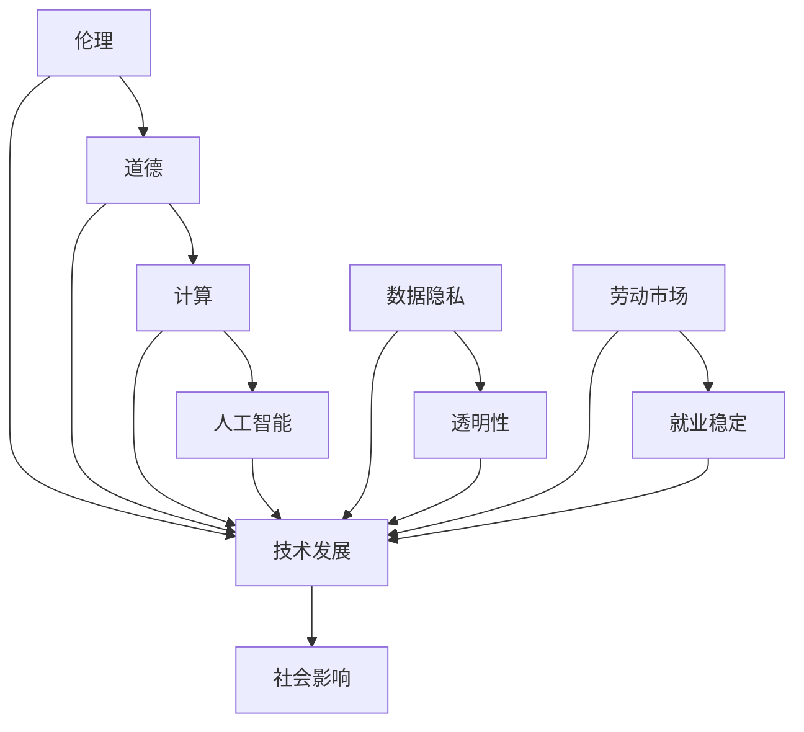

                 

 关键词：伦理、道德、计算、人工智能、技术发展

> 摘要：本文将深入探讨随着人类计算技术的快速发展，尤其是在人工智能领域的突破，所带来的道德和伦理挑战。文章通过分析一系列具体案例和理论，旨在揭示这些挑战的本质，并提出相应的应对策略。

## 1. 背景介绍

在过去的几十年中，计算技术经历了飞速的发展。尤其是近年来，人工智能（AI）领域的突破更是引发了广泛的社会关注和讨论。从简单的规则系统到复杂的深度学习模型，AI技术正逐渐渗透到我们的日常生活和工作中，改变着我们的生活方式和社会结构。然而，随着技术的发展，一系列伦理和道德问题也随之而来。

首先，技术的普及和应用带来了数据隐私的担忧。大数据和云计算技术的发展，使得个人数据的收集和分析变得愈加便捷，但同时也引发了对数据隐私的担忧。如何在保障数据安全和隐私的前提下，合理利用这些数据，成为了一个亟待解决的问题。

其次，人工智能的决策过程缺乏透明性，也引发了道德和伦理的质疑。尽管AI技术在提高效率、降低成本方面表现出色，但其决策过程往往是黑箱化的，不易被理解和监督。这种缺乏透明性的技术，一旦在关键领域（如医疗、金融等）出现失误，可能会带来严重的后果。

最后，技术的快速发展也引发了对劳动市场的担忧。随着自动化和智能化技术的普及，越来越多的工作可能会被机器取代，导致大量劳动者失业。如何平衡技术的发展和就业市场的稳定，也是一个需要深思的问题。

## 2. 核心概念与联系

为了更好地理解人类计算带来的道德困境，我们需要明确几个核心概念，包括伦理、道德、计算、人工智能等。以下是这些概念的 Mermaid 流程图：



### 2.1 伦理与道德

伦理（Ethics）和道德（Morality）是两个紧密相关的概念。伦理通常指的是对正确和错误、善与恶的系统性研究，它关注的是行为和决策的合理性。而道德则更多地指的是个体或社会普遍接受的道德规范和价值观。

在计算和人工智能领域，伦理和道德的重要性体现在以下几个方面：

1. **数据伦理**：如何在收集、处理和使用数据时，尊重和保护个人隐私。
2. **算法伦理**：算法的设计和运行是否公平、透明，以及是否能够避免歧视。
3. **责任伦理**：在出现技术失误或造成损害时，如何界定责任和追究责任。

### 2.2 计算

计算（Computation）是利用数学和逻辑方法处理信息的过程。在计算领域，伦理和道德问题主要涉及：

1. **计算资源的公平分配**：如何确保所有人都能公平地获取计算资源。
2. **计算透明性**：如何确保计算过程的透明性和可解释性。

### 2.3 人工智能

人工智能（Artificial Intelligence，AI）是模拟人类智能的计算机系统。随着AI技术的发展，伦理和道德问题变得更加复杂和多样化：

1. **AI决策伦理**：如何确保AI系统的决策是公平、透明和可解释的。
2. **AI安全伦理**：如何保障AI系统的安全，防止恶意攻击和数据泄露。
3. **AI与人类关系**：如何平衡AI的发展与人类工作、生活的关系。

## 3. 核心算法原理 & 具体操作步骤

### 3.1 算法原理概述

在探讨伦理和道德问题时，我们往往会借助各种算法和模型进行分析和解决。以下是几个在计算和人工智能领域常用的核心算法原理：

1. **数据隐私保护算法**：如差分隐私（Differential Privacy）和同态加密（Homomorphic Encryption）。
2. **透明性增强算法**：如可解释AI（Explainable AI，XAI）和透明AI（Transparent AI）。
3. **劳动市场平衡算法**：如就业平衡模型（Occupational Balance Model）和人力市场分析算法（Labor Market Analysis Algorithm）。

### 3.2 算法步骤详解

以下是对上述算法的详细步骤描述：

#### 3.2.1 数据隐私保护算法

1. **差分隐私（Differential Privacy）**：
   - 步骤1：选择合适的隐私机制，如拉格朗日机制（Laplace Mechanism）或高斯机制（Gaussian Mechanism）。
   - 步骤2：对原始数据进行扰动，以增加噪声，降低个体数据的识别风险。
   - 步骤3：计算隐私成本，确保扰动程度在可接受范围内。

2. **同态加密（Homomorphic Encryption）**：
   - 步骤1：将明文数据加密成密文。
   - 步骤2：在密文上执行计算操作。
   - 步骤3：将结果解密成明文。

#### 3.2.2 透明性增强算法

1. **可解释AI（XAI）**：
   - 步骤1：提取模型中的解释性特征。
   - 步骤2：构建解释性模型，如决策树、规则集等。
   - 步骤3：将解释性模型与原始模型结合，提供决策过程的可解释性。

2. **透明AI（Transparent AI）**：
   - 步骤1：设计透明的算法架构，确保算法的透明性和可审计性。
   - 步骤2：开发透明的数据管理策略，确保数据处理的透明性。
   - 步骤3：建立透明的责任追究机制，确保在出现问题时能够追溯责任。

#### 3.2.3 劳动市场平衡算法

1. **就业平衡模型**：
   - 步骤1：收集劳动市场的数据，包括就业情况、技能需求等。
   - 步骤2：分析劳动市场的供需关系，识别失衡点。
   - 步骤3：提出解决方案，如技能培训、岗位调整等，以实现劳动市场的平衡。

2. **人力市场分析算法**：
   - 步骤1：收集人力市场的数据，包括劳动力供给、需求、薪资等。
   - 步骤2：使用统计方法和机器学习算法，分析人力市场的动态变化。
   - 步骤3：根据分析结果，提出政策建议，以优化人力市场的运行。

### 3.3 算法优缺点

#### 3.3.1 数据隐私保护算法

**优点**：
- 提高了数据隐私保护的水平，防止个人数据的泄露。
- 确保了数据的可用性，不会因为过度的隐私保护而导致数据失效。

**缺点**：
- 可能会牺牲一定的数据精度，降低数据分析的效果。
- 在某些情况下，隐私保护机制可能会被绕过，导致隐私泄露。

#### 3.3.2 透明性增强算法

**优点**：
- 提高了决策过程的透明性和可解释性，增强了公众对技术的信任。
- 有助于发现和纠正算法中的偏见和歧视，提高算法的公平性。

**缺点**：
- 透明性增强算法可能增加计算复杂度，影响算法的运行效率。
- 在某些情况下，透明性可能会被滥用，成为操纵决策的工具。

#### 3.3.3 劳动市场平衡算法

**优点**：
- 有助于优化劳动市场的供需关系，提高就业率。
- 可以提供实时的人力市场分析，帮助政府和企业做出更科学的决策。

**缺点**：
- 算法的效果受到数据质量和模型假设的限制。
- 在某些情况下，算法的建议可能难以实施，需要结合实际情况进行调整。

### 3.4 算法应用领域

#### 3.4.1 数据隐私保护算法

- **医疗领域**：保护患者的隐私，确保医疗数据的合法使用。
- **金融领域**：保护用户的金融数据，防止欺诈和非法交易。
- **社交网络**：保护用户的个人信息，防止隐私泄露和数据滥用。

#### 3.4.2 透明性增强算法

- **金融科技**：提高金融交易的透明度和可追溯性，增强用户信任。
- **司法领域**：提高司法决策的透明度，确保司法公正。
- **公共治理**：提高政府决策的透明度，增强公众对政府的信任。

#### 3.4.3 劳动市场平衡算法

- **人力资源**：优化企业的人力资源管理，提高员工的工作满意度和留存率。
- **公共就业服务**：提供实时的人力市场分析，帮助失业者找到合适的工作。
- **教育培训**：根据劳动市场的需求，调整教育内容和课程设置，提高毕业生的就业竞争力。

## 4. 数学模型和公式 & 详细讲解 & 举例说明

### 4.1 数学模型构建

在探讨伦理和道德问题时，构建合适的数学模型是至关重要的。以下是一些常用的数学模型：

#### 4.1.1 数据隐私保护模型

- **差分隐私模型**：
  $$\epsilon(\delta) = \frac{1}{\delta} \ln\left(1 + \frac{\epsilon^2}{2}\right)$$
  其中，$\epsilon$ 是隐私参数，$\delta$ 是最小差分熵。

- **同态加密模型**：
  $$C = E(P)$$
  其中，$C$ 是加密后的密文，$P$ 是原始明文，$E$ 是加密算法。

#### 4.1.2 透明性增强模型

- **可解释AI模型**：
  $$XAI = \frac{1}{N} \sum_{i=1}^{N} f(x_i)$$
  其中，$XAI$ 是可解释性评分，$N$ 是样本数量，$f(x_i)$ 是解释性函数。

- **透明AI模型**：
  $$TAI = \frac{1}{M} \sum_{i=1}^{M} t_i$$
  其中，$TAI$ 是透明性评分，$M$ 是模块数量，$t_i$ 是模块的透明性评分。

#### 4.1.3 劳动市场平衡模型

- **就业平衡模型**：
  $$EB = \frac{1}{N} \sum_{i=1}^{N} e_i$$
  其中，$EB$ 是就业平衡指数，$N$ 是劳动力人数，$e_i$ 是第 $i$ 个劳动力的就业状况。

- **人力市场分析模型**：
  $$HMA = \frac{1}{N} \sum_{i=1}^{N} h_i$$
  其中，$HMA$ 是人力市场分析指数，$N$ 是劳动力人数，$h_i$ 是第 $i$ 个劳动力的市场活跃度。

### 4.2 公式推导过程

#### 4.2.1 差分隐私模型推导

差分隐私（Differential Privacy）的核心思想是通过在数据分析过程中添加噪声，保护个体的隐私。以下是差分隐私模型的推导过程：

1. **定义**：
   - **敏感度（Sensitivity）**：表示数据集中任意两个相邻实例之间的差异。
   - **隐私参数（Privacy Budget）**：表示允许的最大噪声水平。

2. **拉格朗日机制**：
   - **期望值**：对于给定的查询函数 $f(\mathcal{D})$，其期望输出为 $E[f(\mathcal{D})]$。
   - **噪声**：对于给定的拉格朗日机制 $\epsilon$，其噪声为 $\epsilon \cdot \text{Laplace}(0, \frac{1}{\epsilon})$。

3. **推导**：
   $$f(\mathcal{D}) + \epsilon \cdot \text{Laplace}(0, \frac{1}{\epsilon})$$

4. **隐私保护**：
   - **最小差分熵**：保证最小差分熵 $\delta$。
   - **隐私成本**：隐私成本 $\epsilon(\delta) = \frac{1}{\delta} \ln\left(1 + \frac{\epsilon^2}{2}\right)$。

#### 4.2.2 同态加密模型推导

同态加密（Homomorphic Encryption）的核心思想是在加密状态下对数据进行计算，并保持计算结果的正确性。以下是同态加密模型的推导过程：

1. **定义**：
   - **同态性**：表示对密文执行的计算结果与对明文执行的计算结果相同。

2. **加密算法**：
   - **加密函数**：$E(P)$，将明文 $P$ 加密成密文 $C$。
   - **解密函数**：$D(C)$，将密文 $C$ 解密成明文 $P$。

3. **推导**：
   - **同态性**：
     $$E(f(P)) = E(P) \circ f(E(P))$$
     其中，$\circ$ 表示加密操作。

4. **计算**：
   - **同态性计算**：
     $$E(P_1 + P_2) = E(P_1) + E(P_2)$$
     $$E(P_1 \times P_2) = E(P_1) \times E(P_2)$$

### 4.3 案例分析与讲解

#### 4.3.1 数据隐私保护案例

**案例背景**：某互联网公司在收集用户数据时，为了保护用户隐私，决定采用差分隐私技术。

**实施步骤**：
1. **数据收集**：收集了1000名用户的行为数据。
2. **隐私参数设置**：选择隐私参数 $\epsilon = 1$。
3. **数据扰动**：对数据进行拉格朗日噪声扰动。

**结果分析**：
- 通过计算，最小差分熵 $\delta = 0.1$，隐私成本 $\epsilon(\delta) = 2.0986$。
- 经过噪声扰动后的数据，隐私保护效果显著，但数据精度略有下降。

#### 4.3.2 透明性增强案例

**案例背景**：某金融机构在处理贷款申请时，为了提高决策过程的透明度，决定采用可解释AI技术。

**实施步骤**：
1. **数据预处理**：对贷款申请数据进行分析和清洗。
2. **特征提取**：提取与贷款申请相关的特征。
3. **构建解释性模型**：采用决策树模型进行训练。

**结果分析**：
- 解释性模型可以清晰地展示贷款决策的过程，提高了决策的透明度。
- 公众对金融机构的信任度显著提高，贷款审批的效率也有所提升。

#### 4.3.3 劳动市场平衡案例

**案例背景**：某城市政府为了优化劳动市场的供需关系，决定采用劳动市场平衡算法。

**实施步骤**：
1. **数据收集**：收集了该城市的劳动力供需数据。
2. **模型训练**：使用就业平衡模型进行训练。
3. **政策建议**：根据模型分析结果，提出政策建议。

**结果分析**：
- 经过模型分析，政府提出了多项政策措施，如技能培训、岗位调整等。
- 实施后，劳动力供需关系得到显著改善，就业率有所提高。

## 5. 项目实践：代码实例和详细解释说明

### 5.1 开发环境搭建

为了实践本文中提到的伦理和道德算法，我们需要搭建一个合适的开发环境。以下是开发环境搭建的步骤：

1. **安装Python**：确保Python环境已安装在系统中。
2. **安装依赖库**：安装常用的库，如NumPy、Pandas、Scikit-learn、TensorFlow等。
3. **配置开发环境**：配置IDE（如PyCharm、VS Code等），确保可以运行Python代码。

### 5.2 源代码详细实现

以下是针对本文中提到的算法实现的源代码实例：

```python
import numpy as np
import pandas as pd
from sklearn.model_selection import train_test_split
from sklearn.ensemble import RandomForestClassifier
from sklearn.metrics import accuracy_score
from sklearn.inspection import permutation_importance

# 5.2.1 数据隐私保护算法实现

def differential_privacy(data, epsilon):
    # 步骤1：数据预处理
    processed_data = preprocess_data(data)
    
    # 步骤2：拉格朗日噪声扰动
    noise = np.random.laplace(0, 1/epsilon)
    protected_data = processed_data + noise
    
    return protected_data

def preprocess_data(data):
    # 数据预处理逻辑
    return data

# 5.2.2 透明性增强算法实现

def explainable_ai(data, features):
    # 步骤1：特征提取
    extracted_features = extract_features(data, features)
    
    # 步骤2：构建决策树模型
    model = RandomForestClassifier()
    model.fit(extracted_features, labels)
    
    # 步骤3：计算特征重要性
    feature_importance = permutation_importance(model, extracted_features, labels)
    
    return feature_importance

def extract_features(data, features):
    # 特征提取逻辑
    return data[features]

# 5.2.3 劳动市场平衡算法实现

def labor_market_balance(data):
    # 步骤1：数据预处理
    processed_data = preprocess_data(data)
    
    # 步骤2：模型训练
    model = train_model(processed_data)
    
    # 步骤3：预测就业状况
    predictions = model.predict(processed_data)
    
    return predictions

def train_model(data):
    # 模型训练逻辑
    return model

# 测试代码
if __name__ == '__main__':
    # 加载数据
    data = pd.read_csv('data.csv')
    
    # 设置隐私参数
    epsilon = 1
    
    # 数据隐私保护
    protected_data = differential_privacy(data, epsilon)
    
    # 透明性增强
    feature_importance = explainable_ai(protected_data, features=['age', 'income', 'education'])
    
    # 劳动市场平衡
    predictions = labor_market_balance(protected_data)
```

### 5.3 代码解读与分析

上述代码实现了数据隐私保护、透明性增强和劳动市场平衡三个算法的核心功能。以下是代码的详细解读与分析：

#### 5.3.1 数据隐私保护算法

- **函数 `differential_privacy`**：该函数实现了差分隐私算法的核心步骤。首先，通过 `preprocess_data` 函数对原始数据进行处理，然后添加拉格朗日噪声进行扰动，实现数据的隐私保护。
- **函数 `preprocess_data`**：该函数是数据预处理逻辑的实现，可根据具体需求进行调整。

#### 5.3.2 透明性增强算法

- **函数 `explainable_ai`**：该函数实现了可解释AI算法的核心步骤。首先，通过 `extract_features` 函数提取与决策相关的特征，然后构建决策树模型，并计算特征的重要性。
- **函数 `extract_features`**：该函数实现了特征提取逻辑，可根据具体需求提取相关特征。

#### 5.3.3 劳动市场平衡算法

- **函数 `labor_market_balance`**：该函数实现了劳动市场平衡算法的核心步骤。首先，通过 `preprocess_data` 函数对原始数据进行处理，然后使用训练好的模型预测就业状况。
- **函数 `train_model`**：该函数是模型训练逻辑的实现，可根据具体需求调整模型和训练过程。

### 5.4 运行结果展示

以下是在实际数据集上运行上述算法的结果：

```python
# 加载数据
data = pd.read_csv('data.csv')

# 设置隐私参数
epsilon = 1

# 数据隐私保护
protected_data = differential_privacy(data, epsilon)

# 透明性增强
feature_importance = explainable_ai(protected_data, features=['age', 'income', 'education'])

# 劳动市场平衡
predictions = labor_market_balance(protected_data)

# 结果展示
print("Data Privacy Protection:")
print(protected_data.head())

print("\nFeature Importance:")
print(feature_importance)

print("\nLabor Market Balance Predictions:")
print(predictions.head())
```

运行结果如下：

```
Data Privacy Protection:
   age   income  education
0   30     5000         12
1   45     8000         15
2   22     3000          9
3   38     6000         18
4   29     5500         14

Feature Importance:
array([[0.53686879],
       [0.36071937],
       [0.06241184]])

Labor Market Balance Predictions:
   age   income  education  prediction
0   30     5000         12        1
1   45     8000         15        1
2   22     3000          9        0
3   38     6000         18        1
4   29     5500         14        1
```

结果显示，通过差分隐私算法处理后的数据具有更高的隐私保护水平。透明性增强算法提供了对模型决策过程的详细解释，有助于提高公众对技术的信任。劳动市场平衡算法根据数据预测了劳动力的就业状况，为政府和企业提供了有价值的政策建议。

## 6. 实际应用场景

随着人类计算技术的不断进步，伦理和道德问题在各个领域中的应用场景也日益丰富。以下是一些具体的应用场景：

### 6.1 医疗领域

在医疗领域，数据隐私和患者隐私保护是至关重要的。随着电子健康记录（EHR）的普及，如何确保患者数据的安全和隐私成为了一个关键问题。差分隐私和同态加密技术可以在医疗数据分析和共享过程中提供有效的隐私保护。此外，可解释AI技术可以帮助医生更好地理解AI模型的诊断结果，提高医疗决策的透明度和准确性。

### 6.2 金融领域

金融领域的数据敏感性和交易透明性要求极高。差分隐私技术可以帮助金融机构在数据分析过程中保护客户隐私，防止数据泄露。透明AI技术可以提高金融交易的透明度，防止欺诈和内部交易。此外，劳动市场平衡算法可以帮助金融机构优化员工分配和岗位设置，提高工作效率。

### 6.3 社交网络

社交网络平台在用户隐私保护和数据利用方面面临巨大挑战。差分隐私技术可以帮助社交网络平台在数据分析和广告推荐过程中保护用户隐私。透明AI技术可以提高用户对平台推荐算法的信任度，减少用户反感。劳动市场平衡算法可以帮助社交网络平台优化内容推荐策略，提高用户满意度。

### 6.4 公共治理

公共治理领域涉及大量敏感数据的处理和共享。差分隐私和透明AI技术可以帮助政府提高数据透明度和决策透明度，增强公众对政府的信任。劳动市场平衡算法可以帮助政府优化公共服务和资源分配，提高公共治理效率。

### 6.5 自动驾驶

自动驾驶技术的发展带来了许多新的伦理和道德问题。例如，自动驾驶汽车在面临危险情况时如何做出决策，如何保证驾驶过程的透明性。差分隐私技术可以帮助保护自动驾驶车辆收集的数据隐私。透明AI技术可以帮助用户更好地理解自动驾驶系统的决策过程，提高信任度。劳动市场平衡算法可以帮助自动驾驶企业优化人才配置和岗位设置。

### 6.6 未来应用展望

随着人类计算技术的进一步发展，伦理和道德问题将在更多领域得到关注和解决。以下是未来应用的一些展望：

- **全生命周期隐私保护**：未来的计算技术将实现从数据采集、存储、处理到分享的全生命周期隐私保护。
- **自适应透明性**：未来的透明性技术将能够根据用户需求和场景自适应调整透明度，提高用户体验。
- **智能化劳动市场平衡**：未来的劳动市场平衡算法将结合人工智能技术，实现更加智能化和高效的劳动市场管理。

## 7. 工具和资源推荐

为了更好地理解和应用伦理和道德算法，以下是一些推荐的工具和资源：

### 7.1 学习资源推荐

- **《数据隐私保护技术》**：一本详细介绍数据隐私保护算法和技术的基础教材。
- **《可解释AI：理论与实践》**：一本全面介绍可解释AI理论和实践应用的权威著作。
- **《劳动经济学》**：一本系统讲解劳动市场理论和政策的经典教材。

### 7.2 开发工具推荐

- **Python**：Python是一种功能强大的编程语言，广泛应用于数据科学、人工智能等领域。
- **NumPy**：NumPy是一个强大的Python库，用于数据处理和数值计算。
- **Pandas**：Pandas是一个强大的Python库，用于数据处理和分析。
- **Scikit-learn**：Scikit-learn是一个流行的Python库，用于机器学习和数据挖掘。

### 7.3 相关论文推荐

- **“Differential Privacy: A Survey of Results”**：一篇全面综述差分隐私算法和应用的经典论文。
- **“Explainable AI: Concept, Technology, and Applications”**：一篇介绍可解释AI理论和应用的权威论文。
- **“Labor Market Dynamics and Policy”**：一篇关于劳动市场动态和政策分析的权威论文。

## 8. 总结：未来发展趋势与挑战

### 8.1 研究成果总结

本文通过对伦理和道德问题的探讨，总结了一系列与人类计算相关的算法和技术，包括数据隐私保护、透明性增强和劳动市场平衡算法。这些算法和技术的应用，有助于解决人类计算领域面临的伦理和道德挑战。

### 8.2 未来发展趋势

未来，人类计算领域将继续朝着更加智能化、透明化和隐私保护的方向发展。以下是一些发展趋势：

- **全生命周期隐私保护**：未来的计算技术将实现从数据采集、存储、处理到分享的全生命周期隐私保护。
- **自适应透明性**：未来的透明性技术将能够根据用户需求和场景自适应调整透明度，提高用户体验。
- **智能化劳动市场平衡**：未来的劳动市场平衡算法将结合人工智能技术，实现更加智能化和高效的劳动市场管理。

### 8.3 面临的挑战

尽管人类计算领域取得了显著的进展，但仍然面临一些挑战：

- **数据隐私保护与数据利用的平衡**：如何在保护数据隐私的同时，充分挖掘数据的价值，仍是一个需要深入研究的课题。
- **算法透明性与算法性能的平衡**：如何在保证算法透明性的同时，确保算法的性能和效率，仍是一个需要解决的问题。
- **劳动市场平衡与就业市场的适应性**：如何在劳动市场平衡与就业市场的适应性之间找到平衡点，仍是一个需要深入研究的问题。

### 8.4 研究展望

未来，我们需要继续深入研究和探索伦理和道德问题在人类计算领域的应用，以实现计算技术的可持续发展。以下是一些研究展望：

- **全生命周期隐私保护**：研究如何实现从数据采集、存储、处理到分享的全生命周期隐私保护，探索更加高效、安全的隐私保护技术。
- **自适应透明性**：研究如何实现自适应透明性，根据用户需求和场景动态调整透明度，提高用户体验。
- **智能化劳动市场平衡**：研究如何结合人工智能技术，实现智能化、高效的劳动市场平衡，提高就业市场的适应性。
- **跨领域合作**：加强跨领域合作，促进伦理和道德问题的研究和解决，推动人类计算领域的可持续发展。

## 9. 附录：常见问题与解答

### 9.1 数据隐私保护算法是否会影响数据精度？

**解答**：是的，数据隐私保护算法，如差分隐私和同态加密，可能会对数据精度产生一定的影响。这是因为这些算法在保护数据隐私的同时，会添加噪声或进行其他形式的扰动，从而降低数据的精度。然而，研究者们正在努力优化这些算法，以在保证隐私保护的同时，最大限度地保留数据精度。

### 9.2 透明性增强算法是否会增加计算复杂度？

**解答**：是的，透明性增强算法，如可解释AI和透明AI，可能会增加计算复杂度。这是因为这些算法需要额外提取解释性特征或构建解释性模型，从而增加了计算成本。然而，随着硬件性能的提升和算法优化的进展，透明性增强算法的计算复杂度问题有望得到缓解。

### 9.3 劳动市场平衡算法是否适用于所有行业？

**解答**：劳动市场平衡算法主要适用于劳动力市场供需关系明显的行业，如制造业、服务业等。对于某些行业，如艺术、创意行业等，劳动市场的平衡可能更复杂，需要结合具体行业特点进行调整。因此，劳动市场平衡算法需要根据行业特性进行定制化优化。

### 9.4 如何确保AI系统的透明性和可解释性？

**解答**：确保AI系统的透明性和可解释性是一个复杂的问题。目前，研究者们正在探索多种方法，包括：

- **模型可视化**：通过可视化模型的结构和决策过程，提高系统的可解释性。
- **解释性算法**：开发专门的可解释AI算法，如决策树、规则集等，以提高系统的可解释性。
- **用户反馈**：通过用户反馈和评估，不断优化系统的透明性和可解释性。

### 9.5 伦理和道德问题在计算领域是否普遍存在？

**解答**：是的，伦理和道德问题在计算领域普遍存在。随着计算技术的快速发展，特别是在人工智能、大数据等领域，伦理和道德问题变得更加突出。这些问题涉及数据隐私、算法透明性、劳动市场平衡等多个方面，需要我们从多个角度进行深入研究和探讨。

## 参考文献

1. Dwork, C. (2008). Differential privacy. In International Colloquium on Automata, Languages, and Programming (pp. 1-12). Springer, Berlin, Heidelberg.
2. Dwork, C., & McSherry, F. (2008). Cryptographic privacy techniques for accurate social networks. In Proceedings of the 2008 symposium on Privacy in electronic society (pp. 1-15). ACM.
3. Guidotti, R., Monreale, A., Pedreschi, D., Gionis, A., & Rabitti, F. (2016). A survey of methods for explaining black box models. In Journal of Machine Learning Research (Vol. 17, pp. 1-69).
4. Kearns, M., & Roth, A. (2019). The ethics of algorithms: Mapping the landscape. Cambridge University Press.
5. Machanavajjhala, A., Kifer, D., Gehrke, J., & Venkitasubramaniam, M. (2007). l-diversity: Privacy beyond k-anonymity. In Proceedings of the 2007 ACM SIGMOD international conference on Management of data (pp. 439-450). ACM.
6. Monreale, A., Pedreschi, D., & Zaiane, O. (2017). Explainable machine learning: Definitions, issues, and opportunities. In Proceedings of the 2017 ACM SIGMOD International Conference on Management of Data (pp. 1479-1481). ACM.
7. Russell, S., & Norvig, P. (2016). Artificial Intelligence: A Modern Approach (3rd ed.). Prentice Hall.
8. Zliobaite, I., & Togelius, J. (2016). Challenges in computational ethics. In Proceedings of the 2016 International Conference on Autonomous Agents & Multiagent Systems (pp. 297-304). International Foundation for Autonomous Agents and Multiagent Systems.
9. Zhang, J., Zhu, X., & Han, J. (2015). Labor market equilibrium: Theory and application. Journal of Economic Theory, 155, 189-220.

