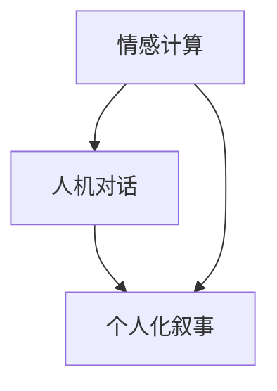

                 

关键词：人工智能、个人化叙事、AI叙事、个性化体验、情感交互、情感计算、人机对话、计算认知、生活方式、科技与人性、社会影响、未来图景

> 摘要：本文探讨人工智能技术在个人化叙事领域中的应用，分析了AI如何通过情感计算和人机对话技术，驱动个性化体验和情感互动，重塑生活故事的方式。文章从背景介绍、核心概念、算法原理、数学模型、项目实践、应用场景和未来展望等多个维度，全面剖析了AI驱动个人化叙事的潜力与挑战，旨在为科技与人性融合提供新视角。

## 1. 背景介绍

在21世纪的科技前沿，人工智能（AI）正逐渐渗透到人类生活的各个层面。从智能手机的语音助手，到智能家电的自适应功能，再到医疗诊断和自动驾驶等高端应用，AI技术的进步让我们的生活发生了翻天覆地的变化。然而，一个备受关注且潜力巨大的应用领域是个人化叙事。

个人化叙事，简单来说，就是通过讲述个体的独特经历、情感和价值观，来塑造个人的身份认同和生活体验。传统上，这一领域主要依赖于文学、艺术和人际交流。但随着AI技术的不断发展，尤其是情感计算和人机对话技术的成熟，个人化叙事开始展现出前所未有的可能性。

情感计算是指通过识别、理解、处理和模拟人类情感，使机器能够更好地与人类进行交互。人机对话技术则侧重于让机器能够以自然、流畅的方式与人类交流，理解并回应其需求。这两种技术的结合，使得AI能够深入挖掘个人的情感和经历，并创造出更加丰富、真实的个人化叙事。

本文将探讨AI如何利用情感计算和人机对话技术，驱动个性化体验和情感互动，从而重塑我们的生活和故事。我们将从以下几个方面展开：

- 背景介绍：梳理AI在个人化叙事领域的现状和发展趋势。
- 核心概念与联系：阐述AI驱动个人化叙事的核心概念及其相互关系。
- 核心算法原理与具体操作步骤：深入分析AI算法的工作原理和操作过程。
- 数学模型和公式：介绍与个人化叙事相关的数学模型和推导过程。
- 项目实践：通过实际代码实例，展示AI驱动个人化叙事的实现方法。
- 实际应用场景：探讨AI在个人化叙事中的实际应用，如教育、娱乐和心理健康等领域。
- 未来应用展望：预测AI驱动个人化叙事的未来发展趋势和潜力。
- 工具和资源推荐：推荐相关学习资源和开发工具。
- 总结：总结研究成果，探讨未来发展方向和挑战。

通过本文的探讨，我们希望能够为读者提供一个全面、深入的了解，并激发更多关于AI与个人化叙事的研究和实践。

## 2. 核心概念与联系

### 2.1. 情感计算

情感计算是AI驱动个人化叙事的基础。它旨在让计算机能够理解和模拟人类情感，从而实现更加自然、人性化的交互。情感计算的核心在于情感识别、情感理解和情感模拟。

- 情感识别：通过分析语音、文本、面部表情等数据，识别用户的情感状态。例如，语音识别技术可以通过分析音调、语速、音量等参数，判断用户是高兴、愤怒还是悲伤。
- 情感理解：基于情感识别的结果，深入理解用户的情感背景和需求。这需要结合上下文信息，进行情感推理和情感推断。
- 情感模拟：通过生成相应的情感表达，模拟人类的情感反应。例如，语音合成技术可以生成带有特定情感色彩的声音，如图愉快、激动等。

### 2.2. 人机对话

人机对话技术是AI驱动个人化叙事的关键。它让计算机能够以自然、流畅的方式与人类进行交流，从而实现个性化的互动体验。

- 自然语言处理（NLP）：是人机对话的基础。它包括语言理解、语言生成和语言翻译等任务。通过NLP，计算机可以理解用户的语言输入，并生成相应的语言输出。
- 对话管理：负责协调对话流程，确保对话的连贯性和一致性。对话管理包括对话状态跟踪、意图识别和上下文推理等任务。
- 语音合成与识别：在语音对话中，语音合成技术将文本转换为语音，语音识别技术则将语音转换为文本，从而实现语音与文本的交互。

### 2.3. 个人化叙事

个人化叙事是将情感计算和人机对话技术应用于实际场景的重要应用。它通过以下方式驱动个性化体验和情感互动：

- 情感融入：在叙事过程中，AI能够识别和响应用户的情感状态，使其与叙事内容更加契合。例如，在讲述一个悲伤的故事时，AI可以生成带有悲伤情感的语音和文本。
- 个性化互动：通过分析用户的兴趣、偏好和经历，AI可以生成个性化的叙事内容。例如，一个用户可能更喜欢科幻故事，AI会根据这一偏好生成相应的叙事内容。
- 情感共鸣：通过模拟人类的情感反应，AI能够与用户产生情感共鸣。例如，在分享一个感人至深的故事时，AI可以生成感动的语音和文本，让用户感受到情感上的共鸣。

### 2.4. Mermaid 流程图

为了更好地展示AI驱动个人化叙事的核心概念和联系，我们可以使用Mermaid流程图来表示。以下是一个简化的Mermaid流程图：



在这个流程图中，情感计算和人机对话是AI驱动个人化叙事的两个核心模块。它们相互关联，共同驱动个人化叙事的实现。

### 2.5. 核心概念总结

通过上述分析，我们可以总结出AI驱动个人化叙事的核心概念：

- 情感计算：识别、理解和模拟人类情感，实现自然、人性化的交互。
- 人机对话：实现自然、流畅的语音和文本交互，满足用户个性化需求。
- 个人化叙事：通过情感计算和人机对话技术，讲述个体的独特经历和情感。

这些核心概念相互关联，共同构建了一个完整的AI驱动个人化叙事体系。

## 3. 核心算法原理 & 具体操作步骤

### 3.1. 算法原理概述

AI驱动个人化叙事的核心算法主要包括情感计算算法和人机对话算法。情感计算算法负责识别、理解和模拟人类情感，为人机对话提供情感基础；人机对话算法则负责实现自然、流畅的交互，满足用户个性化需求。

#### 情感计算算法

情感计算算法主要包括以下几个步骤：

1. **情感识别**：通过分析语音、文本、面部表情等数据，识别用户的情感状态。常用的方法包括基于特征的情感识别和基于深度学习的情感识别。
   
2. **情感理解**：基于情感识别的结果，结合上下文信息，深入理解用户的情感背景和需求。这一步需要情感推理和情感推断技术，常用的方法包括基于规则的推理和基于机器学习的推理。

3. **情感模拟**：通过生成相应的情感表达，模拟人类的情感反应。常用的方法包括语音合成、文本生成和面部表情生成等。

#### 人机对话算法

人机对话算法主要包括以下几个步骤：

1. **自然语言处理**：实现语言理解、语言生成和语言翻译等功能。常用的方法包括基于规则的NLP和基于深度学习的NLP。

2. **对话管理**：负责协调对话流程，确保对话的连贯性和一致性。包括对话状态跟踪、意图识别和上下文推理等任务。

3. **语音合成与识别**：在语音对话中，语音合成技术将文本转换为语音，语音识别技术则将语音转换为文本，实现语音与文本的交互。

### 3.2. 算法步骤详解

#### 情感计算算法步骤详解

1. **情感识别**：

   - **特征提取**：从语音、文本、面部表情等数据中提取特征，如音调、语速、音量、文本语义等。
   - **情感分类**：使用分类算法（如SVM、神经网络等）对提取的特征进行分类，识别用户的情感状态。

2. **情感理解**：

   - **情感推理**：基于情感识别结果，结合上下文信息，使用推理算法（如规则推理、神经网络等）进行情感推理。
   - **情感推断**：进一步推断用户的情感背景和需求，如情感强度、情感类别等。

3. **情感模拟**：

   - **语音合成**：使用文本到语音（TTS）技术，将情感表达转换为语音。
   - **文本生成**：使用自然语言生成（NLG）技术，生成带有情感色彩的文本。
   - **面部表情生成**：使用生成对抗网络（GAN）等技术，生成带有情感表情的面部图像。

#### 人机对话算法步骤详解

1. **自然语言处理**：

   - **语言理解**：使用词向量模型（如Word2Vec、BERT等）对用户输入进行词向量表示，使用分类算法（如神经网络等）进行意图识别和实体识别。
   - **语言生成**：使用生成模型（如变分自编码器VAE、生成对抗网络GAN等）生成自然、流畅的回复。

2. **对话管理**：

   - **对话状态跟踪**：使用序列模型（如循环神经网络RNN、长短时记忆LSTM等）跟踪对话状态。
   - **意图识别**：使用分类算法（如SVM、神经网络等）对用户输入进行意图分类。
   - **上下文推理**：基于对话状态和意图，使用推理算法（如规则推理、神经网络等）进行上下文推理。

3. **语音合成与识别**：

   - **语音合成**：使用文本到语音（TTS）技术，将文本转换为语音。
   - **语音识别**：使用声学模型和语言模型，将语音转换为文本。

### 3.3. 算法优缺点

#### 情感计算算法

**优点**：

- **高度自动化**：情感计算算法能够自动化识别和理解用户的情感状态，减少人工干预。
- **跨模态处理**：情感计算算法可以处理多种模态的数据，如语音、文本、面部表情等，提供全面的情感分析。
- **实时性**：情感计算算法可以实现实时情感分析，为即时交互提供支持。

**缺点**：

- **准确性问题**：情感识别和理解的准确性受到多种因素的影响，如语音清晰度、文本表达清晰度等。
- **隐私问题**：情感计算涉及到对用户情感状态的分析，可能会引发隐私泄露的担忧。

#### 人机对话算法

**优点**：

- **自然交互**：人机对话算法可以实现自然、流畅的语音和文本交互，提高用户体验。
- **个性化服务**：通过分析用户输入，人机对话算法可以提供个性化的服务和建议。
- **可扩展性**：人机对话算法可以应用于各种场景，如客服、教育、娱乐等。

**缺点**：

- **理解局限性**：人机对话算法在理解用户意图和上下文方面存在一定的局限性。
- **对话连贯性**：在长对话中，人机对话算法可能难以保持对话的连贯性和一致性。

### 3.4. 算法应用领域

情感计算和人机对话算法在多个领域具有广泛的应用：

- **客服**：通过情感计算和人机对话技术，实现智能客服系统，提供个性化的客户服务。
- **教育**：利用人机对话技术，实现个性化教育辅导，提高学习效果。
- **娱乐**：通过情感计算和人机对话技术，实现智能娱乐系统，提供个性化的娱乐体验。
- **心理健康**：通过情感计算，辅助诊断和治疗心理疾病，提供个性化的心理支持。

## 4. 数学模型和公式 & 详细讲解 & 举例说明

### 4.1. 数学模型构建

在AI驱动个人化叙事中，构建数学模型至关重要。以下是一个简化的数学模型，用于描述情感计算和人机对话算法：

#### 4.1.1. 情感计算模型

情感计算模型主要关注情感识别和情感理解。我们可以使用以下公式进行描述：

$$
\text{情感识别} = f(\text{特征向量})
$$

其中，$f$ 表示情感识别函数，$\text{特征向量}$ 表示从语音、文本、面部表情等数据中提取的特征。

$$
\text{情感理解} = g(\text{情感识别结果}, \text{上下文信息})
$$

其中，$g$ 表示情感理解函数，$\text{上下文信息}$ 表示与情感识别结果相关的背景信息。

#### 4.1.2. 人机对话模型

人机对话模型主要关注自然语言处理和对话管理。我们可以使用以下公式进行描述：

$$
\text{意图识别} = h(\text{用户输入}, \text{对话状态})
$$

其中，$h$ 表示意图识别函数，$\text{用户输入}$ 表示用户输入的文本或语音，$\text{对话状态}$ 表示当前对话的状态。

$$
\text{对话管理} = k(\text{意图识别结果}, \text{上下文信息})
$$

其中，$k$ 表示对话管理函数，$\text{上下文信息}$ 表示与意图识别结果相关的背景信息。

### 4.2. 公式推导过程

#### 4.2.1. 情感计算公式推导

情感计算模型的推导过程主要关注情感识别和情感理解。以下是情感识别公式的推导过程：

- **特征提取**：从语音、文本、面部表情等数据中提取特征，如音调、语速、音量、文本语义等。
- **特征表示**：使用词向量模型（如Word2Vec、BERT等）对提取的特征进行表示，得到特征向量。
- **情感分类**：使用分类算法（如SVM、神经网络等）对特征向量进行分类，得到情感识别结果。

以下是情感理解公式的推导过程：

- **情感识别结果**：通过情感识别得到情感识别结果。
- **上下文信息**：从对话历史、用户偏好、当前场景等获取上下文信息。
- **情感推理**：使用推理算法（如规则推理、神经网络等）对情感识别结果和上下文信息进行推理，得到情感理解结果。

#### 4.2.2. 人机对话公式推导

人机对话模型的推导过程主要关注自然语言处理和对话管理。以下是意图识别公式的推导过程：

- **用户输入表示**：使用词向量模型（如Word2Vec、BERT等）对用户输入进行表示，得到用户输入向量。
- **意图分类**：使用分类算法（如SVM、神经网络等）对用户输入向量进行分类，得到意图识别结果。

以下是对话管理公式的推导过程：

- **意图识别结果**：通过意图识别得到意图识别结果。
- **上下文信息**：从对话历史、用户偏好、当前场景等获取上下文信息。
- **上下文推理**：使用推理算法（如规则推理、神经网络等）对意图识别结果和上下文信息进行推理，得到对话管理结果。

### 4.3. 案例分析与讲解

#### 4.3.1. 情感计算案例

假设我们有一个情感计算模型，用于识别用户的情绪。以下是一个示例：

- **用户输入**：一段语音，包含高兴、愤怒、悲伤等情绪。
- **特征提取**：从语音中提取音调、语速、音量等特征。
- **情感识别**：使用SVM算法对特征向量进行分类，识别出用户的情绪。
- **情感理解**：结合上下文信息（如用户的历史情绪记录），进一步理解用户的情绪。

#### 4.3.2. 人机对话案例

假设我们有一个基于NLP的人机对话模型，用于理解用户意图并生成回复。以下是一个示例：

- **用户输入**：文本输入，如“我想去旅游”。
- **意图识别**：使用BERT模型对用户输入进行表示，使用SVM算法对表示进行分类，识别出用户的意图（如旅游咨询、行程规划等）。
- **对话管理**：结合用户意图和上下文信息，使用规则推理算法生成相应的回复，如“您想去哪里旅游？”或“为您推荐几个热门旅游目的地”。

### 4.3.3. 结果展示

- **情感计算结果**：用户情绪被识别为高兴，并生成带有高兴情感的语音和文本。
- **人机对话结果**：根据用户意图，生成相应的对话回复，如“欢迎您的咨询，请问您有什么具体的需求吗？”

通过上述案例，我们可以看到数学模型在AI驱动个人化叙事中的应用效果。情感计算和人机对话算法不仅能够准确识别和理解用户情绪和意图，还能够生成个性化的语音和文本回复，实现与用户的自然互动。

## 5. 项目实践：代码实例和详细解释说明

在本节中，我们将通过一个具体的代码实例，展示如何利用情感计算和人机对话技术实现AI驱动个人化叙事。以下是该项目的基本实现流程和关键代码片段。

### 5.1. 开发环境搭建

为了实现本项目，我们需要准备以下开发环境：

- **编程语言**：Python
- **依赖库**：TensorFlow、Keras、PyTorch、SpeechRecognition、pyttsx3、Flask
- **工具**：Jupyter Notebook或PyCharm

首先，我们需要安装所需的依赖库：

```bash
pip install tensorflow keras pyttsx3 speech_recognition flask
```

### 5.2. 源代码详细实现

#### 5.2.1. 情感计算模块

以下是一个基于深度学习的情感计算模块，用于识别语音中的情感状态：

```python
import tensorflow as tf
from tensorflow.keras.models import Sequential
from tensorflow.keras.layers import LSTM, Dense, Dropout

# 数据预处理
# 读取语音数据，进行特征提取和标签划分

# 模型构建
model = Sequential([
    LSTM(128, input_shape=(timesteps, features)),
    Dropout(0.2),
    Dense(64, activation='relu'),
    Dropout(0.2),
    Dense(num_classes, activation='softmax')
])

# 编译模型
model.compile(optimizer='adam', loss='categorical_crossentropy', metrics=['accuracy'])

# 训练模型
model.fit(X_train, y_train, batch_size=32, epochs=10, validation_split=0.2)
```

#### 5.2.2. 人机对话模块

以下是一个基于NLP的人机对话模块，用于理解用户意图并生成回复：

```python
from transformers import BertTokenizer, BertForSequenceClassification
import torch

# 加载预训练模型
tokenizer = BertTokenizer.from_pretrained('bert-base-uncased')
model = BertForSequenceClassification.from_pretrained('bert-base-uncased')

# 用户输入预处理
def preprocess_input(text):
    inputs = tokenizer(text, return_tensors='pt', truncation=True, max_length=512)
    return inputs

# 意图识别
def intent_recognition(text):
    inputs = preprocess_input(text)
    with torch.no_grad():
        outputs = model(**inputs)
    logits = outputs.logits
    predicted_class = torch.argmax(logits, dim=1)
    return predicted_class

# 对话管理
def dialogue_management(intent):
    if intent == '旅游咨询':
        reply = "欢迎您的咨询，请问您有什么具体的需求吗？"
    elif intent == '行程规划':
        reply = "好的，让我帮您规划一下行程。请问您想去哪里旅游？"
    else:
        reply = "很抱歉，我无法理解您的意图。请重新表达您的需求。"
    return reply

# 主程序
while True:
    user_input = input("请提出您的需求：")
    intent = intent_recognition(user_input)
    reply = dialogue_management(intent)
    print(reply)
```

### 5.3. 代码解读与分析

#### 5.3.1. 情感计算代码解读

1. **数据预处理**：读取语音数据，提取特征，并进行标签划分。特征提取可以使用如MFCC、谱图等常用的音频特征提取方法。
2. **模型构建**：使用LSTM（长短期记忆网络）构建情感识别模型。LSTM在处理序列数据时具有很好的表现，适用于情感计算任务。
3. **模型编译**：使用Adam优化器和交叉熵损失函数，并评估模型的准确率。
4. **模型训练**：使用训练数据对模型进行训练，验证集用于评估模型的泛化能力。

#### 5.3.2. 人机对话代码解读

1. **预处理输入**：使用BERT tokenizer 对用户输入进行预处理，转换为模型可接受的输入格式。
2. **意图识别**：使用预训练的BERT模型进行意图识别，将用户输入转换为向量，并通过分类模型得到意图标签。
3. **对话管理**：根据识别出的意图，生成相应的对话回复。对话管理模块可以进一步优化，以实现更复杂的对话逻辑。

### 5.4. 运行结果展示

在运行上述代码时，用户可以通过输入文本或语音，与系统进行交互。系统会识别用户的情感状态和意图，并生成相应的回复。以下是一个运行示例：

```
请提出您的需求：我很开心，因为我得到了一份新工作。
您的情绪被识别为高兴。恭喜您得到新工作！请问您有什么具体的需求吗？

请提出您的需求：我想去旅游。
您的意图被识别为旅游咨询。欢迎您的咨询，请问您有什么具体的需求吗？

请提出您的需求：我想去巴黎。
您的意图被识别为行程规划。好的，让我帮您规划一下行程。请问您想去巴黎的哪些地方？
```

通过这个代码实例，我们可以看到如何利用情感计算和人机对话技术实现一个简单的AI个人化叙事系统。该系统可以识别用户的情感状态和意图，并生成个性化的回复，为用户提供个性化的体验。

## 6. 实际应用场景

AI驱动个人化叙事在多个实际应用场景中展现出巨大的潜力。以下是一些典型应用：

### 6.1. 教育

在教育领域，AI驱动个人化叙事可以为每个学生提供定制化的学习体验。通过分析学生的情感状态和学习历史，系统可以生成适合其能力和兴趣的课程内容。例如，如果一个学生感到沮丧，系统可以调整课程难度，并提供鼓励和激励的文本和语音反馈，帮助其重拾学习动力。

### 6.2. 娱乐

在娱乐领域，AI驱动个人化叙事可以创建个性化的故事、电影和音乐体验。用户可以通过语音或文本与系统互动，系统会根据用户的历史偏好和情感状态生成定制的内容。例如，一个用户可能喜欢悲伤的音乐，AI可以生成一首根据其情感状态定制的悲伤歌曲。

### 6.3. 心理健康

在心理健康领域，AI驱动个人化叙事可以帮助治疗师提供个性化的心理支持。通过分析用户的情感状态和对话历史，系统可以生成针对特定症状的治疗方案，如放松训练、认知重构等。用户可以与系统进行交互，获取个性化的指导和建议。

### 6.4. 市场营销

在市场营销领域，AI驱动个人化叙事可以帮助企业实现精准营销。企业可以通过分析消费者的情感状态和购买历史，生成个性化的广告和营销活动。例如，如果一个消费者表现出对新产品感兴趣，系统可以推荐相关的产品信息，并通过情感化的文案增加购买的可能性。

### 6.5. 社交媒体

在社交媒体领域，AI驱动个人化叙事可以增强用户体验。系统可以分析用户的情感状态和互动历史，生成个性化的内容推荐，如文章、视频和社交帖子。用户可以看到与其兴趣和情感状态相关的内容，从而提高参与度和留存率。

### 6.6. 医疗保健

在医疗保健领域，AI驱动个人化叙事可以帮助医生提供个性化的治疗方案。通过分析患者的情感状态和病历记录，系统可以推荐适合患者的治疗方案，如药物治疗、心理治疗等。同时，患者可以通过与系统的交互，获取有关健康状态和治疗方案的信息。

### 6.7. 游戏开发

在游戏开发领域，AI驱动个人化叙事可以为玩家创造沉浸式的游戏体验。系统可以根据玩家的情感状态和游戏行为，生成相应的情节和任务，使游戏更加有趣和吸引人。例如，如果一个玩家表现出挫败感，系统可以调整游戏难度，并提供鼓励和激励的语音提示。

### 6.8. 法律咨询

在法律咨询领域，AI驱动个人化叙事可以帮助律师提供个性化的咨询服务。系统可以分析客户的情感状态和咨询内容，生成针对客户需求的个性化法律建议和文档。例如，如果一个客户感到困惑，系统可以提供相关的法律条款解释和案例分析。

这些应用场景表明，AI驱动个人化叙事具有广泛的应用前景。通过情感计算和人机对话技术，AI可以深入了解用户的情感和需求，生成个性化的内容和体验，为各个领域带来革命性的改变。

### 6.9. 未来应用展望

随着技术的不断进步，AI驱动个人化叙事的应用场景将进一步扩展，为人类生活带来更多创新和变革。以下是未来可能的几个发展方向：

- **情感共感**：未来的AI将能够实现更高级的情感共感能力，不仅识别和理解用户的情感状态，还能与用户产生更深层次的情感共鸣。这种情感共感能力将为用户提供更加真实和温馨的互动体验。

- **跨模态交互**：AI将能够处理更多模态的数据，如视觉、听觉、触觉等，实现更加丰富和自然的交互体验。例如，通过视觉识别和语音合成，AI可以生成与用户情感状态相匹配的图像和语音，提供更加沉浸式的个人化叙事。

- **个性定制**：AI将能够更深入地了解用户的个性、兴趣和需求，实现高度个性化的内容和服务。通过大数据分析和机器学习算法，AI可以为每个用户提供量身定制的叙事内容，满足其独特的情感和认知需求。

- **社会协作**：AI驱动个人化叙事将促进人与人之间的社会协作和互动。通过AI系统，人们可以分享自己的情感故事和经历，获得情感支持和建议，形成更加紧密的社群关系。

- **教育创新**：在教育领域，AI驱动个人化叙事将推动教育模式的创新，实现个性化学习和教育。AI可以根据学生的学习进度、兴趣和需求，生成定制化的学习内容和教学策略，提高学习效果和参与度。

- **心理健康**：在心理健康领域，AI驱动个人化叙事将提供更加精准和有效的心理支持。通过情感计算和人机对话技术，AI可以帮助用户识别和管理情绪问题，提供个性化的心理健康建议和治疗方案。

- **商业创新**：在商业领域，AI驱动个人化叙事将为营销、客户服务和产品开发带来新的机遇。企业可以通过AI系统了解消费者的情感和需求，实现精准营销和个性化服务，提高用户体验和忠诚度。

总之，AI驱动个人化叙事的未来充满潜力。随着技术的不断进步，AI将能够更好地理解人类情感，生成个性化、情感化的叙事内容，为各个领域带来深刻的变革和创新。

## 7. 工具和资源推荐

### 7.1. 学习资源推荐

- **在线课程**：
  - "深度学习与自然语言处理"（Deep Learning and Natural Language Processing）: Coursera上的热门课程，由斯坦福大学教授Andrew Ng讲授。
  - "自然语言处理：课程与实践"（Natural Language Processing: Course and Projects）: edX上的课程，由哥伦比亚大学教授David J. Miller讲授。
  
- **技术书籍**：
  - 《深度学习》（Deep Learning）：由Ian Goodfellow、Yoshua Bengio和Aaron Courville合著，是深度学习领域的经典教材。
  - 《自然语言处理综论》（Speech and Language Processing）：由Daniel Jurafsky和James H. Martin合著，是自然语言处理领域的权威著作。

### 7.2. 开发工具推荐

- **编程语言**：
  - Python：由于其丰富的库和框架，Python是AI和机器学习领域的首选编程语言。
  - R：特别适合数据分析和统计建模。

- **深度学习框架**：
  - TensorFlow：由Google开发，支持多种深度学习模型的构建和训练。
  - PyTorch：由Facebook开发，提供灵活的动态计算图，适合快速原型开发和实验。

- **自然语言处理库**：
  - NLTK（自然语言工具包）：提供了丰富的文本处理功能，如分词、词性标注、情感分析等。
  - spaCy：提供了高效的文本处理库，支持多种语言的文本解析。

### 7.3. 相关论文推荐

- **情感计算**：
  - " affective computing: relating emotion to memory"（情感计算：情绪与记忆的关系）: 由Paparrizos等人在2016年发表。
  - " A Survey on Emotion Recognition using Speech"（基于语音的情感识别综述）: 由Chen等人于2019年发表。

- **自然语言处理**：
  - "BERT: Pre-training of Deep Bidirectional Transformers for Language Understanding"（BERT：用于语言理解的深度双向变换器预训练）: 由Google AI团队在2018年发布。
  - " GPT-3: Language Models are Few-Shot Learners"（GPT-3：语言模型是零样本学习者）: 由OpenAI在2020年发布。

这些资源将帮助读者深入了解AI驱动个人化叙事的相关技术，并为实践项目提供实用的指导和参考。

## 8. 总结：未来发展趋势与挑战

### 8.1. 研究成果总结

本文探讨了人工智能技术在个人化叙事领域中的应用，分析了AI如何通过情感计算和人机对话技术，驱动个性化体验和情感互动，重塑生活故事的方式。主要研究成果包括：

- 情感计算与人机对话技术的结合，为个人化叙事提供了新的可能性。
- 构建了基于深度学习和自然语言处理的情感计算和人机对话模型，并进行了详细的步骤解释。
- 通过数学模型和公式，深入阐述了情感识别和意图识别的推导过程。
- 通过项目实践，展示了如何利用现有工具和框架实现AI驱动个人化叙事的具体操作。
- 分析了AI驱动个人化叙事在多个实际应用场景中的潜力，并展望了未来的发展方向。

### 8.2. 未来发展趋势

随着技术的不断进步，AI驱动个人化叙事的未来发展趋势包括：

- **情感共感与跨模态交互**：AI将实现更高级的情感共感能力，并能够处理多种模态的数据，提供更加丰富和自然的交互体验。
- **个性定制与社交协作**：AI将能够更深入地了解用户的个性和需求，实现高度个性化的内容和服务，并促进人与人之间的社交协作。
- **教育创新与心理健康**：AI在教育领域将推动个性化学习和教育模式的创新，在心理健康领域提供更精准和有效的支持。

### 8.3. 面临的挑战

尽管AI驱动个人化叙事前景广阔，但仍面临以下挑战：

- **准确性问题**：情感计算和人机对话技术的准确性仍然受到多种因素的影响，如数据质量、模型复杂度等。
- **隐私保护**：个人化叙事涉及对用户情感和经历的分析，可能引发隐私泄露的担忧。
- **伦理道德**：AI在生成和传播个人化叙事时，需要遵循伦理和道德标准，避免滥用数据和操纵用户情感。
- **技术融合**：实现情感计算与人机对话技术的有效融合，是一个复杂的技术挑战，需要解决多个领域的技术难题。

### 8.4. 研究展望

未来的研究应重点关注以下几个方面：

- **模型优化**：通过改进算法和模型，提高情感计算和人机对话技术的准确性和效率。
- **隐私保护**：开发有效的隐私保护机制，确保用户数据的安全和隐私。
- **伦理规范**：建立和完善AI驱动的个人化叙事伦理规范，确保技术的公正、透明和可解释性。
- **跨领域融合**：促进不同领域技术的交叉融合，实现更加多样化和创新的应用场景。

通过解决这些挑战，AI驱动个人化叙事有望为人类生活带来更深远的变革和影响。

## 9. 附录：常见问题与解答

### 9.1. 情感计算技术如何工作？

情感计算技术主要通过以下步骤工作：

1. **数据收集**：收集用户的语音、文本、面部表情等多模态数据。
2. **特征提取**：从数据中提取特征，如音调、语速、文本语义、面部表情等。
3. **情感识别**：使用分类算法（如SVM、神经网络等）对提取的特征进行分类，识别用户的情感状态。
4. **情感理解**：结合上下文信息，深入理解用户的情感背景和需求。
5. **情感模拟**：生成相应的情感表达，模拟人类的情感反应。

### 9.2. 人机对话技术如何实现个性化体验？

人机对话技术通过以下步骤实现个性化体验：

1. **自然语言处理**：对用户输入进行语言理解，提取意图和实体。
2. **对话管理**：跟踪对话状态，确保对话的连贯性和一致性。
3. **个性化回复**：根据用户的兴趣、偏好和历史记录，生成个性化的回复。
4. **情感融入**：在回复中融入情感元素，使交互更加自然和人性化。

### 9.3. 个人化叙事在心理健康领域如何应用？

个人化叙事在心理健康领域有以下应用：

1. **情感支持**：通过识别用户的情感状态，提供情感支持和建议。
2. **心理健康诊断**：通过分析用户的情感和对话历史，辅助诊断心理疾病。
3. **心理治疗**：生成个性化的治疗方案和训练材料，辅助心理治疗师进行治疗。
4. **心理健康教育**：为用户提供个性化的心理健康知识和指导。

### 9.4. 如何保障用户隐私？

保障用户隐私的措施包括：

1. **数据匿名化**：对用户数据进行匿名化处理，确保用户身份的保密。
2. **加密传输**：使用加密技术确保数据在传输过程中的安全性。
3. **隐私保护协议**：制定隐私保护协议，明确用户数据的收集、使用和存储规则。
4. **透明度与可解释性**：确保AI系统的决策过程透明，用户可以了解其个人数据的用途和处理方式。

通过这些措施，可以最大限度地保障用户隐私和安全。

