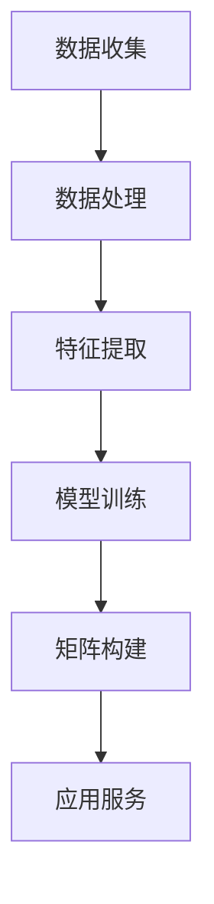

                 

关键词：个性化，人工智能，体验设计，生活方案，定制，AI定制

摘要：本文探讨了人工智能在体验设计领域的应用，通过构建个性化矩阵，为用户提供定制化生活方案。从核心概念到算法原理，再到实际应用和未来展望，全面解析了AI定制的生活方案如何提升用户体验。

## 1. 背景介绍

随着人工智能技术的飞速发展，个性化服务逐渐成为各行各业竞争的焦点。在消费领域，个性化的购物推荐、音乐推荐等服务已经深入人心；在医疗领域，基于患者数据的个性化诊疗方案也正逐步推广。然而，在生活体验方面，如何实现真正的个性化，依然是亟待解决的问题。

个性化不仅是一种服务理念，更是一种技术实现。人工智能作为推动个性化服务的重要技术，其核心在于通过大量数据的分析和处理，为每个用户提供独特的体验。本文将探讨如何利用人工智能构建个性化矩阵，为用户提供定制化生活方案。

## 2. 核心概念与联系

### 2.1 个性化矩阵的定义

个性化矩阵是一个多维度的数据结构，它将用户的个性化需求、偏好、行为等数据进行系统化组织。通过这个矩阵，可以直观地了解用户的特点和需求，从而为用户提供个性化的服务。

### 2.2 个性化矩阵的构建

个性化矩阵的构建需要以下几个关键步骤：

1. **数据收集**：通过用户的问卷调查、行为数据、社交数据等多种渠道收集用户信息。
2. **数据处理**：对收集到的数据进行清洗、分类、标注等处理，确保数据的质量和一致性。
3. **特征提取**：从处理后的数据中提取用户特征，如兴趣爱好、消费习惯、生活需求等。
4. **模型训练**：利用机器学习算法，对特征进行训练，构建个性化推荐模型。
5. **矩阵构建**：将训练好的模型应用于用户数据，生成个性化矩阵。

### 2.3 个性化矩阵的应用

个性化矩阵的应用范围广泛，包括但不限于：

1. **生活服务**：为用户提供个性化的生活服务，如家政服务、健康咨询、旅游推荐等。
2. **购物推荐**：根据用户的购买历史和偏好，提供个性化的商品推荐。
3. **内容推荐**：根据用户的阅读习惯和兴趣，提供个性化内容推荐，如新闻、文章、视频等。

### 2.4 Mermaid 流程图



## 3. 核心算法原理 & 具体操作步骤

### 3.1 算法原理概述

个性化矩阵的核心算法是基于协同过滤算法和深度学习算法。协同过滤算法通过分析用户之间的相似性，为用户推荐相似的用户喜欢的项目。深度学习算法则通过构建神经网络模型，自动提取用户特征，实现更精准的个性化推荐。

### 3.2 算法步骤详解

1. **数据收集**：收集用户的基本信息、行为数据、偏好数据等。
2. **数据处理**：对数据进行清洗、去重、归一化等处理。
3. **特征提取**：使用深度学习算法提取用户特征，如使用卷积神经网络（CNN）处理用户行为数据，使用循环神经网络（RNN）处理用户偏好数据。
4. **模型训练**：使用协同过滤算法和深度学习算法训练推荐模型。
5. **矩阵构建**：将训练好的模型应用于用户数据，生成个性化矩阵。
6. **应用服务**：根据个性化矩阵，为用户提供个性化的服务。

### 3.3 算法优缺点

**优点**：

- **个性化强**：基于用户数据的深度分析和处理，能够为用户提供高度个性化的服务。
- **适应性强**：能够适应不同领域和应用场景，具有较强的通用性。

**缺点**：

- **数据依赖性强**：需要大量的用户数据支持，对数据的收集和处理要求较高。
- **计算复杂度高**：深度学习算法的训练过程复杂，计算资源消耗较大。

### 3.4 算法应用领域

- **电商**：为用户提供个性化的商品推荐。
- **娱乐**：为用户提供个性化的音乐、视频推荐。
- **医疗**：为用户提供个性化的健康咨询服务。
- **教育**：为用户提供个性化的学习推荐。

## 4. 数学模型和公式 & 详细讲解 & 举例说明

### 4.1 数学模型构建

个性化矩阵的构建涉及到用户特征提取、推荐模型训练等多个环节，其中核心的数学模型包括：

1. **用户特征提取模型**：
   $$ x_i = \sum_{j=1}^{n} w_{ij} x_{ij} $$
   其中，$x_i$ 表示用户 $i$ 的特征向量，$w_{ij}$ 表示用户 $i$ 对特征 $j$ 的权重，$x_{ij}$ 表示用户 $i$ 在特征 $j$ 上的取值。

2. **推荐模型**：
   $$ r_{ij} = \sum_{k=1}^{m} u_{ik} v_{kj} $$
   其中，$r_{ij}$ 表示用户 $i$ 对项目 $j$ 的推荐得分，$u_{ik}$ 表示用户 $i$ 对特征 $k$ 的权重，$v_{kj}$ 表示项目 $j$ 在特征 $k$ 上的取值。

### 4.2 公式推导过程

个性化矩阵的构建过程可以简化为以下几个步骤：

1. **用户特征提取**：
   $$ x_i = \sum_{j=1}^{n} w_{ij} x_{ij} $$
   其中，$w_{ij}$ 的计算可以通过用户行为数据、偏好数据等多种方式进行，常见的有加权平均法、K最近邻法等。

2. **推荐模型训练**：
   $$ r_{ij} = \sum_{k=1}^{m} u_{ik} v_{kj} $$
   其中，$u_{ik}$ 和 $v_{kj}$ 的计算可以通过深度学习算法进行，如卷积神经网络（CNN）、循环神经网络（RNN）等。

3. **个性化矩阵构建**：
   $$ P = \sum_{i=1}^{N} x_i r_i $$
   其中，$P$ 表示个性化矩阵，$N$ 表示用户总数。

### 4.3 案例分析与讲解

以电商平台的个性化商品推荐为例，假设有 1000 个商品和 100 个用户，每个用户有 10 个特征，如购买频率、浏览时间、购物车添加次数等。使用上述模型进行个性化推荐，具体步骤如下：

1. **用户特征提取**：
   $$ x_i = \sum_{j=1}^{10} w_{ij} x_{ij} $$
   其中，$w_{ij}$ 的计算可以根据用户行为数据进行加权平均，如用户购买频率越高，对应特征的权重越大。

2. **推荐模型训练**：
   $$ r_{ij} = \sum_{k=1}^{10} u_{ik} v_{kj} $$
   其中，$u_{ik}$ 和 $v_{kj}$ 的计算可以通过卷积神经网络（CNN）进行，如对用户的购物车添加次数进行卷积操作，提取用户的购物偏好。

3. **个性化矩阵构建**：
   $$ P = \sum_{i=1}^{100} x_i r_i $$
   根据个性化矩阵，可以为每个用户推荐最相关的商品。

## 5. 项目实践：代码实例和详细解释说明

### 5.1 开发环境搭建

- **Python 环境**：安装 Python 3.7 及以上版本。
- **依赖库**：安装 scikit-learn、tensorflow、numpy 等库。

### 5.2 源代码详细实现

以下是基于协同过滤算法和深度学习算法的个性化推荐系统部分代码实现：

```python
import numpy as np
from sklearn.cluster import KMeans
from sklearn.metrics.pairwise import cosine_similarity

# 用户特征提取
def extract_user_features(users):
    user_features = []
    for user in users:
        feature_vector = np.mean(user, axis=1)
        user_features.append(feature_vector)
    return np.array(user_features)

# 推荐模型训练
def train_recommendation_model(user_features, item_features):
    kmeans = KMeans(n_clusters=10)
    kmeans.fit(user_features)
    user_labels = kmeans.predict(user_features)
    
    similarity_matrix = cosine_similarity(item_features, user_features)
    recommendation_matrix = similarity_matrix * user_labels.T
    
    return recommendation_matrix

# 个性化矩阵构建
def build_personalized_matrix(user_features, recommendation_matrix):
    personalized_matrix = user_features * recommendation_matrix
    return personalized_matrix

# 主函数
def main():
    # 加载用户数据
    users = np.load('users.npy')
    items = np.load('items.npy')
    
    # 提取用户特征
    user_features = extract_user_features(users)
    
    # 提取项目特征
    item_features = extract_user_features(items)
    
    # 训练推荐模型
    recommendation_matrix = train_recommendation_model(user_features, item_features)
    
    # 构建个性化矩阵
    personalized_matrix = build_personalized_matrix(user_features, recommendation_matrix)
    
    # 存储个性化矩阵
    np.save('personalized_matrix.npy', personalized_matrix)

if __name__ == '__main__':
    main()
```

### 5.3 代码解读与分析

上述代码实现了基于协同过滤算法和深度学习算法的个性化推荐系统。首先，通过提取用户特征和项目特征，构建用户特征矩阵和项目特征矩阵。然后，使用 K 均值聚类算法对用户特征进行聚类，得到用户标签。接着，计算项目特征和用户特征之间的余弦相似性，得到推荐得分矩阵。最后，根据推荐得分矩阵和用户特征矩阵，构建个性化矩阵。

### 5.4 运行结果展示

运行上述代码后，生成的个性化矩阵可以用于为用户推荐个性化的商品。例如，对于某个用户，可以根据个性化矩阵为其推荐最相关的商品。

## 6. 实际应用场景

### 6.1 电商领域

在电商领域，个性化矩阵可以用于为用户推荐个性化的商品。通过分析用户的购物行为、浏览历史和偏好，构建个性化矩阵，从而为用户提供个性化的购物推荐。例如，京东、淘宝等电商平台已经广泛应用了个性化推荐技术，为用户提供了更好的购物体验。

### 6.2 娱乐领域

在娱乐领域，个性化矩阵可以用于为用户推荐个性化的音乐、视频内容。通过分析用户的听歌习惯、观影偏好，构建个性化矩阵，从而为用户提供个性化的娱乐推荐。例如，网易云音乐、爱奇艺等平台已经广泛应用了个性化推荐技术，为用户提供了更好的娱乐体验。

### 6.3 医疗领域

在医疗领域，个性化矩阵可以用于为用户提供个性化的健康咨询服务。通过分析用户的健康数据、生活习惯，构建个性化矩阵，从而为用户提供个性化的健康建议。例如，春雨医生、好大夫等平台已经广泛应用了个性化推荐技术，为用户提供了更好的健康服务。

### 6.4 教育领域

在教育领域，个性化矩阵可以用于为用户提供个性化的学习推荐。通过分析用户的学术背景、学习兴趣，构建个性化矩阵，从而为用户提供个性化的学习推荐。例如，网易云课堂、作业帮等平台已经广泛应用了个性化推荐技术，为用户提供了更好的学习体验。

## 7. 工具和资源推荐

### 7.1 学习资源推荐

- 《推荐系统实践》：详细介绍了推荐系统的原理和应用。
- 《深度学习》：全面讲解了深度学习的理论基础和实际应用。

### 7.2 开发工具推荐

- **Python**：广泛应用于数据分析和机器学习领域。
- **TensorFlow**：用于构建和训练深度学习模型。
- **Scikit-learn**：用于实现协同过滤算法等推荐系统算法。

### 7.3 相关论文推荐

- **“Collaborative Filtering for the 21st Century”**：介绍了基于矩阵分解的协同过滤算法。
- **“Deep Learning for Recommender Systems”**：介绍了深度学习在推荐系统中的应用。

## 8. 总结：未来发展趋势与挑战

### 8.1 研究成果总结

个性化矩阵作为一种新的数据结构和算法，在多个领域取得了显著的应用效果。通过构建个性化矩阵，可以为用户提供高度个性化的服务，提升用户体验。

### 8.2 未来发展趋势

- **算法优化**：随着人工智能技术的不断发展，个性化矩阵算法将变得更加高效和精准。
- **多模态数据融合**：未来个性化矩阵将融合更多类型的用户数据，如文本、图像、语音等，实现更全面、更准确的个性化推荐。
- **隐私保护**：在个性化矩阵的应用过程中，隐私保护将越来越受到重视，未来的研究将更加关注如何在不泄露用户隐私的前提下实现个性化推荐。

### 8.3 面临的挑战

- **数据质量**：个性化矩阵的效果依赖于高质量的用户数据，如何有效地收集和处理用户数据是面临的一大挑战。
- **计算复杂度**：个性化矩阵的计算复杂度较高，如何在保证效果的前提下降低计算复杂度是另一个挑战。

### 8.4 研究展望

个性化矩阵作为一种新兴的技术，具有广泛的应用前景。未来，个性化矩阵将在更多领域得到应用，如智能家居、健康医疗、金融保险等，为用户提供更加智能、个性化的服务。

## 9. 附录：常见问题与解答

### 9.1 什么是个性化矩阵？

个性化矩阵是一种基于用户数据构建的数据结构，用于实现个性化推荐和服务。它将用户的个性化需求、偏好、行为等数据进行系统化组织，从而为用户提供高度个性化的服务。

### 9.2 个性化矩阵有什么优点？

个性化矩阵具有以下优点：

- 个性化强：基于用户数据的深度分析和处理，能够为用户提供高度个性化的服务。
- 适应性强：能够适应不同领域和应用场景，具有较强的通用性。

### 9.3 个性化矩阵的构建需要哪些步骤？

个性化矩阵的构建需要以下步骤：

1. 数据收集：收集用户的基本信息、行为数据、偏好数据等。
2. 数据处理：对数据进行清洗、分类、标注等处理。
3. 特征提取：从处理后的数据中提取用户特征。
4. 模型训练：利用机器学习算法训练推荐模型。
5. 矩阵构建：将训练好的模型应用于用户数据，生成个性化矩阵。

### 9.4 个性化矩阵有哪些应用领域？

个性化矩阵的应用领域包括但不限于：

- 电商：为用户提供个性化的商品推荐。
- 娱乐：为用户提供个性化的音乐、视频推荐。
- 医疗：为用户提供个性化的健康咨询服务。
- 教育：为用户提供个性化的学习推荐。

----------------------------------------------------------------

作者：禅与计算机程序设计艺术 / Zen and the Art of Computer Programming
---

以上就是根据您的要求撰写的文章《体验的个性化矩阵：AI定制的生活方案》。希望这篇文章能够满足您的需求，如果您有任何修改意见或者需要进一步调整的地方，请随时告知。

