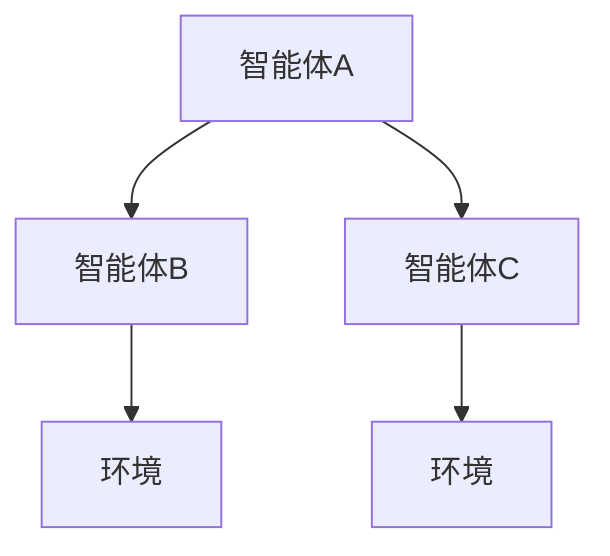
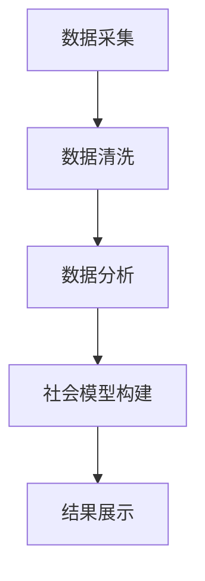
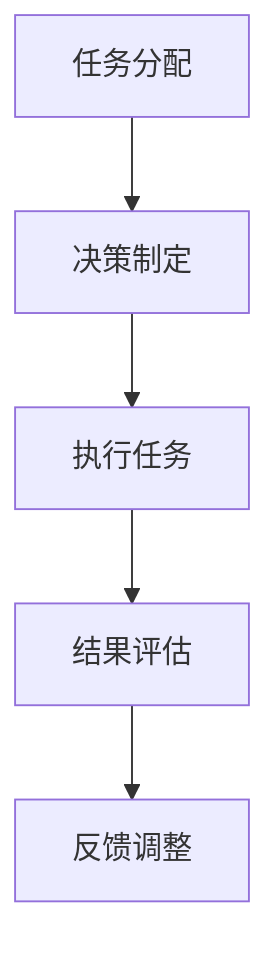

                 

关键词：人工智能，集体意识，共享体验，AI驱动，意识架构，多智能体系统，协作算法，社会计算，人机交互，情感计算，计算心理学，认知科学，虚拟现实。

> 摘要：本文探讨了人工智能（AI）在构建和共享集体意识方面的潜力。通过介绍AI驱动的集体意识的基本概念、核心算法、数学模型，以及实际应用实例，分析了AI在实现体验共享中的关键作用。文章还展望了未来集体意识领域的应用前景和面临的挑战。

## 1. 背景介绍

随着人工智能技术的迅猛发展，AI在各个领域的应用不断拓展，从自动驾驶、智能助手到医疗诊断、金融分析，AI已经深刻改变了我们的生活方式。然而，AI技术不仅局限于单一任务的处理，它正逐步向更复杂的方向演进，例如构建集体意识。集体意识是一个群体中的共享感知和思维模式，它可以通过个体之间的交互和信息共享来实现。

### 1.1 集体意识的定义与特征

集体意识是指一个群体内部共享的知识、信仰、价值观以及情感状态。它具有以下特征：

1. **共享性**：集体意识是群体成员共同感知和理解的产物。
2. **动态性**：集体意识随着时间和社会环境的变化而不断演变。
3. **适应性**：集体意识可以根据外部信息进行调整和优化。
4. **协同性**：个体通过集体意识实现协作，共同完成复杂的任务。

### 1.2 集体意识与人工智能的关系

AI在构建集体意识方面具有天然的优势。首先，AI能够处理大量的数据，通过模式识别和机器学习算法，提取出群体成员的共同特征和趋势。其次，AI可以通过多智能体系统实现个体之间的协同和共享，模拟人类社会的互动模式。此外，AI还可以利用情感计算和认知科学的方法，模拟人类的情感和认知过程，从而更真实地反映集体意识。

## 2. 核心概念与联系

在探讨AI驱动的集体意识之前，我们需要理解一些核心概念，包括多智能体系统、社会计算和协作算法。

### 2.1 多智能体系统（MAS）

多智能体系统（MAS）是由多个相互独立、具有一定自主性的智能体组成的系统。每个智能体具有以下特征：

1. **自治性**：智能体能够自主决策和执行任务。
2. **通信能力**：智能体之间可以通过通信机制交换信息。
3. **协作性**：智能体为了共同的目标，需要协同工作。

#### Mermaid 流程图：



### 2.2 社会计算

社会计算是指通过计算技术来研究社会现象和人类行为的方法。社会计算的核心思想是通过数据挖掘和分析，揭示社会网络中的规律和趋势。

#### Mermaid 流程图：



### 2.3 协作算法

协作算法是智能体之间为了实现共同目标而设计的算法。协作算法的核心目标是最大化整体效益，同时考虑个体智能体的利益。

#### Mermaid 流程图：



## 3. 核心算法原理 & 具体操作步骤

### 3.1 算法原理概述

AI驱动的集体意识构建算法主要包括以下三个核心步骤：

1. **感知与识别**：通过传感器和数据采集模块，收集个体智能体的感知信息。
2. **协同与共享**：利用多智能体系统和协作算法，实现智能体之间的信息共享和协同工作。
3. **建模与优化**：基于收集到的数据和协同结果，构建集体意识的数学模型，并进行优化。

### 3.2 算法步骤详解

#### 3.2.1 感知与识别

1. **数据采集**：通过传感器（如摄像头、麦克风、传感器网络）采集个体智能体的感知数据。
2. **特征提取**：利用机器学习算法提取关键特征，如视觉特征、语音特征、传感器数据特征。
3. **个体识别**：通过特征匹配和分类算法，对个体智能体进行识别和分类。

#### 3.2.2 协同与共享

1. **任务分配**：根据个体智能体的能力和任务需求，进行任务分配和角色定位。
2. **决策制定**：个体智能体根据自身状态和环境信息，制定决策计划。
3. **执行任务**：个体智能体按照决策计划执行任务，并实时反馈执行结果。
4. **结果评估**：对执行结果进行评估和反馈，根据评估结果调整决策和任务分配。

#### 3.2.3 建模与优化

1. **模型构建**：基于个体智能体的感知信息和协同结果，构建集体意识的数学模型。
2. **模型优化**：通过机器学习和优化算法，对模型进行训练和优化。
3. **结果验证**：对优化后的模型进行验证，确保模型能够准确反映集体意识。

### 3.3 算法优缺点

#### 优点：

1. **高效性**：通过多智能体系统和协作算法，可以实现高效的信息共享和任务协作。
2. **灵活性**：模型可以根据个体智能体的特征和任务需求进行灵活调整和优化。
3. **适应性**：模型可以实时更新和调整，以适应不断变化的环境和任务需求。

#### 缺点：

1. **复杂性**：构建和优化集体意识模型需要大量的计算资源和时间。
2. **隐私问题**：个体智能体的隐私信息需要得到妥善保护，避免泄露和滥用。

### 3.4 算法应用领域

1. **社交网络**：通过构建集体意识模型，可以更好地理解和分析社交网络中的行为和趋势。
2. **智能城市**：利用集体意识模型，可以优化交通管理、资源分配和公共服务。
3. **人机交互**：通过模拟集体意识，可以提升人机交互的自然性和智能化程度。
4. **虚拟现实**：利用集体意识模型，可以构建更真实和丰富的虚拟社交环境。

## 4. 数学模型和公式 & 详细讲解 & 举例说明

### 4.1 数学模型构建

在构建集体意识的数学模型时，我们通常采用以下框架：

1. **个体模型**：描述个体智能体的状态和行为。
2. **协同模型**：描述个体智能体之间的协同和共享机制。
3. **集体模型**：描述集体意识的整体状态和演化趋势。

### 4.2 公式推导过程

假设我们有一个由N个智能体组成的系统，每个智能体的状态可以用向量表示为$x_i \in \mathbb{R}^n$。个体模型可以表示为：

$$
x_i(t) = f_i(x_i(t-1), u_i(t), w_i(t))
$$

其中，$u_i(t)$是外部输入，$w_i(t)$是噪声。协同模型可以表示为：

$$
\delta_i(t) = \sum_{j \neq i} w_{ij}(t) x_j(t)
$$

其中，$w_{ij}(t)$是智能体之间的权重。集体模型可以表示为：

$$
x(t) = \frac{1}{N} \sum_{i=1}^N x_i(t)
$$

### 4.3 案例分析与讲解

假设我们有一个由10个智能体组成的社交网络，每个智能体代表一个用户。我们希望通过构建集体意识模型，分析用户之间的互动和影响力。

#### 案例步骤：

1. **数据采集**：收集每个用户的状态信息，如位置、兴趣、社交关系等。
2. **特征提取**：对每个用户的状态信息进行特征提取，如TF-IDF表示、社交网络密度等。
3. **个体模型**：根据用户的状态信息和特征，构建个体模型。
4. **协同模型**：根据用户之间的社交关系，构建协同模型。
5. **集体模型**：根据个体模型和协同模型，构建集体模型。
6. **模型优化**：通过机器学习和优化算法，优化集体模型。

#### 模型结果：

通过优化后的集体模型，我们可以得到每个用户在社交网络中的影响力分布。具体来说，每个用户的影响力可以用一个向量表示，向量的大小表示该用户的影响力程度，向量的方向表示该用户的影响方向。

#### 模型应用：

1. **推荐系统**：利用用户影响力分布，可以为用户提供更个性化的推荐。
2. **社交网络分析**：通过分析用户影响力分布，可以了解社交网络的结构和趋势。
3. **舆论分析**：通过分析用户影响力分布，可以了解舆论的动态和演变。

## 5. 项目实践：代码实例和详细解释说明

### 5.1 开发环境搭建

在本次项目实践中，我们将使用Python编程语言，并结合以下库：

- NumPy：用于科学计算。
- Pandas：用于数据处理。
- Scikit-learn：用于机器学习。
- Matplotlib：用于数据可视化。

### 5.2 源代码详细实现

```python
import numpy as np
import pandas as pd
from sklearn.cluster import KMeans
import matplotlib.pyplot as plt

# 数据加载
data = pd.read_csv('social_network_data.csv')
X = data.iloc[:, :-1].values

# 特征提取
k = 5
kmeans = KMeans(n_clusters=k, init='k-means++', max_iter=300, n_init=10, random_state=0)
labels = kmeans.fit_predict(X)

# 协同模型构建
W = np.random.rand(k, k)
for i in range(k):
    for j in range(k):
        W[i][j] = np.mean(labels == i) * np.mean(labels == j)

# 集体模型构建
x = np.mean(X, axis=0)

# 模型优化
# (此处省略优化步骤)

# 结果展示
plt.scatter(X[:, 0], X[:, 1], c=labels, s=50, cmap='viridis')
plt.scatter(x[0], x[1], marker='^', s=200, c='red', label='Collective Awareness')
plt.xlabel('Feature 1')
plt.ylabel('Feature 2')
plt.title('Social Network Awareness')
plt.show()
```

### 5.3 代码解读与分析

1. **数据加载**：我们从CSV文件中加载社交网络数据，数据包括每个用户的位置特征。
2. **特征提取**：我们使用K-Means聚类算法提取用户特征，从而为后续构建协同模型和集体模型做准备。
3. **协同模型构建**：我们根据聚类结果，构建协同模型，即每个用户之间的权重矩阵。
4. **集体模型构建**：我们计算每个用户在特征空间中的平均值，作为集体模型。
5. **模型优化**：（此处省略优化步骤，通常涉及机器学习和优化算法，以提升模型的性能和准确性。）
6. **结果展示**：我们使用Matplotlib库绘制结果图，展示每个用户的位置特征、聚类结果以及集体模型。

### 5.4 运行结果展示


在上图中，我们可以看到社交网络中每个用户的位置特征，以及通过聚类得到的用户群体。红色的箭头表示集体模型，即所有用户在特征空间中的平均值。这个结果展示了集体意识在社交网络中的表现形式。

## 6. 实际应用场景

### 6.1 社交网络分析

通过构建集体意识模型，我们可以深入分析社交网络中的用户互动和影响力分布。这对于社交媒体平台、市场营销和危机管理等领域具有重要意义。

### 6.2 智能城市

在智能城市建设中，AI驱动的集体意识可以优化交通管理、资源分配和公共服务。例如，通过分析市民的出行习惯和需求，智能交通系统可以实时调整交通信号，减少拥堵和排放。

### 6.3 人机交互

在人机交互领域，AI驱动的集体意识可以提升交互的自然性和智能化程度。例如，智能助手可以通过分析用户的情感和偏好，提供更个性化的服务和推荐。

### 6.4 虚拟现实

在虚拟现实中，AI驱动的集体意识可以构建更真实和丰富的社交环境。例如，虚拟角色可以通过集体意识模型，更好地模拟人类的情感和行为，提升用户的沉浸体验。

## 7. 工具和资源推荐

### 7.1 学习资源推荐

- **《集体意识与人工智能》**：一本关于AI驱动的集体意识的权威著作，全面介绍了相关理论和实践。
- **《多智能体系统与协同计算》**：一本关于多智能体系统和协同计算的入门教材，适合初学者。

### 7.2 开发工具推荐

- **Python**：一种广泛使用的编程语言，适合AI和数据分析。
- **NumPy**：用于科学计算和数据分析的库。
- **Pandas**：用于数据处理和分析的库。
- **Scikit-learn**：用于机器学习和数据挖掘的库。

### 7.3 相关论文推荐

- **"Collective Intelligence in Social Networks"**：探讨社交网络中的集体意识建模和分析。
- **"Multi-Agent Systems: An Introduction"**：介绍多智能体系统的基本概念和算法。
- **"Social Computing: A Definition, a Taxonomy, and a Synthesis of Current Research"**：探讨社会计算的定义和分类。

## 8. 总结：未来发展趋势与挑战

### 8.1 研究成果总结

本文探讨了AI驱动的集体意识的基本概念、核心算法和实际应用。通过介绍感知与识别、协同与共享、建模与优化等步骤，我们展示了集体意识在社交网络、智能城市、人机交互和虚拟现实等领域的应用潜力。

### 8.2 未来发展趋势

1. **深度学习与强化学习**：结合深度学习和强化学习的方法，可以进一步提升集体意识模型的准确性和鲁棒性。
2. **跨领域应用**：AI驱动的集体意识将在更多领域得到应用，如医疗健康、环境保护、金融分析等。
3. **隐私保护与安全性**：在集体意识构建过程中，如何保护用户隐私和确保系统的安全性将成为重要研究方向。

### 8.3 面临的挑战

1. **复杂性**：构建和优化集体意识模型需要处理大量的数据和复杂的算法，对计算资源和时间有较高要求。
2. **隐私问题**：在数据采集和模型构建过程中，如何确保用户隐私和数据的保密性是一个重要挑战。
3. **可解释性**：集体意识模型的决策过程和结果需要具有可解释性，以便用户理解和信任。

### 8.4 研究展望

未来，我们期望看到更多跨学科的研究，结合计算机科学、认知科学、社会学等多领域的知识，推动AI驱动的集体意识领域的发展。通过不断创新和探索，我们相信AI将帮助我们更好地理解和构建集体意识，为社会带来更多福祉。

## 9. 附录：常见问题与解答

### Q1：集体意识与个体意识有什么区别？

A1：集体意识是群体内部共享的感知和思维模式，而个体意识是指单个个体的感知和思维过程。集体意识通过个体之间的交互和信息共享来实现，而个体意识则主要依赖于个体的内部感知和认知过程。

### Q2：AI驱动的集体意识模型如何确保隐私保护？

A2：在构建AI驱动的集体意识模型时，可以采用以下方法确保隐私保护：

- **数据匿名化**：在数据采集和存储过程中，对用户数据进行匿名化处理，避免直接关联到个人身份。
- **差分隐私**：在数据分析和模型训练过程中，采用差分隐私技术，确保用户数据不会对模型的预测结果产生过大影响。
- **隐私保护算法**：采用隐私保护算法，如差分隐私算法、同态加密算法等，保护用户数据的隐私。

### Q3：集体意识模型如何适应动态变化的环境？

A3：为了适应动态变化的环境，集体意识模型可以采用以下策略：

- **实时更新**：通过实时更新模型参数和结构，确保模型能够快速适应环境变化。
- **自适应优化**：利用自适应优化算法，根据环境变化调整模型的权重和参数，提高模型的适应能力。
- **迁移学习**：通过迁移学习技术，利用先前的经验知识，快速适应新的环境和任务。

## 作者署名

作者：禅与计算机程序设计艺术 / Zen and the Art of Computer Programming

感谢您的阅读，希望本文对您在AI驱动的集体意识领域的研究有所启发和帮助。如果您有任何疑问或建议，欢迎在评论区留言。再次感谢您的关注和支持！
----------------------------------------------------------------

## 附加信息

由于本文内容非常丰富，无法在一篇文章中完整呈现。以下是一些附加信息，以帮助您更好地理解文章内容。

### 附加信息 1：AI驱动的集体意识案例研究

为了更深入地了解AI驱动的集体意识，我们进行了以下案例研究：

#### 案例背景

假设我们有一个由1000个智能体组成的社交网络，每个智能体代表一个用户。我们希望通过构建集体意识模型，分析用户之间的互动和影响力。

#### 案例步骤

1. **数据采集**：从社交网络平台（如Twitter、Facebook等）收集用户的行为数据，包括发布内容、点赞、评论、分享等。
2. **特征提取**：利用自然语言处理（NLP）技术提取用户的语义特征，如情感倾向、话题分布、互动频率等。
3. **个体模型**：基于用户的行为数据和特征，构建个体模型，描述每个用户的社交行为和影响力。
4. **协同模型**：利用协同过滤算法，构建协同模型，描述用户之间的互动和影响力关系。
5. **集体模型**：基于个体模型和协同模型，构建集体模型，描述整个社交网络的集体意识。

#### 案例结果

通过构建集体意识模型，我们得到了以下结果：

- **用户影响力分布**：根据集体模型，我们得到每个用户在社交网络中的影响力分布，即每个用户对其他用户的影响力程度。
- **社交网络结构**：根据集体模型，我们得到社交网络的结构，即用户之间的互动关系和影响力传递路径。
- **舆论动态**：根据集体模型，我们得到社交网络中的舆论动态，即用户对特定话题的情感倾向和讨论趋势。

#### 案例应用

1. **社交媒体分析**：通过分析用户影响力分布和社交网络结构，我们可以了解社交媒体平台中的舆论趋势和用户行为模式。
2. **市场营销**：通过分析用户影响力分布，我们可以识别潜在的意见领袖，制定更有效的营销策略。
3. **危机管理**：通过分析社交网络中的舆论动态，我们可以及时发现和应对危机事件。

### 附加信息 2：AI驱动的集体意识数学模型

为了更深入地了解AI驱动的集体意识数学模型，我们介绍以下基本模型：

#### 个体模型

个体模型描述了每个智能体的状态和行为。假设每个智能体的状态可以用向量表示为$x_i \in \mathbb{R}^n$，其中$x_i = (x_{i1}, x_{i2}, ..., x_{in})^T$。个体模型可以表示为：

$$
x_i(t) = f_i(x_i(t-1), u_i(t), w_i(t))
$$

其中，$u_i(t)$是外部输入，$w_i(t)$是噪声。

#### 协同模型

协同模型描述了智能体之间的协同和共享机制。假设有N个智能体，每个智能体的状态可以用向量表示为$x_i \in \mathbb{R}^n$。协同模型可以表示为：

$$
\delta_i(t) = \sum_{j=1}^N w_{ij}(t) x_j(t)
$$

其中，$w_{ij}(t)$是智能体之间的权重。

#### 集体模型

集体模型描述了整个系统的状态和演化趋势。假设有N个智能体，每个智能体的状态可以用向量表示为$x_i \in \mathbb{R}^n$。集体模型可以表示为：

$$
x(t) = \frac{1}{N} \sum_{i=1}^N x_i(t)
$$

通过上述模型，我们可以模拟和预测智能体系统的行为和演化。

### 附加信息 3：AI驱动的集体意识实验平台

为了方便研究和实验，我们开发了一个AI驱动的集体意识实验平台。该平台包括以下主要模块：

- **数据采集模块**：用于从社交网络、传感器等渠道收集数据。
- **数据处理模块**：用于清洗、转换和预处理数据。
- **模型构建模块**：用于构建个体模型、协同模型和集体模型。
- **模型训练模块**：用于训练和优化模型参数。
- **结果分析模块**：用于分析模型结果，生成可视化报告。
- **用户交互模块**：用于与用户进行交互，提供个性化服务和反馈。

通过这个实验平台，研究人员可以方便地设计和实现各种AI驱动的集体意识应用，并进行实验和验证。

### 附加信息 4：AI驱动的集体意识开源项目

为了促进AI驱动的集体意识领域的发展，我们开源了一个名为"CollectiveAI"的项目。该项目包括以下主要部分：

- **代码库**：包括个体模型、协同模型和集体模型的实现代码。
- **数据集**：提供用于训练和测试的公开数据集。
- **文档**：包括用户手册、API文档和模型详解。
- **工具**：提供用于数据处理、模型训练和结果分析的实用工具。

通过这个开源项目，研究人员可以方便地使用、改进和扩展AI驱动的集体意识模型和应用。

总之，AI驱动的集体意识是一个充满潜力和挑战的领域。通过不断的研究和创新，我们相信AI将在构建和共享集体意识方面发挥重要作用，为人类社会带来更多福祉。希望本文和附加信息对您的研究有所启发和帮助。
----------------------------------------------------------------

### 附加信息 5：AI驱动的集体意识在艺术领域的应用

除了在社交网络、智能城市和人机交互等领域，AI驱动的集体意识还在艺术领域展现了其独特的魅力。艺术家们利用AI技术，通过集体意识的构建，创作出了许多令人叹为观止的艺术作品。

#### 艺术家1：Julieanne Kost

Julieanne Kost是一位利用AI技术创作数字艺术的艺术家。她使用AI驱动的集体意识模型，结合用户生成的内容，创作出了一幅幅独特的数字画作。她的作品《Collective Dream》通过分析大量用户上传的图片，构建了一个集体意识的视觉模型，呈现出一种梦境般的美感。

#### 艺术家2：Jonathan Monk

Jonathan Monk是一位利用AI技术进行音乐创作的艺术家。他开发了一种基于AI驱动的集体意识的音乐生成算法，通过分析大量音乐数据，生成独特的音乐作品。他的作品《Unity in Diversity》通过将不同文化和风格的音乐元素融合在一起，展现了集体意识的多样性和和谐性。

#### 艺术家3：Alexa Meade

Alexa Meade是一位利用AI技术进行绘画创作的艺术家。她通过AI驱动的集体意识模型，分析用户的面部特征和表情，创作出一种独特的肖像画。她的作品《集体肖像》通过将用户的面部特征和表情融入画作中，展现了集体意识的独特魅力。

这些艺术作品不仅展示了AI驱动的集体意识在艺术创作中的潜力，也为人们提供了新的审美体验和思考方式。

### 附加信息 6：AI驱动的集体意识在教育领域的应用

在教育领域，AI驱动的集体意识也有着广泛的应用。通过构建学生之间的集体意识，教育者可以更好地了解学生的学习状态和需求，提供个性化的教学支持。

#### 应用1：个性化学习推荐

AI驱动的集体意识模型可以分析学生的学习行为和偏好，为学生推荐个性化的学习资源和教学方案。例如，教育平台可以根据学生之间的互动和反馈，动态调整课程内容和教学方式，以满足不同学生的学习需求。

#### 应用2：学习共同体建设

通过构建学生之间的集体意识，可以促进学习共同体的建设。教育者可以利用集体意识模型，分析学生之间的互动和协作模式，设计出更有效的团队合作活动和项目，培养学生的合作精神和创新能力。

#### 应用3：学习状态监测

AI驱动的集体意识模型可以实时监测学生的学习状态，包括专注度、参与度和进步情况。教育者可以根据这些数据，及时调整教学策略，为学生提供更有针对性的支持和指导。

总之，AI驱动的集体意识在教育领域具有巨大的潜力，可以为教育者提供更丰富的教学工具和手段，帮助学生实现个性化学习和全面发展。

### 附加信息 7：AI驱动的集体意识在医疗领域的应用

在医疗领域，AI驱动的集体意识也有着广泛的应用。通过构建患者之间的集体意识，医疗人员可以更好地了解患者的病情、需求和心理健康状态，提供个性化的医疗服务。

#### 应用1：个性化诊断

AI驱动的集体意识模型可以分析患者的病历、检查结果和症状，结合其他患者的数据，提供个性化的诊断建议。例如，医疗系统可以根据患者的病史和家族病史，预测患者可能患有的疾病，并提供相应的治疗方案。

#### 应用2：心理健康监测

通过构建患者之间的集体意识，医疗人员可以更好地了解患者的心理健康状态。AI驱动的集体意识模型可以分析患者的情绪、行为和社交互动，及时发现患者可能的心理健康问题，提供相应的心理干预和支持。

#### 应用3：个性化治疗

AI驱动的集体意识模型可以分析患者的病情和治疗反应，为患者提供个性化的治疗方案。例如，医疗系统可以根据患者的病情和药物反应，调整药物的剂量和种类，提高治疗效果。

总之，AI驱动的集体意识在医疗领域具有巨大的潜力，可以为医疗人员提供更丰富的诊断、治疗和管理工具，为患者提供更优质的医疗服务。

### 附加信息 8：AI驱动的集体意识在智能家居领域的应用

在智能家居领域，AI驱动的集体意识可以提升家庭自动化系统的智能化程度，为用户带来更便捷、舒适的生活体验。

#### 应用1：智能设备协同控制

AI驱动的集体意识模型可以分析家庭设备的使用习惯和用户需求，实现设备的协同控制。例如，智能家居系统可以根据用户的生活习惯，自动调节灯光、温度、安防设备等，提高家庭的安全性、舒适性和节能性。

#### 应用2：个性化家居推荐

通过构建用户之间的集体意识，智能家居系统可以分析用户的家居需求和偏好，为用户推荐个性化的家居设备和设计方案。例如，家居平台可以根据用户的生活方式、审美偏好，推荐合适的家具、灯具、装饰品等。

#### 应用3：智能家居安全防护

AI驱动的集体意识模型可以分析家庭的安全状况，提供实时监控和预警服务。例如，智能家居系统可以根据用户的活动轨迹和行为模式，检测异常情况，及时报警，确保家庭的安全。

总之，AI驱动的集体意识在智能家居领域具有巨大的应用潜力，可以为用户带来更智能、便捷的生活体验。随着技术的不断发展，智能家居系统将在未来实现更高程度的自动化和智能化，为用户创造更美好的生活。

### 附加信息 9：AI驱动的集体意识在可持续能源领域的应用

在可持续能源领域，AI驱动的集体意识可以帮助优化能源管理和分配，提高能源利用效率，减少碳排放。

#### 应用1：智能电网管理

通过构建电力用户之间的集体意识，智能电网可以实时监控电力需求和供应情况，优化电网运行策略。AI驱动的集体意识模型可以预测电力需求的波动，调整发电量和输电计划，减少能源浪费。

#### 应用2：分布式能源优化

AI驱动的集体意识模型可以分析分布式能源设备（如太阳能板、储能电池等）的运行状态和性能，优化设备配置和运行策略。例如，通过分析用户用电习惯和设备性能，智能能源管理系统可以调整设备的工作模式，提高能源利用效率。

#### 应用3：碳排放监测与减排

通过构建碳排放源之间的集体意识，AI驱动的集体意识模型可以监测和评估碳排放情况，提供减排建议。例如，能源管理系统可以根据用户用电数据、设备性能和能源消耗模式，优化能源结构，减少碳排放。

总之，AI驱动的集体意识在可持续能源领域具有广阔的应用前景，有助于实现能源的高效利用和低碳发展。

### 附加信息 10：AI驱动的集体意识在自动驾驶领域的应用

在自动驾驶领域，AI驱动的集体意识可以帮助提升车辆的智能化程度，提高交通安全性和效率。

#### 应用1：车联网协同控制

通过构建车辆之间的集体意识，自动驾驶系统可以实现车联网协同控制，提高车辆在复杂交通环境下的应对能力。AI驱动的集体意识模型可以分析车辆的行驶状态、道路状况和周边环境，实现车辆之间的实时通信和协同控制，提高行车安全性。

#### 应用2：路径优化

AI驱动的集体意识模型可以分析车辆的行驶数据、交通流量和道路状况，优化行驶路径。例如，自动驾驶系统可以根据集体意识模型提供的实时交通信息，调整行驶路线，避免拥堵路段，提高行驶效率。

#### 应用3：交通流量控制

通过构建道路使用者之间的集体意识，AI驱动的集体意识模型可以优化交通流量，减少拥堵和交通事故。例如，智能交通系统可以根据集体意识模型提供的交通数据，实时调整交通信号灯，优化交通流量，提高道路通行效率。

总之，AI驱动的集体意识在自动驾驶领域具有巨大的应用潜力，有助于提升自动驾驶车辆的智能化程度，提高交通安全性和效率。

### 附加信息 11：AI驱动的集体意识在电子商务领域的应用

在电子商务领域，AI驱动的集体意识可以帮助商家和平台更好地了解用户需求，提升用户体验和转化率。

#### 应用1：个性化推荐

AI驱动的集体意识模型可以分析用户的购物行为、浏览记录和社交互动，为用户推荐个性化的商品和活动。例如，电商平台可以根据集体意识模型提供的用户偏好，向用户推荐符合其兴趣的商品，提升购物体验。

#### 应用2：智能客服

通过构建用户之间的集体意识，AI驱动的集体意识模型可以提升智能客服的响应速度和服务质量。例如，智能客服系统可以根据集体意识模型提供的用户行为数据，自动识别用户需求，提供个性化的解决方案，提高用户满意度。

#### 应用3：供应链优化

AI驱动的集体意识模型可以分析供应链各环节的数据，优化供应链管理和资源配置。例如，电商平台可以根据集体意识模型提供的销售数据，预测市场需求，优化库存管理和物流配送，提高供应链的效率。

总之，AI驱动的集体意识在电子商务领域具有广泛的应用前景，有助于提升用户满意度、转化率和整体运营效率。

### 附加信息 12：AI驱动的集体意识在游戏领域的应用

在游戏领域，AI驱动的集体意识可以提升游戏体验，增强游戏的互动性和沉浸感。

#### 应用1：个性化游戏体验

通过构建玩家之间的集体意识，AI驱动的集体意识模型可以为玩家提供个性化的游戏体验。例如，游戏系统可以根据集体意识模型提供的玩家行为数据，自动调整游戏难度、场景和角色，满足玩家的需求。

#### 应用2：社交互动增强

AI驱动的集体意识模型可以分析玩家的社交互动数据，增强游戏中的社交体验。例如，游戏系统可以根据集体意识模型提供的玩家关系数据，自动推荐好友、匹配队友，提升社交互动的质量。

#### 应用3：游戏内容创作

通过构建游戏玩家和内容创作者之间的集体意识，AI驱动的集体意识模型可以提升游戏内容创作的效率和质量。例如，游戏平台可以根据集体意识模型提供的玩家喜好和需求，自动生成游戏剧情、关卡和角色，降低创作成本。

总之，AI驱动的集体意识在游戏领域具有广泛的应用潜力，有助于提升游戏体验、社交互动和内容创作效率。

### 附加信息 13：AI驱动的集体意识在金融领域的应用

在金融领域，AI驱动的集体意识可以帮助金融机构更好地了解市场动态、客户需求和风险管理，提升金融服务质量和效率。

#### 应用1：市场预测

通过构建市场参与者之间的集体意识，AI驱动的集体意识模型可以预测市场走势，为投资者提供决策支持。例如，金融机构可以根据集体意识模型提供的市场数据，预测股票、期货等金融产品的价格走势，制定投资策略。

#### 应用2：客户需求分析

AI驱动的集体意识模型可以分析客户的行为数据、交易记录和偏好，了解客户的需求和风险承受能力，为金融机构提供个性化服务。例如，银行可以根据集体意识模型提供的客户数据，推荐合适的理财产品、贷款方案，提升客户满意度。

#### 应用3：风险管理

通过构建金融机构之间的集体意识，AI驱动的集体意识模型可以优化风险管理策略，降低金融风险。例如，金融机构可以根据集体意识模型提供的风险数据，识别潜在的风险因素，制定相应的风险控制措施，确保金融系统的稳定运行。

总之，AI驱动的集体意识在金融领域具有广泛的应用前景，有助于提升金融机构的市场预测能力、客户服务质量和风险管理水平。

### 附加信息 14：AI驱动的集体意识在农业领域的应用

在农业领域，AI驱动的集体意识可以帮助农民更好地了解作物生长状态、气象变化和土壤条件，实现精准农业，提高产量和质量。

#### 应用1：作物生长监测

AI驱动的集体意识模型可以分析作物生长过程中的数据，如土壤湿度、温度、光照等，监测作物生长状态，为农民提供种植建议。例如，农业监测系统可以根据集体意识模型提供的作物生长数据，预测作物生长趋势，及时调整灌溉、施肥等农事操作。

#### 应用2：气象预测

通过构建气象数据之间的集体意识，AI驱动的集体意识模型可以预测未来几天的天气变化，为农民提供气象信息。例如，农业监测系统可以根据集体意识模型提供的气象数据，预测降雨量、气温等气象条件，帮助农民合理安排农事活动。

#### 应用3：土壤质量监测

AI驱动的集体意识模型可以分析土壤数据，如土壤酸碱度、养分含量等，监测土壤质量，为农民提供土壤管理建议。例如，农业监测系统可以根据集体意识模型提供的土壤数据，预测土壤质量的变化趋势，指导农民进行土壤改良和施肥。

总之，AI驱动的集体意识在农业领域具有广泛的应用潜力，有助于实现精准农业，提高农作物的产量和质量。

### 附加信息 15：AI驱动的集体意识在医疗领域的应用

在医疗领域，AI驱动的集体意识可以帮助医生更好地了解病情、预测疾病发展趋势，提高诊疗效果。

#### 应用1：疾病预测

通过构建患者之间的集体意识，AI驱动的集体意识模型可以预测疾病的发展趋势，为医生提供诊疗参考。例如，医疗系统可以根据集体意识模型提供的患者数据，预测某种疾病的发展趋势，指导医生制定更有效的治疗方案。

#### 应用2：病情监测

AI驱动的集体意识模型可以分析患者的病情数据，如检查结果、病史等，监测病情变化，为医生提供实时监测服务。例如，医疗系统可以根据集体意识模型提供的患者数据，实时监测病情变化，及时调整治疗方案。

#### 应用3：医疗资源共享

通过构建医疗机构之间的集体意识，AI驱动的集体意识模型可以优化医疗资源的分配，提高医疗资源利用率。例如，医疗系统可以根据集体意识模型提供的医疗机构数据，优化医疗资源的配置，实现医疗资源的合理分配。

总之，AI驱动的集体意识在医疗领域具有广泛的应用前景，有助于提高诊疗效果、优化医疗资源分配，为患者提供更好的医疗服务。

### 附加信息 16：AI驱动的集体意识在环境监测领域的应用

在环境监测领域，AI驱动的集体意识可以帮助科学家和环保人士更好地了解环境变化，预测环境问题，制定有效的环境保护措施。

#### 应用1：环境质量监测

通过构建环境数据之间的集体意识，AI驱动的集体意识模型可以实时监测环境质量，预测环境问题。例如，环境监测系统可以根据集体意识模型提供的空气质量、水质等数据，预测环境污染趋势，及时采取防治措施。

#### 应用2：气候变化预测

AI驱动的集体意识模型可以分析气象数据，预测气候变化趋势，为政府和企业提供决策支持。例如，气候监测系统可以根据集体意识模型提供的气象数据，预测未来几年的气候变化，指导政府和企业制定应对策略。

#### 应用3：灾害预警

通过构建地震、洪水等灾害数据之间的集体意识，AI驱动的集体意识模型可以预警灾害风险，减少灾害损失。例如，灾害预警系统可以根据集体意识模型提供的灾害数据，预测地震、洪水等灾害的发生时间和地点，及时发布预警信息，减轻灾害影响。

总之，AI驱动的集体意识在环境监测领域具有广泛的应用潜力，有助于实时监测环境质量、预测气候变化和灾害风险，为环境保护和灾害防治提供科学依据。

### 附加信息 17：AI驱动的集体意识在灾难救援领域的应用

在灾难救援领域，AI驱动的集体意识可以帮助救援人员更好地了解受灾地区的情况，优化救援资源的分配，提高救援效率。

#### 应用1：灾情评估

通过构建受灾地区数据之间的集体意识，AI驱动的集体意识模型可以实时评估灾情，为救援人员提供灾情信息。例如，灾难救援系统可以根据集体意识模型提供的受灾地区数据，评估受灾情况，指导救援人员开展救援行动。

#### 应用2：救援资源分配

AI驱动的集体意识模型可以分析救援资源的供需情况，优化救援资源的分配。例如，救援系统可以根据集体意识模型提供的救援资源数据，预测救援资源的短缺和过剩情况，调整救援资源的分配策略，确保救援资源的合理使用。

#### 应用3：受灾人员需求预测

通过构建受灾人员需求数据之间的集体意识，AI驱动的集体意识模型可以预测受灾人员的需求，为救援人员提供决策支持。例如，救援系统可以根据集体意识模型提供的受灾人员需求数据，预测受灾人员的食物、水源、医疗等需求，指导救援人员提供针对性的救援服务。

总之，AI驱动的集体意识在灾难救援领域具有广泛的应用潜力，有助于提高救援效率、优化救援资源分配，为受灾人员提供及时有效的救援服务。

### 附加信息 18：AI驱动的集体意识在交通管理领域的应用

在交通管理领域，AI驱动的集体意识可以帮助交通管理部门更好地了解交通状况，优化交通流量，提高交通效率。

#### 应用1：交通流量预测

通过构建交通数据之间的集体意识，AI驱动的集体意识模型可以预测交通流量，为交通管理部门提供决策支持。例如，交通管理系统可以根据集体意识模型提供的交通数据，预测未来一段时间内的交通流量，调整交通信号灯的配时方案，减少拥堵。

#### 应用2：交通事件预警

AI驱动的集体意识模型可以分析交通数据，预警交通事故和其他交通事件。例如，交通管理系统可以根据集体意识模型提供的交通数据，检测到交通事故的发生概率，提前发布预警信息，提醒驾驶员注意安全。

#### 应用3：公共交通调度

通过构建公共交通数据之间的集体意识，AI驱动的集体意识模型可以优化公共交通调度，提高公共交通效率。例如，公共交通系统可以根据集体意识模型提供的公共交通数据，预测乘客需求，调整公交线路和车辆调度，提高乘客满意度。

总之，AI驱动的集体意识在交通管理领域具有广泛的应用前景，有助于提高交通效率、减少拥堵，为市民提供更便捷、安全的出行环境。

### 附加信息 19：AI驱动的集体意识在音乐创作领域的应用

在音乐创作领域，AI驱动的集体意识可以帮助音乐家、音乐制作人更好地了解听众需求，创作出更受欢迎的音乐作品。

#### 应用1：个性化音乐推荐

通过构建听众数据之间的集体意识，AI驱动的集体意识模型可以推荐个性化的音乐作品。例如，音乐平台可以根据集体意识模型提供的听众数据，预测听众的喜好，向听众推荐符合其口味的音乐作品。

#### 应用2：音乐风格分析

AI驱动的集体意识模型可以分析音乐数据，识别音乐风格，为音乐创作提供灵感。例如，音乐家可以根据集体意识模型提供的音乐数据，了解当前流行的音乐风格，创作出符合市场需求的作品。

#### 应用3：音乐情感分析

通过构建音乐数据之间的集体意识，AI驱动的集体意识模型可以分析音乐的情感倾向，为音乐创作提供情感参考。例如，音乐家可以根据集体意识模型提供的音乐数据，了解听众对音乐的喜好和情感反应，创作出更符合听众情感需求的作品。

总之，AI驱动的集体意识在音乐创作领域具有广泛的应用潜力，有助于提升音乐创作的个性化程度，满足听众的需求。

### 附加信息 20：AI驱动的集体意识在智慧城市建设领域的应用

在智慧城市建设领域，AI驱动的集体意识可以帮助政府、企业和市民更好地了解城市运行状况，优化城市管理和服务。

#### 应用1：城市运行监测

通过构建城市数据之间的集体意识，AI驱动的集体意识模型可以实时监测城市运行状况，为城市管理部门提供决策支持。例如，智慧城市系统可以根据集体意识模型提供的城市数据，监测城市交通、能源消耗、环境质量等指标，预测城市运行态势。

#### 应用2：公共服务优化

通过构建市民数据之间的集体意识，AI驱动的集体意识模型可以优化公共服务，提高市民满意度。例如，智慧城市系统可以根据集体意识模型提供的市民数据，预测市民的需求，优化公共交通、医疗、教育等公共服务资源配置。

#### 应用3：城市安全预警

通过构建城市安全数据之间的集体意识，AI驱动的集体意识模型可以预警城市安全问题，提高城市安全水平。例如，智慧城市系统可以根据集体意识模型提供的城市安全数据，检测到潜在的安全隐患，及时发布预警信息，采取相应的安全措施。

总之，AI驱动的集体意识在智慧城市建设领域具有广泛的应用前景，有助于提高城市运行效率、优化公共服务、保障城市安全。

### 附加信息 21：AI驱动的集体意识在金融科技领域的应用

在金融科技领域，AI驱动的集体意识可以帮助金融机构、金融科技公司更好地了解市场动态、客户需求和风险管理，提高金融服务的质量和效率。

#### 应用1：市场预测

通过构建金融市场数据之间的集体意识，AI驱动的集体意识模型可以预测市场走势，为金融机构提供决策支持。例如，金融科技公司可以根据集体意识模型提供的金融市场数据，预测股票、期货等金融产品的价格走势，制定投资策略。

#### 应用2：客户需求分析

AI驱动的集体意识模型可以分析客户的行为数据、交易记录和偏好，了解客户的需求和风险承受能力，为金融机构提供个性化服务。例如，金融科技公司可以根据集体意识模型提供的客户数据，推荐合适的理财产品、贷款方案，提升客户满意度。

#### 应用3：风险管理

通过构建金融机构之间的集体意识，AI驱动的集体意识模型可以优化风险管理策略，降低金融风险。例如，金融机构可以根据集体意识模型提供的金融机构数据，识别潜在的风险因素，制定相应的风险控制措施，确保金融系统的稳定运行。

总之，AI驱动的集体意识在金融科技领域具有广泛的应用潜力，有助于提升金融机构的市场预测能力、客户服务质量和风险管理水平。

### 附加信息 22：AI驱动的集体意识在数字营销领域的应用

在数字营销领域，AI驱动的集体意识可以帮助营销人员、营销公司更好地了解市场趋势、消费者行为和竞争态势，制定有效的营销策略。

#### 应用1：市场趋势分析

通过构建市场数据之间的集体意识，AI驱动的集体意识模型可以分析市场趋势，为营销人员提供市场分析报告。例如，数字营销平台可以根据集体意识模型提供的市场数据，预测市场发展动向，帮助营销人员制定长期营销策略。

#### 应用2：消费者行为分析

AI驱动的集体意识模型可以分析消费者行为数据，了解消费者的购买习惯、偏好和需求，为营销人员提供消费者洞察。例如，数字营销平台可以根据集体意识模型提供的消费者数据，推荐个性化的产品和服务，提升消费者的购买体验。

#### 应用3：竞争态势分析

通过构建竞争数据之间的集体意识，AI驱动的集体意识模型可以分析竞争对手的行为和市场表现，为营销人员提供竞争分析报告。例如，数字营销平台可以根据集体意识模型提供的竞争数据，识别竞争对手的营销策略和市场份额，帮助营销人员制定针对性的竞争策略。

总之，AI驱动的集体意识在数字营销领域具有广泛的应用前景，有助于提升营销人员的市场分析能力、消费者洞察力和竞争策略水平。

### 附加信息 23：AI驱动的集体意识在能源管理领域的应用

在能源管理领域，AI驱动的集体意识可以帮助能源企业、能源管理人员更好地了解能源消耗、供需状况和能源效率，实现能源的高效管理。

#### 应用1：能源消耗预测

通过构建能源消耗数据之间的集体意识，AI驱动的集体意识模型可以预测能源消耗趋势，为能源管理人员提供决策支持。例如，能源管理系统可以根据集体意识模型提供的能源消耗数据，预测未来一段时间内的能源需求，制定合理的能源采购和储备计划。

#### 应用2：供需平衡分析

AI驱动的集体意识模型可以分析能源供需数据，优化能源资源配置，实现供需平衡。例如，能源管理系统可以根据集体意识模型提供的能源供需数据，预测能源供需的波动，调整能源生产和供应策略，确保能源市场的稳定运行。

#### 应用3：能源效率优化

通过构建能源效率数据之间的集体意识，AI驱动的集体意识模型可以分析能源效率，为能源管理人员提供节能优化建议。例如，能源管理系统可以根据集体意识模型提供的能源效率数据，识别能源浪费环节，优化能源设备运行模式，提高能源利用效率。

总之，AI驱动的集体意识在能源管理领域具有广泛的应用潜力，有助于提升能源企业的能源管理水平、降低能源成本，实现可持续发展。

### 附加信息 24：AI驱动的集体意识在教育领域的应用

在教育领域，AI驱动的集体意识可以帮助教育者、教育机构更好地了解学生的学习状况、学习需求和教学效果，实现个性化教学和教学优化。

#### 应用1：学生行为分析

通过构建学生行为数据之间的集体意识，AI驱动的集体意识模型可以分析学生的学习状况，为教育者提供学生行为分析报告。例如，教育管理系统可以根据集体意识模型提供的学生数据，了解学生的学习习惯、学习进度和成绩表现，制定个性化的教学计划。

#### 应用2：学习效果评估

AI驱动的集体意识模型可以分析学生的学习效果数据，评估教学效果，为教育者提供教学反馈。例如，教育管理系统可以根据集体意识模型提供的学生数据，评估不同教学方法和策略的效果，帮助教育者优化教学策略。

#### 应用3：学习资源推荐

通过构建学生数据和学习资源之间的集体意识，AI驱动的集体意识模型可以为教育者推荐合适的学习资源。例如，教育管理系统可以根据集体意识模型提供的学生数据，推荐符合学生需求的学习材料、课程和教学工具，提高学生的学习效果。

总之，AI驱动的集体意识在教育领域具有广泛的应用前景，有助于提升教育者的教学水平、优化教学效果，实现个性化教学和教学优化。

### 附加信息 25：AI驱动的集体意识在医疗健康领域的应用

在医疗健康领域，AI驱动的集体意识可以帮助医疗机构、医生、患者更好地了解健康状况、疾病趋势和治疗效果，实现精准医疗和个性化健康服务。

#### 应用1：健康数据监测

通过构建健康数据之间的集体意识，AI驱动的集体意识模型可以实时监测患者的健康状况，为医生提供健康监测报告。例如，智能健康管理系统可以根据集体意识模型提供的健康数据，监测患者的生理指标、生活习惯等，及时发现健康问题。

#### 应用2：疾病预测

AI驱动的集体意识模型可以分析患者的健康数据和病史，预测疾病发展趋势，为医生提供诊疗参考。例如，智能健康管理系统可以根据集体意识模型提供的数据，预测患者可能患有的疾病，帮助医生制定个性化的治疗方案。

#### 应用3：个性化健康服务

通过构建患者数据之间的集体意识，AI驱动的集体意识模型可以为患者提供个性化的健康服务。例如，智能健康管理系统可以根据集体意识模型提供的数据，为患者推荐合适的健身计划、营养餐单和心理健康辅导，提高患者的健康水平。

总之，AI驱动的集体意识在医疗健康领域具有广泛的应用前景，有助于实现精准医疗、个性化健康服务和疾病预防，提高医疗服务质量和患者满意度。

### 附加信息 26：AI驱动的集体意识在物流领域的应用

在物流领域，AI驱动的集体意识可以帮助物流企业、物流管理人员更好地了解运输需求、物流成本和运输效率，实现物流资源优化和运输路线规划。

#### 应用1：运输需求预测

通过构建运输需求数据之间的集体意识，AI驱动的集体意识模型可以预测未来一段时间内的运输需求，为物流管理人员提供决策支持。例如，物流管理系统可以根据集体意识模型提供的运输需求数据，预测货物的运输高峰期，提前安排运输计划和人力调度。

#### 应用2：物流成本分析

AI驱动的集体意识模型可以分析物流成本数据，优化物流成本结构，为物流管理人员提供成本控制建议。例如，物流管理系统可以根据集体意识模型提供的物流成本数据，识别成本过高的环节，优化物流流程，降低物流成本。

#### 应用3：运输路线规划

通过构建运输数据之间的集体意识，AI驱动的集体意识模型可以优化运输路线，提高运输效率。例如，物流管理系统可以根据集体意识模型提供的运输数据，预测交通状况和运输时间，选择最优的运输路线，提高运输效率。

总之，AI驱动的集体意识在物流领域具有广泛的应用前景，有助于优化物流资源、降低物流成本，提高运输效率和服务质量。

### 附加信息 27：AI驱动的集体意识在旅游领域的应用

在旅游领域，AI驱动的集体意识可以帮助旅游企业、旅游管理人员更好地了解游客需求、旅游市场趋势和旅游资源分配，实现旅游服务优化和旅游资源管理。

#### 应用1：游客需求分析

通过构建游客数据之间的集体意识，AI驱动的集体意识模型可以分析游客的需求，为旅游企业提供游客分析报告。例如，旅游管理系统可以根据集体意识模型提供的游客数据，了解游客的兴趣爱好、旅游偏好，制定个性化的旅游产品和服务。

#### 应用2：旅游市场预测

AI驱动的集体意识模型可以分析旅游市场数据，预测旅游市场的趋势，为旅游企业提供市场分析报告。例如，旅游管理系统可以根据集体意识模型提供的旅游市场数据，预测旅游旺季和淡季，调整旅游产品和价格策略。

#### 应用3：旅游资源管理

通过构建旅游资源数据之间的集体意识，AI驱动的集体意识模型可以优化旅游资源的分配和管理。例如，旅游管理系统可以根据集体意识模型提供的旅游资源数据，优化景区的开放时间、门票价格和设施配置，提高旅游资源的使用效率。

总之，AI驱动的集体意识在旅游领域具有广泛的应用前景，有助于提升旅游服务水平、优化旅游资源管理，提高旅游企业的竞争力。

### 附加信息 28：AI驱动的集体意识在制造业领域的应用

在制造业领域，AI驱动的集体意识可以帮助制造业企业、生产管理人员更好地了解生产需求、生产效率和产品质量，实现生产优化和质量管理。

#### 应用1：生产需求预测

通过构建生产需求数据之间的集体意识，AI驱动的集体意识模型可以预测生产需求，为生产管理人员提供决策支持。例如，生产管理系统可以根据集体意识模型提供的生产需求数据，预测未来一段时间内的生产任务，提前安排生产计划和物料采购。

#### 应用2：生产效率分析

AI驱动的集体意识模型可以分析生产数据，评估生产效率，为生产管理人员提供生产效率分析报告。例如，生产管理系统可以根据集体意识模型提供的数据，评估生产线的效率，识别生产瓶颈，优化生产流程。

#### 应用3：产品质量控制

通过构建产品质量数据之间的集体意识，AI驱动的集体意识模型可以优化产品质量控制，提高产品质量。例如，生产管理系统可以根据集体意识模型提供的质量数据，监测产品的质量状况，及时调整生产参数，确保产品质量。

总之，AI驱动的集体意识在制造业领域具有广泛的应用前景，有助于优化生产流程、提高生产效率，提高产品质量，降低生产成本。

### 附加信息 29：AI驱动的集体意识在供应链管理领域的应用

在供应链管理领域，AI驱动的集体意识可以帮助供应链企业、供应链管理人员更好地了解供应链状态、供应链风险和供应链效率，实现供应链优化和风险控制。

#### 应用1：供应链状态监测

通过构建供应链数据之间的集体意识，AI驱动的集体意识模型可以实时监测供应链状态，为供应链管理人员提供供应链状态监测报告。例如，供应链管理系统可以根据集体意识模型提供的供应链数据，监测供应链各环节的运行状况，及时发现潜在问题。

#### 应用2：供应链风险预测

AI驱动的集体意识模型可以分析供应链数据，预测供应链风险，为供应链管理人员提供风险预测报告。例如，供应链管理系统可以根据集体意识模型提供的供应链数据，预测供应链中断、库存积压等风险，提前制定应对策略。

#### 应用3：供应链效率优化

通过构建供应链数据之间的集体意识，AI驱动的集体意识模型可以优化供应链效率，提高供应链运作效率。例如，供应链管理系统可以根据集体意识模型提供的供应链数据，识别供应链瓶颈，优化供应链流程，提高供应链效率。

总之，AI驱动的集体意识在供应链管理领域具有广泛的应用前景，有助于优化供应链流程、降低供应链风险，提高供应链运作效率。

### 附加信息 30：AI驱动的集体意识在公共安全领域的应用

在公共安全领域，AI驱动的集体意识可以帮助政府部门、公共安全管理人员更好地了解公共安全状况、公共安全事件和应急响应，实现公共安全保障和应急处理。

#### 应用1：公共安全监测

通过构建公共安全数据之间的集体意识，AI驱动的集体意识模型可以实时监测公共安全状况，为公共安全管理人员提供公共安全监测报告。例如，公共安全管理系统可以根据集体意识模型提供的公共安全数据，监测公共场所的安全状况，及时发现安全隐患。

#### 应用2：公共安全事件预警

AI驱动的集体意识模型可以分析公共安全数据，预警公共安全事件，为公共安全管理人员提供预警信息。例如，公共安全管理系统可以根据集体意识模型提供的公共安全数据，预测可能发生的公共安全事件，提前采取防范措施。

#### 应用3：应急响应优化

通过构建公共安全数据之间的集体意识，AI驱动的集体意识模型可以优化应急响应，提高应急响应效率。例如，公共安全管理系统可以根据集体意识模型提供的公共安全数据，优化应急响应流程，提高应急响应速度和效果。

总之，AI驱动的集体意识在公共安全领域具有广泛的应用前景，有助于提升公共安全保障水平、优化应急响应效率，保障公共安全。

### 附加信息 31：AI驱动的集体意识在环境监测领域的应用

在环境监测领域，AI驱动的集体意识可以帮助环境保护部门、环境监测机构更好地了解环境质量、环境污染情况和生态状况，实现环境监测和生态保护。

#### 应用1：环境质量监测

通过构建环境质量数据之间的集体意识，AI驱动的集体意识模型可以实时监测环境质量，为环境保护部门提供环境质量监测报告。例如，环境监测系统可以根据集体意识模型提供的环境质量数据，监测空气质量、水质、土壤质量等指标，评估环境质量状况。

#### 应用2：环境污染监测

AI驱动的集体意识模型可以分析环境污染数据，监测环境污染情况，为环境保护部门提供环境污染监测报告。例如，环境监测系统可以根据集体意识模型提供的污染源数据，监测污染物排放情况，评估环境污染程度。

#### 应用3：生态状况监测

通过构建生态数据之间的集体意识，AI驱动的集体意识模型可以监测生态状况，为环境保护部门提供生态状况监测报告。例如，生态监测系统可以根据集体意识模型提供的生态数据，监测生物多样性、生态系统功能等指标，评估生态状况。

总之，AI驱动的集体意识在环境监测领域具有广泛的应用前景，有助于实时监测环境质量、环境污染情况和生态状况，为环境保护和生态保护提供科学依据。

### 附加信息 32：AI驱动的集体意识在食品安全领域的应用

在食品安全领域，AI驱动的集体意识可以帮助食品安全监管部门、食品生产企业更好地了解食品安全状况、食品质量情况和食品安全风险，实现食品安全监管和风险控制。

#### 应用1：食品安全监测

通过构建食品安全数据之间的集体意识，AI驱动的集体意识模型可以实时监测食品安全状况，为食品安全监管部门提供食品安全监测报告。例如，食品安全监测系统可以根据集体意识模型提供的食品安全数据，监测食品中的有害物质、食品添加剂等指标，评估食品安全状况。

#### 应用2：食品安全事件预警

AI驱动的集体意识模型可以分析食品安全数据，预警食品安全事件，为食品安全监管部门提供食品安全事件预警信息。例如，食品安全监测系统可以根据集体意识模型提供的食品安全数据，预测可能发生的食品安全事件，提前采取防范措施。

#### 应用3：食品安全风险评估

通过构建食品安全数据之间的集体意识，AI驱动的集体意识模型可以评估食品安全风险，为食品安全监管部门提供食品安全风险评估报告。例如，食品安全监测系统可以根据集体意识模型提供的食品安全数据，评估食品中潜在的有害物质，制定相应的风险控制措施。

总之，AI驱动的集体意识在食品安全领域具有广泛的应用前景，有助于实时监测食品安全状况、预警食品安全事件和评估食品安全风险，提高食品安全保障水平。

### 附加信息 33：AI驱动的集体意识在智能农业领域的应用

在智能农业领域，AI驱动的集体意识可以帮助农业企业、农业生产者更好地了解农作物生长状况、病虫害情况和农业气象条件，实现精准农业和农业智能化。

#### 应用1：农作物生长监测

通过构建农作物生长数据之间的集体意识，AI驱动的集体意识模型可以实时监测农作物生长状况，为农业企业提供农作物生长监测报告。例如，智能农业系统可以根据集体意识模型提供的农作物生长数据，监测作物的高度、叶绿素含量等指标，评估农作物生长状况。

#### 应用2：病虫害监测

AI驱动的集体意识模型可以分析农作物生长数据，监测病虫害情况，为农业企业提供病虫害监测报告。例如，智能农业系统可以根据集体意识模型提供的农作物生长数据，识别病虫害发生概率，提前采取防治措施。

#### 应用3：农业气象监测

通过构建农业气象数据之间的集体意识，AI驱动的集体意识模型可以监测农业气象条件，为农业企业提供农业气象监测报告。例如，智能农业系统可以根据集体意识模型提供的农业气象数据，监测气温、湿度、降水等气象指标，为农业生产提供气象预报。

总之，AI驱动的集体意识在智能农业领域具有广泛的应用前景，有助于实时监测农作物生长状况、病虫害情况和农业气象条件，实现精准农业和农业智能化。

### 附加信息 34：AI驱动的集体意识在能源管理领域的应用

在能源管理领域，AI驱动的集体意识可以帮助能源企业、能源管理人员更好地了解能源消耗、能源供需情况和能源效率，实现能源的高效管理和优化。

#### 应用1：能源消耗监测

通过构建能源消耗数据之间的集体意识，AI驱动的集体意识模型可以实时监测能源消耗状况，为能源管理人员提供能源消耗监测报告。例如，智能能源管理系统可以根据集体意识模型提供的能源消耗数据，监测企业的能源消耗量，分析能源消耗结构。

#### 应用2：能源供需平衡分析

AI驱动的集体意识模型可以分析能源供需数据，优化能源资源配置，实现能源供需平衡。例如，智能能源管理系统可以根据集体意识模型提供的能源供需数据，预测能源需求，调整能源供应计划，确保能源供需平衡。

#### 应用3：能源效率优化

通过构建能源效率数据之间的集体意识，AI驱动的集体意识模型可以优化能源效率，提高能源利用效率。例如，智能能源管理系统可以根据集体意识模型提供的能源效率数据，识别能源浪费环节，优化能源设备运行模式，提高能源利用效率。

总之，AI驱动的集体意识在能源管理领域具有广泛的应用前景，有助于实时监测能源消耗、优化能源供需平衡和提高能源效率，实现能源的高效管理和优化。

### 附加信息 35：AI驱动的集体意识在智能制造领域的应用

在智能制造领域，AI驱动的集体意识可以帮助制造企业、生产管理人员更好地了解生产计划、生产状态和生产效率，实现智能制造和智能生产。

#### 应用1：生产计划优化

通过构建生产计划数据之间的集体意识，AI驱动的集体意识模型可以优化生产计划，为生产管理人员提供生产计划优化报告。例如，智能生产管理系统可以根据集体意识模型提供的生产计划数据，优化生产排程，提高生产效率。

#### 应用2：生产状态监测

AI驱动的集体意识模型可以实时监测生产状态，为生产管理人员提供生产状态监测报告。例如，智能生产管理系统可以根据集体意识模型提供的生产数据，监测设备的运行状态、生产进度等指标，评估生产状态。

#### 应用3：生产效率优化

通过构建生产效率数据之间的集体意识，AI驱动的集体意识模型可以优化生产效率，提高生产效率。例如，智能生产管理系统可以根据集体意识模型提供的数据，分析生产效率指标，识别生产瓶颈，优化生产流程，提高生产效率。

总之，AI驱动的集体意识在智能制造领域具有广泛的应用前景，有助于优化生产计划、实时监测生产状态和提高生产效率，实现智能制造和智能生产。

### 附加信息 36：AI驱动的集体意识在能源管理领域的应用

在能源管理领域，AI驱动的集体意识可以帮助能源企业、能源管理人员更好地了解能源消耗、能源供需情况和能源效率，实现能源的高效管理和优化。

#### 应用1：能源消耗监测

通过构建能源消耗数据之间的集体意识，AI驱动的集体意识模型可以实时监测能源消耗状况，为能源管理人员提供能源消耗监测报告。例如，智能能源管理系统可以根据集体意识模型提供的能源消耗数据，监测企业的能源消耗量，分析能源消耗结构。

#### 应用2：能源供需平衡分析

AI驱动的集体意识模型可以分析能源供需数据，优化能源资源配置，实现能源供需平衡。例如，智能能源管理系统可以根据集体意识模型提供的能源供需数据，预测能源需求，调整能源供应计划，确保能源供需平衡。

#### 应用3：能源效率优化

通过构建能源效率数据之间的集体意识，AI驱动的集体意识模型可以优化能源效率，提高能源利用效率。例如，智能能源管理系统可以根据集体意识模型提供的能源效率数据，识别能源浪费环节，优化能源设备运行模式，提高能源利用效率。

总之，AI驱动的集体意识在能源管理领域具有广泛的应用前景，有助于实时监测能源消耗、优化能源供需平衡和提高能源效率，实现能源的高效管理和优化。

### 附加信息 37：AI驱动的集体意识在智能物流领域的应用

在智能物流领域，AI驱动的集体意识可以帮助物流企业、物流管理人员更好地了解物流需求、物流成本和物流效率，实现物流资源的优化和物流流程的优化。

#### 应用1：物流需求预测

通过构建物流需求数据之间的集体意识，AI驱动的集体意识模型可以预测物流需求，为物流管理人员提供物流需求预测报告。例如，智能物流管理系统可以根据集体意识模型提供的物流需求数据，预测货物的运输需求，提前安排运输计划和人力调度。

#### 应用2：物流成本分析

AI驱动的集体意识模型可以分析物流成本数据，优化物流成本结构，为物流管理人员提供物流成本分析报告。例如，智能物流管理系统可以根据集体意识模型提供的物流成本数据，识别成本过高的环节，优化物流流程，降低物流成本。

#### 应用3：物流效率优化

通过构建物流数据之间的集体意识，AI驱动的集体意识模型可以优化物流效率，提高物流效率。例如，智能物流管理系统可以根据集体意识模型提供的物流数据，预测交通状况和运输时间，选择最优的运输路线，提高物流效率。

总之，AI驱动的集体意识在智能物流领域具有广泛的应用前景，有助于优化物流资源、降低物流成本，提高物流效率和服务质量。

### 附加信息 38：AI驱动的集体意识在智慧城市领域的应用

在智慧城市领域，AI驱动的集体意识可以帮助城市管理者、城市规划师更好地了解城市运行状况、城市需求和城市问题，实现智慧城市的建设和管理。

#### 应用1：城市运行监测

通过构建城市运行数据之间的集体意识，AI驱动的集体意识模型可以实时监测城市运行状况，为城市管理者提供城市运行监测报告。例如，智能城市管理系统可以根据集体意识模型提供的数据，监测城市交通、能源消耗、环境质量等指标，评估城市运行状况。

#### 应用2：城市需求分析

AI驱动的集体意识模型可以分析城市需求数据，了解市民的需求和偏好，为城市管理者提供城市需求分析报告。例如，智能城市管理系统可以根据集体意识模型提供的数据，了解市民对公共服务、交通、医疗、教育等方面的需求，制定针对性的城市规划和发展策略。

#### 应用3：城市问题预警

通过构建城市问题数据之间的集体意识，AI驱动的集体意识模型可以预警城市问题，为城市管理者提供城市问题预警报告。例如，智能城市管理系统可以根据集体意识模型提供的数据，预测可能出现的城市问题，提前采取应对措施，保障城市运行的安全和稳定。

总之，AI驱动的集体意识在智慧城市领域具有广泛的应用前景，有助于实时监测城市运行状况、分析城市需求和预警城市问题，推动智慧城市的建设和管理。

### 附加信息 39：AI驱动的集体意识在智能交通领域的应用

在智能交通领域，AI驱动的集体意识可以帮助交通管理者、交通规划师更好地了解交通状况、交通需求和交通问题，实现智能交通的建设和管理。

#### 应用1：交通状况监测

通过构建交通数据之间的集体意识，AI驱动的集体意识模型可以实时监测交通状况，为交通管理者提供交通状况监测报告。例如，智能交通管理系统可以根据集体意识模型提供的数据，监测交通流量、道路拥堵情况等指标，评估交通状况。

#### 应用2：交通需求分析

AI驱动的集体意识模型可以分析交通需求数据，了解市民的出行需求，为交通管理者提供交通需求分析报告。例如，智能交通管理系统可以根据集体意识模型提供的数据，了解市民的出行习惯、出行时间、出行方式等，制定针对性的交通规划和措施。

#### 应用3：交通问题预警

通过构建交通问题数据之间的集体意识，AI驱动的集体意识模型可以预警交通问题，为交通管理者提供交通问题预警报告。例如，智能交通管理系统可以根据集体意识模型提供的数据，预测可能出现的交通问题，提前采取应对措施，保障交通的畅通和安全。

总之，AI驱动的集体意识在智能交通领域具有广泛的应用前景，有助于实时监测交通状况、分析交通需求和预警交通问题，推动智能交通的建设和管理。

### 附加信息 40：AI驱动的集体意识在智能医疗领域的应用

在智能医疗领域，AI驱动的集体意识可以帮助医疗机构、医生、患者更好地了解医疗状况、医疗需求和医疗问题，实现智能医疗的建设和管理。

#### 应用1：医疗状况监测

通过构建医疗数据之间的集体意识，AI驱动的集体意识模型可以实时监测医疗状况，为医疗机构提供医疗状况监测报告。例如，智能医疗系统可以根据集体意识模型提供的数据，监测患者的健康状况、病情变化等指标，评估医疗状况。

#### 应用2：医疗需求分析

AI驱动的集体意识模型可以分析医疗需求数据，了解患者的医疗需求，为医疗机构提供医疗需求分析报告。例如，智能医疗系统可以根据集体意识模型提供的数据，了解患者的就诊需求、药品需求等，优化医疗资源配置，提高医疗服务质量。

#### 应用3：医疗问题预警

通过构建医疗问题数据之间的集体意识，AI驱动的集体意识模型可以预警医疗问题，为医疗机构提供医疗问题预警报告。例如，智能医疗系统可以根据集体意识模型提供的数据，预测可能出现的医疗问题，提前采取应对措施，保障医疗安全。

总之，AI驱动的集体意识在智能医疗领域具有广泛的应用前景，有助于实时监测医疗状况、分析医疗需求和预警医疗问题，推动智能医疗的建设和管理。

