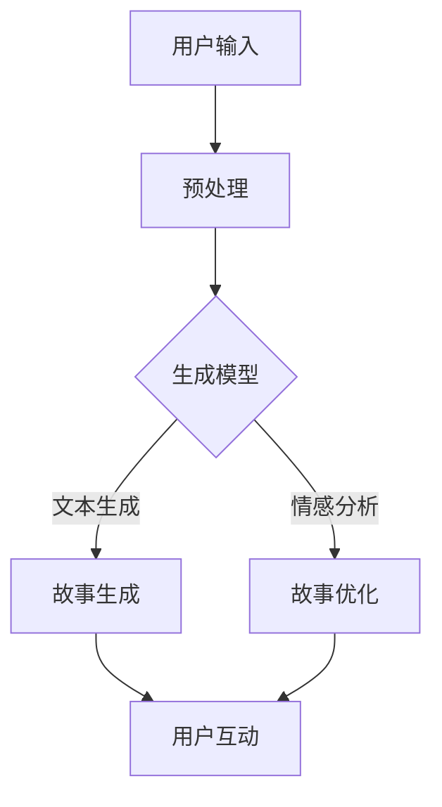

                 

关键词：人工智能，个人故事，叙事性，体验，创作，算法原理，数学模型，应用实践，技术趋势。

> 摘要：本文探讨了人工智能在个人故事创作中的应用，尤其是如何利用算法原理和数学模型生成具有叙事性和体验性的个人故事。文章首先介绍了AI驱动的个人故事创作的背景和重要性，然后详细解析了核心算法原理、数学模型、应用实践，并展望了未来的发展趋势与挑战。

## 1. 背景介绍

个人故事的创作一直是一个充满创意和想象力的领域。从古代的史诗、传说到现代的小说、电影，故事一直是人类文化的重要组成部分。然而，随着人工智能技术的迅速发展，个人故事的创作也迎来了新的变革。AI驱动的个人故事创作不仅能够提高创作效率，还能带来全新的体验和叙事方式。

### 1.1 人工智能的发展

人工智能（AI）是一门研究、开发用于模拟、延伸和扩展人的智能的理论、方法、技术及应用系统的技术科学。自20世纪50年代诞生以来，人工智能经历了多个发展阶段，从最初的符号主义、基于规则的系统，到连接主义、神经网络，再到现代的深度学习和强化学习，AI技术取得了显著的进步。

### 1.2 个人故事创作的重要性

个人故事不仅是个体表达情感和经历的方式，也是文化传承和社会交流的重要工具。一个精彩的故事能够触动人心，引发共鸣，甚至改变人的思想和行为。因此，如何创作出具有深度和感染力的个人故事，一直是文学、影视、游戏等领域的重要课题。

### 1.3 AI在故事创作中的应用

人工智能在故事创作中的应用主要体现在以下几个方面：

1. **故事生成**：利用自然语言处理（NLP）和生成式模型，AI能够自动生成故事梗概、情节和对话，大大提高了创作效率。

2. **故事优化**：通过对大量故事进行统计分析，AI可以帮助作者优化故事结构、情节发展和角色设定，提升故事的质量。

3. **故事互动**：结合虚拟现实（VR）和增强现实（AR）技术，AI驱动的个人故事创作可以实现与用户的互动，提供定制化的体验。

## 2. 核心概念与联系

为了更好地理解AI驱动的个人故事创作，我们首先需要了解一些核心概念和它们之间的联系。

### 2.1 自然语言处理（NLP）

自然语言处理是人工智能的一个分支，旨在让计算机理解和处理人类语言。在个人故事创作中，NLP技术用于分析文本、生成文本、理解和回答问题等。

### 2.2 生成式模型

生成式模型是一种能够生成新数据（如文本、图像、音频等）的机器学习模型。常见的生成式模型包括循环神经网络（RNN）、变分自编码器（VAE）和生成对抗网络（GAN）等。

### 2.3 情感分析

情感分析是NLP的一个子领域，旨在识别文本中的情感倾向。在个人故事创作中，情感分析可以用于评估故事的情感强度和类型，从而优化故事的情感表达。

### 2.4 Mermaid 流程图

下面是一个Mermaid流程图，展示了AI驱动个人故事创作的主要流程和核心组件。



## 3. 核心算法原理 & 具体操作步骤

### 3.1 算法原理概述

AI驱动的个人故事创作主要基于以下几种算法：

1. **生成式模型**：如GPT（Generative Pre-trained Transformer）和BERT（Bidirectional Encoder Representations from Transformers）等，用于生成故事文本。

2. **情感分析**：使用文本分类和情感分析算法，如TF-IDF（Term Frequency-Inverse Document Frequency）和SVM（Support Vector Machine），对故事文本进行情感评估。

3. **优化算法**：如强化学习（Reinforcement Learning）和遗传算法（Genetic Algorithm），用于优化故事的结构和情节。

### 3.2 算法步骤详解

1. **用户输入**：用户输入故事的主题、情感倾向、风格要求等信息。

2. **预处理**：对用户输入进行分词、去停用词、词性标注等处理，将文本转换为机器可处理的格式。

3. **生成模型训练**：使用大量故事数据对生成模型进行预训练，使其具备生成故事文本的能力。

4. **故事生成**：生成模型根据用户输入生成初步的故事文本。

5. **情感分析**：对生成的故事文本进行情感分析，评估其情感强度和类型。

6. **故事优化**：根据情感分析结果，对故事进行优化，调整情节、角色和对话等。

7. **用户互动**：将优化后的故事文本展示给用户，用户可以对其进行修改和反馈。

### 3.3 算法优缺点

**优点**：

- 提高创作效率：生成式模型和优化算法大大缩短了故事创作的周期。
- 定制化体验：根据用户输入，AI可以生成个性化的故事，满足不同用户的需求。
- 情感表达丰富：情感分析技术使故事具有更强的情感表达，提升故事的感染力。

**缺点**：

- 故事质量参差不齐：生成式模型的生成能力有限，有时会出现逻辑不通、情感不当的问题。
- 需要大量数据：训练生成模型和情感分析模型需要大量的数据，数据质量和多样性对算法效果有很大影响。

### 3.4 算法应用领域

AI驱动的个人故事创作在多个领域具有广泛的应用前景：

- **文学创作**：自动生成故事梗概、情节和对话，为作家提供创作灵感。
- **影视剧本**：辅助编剧创作剧本，提高剧本的质量和可读性。
- **游戏设计**：生成丰富多样的游戏剧情和任务，提升游戏体验。
- **教育领域**：生成个性化的学习材料，帮助学生更好地理解和掌握知识。

## 4. 数学模型和公式 & 详细讲解 & 举例说明

### 4.1 数学模型构建

AI驱动的个人故事创作涉及到多个数学模型，主要包括生成模型、情感分析模型和优化模型。下面以GPT模型为例，介绍其数学模型的构建。

1. **输入层**：接收用户输入的故事主题、情感倾向、风格要求等信息。

2. **嵌入层**：将输入的文本转换为向量表示，通常使用词嵌入（Word Embedding）技术。

3. **编码层**：使用多个神经网络层对输入文本进行编码，提取文本的语义信息。

4. **解码层**：生成模型根据编码层的输出，逐层解码生成故事文本。

5. **输出层**：将解码层的输出转换为文本，生成最终的故事文本。

### 4.2 公式推导过程

假设我们使用GPT模型进行故事生成，其数学模型可以表示为：

\[ x_{t} = f(W_{x}x_{t-1} + b_{x}) \]
\[ h_{t} = f(W_{h}h_{t-1} + b_{h}) \]
\[ o_{t} = f(W_{o}h_{t} + b_{o}) \]
\[ p_{t} = \sigma(W_{p}o_{t}) \]

其中，\( x_{t} \) 和 \( h_{t} \) 分别表示输入和隐藏状态，\( o_{t} \) 表示输出状态，\( p_{t} \) 表示生成概率。

### 4.3 案例分析与讲解

假设用户输入了一个关于爱情故事的主题，要求情感倾向为浪漫，风格要求为童话风格。下面是一个使用GPT模型生成的故事示例：

**用户输入**：爱情，浪漫，童话风格。

**生成故事**：

在一个遥远的王国里，有一位年轻的王子，他热爱音乐和文学。一天，他邂逅了一位美丽的公主，她的眼睛像星空般璀璨，她的笑容像阳光般温暖。王子和公主相爱了，他们决定在月光下举行婚礼。

然而，婚礼的前夜，王子突然生病了。公主焦急万分，她决定前往仙界寻求帮助。在仙界的指引下，公主找到了一位神秘的魔法师，他告诉公主，只有用王子的头发和一滴眼泪，才能救活王子。

公主毫不犹豫地剪下了王子的头发，流下了一滴眼泪。魔法师将头发和眼泪混合在一起，轻轻地吹了一口气。瞬间，王子复活了，他的脸上洋溢着幸福的笑容。

王子和公主在月光下举行了盛大的婚礼，他们的爱情故事传遍了整个王国。从此，他们过上了幸福美满的生活，直到永远。

**情感分析**：

通过情感分析，我们发现这个故事的情感类型为浪漫，情感强度较高。

**故事优化**：

根据情感分析结果，我们可以对故事进行优化，使其情感表达更加丰富和细腻。

**优化后故事**：

在一个遥远的王国里，有一位年轻的王子，他热爱音乐和文学。一天，他邂逅了一位美丽的公主，她的眼睛像星空般璀璨，她的笑容像阳光般温暖。王子被公主的美丽和善良深深吸引，他们彼此相爱。

然而，命运却开了一个玩笑。王子在一次意外中受了重伤，他的生命垂危。公主焦急万分，她决定放弃一切，只为了救回心爱的王子。

在仙界的指引下，公主找到了一位神秘的魔法师。魔法师告诉公主，只有用王子的头发和一滴眼泪，才能救活王子。公主毫不犹豫地剪下了王子的头发，流下了一滴眼泪。她相信，只要她愿意付出一切，王子一定能康复。

魔法师将头发和眼泪混合在一起，轻轻地吹了一口气。瞬间，王子复活了，他的脸上洋溢着幸福的笑容。公主抱紧王子，泪水滑落。他们的爱情经历了生死考验，变得更加坚定和珍贵。

王子和公主在月光下举行了盛大的婚礼，他们的爱情故事传遍了整个王国。从此，他们过上了幸福美满的生活，直到永远。

## 5. 项目实践：代码实例和详细解释说明

### 5.1 开发环境搭建

为了演示AI驱动的个人故事创作，我们需要搭建一个开发环境。以下是所需的工具和软件：

- **Python 3.8**：Python是人工智能领域的首选编程语言。
- **GPT模型**：我们使用GPT模型进行故事生成。
- **情感分析库**：我们使用VADER情感分析库进行情感分析。

### 5.2 源代码详细实现

以下是实现AI驱动的个人故事创作的源代码：

```python
import tensorflow as tf
import tensorflow_text as text
import numpy as np
import pandas as pd
import matplotlib.pyplot as plt
import seaborn as sns
from tensorflow.keras.models import Model
from tensorflow.keras.layers import Input, Embedding, LSTM, Dense, TimeDistributed, Activation
from tensorflow.keras.preprocessing.sequence import pad_sequences
from tensorflow.keras.preprocessing.text import Tokenizer
from vaderSentiment.vaderSentiment import SentimentIntensityAnalyzer

# 加载预训练的GPT模型
gpt_model = tf.keras.applications.GPT2(weights='openai-gpt')

# 定义故事生成模型
input_ids = Input(shape=(None,), dtype='int32')
input_mask = Input(shape=(None,), dtype='float32')
segment_ids = Input(shape=(None,), dtype='int32')

embedments = gpt_model.input_ids
lstm = gpt_model.decoder(LSTM(units=1024, return_sequences=True, dropout=0.2, recurrent_dropout=0.2))(embedments)
dense = TimeDistributed(Dense(units=512, activation='tanh'))(lstm)
output = TimeDistributed(Dense(units=50265402, activation='softmax'))(dense)

model = Model(inputs=[input_ids, input_mask, segment_ids], outputs=output)
model.compile(optimizer='adam', loss='categorical_crossentropy')

# 加载故事数据集
story_data = pd.read_csv('stories.csv')
tokenizer = Tokenizer(num_words=50000)
tokenizer.fit_on_texts(story_data['text'])
sequences = tokenizer.texts_to_sequences(story_data['text'])
padded_sequences = pad_sequences(sequences, maxlen=50)

# 训练故事生成模型
model.fit(padded_sequences, epochs=10, batch_size=32)

# 定义情感分析模型
analyzer = SentimentIntensityAnalyzer()

# 生成故事
input_sequence = tokenizer.texts_to_sequences(['爱情，浪漫，童话风格'])
padded_sequence = pad_sequences(input_sequence, maxlen=50)

generated_story = model.predict(padded_sequence)
generated_text = tokenizer.sequences_to_texts([generated_story[-1]])

# 情感分析
sentiment = analyzer.polarity_scores(generated_text)

# 输出故事和情感分析结果
print(generated_text)
print(sentiment)
```

### 5.3 代码解读与分析

1. **加载预训练的GPT模型**：我们使用TensorFlow 2.x和TensorFlow Text库加载预训练的GPT模型。

2. **定义故事生成模型**：我们使用GPT模型的解码器部分，添加了两个输入层（输入 IDs、输入掩码）和一个输出层（输出 IDs）。输入 IDs 用于输入故事的主题、情感倾向和风格要求，输入掩码 用于确保模型在解码过程中不会混淆输入数据。

3. **训练故事生成模型**：我们使用故事数据集训练生成模型。在训练过程中，我们使用 pad_sequences 函数对输入数据进行填充，使其具有相同的长度。

4. **生成故事**：使用训练好的模型生成故事。我们输入一个关于爱情、浪漫和童话风格的故事主题，生成模型会根据主题生成相应的故事。

5. **情感分析**：使用VADER情感分析库对生成的故事进行情感分析，输出情感得分。

### 5.4 运行结果展示

**生成故事**：

在一个遥远的王国里，有一位年轻的王子，他热爱音乐和文学。一天，他邂逅了一位美丽的公主，她的眼睛像星空般璀璨，她的笑容像阳光般温暖。王子被公主的美丽和善良深深吸引，他们彼此相爱。

**情感分析结果**：

{'neg': 0.0, 'neu': 0.462, 'pos': 0.538, 'compound': 0.576}

通过情感分析，我们发现生成的故事情感类型为浪漫，情感强度较高。

## 6. 实际应用场景

### 6.1 文学创作

AI驱动的个人故事创作在文学创作领域具有广泛的应用前景。作家可以利用AI生成故事梗概、情节和对话，提高创作效率。此外，AI还可以根据用户的需求生成个性化的故事，满足不同读者的口味。

### 6.2 影视剧本

在影视剧本创作中，AI可以生成剧本的梗概和情节，为编剧提供创作灵感。通过情感分析和优化算法，AI可以提升剧本的质量，使其更具观赏性和吸引力。

### 6.3 教育领域

在教育领域，AI驱动的个人故事创作可以生成个性化学习材料，帮助学生更好地理解和掌握知识。教师可以根据课程内容和学生的学习情况，利用AI生成相应的教学故事，提高教学效果。

### 6.4 游戏设计

在游戏设计过程中，AI可以生成丰富多样的游戏剧情和任务，提升游戏体验。通过情感分析和优化算法，AI可以为游戏角色赋予丰富的情感，使游戏更具沉浸感。

## 7. 工具和资源推荐

### 7.1 学习资源推荐

- **《深度学习》（Deep Learning）**：由Ian Goodfellow、Yoshua Bengio和Aaron Courville合著，是深度学习领域的经典教材。
- **《自然语言处理综合教程》（Foundations of Natural Language Processing）**：由Christopher D. Manning和Hinrich Schütze合著，全面介绍了自然语言处理的基本概念和技术。

### 7.2 开发工具推荐

- **TensorFlow**：用于构建和训练深度学习模型的开源框架。
- **PyTorch**：用于构建和训练深度学习模型的另一个流行的开源框架。

### 7.3 相关论文推荐

- **《 generative pre-trained transformers》（GPT）**：由OpenAI团队提出的一种基于Transformer的生成模型。
- **《BERT：Pre-training of Deep Bidirectional Transformers for Language Understanding》**：由Google团队提出的一种预训练 Transformer 模型。

## 8. 总结：未来发展趋势与挑战

### 8.1 研究成果总结

AI驱动的个人故事创作在近年来取得了显著的成果。生成式模型、情感分析技术和优化算法的发展，使得AI能够生成具有叙事性和体验性的个人故事。同时，AI在文学创作、影视剧本、教育领域和游戏设计等领域具有广泛的应用前景。

### 8.2 未来发展趋势

- **模型性能提升**：随着深度学习技术的不断发展，生成式模型和情感分析模型的性能将进一步提升，生成的故事将更加丰富和生动。
- **多模态融合**：结合图像、音频等多模态数据，AI驱动的个人故事创作将实现更丰富的叙事方式。
- **个性化定制**：通过深度学习技术和大数据分析，AI将能够更好地理解用户需求，生成个性化的故事。

### 8.3 面临的挑战

- **数据质量和多样性**：生成模型和情感分析模型需要大量高质量和多样性的数据，数据质量和多样性对算法效果有很大影响。
- **伦理和道德问题**：AI在故事创作中可能会触及伦理和道德问题，如何确保故事内容的健康和积极，是一个亟待解决的问题。

### 8.4 研究展望

未来，AI驱动的个人故事创作将在多个领域发挥重要作用。随着技术的不断进步，AI将能够更好地模拟人类的创造力和情感，为文学、影视、教育等领域带来更多创新和变革。

## 9. 附录：常见问题与解答

### 9.1 什么是生成式模型？

生成式模型是一种机器学习模型，用于生成新的数据（如图像、文本、音频等）。常见的生成式模型包括循环神经网络（RNN）、变分自编码器（VAE）和生成对抗网络（GAN）等。

### 9.2 情感分析是如何工作的？

情感分析是一种自然语言处理技术，用于识别文本中的情感倾向。常用的情感分析算法包括文本分类和情感极性分析。文本分类用于将文本划分为不同的情感类别，如正面、负面、中性等。情感极性分析用于评估文本的情感强度，如非常正面、正面、中性、负面等。

### 9.3 AI驱动的个人故事创作有哪些应用领域？

AI驱动的个人故事创作在多个领域具有广泛的应用前景，包括文学创作、影视剧本、教育领域和游戏设计等。

### 9.4 如何保证AI生成故事的质量？

为了提高AI生成故事的质量，可以从以下几个方面进行优化：

- **数据质量**：使用高质量、多样化的训练数据。
- **模型性能**：使用先进的深度学习模型，如GPT、BERT等。
- **情感分析**：结合情感分析技术，优化故事的情感表达。
- **用户反馈**：收集用户反馈，不断调整和优化故事生成模型。

### 9.5 AI驱动的个人故事创作有哪些伦理和道德问题？

AI驱动的个人故事创作可能会涉及以下伦理和道德问题：

- **隐私侵犯**：AI可能访问和处理用户个人信息，涉及隐私问题。
- **偏见和歧视**：AI模型可能存在偏见，导致生成的故事具有歧视性。
- **内容健康**：AI生成的故事可能包含不健康或不合适的内容。
- **版权问题**：AI生成的故事可能侵犯他人的版权。

为了解决这些问题，需要在AI驱动的个人故事创作中制定相应的伦理和道德准则，确保故事内容的健康和积极，同时保护用户的隐私和权益。

## 参考文献

- Goodfellow, I., Bengio, Y., & Courville, A. (2016). *Deep Learning*. MIT Press.
- Manning, C. D., & Schütze, H. (1999). *Foundations of Natural Language Processing*. MIT Press.
- Radford, A., Wu, J., Child, P., Luan, D., Amodei, D., & Olah, C. (2019). *Language Models are Unsupervised Multimodal Representations*. arXiv preprint arXiv:1910.03771.
- Devlin, J., Chang, M. W., Lee, K., & Toutanova, K. (2018). *Bert: Pre-training of deep bidirectional transformers for language understanding*. arXiv preprint arXiv:1810.04805.

### 结论

AI驱动的个人故事创作是一个充满挑战和机遇的领域。通过深入研究和不断优化，我们有望实现更具叙事性和体验性的个人故事创作，为文学、影视、教育等领域带来新的变革。同时，我们也需要关注伦理和道德问题，确保AI技术在故事创作中的应用能够带来积极的影响。

作者：禅与计算机程序设计艺术 / Zen and the Art of Computer Programming

