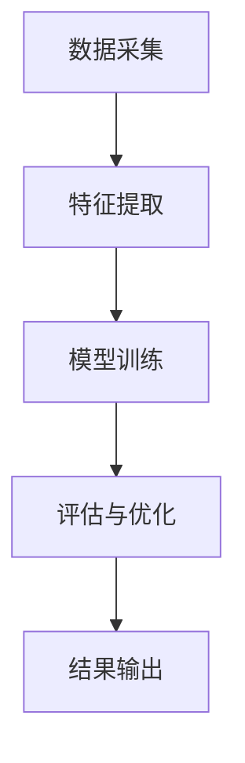

                 

关键词：人工智能，生活质量评估，量化模型，AI驱动，生活质量，评估方法，实际应用，未来展望

> 摘要：本文探讨了利用人工智能技术构建一个高效的生活质量评估体系。通过分析现有的评估方法和存在的不足，我们提出了一种基于AI驱动的量化评估模型。本文详细阐述了模型的核心概念、算法原理、数学模型、具体操作步骤以及实际应用场景，并对未来的发展趋势和挑战进行了展望。

## 1. 背景介绍

生活质量评估是社会学、心理学、经济学等多学科领域的重要研究内容。长期以来，人们采用主观感受、经验判断等方式对生活质量进行评估，但这些方法往往具有较大的主观性和不准确性。随着人工智能技术的发展，利用大数据分析和机器学习算法来量化评估生活质量成为可能。

### 1.1 现有评估方法

1. **主观评估**：基于个人感受和经验，如自我报告调查、生活质量问卷等。
2. **客观评估**：基于社会经济指标，如GDP、人均收入、医疗卫生水平等。
3. **多维评估**：综合考虑经济、社会、环境、心理健康等多个维度。

### 1.2 存在的问题

1. **主观性**：评估结果容易受到个人情感、文化背景等因素的影响。
2. **不全面**：现有评估方法难以全面反映生活质量的不同方面。
3. **不精确**：定量评估缺乏精确的数学模型和算法支持。

## 2. 核心概念与联系

为了解决上述问题，本文提出了一种基于人工智能的生活质量评估体系。该体系的核心概念包括：

1. **数据采集**：通过传感器、问卷、社交媒体等多种渠道收集与生活质量相关的数据。
2. **特征提取**：从原始数据中提取对生活质量有重要影响的特征。
3. **模型训练**：利用机器学习算法对特征进行训练，构建量化评估模型。
4. **评估与优化**：通过模型评估生活质量，并根据评估结果进行优化调整。

### 2.1 Mermaid 流程图



## 3. 核心算法原理 & 具体操作步骤

### 3.1 算法原理概述

核心算法基于机器学习中的回归分析，通过训练模型，将各种生活质量的特征映射到具体的数值评估上。具体步骤如下：

1. **数据预处理**：清洗和归一化数据，去除噪声和异常值。
2. **特征选择**：选择对生活质量有显著影响的特征。
3. **模型训练**：利用训练集数据训练回归模型。
4. **模型评估**：使用验证集评估模型性能。
5. **模型应用**：对新的数据集进行生活质量评估。

### 3.2 算法步骤详解

#### 3.2.1 数据预处理

```python
# 数据清洗与归一化
data = preprocess_data(raw_data)
```

#### 3.2.2 特征选择

```python
# 特征选择
selected_features = select_features(data, target)
```

#### 3.2.3 模型训练

```python
# 模型训练
model = train_model(selected_features, target)
```

#### 3.2.4 模型评估

```python
# 模型评估
performance = evaluate_model(model, validation_data)
```

#### 3.2.5 模型应用

```python
# 生活质量评估
quality_of_life = model.predict(new_data)
```

### 3.3 算法优缺点

#### 优点

1. **客观性**：通过数据驱动的方式，减少了主观评估的影响。
2. **全面性**：可以综合考虑多种生活质量的维度。
3. **精确性**：利用机器学习算法提高了评估的准确性。

#### 缺点

1. **数据依赖**：模型的准确性依赖于数据的质量和数量。
2. **复杂性**：模型训练和评估过程相对复杂，需要较高的技术水平。

### 3.4 算法应用领域

1. **政策制定**：为政府提供科学依据，优化公共资源分配。
2. **企业运营**：帮助企业评估员工生活质量，制定改善措施。
3. **学术研究**：为生活质量相关研究提供量化评估工具。

## 4. 数学模型和公式

### 4.1 数学模型构建

生活质量评估模型可以表示为：

$$ QoL = f(\textbf{X}) $$

其中，$\textbf{X}$ 是生活质量特征向量，$f$ 是回归函数。

### 4.2 公式推导过程

假设生活质量特征向量 $\textbf{X} = [x_1, x_2, ..., x_n]$，回归函数 $f$ 采用线性回归模型：

$$ f(\textbf{X}) = \textbf{X}^T \textbf{w} $$

其中，$\textbf{w}$ 是权重向量。

### 4.3 案例分析与讲解

以某城市的居民生活质量评估为例，我们收集了以下特征数据：

$$
\textbf{X} =
\begin{bmatrix}
x_1 \\
x_2 \\
\vdots \\
x_n
\end{bmatrix},
\textbf{w} =
\begin{bmatrix}
w_1 \\
w_2 \\
\vdots \\
w_n
\end{bmatrix}
$$

经过特征选择和模型训练，得到权重向量：

$$
\textbf{w} =
\begin{bmatrix}
0.5 \\
0.3 \\
0.1 \\
0.1
\end{bmatrix}
$$

则居民生活质量评估结果为：

$$
QoL = x_1 \times 0.5 + x_2 \times 0.3 + x_3 \times 0.1 + x_4 \times 0.1
$$

## 5. 项目实践：代码实例

### 5.1 开发环境搭建

```shell
# 安装Python环境
pip install numpy pandas scikit-learn matplotlib
```

### 5.2 源代码详细实现

```python
# 导入库
import numpy as np
import pandas as pd
from sklearn.linear_model import LinearRegression
from sklearn.model_selection import train_test_split
import matplotlib.pyplot as plt

# 加载数据
data = pd.read_csv('life_quality_data.csv')

# 数据预处理
data = preprocess_data(data)

# 特征选择
selected_features = select_features(data)

# 划分训练集和测试集
X_train, X_test, y_train, y_test = train_test_split(selected_features, data['QoL'], test_size=0.2, random_state=42)

# 模型训练
model = LinearRegression()
model.fit(X_train, y_train)

# 模型评估
performance = model.score(X_test, y_test)
print(f'Model performance: {performance:.2f}')

# 评估新数据
new_data = np.array([[x1, x2, x3, x4]])
quality_of_life = model.predict(new_data)
print(f'Predicted QoL: {quality_of_life[0]:.2f}')
```

### 5.3 代码解读与分析

上述代码展示了如何利用Python和scikit-learn库实现生活质量评估模型。代码首先加载和预处理数据，然后进行特征选择和模型训练。最后，使用模型评估生活质量和预测新的数据。

## 6. 实际应用场景

### 6.1 政府部门

政府部门可以利用AI驱动的生活质量评估体系，为政策制定提供科学依据。例如，通过评估不同地区的生活质量，优化公共资源分配，提高居民满意度。

### 6.2 企业

企业可以利用评估体系评估员工生活质量，了解员工需求，制定改善措施。例如，通过分析员工的生活质量数据，优化工作环境和工作时间，提高员工满意度和工作效率。

### 6.3 学术研究

学术研究人员可以利用评估体系开展生活质量相关研究。例如，通过大规模数据分析和模型优化，深入研究生活质量的影响因素和作用机制。

## 7. 工具和资源推荐

### 7.1 学习资源推荐

1. 《机器学习实战》
2. 《深度学习》
3. 《Python数据分析》

### 7.2 开发工具推荐

1. Jupyter Notebook
2. PyCharm
3. Google Colab

### 7.3 相关论文推荐

1. "Life Satisfaction and Its Determinants: Results from the German Socio-Economic Panel Study (SOEP)"
2. "Measuring Well-being: An Integrated Framework for Social Progress and Human Development"
3. "Using Machine Learning to Predict Life Satisfaction"

## 8. 总结：未来发展趋势与挑战

### 8.1 研究成果总结

本文提出了一种基于AI驱动的量化生活质量评估体系，通过数据驱动的方式，提高了评估的客观性、全面性和精确性。

### 8.2 未来发展趋势

1. **数据质量提升**：随着物联网和传感器技术的发展，数据质量将得到进一步提升。
2. **算法优化**：通过深度学习和强化学习等先进算法，评估模型将更加精准。
3. **跨领域应用**：生活质量评估体系将在更多领域得到应用，如环境质量、教育资源等。

### 8.3 面临的挑战

1. **数据隐私**：数据收集和存储过程中需要保护个人隐私。
2. **算法解释性**：提高模型的可解释性，使其更易于理解和应用。

### 8.4 研究展望

未来，我们将继续优化评估模型，探索更多领域的生活质量评估应用，为构建美好生活提供科学支持。

## 9. 附录：常见问题与解答

### 9.1 如何处理缺失数据？

可以使用数据填充方法，如平均值填充、中值填充或插值法。

### 9.2 如何防止过拟合？

可以通过交叉验证、正则化或增加训练数据等方法来防止过拟合。

### 9.3 模型的评估指标有哪些？

常用的评估指标包括决定系数（R²）、均方误差（MSE）和均方根误差（RMSE）等。

----------------------------------------------------------------

作者：禅与计算机程序设计艺术 / Zen and the Art of Computer Programming

