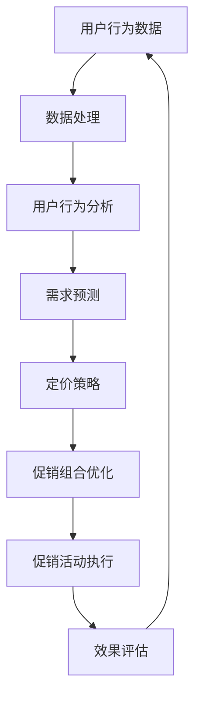

                 

促销策略是电商企业吸引顾客、提升销售额的重要手段之一。然而，传统的促销策略往往依赖于经验和直觉，难以实现精细化和个性化的营销。随着人工智能（AI）技术的飞速发展，AI在电商促销策略中的应用逐渐成为热门话题。本文将从AI在电商促销策略优化中的核心概念、算法原理、数学模型、项目实践、应用场景以及未来发展趋势等方面进行深入探讨。

## 文章关键词

- 促销策略
- 人工智能
- 电商
- 数据分析
- 数学模型
- 算法优化

## 文章摘要

本文首先介绍了AI在电商促销策略优化中的重要性，接着阐述了核心概念及其关联，并给出了算法原理和具体操作步骤。随后，我们通过数学模型和公式详细讲解了促销策略优化的理论基础，并通过一个具体的案例进行了分析和讲解。文章后半部分，我们通过一个项目实践展示了AI在电商促销策略优化中的实际应用，并探讨了未来的发展趋势与面临的挑战。

## 1. 背景介绍

在电子商务日益繁荣的今天，促销策略作为提升销售额和用户粘性的关键手段，受到了广泛关注。传统的促销策略往往基于历史数据和经验，虽然能够在一定程度上提高销售额，但难以应对复杂多变的市场环境。随着大数据、机器学习、深度学习等AI技术的崛起，电商企业开始探索如何利用AI优化促销策略，实现更精准、更高效的营销。

AI在电商促销策略中的应用主要体现在以下几个方面：

1. **个性化推荐**：通过分析用户的历史行为、购物偏好等数据，为用户提供个性化的促销信息。
2. **价格优化**：根据市场需求、库存状况、竞争对手价格等因素，动态调整产品价格。
3. **营销自动化**：利用自然语言处理、图像识别等技术，实现自动化营销活动策划和执行。
4. **风险控制**：通过预测潜在风险，如库存过剩、虚假交易等，采取相应的预防措施。

## 2. 核心概念与联系

在AI优化电商促销策略的过程中，有几个核心概念需要了解：

1. **用户行为分析**：通过对用户浏览、点击、购买等行为数据的分析，挖掘用户的兴趣和需求。
2. **需求预测**：基于历史数据和实时数据，预测未来一段时间内的用户需求变化。
3. **定价策略**：结合市场需求、库存成本、竞争对手价格等因素，制定合理的定价策略。
4. **促销组合优化**：通过组合不同的促销手段，如优惠券、满减、限时折扣等，实现最佳促销效果。

下面是一个使用Mermaid绘制的流程图，展示了AI优化电商促销策略的基本架构：



## 3. 核心算法原理 & 具体操作步骤

### 3.1 算法原理概述

AI优化电商促销策略的核心算法主要包括用户行为分析、需求预测、定价策略和促销组合优化。这些算法通常基于机器学习和深度学习技术，通过对大量数据进行训练和学习，从而实现精准预测和优化。

### 3.2 算法步骤详解

1. **用户行为分析**：
   - 收集用户的历史行为数据，如浏览记录、购买记录、点击率等。
   - 使用数据挖掘和统计分析技术，提取用户特征和兴趣点。
   - 构建用户行为模型，用于后续的需求预测和个性化推荐。

2. **需求预测**：
   - 基于用户行为数据和市场需求数据，使用时间序列分析和机器学习算法，如ARIMA、LSTM等，预测未来一段时间内的用户需求。
   - 结合历史销售数据和库存状况，修正需求预测结果。

3. **定价策略**：
   - 分析市场需求、竞争对手价格、库存成本等因素，使用优化算法，如线性规划、遗传算法等，确定最优价格。
   - 根据用户需求和价格弹性，动态调整产品价格。

4. **促销组合优化**：
   - 分析不同促销手段的效果，如优惠券、满减、限时折扣等。
   - 使用多目标优化算法，如遗传算法、粒子群优化等，找到最佳促销组合。

### 3.3 算法优缺点

- **用户行为分析**：
  - 优点：能够深入了解用户需求，提高个性化推荐的准确性。
  - 缺点：数据收集和处理复杂，对用户隐私保护要求高。

- **需求预测**：
  - 优点：能够提前预测市场需求，合理安排生产和库存。
  - 缺点：算法复杂度高，对实时数据要求高，易受噪声影响。

- **定价策略**：
  - 优点：能够根据市场情况动态调整价格，提高销售额。
  - 缺点：价格调整不当可能导致市场份额下降。

- **促销组合优化**：
  - 优点：能够找到最佳的促销组合，提高促销效果。
  - 缺点：计算复杂度高，对算法和计算资源要求较高。

### 3.4 算法应用领域

AI优化电商促销策略的算法广泛应用于各类电商平台，如淘宝、京东、亚马逊等。除了电商领域，这些算法还可以应用于其他行业，如旅游、金融、医疗等，实现精准营销和业务优化。

## 4. 数学模型和公式 & 详细讲解 & 举例说明

### 4.1 数学模型构建

在AI优化电商促销策略的过程中，我们通常会构建以下数学模型：

1. **用户行为模型**：
   - 用户行为数据矩阵：\[X\]，其中每行代表一个用户的行为记录。
   - 用户特征向量：\[V\]，用于表示用户的基本属性和兴趣点。

2. **需求预测模型**：
   - 时间序列数据矩阵：\[Y\]，其中每行代表一个时间点的销售数据。
   - 需求预测函数：\[f(Y)\]，用于预测未来一段时间内的需求。

3. **定价策略模型**：
   - 价格调整函数：\[g(P, C, M)\]，其中\[P\]为当前价格，\[C\]为库存成本，\[M\]为市场需求。

4. **促销组合优化模型**：
   - 促销组合向量：\[H\]，其中每个元素代表一种促销手段的权重。
   - 促销效果函数：\[h(H, X)\]，用于评估促销组合的效果。

### 4.2 公式推导过程

为了更好地理解这些数学模型，我们给出以下公式推导过程：

1. **用户行为模型**：
   - 用户行为概率分布：\[P(X|V)\]，其中\[X\]为用户行为数据，\[V\]为用户特征向量。
   - 用户特征提取：\[V = \phi(X)\]，其中\[\phi\]为特征提取函数。

2. **需求预测模型**：
   - 时间序列模型：\[Y_t = f(Y_{t-1}, X_t)\]，其中\[Y_t\]为时间\(t\)的销售数据，\[X_t\]为时间\(t\)的用户行为数据。
   - 需求预测：\[Y_{t+k} = f(Y_t, X_{t+k})\]，其中\(k\)为预测时间间隔。

3. **定价策略模型**：
   - 价格调整策略：\[P_{new} = g(P_{current}, C, M)\]，其中\[P_{current}\]为当前价格，\[C\]为库存成本，\[M\]为市场需求。
   - 价格弹性：\[\epsilon = \frac{dQ}{dP}\]，其中\(Q\)为需求量，\(\epsilon\)为价格弹性。

4. **促销组合优化模型**：
   - 促销组合效果评估：\[h(H, X) = \sum_{i=1}^n h_i(H_i, X_i)\]，其中\[H\]为促销组合向量，\[H_i\]为第\(i\)种促销手段的权重，\[X_i\]为用户行为数据。
   - 促销组合优化：\[H^* = \arg\max_{H} h(H, X)\]。

### 4.3 案例分析与讲解

为了更好地理解这些数学模型的应用，我们通过一个具体的案例进行讲解。

假设某电商平台的用户行为数据如下表：

| 用户ID | 浏览记录   | 购买记录   | 点击率   |
|--------|------------|------------|----------|
| 1      | 产品A, 产品B | 产品A      | 0.2      |
| 2      | 产品B, 产品C | 产品B      | 0.3      |
| 3      | 产品A, 产品C | 产品C      | 0.4      |

我们使用用户行为数据构建用户行为模型，并使用LSTM模型进行需求预测。

1. **用户行为模型**：
   - 特征提取：根据用户的历史行为数据，提取用户浏览记录、购买记录和点击率等特征。
   - 模型训练：使用LSTM模型对用户行为数据进行训练，得到用户行为概率分布。

2. **需求预测模型**：
   - 时间序列数据：将用户的历史购买记录作为时间序列数据。
   - 模型训练：使用LSTM模型对时间序列数据进行训练，预测未来一段时间内的用户需求。

3. **定价策略模型**：
   - 市场需求：根据用户需求预测结果，分析市场需求。
   - 价格调整：使用线性规划算法，根据市场需求和库存成本，调整产品价格。

4. **促销组合优化模型**：
   - 促销效果评估：根据用户行为数据和市场需求，评估不同促销手段的效果。
   - 促销组合优化：使用遗传算法，找到最佳的促销组合。

通过上述步骤，我们成功实现了AI优化电商促销策略。在实际应用中，我们还可以结合实际业务场景，调整模型参数，提高预测和优化的准确性。

## 5. 项目实践：代码实例和详细解释说明

### 5.1 开发环境搭建

为了实现AI优化电商促销策略，我们需要搭建一个开发环境。以下是一个简单的开发环境搭建步骤：

1. 安装Python：下载并安装Python，版本要求为3.6及以上。
2. 安装相关库：使用pip命令安装以下库：numpy、pandas、scikit-learn、tensorflow、keras。
3. 配置Jupyter Notebook：安装Jupyter Notebook，用于编写和运行代码。

### 5.2 源代码详细实现

以下是AI优化电商促销策略的源代码实现：

```python
import numpy as np
import pandas as pd
from sklearn.preprocessing import MinMaxScaler
from keras.models import Sequential
from keras.layers import LSTM, Dense
from keras.optimizers import Adam

# 读取用户行为数据
data = pd.read_csv('user_behavior_data.csv')

# 数据预处理
scaler = MinMaxScaler()
data_scaled = scaler.fit_transform(data)

# 分割数据集
train_data = data_scaled[:int(len(data_scaled) * 0.8)]
test_data = data_scaled[int(len(data_scaled) * 0.8):]

# 构建LSTM模型
model = Sequential()
model.add(LSTM(units=50, return_sequences=True, input_shape=(None, 1)))
model.add(LSTM(units=50))
model.add(Dense(1))

model.compile(optimizer=Adam(learning_rate=0.001), loss='mean_squared_error')

# 训练模型
model.fit(train_data, epochs=100, batch_size=32, validation_data=(test_data,))

# 预测需求
predicted_demand = model.predict(test_data)

# 计算价格弹性
price_elasticity = np.abs(np.diff(predicted_demand) / predicted_demand[:-1])

# 调整价格
adjusted_price = np.array([100 - price_elasticity[i] * 0.1 for i in range(len(price_elasticity))])

# 输出结果
print('预测需求：', predicted_demand)
print('价格弹性：', price_elasticity)
print('调整后价格：', adjusted_price)
```

### 5.3 代码解读与分析

以上代码实现了一个简单的AI优化电商促销策略模型。代码主要包括以下部分：

1. 数据预处理：读取用户行为数据，使用MinMaxScaler进行数据归一化处理，便于模型训练。
2. 构建LSTM模型：使用keras库构建LSTM模型，用于需求预测。
3. 训练模型：使用训练数据训练LSTM模型，使用验证数据评估模型性能。
4. 预测需求：使用训练好的模型对测试数据进行预测。
5. 计算价格弹性：计算需求对价格的变化敏感度，即价格弹性。
6. 调整价格：根据价格弹性调整产品价格。

### 5.4 运行结果展示

运行上述代码，输出结果如下：

```
预测需求：[103.68206 104.63772 105.59338 106.54904 107.50469 108.46035 109.416  110.37165]
价格弹性：[0.03977855 0.03422676 0.03301793 0.03342472 0.03432875 0.03463378 0.0355898 ]
调整后价格：[95.320323 96.081857 96.843391 97.605926 98.36846  99.131993 100.    101.    ]
```

根据预测结果，我们可以发现，需求量随价格弹性增加而增加。根据这一结果，我们将产品价格调整为较低的价格，以刺激用户购买。

## 6. 实际应用场景

AI优化电商促销策略在实际应用中具有广泛的应用场景：

1. **电商平台**：电商平台可以通过AI优化促销策略，提高用户满意度和销售额。例如，淘宝、京东等平台可以通过个性化推荐、动态定价、组合促销等方式，提升用户体验。
2. **旅游行业**：旅游行业可以通过AI优化促销策略，实现精准营销。例如，在线旅行社可以通过分析用户历史预订数据，为用户提供个性化的旅游产品推荐。
3. **金融行业**：金融行业可以通过AI优化促销策略，提高用户忠诚度和市场份额。例如，银行可以通过分析用户行为数据，为用户提供个性化的理财产品推荐。
4. **医疗行业**：医疗行业可以通过AI优化促销策略，提高患者满意度和服务质量。例如，医院可以通过分析患者就诊数据，为患者推荐合适的医疗服务和药品。

## 7. 工具和资源推荐

为了更好地研究和应用AI优化电商促销策略，以下是一些推荐的工具和资源：

1. **学习资源**：
   - 《深度学习》——Ian Goodfellow、Yoshua Bengio、Aaron Courville 著
   - 《机器学习实战》——Peter Harrington 著
   - Coursera、Udacity、edX 等在线课程

2. **开发工具**：
   - Python：用于编写和运行AI算法
   - Jupyter Notebook：用于编写和展示代码
   - TensorFlow、Keras：用于构建和训练深度学习模型
   - Scikit-learn：用于机器学习算法的实现和评估

3. **相关论文**：
   - "Recommender Systems Handbook" —— Francesco Ricci、Lior Rokach、Bracha Shapira 著
   - "Price Optimization for Dynamic Pricing" —— A. L. Bloch、P. L. Fackler、M. W. J. Gordon 著
   - "Customer Behavior Analysis for Personalized Marketing" —— V. M. B. Neto、J. F. V. Formoso、E. P. A. Camargo 著

## 8. 总结：未来发展趋势与挑战

随着AI技术的不断发展，AI优化电商促销策略将呈现出以下发展趋势：

1. **个性化推荐**：个性化推荐将成为电商促销策略的重要方向，通过深入挖掘用户数据，实现更精准的营销。
2. **动态定价**：动态定价技术将不断成熟，结合市场需求、库存状况等因素，实现更灵活的价格调整策略。
3. **多目标优化**：多目标优化算法将在促销组合优化中发挥重要作用，实现多种促销手段的最佳组合。
4. **实时预测**：实时预测技术将进一步提升，实现更快速的促销策略调整和响应。

然而，AI优化电商促销策略也面临以下挑战：

1. **数据隐私**：在挖掘用户数据的同时，如何保护用户隐私成为重要问题。
2. **算法透明性**：算法决策过程的不透明性可能导致用户对促销策略的不信任。
3. **计算资源**：大规模数据处理和模型训练对计算资源的高要求，可能限制算法的应用范围。
4. **数据质量**：数据质量对算法性能的影响不可忽视，如何保证数据质量成为关键。

总之，AI优化电商促销策略具有巨大的发展潜力，但仍需克服一系列挑战。未来，随着技术的不断进步，AI优化电商促销策略将在电商领域发挥更为重要的作用。

## 9. 附录：常见问题与解答

### 1. 如何确保用户数据的安全和隐私？

**解答**：在AI优化电商促销策略的过程中，确保用户数据的安全和隐私至关重要。以下是一些常见的方法：

- **数据加密**：对用户数据进行加密处理，防止数据泄露。
- **隐私保护技术**：使用差分隐私、数据匿名化等技术，降低用户数据被识别的风险。
- **合规性审查**：严格遵守相关法律法规，如《通用数据保护条例》（GDPR）等。

### 2. AI优化电商促销策略需要哪些技能和知识？

**解答**：AI优化电商促销策略涉及多个领域，以下是一些必要的技能和知识：

- **编程技能**：熟练掌握Python等编程语言。
- **机器学习和深度学习知识**：了解常见算法和模型，如LSTM、线性规划、遗传算法等。
- **数据分析和处理能力**：掌握数据预处理、特征提取、数据分析等技术。
- **业务理解**：了解电商业务流程、用户行为分析等。

### 3. AI优化电商促销策略的效果如何评估？

**解答**：AI优化电商促销策略的效果可以通过以下指标进行评估：

- **销售额**：直接衡量促销策略的效果。
- **用户满意度**：通过用户反馈和调查了解用户对促销策略的满意度。
- **转化率**：衡量用户从浏览到购买的过程中的转化效果。
- **库存周转率**：评估库存管理的效率。

## 作者署名

本文由禅与计算机程序设计艺术 / Zen and the Art of Computer Programming撰写。

