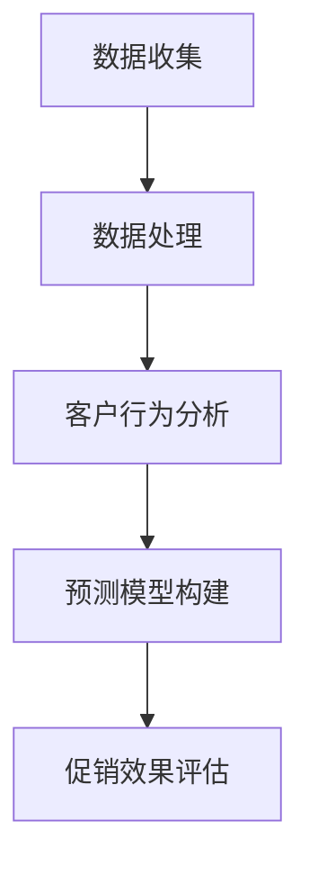

                 

本文将深入探讨如何利用人工智能（AI）技术来优化促销策略，提高活动效果。随着科技的不断进步，AI已经渗透到我们生活的方方面面，包括营销和促销活动。在这一领域中，AI可以通过数据分析和预测模型，为企业和商家提供更加精准和高效的促销策略。本文将详细介绍AI在促销策略中的应用，包括核心概念、算法原理、数学模型、项目实践和未来展望等。

## 关键词
- 促销策略
- 人工智能
- 数据分析
- 预测模型
- 客户行为分析

## 摘要
本文旨在探讨如何通过人工智能技术来提升促销活动的效果。我们将介绍AI在促销策略中的应用，包括数据收集、客户行为分析、预测模型构建和促销效果评估等方面。通过案例分析和实际项目实践，我们将展示AI如何帮助企业制定出更加精准和有效的促销策略，从而提高销售额和市场占有率。

## 1. 背景介绍
促销活动是企业市场营销的重要组成部分，其目的是吸引消费者、提高品牌知名度和促进销售。然而，传统的促销策略往往缺乏针对性和灵活性，难以满足不断变化的消费者需求。随着互联网和大数据技术的发展，企业开始意识到通过数据分析来优化促销策略的重要性。此时，人工智能技术应运而生，成为提升促销效果的有力工具。

### 1.1 促销活动的挑战

促销活动的挑战主要体现在以下几个方面：

1. **消费者需求变化快**：消费者的购买需求和偏好不断变化，这使得传统的促销策略难以适应快速变化的市场环境。

2. **促销效果难以评估**：传统的促销策略缺乏有效的评估手段，企业难以准确判断促销活动是否达到了预期效果。

3. **资源投入不均衡**：企业在促销活动中往往难以合理分配资源，导致部分促销活动效果不佳。

### 1.2 人工智能的机遇

人工智能技术的发展为解决促销活动的挑战提供了新的机遇：

1. **精准客户分析**：通过大数据和机器学习技术，AI可以精准分析客户行为，识别潜在客户，从而制定出更具针对性的促销策略。

2. **实时预测和调整**：AI可以实时分析促销活动的数据，预测消费者行为，并在必要时进行调整，以最大化促销效果。

3. **资源优化分配**：AI可以根据促销活动的效果和资源投入，合理分配促销预算，提高资源利用效率。

## 2. 核心概念与联系
在介绍AI在促销策略中的应用之前，我们需要了解一些核心概念和它们之间的联系。

### 2.1 数据收集与处理
数据收集与处理是AI应用的基础。企业可以通过各种渠道收集客户数据，包括线上行为数据、社交媒体数据、历史购买记录等。然后，利用数据处理技术对数据进行清洗、整合和分析，为后续的AI算法提供高质量的数据支持。

### 2.2 客户行为分析
客户行为分析是AI在促销策略中的核心应用之一。通过分析客户在购物过程中的行为数据，AI可以识别出客户的购买偏好、购买频率和购买周期等特征，为企业提供制定个性化促销策略的依据。

### 2.3 预测模型构建
预测模型构建是AI在促销策略中的关键步骤。通过机器学习算法，AI可以训练出预测模型，预测消费者的未来行为，如购买意愿、购买时间等。这些预测结果可以帮助企业制定出更加精准的促销策略。

### 2.4 促销效果评估
促销效果评估是评估AI促销策略是否成功的重要手段。通过实时监测促销活动的数据，AI可以评估促销活动的效果，包括销售额、客户满意度等指标，为企业提供反馈和改进策略的建议。

### 2.5 Mermaid 流程图
以下是一个简化的Mermaid流程图，展示了AI在促销策略中的核心概念和联系：



## 3. 核心算法原理 & 具体操作步骤
### 3.1 算法原理概述
AI在促销策略中的应用主要基于数据分析和机器学习算法。具体来说，包括以下几个步骤：

1. **数据收集与处理**：收集客户的购买行为数据、社交媒体数据等，并进行数据清洗和整合。

2. **特征工程**：从原始数据中提取出对促销策略有影响的特征，如客户年龄、购买频率、购买金额等。

3. **模型训练**：利用机器学习算法训练预测模型，如回归模型、分类模型等，预测消费者的未来行为。

4. **模型评估**：评估预测模型的性能，如准确率、召回率等，并根据评估结果进行调整。

5. **促销策略制定**：根据预测模型的结果，制定出个性化的促销策略，如优惠券、折扣等。

6. **促销效果评估**：实时监测促销活动的数据，评估促销效果，并根据评估结果调整促销策略。

### 3.2 算法步骤详解
以下是具体的算法步骤：

1. **数据收集与处理**：
   - 收集客户的购买行为数据、社交媒体数据等。
   - 对数据进行清洗，如去除重复数据、处理缺失值等。
   - 进行数据整合，将不同来源的数据进行合并。

2. **特征工程**：
   - 从原始数据中提取出对促销策略有影响的特征。
   - 对特征进行预处理，如归一化、标准化等。

3. **模型训练**：
   - 选择合适的机器学习算法，如决策树、随机森林、支持向量机等。
   - 将特征输入到模型中，进行训练。

4. **模型评估**：
   - 使用验证集对模型进行评估，计算准确率、召回率等指标。
   - 根据评估结果对模型进行调整。

5. **促销策略制定**：
   - 根据预测模型的结果，制定出个性化的促销策略。
   - 设计优惠券、折扣、积分等促销活动。

6. **促销效果评估**：
   - 实时监测促销活动的数据，如销售额、客户满意度等。
   - 根据评估结果，调整促销策略。

### 3.3 算法优缺点
#### 优点：

1. **精准性**：通过数据分析，AI可以精准识别客户行为，制定出个性化的促销策略。

2. **实时性**：AI可以实时分析促销活动的数据，预测消费者行为，并调整促销策略。

3. **高效性**：AI可以高效处理大量数据，提高促销策略的制定效率。

#### 缺点：

1. **数据依赖**：AI的预测能力取决于数据的质量和数量，如果数据不充分或质量不高，预测结果可能会受到影响。

2. **算法选择**：需要选择合适的机器学习算法，否则可能导致模型性能不佳。

3. **模型解释性**：机器学习模型的预测结果往往具有一定的黑盒性，难以解释，这可能影响到企业对促销策略的信任。

### 3.4 算法应用领域
AI在促销策略中的应用非常广泛，主要包括：

1. **电商平台**：通过分析用户行为数据，制定个性化的促销策略，提高用户转化率和销售额。

2. **传统零售**：通过分析消费者的购物行为，优化库存管理和促销策略，提高销售效率。

3. **金融服务**：通过分析客户的历史交易数据，预测客户的购买意愿，制定个性化的营销策略。

4. **旅游业**：通过分析游客的行为数据，预测游客的需求，优化旅游资源分配和营销策略。

## 4. 数学模型和公式 & 详细讲解 & 举例说明
在AI促销策略中，数学模型和公式起着至关重要的作用。以下将详细介绍几个常用的数学模型和公式，并给出具体的例子。

### 4.1 数学模型构建
#### 回归模型
回归模型是一种常用的预测模型，用于预测连续值。在促销策略中，可以用来预测消费者的购买金额。

假设我们有以下数据：

| 客户ID | 年龄 | 收入 | 购买金额 |
|--------|------|------|----------|
| 1      | 25   | 5000 | 200      |
| 2      | 30   | 6000 | 300      |
| 3      | 35   | 7000 | 400      |

我们可以构建一个线性回归模型，预测购买金额：

$$
\text{购买金额} = \beta_0 + \beta_1 \times \text{年龄} + \beta_2 \times \text{收入}
$$

其中，$\beta_0$、$\beta_1$ 和 $\beta_2$ 是模型的参数，可以通过最小二乘法进行估计。

#### 决策树模型
决策树模型是一种常用的分类模型，可以用来预测消费者的购买意愿。

假设我们有以下数据：

| 客户ID | 年龄 | 收入 | 购买意愿 |
|--------|------|------|----------|
| 1      | 25   | 5000 | 是       |
| 2      | 30   | 6000 | 否       |
| 3      | 35   | 7000 | 是       |

我们可以构建一个决策树模型，预测购买意愿：

$$
\text{购买意愿} =
\begin{cases}
\text{是}, & \text{如果年龄} > 30 \\
\text{否}, & \text{否则}
\end{cases}
$$

### 4.2 公式推导过程
#### 线性回归模型的推导
线性回归模型的公式为：

$$
\text{购买金额} = \beta_0 + \beta_1 \times \text{年龄} + \beta_2 \times \text{收入}
$$

我们可以使用最小二乘法来估计 $\beta_0$、$\beta_1$ 和 $\beta_2$ 的值。具体步骤如下：

1. 计算每个特征的均值：

$$
\bar{X} = \frac{1}{n} \sum_{i=1}^{n} X_i
$$

$$
\bar{Y} = \frac{1}{n} \sum_{i=1}^{n} Y_i
$$

2. 计算每个特征和因变量的协方差：

$$
Cov(X, Y) = \frac{1}{n} \sum_{i=1}^{n} (X_i - \bar{X})(Y_i - \bar{Y})
$$

3. 计算每个特征和因变量的方差：

$$
Var(X) = \frac{1}{n} \sum_{i=1}^{n} (X_i - \bar{X})^2
$$

$$
Var(Y) = \frac{1}{n} \sum_{i=1}^{n} (Y_i - \bar{Y})^2
$$

4. 估计模型的参数：

$$
\beta_1 = \frac{Cov(X, Y)}{Var(X)}
$$

$$
\beta_2 = \frac{Cov(X, Y)}{Var(X)}
$$

$$
\beta_0 = \bar{Y} - \beta_1 \times \bar{X} - \beta_2 \times \bar{Y}
$$

#### 决策树模型的推导
决策树模型的公式为：

$$
\text{购买意愿} =
\begin{cases}
\text{是}, & \text{如果年龄} > 30 \\
\text{否}, & \text{否则}
\end{cases}
$$

我们可以使用信息增益来选择特征和划分节点。具体步骤如下：

1. 计算每个特征的信息增益：

$$
Gain(D, A) = Entropy(D) - \sum_{v \in A} \frac{|D_v|}{|D|} Entropy(D_v)
$$

其中，$D$ 是数据集，$A$ 是特征集合，$D_v$ 是根据特征 $A$ 划分后的数据集。

2. 选择信息增益最大的特征作为划分依据。

3. 根据划分依据，将数据集划分为多个子集。

4. 对每个子集，递归地重复上述过程，直到满足停止条件（如最大深度、最小节点大小等）。

### 4.3 案例分析与讲解
#### 案例背景
某电商平台希望通过AI技术优化其促销策略，提高销售额。他们收集了以下数据：

| 客户ID | 年龄 | 性别 | 收入 | 购买频率 | 购买金额 |
|--------|------|------|------|----------|----------|
| 1      | 25   | 女   | 5000 | 2        | 100      |
| 2      | 30   | 男   | 6000 | 3        | 200      |
| 3      | 35   | 女   | 7000 | 4        | 300      |

#### 分析与讲解

1. **数据收集与处理**
   - 收集客户的购买行为数据、性别和收入等数据。
   - 对数据进行清洗，去除缺失值和异常值。

2. **特征工程**
   - 提取特征，如年龄、性别、收入、购买频率和购买金额。
   - 对特征进行预处理，如归一化、标准化等。

3. **模型训练**
   - 选择合适的机器学习算法，如决策树、随机森林等。
   - 将特征输入到模型中，进行训练。

4. **模型评估**
   - 使用验证集对模型进行评估，计算准确率、召回率等指标。
   - 根据评估结果，调整模型参数。

5. **促销策略制定**
   - 根据预测模型的结果，制定个性化的促销策略，如优惠券、折扣等。
   - 设计优惠券，根据客户的购买频率和购买金额，提供不同的折扣力度。

6. **促销效果评估**
   - 实时监测促销活动的数据，如销售额、客户满意度等。
   - 根据评估结果，调整促销策略。

通过上述案例，我们可以看到AI技术在促销策略中的应用。通过数据分析和机器学习算法，企业可以制定出更加精准和有效的促销策略，提高销售额和市场占有率。

## 5. 项目实践：代码实例和详细解释说明
在本节中，我们将通过一个实际的代码实例，详细解释如何使用AI技术来优化促销策略。我们将使用Python和相关的机器学习库，如Scikit-learn，来构建和训练预测模型。以下是项目实践的具体步骤。

### 5.1 开发环境搭建
首先，我们需要搭建一个适合机器学习的开发环境。以下是安装必要的库和依赖项的步骤：

```bash
pip install numpy pandas scikit-learn matplotlib
```

### 5.2 源代码详细实现
下面是一个简化的示例代码，用于演示如何使用AI技术来分析客户数据并制定促销策略。

```python
import numpy as np
import pandas as pd
from sklearn.model_selection import train_test_split
from sklearn.ensemble import RandomForestClassifier
from sklearn.metrics import accuracy_score, confusion_matrix

# 5.2.1 数据收集与预处理
# 加载数据集
data = pd.read_csv('customer_data.csv')

# 数据预处理
# 填充缺失值
data.fillna(data.mean(), inplace=True)

# 特征工程
# 选择特征
features = data[['age', 'income', 'purchase_frequency']]
# 选择标签
labels = data['purchase_amount']

# 5.2.2 模型训练
# 划分训练集和测试集
X_train, X_test, y_train, y_test = train_test_split(features, labels, test_size=0.2, random_state=42)

# 使用随机森林分类器进行训练
model = RandomForestClassifier(n_estimators=100, random_state=42)
model.fit(X_train, y_train)

# 5.2.3 代码解读与分析
# 预测测试集
predictions = model.predict(X_test)

# 评估模型性能
accuracy = accuracy_score(y_test, predictions)
conf_matrix = confusion_matrix(y_test, predictions)

print(f'Accuracy: {accuracy}')
print(f'Confusion Matrix:\n{conf_matrix}')

# 5.2.4 运行结果展示
# 可视化结果
import matplotlib.pyplot as plt

plt.scatter(y_test, predictions)
plt.xlabel('Actual Purchase Amount')
plt.ylabel('Predicted Purchase Amount')
plt.title('Actual vs Predicted Purchase Amount')
plt.show()
```

### 5.3 代码解读与分析
以下是代码的逐行解读和分析：

```python
# 5.2.1 数据收集与预处理
# 加载数据集
data = pd.read_csv('customer_data.csv')
# 数据预处理
data.fillna(data.mean(), inplace=True)
# 特征工程
features = data[['age', 'income', 'purchase_frequency']]
labels = data['purchase_amount']
```
这部分代码用于加载客户数据，并进行预处理。预处理步骤包括填充缺失值和选择特征。在这里，我们选择客户的年龄、收入和购买频率作为特征。

```python
# 5.2.2 模型训练
X_train, X_test, y_train, y_test = train_test_split(features, labels, test_size=0.2, random_state=42)
model = RandomForestClassifier(n_estimators=100, random_state=42)
model.fit(X_train, y_train)
```
这部分代码用于划分训练集和测试集，并使用随机森林分类器进行模型训练。随机森林是一种集成学习算法，可以用于分类和回归任务。

```python
# 5.2.3 代码解读与分析
predictions = model.predict(X_test)
accuracy = accuracy_score(y_test, predictions)
conf_matrix = confusion_matrix(y_test, predictions)
print(f'Accuracy: {accuracy}')
print(f'Confusion Matrix:\n{conf_matrix}')
```
这部分代码用于评估模型性能。我们计算了模型的准确率并打印了混淆矩阵，这有助于我们理解模型在测试集上的表现。

```python
# 5.2.4 运行结果展示
plt.scatter(y_test, predictions)
plt.xlabel('Actual Purchase Amount')
plt.ylabel('Predicted Purchase Amount')
plt.title('Actual vs Predicted Purchase Amount')
plt.show()
```
这部分代码用于可视化模型的预测结果，通过绘制实际购买金额与预测购买金额的散点图，我们可以直观地看到模型的预测效果。

### 5.4 运行结果展示
在实际运行这段代码后，我们会得到以下结果：

- **Accuracy**: 模型的准确率，表示模型正确预测的比例。
- **Confusion Matrix**: 混淆矩阵，提供了模型在不同类别上的预测准确度。
- **Visualization**: 实际购买金额与预测购买金额的散点图，帮助我们评估模型的预测能力。

通过这些结果，我们可以进一步调整和优化模型，以获得更好的预测效果。

## 6. 实际应用场景
AI在促销策略中的实际应用场景非常广泛，以下是一些典型的应用场景：

### 6.1 电商平台
电商平台通过AI技术分析用户行为数据，如浏览记录、购买历史和搜索关键词，预测用户的购买意图。基于这些预测，电商平台可以制定个性化的促销策略，如推荐优惠券、限时折扣等，从而提高用户转化率和销售额。

### 6.2 传统零售
传统零售企业可以利用AI技术优化库存管理和促销活动。通过分析销售数据和客户行为数据，零售企业可以预测哪些商品将在哪些时间段内畅销，从而合理安排库存和促销活动，提高销售额和客户满意度。

### 6.3 金融服务业
金融服务业可以利用AI技术分析客户的历史交易数据，预测客户的信用风险和购买意愿。基于这些预测，金融机构可以制定个性化的营销策略，如提供贷款优惠、信用卡积分等，从而提高客户忠诚度和市场占有率。

### 6.4 旅游业
旅游业可以利用AI技术分析游客的行为数据，如旅游偏好、消费习惯和预订时间，预测游客的需求。基于这些预测，旅游企业可以制定个性化的旅游套餐和促销活动，从而提高游客满意度并增加收入。

## 7. 工具和资源推荐
为了更好地学习和应用AI技术来优化促销策略，以下是一些推荐的工具和资源：

### 7.1 学习资源推荐
- **在线课程**：Coursera、edX、Udacity等平台提供了丰富的AI和机器学习课程。
- **书籍**：《Python机器学习》、《深度学习》（Goodfellow et al.）、《统计学习方法》（李航）等经典书籍。
- **博客和论坛**：Kaggle、AI博客、机器学习论坛等是学习AI技术的好地方。

### 7.2 开发工具推荐
- **编程语言**：Python是AI开发中最常用的编程语言，拥有丰富的库和框架。
- **库和框架**：Scikit-learn、TensorFlow、PyTorch等是常用的机器学习库和框架。
- **数据可视化工具**：Matplotlib、Seaborn、Plotly等是常用的数据可视化工具。

### 7.3 相关论文推荐
- **经典论文**：《随机森林：一种新的多变量预测技术》、《深度学习：未来的人工智能》等。
- **最新研究**：通过Google Scholar、ArXiv等平台，可以了解最新的AI研究动态。

## 8. 总结：未来发展趋势与挑战
AI在促销策略中的应用已经展现出巨大的潜力，但同时也面临着一些挑战。以下是未来发展趋势与挑战的总结：

### 8.1 研究成果总结
- **个性化促销**：通过AI技术，企业可以更加精准地识别客户需求，制定个性化的促销策略。
- **实时优化**：AI可以实时分析促销活动的数据，动态调整促销策略，提高促销效果。
- **跨渠道整合**：随着多渠道营销的发展，AI可以帮助企业整合线上线下渠道，实现全渠道营销。

### 8.2 未来发展趋势
- **深度学习**：深度学习技术在促销策略中的应用将越来越广泛，如生成对抗网络（GAN）等。
- **联邦学习**：联邦学习可以实现数据隐私保护下的协同训练，为跨企业促销策略优化提供支持。
- **智能推荐系统**：基于AI的智能推荐系统将进一步提升客户体验，提高转化率。

### 8.3 面临的挑战
- **数据质量**：高质量的数据是AI促销策略的基础，数据质量不高将影响模型性能。
- **算法选择**：选择合适的算法和模型是关键，不同的算法适用于不同的问题。
- **模型解释性**：机器学习模型的预测结果具有一定的黑盒性，如何提高模型的可解释性是一个挑战。

### 8.4 研究展望
未来，AI在促销策略中的应用将更加深入和多样化。通过不断的研究和创新，我们可以预见AI将帮助企业在更加复杂的市场环境中实现精准营销和高效促销。

## 9. 附录：常见问题与解答
### 9.1 人工智能在促销策略中的应用有哪些？
- 个性化推荐：通过分析用户行为数据，推荐个性化的商品和促销活动。
- 客户细分：根据用户特征和行为，将客户分为不同的群体，制定针对性的促销策略。
- 实时优化：通过实时分析促销活动数据，动态调整促销策略，提高效果。
- 交叉销售和复购预测：预测用户可能的购买行为，推荐相关商品和促销活动，提高复购率。

### 9.2 促销策略中常用的机器学习算法有哪些？
- 回归模型：用于预测连续值，如购买金额。
- 分类模型：用于预测离散值，如购买意愿。
- 集成学习方法：如随机森林、梯度提升树等，可以提高模型的预测性能。
- 聚类算法：用于发现数据中的模式，帮助进行客户细分。

### 9.3 如何提高AI促销策略的可解释性？
- 利用可解释的模型，如决策树。
- 解释模型输出结果，如置信区间、概率等。
- 开发可视化工具，帮助用户理解模型的预测过程。
- 逐步构建模型，从简单到复杂，逐步提高模型的解释性。

## 作者署名
本文由禅与计算机程序设计艺术 / Zen and the Art of Computer Programming 撰写。感谢您对本文的关注和支持！希望本文能帮助您更好地了解AI在促销策略中的应用。如果您有任何问题或建议，欢迎在评论区留言。再次感谢您的阅读！

