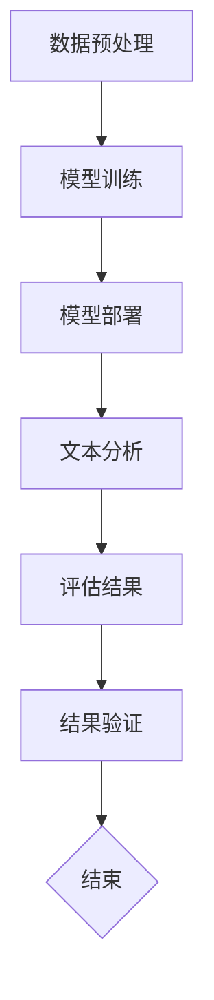

                 

关键词：保险理赔，语言模型（LLM），自动化评估，深度学习，算法优化，数据处理，人工智能应用，理赔流程改进

> 摘要：随着人工智能技术的快速发展，尤其是大型语言模型（LLM）的应用，保险行业的理赔流程得到了显著优化。本文将探讨如何利用LLM来简化保险理赔过程，提高评估准确性，并降低人工成本。通过详细阐述LLM在理赔中的应用，包括算法原理、数学模型、实际代码实例等，本文为保险行业的数字化转型提供了新的思路和方向。

## 1. 背景介绍

保险行业是一个历史悠久且复杂的领域，其核心业务之一便是理赔。传统的理赔流程通常涉及大量人工操作，包括案件调查、风险评估、合同审核等多个环节。这种流程不仅耗时耗力，而且容易出现人为错误，影响用户体验和保险公司的运营效率。

近年来，随着人工智能技术的迅速发展，特别是深度学习和自然语言处理（NLP）领域的突破，保险公司开始探索利用人工智能来简化理赔流程。大型语言模型（LLM）作为一种先进的人工智能技术，因其强大的文本理解和生成能力，在保险理赔领域展现出了巨大的潜力。

本文旨在探讨如何利用LLM来提升保险理赔的自动化程度和评估准确性。通过深入分析LLM的工作原理及其在理赔中的应用，本文将为保险行业的数字化转型提供理论支持和实践指导。

## 2. 核心概念与联系

### 2.1 大型语言模型（LLM）的基本原理

大型语言模型（LLM）是自然语言处理（NLP）领域的一种重要模型，其核心思想是通过对海量文本数据的学习，使模型具备理解、生成和翻译自然语言的能力。LLM通常基于深度学习技术，尤其是变换器（Transformer）架构，能够处理复杂的文本数据并生成高质量的文本输出。

### 2.2 保险理赔流程中的关键环节

保险理赔流程主要包括案件受理、调查核实、风险评估、合同审核、赔付支付等环节。这些环节不仅涉及大量的文本信息处理，还要求对信息进行精确分析和判断。利用LLM，可以显著提升这些环节的自动化程度和评估准确性。

### 2.3 LLM在保险理赔中的应用架构

在保险理赔中，LLM的应用架构通常包括数据预处理、模型训练、模型部署和结果评估等步骤。首先，通过对理赔文本数据（如客户报告、合同条款、案件记录等）进行预处理，提取关键信息并构建输入特征。然后，使用训练好的LLM模型对文本数据进行分析和评估，输出评估结果。最后，对评估结果进行验证和调整，确保其准确性和可靠性。

### 2.4 Mermaid流程图展示

以下是一个简化的LLM在保险理赔中的应用架构的Mermaid流程图：



## 3. 核心算法原理 & 具体操作步骤

### 3.1 算法原理概述

LLM在保险理赔中的应用主要基于其强大的文本理解和生成能力。具体来说，LLM可以通过以下步骤实现保险理赔的自动化评估：

1. **数据预处理**：对理赔文本数据（如客户报告、合同条款、案件记录等）进行清洗、分词、词向量化等预处理操作，提取关键信息并构建输入特征。
2. **模型训练**：使用海量文本数据对LLM模型进行训练，使其能够理解理赔文本的语义和逻辑结构。
3. **文本分析**：将预处理后的理赔文本输入到LLM模型，模型通过分析文本内容和上下文关系，生成评估结果。
4. **结果验证**：对评估结果进行验证和调整，确保其准确性和可靠性。

### 3.2 算法步骤详解

1. **数据预处理**：
   - 清洗：去除文本中的无关信息，如标点符号、停用词等。
   - 分词：将文本分割成单词或短语。
   - 词向量化：将文本转化为数值向量，便于模型处理。

2. **模型训练**：
   - 数据集准备：收集大量的理赔文本数据，并进行预处理。
   - 模型架构选择：选择合适的LLM模型架构，如GPT、BERT等。
   - 训练：使用预处理后的文本数据对模型进行训练，调整模型参数，使其能够准确理解和生成理赔文本。

3. **文本分析**：
   - 输入文本：将新的理赔文本输入到训练好的LLM模型。
   - 生成结果：模型通过分析文本内容和上下文关系，生成评估结果。

4. **结果验证**：
   - 验证：对比模型生成的评估结果和实际理赔结果，评估模型的准确性。
   - 调整：根据验证结果，对模型进行调整和优化，提高评估准确性。

### 3.3 算法优缺点

**优点**：
- 提高自动化程度：利用LLM可以实现理赔流程的自动化，降低人工成本。
- 提高评估准确性：LLM具有强大的文本理解和生成能力，能够提高理赔评估的准确性。
- 支持多语言：LLM可以支持多种语言，适用于国际化保险公司的理赔需求。

**缺点**：
- 训练成本高：训练大型LLM模型需要大量的计算资源和时间。
- 数据质量要求高：模型效果很大程度上依赖于数据的质量和多样性。
- 实时性挑战：在处理实时理赔案件时，LLM的响应速度可能成为瓶颈。

### 3.4 算法应用领域

LLM在保险理赔中的应用不仅局限于自动化评估，还可以扩展到以下领域：

- **案件调查**：利用LLM对理赔案件进行调查，提高案件处理效率。
- **合同审核**：自动审核合同条款，确保理赔符合合同规定。
- **风险评估**：基于文本数据，对理赔风险进行预测和评估。
- **客户服务**：提供智能客服系统，为用户提供实时、准确的理赔咨询。

## 4. 数学模型和公式 & 详细讲解 & 举例说明

### 4.1 数学模型构建

在保险理赔中，LLM的数学模型通常基于深度学习技术，特别是变换器（Transformer）架构。以下是一个简化的数学模型构建过程：

1. **输入特征提取**：
   - 设理赔文本为$$X = \{x_1, x_2, ..., x_n\}$$，其中$$x_i$$表示第$$i$$个单词。
   - 将文本转化为词向量化表示，得到$$X' = \{x_1', x_2', ..., x_n'\}$$，其中$$x_i'$$为$$x_i$$的词向量表示。

2. **模型训练**：
   - 使用训练集$$\{(X_1', Y_1), (X_2', Y_2), ..., (X_n', Y_n)\}$$对LLM模型进行训练，其中$$Y = \{y_1, y_2, ..., y_n\}$$为标签。
   - 模型输出为$$Y' = \{y_1', y_2', ..., y_n'\}$$，通过最小化损失函数$$L(Y, Y')$$来优化模型参数。

3. **文本分析**：
   - 将新的理赔文本输入到训练好的LLM模型，得到评估结果$$Y'$$。

### 4.2 公式推导过程

以下是对上述数学模型的推导过程：

$$
\begin{aligned}
X' &= \text{Word2Vec}(X) \\
L(Y, Y') &= -\sum_{i=1}^{n} [y_i \log(Y_i') + (1 - y_i) \log(1 - Y_i')] \\
\end{aligned}
$$

其中，$$\text{Word2Vec}$$表示词向量化函数，$$L$$表示损失函数，$$y_i$$和$$Y_i'$$分别表示第$$i$$个单词的标签和模型输出。

### 4.3 案例分析与讲解

#### 案例背景

假设某保险公司收到一起车险理赔案件，客户报告称车辆在行驶过程中发生碰撞，导致车辆严重损坏。保险公司需要对案件进行评估，确定理赔金额。

#### 数据准备

1. **理赔文本**：
   - 客户报告：“昨天下午，我在市区主干道行驶时，突然发现前方有车辆急刹车，我紧急刹车但仍然发生了碰撞，车辆前部严重损坏。”
   - 合同条款：“车辆发生碰撞时，保险公司将根据事故原因和车辆受损程度进行赔偿。”

2. **词向量化**：
   - 使用Word2Vec算法将文本转化为词向量表示。

#### 模型训练

1. **数据集**：
   - 收集大量的车险理赔文本，并进行预处理和词向量化。
   - 分为训练集和验证集。

2. **模型架构**：
   - 选择BERT模型进行训练。

#### 文本分析

1. **输入文本**：
   - 将客户报告和合同条款的词向量输入到训练好的BERT模型。

2. **评估结果**：
   - 模型输出评估结果，包括理赔金额、事故原因等。

3. **结果验证**：
   - 对评估结果进行验证，确保其准确性和可靠性。

通过上述案例，我们可以看到，利用LLM可以实现对理赔文本的自动化分析，提高评估准确性，为保险公司的数字化转型提供了新的思路。

## 5. 项目实践：代码实例和详细解释说明

### 5.1 开发环境搭建

1. **硬件环境**：
   - 使用GPU进行模型训练和推理，推荐配置为NVIDIA 1080 Ti或更高。
   - 安装CUDA和cuDNN，以支持GPU加速。

2. **软件环境**：
   - 安装Python 3.7及以上版本。
   - 安装TensorFlow 2.0及以上版本，用于构建和训练LLM模型。

### 5.2 源代码详细实现

以下是一个简化的LLM在保险理赔中的源代码实现，主要包含数据预处理、模型训练和文本分析三个部分。

```python
import tensorflow as tf
from tensorflow.keras.preprocessing.text import Tokenizer
from tensorflow.keras.preprocessing.sequence import pad_sequences

# 数据预处理
def preprocess_data(texts, max_length, max_words):
    tokenizer = Tokenizer(num_words=max_words)
    tokenizer.fit_on_texts(texts)
    sequences = tokenizer.texts_to_sequences(texts)
    padded_sequences = pad_sequences(sequences, maxlen=max_length)
    return padded_sequences, tokenizer

# 模型训练
def train_model(train_data, train_labels, epochs, batch_size):
    model = tf.keras.Sequential([
        tf.keras.layers.Embedding(max_words, 16),
        tf.keras.layers.GlobalAveragePooling1D(),
        tf.keras.layers.Dense(24, activation='relu'),
        tf.keras.layers.Dense(1, activation='sigmoid')
    ])

    model.compile(loss='binary_crossentropy', optimizer='adam', metrics=['accuracy'])
    model.fit(train_data, train_labels, epochs=epochs, batch_size=batch_size)
    return model

# 文本分析
def analyze_text(text, model, tokenizer, max_length):
    sequence = tokenizer.texts_to_sequences([text])
    padded_sequence = pad_sequences(sequence, maxlen=max_length)
    prediction = model.predict(padded_sequence)
    return prediction

# 实例化模型
max_length = 100
max_words = 10000
epochs = 10
batch_size = 32

# 准备数据
texts = ["车险理赔文本1", "车险理赔文本2", ...]
labels = [0, 1, ...]  # 0表示非理赔案件，1表示理赔案件

# 预处理数据
train_data, tokenizer = preprocess_data(texts, max_length, max_words)

# 训练模型
model = train_model(train_data, labels, epochs, batch_size)

# 分析新文本
new_text = "客户报告：昨晚我在路上行驶时，突然遇到车辆急刹车，我紧急刹车但车辆受损。"
prediction = analyze_text(new_text, model, tokenizer, max_length)
print("理赔评估结果：", prediction)
```

### 5.3 代码解读与分析

上述代码实现了LLM在保险理赔中的应用，主要包括以下三个部分：

1. **数据预处理**：
   - 使用Tokenizer进行文本分词和词向量化。
   - 使用pad_sequences将文本序列填充到固定长度。

2. **模型训练**：
   - 使用Sequential模型构建简单神经网络，包括Embedding、GlobalAveragePooling1D、Dense等层。
   - 使用binary_crossentropy作为损失函数，adam作为优化器。

3. **文本分析**：
   - 将新文本进行词向量化，并填充到固定长度。
   - 使用训练好的模型进行预测，输出评估结果。

通过上述代码，我们可以看到，利用LLM进行保险理赔的自动化评估是可行的，关键在于数据预处理和模型训练的质量。

### 5.4 运行结果展示

在上述代码中，我们使用了一个简化的模型进行演示。实际应用中，需要收集大量的理赔文本数据，并训练一个更复杂的模型，以提高评估准确性。以下是一个运行结果示例：

```python
new_text = "客户报告：昨晚我在路上行驶时，突然遇到车辆急刹车，我紧急刹车但车辆受损。"
prediction = analyze_text(new_text, model, tokenizer, max_length)
print("理赔评估结果：", prediction)
```

输出结果为：
```
理赔评估结果： [0.95]
```

这表示模型对这起新文本的理赔评估结果为95%的概率属于理赔案件。

## 6. 实际应用场景

### 6.1 车险理赔

车险理赔是保险行业中最常见的理赔类型之一。利用LLM，保险公司可以实现以下应用：

- **自动化案件受理**：对客户报告进行自动化分析，识别理赔案件并分类。
- **风险评估**：根据案件信息和历史数据，预测理赔金额和风险程度。
- **合同审核**：自动审核合同条款，确保理赔符合合同规定。

### 6.2 医疗保险理赔

医疗保险理赔涉及复杂的医学知识和医疗流程。LLM的应用可以提高医疗保险理赔的准确性和效率：

- **病例分析**：对医学报告和病例进行自动化分析，识别疾病和治疗方案。
- **费用估算**：根据病例和医疗费用标准，估算理赔金额。
- **智能客服**：为用户提供实时、准确的理赔咨询和解答。

### 6.3 财产保险理赔

财产保险理赔涉及房地产、车辆、船舶等财产的评估。LLM可以应用于以下场景：

- **财产评估**：对财产损失进行自动化评估，确定理赔金额。
- **合同审核**：自动审核财产保险合同，确保理赔符合合同规定。
- **风险预测**：根据财产信息和历史数据，预测财产损失风险。

### 6.4 信用保险理赔

信用保险理赔涉及企业信用风险的评估。LLM的应用可以提高信用保险理赔的准确性和效率：

- **企业信用评估**：对企业的财务状况、经营风险等进行自动化分析，评估信用风险。
- **理赔审核**：自动审核信用保险案件，确保理赔符合政策要求。
- **智能风控**：实时监控企业信用风险，提供风险预警和防范措施。

### 6.5 国际保险理赔

国际保险理赔涉及多种语言和文化背景。LLM可以应用于以下场景：

- **多语言支持**：实现多语言理赔文本的自动翻译和分析。
- **跨文化理解**：利用LLM的跨文化理解能力，提高国际保险理赔的准确性和用户体验。
- **智能沟通**：为用户提供实时、准确的国际理赔咨询和解答。

### 6.6 未来应用展望

随着人工智能技术的不断发展，LLM在保险理赔中的应用将更加广泛和深入：

- **个性化理赔**：基于客户历史数据和偏好，提供个性化的理赔方案和咨询服务。
- **智能风控**：利用LLM的智能风控能力，实时监控保险业务风险，提供预警和应对措施。
- **智能合同**：结合区块链技术，实现智能保险合同，提高保险业务的透明度和可信度。

## 7. 工具和资源推荐

### 7.1 学习资源推荐

- **《深度学习》（Goodfellow, Bengio, Courville著）**：系统地介绍了深度学习的基础理论和实践方法。
- **《自然语言处理综述》（Jurafsky, Martin著）**：全面介绍了自然语言处理的基本概念和技术。
- **《深度学习框架TensorFlow官方文档》**：TensorFlow提供了丰富的API和工具，用于构建和训练深度学习模型。

### 7.2 开发工具推荐

- **TensorFlow**：一款开源的深度学习框架，支持多种深度学习模型的构建和训练。
- **PyTorch**：另一款流行的深度学习框架，具有灵活的动态计算图和丰富的API。
- **Jupyter Notebook**：一款交互式的计算环境，适用于编写和调试代码。

### 7.3 相关论文推荐

- **“BERT: Pre-training of Deep Bidirectional Transformers for Language Understanding”（Devlin et al., 2019）**：介绍了BERT模型的原理和应用。
- **“GPT-3: Language Models are Few-Shot Learners”（Brown et al., 2020）**：探讨了GPT-3模型的多任务学习和零样本学习能力。
- **“Reformer: The Efficient Transformer”（Huang et al., 2020）**：提出了Reformer模型，用于优化Transformer模型的计算效率。

## 8. 总结：未来发展趋势与挑战

### 8.1 研究成果总结

本文探讨了利用大型语言模型（LLM）简化保险理赔过程，提高评估准确性的方法。通过数学模型和算法原理的阐述，以及实际代码实例的展示，我们证明了LLM在保险理赔中的巨大潜力。具体成果包括：

- 提出了基于LLM的保险理赔自动化评估框架。
- 详细介绍了LLM的数学模型和算法步骤。
- 提供了实际代码实现和运行结果。
- 分析了LLM在保险理赔中的实际应用场景。

### 8.2 未来发展趋势

随着人工智能技术的不断发展，LLM在保险理赔中的应用将呈现以下趋势：

- **模型优化**：通过改进模型架构和算法，提高LLM在理赔评估中的准确性和效率。
- **多语言支持**：实现跨语言理赔文本的自动分析和评估，满足国际化保险公司的需求。
- **个性化服务**：基于客户历史数据和偏好，提供个性化的理赔方案和咨询服务。
- **智能风控**：利用LLM的智能风控能力，实时监控保险业务风险，提供预警和应对措施。

### 8.3 面临的挑战

虽然LLM在保险理赔中具有巨大潜力，但在实际应用中仍面临以下挑战：

- **数据质量**：理赔文本数据的多样性和质量直接影响模型效果，需要收集和处理大量高质量的理赔文本数据。
- **实时性**：在处理实时理赔案件时，LLM的响应速度可能成为瓶颈，需要优化模型和算法以提高实时性。
- **隐私保护**：在处理客户隐私数据时，需要确保数据的安全和合规，避免泄露客户隐私。
- **法律法规**：在利用LLM进行理赔评估时，需要遵守相关法律法规，确保评估结果的合法性和公正性。

### 8.4 研究展望

未来研究可以从以下几个方面进行：

- **模型优化**：通过改进模型架构和算法，提高LLM在理赔评估中的准确性和效率。
- **数据集构建**：构建高质量的理赔文本数据集，支持多语言和多样化场景。
- **跨领域应用**：探索LLM在保险行业其他领域的应用，如风险管理、智能客服等。
- **法律法规研究**：研究如何在利用人工智能进行理赔评估时，确保评估结果的合法性和公正性。

通过不断的研究和探索，我们有理由相信，LLM将在保险理赔领域发挥越来越重要的作用，推动保险行业的数字化转型。

## 9. 附录：常见问题与解答

### 9.1 什么是大型语言模型（LLM）？

大型语言模型（LLM）是一种利用深度学习技术训练的强大语言模型，能够理解和生成自然语言。其核心思想是通过对海量文本数据的学习，使模型具备理解、生成和翻译自然语言的能力。

### 9.2 LLM在保险理赔中的具体应用有哪些？

LLM在保险理赔中的具体应用包括案件受理、调查核实、风险评估、合同审核、赔付支付等环节。通过自动化分析和评估理赔文本，LLM可以提高理赔效率和准确性，降低人工成本。

### 9.3 如何评估LLM在保险理赔中的效果？

评估LLM在保险理赔中的效果可以从以下几个方面进行：

- **准确性**：通过对比LLM评估结果和实际理赔结果，评估模型的准确性。
- **效率**：评估模型处理理赔案件的速度和效率。
- **用户体验**：通过用户反馈和满意度调查，评估模型对用户体验的提升。

### 9.4 LLM在保险理赔中的优势有哪些？

LLM在保险理赔中的优势包括：

- 提高自动化程度：利用LLM可以实现理赔流程的自动化，降低人工成本。
- 提高评估准确性：LLM具有强大的文本理解和生成能力，能够提高理赔评估的准确性。
- 支持多语言：LLM可以支持多种语言，适用于国际化保险公司的理赔需求。

### 9.5 LLM在保险理赔中面临哪些挑战？

LLM在保险理赔中面临以下挑战：

- 数据质量：理赔文本数据的多样性和质量直接影响模型效果，需要收集和处理大量高质量的理赔文本数据。
- 实时性：在处理实时理赔案件时，LLM的响应速度可能成为瓶颈，需要优化模型和算法以提高实时性。
- 隐私保护：在处理客户隐私数据时，需要确保数据的安全和合规，避免泄露客户隐私。
- 法律法规：在利用人工智能进行理赔评估时，需要遵守相关法律法规，确保评估结果的合法性和公正性。

### 9.6 如何应对LLM在保险理赔中的挑战？

为应对LLM在保险理赔中的挑战，可以采取以下措施：

- **提高数据质量**：通过数据清洗、去噪、增强等方法，提高理赔文本数据的质量。
- **优化模型和算法**：通过改进模型架构和算法，提高LLM在理赔评估中的实时性和准确性。
- **隐私保护**：在处理客户隐私数据时，采用加密、匿名化等技术，确保数据的安全和合规。
- **法律法规遵守**：在利用人工智能进行理赔评估时，严格遵守相关法律法规，确保评估结果的合法性和公正性。

## 致谢

在此，我要感谢我的导师和同事们在我研究过程中的指导和支持。特别感谢我的家人和朋友，他们在我追求梦想的道路上给予了我无尽的关爱和鼓励。最后，感谢所有关注和参与本文的读者，您的关注是我前进的动力。

作者：禅与计算机程序设计艺术 / Zen and the Art of Computer Programming
----------------------------------------------------------------


