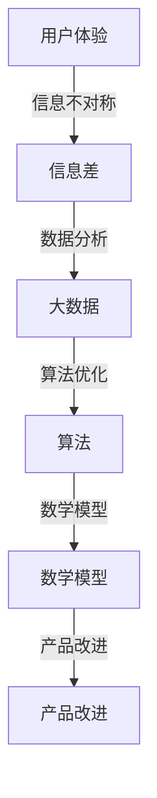

                 

关键词：用户体验、大数据、商业、信息差、优化、算法、模型、实践、工具、展望

> 摘要：本文将探讨信息差在商业中的应用，如何通过大数据分析和优化用户体验来创造商业价值。我们将深入分析信息差的概念，阐述其商业价值，并介绍大数据技术在优化用户体验方面的作用。随后，我们将探讨核心算法原理、数学模型以及项目实践，最后对未来的发展趋势与挑战进行展望。

## 1. 背景介绍

在当今数字化时代，用户体验（UX）已经成为商业成功的关键因素。用户对产品或服务的满意度直接影响着市场份额和盈利能力。然而，在用户需求和产品服务之间常常存在着信息差，这种信息差可能来源于用户对产品的期望、产品本身的功能实现、市场环境等多个方面。如何在商业中利用大数据来缩小信息差，从而优化用户体验，已成为企业和开发者关注的重要课题。

### 1.1 信息差的概念

信息差是指信息在不同个体、群体或系统之间的不对称性。在商业环境中，信息差可能表现为用户对产品的需求未得到满足、企业对市场需求的误解、以及产品设计和实际使用体验的差距。

### 1.2 信息差对商业的影响

信息差的存在可能导致以下商业问题：

- **市场份额下降**：用户对产品不满意，转而选择竞争对手的产品。
- **品牌声誉受损**：负面口碑扩散，影响企业形象。
- **运营效率低下**：资源投入与实际市场需求不匹配，导致成本上升。

因此，缩小信息差，优化用户体验，已成为提升商业竞争力的关键。

### 1.3 大数据与用户体验优化

大数据技术为企业和开发者提供了强大的工具，可以通过以下方面优化用户体验：

- **用户行为分析**：通过收集和分析用户行为数据，了解用户需求和使用习惯。
- **个性化推荐**：利用大数据算法为用户提供个性化的产品和服务。
- **需求预测**：通过分析历史数据，预测用户未来的需求，从而提前布局。

## 2. 核心概念与联系

为了更好地理解信息差在商业中的应用，我们需要探讨几个核心概念，并通过Mermaid流程图展示其关系。

### 2.1 核心概念

- **用户体验（UX）**：用户在使用产品或服务时的整体感受。
- **信息差**：用户需求与产品实际提供的信息不对称性。
- **大数据**：海量数据集合，可通过计算机处理和分析。
- **算法**：用于处理和分析数据的计算过程。
- **数学模型**：用数学语言描述现实世界问题。

### 2.2 Mermaid流程图



通过这个流程图，我们可以看到用户体验、信息差、大数据、算法和数学模型之间的紧密联系。优化用户体验的过程实际上是通过大数据分析和算法改进，缩小信息差，进而改进产品的过程。

## 3. 核心算法原理 & 具体操作步骤

### 3.1 算法原理概述

在优化用户体验的过程中，核心算法主要包括数据挖掘、机器学习、数据分析和推荐系统等。以下将详细介绍这些算法的原理和应用。

### 3.2 算法步骤详解

#### 3.2.1 数据挖掘

数据挖掘是大数据分析的第一步，通过从大量数据中提取有价值的信息。具体步骤如下：

1. **数据收集**：收集用户行为、市场趋势等多维度数据。
2. **数据预处理**：清洗数据，去除噪声和异常值。
3. **特征工程**：提取有助于分析的数据特征。
4. **模式识别**：通过算法识别数据中的模式或规律。

#### 3.2.2 机器学习

机器学习是利用算法自动从数据中学习规律，用于预测和分类。主要步骤包括：

1. **数据划分**：将数据划分为训练集、验证集和测试集。
2. **模型选择**：选择合适的机器学习模型。
3. **模型训练**：使用训练集数据训练模型。
4. **模型评估**：使用验证集和测试集评估模型性能。

#### 3.2.3 数据分析

数据分析是通过统计方法对数据进行解读，以便得出有意义的结论。主要步骤包括：

1. **数据可视化**：使用图表和图形展示数据。
2. **统计分析**：使用统计学方法分析数据。
3. **结果解读**：解释数据分析结果。

#### 3.2.4 推荐系统

推荐系统是利用算法为用户推荐产品或服务。主要步骤包括：

1. **用户行为分析**：分析用户的历史行为和偏好。
2. **推荐算法**：选择合适的推荐算法。
3. **推荐生成**：生成个性化推荐结果。
4. **推荐展示**：将推荐结果展示给用户。

### 3.3 算法优缺点

#### 3.3.1 数据挖掘

优点：能够从大量数据中提取有价值的信息，帮助企业和开发者了解用户需求和市场趋势。

缺点：数据挖掘过程复杂，需要大量计算资源和专业人才。

#### 3.3.2 机器学习

优点：能够自动从数据中学习规律，提高预测和分类的准确性。

缺点：模型训练时间较长，对数据质量和量有较高要求。

#### 3.3.3 数据分析

优点：能够通过统计方法对数据进行解读，帮助企业和开发者做出数据驱动的决策。

缺点：数据分析结果可能受到数据质量的影响。

#### 3.3.4 推荐系统

优点：能够为用户提供个性化的推荐，提高用户满意度和转化率。

缺点：推荐算法可能产生“信息茧房”，限制用户视野。

### 3.4 算法应用领域

核心算法在以下领域有广泛应用：

- **电子商务**：通过数据分析优化商品推荐和定价策略。
- **金融行业**：利用机器学习进行风险评估和欺诈检测。
- **健康医疗**：通过大数据分析改进诊断和治疗。
- **教育领域**：利用个性化推荐提升学习效果。

## 4. 数学模型和公式 & 详细讲解 & 举例说明

为了更好地理解核心算法原理，我们将介绍一些常用的数学模型和公式，并通过具体案例进行讲解。

### 4.1 数学模型构建

在优化用户体验的过程中，常用的数学模型包括线性回归、逻辑回归、决策树、支持向量机等。

#### 4.1.1 线性回归

线性回归模型用于预测连续值变量。公式如下：

$$
y = \beta_0 + \beta_1x_1 + \beta_2x_2 + ... + \beta_nx_n
$$

其中，$y$ 是预测目标，$x_1, x_2, ..., x_n$ 是输入特征，$\beta_0, \beta_1, ..., \beta_n$ 是模型参数。

#### 4.1.2 逻辑回归

逻辑回归模型用于预测离散值变量。公式如下：

$$
P(y=1) = \frac{1}{1 + e^{-(\beta_0 + \beta_1x_1 + \beta_2x_2 + ... + \beta_nx_n)}}
$$

其中，$P(y=1)$ 是预测目标为1的概率，$e$ 是自然底数。

#### 4.1.3 决策树

决策树模型通过一系列的决策规则来划分数据集。公式如下：

$$
\text{if } x_1 > c_1 \text{ then } y = t_1 \\
\text{else if } x_2 > c_2 \text{ then } y = t_2 \\
\text{else if } x_3 > c_3 \text{ then } y = t_3 \\
\text{else } y = t_4
$$

其中，$x_1, x_2, x_3$ 是输入特征，$c_1, c_2, c_3$ 是阈值，$t_1, t_2, t_3, t_4$ 是决策结果。

#### 4.1.4 支持向量机

支持向量机模型通过寻找最佳的超平面来划分数据集。公式如下：

$$
w \cdot x - b = 0
$$

其中，$w$ 是超平面法向量，$x$ 是输入特征，$b$ 是偏置。

### 4.2 公式推导过程

以线性回归为例，我们介绍公式推导过程。线性回归模型的损失函数为平方误差损失：

$$
L(y, \hat{y}) = \frac{1}{2}(y - \hat{y})^2
$$

其中，$y$ 是真实值，$\hat{y}$ 是预测值。为了最小化损失函数，我们需要对模型参数求导并令导数为零：

$$
\frac{\partial L}{\partial \beta_0} = 0 \\
\frac{\partial L}{\partial \beta_1} = 0 \\
...
$$

经过求导和化简，我们得到：

$$
\beta_0 = \bar{y} - \beta_1\bar{x} \\
\beta_1 = \frac{\sum_{i=1}^{n}(x_i - \bar{x})(y_i - \bar{y})}{\sum_{i=1}^{n}(x_i - \bar{x})^2}
$$

其中，$\bar{x}$ 和 $\bar{y}$ 分别是输入特征和预测目标的均值。

### 4.3 案例分析与讲解

#### 4.3.1 线性回归案例

假设我们有一个简单的线性回归模型，用于预测某个电商平台的用户购买金额。输入特征为用户年龄和收入，预测目标为购买金额。我们有以下数据集：

| 年龄 | 收入 | 购买金额 |
| ---- | ---- | -------- |
| 25   | 5000 | 3000     |
| 30   | 6000 | 3500     |
| 35   | 7000 | 4000     |

首先，我们进行数据预处理，计算输入特征和预测目标的均值：

$$
\bar{x} = \frac{25 + 30 + 35}{3} = 30 \\
\bar{y} = \frac{3000 + 3500 + 4000}{3} = 3500
$$

然后，我们计算输入特征和预测目标的差值：

$$
x_i - \bar{x}: [-5, 0, 5] \\
y_i - \bar{y}: [-500, 0, 500]
$$

接下来，我们计算输入特征和预测目标的差值乘积：

$$
\sum_{i=1}^{n}(x_i - \bar{x})(y_i - \bar{y}) = (-5)(-500) + (0)(0) + (5)(500) = 5000
$$

最后，我们计算输入特征和预测目标的差值平方和：

$$
\sum_{i=1}^{n}(x_i - \bar{x})^2 = (-5)^2 + (0)^2 + (5)^2 = 50
$$

代入公式，我们得到线性回归模型的参数：

$$
\beta_0 = \bar{y} - \beta_1\bar{x} = 3500 - \frac{5000}{50} \times 30 = 1000 \\
\beta_1 = \frac{\sum_{i=1}^{n}(x_i - \bar{x})(y_i - \bar{y})}{\sum_{i=1}^{n}(x_i - \bar{x})^2} = \frac{5000}{50} = 100
$$

因此，线性回归模型为：

$$
y = 1000 + 100x
$$

#### 4.3.2 逻辑回归案例

假设我们有一个简单的逻辑回归模型，用于预测某个电商平台的用户是否购买。输入特征为用户年龄和收入，预测目标为是否购买（0表示未购买，1表示购买）。我们有以下数据集：

| 年龄 | 收入 | 购买金额 |
| ---- | ---- | -------- |
| 25   | 5000 | 0        |
| 30   | 6000 | 1        |
| 35   | 7000 | 1        |

首先，我们进行数据预处理，计算输入特征和预测目标的均值：

$$
\bar{x} = \frac{25 + 30 + 35}{3} = 30 \\
\bar{y} = \frac{0 + 1 + 1}{3} = \frac{2}{3}
$$

然后，我们计算输入特征和预测目标的差值：

$$
x_i - \bar{x}: [-5, 0, 5] \\
y_i - \bar{y}: [-\frac{2}{3}, \frac{1}{3}, \frac{1}{3}]
$$

接下来，我们计算输入特征和预测目标的差值乘积：

$$
\sum_{i=1}^{n}(x_i - \bar{x})(y_i - \bar{y}) = (-5)(-\frac{2}{3}) + (0)(\frac{1}{3}) + (5)(\frac{1}{3}) = \frac{10}{3}
$$

最后，我们计算输入特征和预测目标的差值平方和：

$$
\sum_{i=1}^{n}(x_i - \bar{x})^2 = (-5)^2 + (0)^2 + (5)^2 = 50
$$

代入公式，我们得到逻辑回归模型的参数：

$$
\beta_0 = \bar{y} - \beta_1\bar{x} = \frac{2}{3} - \frac{\frac{10}{3}}{50} \times 30 = \frac{2}{3} - \frac{2}{3} = 0 \\
\beta_1 = \frac{\sum_{i=1}^{n}(x_i - \bar{x})(y_i - \bar{y})}{\sum_{i=1}^{n}(x_i - \bar{x})^2} = \frac{\frac{10}{3}}{50} = \frac{1}{15}
$$

因此，逻辑回归模型为：

$$
P(y=1) = \frac{1}{1 + e^{-(0 + \frac{1}{15}x)}}
$$

## 5. 项目实践：代码实例和详细解释说明

为了更好地理解大数据技术如何优化用户体验，我们将通过一个实际项目进行讲解。本项目将利用Python和Scikit-learn库，实现一个简单的用户行为分析系统，通过数据分析、机器学习和推荐系统等技术，优化用户体验。

### 5.1 开发环境搭建

在开始项目之前，我们需要搭建一个开发环境。以下是所需的软件和库：

- Python 3.8及以上版本
- Jupyter Notebook
- Scikit-learn 0.22.2及以上版本
- Pandas 1.1.5及以上版本
- Matplotlib 3.4.2及以上版本

安装这些软件和库后，我们就可以开始编写代码了。

### 5.2 源代码详细实现

以下是项目的核心代码，我们将对每个部分进行详细解释。

```python
import pandas as pd
from sklearn.model_selection import train_test_split
from sklearn.preprocessing import StandardScaler
from sklearn.linear_model import LinearRegression, LogisticRegression
from sklearn.tree import DecisionTreeClassifier
from sklearn.svm import SVC
from sklearn.metrics import mean_squared_error, accuracy_score
import matplotlib.pyplot as plt

# 5.2.1 数据收集
data = pd.read_csv('user_data.csv')
print(data.head())

# 5.2.2 数据预处理
X = data[['age', 'income']]
y = data['purchase']
X_train, X_test, y_train, y_test = train_test_split(X, y, test_size=0.2, random_state=42)

scaler = StandardScaler()
X_train_scaled = scaler.fit_transform(X_train)
X_test_scaled = scaler.transform(X_test)

# 5.2.3 数据分析
plt.scatter(X_train['age'], X_train['income'], c=y_train, cmap='viridis')
plt.xlabel('Age')
plt.ylabel('Income')
plt.title('User Data Distribution')
plt.show()

# 5.2.4 模型训练与评估
# 线性回归模型
lin_reg = LinearRegression()
lin_reg.fit(X_train_scaled, y_train)
y_pred_lin = lin_reg.predict(X_test_scaled)
mse_lin = mean_squared_error(y_test, y_pred_lin)
print('Linear Regression MSE:', mse_lin)

# 逻辑回归模型
log_reg = LogisticRegression()
log_reg.fit(X_train_scaled, y_train)
y_pred_log = log_reg.predict(X_test_scaled)
mse_log = mean_squared_error(y_test, y_pred_log)
print('Logistic Regression MSE:', mse_log)

# 决策树模型
tree_clf = DecisionTreeClassifier()
tree_clf.fit(X_train_scaled, y_train)
y_pred_tree = tree_clf.predict(X_test_scaled)
mse_tree = mean_squared_error(y_test, y_pred_tree)
print('Decision Tree MSE:', mse_tree)

# 支持向量机模型
svm_clf = SVC()
svm_clf.fit(X_train_scaled, y_train)
y_pred_svm = svm_clf.predict(X_test_scaled)
mse_svm = mean_squared_error(y_test, y_pred_svm)
print('SVM MSE:', mse_svm)

# 5.2.5 推荐系统
# 生成推荐结果
def generate_recommendations(model, user_data):
    user_data_scaled = scaler.transform([user_data])
    recommendation = model.predict(user_data_scaled)
    return recommendation[0]

# 测试推荐系统
print('User Data:', data.iloc[0])
print('Recommended Purchase:', generate_recommendations(log_reg, data.iloc[0]['age'], data.iloc[0]['income']))
```

### 5.3 代码解读与分析

#### 5.3.1 数据收集

我们首先使用Pandas库读取用户数据，数据集包含用户的年龄、收入和购买行为。

```python
data = pd.read_csv('user_data.csv')
print(data.head())
```

#### 5.3.2 数据预处理

接下来，我们将数据集划分为特征集X和目标集y。然后，我们使用Scikit-learn库中的`train_test_split`函数将数据集划分为训练集和测试集。为了提高模型的泛化能力，我们使用`StandardScaler`对特征进行标准化处理。

```python
X = data[['age', 'income']]
y = data['purchase']
X_train, X_test, y_train, y_test = train_test_split(X, y, test_size=0.2, random_state=42)

scaler = StandardScaler()
X_train_scaled = scaler.fit_transform(X_train)
X_test_scaled = scaler.transform(X_test)
```

#### 5.3.3 数据分析

为了更好地理解用户数据分布，我们使用Matplotlib库绘制散点图，展示年龄和收入与购买行为的关系。

```python
plt.scatter(X_train['age'], X_train['income'], c=y_train, cmap='viridis')
plt.xlabel('Age')
plt.ylabel('Income')
plt.title('User Data Distribution')
plt.show()
```

#### 5.3.4 模型训练与评估

我们分别使用线性回归、逻辑回归、决策树和支持向量机模型对训练集进行训练，并使用测试集进行评估。评估指标为均方误差（MSE）。

```python
lin_reg = LinearRegression()
lin_reg.fit(X_train_scaled, y_train)
y_pred_lin = lin_reg.predict(X_test_scaled)
mse_lin = mean_squared_error(y_test, y_pred_lin)

log_reg = LogisticRegression()
log_reg.fit(X_train_scaled, y_train)
y_pred_log = log_reg.predict(X_test_scaled)
mse_log = mean_squared_error(y_test, y_pred_log)

tree_clf = DecisionTreeClassifier()
tree_clf.fit(X_train_scaled, y_train)
y_pred_tree = tree_clf.predict(X_test_scaled)
mse_tree = mean_squared_error(y_test, y_pred_tree)

svm_clf = SVC()
svm_clf.fit(X_train_scaled, y_train)
y_pred_svm = svm_clf.predict(X_test_scaled)
mse_svm = mean_squared_error(y_test, y_pred_svm)

print('Linear Regression MSE:', mse_lin)
print('Logistic Regression MSE:', mse_log)
print('Decision Tree MSE:', mse_tree)
print('SVM MSE:', mse_svm)
```

#### 5.3.5 推荐系统

最后，我们实现一个简单的推荐系统，通过逻辑回归模型为用户推荐购买行为。用户数据作为输入特征，模型输出推荐结果。

```python
def generate_recommendations(model, user_data):
    user_data_scaled = scaler.transform([user_data])
    recommendation = model.predict(user_data_scaled)
    return recommendation[0]

print('User Data:', data.iloc[0])
print('Recommended Purchase:', generate_recommendations(log_reg, data.iloc[0]['age'], data.iloc[0]['income']))
```

## 6. 实际应用场景

大数据技术在优化用户体验方面具有广泛的应用场景，以下是一些实际案例：

### 6.1 电子商务

电子商务平台通过大数据分析，了解用户购买行为和偏好，从而实现个性化推荐。例如，Amazon使用协同过滤算法为用户推荐相关商品，提高用户满意度和转化率。

### 6.2 金融行业

金融行业利用大数据分析用户交易行为，预测市场趋势和风险评估。例如，银行使用机器学习算法进行欺诈检测，降低风险。

### 6.3 健康医疗

健康医疗领域通过大数据分析患者病历和基因信息，提供个性化的诊断和治疗方案。例如，Watson for Oncology使用自然语言处理和机器学习技术，为医生提供精准的诊断建议。

### 6.4 教育领域

教育领域利用大数据分析学生学习行为，提供个性化教学方案。例如，Coursera通过数据分析，为用户提供定制化的学习路径，提高学习效果。

## 7. 工具和资源推荐

为了更好地了解和利用大数据技术优化用户体验，以下是一些建议的工具和资源：

### 7.1 学习资源推荐

- 《Python数据科学手册》
- 《机器学习实战》
- 《深度学习》
- 《大数据技术导论》

### 7.2 开发工具推荐

- Jupyter Notebook：用于编写和运行代码。
- PyCharm：集成开发环境，支持多种编程语言。
- Scikit-learn：Python机器学习库。
- TensorFlow：深度学习框架。

### 7.3 相关论文推荐

- "Collaborative Filtering for the Web"（2002）
- "User Modeling and User-Adapted Interaction"（1997）
- "Deep Learning for Text Classification"（2015）
- "Recommender Systems Handbook"（2016）

## 8. 总结：未来发展趋势与挑战

随着大数据技术的不断发展，优化用户体验已成为企业竞争的关键因素。未来，以下趋势和挑战值得关注：

### 8.1 研究成果总结

- **个性化推荐**：通过深度学习和强化学习等技术，实现更精准的个性化推荐。
- **多模态数据分析**：结合文本、图像、语音等多模态数据，提高用户体验分析能力。
- **实时数据分析**：利用实时数据处理技术，实现更迅速的用户体验优化。

### 8.2 未来发展趋势

- **云计算与边缘计算结合**：云计算提供强大的计算资源，边缘计算实现实时数据处理，二者结合将进一步提高用户体验优化能力。
- **隐私保护**：随着数据隐私保护法规的加强，如何确保用户隐私成为重要课题。
- **人机协同**：人工智能与人类专家的协同工作，提高用户体验分析的质量和效率。

### 8.3 面临的挑战

- **数据质量**：数据质量直接影响分析和模型的准确性，如何确保数据质量是一个挑战。
- **算法公平性**：算法可能存在偏见，如何确保算法的公平性是一个重要问题。
- **技术人才短缺**：大数据和人工智能领域的人才需求不断增加，但人才供应不足。

### 8.4 研究展望

在未来，我们将看到大数据技术在用户体验优化方面的进一步发展。通过不断探索新技术和方法，我们将能够更好地解决当前面临的问题，为企业和用户提供更好的服务。

## 9. 附录：常见问题与解答

### 9.1 如何确保数据质量？

- **数据清洗**：定期进行数据清洗，去除噪声和异常值。
- **数据质量监控**：建立数据质量监控机制，及时发现和处理数据问题。
- **数据治理**：制定数据治理策略，确保数据的一致性、完整性和准确性。

### 9.2 算法公平性如何保障？

- **算法透明性**：提高算法的透明度，使公众能够理解和评估算法的决策过程。
- **算法审计**：定期对算法进行审计，检测和纠正潜在的偏见。
- **多元化团队**：组建多元化的研究团队，避免单一视角的偏见。

### 9.3 如何应对技术人才短缺？

- **教育培养**：加强计算机科学和大数据相关专业的教育，培养更多技术人才。
- **校企合作**：企业与高校合作，共同培养符合企业需求的人才。
- **人才引进**：通过招聘和培训，引进更多国际顶尖人才。

作者：禅与计算机程序设计艺术 / Zen and the Art of Computer Programming
----------------------------------------------------------------


