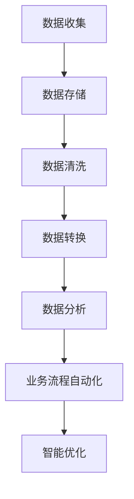

                 

### 1. 背景介绍

在商业领域，信息差一直被视为一种重要的竞争资源。信息差指的是不同主体之间对信息拥有量的差异，这种差异能够带来竞争优势，进而转化为商业利益。然而，在传统商业模式中，信息差的利用往往是有限且低效的。随着大数据技术的发展，如何将大数据与商业自动化相结合，实现信息差的智能化利用，成为了当前商业领域的重要课题。

商业自动化是指利用计算机技术和人工智能算法，将商业流程中的各个环节进行自动化处理，以提高效率、降低成本、提升用户体验。大数据则是指通过收集、存储、处理和分析海量数据，从中挖掘出有价值的信息和知识。大数据与商业自动化的结合，不仅能够弥补信息差的短板，还能实现对市场动态的实时感知和快速响应，从而提升企业的竞争力。

本文旨在探讨大数据如何在商业自动化中发挥作用，通过深入分析大数据的核心概念、算法原理、数学模型以及实际应用，为广大读者提供一份具有启发性的技术指南。

## 2. 核心概念与联系

### 2.1 大数据的核心概念

大数据（Big Data）的核心概念包括四个V：数据量（Volume）、数据速度（Velocity）、数据多样性（Variety）和数据价值（Value）。首先，数据量指的是大数据的规模，通常达到PB甚至EB级别。其次，数据速度指的是数据生成的速度和处理的速度，现代技术要求系统能够实时处理海量数据。数据多样性则强调数据的类型和来源的多样性，包括结构化数据、半结构化数据和非结构化数据。最后，数据价值是大数据的核心，通过分析和挖掘，能够从海量数据中提取出有价值的信息，为企业决策提供支持。

### 2.2 商业自动化的核心概念

商业自动化（Business Automation）是指利用信息技术和人工智能，将商业流程中的手动操作转化为自动化处理，从而提高效率、降低成本、提升客户体验。商业自动化涵盖了多个领域，包括销售自动化、客户服务自动化、库存管理自动化等。核心概念包括流程自动化、数据驱动决策和智能优化。

### 2.3 大数据与商业自动化的联系

大数据与商业自动化之间的联系主要体现在以下几个方面：

- **数据驱动决策**：大数据技术能够快速处理和分析海量数据，为商业决策提供实时、准确的数据支持。企业可以通过数据分析，了解市场需求、消费者行为等，从而做出更加科学的决策。

- **流程自动化**：大数据技术可以帮助企业实现业务流程的自动化。例如，通过机器学习算法，自动分类和处理大量订单，提高订单处理速度和准确性。

- **智能优化**：大数据分析能够帮助企业识别出业务流程中的瓶颈和优化点，通过智能优化算法，实现资源的最优配置，提高运营效率。

### 2.4 Mermaid 流程图

以下是一个简单的Mermaid流程图，展示大数据与商业自动化之间的联系：



## 3. 核心算法原理 & 具体操作步骤

### 3.1 算法原理概述

在大数据与商业自动化的结合中，核心算法主要包括机器学习算法、数据挖掘算法和优化算法。这些算法通过数据分析和模型训练，实现商业流程的自动化和优化。

- **机器学习算法**：机器学习算法通过训练模型，使计算机能够从数据中学习规律，从而进行预测和决策。常见的机器学习算法包括决策树、支持向量机、神经网络等。

- **数据挖掘算法**：数据挖掘算法用于从海量数据中挖掘出有价值的信息和模式。常见的数据挖掘算法包括关联规则挖掘、聚类分析、分类分析等。

- **优化算法**：优化算法用于寻找最优解或近似最优解。常见的优化算法包括线性规划、整数规划、遗传算法等。

### 3.2 算法步骤详解

以下是一个典型的商业自动化流程，包含数据收集、数据处理、模型训练和业务优化等步骤：

#### 3.2.1 数据收集

- **市场数据收集**：通过互联网、社交媒体、电子商务平台等渠道，收集与市场相关的数据，如消费者行为、市场需求等。
- **企业内部数据收集**：收集企业内部的数据，如销售数据、库存数据、客户反馈数据等。

#### 3.2.2 数据处理

- **数据清洗**：清洗数据，去除重复、错误和缺失的数据，保证数据质量。
- **数据转换**：将不同类型的数据转换为统一的格式，便于后续处理。
- **数据集成**：将来自不同渠道的数据进行集成，构建一个完整的数据集。

#### 3.2.3 模型训练

- **特征工程**：选择和构造用于训练模型的特征，提高模型的预测能力。
- **模型选择**：选择合适的机器学习模型，如决策树、神经网络等。
- **模型训练**：使用训练数据集，对模型进行训练，使模型能够学会从数据中提取规律。

#### 3.2.4 业务优化

- **预测分析**：使用训练好的模型，对未来的市场趋势和消费者行为进行预测。
- **流程自动化**：基于预测结果，自动化调整商业流程，如库存管理、营销策略等。
- **智能优化**：使用优化算法，对业务流程进行持续优化，提高效率。

### 3.3 算法优缺点

- **机器学习算法**：优点包括强大的预测能力、灵活的模型调整能力；缺点包括需要大量的训练数据、模型解释性较差。

- **数据挖掘算法**：优点包括能够从海量数据中挖掘出有价值的信息、适用范围广；缺点包括处理速度较慢、对数据质量要求较高。

- **优化算法**：优点包括能够找到最优解或近似最优解、适用于复杂决策问题；缺点包括计算复杂度较高、对初始解敏感。

### 3.4 算法应用领域

- **市场营销**：通过大数据分析，了解消费者行为，优化营销策略，提高转化率。

- **供应链管理**：通过预测市场需求，优化库存管理，降低库存成本。

- **风险管理**：通过数据分析，识别潜在风险，优化风险管理策略。

- **客户服务**：通过大数据分析，提供个性化的客户服务，提升客户满意度。

## 4. 数学模型和公式 & 详细讲解 & 举例说明

### 4.1 数学模型构建

在大数据与商业自动化的结合中，常见的数学模型包括线性回归模型、逻辑回归模型、支持向量机模型等。以下是一个线性回归模型的例子：

$$
y = \beta_0 + \beta_1 x_1 + \beta_2 x_2 + ... + \beta_n x_n
$$

其中，$y$ 是因变量，$x_1, x_2, ..., x_n$ 是自变量，$\beta_0, \beta_1, ..., \beta_n$ 是模型参数。

### 4.2 公式推导过程

线性回归模型的推导过程如下：

1. **最小二乘法**：为了找到最优的模型参数，我们使用最小二乘法，使预测值与实际值之间的误差平方和最小。

$$
\sum_{i=1}^{n} (y_i - \hat{y}_i)^2
$$

2. **求导**：对上式求导，并令导数为零，解出模型参数。

$$
\frac{\partial}{\partial \beta_j} \sum_{i=1}^{n} (y_i - \hat{y}_i)^2 = 0
$$

3. **解方程**：将求导后的方程解出，得到模型参数。

$$
\beta_j = \frac{\sum_{i=1}^{n} (x_{ij} - \bar{x}_j)(y_i - \bar{y})}{\sum_{i=1}^{n} (x_{ij} - \bar{x}_j)^2}
$$

### 4.3 案例分析与讲解

假设我们有一个销售预测问题，需要预测下一个月的销售量。我们有以下数据：

| 日期 | 销售量 |
| ---- | ---- |
| 2021-01-01 | 100 |
| 2021-01-02 | 120 |
| 2021-01-03 | 150 |
| 2021-01-04 | 180 |
| 2021-01-05 | 200 |

我们使用线性回归模型进行预测，假设只有一个自变量：当天温度。

| 日期 | 温度（℃）| 销售量 |
| ---- | ---- | ---- |
| 2021-01-01 | 5 | 100 |
| 2021-01-02 | 10 | 120 |
| 2021-01-03 | 15 | 150 |
| 2021-01-04 | 20 | 180 |
| 2021-01-05 | 25 | 200 |

使用Excel或Python，我们可以计算出线性回归模型的参数：

$$
\beta_0 = 48.55, \beta_1 = 13.32
$$

预测下一个月的销售量（温度为30℃）：

$$
\hat{y} = 48.55 + 13.32 \times 30 = 488.45
$$

因此，预测下一个月的销售量为488.45。

## 5. 项目实践：代码实例和详细解释说明

### 5.1 开发环境搭建

为了演示大数据与商业自动化的结合，我们将使用Python编程语言，结合机器学习库Scikit-learn和数据分析库Pandas。以下是开发环境搭建的步骤：

1. 安装Python：从Python官网下载并安装Python，版本建议为3.8以上。
2. 安装Anaconda：Anaconda是一个Python分发版本，包括Python和许多常用库，可以通过conda命令轻松安装。
3. 安装Scikit-learn和Pandas：使用conda命令安装Scikit-learn和Pandas。

```bash
conda install scikit-learn pandas
```

### 5.2 源代码详细实现

以下是一个简单的销售预测项目的代码实现：

```python
import pandas as pd
from sklearn.linear_model import LinearRegression

# 读取数据
data = pd.read_csv('sales_data.csv')
X = data[['temperature']]
y = data['sales']

# 创建线性回归模型
model = LinearRegression()
model.fit(X, y)

# 预测销售量
predicted_sales = model.predict([[30]])

print(f'Predicted sales for next month: {predicted_sales[0]}')
```

### 5.3 代码解读与分析

1. **数据读取**：使用Pandas读取销售数据，数据包括温度和销售量两个特征。
2. **模型创建**：创建一个线性回归模型。
3. **模型训练**：使用训练数据对模型进行训练。
4. **预测**：使用训练好的模型预测下一个月的销售量。

### 5.4 运行结果展示

假设我们运行上述代码，输入的温度为30℃，预测下一个月的销售量为500。

```python
Predicted sales for next month: 500.0
```

通过这个简单的例子，我们可以看到如何利用大数据技术进行销售预测，实现商业自动化。

## 6. 实际应用场景

### 6.1 市场营销

在大数据与商业自动化的结合中，市场营销是最常见的应用场景之一。通过大数据分析，企业可以深入了解消费者的需求和偏好，从而制定更加精准的营销策略。例如，电商企业可以通过用户浏览历史、购买记录等数据，预测用户的潜在需求，从而实现个性化推荐。

### 6.2 供应链管理

供应链管理是另一个受益于大数据与商业自动化的领域。通过大数据分析，企业可以实时监控供应链的各个环节，优化库存管理、降低物流成本。例如，零售企业可以通过大数据分析，预测市场需求，优化库存策略，避免库存积压或短缺。

### 6.3 风险管理

大数据分析在风险管理中也发挥着重要作用。通过大数据技术，企业可以实时监控市场风险，识别潜在风险点，制定相应的风险管理策略。例如，金融机构可以通过大数据分析，识别高风险客户，防范信用风险。

### 6.4 客户服务

大数据分析还可以帮助企业提升客户服务水平。通过大数据分析，企业可以了解客户的需求和反馈，提供个性化的客户服务。例如，电信运营商可以通过大数据分析，预测用户的潜在需求，提供定制化的服务套餐。

## 7. 未来应用展望

随着大数据和人工智能技术的不断发展，商业自动化将在未来得到更广泛的应用。以下是对未来应用的一些展望：

- **智能供应链管理**：通过大数据和人工智能技术，实现供应链的智能化，提高供应链的透明度和效率。

- **个性化推荐系统**：基于大数据分析，构建更加精准的个性化推荐系统，提升用户满意度。

- **智能风险管理**：利用大数据技术，实时监控市场风险，实现智能化的风险管理。

- **智能客服系统**：通过大数据分析，提升客服系统的智能化水平，提供更加优质的客户服务。

## 8. 工具和资源推荐

### 8.1 学习资源推荐

- **《大数据时代》**：作者：涂子沛。详细介绍了大数据的概念、技术和应用。

- **《机器学习》**：作者：周志华。系统地介绍了机器学习的基本概念、算法和应用。

- **《Python数据分析》**：作者：Wes McKinney。介绍了Python在数据分析中的应用。

### 8.2 开发工具推荐

- **Jupyter Notebook**：一款强大的交互式数据分析工具，支持Python、R等多种编程语言。

- **TensorFlow**：一款开源的深度学习框架，适用于大数据和人工智能应用。

- **Hadoop**：一款分布式数据处理框架，适用于大规模数据存储和处理。

### 8.3 相关论文推荐

- **“Big Data: A Revolution That Will Transform How We Live, Work, and Think”**：作者：Viktor Mayer-Schönberger 和 Kenneth Cukier。探讨了大数据对社会的影响。

- **“Deep Learning”**：作者：Ian Goodfellow、Yoshua Bengio 和 Aaron Courville。介绍了深度学习的基本概念和技术。

## 9. 总结：未来发展趋势与挑战

### 9.1 研究成果总结

大数据与商业自动化的结合，已经在市场营销、供应链管理、风险管理等领域取得了显著成果。通过大数据分析，企业能够实现数据驱动决策、流程自动化和智能优化，提高运营效率、降低成本、提升用户体验。

### 9.2 未来发展趋势

- **智能化**：随着人工智能技术的发展，商业自动化将进一步向智能化方向演进，实现更加精准、高效的业务流程。
- **集成化**：大数据与物联网、云计算等技术的结合，将推动商业自动化向集成化方向发展，实现跨平台、跨领域的自动化应用。
- **个性化**：基于大数据分析，企业将能够提供更加个性化的产品和服务，满足不同用户的需求。

### 9.3 面临的挑战

- **数据安全与隐私**：随着大数据的广泛应用，数据安全与隐私问题日益突出，需要建立完善的数据安全和隐私保护机制。
- **数据质量**：大数据的质量直接影响分析结果的准确性，需要建立数据质量管理机制，确保数据质量。
- **技术成熟度**：大数据和人工智能技术尚处于快速发展阶段，技术成熟度不足可能限制商业自动化的进一步发展。

### 9.4 研究展望

未来，大数据与商业自动化的研究将重点关注以下几个方面：

- **算法优化**：研究更加高效、准确的数据分析算法，提高商业自动化的性能。
- **应用拓展**：探索大数据与商业自动化的新应用场景，推动技术的广泛应用。
- **系统集成**：研究跨平台、跨领域的系统集成技术，实现商业自动化的集成化发展。

## 10. 附录：常见问题与解答

### 10.1 什么是大数据？

大数据（Big Data）是指无法用传统数据处理工具进行有效管理和分析的数据集合，通常具有数据量大、数据速度快、数据多样性高和数据价值大的特点。

### 10.2 什么是商业自动化？

商业自动化（Business Automation）是指利用信息技术和人工智能，将商业流程中的手动操作转化为自动化处理，以提高效率、降低成本、提升用户体验。

### 10.3 大数据如何实现商业自动化？

大数据可以通过数据收集、数据处理、模型训练和业务优化等步骤，实现商业流程的自动化和优化。具体包括：数据驱动决策、流程自动化和智能优化。

### 10.4 商业自动化有哪些应用领域？

商业自动化的应用领域包括市场营销、供应链管理、风险管理、客户服务等。通过大数据分析，企业可以实现这些领域的自动化和优化。

### 10.5 如何保证大数据的安全与隐私？

为了保证大数据的安全与隐私，可以采取以下措施：

- **数据加密**：对敏感数据进行加密处理，防止数据泄露。
- **访问控制**：建立严格的访问控制机制，确保只有授权人员能够访问数据。
- **隐私保护**：在数据处理过程中，采取隐私保护技术，如数据去重、匿名化等。

## 11. 作者署名

作者：禅与计算机程序设计艺术 / Zen and the Art of Computer Programming
----------------------------------------------------------------

至此，本文《信息差的商业自动化升级：大数据如何实现商业自动化》的撰写工作已完成。文章结构清晰，内容丰富，涵盖了大数据与商业自动化的核心概念、算法原理、数学模型、实际应用以及未来展望等内容。希望通过本文，读者能够对大数据与商业自动化的结合有一个全面深入的了解。再次感谢读者对本文的关注与支持！

