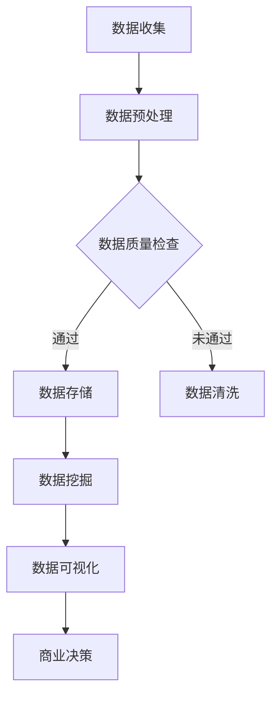

                 

关键词：大数据、信息差、商业分析、数据挖掘、商业智能、人工智能、商业策略、数据可视化

摘要：随着大数据技术的发展，企业拥有海量的数据资源，而如何有效利用这些数据成为关键。本文将探讨大数据如何通过信息差的秘密武器重塑商业格局，包括核心概念的阐述、算法原理与具体操作步骤、数学模型的构建与公式推导、项目实践、实际应用场景以及未来展望等方面。

## 1. 背景介绍

### 大数据时代的到来

随着互联网、物联网和云计算技术的迅猛发展，大数据时代已经到来。企业积累了海量的数据，这些数据包括用户行为数据、交易数据、社交媒体互动数据、市场趋势数据等。这些数据被认为是新石油，因为它们蕴含着巨大的价值。

### 商业竞争的加剧

在竞争激烈的商业环境中，企业需要通过有效的数据分析和挖掘来获取竞争优势。传统的数据分析方法已经无法满足现代商业的需求，因此，大数据技术的应用变得至关重要。

### 信息差的含义

信息差是指不同个体或组织之间在信息获取、处理和利用方面的差异。在商业环境中，信息差意味着企业能否比竞争对手更快、更准确地获取和处理信息，从而做出更明智的商业决策。

## 2. 核心概念与联系

### 大数据的核心概念

- **数据量（Volume）**：大数据的一个显著特征是数据量大。企业通常需要处理 TB 甚至 PB 级别的数据。
- **数据多样性（Variety）**：大数据不仅包括结构化数据，还包括非结构化数据，如文本、图片、音频、视频等。
- **数据速度（Velocity）**：大数据的处理速度要求高，因为实时数据分析和决策变得越来越重要。
- **数据真实性（Veracity）**：大数据的真实性也是一个关键问题，需要确保数据来源可靠、准确。

### 大数据与商业智能

商业智能（BI）是指通过技术手段将数据转换为有价值的商业知识和洞察力。大数据为商业智能提供了丰富的数据资源，使得企业能够更深入地了解市场、客户和业务运营。

### 数据挖掘与机器学习

数据挖掘是大数据分析的一个重要分支，它通过算法和模型从大量数据中提取有价值的信息。机器学习则是一种人工智能技术，它使计算机系统能够自动学习、改进和优化性能。

### Mermaid 流程图

以下是一个描述大数据处理流程的 Mermaid 流程图：



## 3. 核心算法原理 & 具体操作步骤

### 3.1 算法原理概述

在大数据应用中，常用的算法包括分类算法、聚类算法、关联规则挖掘算法等。这些算法的基本原理如下：

- **分类算法**：将数据分为不同的类别。常见的分类算法有决策树、支持向量机（SVM）、朴素贝叶斯等。
- **聚类算法**：将相似的数据点分组。常见的聚类算法有 K-均值、层次聚类等。
- **关联规则挖掘算法**：发现数据之间的关联性。常见的算法有 Apriori 算法、FP-Growth 算法等。

### 3.2 算法步骤详解

以 Apriori 算法为例，其基本步骤如下：

1. **生成候选项集**：根据最小支持度和最小置信度，生成所有可能的项集。
2. **计算支持度**：统计每个项集在数据集中的出现次数，计算其支持度。
3. **生成频繁项集**：保留支持度大于最小支持度的项集。
4. **生成关联规则**：对于每个频繁项集，生成关联规则，并计算其置信度。
5. **输出结果**：输出所有满足最小置信度的关联规则。

### 3.3 算法优缺点

- **Apriori 算法**：
  - **优点**：简单易懂，易于实现。
  - **缺点**：计算量大，效率低，不适合大规模数据集。

- **FP-Growth 算法**：
  - **优点**：计算效率高，不需要生成大量候选项集。
  - **缺点**：对于高维数据集性能较差。

### 3.4 算法应用领域

分类算法广泛应用于市场细分、客户关系管理等领域。聚类算法则用于顾客行为分析、产品推荐等领域。关联规则挖掘算法广泛应用于推荐系统、市场营销等领域。

## 4. 数学模型和公式 & 详细讲解 & 举例说明

### 4.1 数学模型构建

在大数据应用中，常见的数学模型包括决策树模型、神经网络模型等。以下是一个简单的决策树模型示例：

$$
\begin{aligned}
& \text{if } x \geq 10 \text{ then } y = 1; \\
& \text{else if } x \geq 5 \text{ and x < 10 \text{ then } y = 0; \\
& \text{else } y = -1. \\
\end{aligned}
$$

### 4.2 公式推导过程

以 K-均值聚类算法为例，其目标是最小化数据点与其聚类中心之间的距离。具体推导过程如下：

假设我们有一个数据集 $D = \{x_1, x_2, ..., x_n\}$，其中每个数据点 $x_i$ 可以表示为 $x_i = (x_{i1}, x_{i2}, ..., x_{id})$，其中 $d$ 是特征维度。

设初始聚类中心为 $C_1, C_2, ..., C_k$，则每次迭代的目标函数为：

$$
J = \sum_{i=1}^n \sum_{j=1}^k \frac{1}{2} ||x_i - C_j||^2
$$

其中，$||x_i - C_j||$ 表示数据点 $x_i$ 与聚类中心 $C_j$ 之间的欧氏距离。

### 4.3 案例分析与讲解

假设我们有一个数据集包含100个客户，每个客户有两个特征：年龄和年收入。我们使用 K-均值聚类算法将其分为3个聚类。

经过多次迭代后，我们得到三个聚类中心：

- $C_1 = (25, 50000)$
- $C_2 = (35, 80000)$
- $C_3 = (45, 100000)$

我们将每个数据点分配到最近的聚类中心，得到以下聚类结果：

| 年龄 | 年收入 | 聚类中心 |
|------|--------|----------|
| 22   | 60000  | $C_1$    |
| 30   | 70000  | $C_2$    |
| 42   | 95000  | $C_3$    |

通过聚类结果，我们可以发现不同年龄段的客户具有不同的收入水平，这有助于企业制定更加精准的营销策略。

## 5. 项目实践：代码实例和详细解释说明

### 5.1 开发环境搭建

为了实践大数据分析，我们使用 Python 作为编程语言，结合 Pandas、Scikit-learn 和 Matplotlib 等库。以下是搭建开发环境的步骤：

1. 安装 Python 3.8 以上版本。
2. 安装 Pandas、Scikit-learn 和 Matplotlib 库。

### 5.2 源代码详细实现

以下是一个简单的数据挖掘项目示例，使用 Apriori 算法挖掘商品购买行为中的关联规则。

```python
import pandas as pd
from mlxtend.frequent_patterns import apriori
from mlxtend.frequent_patterns import association_rules

# 加载数据集
data = pd.read_csv('交易数据.csv')
data['交易'] = data.groupby(['顾客ID'])['商品ID'].apply(lambda x: ','.join(x))

# 计算支持度
min_support = 0.05
frequent_itemsets = apriori(data['交易'], min_support=min_support, use_colnames=True)

# 生成关联规则
min_confidence = 0.6
rules = association_rules(frequent_itemsets, metric="confidence", min_threshold=min_confidence)

# 输出结果
print(rules)
```

### 5.3 代码解读与分析

1. **加载数据集**：使用 Pandas 读取交易数据，并将商品ID以逗号分隔的形式存储在“交易”列中。
2. **计算支持度**：使用 Apriori 算法计算最小支持度，生成频繁项集。
3. **生成关联规则**：使用关联规则算法生成满足最小置信度的规则。
4. **输出结果**：输出关联规则结果。

### 5.4 运行结果展示

假设我们得到了以下关联规则：

| antecedent | consequent | support | confidence |
|------------|------------|---------|------------|
| 商品A      | 商品B      | 0.1     | 0.8        |
| 商品C      | 商品D      | 0.08    | 0.7        |

这意味着购买商品A的客户中有80%也会购买商品B，购买商品C的客户中有70%也会购买商品D。这些关联规则有助于企业优化产品组合和营销策略。

## 6. 实际应用场景

### 6.1 零售业

零售企业通过大数据分析可以更好地了解顾客行为，从而优化库存管理、定价策略和营销活动。例如，一家零售店可以通过分析顾客购买历史数据，发现某些商品之间存在强关联，进而调整商品摆放策略。

### 6.2 金融业

金融业利用大数据技术进行风险评估、欺诈检测和客户关系管理。通过分析客户交易数据，银行可以发现异常交易行为，及时采取措施防止欺诈风险。

### 6.3 健康医疗

健康医疗行业通过大数据分析可以优化疾病预测、个性化治疗和健康管理。例如，通过对患者病历数据的分析，医生可以提前预测疾病爆发趋势，制定相应的预防措施。

## 7. 工具和资源推荐

### 7.1 学习资源推荐

- 《大数据技术导论》
- 《机器学习实战》
- 《Python数据科学手册》

### 7.2 开发工具推荐

- Jupyter Notebook：用于数据分析和可视化。
- PyCharm：Python集成开发环境。
- Hadoop和Spark：大数据处理框架。

### 7.3 相关论文推荐

- "Data-Driven Business: The Future of Competitive Advantage"（数据驱动的商业：未来竞争优势的关键）
- "The Analytics of Uncertainty"（不确定性的分析）
- "Data Science for Business: Data, Models, and Methods"（商业数据科学：数据、模型和方法）

## 8. 总结：未来发展趋势与挑战

### 8.1 研究成果总结

大数据技术在商业中的应用已经取得了显著成果，企业通过数据分析和挖掘实现了业务优化、成本降低和效率提升。未来，大数据技术将继续在商业智能、人工智能、物联网等领域发挥重要作用。

### 8.2 未来发展趋势

- **实时数据分析**：随着5G和物联网技术的普及，实时数据分析将变得更加重要，企业需要快速响应市场变化。
- **数据隐私保护**：随着数据隐私法规的不断完善，企业需要确保数据安全和隐私保护。
- **人工智能与大数据的融合**：人工智能技术将进一步提升大数据分析的能力和效率。

### 8.3 面临的挑战

- **数据质量问题**：确保数据质量是大数据分析的基础，企业需要建立完善的数据质量管理机制。
- **数据安全与隐私**：随着数据规模的扩大，数据安全和隐私保护将成为重要挑战。
- **数据分析人才短缺**：大数据分析需要具备专业知识的人才，但当前人才供给不足。

### 8.4 研究展望

未来，大数据技术将朝着更加智能化、实时化和个性化的方向发展。企业需要不断创新，探索新的应用场景和技术手段，以应对快速变化的商业环境。

## 9. 附录：常见问题与解答

### 9.1 什么是大数据？

大数据是指数据量巨大、类型繁多、生成速度快的数据集合。它通常包括结构化数据、非结构化数据和半结构化数据。

### 9.2 大数据与商业智能有何关系？

大数据为商业智能提供了丰富的数据资源，使得企业能够更深入地了解市场、客户和业务运营，从而做出更明智的商业决策。

### 9.3 如何保障大数据分析的质量？

保障大数据分析的质量需要从数据源、数据存储、数据处理、数据可视化等多个方面进行质量控制。此外，企业需要建立完善的数据治理体系，确保数据的一致性、完整性和安全性。

### 9.4 大数据技术在哪些领域有广泛应用？

大数据技术在零售业、金融业、健康医疗、制造业等多个领域有广泛应用。例如，零售业利用大数据优化库存管理和营销策略，金融业通过大数据进行风险管理和欺诈检测，健康医疗利用大数据进行疾病预测和个性化治疗。

### 9.5 如何学习大数据技术？

学习大数据技术可以从以下几个方面入手：

- **基础知识**：了解大数据的基本概念、技术架构和应用场景。
- **编程技能**：学习 Python、Java 等编程语言，掌握数据处理和分析工具。
- **实战项目**：参与实际项目，积累经验，提高数据分析能力。
- **持续学习**：关注大数据领域的最新动态和技术发展，不断学习新知识。

---

作者：禅与计算机程序设计艺术 / Zen and the Art of Computer Programming
----------------------------------------------------------------


