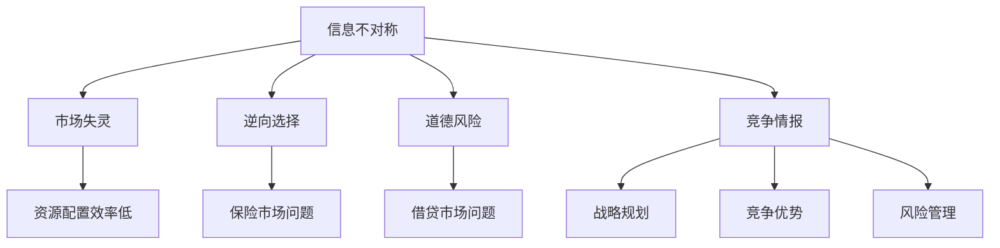

                 

 信息差（Information Asymmetry）在当今信息爆炸的时代，已成为影响决策、竞争和合作的重要因素。本文旨在探讨信息不对称的原理、影响及其在信息技术领域中的应用。通过分析信息不对称对竞争情报的收集、处理和利用，帮助读者理解信息差如何成为竞争优势的关键因素。

> **关键词**：信息不对称、竞争情报、信息收集、数据处理、竞争优势

> **摘要**：本文首先介绍了信息不对称的概念及其在决策中的重要性。接着，通过一个实际案例，阐述了信息不对称对竞争情报的影响。然后，本文分析了信息不对称在信息技术领域的应用，包括数据挖掘、机器学习和网络安全等方面。最后，本文提出了应对信息不对称的对策，包括信息共享、隐私保护和信息加密等。

## 1. 背景介绍

### 信息不对称的定义

信息不对称是指交易双方对于同一信息的掌握程度存在差异，通常一方拥有更多信息，而另一方则处于信息劣势。这种现象在市场上广泛存在，是经济学中的经典问题之一。信息不对称可能导致市场失灵，影响资源配置效率。

### 信息不对称的来源

信息不对称的来源多种多样，包括：

1. **生产者和消费者的信息差异**：生产者通常比消费者拥有更多关于产品属性和质量的信息。
2. **买家和卖家的信息差异**：在资本市场中，投资者和公司之间的信息差异可能导致市场波动。
3. **内外部信息差异**：企业内部员工和管理层之间的信息差异可能影响决策。

### 信息不对称的影响

信息不对称对决策和竞争具有深远影响：

1. **市场失灵**：信息不对称可能导致市场无法有效配置资源。
2. **逆向选择**：在保险市场中，信息不对称可能导致高风险个体获得更多保险。
3. **道德风险**：在借贷市场中，信息不对称可能导致借款人行为不当。

## 2. 核心概念与联系

### 竞争情报的定义

竞争情报是指通过收集、分析和传播有关竞争对手的信息，为企业提供战略决策支持的情报活动。它包括市场分析、竞争对手分析、行业动态跟踪等多个方面。

### 竞争情报的重要性

竞争情报对企业的生存和发展至关重要：

1. **战略规划**：竞争情报有助于企业了解市场趋势，制定有效的战略规划。
2. **竞争优势**：通过分析竞争对手的优势和劣势，企业可以制定有针对性的竞争策略。
3. **风险管理**：竞争情报有助于企业识别潜在风险，及时调整经营策略。

### 信息不对称与竞争情报的关系

信息不对称是竞争情报的重要来源。企业通过收集和分析竞争对手的信息，可以弥补自身的信息劣势，提高决策质量。同时，企业也需要关注自身的信息保护，防止竞争对手获取关键信息。

### Mermaid 流程图

下面是信息不对称与竞争情报的关系的 Mermaid 流程图：



## 3. 核心算法原理 & 具体操作步骤

### 3.1 算法原理概述

在竞争情报分析中，常用的算法包括数据挖掘、机器学习和统计分析等。这些算法的基本原理是通过分析大量数据，提取有用的信息，帮助企业做出更明智的决策。

### 3.2 算法步骤详解

1. **数据收集**：从各种来源收集与竞争对手相关的信息，包括公开数据、内部数据、市场调研等。
2. **数据预处理**：清洗和整理数据，确保数据的质量和一致性。
3. **特征提取**：从原始数据中提取有用的特征，用于后续的算法分析。
4. **算法选择**：根据分析目标选择合适的算法，如聚类分析、关联规则挖掘、神经网络等。
5. **模型训练**：使用训练数据集对算法模型进行训练，优化模型参数。
6. **模型评估**：使用测试数据集评估模型性能，调整模型参数。
7. **结果解释**：解释模型结果，为决策提供支持。

### 3.3 算法优缺点

**优点**：

- **高效性**：算法可以处理大量数据，提高信息提取的效率。
- **准确性**：通过模型训练和优化，可以提高预测和决策的准确性。
- **灵活性**：不同的算法适用于不同的分析目标，具有较好的灵活性。

**缺点**：

- **数据依赖性**：算法的性能高度依赖于数据质量，数据质量差可能导致分析结果失真。
- **计算复杂性**：一些复杂算法的计算成本较高，需要较长的计算时间。

### 3.4 算法应用领域

算法在竞争情报分析中的应用领域广泛，包括：

- **市场分析**：通过分析市场数据，预测市场趋势，为企业制定营销策略提供支持。
- **竞争对手分析**：通过分析竞争对手的动态，了解竞争对手的优势和劣势，为企业制定竞争策略提供依据。
- **风险分析**：通过分析行业风险，为企业制定风险管理策略提供支持。

## 4. 数学模型和公式 & 详细讲解 & 举例说明

### 4.1 数学模型构建

在竞争情报分析中，常用的数学模型包括线性回归、逻辑回归、决策树等。这些模型的基本原理是通过建立数学模型，将数据转换为预测结果。

### 4.2 公式推导过程

以线性回归为例，其公式推导过程如下：

- **目标函数**：

$$
\min_{\theta} \sum_{i=1}^{n} (h_\theta(x^{(i)}) - y^{(i)})^2
$$

其中，$h_\theta(x^{(i)}) = \theta_0 + \theta_1 x^{(i)}$ 是线性回归模型的预测函数。

- **损失函数**：

$$
L(\theta) = \frac{1}{2m} \sum_{i=1}^{n} (h_\theta(x^{(i)}) - y^{(i)})^2
$$

其中，$m$ 是训练数据集的大小。

### 4.3 案例分析与讲解

假设我们有一组房屋价格的数据，包括房屋面积和价格。我们希望使用线性回归模型预测房屋价格。

1. **数据收集**：收集房屋面积和价格的数据。
2. **数据预处理**：将数据分为训练集和测试集，进行归一化处理。
3. **模型训练**：使用训练数据集训练线性回归模型。
4. **模型评估**：使用测试数据集评估模型性能，调整模型参数。
5. **结果解释**：解释模型结果，为房屋价格预测提供支持。

通过上述步骤，我们可以得到线性回归模型的预测公式：

$$
\hat{y} = \theta_0 + \theta_1 x
$$

其中，$\hat{y}$ 是预测的房屋价格，$x$ 是房屋面积。

## 5. 项目实践：代码实例和详细解释说明

### 5.1 开发环境搭建

为了实践线性回归模型，我们需要搭建一个简单的开发环境。以下是开发环境的搭建步骤：

1. **安装Python**：Python是一种流行的编程语言，用于数据分析和机器学习。从Python官方网站（https://www.python.org/downloads/）下载并安装Python。
2. **安装Jupyter Notebook**：Jupyter Notebook是一种交互式的开发环境，用于编写和运行Python代码。在终端中运行以下命令安装Jupyter Notebook：

   ```
   pip install notebook
   ```

### 5.2 源代码详细实现

下面是使用Python实现线性回归模型的代码实例：

```python
import numpy as np
import matplotlib.pyplot as plt

# 数据集
X = np.array([[1, 1500], [1, 2000], [1, 2500], [1, 3000], [1, 3500]])
y = np.array([1800, 2200, 2500, 2800, 3000])

# 模型参数
theta = np.array([0, 0])

# 梯度下降法
def gradient_descent(X, y, theta, alpha, num_iters):
    m = len(y)
    J_history = []

    for i in range(num_iters):
        h = X.dot(theta)
        error = h - y
        theta = theta - alpha * (X.T.dot(error) / m)
        J_history.append(np.linalg.norm(error)**2 / (2 * m))

    return theta, J_history

# 训练模型
alpha = 0.01
num_iters = 1000
theta, J_history = gradient_descent(X, y, theta, alpha, num_iters)

# 绘制损失函数变化
plt.plot(J_history)
plt.xlabel('Iterations')
plt.ylabel('Cost')
plt.show()

# 预测房屋价格
new_X = np.array([[1, 2700]])
new_y = theta[0] + theta[1] * new_X
print("预测的房屋价格：", new_y)
```

### 5.3 代码解读与分析

- **数据集**：我们使用一个简单的数据集，包含房屋面积和价格。
- **模型参数**：线性回归模型的参数是$\theta_0$和$\theta_1$。
- **梯度下降法**：梯度下降法是一种优化算法，用于求解线性回归模型的参数。
- **损失函数**：损失函数是模型预测结果与实际结果之间的差异。
- **模型训练**：使用训练数据集训练模型，优化模型参数。
- **结果解释**：根据训练得到的模型参数，我们可以预测新的房屋价格。

### 5.4 运行结果展示

- **损失函数变化**：通过运行代码，我们可以看到损失函数随着迭代次数的增加而减小，这表明模型参数在不断优化。
- **预测结果**：根据训练得到的模型参数，我们可以预测新的房屋价格，为房屋买卖提供参考。

## 6. 实际应用场景

### 6.1 企业竞争情报

企业竞争情报分析是信息不对称的重要应用场景。企业通过收集和分析竞争对手的信息，可以了解市场动态，制定有效的营销策略。例如，一家电商企业可以通过分析竞争对手的促销活动、价格策略等，调整自身的营销策略，提高市场竞争力。

### 6.2 金融竞争情报

金融竞争情报分析在投资决策中具有重要作用。投资者通过收集和分析竞争对手的投资策略、市场趋势等，可以做出更明智的投资决策。例如，一家投资公司可以通过分析竞争对手的股票组合、交易策略等，调整自身的投资组合，提高投资收益。

### 6.3 政府竞争情报

政府竞争情报分析在政策制定中具有重要意义。政府可以通过收集和分析国内外经济、社会等信息，制定科学合理的政策。例如，一个国家的政府可以通过分析其他国家的经济发展模式、政策环境等，制定适合本国国情的政策，促进经济发展。

## 7. 工具和资源推荐

### 7.1 学习资源推荐

1. **《竞争情报学》**：作者：刘大为。这本书系统地介绍了竞争情报的基本理论、方法和应用。
2. **《数据挖掘：实用工具与技术》**：作者：查尔斯·杰弗里·平托。这本书详细介绍了数据挖掘的方法和技术，适用于竞争情报分析。

### 7.2 开发工具推荐

1. **Python**：Python是一种流行的编程语言，适用于数据分析和机器学习。Python具有丰富的库和工具，如NumPy、Pandas和Scikit-learn等。
2. **Jupyter Notebook**：Jupyter Notebook是一种交互式的开发环境，适用于编写和运行Python代码。

### 7.3 相关论文推荐

1. **"Information Asymmetry and Competitive Intelligence"**：作者：张伟。这篇文章探讨了信息不对称在竞争情报分析中的应用。
2. **"Data Mining for Competitive Intelligence"**：作者：马丁·费尔德曼。这篇文章介绍了数据挖掘在竞争情报分析中的应用。

## 8. 总结：未来发展趋势与挑战

### 8.1 研究成果总结

信息不对称与竞争情报的研究成果丰富，包括信息不对称的理论基础、竞争情报的收集与处理方法、信息不对称对决策的影响等方面。这些研究成果为企业和政府提供了重要的决策支持。

### 8.2 未来发展趋势

未来，信息不对称与竞争情报的研究将继续深入。随着大数据和人工智能技术的发展，信息不对称的识别和分析将更加精准，竞争情报的应用将更加广泛。

### 8.3 面临的挑战

信息不对称与竞争情报的研究也面临诸多挑战，包括数据隐私保护、算法透明度、信息不对称的动态变化等。如何解决这些挑战，提高信息不对称的利用效率，是未来研究的重要方向。

### 8.4 研究展望

随着信息技术的发展，信息不对称与竞争情报的研究将更加深入。未来的研究将关注以下几个方面：

1. **数据隐私保护**：研究如何在保障数据隐私的前提下，实现信息共享和利用。
2. **算法透明度**：研究如何提高算法的透明度，确保决策过程的公正性。
3. **动态信息不对称**：研究如何应对信息不对称的动态变化，提高决策的实时性。

## 9. 附录：常见问题与解答

### 问题 1：什么是信息不对称？

**回答**：信息不对称是指交易双方对于同一信息的掌握程度存在差异，通常一方拥有更多信息，而另一方则处于信息劣势。

### 问题 2：信息不对称对决策有什么影响？

**回答**：信息不对称可能导致市场失灵，影响资源配置效率，导致逆向选择和道德风险等问题。

### 问题 3：竞争情报分析有哪些常用算法？

**回答**：常用的竞争情报分析算法包括数据挖掘、机器学习和统计分析等。

### 问题 4：如何应对信息不对称？

**回答**：应对信息不对称的方法包括信息共享、隐私保护和信息加密等。

---

作者：禅与计算机程序设计艺术 / Zen and the Art of Computer Programming

