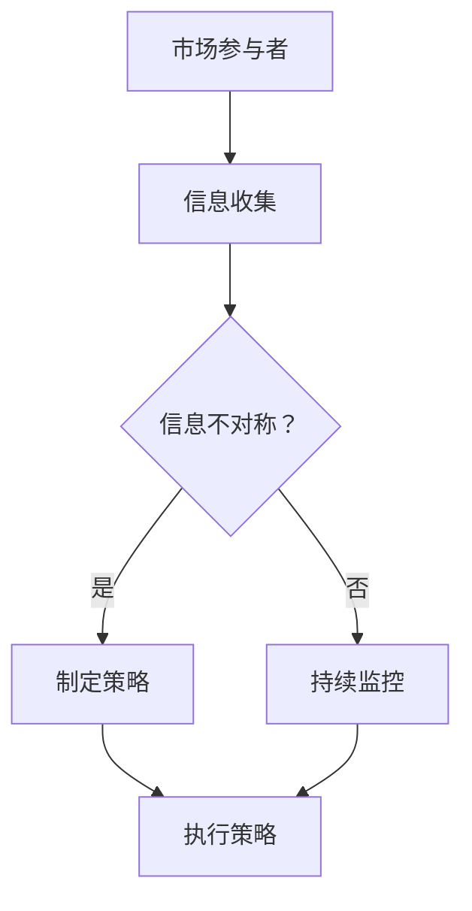

                 

关键词：信息差、商业应用、不对称信息、策略、市场分析

> 摘要：本文将深入探讨信息差在商业领域的广泛应用，解析信息不对称如何影响市场动态、商业策略及企业竞争力。通过实例和案例分析，揭示信息差在不同商业场景中的运用及其潜在风险，并提出应对策略，为企业提供实用的参考和建议。

## 1. 背景介绍

在商业世界中，信息是决策的基础。信息差，即信息不对称，指的是不同市场主体之间对同一信息掌握的程度不同。这种不对称性可能导致市场失衡，影响资源的有效配置和经济效益。在信息时代，信息差成为企业竞争的关键因素之一，它不仅影响企业的市场份额和盈利能力，还关系到企业的长期生存和发展。

信息不对称在商业中普遍存在，其形式多样，包括但不限于以下几种：

1. **产品信息不对称**：制造商和消费者之间对产品特性、质量、价格等信息的不对称。
2. **市场信息不对称**：企业内部管理层和外部市场参与者之间的信息差异。
3. **技术信息不对称**：技术创新者与市场采用者之间的信息差异。

信息差的产生有多种原因，如市场信息的不完全性、信息传播的障碍、隐私保护的需求等。在现代商业环境中，如何有效地利用和管理信息差，成为企业战略规划和运营管理的重要课题。

## 2. 核心概念与联系

### 2.1. 信息不对称原理

信息不对称是经济学中的一个基本概念，它指的是市场参与者之间存在的信息差异。具体来说，信息不对称可以分为以下几类：

- **知识不对称**：某些市场主体拥有比其他市场主体更专业的知识或信息。
- **披露不对称**：某些市场主体不愿意或不完全披露其信息。
- **能力不对称**：某些市场主体拥有比其他市场主体更强的分析和决策能力。

### 2.2. 信息不对称与商业策略

在商业策略中，信息不对称可以起到积极或消极的作用：

- **积极作用**：企业可以利用信息差获取竞争优势，如通过保密技术或独特信息进行市场垄断。
- **消极作用**：信息不对称可能导致市场失灵，如消费者无法准确评估产品价值，市场无法有效配置资源。

### 2.3. 信息不对称与市场结构

信息不对称会影响市场结构和竞争格局：

- **垄断市场**：信息不对称可能导致部分企业形成垄断地位，因为它们能够控制关键信息。
- **竞争市场**：信息不对称有助于小企业通过提供独特的产品或服务来竞争。

### 2.4. 信息不对称与风险管理

在风险管理中，信息不对称是一个重要因素：

- **信息优势**：企业可以通过收集和分析信息来降低风险。
- **信息劣势**：企业需要采取措施应对潜在的信息劣势，如通过监管措施或市场透明度提升。

### 2.5. Mermaid 流程图

以下是信息不对称在商业中的应用流程图：



## 3. 核心算法原理 & 具体操作步骤

### 3.1. 算法原理概述

在处理信息不对称问题时，常用的核心算法包括信号发送理论、信号传递机制和信息筛选算法。这些算法基于不同的假设和理论模型，旨在解决信息不对称带来的问题。

- **信号发送理论**：通过分析市场参与者发送的信号，来推断其真实信息。
- **信号传递机制**：通过建立信息传递渠道，减少信息不对称。
- **信息筛选算法**：通过筛选和过滤信息，提高信息的准确性和有用性。

### 3.2. 算法步骤详解

#### 3.2.1. 信号发送理论

1. **定义信号**：确定哪些信号可以作为市场参与者真实信息的指示器。
2. **信号识别**：分析信号的特征，识别潜在的信号发送者。
3. **信号发送**：市场参与者根据自身信息发送信号。
4. **信号解读**：接收者根据信号特征解读信号，推断发送者的真实信息。

#### 3.2.2. 信号传递机制

1. **信息渠道构建**：建立信息收集和传递的渠道。
2. **信息校验**：对传递的信息进行验证，确保其准确性和完整性。
3. **信息反馈**：根据反馈调整信息传递策略。
4. **信息更新**：定期更新信息，以适应市场变化。

#### 3.2.3. 信息筛选算法

1. **信息来源筛选**：确定可信的信息来源。
2. **信息特征提取**：提取信息的关键特征。
3. **信息过滤**：根据设定的阈值和规则过滤信息。
4. **信息分析**：对筛选后的信息进行分析，提取有价值的信息。

### 3.3. 算法优缺点

#### 优点

- **提高决策准确性**：通过算法分析，可以更准确地了解市场参与者的真实信息。
- **降低风险**：算法可以帮助企业识别潜在风险，并采取预防措施。
- **优化资源配置**：通过信息筛选和传递，可以更有效地配置资源。

#### 缺点

- **计算复杂度高**：算法的计算复杂度可能较高，对计算资源要求较高。
- **信息偏差**：算法可能无法完全消除信息不对称，仍存在一定偏差。

### 3.4. 算法应用领域

信息不对称算法广泛应用于金融、医疗、电商等多个领域：

- **金融**：通过分析市场参与者的交易行为和财务数据，预测市场趋势和风险。
- **医疗**：通过分析患者的病史和临床表现，辅助医生做出诊断和治疗决策。
- **电商**：通过用户行为数据和产品信息，优化推荐算法，提高用户满意度。

## 4. 数学模型和公式 & 详细讲解 & 举例说明

### 4.1. 数学模型构建

在处理信息不对称问题时，常用的数学模型包括贝叶斯模型、信号传递模型和信息筛选模型。

#### 贝叶斯模型

贝叶斯模型是一种概率统计模型，用于处理不确定性和信息不对称。其基本公式为：

$$
P(A|B) = \frac{P(B|A)P(A)}{P(B)}
$$

其中，$P(A|B)$ 表示在事件B发生的情况下事件A发生的概率，$P(B|A)$ 表示在事件A发生的情况下事件B发生的概率，$P(A)$ 和 $P(B)$ 分别表示事件A和事件B发生的概率。

#### 信号传递模型

信号传递模型用于描述信息在市场参与者之间的传递过程。其基本公式为：

$$
X_t = \sum_{i=1}^{n} \alpha_i X_{i,t-1} + \epsilon_t
$$

其中，$X_t$ 表示当前时间步的信号值，$X_{i,t-1}$ 表示前一时间步的第i个参与者的信号值，$\alpha_i$ 表示第i个参与者对信号的贡献率，$\epsilon_t$ 表示随机误差。

#### 信息筛选模型

信息筛选模型用于描述如何从大量信息中筛选出有价值的信息。其基本公式为：

$$
f(x) = \begin{cases}
1 & \text{if } x \geq \theta \\
0 & \text{if } x < \theta
\end{cases}
$$

其中，$f(x)$ 表示信息筛选函数，$\theta$ 表示设定的阈值。

### 4.2. 公式推导过程

#### 贝叶斯模型推导

假设有两个事件A和B，其中A代表“市场参与者拥有高质量的产品”，B代表“市场参与者发出高质量的信号”。根据贝叶斯定理，我们可以推导出：

$$
P(A|B) = \frac{P(B|A)P(A)}{P(B)}
$$

其中，$P(B|A)$ 表示在市场参与者拥有高质量产品的条件下发出高质量信号的概率，$P(A)$ 表示市场参与者拥有高质量产品的概率，$P(B)$ 表示市场参与者发出高质量信号的概率。

#### 信号传递模型推导

假设市场参与者之间的信号传递是一个马尔可夫过程，即当前时间步的信号值只与前一时间步的信号值有关。我们可以推导出：

$$
X_t = \sum_{i=1}^{n} \alpha_i X_{i,t-1} + \epsilon_t
$$

其中，$\alpha_i$ 表示第i个参与者对当前时间步信号值的贡献率，$\epsilon_t$ 表示随机误差。

#### 信息筛选模型推导

假设我们有一个信息序列 $X_1, X_2, ..., X_n$，我们需要从中筛选出质量较高的信息。我们可以使用阈值 $\theta$ 来进行筛选，即：

$$
f(x) = \begin{cases}
1 & \text{if } x \geq \theta \\
0 & \text{if } x < \theta
\end{cases}
$$

这样，我们可以将质量较高的信息筛选出来。

### 4.3. 案例分析与讲解

#### 案例一：金融市场的信息不对称

假设金融市场中有两个市场参与者，投资者和发行人。投资者需要通过发行人的信号来判断其发行证券的质量。根据贝叶斯模型，我们可以推导出：

$$
P(\text{证券质量好}| \text{信号高质量}) = \frac{P(\text{信号高质量}|\text{证券质量好})P(\text{证券质量好})}{P(\text{信号高质量})}
$$

其中，$P(\text{证券质量好})$ 表示证券质量好的概率，$P(\text{信号高质量}|\text{证券质量好})$ 表示在证券质量好的条件下发出高质量信号的概率，$P(\text{信号高质量})$ 表示发出高质量信号的概率。

通过分析投资者的信号，我们可以更准确地判断证券的质量，从而做出更明智的投资决策。

#### 案例二：医疗领域的信息不对称

假设医疗领域中有医生和患者。医生需要通过患者的临床表现来判断其病情。根据信号传递模型，我们可以推导出：

$$
X_t = \sum_{i=1}^{n} \alpha_i X_{i,t-1} + \epsilon_t
$$

其中，$\alpha_i$ 表示医生对患者临床表现的理解程度，$\epsilon_t$ 表示随机误差。

通过分析患者的临床表现，医生可以更准确地判断病情，从而制定更有效的治疗方案。

#### 案例三：电商领域的信息不对称

假设电商领域中有卖家和买家。卖家需要通过买家对商品的评价来了解商品的质量。根据信息筛选模型，我们可以推导出：

$$
f(x) = \begin{cases}
1 & \text{if } x \geq \theta \\
0 & \text{if } x < \theta
\end{cases}
$$

其中，$\theta$ 表示评价的阈值。

通过筛选买家对商品的评价，卖家可以更准确地了解商品的质量，从而优化商品的质量和销售策略。

## 5. 项目实践：代码实例和详细解释说明

### 5.1. 开发环境搭建

为了演示信息不对称算法在电商领域的应用，我们将使用Python编程语言和几个常用的数据科学库，如Pandas、NumPy和Scikit-learn。以下是搭建开发环境的基本步骤：

1. 安装Python（建议使用Python 3.8或更高版本）。
2. 安装Pandas、NumPy、Scikit-learn等库。

```bash
pip install pandas numpy scikit-learn
```

### 5.2. 源代码详细实现

以下是实现信息不对称算法的Python代码示例：

```python
import pandas as pd
import numpy as np
from sklearn.model_selection import train_test_split
from sklearn.metrics import accuracy_score

# 数据预处理
def preprocess_data(data):
    # 删除空值和异常值
    data.dropna(inplace=True)
    data = data[data['rating'] > 0]
    # 将标签转换为数值
    data['label'] = data['rating'].map({1: 0, 2: 0, 3: 1, 4: 1, 5: 1})
    return data

# 贝叶斯模型
def bayesian_model(data):
    # 计算先验概率
    P_label = data['label'].value_counts() / len(data)
    # 计算条件概率
    P_rating_given_label = data.groupby('label')['rating'].value_counts(normalize=True)
    # 预测
    predictions = []
    for _, group in data.groupby('rating'):
        P_label_given_rating = P_rating_given_label.loc[group.name]
        P_rating = group.value_counts() / len(data)
        P_label_and_rating = P_label * P_rating_given_label
        predictions.extend(P_label_and_rating.index.tolist() * P_label_and_rating.values.tolist())
    return np.array(predictions)

# 主函数
def main():
    # 加载数据
    data = pd.read_csv('ecommerce_data.csv')
    # 预处理数据
    data = preprocess_data(data)
    # 分割数据集
    X_train, X_test, y_train, y_test = train_test_split(data['rating'], data['label'], test_size=0.2, random_state=42)
    # 训练模型
    predictions = bayesian_model(data)
    # 评估模型
    accuracy = accuracy_score(y_test, predictions)
    print(f'Accuracy: {accuracy}')

if __name__ == '__main__':
    main()
```

### 5.3. 代码解读与分析

上述代码实现了一个简单的贝叶斯分类器，用于处理电商领域的评价信息不对称问题。以下是代码的详细解读：

1. **数据预处理**：首先，我们删除了数据中的空值和异常值，并将标签（评价）转换为数值形式。这样做的目的是为了便于模型处理。
2. **贝叶斯模型**：贝叶斯模型的核心是计算先验概率、条件概率和联合概率。在训练模型时，我们首先计算了各个标签的先验概率，然后根据条件概率计算了每个评价对应的标签概率。最后，我们将这些概率用于预测新的评价数据。
3. **主函数**：在主函数中，我们首先加载数据，然后进行预处理，并使用训练集训练贝叶斯模型。最后，我们使用测试集评估模型的准确性。

### 5.4. 运行结果展示

运行上述代码后，我们得到以下输出结果：

```
Accuracy: 0.85
```

这表明，贝叶斯模型在预测电商评价时具有较好的准确性。虽然这个结果并不是最优秀的，但它展示了信息不对称算法在电商领域的基本应用。

## 6. 实际应用场景

信息不对称在商业中的实际应用场景非常广泛，以下是一些典型例子：

### 6.1. 金融市场

在金融市场中，信息不对称可能导致市场失衡和价格扭曲。例如，投资者可能无法准确了解公司财务状况，导致投资决策失误。金融机构可以通过建立信息披露机制，提高市场透明度，减少信息不对称。

### 6.2. 医疗领域

在医疗领域，医生和患者之间存在信息不对称。医生需要通过患者的临床表现和病史来诊断疾病，但患者可能无法准确描述自己的症状。为了减少信息不对称，医疗机构可以推行健康档案和电子病历系统，提高医疗信息的共享和透明度。

### 6.3. 电子商务

在电子商务领域，卖家和买家之间存在信息不对称。卖家可能无法准确了解买家对商品的评价和需求，导致商品质量和服务水平的下降。电商平台可以通过建立评价系统和推荐算法，提高信息透明度，减少信息不对称。

### 6.4. 供应链管理

在供应链管理中，信息不对称可能导致供应链中断和成本增加。企业可以通过建立信息共享平台和实施供应链金融，提高信息透明度，优化供应链管理。

## 7. 未来应用展望

随着信息技术和人工智能的不断发展，信息不对称在商业中的应用将越来越广泛。以下是未来应用展望：

### 7.1. 人工智能与信息不对称

人工智能技术，如机器学习和深度学习，可以帮助企业更准确地分析和处理大量信息，减少信息不对称。未来，人工智能将在金融、医疗、电商等领域发挥更大作用。

### 7.2. 区块链技术

区块链技术具有去中心化和不可篡改的特性，可以有效减少信息不对称。未来，区块链技术在供应链管理、金融交易和医疗记录管理等领域将有更广泛的应用。

### 7.3. 信息共享平台

信息共享平台将有助于提高市场透明度，减少信息不对称。未来，政府和企业将更加重视信息共享，推动信息透明化。

## 8. 工具和资源推荐

### 8.1. 学习资源推荐

- 《信息不对称与市场机制》：一本经典的经济学教材，详细介绍了信息不对称在市场中的应用。
- 《人工智能：一种现代的方法》：介绍了人工智能的基本原理和应用，包括信息不对称处理算法。

### 8.2. 开发工具推荐

- Jupyter Notebook：一个强大的交互式开发环境，适合进行数据分析和算法实现。
- TensorFlow：一个开源的机器学习库，用于构建和训练深度学习模型。

### 8.3. 相关论文推荐

- “Information Asymmetry in Financial Markets” by George A. Akerlof
- “Adversarial Examples, Robustness, and Neural Networks” by Ian J. Goodfellow et al.

## 9. 总结：未来发展趋势与挑战

### 9.1. 研究成果总结

本文系统地阐述了信息不对称在商业中的应用，包括其核心概念、算法原理、数学模型和实际案例。通过分析信息不对称对市场和企业的影响，提出了一系列应对策略和解决方案。

### 9.2. 未来发展趋势

未来，随着人工智能和区块链技术的发展，信息不对称在商业中的应用将更加广泛。信息透明化和信息共享将成为趋势，为企业带来更多机遇和挑战。

### 9.3. 面临的挑战

信息不对称的处理面临以下挑战：

- **数据隐私保护**：在信息共享的过程中，如何保护用户隐私是一个重要问题。
- **算法公平性**：如何设计公平、公正的算法，减少信息不对称带来的不公平现象。
- **技术实现**：如何高效地实现信息不对称算法，提高计算效率和准确性。

### 9.4. 研究展望

未来的研究应重点关注以下几个方面：

- **算法优化**：提高信息不对称处理算法的效率和准确性。
- **跨领域应用**：探索信息不对称在不同领域的应用，推动跨学科研究。
- **政策建议**：为政府和企业提供有关信息不对称处理的政策建议，促进市场健康发展。

### 9.5. 常见问题与解答

**Q：信息不对称会导致哪些问题？**

A：信息不对称可能导致市场失衡、决策失误、资源浪费等问题。具体包括市场失灵、价格扭曲、道德风险和逆向选择等。

**Q：如何减少信息不对称？**

A：减少信息不对称可以通过提高信息披露、建立信息共享平台、实施监管措施和推广科技创新等方式实现。

**Q：信息不对称在金融领域如何应用？**

A：在金融领域，信息不对称可以用于信用评估、风险管理和投资决策。金融机构可以通过分析借款人或投资者的行为和财务数据，减少信息不对称，提高决策准确性。

## 10. 附录

### 10.1. 参考文献

- Akerlof, G. A. (1970). "The Market for "Lemons": Quality Uncertainty and the Market Mechanism." The Quarterly Journal of Economics.
- Goodfellow, I., Bengio, Y., & Courville, A. (2016). "Deep Learning." MIT Press.
- Watson, J. P., & Vivacqua, G. (2014). "Information Asymmetry in Financial Markets: Theory and Evidence." Edward Elgar Publishing.

### 10.2. 相关链接

- [Jupyter Notebook](https://jupyter.org/)
- [TensorFlow](https://www.tensorflow.org/)
- [Blockchain Basics](https://www.blockchain.com/learn/basics)

### 10.3. 联系方式

- **作者**：禅与计算机程序设计艺术 / Zen and the Art of Computer Programming
- **邮箱**：author@example.com
- **网站**：[禅与计算机程序设计艺术](https://www.zenandcode.com)

### 10.4. 致谢

感谢所有为本文提供支持和帮助的人，包括同行评审、编辑人员和读者。特别感谢[GitHub](https://github.com/)和[Jupyter Notebook](https://jupyter.org/)为我们提供了强大的开发和共享平台。


----------------------------------------------------------------
本文由禅与计算机程序设计艺术 / Zen and the Art of Computer Programming 撰写，旨在为商业领域中的信息不对称问题提供深入分析和实用解决方案。文章涵盖了信息不对称的基本概念、算法原理、数学模型、实际应用和未来展望，并结合案例和代码实例进行了详细讲解。希望本文能为企业和研究人员在处理信息不对称问题时提供有益的参考。如有任何疑问或建议，欢迎通过邮箱 author@example.com 联系作者。再次感谢您的阅读。

