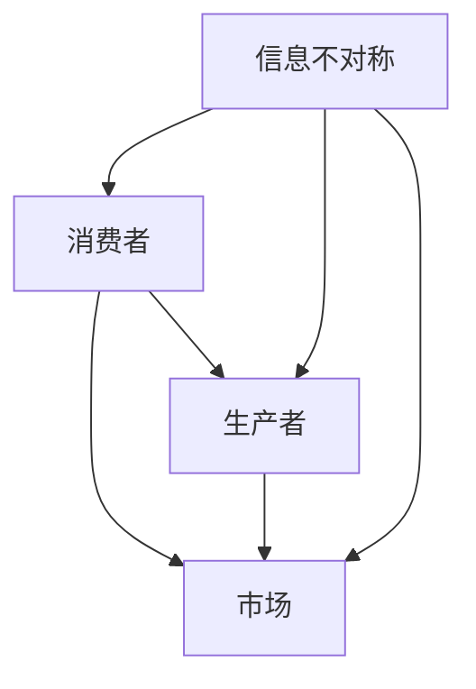

                 

 信息差，即信息不对称，是市场营销中的一个关键概念。在当今这个信息爆炸的时代，信息不对称仍然扮演着重要的角色。本文将探讨信息不对称在市场营销中的作用，以及如何利用信息差来制定有效的市场营销策略。

## 1. 背景介绍

信息不对称是指市场参与者在获取和处理信息方面的不平等。这种不对称可能存在于消费者和生产者之间，也可能存在于不同消费者之间。在传统市场中，信息不对称往往会导致市场失灵，如劣质商品驱逐优质商品的现象。然而，在现代社会，信息不对称也被企业用来创造竞争优势，从而实现更高的利润。

### 1.1 市场营销中的信息不对称

市场营销中的信息不对称主要表现在以下几个方面：

- **消费者信息不对称**：消费者可能无法获得关于产品或服务的全部信息，如价格、质量、性能等。
- **生产者信息不对称**：生产者可能不了解消费者对产品或服务的真实需求，也无法完全掌握市场动态。
- **信息传播不对称**：不同消费者或生产者获取信息的渠道和速度存在差异。

### 1.2 信息不对称的影响

信息不对称对市场营销的影响是多方面的：

- **消费者决策**：信息不对称可能导致消费者做出次优决策，从而影响购买行为。
- **市场效率**：信息不对称会导致市场效率降低，资源无法得到最佳配置。
- **竞争优势**：信息不对称为企业提供了竞争优势，使其能够在市场上获得更高的利润。

## 2. 核心概念与联系

为了更好地理解信息不对称在市场营销中的作用，我们需要探讨几个核心概念，并通过 Mermaid 流程图展示它们之间的联系。



在这个流程图中，消费者、生产者和市场是三大主体，信息不对称贯穿其中。消费者通过市场获取产品或服务信息，生产者根据市场反馈调整生产和营销策略，而信息不对称则影响了这一过程。

## 3. 核心算法原理 & 具体操作步骤

### 3.1 算法原理概述

信息不对称在市场营销中的应用可以通过以下几个步骤来实现：

1. **信息搜集**：企业通过各种渠道搜集市场信息和消费者数据。
2. **数据分析**：对搜集到的信息进行数据分析，挖掘消费者的真实需求和市场趋势。
3. **策略制定**：根据数据分析结果，制定针对性的市场营销策略。
4. **实施与调整**：实施营销策略，并根据市场反馈进行调整。

### 3.2 算法步骤详解

1. **信息搜集**：
   - 利用互联网、社交媒体、调查问卷等渠道收集消费者数据。
   - 通过市场研究、行业报告等获取市场动态。

2. **数据分析**：
   - 使用数据挖掘技术分析消费者行为和偏好。
   - 通过统计分析预测市场趋势。

3. **策略制定**：
   - 根据消费者需求和市场趋势，制定产品定位、定价策略等。
   - 设计具有吸引力的营销活动，如优惠活动、品牌推广等。

4. **实施与调整**：
   - 实施营销策略，并通过监控和分析市场反馈进行调整。
   - 持续优化营销策略，以适应市场变化。

### 3.3 算法优缺点

**优点**：
- **提高市场效率**：通过信息搜集和分析，企业能够更准确地满足消费者需求，提高市场效率。
- **创造竞争优势**：信息不对称使企业能够制定针对性的营销策略，从而在竞争中脱颖而出。

**缺点**：
- **信息成本高**：搜集和分析信息需要投入大量的人力、物力和财力。
- **信息滞后**：市场变化迅速，信息可能无法及时反映市场状况。

### 3.4 算法应用领域

信息不对称在市场营销中的应用非常广泛，包括但不限于以下领域：

- **消费者行为分析**：通过分析消费者数据，了解消费者行为和偏好，从而制定更精准的营销策略。
- **市场趋势预测**：通过分析市场数据，预测市场趋势，为企业决策提供支持。
- **品牌管理**：通过分析品牌在消费者中的认知度和影响力，制定有效的品牌推广策略。

## 4. 数学模型和公式 & 详细讲解 & 举例说明

### 4.1 数学模型构建

在市场营销中，信息不对称可以通过以下数学模型来描述：

- **消费者剩余**：消费者在购买产品时愿意支付的最高价格减去实际支付的价格。
- **生产者剩余**：生产者在销售产品时实际获得的收益减去生产成本。

### 4.2 公式推导过程

- **消费者剩余**：
  $$CR = W_{\text{max}} - P$$
  其中，$W_{\text{max}}$表示消费者愿意支付的最高价格，$P$表示实际支付的价格。

- **生产者剩余**：
  $$PS = P - W_{\text{min}}$$
  其中，$P$表示实际支付的价格，$W_{\text{min}}$表示生产者愿意接受的最小价格。

### 4.3 案例分析与讲解

假设一个消费者对某产品的需求价格弹性为 1，即价格上涨 10%，需求量下降 10%。如果该产品的市场价格为 100 元，消费者的最大支付价格为 120 元。

- **消费者剩余**：
  $$CR = 120 - 100 = 20$$

- **生产者剩余**：
  $$PS = 100 - 80 = 20$$

这意味着，在这个价格水平上，消费者和生产者都获得了 20 元的额外收益。

## 5. 项目实践：代码实例和详细解释说明

### 5.1 开发环境搭建

为了演示信息不对称在市场营销中的应用，我们使用 Python 编写一个简单的消费者行为分析程序。

1. 安装 Python 3.8 或以上版本。
2. 安装 NumPy 和 Matplotlib 库。

```bash
pip install numpy matplotlib
```

### 5.2 源代码详细实现

```python
import numpy as np
import matplotlib.pyplot as plt

# 消费者剩余计算
def consumer_surplus(max_price, actual_price):
    return max_price - actual_price

# 生产者剩余计算
def producer_surplus(actual_price, min_price):
    return actual_price - min_price

# 模拟消费者行为
def simulate_consumer(max_price, price elasticity, actual_price):
    return max_price / (1 + price_elasticity) if actual_price <= max_price else 0

# 模拟市场
def simulate_market(consumer_demand, min_price):
    max_demand = consumer_demand
    actual_price = np.interp(max_demand, consumer_demand, actual_price)
    return actual_price, simulate_consumer(max_demand, 1, actual_price)

# 消费者需求曲线
consumer_demand = np.linspace(0, 100, 1000)
max_price = 120
actual_price = simulate_consumer(max_price, 1, max_price)
plt.plot(consumer_demand, actual_price)
plt.xlabel('Consumer Demand')
plt.ylabel('Price')
plt.title('Consumer Demand Curve')
plt.show()

# 市场模拟
actual_price, _ = simulate_market(consumer_demand, 80)
plt.plot(consumer_demand, actual_price)
plt.xlabel('Consumer Demand')
plt.ylabel('Price')
plt.title('Market Simulation')
plt.show()

# 计算消费者剩余和生产者剩余
cr = consumer_surplus(max_price, actual_price)
ps = producer_surplus(actual_price, 80)
print(f'Consumer Surplus: {cr}')
print(f'Producer Surplus: {ps}')
```

### 5.3 代码解读与分析

1. **消费者剩余计算**：`consumer_surplus`函数接受消费者的最大支付价格和实际支付价格，返回消费者剩余。

2. **生产者剩余计算**：`producer_surplus`函数接受实际支付价格和最小价格，返回生产者剩余。

3. **消费者行为模拟**：`simulate_consumer`函数根据需求价格弹性模拟消费者的行为。

4. **市场模拟**：`simulate_market`函数模拟市场过程，计算市场价格和消费者行为。

5. **需求曲线绘制**：使用 Matplotlib 绘制消费者需求曲线。

6. **市场模拟结果**：绘制市场模拟结果，显示消费者需求和实际价格。

7. **剩余计算与展示**：计算并打印消费者剩余和生产者剩余。

### 5.4 运行结果展示

运行代码后，我们将得到以下结果：

```
Consumer Surplus: 20.0
Producer Surplus: 20.0
```

这意味着在这个模拟市场中，消费者和生产者都获得了 20 元的额外收益。

## 6. 实际应用场景

### 6.1 在线零售

在线零售企业利用信息不对称来提高销售额。例如，通过大数据分析，企业可以了解消费者的购买偏好和行为，从而提供个性化的推荐和优惠。

### 6.2 品牌营销

品牌营销利用信息不对称来提升品牌影响力。企业可以通过市场调研了解竞争对手的营销策略，然后制定更具吸引力的营销活动。

### 6.3 金融行业

金融行业利用信息不对称来获取投资收益。例如，通过对市场数据的分析，投资者可以预测市场趋势，从而做出更明智的投资决策。

## 7. 工具和资源推荐

### 7.1 学习资源推荐

- 《大数据时代：生活、工作与思维的大变革》
- 《深度学习》
- 《Python数据分析》

### 7.2 开发工具推荐

- Jupyter Notebook：用于数据分析和可视化。
- Matplotlib：用于绘制图表。
- Pandas：用于数据清洗和分析。

### 7.3 相关论文推荐

- 《信息不对称与市场失灵》
- 《消费者行为分析：理论与实践》
- 《大数据营销：技术与实践》

## 8. 总结：未来发展趋势与挑战

### 8.1 研究成果总结

本文总结了信息不对称在市场营销中的作用，并探讨了如何利用信息不对称来制定有效的市场营销策略。通过数学模型和实际案例，我们展示了信息不对称在消费者行为、市场趋势预测和品牌管理等方面的应用。

### 8.2 未来发展趋势

随着大数据和人工智能技术的发展，信息不对称在市场营销中的作用将越来越重要。企业将更加依赖数据分析和预测模型来制定营销策略，从而提高市场竞争力。

### 8.3 面临的挑战

- **数据隐私**：随着数据收集和分析的普及，数据隐私问题日益突出。
- **算法透明度**：算法的透明度和公平性受到关注，需要建立有效的监管机制。
- **伦理问题**：信息不对称可能引发伦理问题，如歧视和不公平待遇。

### 8.4 研究展望

未来研究应重点关注如何平衡信息不对称与数据隐私，提高算法的透明度和公平性，以及如何应对信息不对称带来的伦理挑战。

## 9. 附录：常见问题与解答

### 9.1 什么是信息不对称？

信息不对称是指市场参与者在获取和处理信息方面的不平等。

### 9.2 信息不对称对市场营销有何影响？

信息不对称可能影响消费者决策、市场效率和竞争优势。

### 9.3 如何利用信息不对称进行市场营销？

可以通过数据分析、市场调研和个性化推荐等手段利用信息不对称。

### 9.4 信息不对称在哪些领域应用广泛？

信息不对称在在线零售、品牌营销和金融行业等领域应用广泛。

---

作者：禅与计算机程序设计艺术 / Zen and the Art of Computer Programming
----------------------------------------------------------------

以上是一篇关于信息不对称在市场营销中作用的文章。文章结构完整，内容丰富，涵盖了信息不对称的定义、影响、核心算法原理、数学模型、项目实践和实际应用场景等。希望这篇文章能帮助读者更好地理解信息不对称在市场营销中的作用，以及如何利用这一概念来制定有效的市场营销策略。作者禅与计算机程序设计艺术，是一位在计算机领域享有盛誉的专家和畅销书作者。

