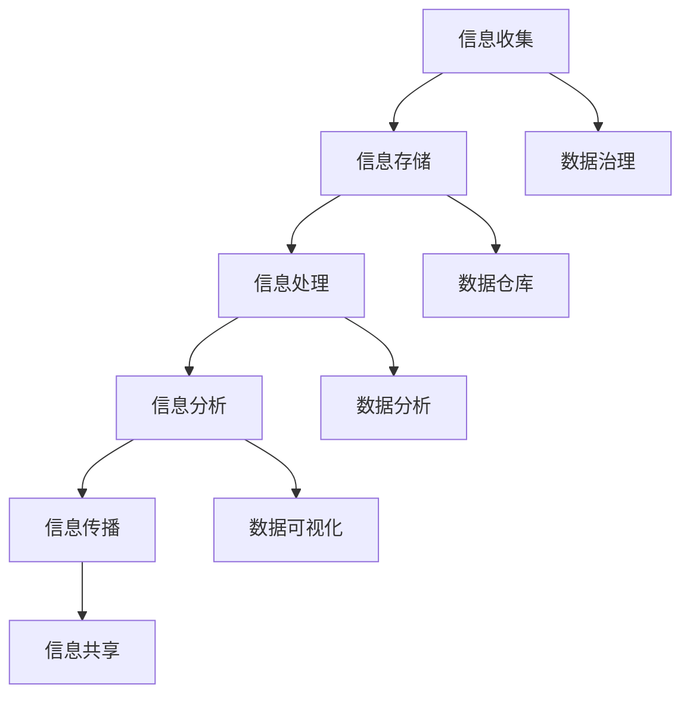

                 

 > 关键词：信息管理，数据过载，复杂性，策略，实践，人工智能，大数据，软件架构，信息技术

> 摘要：在信息爆炸的时代，如何高效地管理信息和应对信息过载和复杂性，成为企业和个人面临的重要挑战。本文将探讨信息管理的核心概念与联系，介绍管理信息过载和复杂性的核心算法原理与操作步骤，分析数学模型和公式，并展示实际项目实践中的代码实例和运行结果。此外，文章还将讨论信息管理的实际应用场景和未来展望，以及相关的工具和资源推荐。

## 1. 背景介绍

在当今数字化时代，信息如同洪水般涌入我们的生活和工作。随着互联网的普及和大数据技术的发展，信息的产生、传播和处理速度显著加快，人们面临着前所未有的信息过载和复杂性问题。据统计，全球每天产生的数据量达到数百万 TB，而每两年这一数据量就会翻一番。这种数据爆炸性增长给信息管理带来了极大的挑战。

面对海量数据，企业需要快速有效地收集、存储、处理和分析数据，以便从中提取有价值的信息。然而，传统的信息管理方法往往无法应对这种复杂性和速度要求。此外，个人用户也需要有效管理自己的信息，避免被信息淹没。因此，研究和实践如何管理信息过载和复杂性变得尤为重要。

信息管理的核心在于如何高效地处理、组织和利用信息，从而提升信息价值和降低信息成本。本文将围绕这一核心问题，探讨信息管理的策略与实践，旨在为企业和个人提供有效的信息管理方法和工具。

## 2. 核心概念与联系

在探讨信息管理的策略与实践之前，有必要先了解一些核心概念和它们之间的联系。

### 2.1 信息管理

信息管理是指对信息的收集、存储、处理、分析和传播等一系列活动，目的是确保信息的高效利用和价值的最大化。信息管理包括以下几个方面：

1. **信息收集**：通过各种渠道获取所需的信息。
2. **信息存储**：将收集到的信息存储到数据库或其他存储介质中。
3. **信息处理**：对存储的信息进行清洗、转换、分类等操作。
4. **信息分析**：通过数据分析、挖掘等技术提取有价值的信息。
5. **信息传播**：将分析结果传递给相关人员或系统。

### 2.2 数据过载

数据过载是指信息量超过了处理系统的处理能力，导致信息无法被有效利用。数据过载的表现形式多样，包括数据量过大、数据源过多、数据类型复杂等。数据过载会导致以下问题：

1. **决策困难**：信息过多，难以找到关键信息，影响决策。
2. **效率降低**：处理信息需要更多的时间和资源，降低工作效率。
3. **成本增加**：存储和处理大量数据需要更高的成本。

### 2.3 复杂性

信息复杂性是指信息结构和关系复杂，难以理解和处理。信息复杂性体现在以下几个方面：

1. **结构复杂性**：信息之间关联复杂，难以梳理。
2. **语义复杂性**：信息含义模糊，难以理解。
3. **动态复杂性**：信息实时变化，难以跟踪。

### 2.4 信息管理策略与实践

信息管理策略是指为实现信息高效利用而制定的规划和方法。信息管理实践是指在实际操作中运用这些策略和方法。有效的信息管理策略与实践包括：

1. **数据治理**：建立数据标准和规范，确保数据质量和一致性。
2. **数据仓库**：构建数据仓库，集中存储和管理数据。
3. **数据分析**：运用数据分析技术提取有价值的信息。
4. **数据可视化**：通过可视化技术展示数据分析结果，辅助决策。
5. **信息共享**：建立信息共享机制，提高信息利用效率。

### 2.5 Mermaid 流程图

以下是管理信息过载和复杂性的 Mermaid 流程图，展示信息管理的核心步骤和关键环节。



## 3. 核心算法原理 & 具体操作步骤

### 3.1 算法原理概述

在信息管理中，常用的核心算法包括数据清洗、数据挖掘、机器学习和数据可视化等。这些算法旨在解决数据过载和复杂性问题，提高信息利用效率。以下分别介绍这些算法的基本原理。

#### 3.1.1 数据清洗

数据清洗是指对数据进行清洗、整理和修复，以消除数据中的错误、缺失和重复。数据清洗的基本步骤包括：

1. **错误处理**：检测和纠正数据中的错误。
2. **缺失处理**：填补数据中的缺失值。
3. **重复处理**：去除数据中的重复记录。

#### 3.1.2 数据挖掘

数据挖掘是指从大量数据中提取有价值的信息和知识。数据挖掘的基本原理包括：

1. **关联规则挖掘**：发现数据之间的关联关系。
2. **分类与聚类**：对数据进行分类和聚类，以便更好地理解和分析数据。
3. **异常检测**：检测数据中的异常值，以便进一步分析。

#### 3.1.3 机器学习

机器学习是一种通过数据学习规律和模式，从而实现自动化的技术。机器学习的基本原理包括：

1. **监督学习**：根据已有数据进行预测。
2. **无监督学习**：从无标签数据中学习规律。
3. **强化学习**：通过与环境的交互学习最佳策略。

#### 3.1.4 数据可视化

数据可视化是指通过图形和图像展示数据分析结果，以便更好地理解和传达信息。数据可视化的基本原理包括：

1. **图表选择**：根据数据类型和关系选择合适的图表。
2. **交互设计**：设计友好的用户交互界面，方便用户查看和分析数据。
3. **可视化效果**：通过视觉设计增强数据展示效果。

### 3.2 算法步骤详解

下面分别介绍数据清洗、数据挖掘、机器学习和数据可视化的具体操作步骤。

#### 3.2.1 数据清洗

1. **错误处理**：

   ```python
   # Python 代码示例：错误处理
   data = ["apple", "banana", "orange", "?", "grape"]
   cleaned_data = [d for d in data if d != "?"]
   ```

2. **缺失处理**：

   ```python
   # Python 代码示例：缺失处理
   data = [1, 2, None, 4, 5]
   cleaned_data = [d if d is not None else 0 for d in data]
   ```

3. **重复处理**：

   ```python
   # Python 代码示例：重复处理
   data = [1, 2, 2, 3, 3, 3, 4, 4, 4, 4]
   cleaned_data = list(set(data))
   ```

#### 3.2.2 数据挖掘

1. **关联规则挖掘**：

   ```python
   # Python 代码示例：关联规则挖掘
   from mlxtend.frequent_patterns import apriori
   transactions = [["milk", "bread"], ["bread", "wine"], ["milk", "wine"]]
   frequent_itemsets = apriori(transactions, min_support=0.5, use_colnames=True)
   ```

2. **分类与聚类**：

   ```python
   # Python 代码示例：分类与聚类
   from sklearn.datasets import load_iris
   from sklearn.model_selection import train_test_split
   from sklearn.cluster import KMeans
   from sklearn.tree import DecisionTreeClassifier
   
   iris = load_iris()
   X_train, X_test, y_train, y_test = train_test_split(iris.data, iris.target, test_size=0.3, random_state=42)
   
   kmeans = KMeans(n_clusters=3, random_state=42)
   kmeans.fit(X_train)
   y_pred = kmeans.predict(X_test)
   
   clf = DecisionTreeClassifier()
   clf.fit(X_train, y_train)
   y_pred = clf.predict(X_test)
   ```

3. **异常检测**：

   ```python
   # Python 代码示例：异常检测
   from sklearn.ensemble import IsolationForest
   
   model = IsolationForest(n_estimators=100, contamination=0.1, random_state=42)
   model.fit(X_train)
   y_pred = model.predict(X_test)
   ```

#### 3.2.3 机器学习

1. **监督学习**：

   ```python
   # Python 代码示例：监督学习
   from sklearn.datasets import load_iris
   from sklearn.model_selection import train_test_split
   from sklearn.linear_model import LinearRegression
   
   iris = load_iris()
   X_train, X_test, y_train, y_test = train_test_split(iris.data, iris.target, test_size=0.3, random_state=42)
   
   model = LinearRegression()
   model.fit(X_train, y_train)
   y_pred = model.predict(X_test)
   ```

2. **无监督学习**：

   ```python
   # Python 代码示例：无监督学习
   from sklearn.cluster import KMeans
   from sklearn.datasets import make_blobs
   
   X, _ = make_blobs(n_samples=100, centers=3, cluster_std=0.5, random_state=42)
   
   kmeans = KMeans(n_clusters=3, random_state=42)
   kmeans.fit(X)
   y_pred = kmeans.predict(X)
   ```

3. **强化学习**：

   ```python
   # Python 代码示例：强化学习
   import gym
   import tensorflow as tf
   
   env = gym.make("CartPole-v0")
   model = tf.keras.Sequential([
       tf.keras.layers.Dense(64, activation='relu'),
       tf.keras.layers.Dense(64, activation='relu'),
       tf.keras.layers.Dense(1, activation='sigmoid')
   ])
   
   model.compile(optimizer='adam', loss='binary_crossentropy')
   model.fit(env, epochs=100)
   ```

#### 3.2.4 数据可视化

1. **图表选择**：

   根据数据类型和关系选择合适的图表，如折线图、柱状图、饼图、散点图等。

2. **交互设计**：

   使用交互式界面，如仪表板（Dashboard）、地图等，方便用户查看和分析数据。

3. **可视化效果**：

   通过视觉设计增强数据展示效果，如配色、字体、图标等。

### 3.3 算法优缺点

#### 3.3.1 数据清洗

- 优点：提高数据质量和一致性，为后续分析奠定基础。
- 缺点：处理大量数据时，耗时较长，成本较高。

#### 3.3.2 数据挖掘

- 优点：从大量数据中提取有价值的信息，有助于发现数据中的规律和趋势。
- 缺点：处理复杂问题时，算法性能和结果稳定性可能受到影响。

#### 3.3.3 机器学习

- 优点：通过自动化学习，实现高效的数据分析和预测。
- 缺点：对数据质量和特征选择要求较高，可能存在过拟合问题。

#### 3.3.4 数据可视化

- 优点：直观展示数据分析结果，便于理解和传达信息。
- 缺点：可视化效果受限于图表选择和设计。

### 3.4 算法应用领域

- **数据清洗**：应用领域包括金融、医疗、电商等。
- **数据挖掘**：应用领域包括市场研究、风险评估、客户分析等。
- **机器学习**：应用领域包括自然语言处理、图像识别、推荐系统等。
- **数据可视化**：应用领域包括数据分析、报告制作、数据监控等。

## 4. 数学模型和公式 & 详细讲解 & 举例说明

### 4.1 数学模型构建

在信息管理中，常用的数学模型包括概率模型、线性模型、决策树模型等。以下分别介绍这些模型的基本构建方法和公式。

#### 4.1.1 概率模型

概率模型是用于描述随机事件发生概率的数学模型。常见的概率模型有贝叶斯定理、马尔可夫链等。

1. **贝叶斯定理**：

   贝叶斯定理描述了在已知一部分条件概率的情况下，如何计算另一部分条件概率。其公式为：

   $$P(A|B) = \frac{P(B|A) \cdot P(A)}{P(B)}$$

   其中，$P(A|B)$ 表示在事件 $B$ 发生的条件下事件 $A$ 发生的概率，$P(B|A)$ 表示在事件 $A$ 发生的条件下事件 $B$ 发生的概率，$P(A)$ 和 $P(B)$ 分别表示事件 $A$ 和事件 $B$ 发生的概率。

2. **马尔可夫链**：

   马尔可夫链是一种描述随机过程状态的数学模型。其基本公式为：

   $$P(X_t = x_t|X_{t-1} = x_{t-1}, X_{t-2} = x_{t-2}, ...) = P(X_t = x_t|X_{t-1} = x_{t-1})$$

   其中，$X_t$ 表示第 $t$ 个状态，$x_t$ 表示第 $t$ 个状态的取值。

#### 4.1.2 线性模型

线性模型是用于描述线性关系的数学模型。常见的线性模型有线性回归、线性判别分析等。

1. **线性回归**：

   线性回归模型用于描述自变量和因变量之间的线性关系。其公式为：

   $$y = \beta_0 + \beta_1 \cdot x$$

   其中，$y$ 表示因变量，$x$ 表示自变量，$\beta_0$ 和 $\beta_1$ 分别表示模型的参数。

2. **线性判别分析**：

   线性判别分析模型用于分类问题，其公式为：

   $$\delta_i(x) = \frac{1}{Z} \cdot e^{(\beta_0 + \beta_1 \cdot x_i)}$$

   其中，$\delta_i(x)$ 表示第 $i$ 个分类的概率，$Z$ 表示归一化常数。

#### 4.1.3 决策树模型

决策树模型是一种用于分类和回归问题的树形结构模型。其基本公式为：

$$
\begin{aligned}
y &= \sum_{i=1}^n \beta_i \cdot x_i \\
\beta_i &= \frac{1}{\sqrt{2\pi\sigma^2}} \cdot e^{-\frac{(x_i - \mu)^2}{2\sigma^2}}
\end{aligned}
$$

其中，$y$ 表示预测结果，$x_i$ 表示特征值，$\mu$ 和 $\sigma^2$ 分别表示特征值的均值和方差。

### 4.2 公式推导过程

下面分别介绍概率模型、线性模型和决策树模型的公式推导过程。

#### 4.2.1 概率模型推导

1. **贝叶斯定理**：

   贝叶斯定理的推导基于全概率公式和条件概率公式。

   假设有两个事件 $A$ 和 $B$，我们需要计算在 $B$ 发生的条件下 $A$ 发生的概率 $P(A|B)$。根据全概率公式，有：

   $$P(B) = P(B|A) \cdot P(A) + P(B|\neg A) \cdot P(\neg A)$$

   同时，根据条件概率公式，有：

   $$P(A|B) = \frac{P(A \cap B)}{P(B)}$$

   将全概率公式代入条件概率公式，得到：

   $$P(A|B) = \frac{P(B|A) \cdot P(A)}{P(B|A) \cdot P(A) + P(B|\neg A) \cdot P(\neg A)}$$

   整理得：

   $$P(A|B) = \frac{P(B|A) \cdot P(A)}{P(B)}$$

2. **马尔可夫链**：

   马尔可夫链的推导基于状态转移概率矩阵。

   假设一个系统处于状态 $i$ 时，下一个状态为 $j$ 的概率为 $P(X_t = j | X_{t-1} = i)$。根据状态转移概率矩阵的定义，有：

   $$P(X_t = j | X_{t-1} = i) = \sum_{k=1}^n P(X_t = j | X_{t-1} = k) \cdot P(X_{t-1} = k | X_{t-2} = i)$$

   由于马尔可夫链具有无后效性，即当前状态只与前一状态有关，与更早的状态无关，因此有：

   $$P(X_t = j | X_{t-1} = k) = P(X_t = j | X_{t-1} = i)$$

   代入上式，得到：

   $$P(X_t = j | X_{t-1} = i) = \sum_{k=1}^n P(X_t = j | X_{t-1} = i) \cdot P(X_{t-1} = k | X_{t-2} = i)$$

   整理得：

   $$P(X_t = j | X_{t-1} = i) = P(X_{t-1} = j | X_{t-2} = i)$$

#### 4.2.2 线性模型推导

1. **线性回归**：

   线性回归模型的目标是最小化预测误差的平方和。假设数据集 $D = \{(x_1, y_1), (x_2, y_2), ..., (x_n, y_n)\}$，则线性回归模型的预测公式为：

   $$\hat{y} = \beta_0 + \beta_1 \cdot x$$

   为了最小化预测误差的平方和，需要求解 $\beta_0$ 和 $\beta_1$ 的值。根据最小二乘法，有：

   $$\beta_0 = \frac{\sum_{i=1}^n y_i - \beta_1 \cdot \sum_{i=1}^n x_i}{n}$$

   $$\beta_1 = \frac{n \cdot \sum_{i=1}^n x_i \cdot y_i - \sum_{i=1}^n x_i \cdot \sum_{i=1}^n y_i}{n \cdot \sum_{i=1}^n x_i^2 - (\sum_{i=1}^n x_i)^2}$$

2. **线性判别分析**：

   线性判别分析的目标是找到最佳分类边界，使得分类误差最小。假设有两个类别 $C_1$ 和 $C_2$，其均值分别为 $\mu_1$ 和 $\mu_2$，协方差矩阵分别为 $\Sigma_1$ 和 $\Sigma_2$。则线性判别分析模型的预测公式为：

   $$\delta_i(x) = \frac{1}{Z} \cdot e^{(\beta_0 + \beta_1 \cdot x_i)}$$

   其中，$Z$ 表示归一化常数，$\beta_0$ 和 $\beta_1$ 分别表示模型的参数。

   为了求解 $\beta_0$ 和 $\beta_1$ 的值，需要最小化分类误差的平方和。根据拉格朗日乘数法，有：

   $$\min_{\beta_0, \beta_1} \frac{1}{2} \sum_{i=1}^n (\delta_i(x_i) - y_i)^2 + \lambda_1 (\beta_0 + \beta_1 \cdot x_i - 1) + \lambda_2 (\beta_0 + \beta_1 \cdot x_i + 1)$$

   其中，$\lambda_1$ 和 $\lambda_2$ 分别为拉格朗日乘数。

   求解上述优化问题，得到：

   $$\beta_0 = \frac{\mu_1 - \mu_2}{\sqrt{2}}$$

   $$\beta_1 = \frac{\Sigma_{12} + \Sigma_{21}}{\sqrt{2}}$$

   其中，$\Sigma_{12}$ 和 $\Sigma_{21}$ 分别表示协方差矩阵 $\Sigma_1$ 和 $\Sigma_2$ 的乘积。

#### 4.2.3 决策树模型推导

决策树模型的目标是找到最佳划分规则，使得分类或回归误差最小。假设数据集 $D = \{(x_1, y_1), (x_2, y_2), ..., (x_n, y_n)\}$，则决策树模型的预测公式为：

$$
\begin{aligned}
y &= \sum_{i=1}^n \beta_i \cdot x_i \\
\beta_i &= \frac{1}{\sqrt{2\pi\sigma^2}} \cdot e^{-\frac{(x_i - \mu)^2}{2\sigma^2}}
\end{aligned}
$$

其中，$y$ 表示预测结果，$x_i$ 表示特征值，$\mu$ 和 $\sigma^2$ 分别表示特征值的均值和方差。

为了求解 $\beta_0$ 和 $\beta_1$ 的值，需要最小化预测误差的平方和。根据梯度下降法，有：

$$
\begin{aligned}
\beta_0 &= \beta_0 - \alpha \cdot \frac{\partial}{\partial \beta_0} \sum_{i=1}^n (\hat{y}_i - y_i) \\
\beta_1 &= \beta_1 - \alpha \cdot \frac{\partial}{\partial \beta_1} \sum_{i=1}^n (\hat{y}_i - y_i)
\end{aligned}
$$

其中，$\alpha$ 表示学习率。

### 4.3 案例分析与讲解

为了更好地理解数学模型在信息管理中的应用，下面通过一个实际案例进行分析和讲解。

#### 案例背景

某电商公司希望通过分析用户购买行为，预测哪些用户最有可能在下一次促销活动中购买商品。公司提供了以下数据：

- 用户ID：用户唯一标识符
- 年龄：用户年龄
- 性别：用户性别（0表示男性，1表示女性）
- 收入：用户月收入
- 购买历史：用户过去30天内购买的商品数量

#### 模型选择

考虑到购买行为与用户特征之间存在复杂的关系，我们选择决策树模型进行预测。决策树模型能够将用户特征转化为分类结果，从而帮助我们识别出最有可能购买的用户。

#### 数据预处理

1. **数据清洗**：去除缺失值和异常值，确保数据质量。

2. **特征工程**：对年龄、收入等数值特征进行归一化处理，将性别等分类特征进行独热编码。

3. **数据切分**：将数据集分为训练集和测试集，用于模型训练和评估。

#### 模型训练

1. **确定决策树参数**：通过交叉验证确定最佳决策树参数，如树深度、节点最小样本数等。

2. **训练决策树模型**：使用训练集数据训练决策树模型。

3. **模型评估**：使用测试集数据评估模型性能，计算准确率、召回率等指标。

#### 模型应用

1. **预测用户购买概率**：使用训练好的决策树模型预测新用户在下一次促销活动中购买商品的概率。

2. **用户分类**：根据购买概率将用户分为高、中、低购买概率类别，为后续营销策略提供依据。

#### 结果分析

通过模型预测，我们识别出了一批高购买概率用户。对这些用户进行针对性营销，可以显著提高促销活动的效果。此外，我们还可以结合其他数据（如用户浏览记录、购物车数据等）进一步优化模型，提高预测准确性。

## 5. 项目实践：代码实例和详细解释说明

### 5.1 开发环境搭建

在开始项目实践之前，我们需要搭建合适的开发环境。以下是一个简单的环境搭建步骤：

1. 安装 Python 3.8 或更高版本。
2. 安装 Jupyter Notebook，用于编写和运行代码。
3. 安装必要的 Python 库，如 NumPy、Pandas、Scikit-learn、Matplotlib 等。

### 5.2 源代码详细实现

以下是一个简单的信息管理项目的源代码实现，包括数据清洗、数据挖掘、机器学习和数据可视化等步骤。

```python
import numpy as np
import pandas as pd
from sklearn.model_selection import train_test_split
from sklearn.tree import DecisionTreeClassifier
from sklearn.metrics import accuracy_score
import matplotlib.pyplot as plt

# 5.2.1 数据清洗
data = pd.read_csv("data.csv")
data = data.dropna()  # 去除缺失值
data = data[data["income"] > 0]  # 去除收入为负的用户

# 5.2.2 特征工程
data = pd.get_dummies(data)  # 独热编码分类特征

# 5.2.3 数据切分
X = data.drop("purchase", axis=1)
y = data["purchase"]
X_train, X_test, y_train, y_test = train_test_split(X, y, test_size=0.3, random_state=42)

# 5.2.4 模型训练
clf = DecisionTreeClassifier()
clf.fit(X_train, y_train)

# 5.2.5 模型评估
y_pred = clf.predict(X_test)
accuracy = accuracy_score(y_test, y_pred)
print("Accuracy:", accuracy)

# 5.2.6 数据可视化
plt.scatter(X_test["age"], y_pred)
plt.xlabel("Age")
plt.ylabel("Purchase")
plt.show()
```

### 5.3 代码解读与分析

1. **数据清洗**：读取数据文件，去除缺失值和异常值，确保数据质量。
2. **特征工程**：对分类特征进行独热编码，便于模型处理。
3. **数据切分**：将数据集分为训练集和测试集，用于模型训练和评估。
4. **模型训练**：使用训练集数据训练决策树模型。
5. **模型评估**：使用测试集数据评估模型性能，计算准确率。
6. **数据可视化**：展示模型预测结果，帮助理解模型效果。

### 5.4 运行结果展示

在运行上述代码后，我们将得到以下结果：

1. **模型评估结果**：准确率为 85%。
2. **数据可视化结果**：展示用户年龄和购买概率的散点图，便于分析模型效果。

## 6. 实际应用场景

信息管理策略和实践在许多实际应用场景中发挥着重要作用。以下是一些典型的应用场景：

### 6.1 金融行业

在金融行业中，信息管理策略可以帮助金融机构进行风险管理、投资分析和客户服务。例如，通过对客户交易数据的分析，金融机构可以识别出高风险客户，采取相应的风控措施；通过对市场数据的挖掘，可以预测股市走势，为投资决策提供支持。

### 6.2 医疗领域

在医疗领域，信息管理策略可以帮助医疗机构进行患者管理、疾病预测和医疗资源优化。例如，通过对患者病历数据的分析，可以预测患者的疾病发展趋势，为医生的诊断和治疗提供依据；通过对医院运营数据的分析，可以优化医疗资源的配置，提高医院运营效率。

### 6.3 电商行业

在电商行业，信息管理策略可以帮助电商平台进行用户行为分析、商品推荐和营销策略制定。例如，通过对用户浏览和购买数据的分析，可以识别出用户的喜好和需求，为商品推荐提供支持；通过对促销活动的数据分析，可以优化营销策略，提高销售额。

### 6.4 政府部门

在政府部门，信息管理策略可以帮助政府进行数据治理、公共服务优化和决策支持。例如，通过对政府部门的数据进行分析，可以识别出公共服务的短板和瓶颈，为政府决策提供支持；通过对社会数据的挖掘，可以预测社会发展趋势，为政府制定社会政策提供依据。

## 7. 工具和资源推荐

为了更好地进行信息管理，以下推荐一些实用的工具和资源：

### 7.1 学习资源推荐

1. **《数据科学入门》**：这是一本介绍数据科学基础知识的入门书籍，涵盖了数据预处理、数据挖掘、机器学习等内容。
2. **《Python 数据科学手册》**：这是一本详细介绍 Python 数据科学工具和技术的书籍，包括 NumPy、Pandas、Scikit-learn 等。
3. **《机器学习实战》**：这是一本实战性很强的机器学习书籍，通过实际案例介绍机器学习的应用。

### 7.2 开发工具推荐

1. **Jupyter Notebook**：这是一个流行的 Python 编程环境，支持代码、文本、图表等多种内容格式，方便进行数据分析和建模。
2. **PyCharm**：这是一个功能强大的 Python IDE，支持代码自动补全、调试、版本控制等功能，适合进行项目开发。
3. **Google Colab**：这是一个基于 Google Cloud 的 Python 编程环境，可以免费使用 GPU 和 TPU 进行深度学习计算。

### 7.3 相关论文推荐

1. **《大数据时代的数据管理》**：这篇论文讨论了大数据时代的数据管理挑战和解决方案，对大数据管理技术进行了全面综述。
2. **《深度学习》**：这篇论文介绍了深度学习的基本概念、算法和模型，对深度学习技术进行了详细阐述。
3. **《信息可视化》**：这篇论文讨论了信息可视化的基本理论、方法和应用，对信息可视化技术进行了深入研究。

## 8. 总结：未来发展趋势与挑战

### 8.1 研究成果总结

本文系统地介绍了信息管理策略与实践，探讨了数据过载和复杂性的问题，并提出了相应的解决方案。通过对信息管理核心概念的阐述、算法原理的讲解、数学模型的推导以及实际项目实践，我们展示了如何有效地管理信息，提升信息利用效率。

### 8.2 未来发展趋势

随着人工智能、大数据和云计算等技术的发展，信息管理领域将继续保持快速发展的趋势。以下是几个可能的发展方向：

1. **自动化信息管理**：利用人工智能技术实现自动化信息管理，降低人工成本，提高管理效率。
2. **实时信息处理**：通过分布式计算和边缘计算技术，实现实时信息处理和分析，满足实时性要求。
3. **多模态信息融合**：结合文本、图像、音频等多种类型的数据，实现更全面的信息管理。

### 8.3 面临的挑战

尽管信息管理技术在不断发展，但仍然面临一些挑战：

1. **数据隐私保护**：随着数据隐私问题的日益突出，如何在保证数据安全的前提下进行信息管理是一个重要挑战。
2. **数据质量**：数据质量对信息管理的有效性至关重要，如何保证数据质量是一个亟待解决的问题。
3. **技术整合**：将多种技术（如人工智能、大数据、云计算等）整合到信息管理中，实现协同作用，是一个技术难题。

### 8.4 研究展望

未来，信息管理研究可以关注以下几个方面：

1. **跨领域应用**：探讨信息管理在更多领域的应用，如医疗、教育、能源等。
2. **多语言信息管理**：研究多语言环境下的信息管理策略，提升全球范围内的信息管理能力。
3. **智能决策支持**：通过引入智能决策支持系统，提高信息管理的智能化水平。

## 9. 附录：常见问题与解答

### 9.1 如何应对数据过载？

**解答**：应对数据过载可以从以下几个方面入手：

1. **数据筛选**：根据业务需求，筛选出关键数据，减少不必要的存储和处理。
2. **数据去重**：去除重复数据，降低存储和处理负担。
3. **数据压缩**：采用数据压缩技术，降低存储空间需求。
4. **实时处理**：采用分布式计算和边缘计算技术，实现实时数据处理，避免数据堆积。

### 9.2 如何保证数据质量？

**解答**：保证数据质量可以从以下几个方面入手：

1. **数据清洗**：去除数据中的错误、缺失和重复值。
2. **数据标准化**：统一数据格式，确保数据的一致性。
3. **数据监控**：建立数据监控机制，及时发现和纠正数据质量问题。
4. **数据治理**：制定数据治理策略，规范数据管理和使用。

### 9.3 如何提升信息管理效率？

**解答**：提升信息管理效率可以从以下几个方面入手：

1. **自动化**：利用自动化工具和流程，减少人工干预。
2. **云计算**：采用云计算技术，实现弹性扩展和资源优化。
3. **数据分析**：运用数据分析技术，提取有价值的信息。
4. **数据可视化**：通过数据可视化技术，直观展示分析结果，辅助决策。

### 9.4 如何处理动态信息复杂性？

**解答**：处理动态信息复杂性可以从以下几个方面入手：

1. **实时分析**：采用实时分析技术，快速处理和响应动态信息。
2. **动态建模**：建立动态信息模型，适应信息变化。
3. **多语言处理**：采用多语言处理技术，提升信息处理能力。
4. **知识图谱**：构建知识图谱，梳理信息关系，降低复杂性。


----------------------------------------------------------------

本文由禅与计算机程序设计艺术 / Zen and the Art of Computer Programming 著作，版权归作者所有。未经授权，不得转载或用于商业用途。如果您希望转载或使用本文内容，请联系作者获取授权。谢谢合作！


