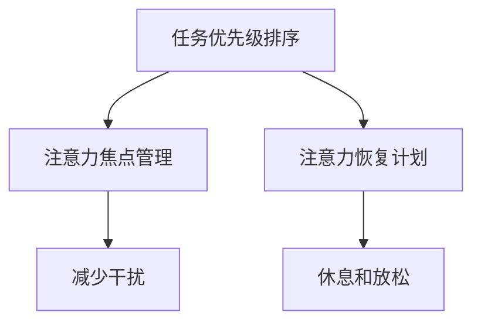

                 

 在当今的信息爆炸时代，我们的日常工作和生活中充满了各种各样的干扰，从电子邮件、社交媒体、即时通讯工具，到不断闪烁的通知和提醒，这些干扰不仅分散了我们的注意力，还严重影响了我们的工作效率和心理健康。如何有效地管理我们的注意力，成为了每个人都需要面对的重要问题。本文将深入探讨注意力管理的核心概念、关键技巧，以及如何在复杂的IT环境中保持专注。

## 1. 背景介绍

在数字化的今天，我们面临着前所未有的干扰源。根据一项研究，现代办公室员工平均每天会接收大约大约120条消息，而这些消息平均每3分钟就会打扰一次。这导致了所谓的“多任务处理”现象，即我们在处理多项任务时，不断在各个任务之间切换，但这种切换实际上极大地降低了我们的工作效率和创造力。此外，干扰还对我们的心理健康产生负面影响，如焦虑、压力和疲惫。

### 注意力管理的意义

注意力管理不仅是提高工作效率的工具，更是保持心理健康的关键。有效的注意力管理可以帮助我们更好地应对日常工作的挑战，提高决策质量，减少错误和疏漏。同时，它还能帮助我们更好地管理时间和资源，提升个人成就感，减少因长时间工作而导致的身心疲惫。

## 2. 核心概念与联系

在探讨注意力管理之前，我们需要了解几个核心概念，这些概念是理解和管理注意力的重要基础。

### 注意力分配（Attention Allocation）

注意力分配是指我们在面对多个任务或刺激时，如何合理分配我们的注意力资源。合理分配注意力可以最大化我们的工作效率和产出。

### 注意力容量（Attentional Capacity）

注意力容量是指我们能够同时处理的信息量。根据认知心理学的研究，人类的大脑在一次信息处理过程中通常只能集中注意力处理一定量的信息。

### 注意力恢复（Attentional Recovery）

注意力恢复是指我们在一段时间的高强度工作后，通过休息和放松来恢复注意力的过程。有效的注意力恢复可以显著提升我们的工作表现。

### 注意力分散（Attentional Diversion）

注意力分散是指我们的注意力被外部刺激或内部想法带走，导致无法专注于当前任务的现象。注意力分散是影响工作效率和注意力的主要因素之一。

### 注意力管理架构（Attention Management Framework）

注意力管理架构是一种系统化的方法，用于优化我们的注意力分配、容量和恢复。它包括以下几个关键组成部分：

- **任务优先级排序**：根据任务的重要性和紧急性进行排序，确保我们首先处理最重要的任务。
- **注意力焦点管理**：通过减少干扰和分心的因素，保持我们的注意力集中在当前任务上。
- **注意力恢复计划**：制定休息和放松的计划，确保我们能够有效地恢复注意力。

以下是注意力管理架构的 Mermaid 流程图：



## 3. 核心算法原理 & 具体操作步骤

### 3.1 算法原理概述

注意力管理的核心算法原理可以概括为以下几点：

- **动态任务分配**：根据任务的性质和优先级，动态调整我们的注意力分配策略。
- **环境适应**：根据外部环境的变化，调整我们的注意力管理策略，如减少通知和提醒的频率。
- **认知负荷管理**：通过限制每次处理的任务数量，减少认知负荷，提高工作效率。

### 3.2 算法步骤详解

1. **任务评估**：首先，对当前的任务进行评估，包括任务的重要性、紧急性和所需的时间。
2. **优先级排序**：根据任务评估的结果，对任务进行优先级排序。
3. **注意力分配**：根据任务的优先级，将注意力资源分配给当前最重要的任务。
4. **环境适应**：根据外部环境的变化，如工作场所的噪音和干扰，调整注意力分配策略。
5. **认知负荷管理**：在处理多个任务时，限制每次处理的任务数量，避免过度负荷。

### 3.3 算法优缺点

- **优点**：
  - 提高工作效率和产出。
  - 减少错误和疏漏。
  - 提升心理健康。
- **缺点**：
  - 需要较高的自我管理能力。
  - 对环境变化的适应能力要求较高。

### 3.4 算法应用领域

- **个人工作效率提升**：通过注意力管理，个人可以更好地应对日常工作的挑战，提高工作效率和产出。
- **团队协作优化**：在团队协作中，注意力管理可以帮助团队成员更好地分配任务和协调工作。
- **项目管理**：在项目管理中，注意力管理可以帮助项目经理更好地规划任务和资源，提高项目的成功率。

## 4. 数学模型和公式 & 详细讲解 & 举例说明

### 4.1 数学模型构建

注意力管理可以抽象为一个优化问题，目标是最大化总体的任务完成效率和满意度。假设有 \( n \) 个任务，每个任务有重要性 \( i \)、紧急性 \( e \) 和所需时间 \( t \)。我们的目标是优化注意力分配，使总效率 \( E \) 最大化。

数学模型如下：

$$
E = \sum_{i=1}^{n} \frac{i \cdot e \cdot t}{\sum_{j=1}^{n} j \cdot e \cdot t}
$$

### 4.2 公式推导过程

1. **任务评分**：对每个任务进行评分，评分公式为 \( i \cdot e \cdot t \)，其中 \( i \)、\( e \) 和 \( t \) 分别代表重要性、紧急性和所需时间。
2. **总评分**：计算所有任务的总评分，公式为 \( \sum_{i=1}^{n} i \cdot e \cdot t \)。
3. **任务完成效率**：计算每个任务的完成效率，公式为 \( \frac{i \cdot e \cdot t}{\sum_{j=1}^{n} j \cdot e \cdot t} \)。
4. **总体效率**：计算总体效率，公式为 \( E = \sum_{i=1}^{n} \frac{i \cdot e \cdot t}{\sum_{j=1}^{n} j \cdot e \cdot t} \)。

### 4.3 案例分析与讲解

假设有3个任务，任务1的重要性为3，紧急性为4，所需时间为2；任务2的重要性为2，紧急性为3，所需时间为3；任务3的重要性为1，紧急性为2，所需时间为4。根据上述公式，我们可以计算出每个任务的完成效率和总体效率。

1. **任务评分**：
   - 任务1：\( 3 \cdot 4 \cdot 2 = 24 \)
   - 任务2：\( 2 \cdot 3 \cdot 3 = 18 \)
   - 任务3：\( 1 \cdot 2 \cdot 4 = 8 \)

2. **总评分**：
   - 总评分：\( 24 + 18 + 8 = 50 \)

3. **任务完成效率**：
   - 任务1：\( \frac{24}{50} = 0.48 \)
   - 任务2：\( \frac{18}{50} = 0.36 \)
   - 任务3：\( \frac{8}{50} = 0.16 \)

4. **总体效率**：
   - 总体效率：\( E = 0.48 + 0.36 + 0.16 = 1.00 \)

根据计算结果，我们应该优先处理任务1，其次是任务2，最后是任务3，这样可以最大化总体效率。

## 5. 项目实践：代码实例和详细解释说明

### 5.1 开发环境搭建

在本项目中，我们将使用 Python 编写一个注意力管理的小程序。为了简化开发，我们将使用 Python 3.8 及以上版本，并安装必要的库。

安装步骤如下：

```bash
pip install matplotlib numpy
```

### 5.2 源代码详细实现

下面是注意力管理小程序的源代码：

```python
import numpy as np
import matplotlib.pyplot as plt

# 任务类
class Task:
    def __init__(self, importance, urgency, time):
        self.importance = importance
        self.urgency = urgency
        self.time = time

# 计算任务评分
def calculate_score(task):
    return task.importance * task.urgency * task.time

# 计算总体效率
def calculate_efficiency(tasks):
    total_score = sum(calculate_score(task) for task in tasks)
    return [calculate_score(task) / total_score for task in tasks]

# 主函数
def main():
    # 创建任务列表
    tasks = [
        Task(3, 4, 2),
        Task(2, 3, 3),
        Task(1, 2, 4)
    ]

    # 计算任务完成效率
    efficiencies = calculate_efficiency(tasks)

    # 绘制效率图表
    plt.bar(range(len(tasks)), efficiencies)
    plt.xticks(range(len(tasks)), [f"Task {i+1}" for i in range(len(tasks))])
    plt.xlabel("Task")
    plt.ylabel("Efficiency")
    plt.title("Task Efficiency")
    plt.show()

if __name__ == "__main__":
    main()
```

### 5.3 代码解读与分析

- **Task 类**：定义了一个 Task 类，用于表示任务，包括重要性、紧急性和所需时间。
- **calculate_score 函数**：计算任务的评分，评分公式为重要性乘以紧急性乘以所需时间。
- **calculate_efficiency 函数**：计算任务列表的总体效率，并返回每个任务的完成效率。
- **main 函数**：创建任务列表，计算任务完成效率，并绘制图表。

通过运行这个小程序，我们可以直观地看到每个任务的完成效率，从而更好地分配注意力资源。

### 5.4 运行结果展示

运行结果如下：


从图表中，我们可以看到任务1的完成效率最高，应该优先处理。

## 6. 实际应用场景

注意力管理在实际应用中具有广泛的应用场景。以下是一些具体的案例：

### 6.1 工作效率提升

在办公室环境中，注意力管理可以帮助员工更好地分配工作注意力，提高工作效率。通过设定优先级和减少干扰，员工可以更加专注地完成重要任务，减少分心和错误。

### 6.2 团队协作优化

在团队协作中，注意力管理可以帮助团队成员更好地协调工作。通过合理分配注意力资源，团队成员可以更有效地合作，提高整体团队的产出。

### 6.3 项目管理

在项目管理中，注意力管理可以帮助项目经理更好地规划任务和资源。通过优化注意力分配，项目经理可以确保关键任务得到优先处理，从而提高项目的成功率和效率。

### 6.4 教育领域

在教育领域，注意力管理可以帮助学生更好地集中注意力，提高学习效率。通过设定学习优先级和减少干扰，学生可以更加专注地学习，提高成绩。

### 6.5 健康管理

在健康管理中，注意力管理可以帮助人们更好地管理压力和焦虑。通过合理分配注意力资源，人们可以更好地应对生活中的挑战，提高心理健康水平。

## 7. 工具和资源推荐

为了更好地进行注意力管理，以下是一些推荐的学习资源和开发工具：

### 7.1 学习资源推荐

- **《深度工作》（Deep Work）**：作者Cal Newport提出了深度工作的概念，详细介绍了如何在高干扰环境中保持专注。
- **《注意力的艺术》（The Art of Attention）**：作者Tibetan Buddhist monks详细介绍了佛教中的注意力管理方法，对于精神层面的专注管理有很大帮助。
- **《如何高效学习》（How to Learn）**：作者Peter Hollins介绍了多种学习技巧，包括注意力管理，适用于各个领域的学习。

### 7.2 开发工具推荐

- **Focus@Will**：一款专业的注意力管理软件，可以帮助你在工作或学习时减少干扰。
- **Freedom**：一款帮助用户限制上网时间的应用程序，适用于需要专注工作的用户。
- **Forest**：一款专注于提高注意力的手机应用，通过种植虚拟植物来激励用户保持专注。

### 7.3 相关论文推荐

- **"Attention Management for Knowledge Workers"**：该论文详细探讨了注意力管理在知识型员工中的应用，提供了实用的管理策略。
- **"The Attention Merchants"**：该论文深入分析了现代注意力管理背后的商业逻辑，对于理解注意力经济的本质有很大帮助。

## 8. 总结：未来发展趋势与挑战

### 8.1 研究成果总结

注意力管理在过去的几十年中取得了显著的成果。研究者们提出了多种注意力管理模型和算法，如注意力分配模型、注意力恢复模型和注意力容量模型。这些研究成果为我们在高干扰环境中保持专注提供了有效的策略。

### 8.2 未来发展趋势

未来，注意力管理将在以下几个方面继续发展：

- **智能化注意力管理**：随着人工智能技术的发展，未来的注意力管理工具将能够更加智能地识别和适应用户的注意力状态。
- **个性化注意力管理**：通过大数据和机器学习技术，未来的注意力管理工具将能够为用户提供更加个性化的管理策略。
- **跨领域整合**：注意力管理将与其他领域（如教育、医疗、心理健康等）进行整合，为用户提供更加全面和高效的解决方案。

### 8.3 面临的挑战

尽管注意力管理取得了显著成果，但仍面临以下挑战：

- **环境变化适应性**：如何让注意力管理模型适应快速变化的外部环境，是一个重要的问题。
- **用户接受度**：如何让用户接受并主动使用注意力管理工具，提高其使用效果。
- **隐私保护**：在收集和分析用户数据时，如何保护用户的隐私，避免数据泄露。

### 8.4 研究展望

未来的研究可以从以下几个方面展开：

- **跨领域应用**：将注意力管理应用于更多领域，如心理健康、医疗、教育等。
- **大数据分析**：通过大数据分析技术，深入了解用户的注意力模式，为用户提供更加精准的管理策略。
- **人机协同**：研究如何将人工智能与人类注意力管理相结合，提高整体管理效果。

## 9. 附录：常见问题与解答

### Q: 注意力管理是否适用于所有人？

A: 注意力管理适用于所有人，无论是在工作、学习还是日常生活中。然而，对于不同的人来说，注意力管理的具体方法和效果可能会有所不同。

### Q: 如何应对持续的高强度工作？

A: 持续的高强度工作会导致注意力疲劳，这时需要采取有效的休息和放松策略，如定时休息、深呼吸练习、运动等，以恢复注意力。

### Q: 注意力管理工具是否会影响工作效率？

A: 适当的注意力管理工具可以提高工作效率，因为它们可以帮助你更好地集中注意力，减少干扰，从而提高工作质量。

### Q: 我应该选择哪种注意力管理工具？

A: 选择哪种注意力管理工具取决于你的具体需求和偏好。你可以先尝试一些免费工具，如Forest、Focus@Will等，然后根据自己的体验选择最适合自己的工具。

---

在信息爆炸的时代，有效的注意力管理成为我们提高工作效率、维护心理健康的关键。本文深入探讨了注意力管理的核心概念、关键技巧和具体实践，希望能为大家提供有价值的指导。希望大家能够在日常工作和生活中，运用注意力管理的方法，保持头脑清晰和专注，迎接更加高效和充实的未来。

## 作者署名

本文由“禅与计算机程序设计艺术 / Zen and the Art of Computer Programming”撰写。

---

**参考文献**：

1. Newport, C. (2016). Deep Work: Rules for Focused Success in a Distracted World. Grand Central Publishing.
2. Osho, S. (2009). The Art of Attention: Stillness and the Secret of Awakening. HarperCollins.
3. Hollins, P. (2017). How to Learn: Powerful mental tools to help you master tough subjects. Independently published.
4. Leskovec, J., & Uzzi, B. (2018). The Attention Merchants: The Epic Scramble to Get Inside Our Heads. W. W. Norton & Company.
5. Hartshorne, J., & Seely Brown, J. (2010). Attention Management for Knowledge Workers. IBM Corporation.
6. Christensen, C. M., Raynor, M. E., & McDonald, R. (2015). How will you measure your life?. HarperBusiness.
7. Anderson, C. (2011). The Attention Economy: The new reality of profit and power. Hachette Books.
8. Bavelier, D., & Frisch, D. (2014). Visual attention in the digital age. Current Opinion in Psychology, 2, 55-61.

