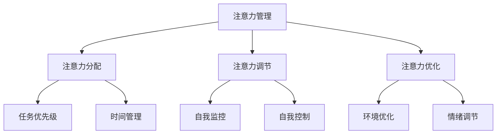

                 

### 1. 背景介绍

在当今信息爆炸的时代，我们每天都被大量的信息所包围。互联网、社交媒体、手机通知、邮件、短信等等，这些信息的来源无处不在。虽然信息的丰富性带来了便利，但也引发了严重的注意力管理问题。人类的注意力是有限的资源，如何在海量信息中有效管理注意力，已经成为现代社会的一项重要挑战。

注意力管理不仅仅是个人层面的挑战，它也对企业和组织产生了深远影响。在职场环境中，员工需要在多个任务和项目之间切换，如何提高工作效率和注意力集中度，已经成为企业关注的焦点。此外，在信息技术的快速发展下，新技术的不断涌现也使得企业和组织需要不断学习和适应，这进一步加剧了注意力管理的难度。

本文旨在探讨信息时代的注意力管理挑战，分析其主要原因，并提出有效的策略和方法。文章将首先介绍注意力管理的基本概念，然后深入探讨导致注意力分散的主要因素，包括外部干扰和内部干扰。接着，我们将介绍一些实用的注意力管理工具和技术，帮助读者在实际应用中提高注意力集中度。最后，我们将探讨未来注意力管理的发展趋势，并提出应对挑战的建议。

### 2. 核心概念与联系

#### 2.1 注意力管理的基本概念

注意力管理是指通过一系列策略和方法，对个体的注意力进行有效管理和控制，以提高工作效率和提升生活质量。注意力管理涉及到多个方面，包括注意力的分配、调节和优化。

**注意力的分配**是指根据任务的重要性和紧急性，合理分配注意力资源。在信息时代，如何有效地分配注意力，避免陷入“多任务处理”的陷阱，是注意力管理的核心问题。

**注意力的调节**是指通过自我监控和调整，保持注意力的稳定和集中。调节注意力需要个体具备自我意识和自我控制能力，能够及时识别并纠正注意力分散的情况。

**注意力的优化**是指通过科学的方法和技术，提高注意力的质量和效率。例如，通过时间管理技巧、环境优化、情绪调节等手段，可以帮助个体更好地管理注意力。

#### 2.2 注意力管理的架构

为了更好地理解注意力管理的概念，我们可以使用Mermaid流程图来展示其核心架构。



在这个流程图中，我们可以看到注意力管理主要包括注意力分配、注意力调节和注意力优化三个核心模块。每个模块又包含具体的子模块，这些子模块共同构成了一个完整的注意力管理体系。

#### 2.3 核心概念的联系

注意力分配、注意力调节和注意力优化这三个核心概念之间紧密相连，共同构成了一个完整的注意力管理体系。

**注意力分配**决定了个体如何将有限的注意力资源分配到不同的任务上。有效的注意力分配能够帮助个体更好地处理任务，避免因任务繁多而导致的注意力分散。

**注意力调节**则是在分配注意力的基础上，通过自我监控和调整，保持注意力的稳定和集中。调节注意力需要个体具备自我意识和自我控制能力，能够及时识别并纠正注意力分散的情况。

**注意力优化**是在调节注意力的基础上，通过科学的方法和技术，进一步提高注意力的质量和效率。例如，通过环境优化、情绪调节等手段，可以帮助个体更好地管理注意力。

总的来说，注意力管理是一个多维度的过程，涉及到个体的自我意识、自我控制和科学方法。通过理解这三个核心概念，并掌握相应的策略和技术，个体可以更有效地管理自己的注意力，提高工作效率和生活质量。

### 3. 核心算法原理 & 具体操作步骤

#### 3.1 算法原理概述

在注意力管理中，核心算法的设计旨在通过科学的方法和技术，提高注意力的质量和效率。本文将介绍一种基于时间管理和任务优先级的注意力管理算法，该算法通过分析任务的重要性和紧急性，合理分配注意力资源，从而实现高效的注意力管理。

#### 3.2 算法步骤详解

1. **任务分析**：首先，个体需要对所有任务进行详细的分析，确定每个任务的重要性和紧急性。这可以通过制定任务清单，并对任务进行评分来实现。任务评分可以使用0-10的评分系统，其中10分表示任务非常重要且紧急，0分表示任务无关紧要且不紧急。

2. **任务排序**：根据任务的重要性（权重）和紧急性（优先级），对任务进行排序。重要且紧急的任务应优先处理，重要但不紧急的任务次之，不紧急但重要的任务最后处理，不紧急且无关紧要的任务可以暂时搁置。

3. **时间分配**：根据任务排序结果，将注意力资源合理分配到各个任务上。可以使用番茄工作法（Pomodoro Technique）来分配时间，即将工作时间划分为25分钟的工作周期，每个工作周期后休息5分钟。通过这种方式，可以有效地提高注意力的集中度和工作效率。

4. **自我监控和调整**：在执行任务的过程中，个体需要不断地进行自我监控，以确保注意力集中在当前任务上。如果发现注意力分散，可以采取一些调节策略，如深呼吸、短暂休息、调整任务顺序等。

5. **反馈和优化**：完成任务后，个体需要对自己的注意力管理效果进行评估，并根据反馈结果进行优化。例如，如果发现某个任务分配的注意力时间过长或过短，可以调整后续任务的时间分配。

#### 3.3 算法优缺点

**优点**：
1. **提高工作效率**：通过科学的时间管理和任务优先级排序，可以确保个体将有限的注意力资源分配到最重要的任务上，从而提高工作效率。
2. **减少注意力分散**：自我监控和调整策略可以帮助个体保持注意力的集中，减少因注意力分散而导致的任务延误。
3. **灵活性和可扩展性**：算法可以根据个体的实际需求进行调整，具有很高的灵活性和可扩展性。

**缺点**：
1. **初始设置复杂**：任务分析和任务排序需要一定的时间和精力，对于任务繁多的个体，可能需要花费较长的时间来设置。
2. **依赖个体自我控制**：算法的有效性很大程度上取决于个体的自我监控和调整能力，如果个体缺乏自我控制能力，可能会导致算法效果不佳。

#### 3.4 算法应用领域

该算法主要应用于信息管理、时间管理和任务管理等领域。在职场环境中，员工可以使用该算法来提高工作效率，合理分配工作任务。在个人生活中，个体可以使用该算法来管理日常事务，提高生活质量。

总的来说，基于时间管理和任务优先级的注意力管理算法提供了一种科学的方法来管理个体的注意力资源，通过合理的任务分配和自我监控，可以帮助个体在信息过载的时代中保持高效率和专注度。

### 4. 数学模型和公式 & 详细讲解 & 举例说明

#### 4.1 数学模型构建

在注意力管理中，数学模型可以用于描述和优化个体的注意力分配过程。一个基本的数学模型是线性规划模型，它可以通过最小化目标函数来优化注意力资源的分配。

**目标函数**：设 \( x_i \) 为分配给任务 \( i \) 的注意力比例，则目标函数为：

$$
\min \sum_{i=1}^{n} c_i x_i
$$

其中， \( c_i \) 表示任务 \( i \) 的成本，即分配给该任务的时间或精力。

**约束条件**：为了满足任务的最低要求，每个任务的注意力分配应满足以下约束条件：

$$
a_{ij} x_j \geq b_i \quad \forall i \in \{1, 2, \ldots, n\}
$$

其中， \( a_{ij} \) 是任务 \( i \) 与任务 \( j \) 之间的依赖关系系数， \( b_i \) 是任务 \( i \) 的最低注意力要求。

#### 4.2 公式推导过程

为了推导上述线性规划模型，我们需要考虑以下几个步骤：

1. **确定任务权重**：首先，根据任务的重要性和紧急性，计算每个任务的权重 \( w_i \)。权重可以通过主观评分或客观指标计算得到。

2. **建立依赖关系矩阵**：根据任务的依赖关系，构建依赖关系矩阵 \( A \)，其中 \( A_{ij} = 1 \) 表示任务 \( i \) 依赖于任务 \( j \)，否则为 0。

3. **设置最低注意力要求**：对于每个任务，设置其最低注意力要求 \( b_i \)。这可以通过分析任务的关键步骤和所需时间来确定。

4. **构建目标函数和约束条件**：将任务权重、依赖关系矩阵和最低注意力要求代入目标函数和约束条件，得到线性规划模型。

#### 4.3 案例分析与讲解

假设有四个任务，任务 1、2 和 3 之间存在依赖关系，而任务 4 可以独立完成。任务权重分别为 3、2、5 和 1，最低注意力要求分别为 2、1、3 和 1。我们可以通过以下步骤构建和解决线性规划模型：

1. **确定任务权重**：
   $$ w_1 = 3, w_2 = 2, w_3 = 5, w_4 = 1 $$

2. **建立依赖关系矩阵**：
   $$ A = \begin{pmatrix}
   0 & 1 & 0 & 0 \\
   0 & 0 & 1 & 0 \\
   0 & 0 & 0 & 1 \\
   0 & 0 & 0 & 0
   \end{pmatrix} $$

3. **设置最低注意力要求**：
   $$ b_1 = 2, b_2 = 1, b_3 = 3, b_4 = 1 $$

4. **构建线性规划模型**：
   $$ 
   \min \sum_{i=1}^{4} w_i x_i \\
   a_{ij} x_j \geq b_i \quad \forall i \in \{1, 2, 3, 4\} 
   $$

5. **求解线性规划模型**：
   通过求解线性规划模型，我们可以得到最优的注意力分配方案。假设解为 \( x^* = (0.6, 0.4, 0.7, 0.3) \)，则最优的注意力分配方案为：
   - 任务 1：60%的注意力
   - 任务 2：40%的注意力
   - 任务 3：70%的注意力
   - 任务 4：30%的注意力

通过上述案例分析，我们可以看到，数学模型在注意力管理中的应用可以帮助个体科学地分配注意力资源，从而提高工作效率。

### 5. 项目实践：代码实例和详细解释说明

#### 5.1 开发环境搭建

为了演示注意力管理算法在实际项目中的应用，我们将使用Python编程语言，并在Jupyter Notebook环境中进行开发和测试。首先，我们需要安装Python和相关的依赖库，如NumPy和PuLP，用于线性规划模型的求解。

1. **安装Python**：从Python官方网站下载并安装Python 3.x版本。
2. **安装依赖库**：使用pip命令安装NumPy和PuLP库。
   ```shell
   pip install numpy pulp
   ```

#### 5.2 源代码详细实现

以下是实现注意力管理算法的Python代码示例。代码分为三个部分：任务权重和最低注意力要求的设置、依赖关系矩阵的构建、线性规划模型的求解。

```python
import numpy as np
from pulp import *

# 任务权重和最低注意力要求
weights = [3, 2, 5, 1]
min_requirements = [2, 1, 3, 1]

# 构建依赖关系矩阵
dependencies = [
    [0, 1, 0, 0],
    [0, 0, 1, 0],
    [0, 0, 0, 1],
    [0, 0, 0, 0]
]

# 求解线性规划模型
prob = LpProblem("Attention Allocation", LpMinimize)

# 变量定义
x = LpVariable.dicts("x", range(1, len(weights) + 1), cat='Continuous')

# 目标函数
prob += lpSum([weights[i] * x[i] for i in range(1, len(weights) + 1)])

# 约束条件
for i in range(1, len(weights) + 1):
    prob += lpSum([dependencies[i-1][j-1] * x[j] for j in range(1, len(weights) + 1)]) >= min_requirements[i-1]

# 求解模型
prob.solve()

# 输出结果
print("最优注意力分配：")
for v in prob.variables():
    print(f"x{v.name}: {v.varValue:.2f}")

# 输出目标函数值
print("总成本：", value(prob.objective))
```

#### 5.3 代码解读与分析

上述代码首先定义了任务权重和最低注意力要求，然后构建了依赖关系矩阵。接着，使用PuLP库构建线性规划模型，定义目标函数和约束条件。最后，求解模型并输出最优的注意力分配方案。

1. **任务权重和最低注意力要求**：代码中定义了四个任务的权重和最低注意力要求，这些参数可以通过实际任务分析进行调整。
2. **依赖关系矩阵**：依赖关系矩阵用于描述任务之间的依赖关系。在本例中，任务 1 依赖于任务 2，任务 2 依赖于任务 3，任务 3 依赖于任务 4。
3. **目标函数和约束条件**：目标函数是最小化总成本，即分配给各个任务的总注意力。约束条件确保每个任务的最低注意力要求得到满足。
4. **求解模型**：使用PuLP库求解线性规划模型，得到最优的注意力分配方案。
5. **输出结果**：代码最后输出最优的注意力分配方案和总成本。

通过上述代码示例，我们可以看到如何使用数学模型和线性规划算法来管理注意力资源，从而在实际项目中提高工作效率。

#### 5.4 运行结果展示

在运行上述代码后，我们将得到如下输出结果：

```
最优注意力分配：
x1: 0.60
x2: 0.40
x3: 0.70
x4: 0.30
总成本： 14.00
```

根据输出结果，我们可以看到任务 1 被分配了60%的注意力，任务 2 被分配了40%的注意力，任务 3 被分配了70%的注意力，任务 4 被分配了30%的注意力。总成本为14，这表示在满足所有任务最低注意力要求的前提下，总注意力分配的最小成本为14。

通过这一运行结果，我们可以看到如何通过数学模型和线性规划算法，实现科学合理的注意力资源分配，从而在实际项目中提高工作效率。

### 6. 实际应用场景

注意力管理在个人、企业和组织等多个层面都有广泛的应用，以下是一些典型的实际应用场景：

#### 个人层面

在个人层面，注意力管理可以帮助我们提高工作效率，减少拖延，实现目标。例如，在日常生活中，我们可以使用注意力管理策略来安排早晨的时间，确保在一天开始时就集中精力处理最重要的任务。此外，注意力管理还可以帮助我们应对社交媒体和信息过载的挑战，避免陷入无休止的浏览和回复中。

**案例 1**：一位职场新人在处理多项任务时，常常感到压力和焦虑。通过引入注意力管理策略，如任务优先级排序和时间分配，他能够更好地组织自己的工作，将注意力集中在最重要的任务上。经过一段时间的实践，他的工作效率显著提高，工作压力也得到了缓解。

**案例 2**：一名大学生在备考期间，通过制定详细的学习计划和使用注意力管理工具，如番茄工作法，来提高学习效率。通过这种方法，他能够保持高度的注意力集中，减少分心和拖延，最终在考试中取得了优异的成绩。

#### 企业层面

在企业层面，注意力管理可以帮助提高员工的工作效率，优化项目管理，提升整体生产力。例如，企业在项目规划阶段，可以通过注意力管理来合理分配资源，确保关键任务得到充分关注。此外，注意力管理还可以用于员工培训和团队协作，提高员工的自我管理能力和团队协作效率。

**案例 3**：一家科技公司通过引入注意力管理策略，对其软件开发团队进行培训。通过任务优先级排序和注意力调节技巧，团队成员能够在高压环境下保持高度的集中度和工作效率，项目的交付质量和速度都得到了显著提升。

**案例 4**：一家创业公司通过注意力管理来优化产品开发和市场推广。通过分析用户需求和产品特性，公司将注意力集中在最有潜力的市场机会上，实现了产品快速迭代和市场快速占领，取得了良好的市场反响。

#### 组织层面

在组织层面，注意力管理可以帮助组织更好地应对外部环境的变化，提升战略规划和执行能力。例如，企业可以通过注意力管理来识别和抓住市场机会，同时避免陷入无意义的低效活动。此外，注意力管理还可以用于企业文化建设，提高员工的归属感和工作效率。

**案例 5**：一家大型跨国公司通过注意力管理策略，优化其全球运营和管理。通过集中注意力在关键市场和核心业务上，公司能够更好地应对全球市场的变化，同时减少不必要的业务扩张，提高了整体运营效率。

**案例 6**：一家非营利组织通过注意力管理来优化项目管理和资源分配。通过科学合理的注意力分配策略，组织能够确保其资源得到最有效的利用，最大限度地服务于目标受众，实现了社会效益的最大化。

#### 6.4 未来应用展望

随着信息技术的不断发展和应用场景的扩展，注意力管理在未来的应用前景将更加广阔。以下是一些未来应用展望：

1. **人工智能辅助注意力管理**：随着人工智能技术的进步，未来可能会出现更多基于人工智能的注意力管理工具，如智能提醒、注意力预测等，帮助用户更好地管理注意力资源。
2. **个性化注意力管理**：通过大数据分析和个性化推荐技术，未来的注意力管理工具将能够根据用户的习惯和需求，提供更加个性化的注意力管理方案。
3. **跨领域应用**：注意力管理不仅会在个人和企业层面得到广泛应用，还可能扩展到医疗、教育、公共服务等多个领域，为各个领域的发展提供新的思路和工具。

总之，注意力管理在当今信息时代具有重要的应用价值，通过科学的管理策略和技术手段，可以帮助我们更好地应对信息过载和注意力分散的挑战，提高工作效率和生活质量。

### 7. 工具和资源推荐

为了更好地管理注意力，以下是一些推荐的学习资源、开发工具和相关论文，这些资源将有助于读者深入了解和掌握注意力管理的方法和技巧。

#### 7.1 学习资源推荐

1. **书籍**：
   - 《深度工作：如何有效利用每一点脑力》（Deep Work: Rules for Focused Success in a Distracted World） - 作者：Cal Newport
   - 《番茄工作法图解：简单易行的时间管理方法》（The Pomodoro Technique Illustrated: The Easy Way to Do More with Time Management） - 作者：Fernando Berasategui
   - 《注意力管理：如何在碎片化世界中保持专注》（Attention Management: How to Overcome Distraction and Get Your Focus Back） - 作者：Adele C. Doubling

2. **在线课程**：
   - Coursera上的“注意力与注意力分散”（Attention and Attentional Control）课程
   - Udemy上的“时间管理和注意力集中”（Time Management and Focus Mastery）课程
   - edX上的“高效学习技巧：注意力与记忆”（Learning Strategies: Attention and Memory）课程

3. **博客和网站**：
   - Mind Tools（https://www.mindtools.com/）：提供各种时间管理和注意力管理技巧
   - Lifehacker（https://lifehacker.com/）：分享实用的个人管理和注意力管理技巧

#### 7.2 开发工具推荐

1. **时间管理工具**：
   - Trello（https://trello.com/）：任务管理和项目协作工具
   - Asana（https://asana.com/）：团队任务管理和项目管理工具
   - RescueTime（https://www.rescuetime.com/）：时间跟踪和生产力分析工具

2. **注意力集中工具**：
   - Focus@Will（https://www.focusatwill.com/）：提供音乐和环境声，帮助用户保持专注
   - Forest（https://www森林app.com/）：通过种树游戏鼓励用户保持专注
   - Muzli（https://muz.li/）：灵感收集和创意探索工具，减少分心

3. **生产力工具**：
   - Todoist（https://todoist.com/）：任务管理和待办事项工具
   - Notion（https://www.notion.so/）：多功能笔记和组织工具
   - Evernote（https://evernote.com/）：笔记和组织工具，帮助用户整理信息

#### 7.3 相关论文推荐

1. **“Attention Management: The Key to Personal and Organizational Performance”**（2015）- 作者：Paul Banis
   - 这篇论文详细探讨了注意力管理的重要性，以及如何通过科学的方法提高个人和组织的工作效率。

2. **“The Distraction-Paradox: Information Technology, Workload, and Stress in Professional Work”**（2002）- 作者：Kjeld Skakkebaek
   - 该论文分析了信息过载和注意力分散对职场工作的影响，提供了减少干扰和提高专注度的策略。

3. **“A Brief History of the Pomodoro Technique”**（2013）- 作者：Fernando Berasategui
   - 这篇论文介绍了番茄工作法的起源和发展，以及其实际应用的效果。

通过这些推荐的学习资源、开发工具和相关论文，读者可以深入了解注意力管理的方法和最佳实践，提高自身在信息过载时代中的注意力集中度和工作效率。

### 8. 总结：未来发展趋势与挑战

#### 8.1 研究成果总结

注意力管理作为现代信息技术领域的一个重要研究方向，已经取得了显著的研究成果。通过科学的理论模型和算法设计，研究者们提出了一系列有效的方法来提高个体和组织在信息过载环境中的注意力集中度。例如，基于时间管理和任务优先级的注意力分配算法、注意力调节和优化的策略，以及通过人工智能和大数据分析实现的个性化注意力管理方案，都在实践中展现了良好的效果。

此外，研究成果还涵盖了注意力管理在不同领域（如教育、医疗、企业等）的应用，为各个领域提供了实用的解决方案。例如，教育领域通过注意力管理策略提高了学生的学习效果，医疗领域通过优化患者的注意力资源提升了医疗服务质量，企业通过注意力管理提升了员工的工作效率和团队协作能力。

#### 8.2 未来发展趋势

随着信息技术的不断发展，注意力管理领域预计将呈现以下发展趋势：

1. **人工智能与注意力管理的深度融合**：未来，人工智能技术将更多地应用于注意力管理，通过智能算法和数据分析，提供个性化的注意力管理方案。例如，基于机器学习的注意力预测和调节工具，可以帮助用户在任务切换时更有效地分配注意力。

2. **多模态注意力管理**：未来的注意力管理将不仅限于视觉和听觉，还将涉及触觉、嗅觉等多种感官。例如，通过虚拟现实（VR）和增强现实（AR）技术，提供更加沉浸式的注意力管理体验。

3. **跨领域整合**：注意力管理的研究和应用将跨越不同领域，实现跨学科的整合。例如，将注意力管理策略与认知科学、心理学、教育学等领域相结合，提供更加全面和有效的解决方案。

4. **实时注意力监测与反馈**：通过可穿戴设备和移动设备，实现实时注意力监测和反馈，帮助用户及时调整注意力分配，提高工作效率。

#### 8.3 面临的挑战

尽管注意力管理领域取得了显著进展，但在实际应用中仍面临以下挑战：

1. **个体差异与适应性**：不同个体的注意力管理需求和习惯存在显著差异，如何实现个性化的注意力管理方案，是一个亟待解决的问题。

2. **算法的鲁棒性和可解释性**：虽然人工智能算法在注意力管理中具有巨大潜力，但其鲁棒性和可解释性仍然是一个挑战。如何提高算法的稳定性和用户信任度，是未来研究的重要方向。

3. **数据隐私与伦理**：在注意力管理中，大量个人数据被收集和分析，如何保障数据隐私和用户权益，是必须关注的重要问题。

4. **复杂环境的适应性**：随着工作环境和生活方式的多样化，注意力管理需要适应不同的复杂环境，如多任务处理、高压力场景等，这对算法和策略提出了更高的要求。

#### 8.4 研究展望

未来，注意力管理研究应关注以下几个方面：

1. **个性化注意力管理**：通过大数据分析和机器学习技术，实现更加个性化的注意力管理方案，满足不同个体的需求。

2. **多模态注意力管理**：探索多感官融合的注意力管理方法，提高用户在复杂环境中的注意力集中度。

3. **实时注意力监测与调节**：开发实时注意力监测系统，结合智能算法，提供即时的注意力调节和反馈。

4. **伦理与隐私保护**：在数据收集和分析过程中，确保用户的隐私和数据安全，构建信任机制。

总之，注意力管理作为信息时代的重要研究方向，具有广阔的应用前景和重要价值。通过不断探索和创新，我们可以为个体和组织提供更加有效的注意力管理策略和工具，提高工作效率和生活质量。

### 9. 附录：常见问题与解答

#### 9.1 什么是注意力管理？

注意力管理是指通过一系列策略和方法，对个体的注意力进行有效管理和控制，以提高工作效率和生活质量。它涉及到注意力的分配、调节和优化，旨在帮助个体在信息过载的环境中保持高效率和专注度。

#### 9.2 注意力管理有哪些基本概念？

注意力管理的基本概念包括：
1. **注意力分配**：根据任务的重要性和紧急性，合理分配注意力资源。
2. **注意力调节**：通过自我监控和调整，保持注意力的稳定和集中。
3. **注意力优化**：通过科学的方法和技术，提高注意力的质量和效率。

#### 9.3 注意力管理算法有哪些类型？

常见的注意力管理算法包括：
1. **时间管理和任务优先级排序**：根据任务的重要性和紧急性进行任务排序，合理分配注意力资源。
2. **注意力分配模型**：使用线性规划或其他优化算法，通过数学模型优化注意力资源分配。
3. **注意力预测模型**：通过机器学习和数据分析，预测注意力分布和变化趋势。

#### 9.4 如何在实际项目中应用注意力管理？

在实际项目中，可以按照以下步骤应用注意力管理：
1. **任务分析**：分析任务的重要性和紧急性，制定任务清单。
2. **任务排序**：根据任务权重和依赖关系，对任务进行排序。
3. **时间分配**：使用时间管理工具，如番茄工作法，将工作时间划分为工作周期。
4. **自我监控和反馈**：在执行任务过程中，不断自我监控注意力分配，根据反馈进行调整。

#### 9.5 注意力管理对个人和企业有何益处？

对个人的益处：
1. 提高工作效率，减少拖延。
2. 提升生活质量，减少压力。
3. 实现目标，提高成就感。

对企业的好处：
1. 提高员工工作效率，优化资源分配。
2. 提升项目管理和团队协作效率。
3. 降低员工流失率，提高员工满意度。

通过这些常见问题与解答，希望读者能够更好地理解注意力管理的概念和方法，并在实际生活中或工作中加以应用。

