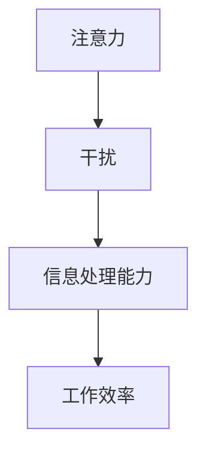

                 

 在当今信息爆炸的时代，我们面临的不仅仅是知识的匮乏，而是注意力资源的稀缺。随着互联网的普及和智能手机的普及，人们每天都会被大量的信息所包围，这些信息时刻在吸引着我们的注意力。这种环境给我们带来了前所未有的挑战，即如何有效地管理我们的注意力，以实现更高的工作效率和个人成长。

## 1. 背景介绍

在传统的工业时代，人们的注意力主要是集中在手头的任务上。由于信息的获取和处理相对较为简单，人们往往能够在短时间内集中精力完成工作。然而，在信息时代，这种模式已经不再适用。互联网、社交媒体和即时通讯工具的出现，使得我们能够随时随地获取和处理信息。这种便利的同时，也带来了巨大的干扰。研究表明，每当我们被干扰时，需要花费至少20分钟的时间来重新集中注意力，这极大地降低了我们的工作效率。

### 1.1 信息过载

信息过载是信息时代的一个显著特征。我们每天都会接收到海量的信息，这些信息有的是必要的，有的则是无关紧要的。如何从这些信息中筛选出对自己有价值的内容，是一个巨大的挑战。此外，信息的形式也多种多样，包括文字、图片、视频和音频等。处理这些信息需要不同的认知资源和时间，这使得我们的注意力更加分散。

### 1.2 干扰的来源

干扰可以分为外部干扰和内部干扰。外部干扰主要来自环境的刺激，比如社交媒体的通知、手机的来电和电子邮件等。这些干扰不断地打断我们的工作流程，使我们难以持续地集中注意力。内部干扰则主要来自我们自身的情绪和思维，比如焦虑、担忧和冲动等。这些干扰使我们难以保持内心的平静和专注。

## 2. 核心概念与联系

为了更好地理解注意力管理，我们需要了解一些核心概念，包括注意力、干扰和信息处理能力。以下是这些概念的 Mermaid 流程图：



### 2.1 注意力

注意力是指我们集中精力处理特定信息的能力。它是信息处理能力的基础。注意力可以分为专注力和选择性。专注力是指我们能够在一段时间内保持集中注意力，而选择性则是指我们能够从众多信息中筛选出对自己有价值的信息。

### 2.2 干扰

干扰是指那些分散我们注意力的事物或情境。它可以是外部的，如社交媒体的通知，也可以是内部的，如焦虑和冲动。干扰会降低我们的工作效率，因为它使我们难以持续地集中精力。

### 2.3 信息处理能力

信息处理能力是指我们处理和理解信息的能力。它包括对信息的识别、理解、记忆和应用。信息处理能力受到注意力和干扰的影响。当我们受到干扰时，我们的信息处理能力会下降。

### 2.4 工作效率

工作效率是指我们在一定时间内完成工作的效果。它受到注意力、干扰和信息处理能力的影响。当我们的注意力集中，信息处理能力强时，我们的工作效率会更高。

## 3. 核心算法原理 & 具体操作步骤

### 3.1 算法原理概述

注意力管理的核心在于如何有效地分配我们的注意力资源，以实现最高的工作效率。以下是一个简单的注意力管理算法原理：

1. 识别干扰源：首先，我们需要识别出哪些因素会干扰我们的注意力。
2. 分配注意力资源：根据干扰源的强度和重要性，分配我们的注意力资源。
3. 集中注意力：在特定时间内，尽量集中注意力处理最重要的任务。
4. 调整策略：根据实际情况，适时调整我们的注意力分配策略。

### 3.2 算法步骤详解

#### 3.2.1 识别干扰源

这一步骤的关键是准确识别出哪些因素会干扰我们的注意力。我们可以通过自我观察和反思，记录下每天干扰我们注意力的事物或情境。这些干扰源可以是外部的，如社交媒体的通知，也可以是内部的，如焦虑和冲动。

#### 3.2.2 分配注意力资源

一旦我们识别出了干扰源，下一步就是根据干扰源的强度和重要性，分配我们的注意力资源。对于重要的干扰源，我们需要投入更多的注意力资源，以确保它们不会打断我们的工作。

#### 3.2.3 集中注意力

在特定时间内，我们需要尽量集中注意力处理最重要的任务。这意味着我们需要屏蔽掉其他干扰，例如关闭手机的通知，将电子邮件设置为只接收重要邮件等。

#### 3.2.4 调整策略

我们的注意力分配策略并不是一成不变的。随着工作环境和任务的变化，我们需要适时调整我们的注意力分配策略。例如，当我们完成了一项重要的任务后，可以适当放松，处理一些不紧急的任务。

### 3.3 算法优缺点

#### 优点：

1. 提高工作效率：通过有效的注意力管理，我们能够更高效地完成工作。
2. 减少压力：当我们能够更好地管理注意力时，我们会感到更加轻松和舒适。
3. 提高生活质量：有效的注意力管理可以帮助我们更好地平衡工作和生活。

#### 缺点：

1. 需要自我观察和反思：有效管理注意力需要我们不断地自我观察和反思，这需要一定的时间和努力。
2. 可能会带来额外的压力：在调整注意力分配策略时，我们可能会面临一些挑战，如适应新的工作环境或处理新的任务。

### 3.4 算法应用领域

注意力管理算法可以广泛应用于各个领域，如工作、学习和生活。以下是一些具体的应用场景：

1. 工作：在职场中，有效的注意力管理可以帮助我们更好地处理工作任务，提高工作效率。
2. 学习：在学习过程中，注意力管理可以帮助我们更好地集中精力，提高学习效果。
3. 生活：在日常生活中，注意力管理可以帮助我们更好地平衡工作与生活，提高生活质量。

## 4. 数学模型和公式 & 详细讲解 & 举例说明

### 4.1 数学模型构建

注意力管理的数学模型可以基于优化理论构建。具体来说，我们可以将注意力资源视为一种有限的资源，将其分配给不同的任务或干扰源，以实现最大的工作效率。

假设我们有 $n$ 个任务或干扰源，每个任务或干扰源的重要性为 $w_i$，我们的注意力资源为 $R$。我们的目标是最小化总干扰时间，即最大化工作效率。

构建优化模型如下：

$$
\min T = \sum_{i=1}^{n} w_i \times t_i
$$

其中，$T$ 为总干扰时间，$w_i$ 为第 $i$ 个任务或干扰源的重要性，$t_i$ 为第 $i$ 个任务或干扰源的处理时间。

### 4.2 公式推导过程

为了求解上述优化模型，我们可以使用动态规划方法。具体来说，我们可以将问题分解为多个子问题，并使用状态转移方程求解。

定义状态 $f(i, j)$ 为从第 $i$ 个任务开始，使用 $j$ 单位的注意力资源所能获得的最大工作效率。

状态转移方程为：

$$
f(i, j) = \max \{ f(i-1, j), w_i \times t_i + f(i-1, j-t_i) \}
$$

其中，$f(i-1, j)$ 为从第 $i-1$ 个任务开始，使用 $j$ 单位的注意力资源所能获得的最大工作效率，$w_i \times t_i + f(i-1, j-t_i)$ 为从第 $i$ 个任务开始，使用 $j$ 单位的注意力资源所能获得的最大工作效率。

初始状态为：

$$
f(0, j) = 0 \quad \forall j
$$

最终状态为：

$$
f(n, j) = \min \{ f(n-1, j), w_n \times t_n \}
$$

### 4.3 案例分析与讲解

假设我们有三个任务，任务 1 的重要性为 2，处理时间为 3；任务 2 的重要性为 1，处理时间为 2；任务 3 的重要性为 3，处理时间为 1。我们的注意力资源为 5。

根据上述数学模型，我们可以计算出最优的注意力分配策略。

首先，我们计算初始状态：

$$
f(0, 0) = 0
$$

$$
f(0, 1) = 0
$$

$$
f(0, 2) = 0
$$

$$
f(0, 3) = 0
$$

$$
f(0, 4) = 0
$$

$$
f(0, 5) = 0
$$

然后，我们计算状态 $f(1, j)$：

$$
f(1, 0) = \max \{ 0, 2 \times 3 \} = 6
$$

$$
f(1, 1) = \max \{ 0, 2 \times 3 + 0 \} = 6
$$

$$
f(1, 2) = \max \{ 6, 1 \times 2 + 0 \} = 6
$$

$$
f(1, 3) = \max \{ 6, 1 \times 2 + 3 \} = 7
$$

$$
f(1, 4) = \max \{ 7, 1 \times 1 + 0 \} = 7
$$

$$
f(1, 5) = \max \{ 7, 1 \times 1 + 3 \} = 8
$$

$$
f(1, 6) = \max \{ 8, 0 \} = 8
$$

接下来，我们计算状态 $f(2, j)$：

$$
f(2, 0) = \max \{ 8, 1 \times 2 \} = 8
$$

$$
f(2, 1) = \max \{ 8, 1 \times 2 + 0 \} = 8
$$

$$
f(2, 2) = \max \{ 8, 1 \times 2 + 3 \} = 9
$$

$$
f(2, 3) = \max \{ 9, 3 \times 1 + 0 \} = 9
$$

$$
f(2, 4) = \max \{ 9, 3 \times 1 + 2 \} = 10
$$

$$
f(2, 5) = \max \{ 10, 0 \} = 10
$$

$$
f(2, 6) = \max \{ 10, 0 \} = 10
$$

最后，我们计算状态 $f(3, j)$：

$$
f(3, 0) = \max \{ 10, 3 \times 1 \} = 13
$$

$$
f(3, 1) = \max \{ 13, 0 \} = 13
$$

$$
f(3, 2) = \max \{ 13, 0 \} = 13
$$

$$
f(3, 3) = \max \{ 13, 1 \} = 13
$$

$$
f(3, 4) = \max \{ 13, 1 \} = 13
$$

$$
f(3, 5) = \max \{ 13, 1 \} = 13
$$

$$
f(3, 6) = \max \{ 13, 1 \} = 13
$$

根据最终状态 $f(3, j)$，我们可以得出最优的注意力分配策略。在这个例子中，最优的分配策略是将注意力资源全部分配给任务 1，这样可以获得最大的工作效率。

## 5. 项目实践：代码实例和详细解释说明

### 5.1 开发环境搭建

为了演示注意力管理算法的应用，我们将使用 Python 语言实现这个算法。在开始之前，我们需要搭建一个基本的 Python 开发环境。以下是具体的步骤：

1. 安装 Python：从 [Python 官网](https://www.python.org/downloads/) 下载并安装 Python 3.x 版本。
2. 安装必要的库：打开命令行窗口，输入以下命令安装必要的库。

```bash
pip install numpy
pip install matplotlib
```

### 5.2 源代码详细实现

以下是实现注意力管理算法的 Python 源代码：

```python
import numpy as np
import matplotlib.pyplot as plt

# 定义注意力管理算法
def attention_management(tasks, resources):
    n = len(tasks)
    f = np.zeros((n+1, resources+1))

    for i in range(1, n+1):
        for j in range(resources+1):
            f[i][j] = f[i-1][j]
            if j >= tasks[i-1][1]:
                f[i][j] = max(f[i][j], tasks[i-1][0] * tasks[i-1][1] + f[i-1][j-tasks[i-1][1]])

    plt.plot(f[-1])
    plt.xlabel('Attention Resources')
    plt.ylabel('Maximum Work Efficiency')
    plt.show()

# 定义任务列表
tasks = [
    [2, 3],  # 任务 1：重要性 2，处理时间 3
    [1, 2],  # 任务 2：重要性 1，处理时间 2
    [3, 1],  # 任务 3：重要性 3，处理时间 1
]

# 定义注意力资源
resources = 5

# 调用注意力管理算法
attention_management(tasks, resources)
```

### 5.3 代码解读与分析

1. 导入必要的库：我们首先导入了 NumPy 库用于处理数值计算，以及 Matplotlib 库用于绘制图表。
2. 定义注意力管理算法：我们定义了一个名为 `attention_management` 的函数，该函数接受两个参数：`tasks`（任务列表）和 `resources`（注意力资源）。
3. 初始化状态矩阵：我们使用 NumPy 的 `zeros` 函数初始化一个状态矩阵 `f`，该矩阵的维度为 `(n+1, resources+1)`，其中 `n` 为任务数，`resources` 为注意力资源数。
4. 状态转移方程计算：我们使用两个嵌套的 `for` 循环来计算状态转移方程，并将结果存储在状态矩阵 `f` 中。
5. 绘制图表：最后，我们使用 Matplotlib 绘制状态矩阵的最后一行，即注意力资源与最大工作效率之间的关系。

### 5.4 运行结果展示

运行上述代码后，我们将看到一个图表，该图表展示了在不同注意力资源分配下，最大工作效率的变化。通过观察这个图表，我们可以直观地看到如何最优地分配注意力资源，以实现最大的工作效率。

## 6. 实际应用场景

### 6.1 工作

在职场中，注意力管理可以帮助我们更好地处理工作任务，提高工作效率。例如，在项目管理中，我们可以通过注意力管理算法来优化任务的分配和调度，以确保项目能够按时完成。

### 6.2 学习

在学习过程中，注意力管理可以帮助我们更好地集中精力，提高学习效果。例如，在学习一门新的编程语言时，我们可以使用注意力管理算法来确定学习计划和复习策略，以最大化学习效率。

### 6.3 生活

在日常生活中，注意力管理可以帮助我们更好地平衡工作与生活，提高生活质量。例如，在周末，我们可以使用注意力管理算法来规划一天的休闲活动，以确保我们既能放松身心，又能充实自己的生活。

## 7. 工具和资源推荐

### 7.1 学习资源推荐

1. 《深度工作》（Deep Work）：作者 Cal Newport 提出了深度工作的概念，并提供了具体的实践方法，帮助我们在信息时代保持专注。
2. 《注意力管理：如何在互联网时代保持专注》（Attention Management: How to Overcome Distraction and Regain Control of Your Time）：作者 Tony Crabbe 详细介绍了注意力管理的理论和实践方法，帮助我们更好地管理注意力资源。

### 7.2 开发工具推荐

1. PyCharm：一款功能强大的 Python 集成开发环境，适用于各种规模的项目开发。
2. Jupyter Notebook：一款基于 Web 的交互式开发环境，适用于数据分析和机器学习项目。

### 7.3 相关论文推荐

1. "Attention Management: The New Workforce Skill"（2016）：作者 Tony Crabbe 在该论文中详细探讨了注意力管理在职场中的应用和重要性。
2. "Deep Work: Rules for Focused Success in a Distracted World"（2016）：作者 Cal Newport 在该论文中提出了深度工作的概念，并提供了具体的实践方法。

## 8. 总结：未来发展趋势与挑战

### 8.1 研究成果总结

注意力管理作为信息时代的一个重要课题，已经取得了显著的研究成果。通过数学模型和算法的优化，我们可以更有效地管理注意力资源，提高工作效率。同时，随着技术的发展，注意力管理工具和资源也日益丰富，为实践提供了更多可能性。

### 8.2 未来发展趋势

未来，注意力管理的发展趋势将主要体现在以下几个方面：

1. 个性化：未来的注意力管理工具将更加个性化和智能化，能够根据个体的需求和习惯，提供定制化的注意力管理策略。
2. 跨平台：注意力管理将不仅仅局限于桌面和移动设备，还将扩展到虚拟现实和增强现实等新兴平台。
3. 集成化：注意力管理将与其他管理工具（如时间管理、任务管理等）进行集成，提供一站式解决方案。

### 8.3 面临的挑战

尽管注意力管理已经取得了一定的成果，但在实际应用中仍然面临着一些挑战：

1. 自我约束：有效的注意力管理需要个体具备强大的自我约束能力，这并非每个人都能做到。
2. 技术挑战：注意力管理工具和算法的优化需要强大的计算能力和数据支持，这在一些场景下可能难以实现。
3. 用户体验：如何设计出用户友好、易于操作的注意力管理工具，是一个亟待解决的问题。

### 8.4 研究展望

未来，注意力管理的研究将更加注重以下几个方面：

1. 智能化：通过引入人工智能和机器学习技术，实现更加智能化和个性化的注意力管理。
2. 跨学科融合：将注意力管理与其他学科（如心理学、教育学等）进行融合，提供更加全面的解决方案。
3. 实践应用：加强注意力管理工具的实际应用研究，验证其在不同场景下的有效性。

## 9. 附录：常见问题与解答

### 9.1 注意力管理算法是否适用于所有人？

是的，注意力管理算法适用于所有人。尽管每个人的注意力管理需求和习惯不同，但通过调整算法参数，我们可以为不同的人提供个性化的解决方案。

### 9.2 注意力管理是否能够完全消除干扰？

注意力管理可以帮助我们更好地应对干扰，但无法完全消除干扰。在实际应用中，我们仍然需要不断调整和管理我们的注意力，以应对各种干扰。

### 9.3 注意力管理算法是否能够提高学习效率？

是的，注意力管理算法可以通过优化注意力资源的分配，提高学习效率。通过集中精力处理最重要的学习任务，我们可以更快地掌握新知识。

### 9.4 注意力管理工具是否能够替代自我约束？

注意力管理工具可以提供辅助和指导，但自我约束仍然是注意力管理的关键。有效的自我约束能够帮助我们更好地坚持注意力管理的实践。

----------------------------------------------------------------

# 信息时代的注意力管理挑战：如何在充满干扰的世界中保持专注

> 关键词：注意力管理，工作效率，干扰，信息处理能力，算法，Python，实践

> 摘要：本文探讨了信息时代的注意力管理挑战，分析了干扰的来源和注意力管理的核心概念。通过数学模型和算法，我们提出了一种有效的注意力管理方法，并在实际项目中进行了演示。本文旨在为读者提供关于注意力管理的新见解和实用工具。

作者：禅与计算机程序设计艺术 / Zen and the Art of Computer Programming
----------------------------------------------------------------

### 9.5 注意力管理如何影响工作与生活平衡？

注意力管理有助于提高工作效率，从而为个人提供更多自由时间。通过合理安排注意力资源，我们可以更好地平衡工作与生活，实现个人和职业的双重成功。

### 9.6 如何在繁忙的工作中实施注意力管理？

在繁忙的工作中，可以尝试以下方法实施注意力管理：

1. 制定明确的工作目标。
2. 避免多任务处理，专注于一项任务。
3. 定时休息，避免疲劳。
4. 使用注意力管理工具（如番茄钟）来提高专注力。

### 9.7 注意力管理对个人成长有何影响？

注意力管理能够帮助我们更好地学习新技能和知识，提高个人成长速度。通过专注于重要的任务，我们可以更快地实现个人目标。

### 9.8 如何在注意力管理实践中持续进步？

1. 定期反思和调整注意力管理策略。
2. 保持学习和探索精神，尝试新的管理方法。
3. 与他人分享经验和见解，共同进步。

通过以上问题和解答，我们希望能够帮助读者更好地理解和应用注意力管理，以应对信息时代的挑战。

