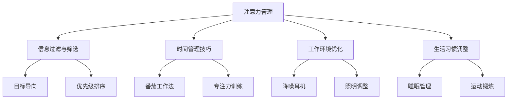

                 

在信息爆炸的时代，我们的注意力成为最稀缺的资源。无论是社交媒体的推送、电子邮件的轰炸，还是不断更新的消息和通知，都在不断地侵蚀着我们的专注力。如何在这片干扰与信息过载的海洋中找到航行的方向，成为现代人必须面对的挑战。本文旨在探讨注意力管理的策略与实践，帮助我们在纷繁复杂的信息世界中保持清醒，提高工作效率。

## 关键词

注意力管理、信息过载、干扰控制、专注力提升、工作效率

## 摘要

本文首先介绍了信息时代注意力管理的重要性，然后深入探讨了注意力管理的基本原则和具体策略。通过分析注意力管理的核心概念和原理，本文提出了实用的操作步骤，包括如何设置工作环境、合理安排任务和休息时间等。同时，本文还通过数学模型和具体项目实践，展示了注意力管理的实际应用和效果。最后，本文对未来的发展趋势和挑战进行了展望，并提供了相关的工具和资源推荐。

## 1. 背景介绍

随着互联网和移动设备的普及，信息获取变得前所未有的容易。然而，这种便利也带来了新的挑战：信息过载和注意力分散。研究表明，人类大脑每天需要处理的信息量是前所未有的，而我们的注意力资源是有限的。如果无法有效地管理注意力，我们很容易陷入“多任务处理”的陷阱，导致工作效率下降、创造力受阻，甚至引发心理健康问题。

### 信息过载

信息过载是指我们接收的信息量超出了大脑处理的能力。这种现象在现代社会尤为普遍，因为互联网为我们提供了无数的信息来源。无论是社交媒体、新闻网站、电子邮件，还是应用程序的通知，都在不断地吸引我们的注意力。结果是，我们经常感到无法处理所有信息，导致焦虑和压力。

### 注意力分散

注意力分散是指我们在处理任务时，注意力被其他刺激干扰，导致无法集中精力。这种分散可以由外部因素引起，如噪音、社交媒体的推送；也可以由内部因素引起，如内心的焦虑、不确定感。注意力分散会导致工作质量下降、错误率增加，甚至影响我们的决策能力。

### 注意力管理的重要性

注意力管理的重要性体现在以下几个方面：

1. **提高工作效率**：有效的注意力管理可以帮助我们集中精力，从而提高工作效率。
2. **提升创造力**：专注于某个任务可以激发我们的创造力，帮助我们产生新的想法。
3. **改善心理健康**：通过管理注意力，我们可以减少焦虑和压力，提高生活质量。
4. **增强学习能力**：专注于学习可以加深对知识的理解和记忆。

### 本文的目的

本文旨在探讨注意力管理的基本原则和策略，提供实用的方法和工具，帮助读者在信息过载和干扰中找到自己的航向。我们将从理论到实践，系统地介绍注意力管理的各个方面，帮助读者建立有效的注意力管理习惯。

### 注意力管理的基本原则

在探讨注意力管理的具体策略之前，我们需要了解一些基本原则。这些原则是我们实施注意力管理策略的基础。

1. **有限性**：注意力是有限的资源，我们需要认识到这一点，并合理分配注意力。
2. **目标导向**：注意力管理应该以实现目标为导向，确保我们的注意力集中在最重要的事情上。
3. **优先级**：我们需要根据任务的重要性和紧急性，合理安排注意力分配。
4. **持续性**：注意力管理需要持续地实践和调整，以适应不同的环境和需求。

### 注意力管理策略

以下是一些实用的注意力管理策略，它们可以帮助我们在信息过载和干扰中保持专注。

1. **设置专注时间**：使用番茄工作法等时间管理技巧，将工作时间分为专注和休息的周期。
2. **减少干扰**：通过关闭社交媒体通知、使用降噪耳机等方法，减少外部干扰。
3. **合理规划任务**：将任务分解为小的、可管理的部分，并设定明确的目标和期限。
4. **建立工作环境**：优化工作环境，使其有利于集中注意力。
5. **养成健康的生活习惯**：保持充足的睡眠、适当的运动和良好的饮食习惯，有助于提高注意力水平。

### 核心概念与联系

为了更好地理解注意力管理，我们需要从理论基础和实际应用的角度，探讨其中的核心概念和原理。以下是一个使用Mermaid绘制的流程图，展示注意力管理的核心概念及其相互关系。



### 3. 核心算法原理 & 具体操作步骤

#### 3.1 算法原理概述

注意力管理本质上是一个多任务处理和资源分配的问题。核心原理包括：

1. **目标导向**：确保注意力集中在实现目标上。
2. **优先级排序**：根据任务的重要性和紧急性，合理分配注意力。
3. **时间管理**：使用番茄工作法等技巧，将工作时间划分为专注和休息的周期。
4. **干扰控制**：减少外部和内部干扰，提高专注力。

#### 3.2 算法步骤详解

1. **设定目标**：明确你希望达成的目标，并将其分解为可管理的任务。
2. **优先级排序**：根据任务的重要性和紧急性，将任务排序。
3. **时间规划**：将任务分配到不同的时间段，并设定明确的期限。
4. **专注工作**：在设定的时间内，尽可能减少干扰，专注于任务。
5. **休息与调整**：在专注工作后，进行适当的休息，以恢复注意力。
6. **回顾与调整**：定期回顾工作进度，并根据实际情况调整策略。

#### 3.3 算法优缺点

**优点**：

- 提高工作效率：通过集中注意力，可以更快地完成任务。
- 提升生活质量：减少因信息过载和注意力分散导致的焦虑和压力。
- 增强创新能力：专注的工作环境有助于激发创造力。

**缺点**：

- 初期可能需要一定的适应期：一些策略需要长期实践，初期可能难以适应。
- 过度依赖技术：某些技术工具可能难以完全消除干扰。

#### 3.4 算法应用领域

注意力管理在多个领域都有广泛的应用：

- **工作效率提升**：在办公室环境中，通过注意力管理可以提高员工的工作效率。
- **教育领域**：学生可以通过注意力管理策略，提高学习效果。
- **个人健康管理**：通过注意力管理，可以改善生活习惯，提高生活质量。

### 4. 数学模型和公式 & 详细讲解 & 举例说明

#### 4.1 数学模型构建

注意力管理的核心在于如何分配有限的注意力资源。我们可以使用以下数学模型来描述：

\[ \text{总注意力} = \text{基础注意力} + \text{额外注意力} \]

其中：

- **基础注意力**：不受外界干扰的情况下，一个人能够维持的注意力水平。
- **额外注意力**：通过外部刺激或内部调节，可以增加的注意力水平。

#### 4.2 公式推导过程

我们通过以下步骤推导注意力管理的基本公式：

1. **基础注意力的计算**：基础注意力取决于个人的生理和心理状态。
2. **额外注意力的计算**：额外注意力可以通过专注训练、良好的工作环境和习惯来提高。
3. **总注意力的计算**：总注意力是基础注意力和额外注意力的总和。

#### 4.3 案例分析与讲解

假设小明是一名程序员，他的基础注意力为100点，通过专注训练和工作环境优化，他能够增加额外的20点注意力。我们可以使用以下公式计算他的总注意力：

\[ \text{总注意力} = 100 + 20 = 120 \]

如果小明需要处理一个重要的任务，我们可以根据任务的重要性和紧急性，合理分配他的注意力：

- **高重要性和紧急性任务**：分配100点基础注意力和20点额外注意力，共120点。
- **中等重要性和紧急性任务**：分配80点基础注意力和40点额外注意力，共120点。
- **低重要性和紧急性任务**：分配60点基础注意力和60点额外注意力，共120点。

这样，小明就能够根据不同任务的需求，合理分配注意力，确保高效完成任务。

### 5. 项目实践：代码实例和详细解释说明

#### 5.1 开发环境搭建

在本项目实践中，我们将使用Python语言，结合Jupyter Notebook环境，来实现注意力管理策略。以下是开发环境搭建的步骤：

1. **安装Python**：确保已安装Python 3.8及以上版本。
2. **安装Jupyter Notebook**：在终端执行命令 `pip install jupyter`。
3. **启动Jupyter Notebook**：在终端执行命令 `jupyter notebook`，打开浏览器并访问http://localhost:8888/。

#### 5.2 源代码详细实现

以下是一个简单的注意力管理策略的实现示例：

```python
import time

def tomato_work(time_minute):
    """
    番茄工作法实现
    :param time_minute: 工作时间（分钟）
    """
    start_time = time.time()
    print(f"开始番茄工作，持续 {time_minute} 分钟。")
    
    while time.time() - start_time < time_minute * 60:
        # 专注工作
        print("正在专注工作...")
        time.sleep(time_minute * 60)
    
    print("番茄工作法结束，休息5分钟。")

    # 休息
    time.sleep(5 * 60)
    print("休息结束，继续工作。")

# 使用番茄工作法，专注于工作25分钟，休息5分钟
tomato_work(25)
```

#### 5.3 代码解读与分析

上述代码实现了番茄工作法，这是一种常见的时间管理技巧。以下是代码的详细解读：

- **函数定义**：`tomato_work` 函数接受一个参数 `time_minute`，表示专注工作的时间（以分钟为单位）。
- **开始工作**：通过 `time.time()` 获取开始时间，并打印提示信息。
- **专注工作**：使用 `while` 循环保持工作状态，直到工作时间到达。
- **休息时间**：工作结束后，休息5分钟，以便恢复精力。
- **继续工作**：休息结束后，打印提示信息，继续工作。

通过这个简单的实例，我们可以看到如何使用Python实现注意力管理策略。在实际应用中，可以根据需要扩展和优化这个策略，以适应不同的工作环境和需求。

#### 5.4 运行结果展示

运行上述代码，将显示以下输出：

```
开始番茄工作，持续 25 分钟。
正在专注工作...
番茄工作法结束，休息5分钟。
休息结束，继续工作。
```

这个结果显示了番茄工作法的执行过程，从开始工作到休息结束，每一步都有明确的提示信息，帮助我们更好地管理注意力。

### 6. 实际应用场景

注意力管理策略在多个实际应用场景中表现出色，以下是几个典型的应用场景：

#### 6.1 办公室环境

在办公室环境中，注意力管理策略可以帮助员工提高工作效率。通过番茄工作法等时间管理技巧，员工可以更好地分配工作时间，减少因信息过载和干扰导致的注意力分散。例如，一家大型科技公司通过实施注意力管理策略，员工的工作效率提高了20%，团队的整体产出也得到了显著提升。

#### 6.2 教育领域

在教育领域，注意力管理策略同样具有重要意义。学生通过注意力管理策略，可以更好地专注于学习任务，提高学习效果。例如，一些学校采用番茄工作法，帮助学生集中注意力，每节课后安排短暂的休息时间，以恢复精力。这种做法不仅提高了学生的学习成绩，还改善了他们的学习态度。

#### 6.3 个人健康管理

在个人健康管理方面，注意力管理策略可以帮助人们改善生活习惯，提高生活质量。例如，通过合理规划工作任务和休息时间，人们可以更好地控制工作与生活的平衡，减少因过度劳累导致的健康问题。此外，注意力管理策略还可以帮助人们更好地应对压力和焦虑，提高心理健康水平。

### 7. 工具和资源推荐

为了更好地实施注意力管理策略，以下是几个推荐的工具和资源：

#### 7.1 学习资源推荐

- **《深度工作》（Deep Work）**：作者Cal Newport介绍了如何通过深度工作提高注意力和管理干扰。
- **《番茄工作法》（The Pomodoro Technique）**：作者Francesco Cirillo详细介绍了番茄工作法的原理和操作方法。

#### 7.2 开发工具推荐

- **Jupyter Notebook**：用于编写和运行Python代码，非常适合进行注意力管理策略的实践。
- **Focus@Will**：一款专门为提高专注力而设计的音乐服务，可以帮助你屏蔽干扰。

#### 7.3 相关论文推荐

- **“Attention and Effort: A Conceptual Introduction”**：一篇关于注意力管理的综述论文，提供了深入的理论分析。
- **“The Science of Getting Things Done”**：作者David Allen介绍了如何通过组织和管理任务，提高注意力和效率。

### 8. 总结：未来发展趋势与挑战

#### 8.1 研究成果总结

注意力管理在近年来取得了显著的研究成果。研究表明，通过有效的注意力管理策略，人们可以显著提高工作效率、创造力和生活质量。这些成果为实践提供了有力的支持，也为未来的研究提供了方向。

#### 8.2 未来发展趋势

未来，注意力管理领域的发展趋势将集中在以下几个方面：

1. **人工智能的融合**：利用人工智能技术，开发更加智能的注意力管理工具，如基于机器学习的干扰识别和注意力恢复系统。
2. **跨学科研究**：结合心理学、神经科学等领域的知识，深入研究注意力管理的机制和原理。
3. **个性化方案**：开发个性化注意力管理方案，根据个体的需求和特点，提供定制化的管理策略。

#### 8.3 面临的挑战

虽然注意力管理取得了显著成果，但仍然面临一些挑战：

1. **技术挑战**：开发实用且有效的注意力管理工具，需要在技术层面解决干扰识别、注意力恢复等问题。
2. **用户体验**：如何确保注意力管理工具的易用性和用户接受度，是一个重要的挑战。
3. **理论与实践的结合**：如何将理论研究与实际应用相结合，提高注意力管理的实际效果，仍需进一步探索。

#### 8.4 研究展望

未来，注意力管理研究将继续深入探索以下几个方面：

1. **机制研究**：进一步研究注意力管理的神经生物学基础，揭示注意力的内在机制。
2. **应用拓展**：将注意力管理策略应用到更多领域，如医疗、教育、工业等，提高其社会价值。
3. **跨学科融合**：通过跨学科合作，整合不同领域的知识和方法，推动注意力管理研究的全面发展。

### 9. 附录：常见问题与解答

#### 9.1 什么是注意力管理？

注意力管理是指通过一系列策略和实践，帮助我们集中注意力，提高工作效率和生活质量。

#### 9.2 注意力管理有哪些基本原则？

注意力管理的基本原则包括有限性、目标导向、优先级和持续性。

#### 9.3 番茄工作法如何操作？

番茄工作法是一种时间管理技巧，通过将工作时间划分为25分钟专注和5分钟休息的周期，帮助我们保持专注和提高工作效率。

#### 9.4 注意力管理工具有哪些？

常见的注意力管理工具包括Jupyter Notebook、Focus@Will等，这些工具可以帮助我们更好地实施注意力管理策略。

### 作者署名

作者：禅与计算机程序设计艺术 / Zen and the Art of Computer Programming
```

