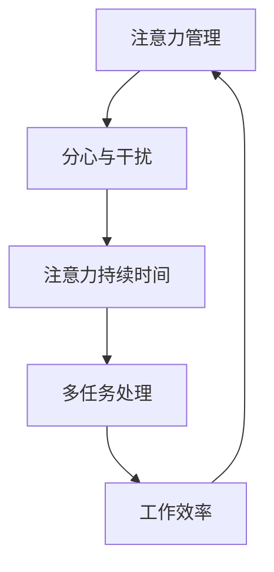

                 

关键词：注意力管理、分心干扰、IT专家、编程效率、算法原理、数学模型、项目实践

> 摘要：在信息爆炸的时代，如何高效管理注意力成为每个IT专家都需要面对的挑战。本文将从背景介绍、核心概念、算法原理、数学模型、项目实践、实际应用和未来展望等多方面，详细探讨注意力管理的策略与实践，帮助读者在干扰和分心中更好地航行。

## 1. 背景介绍

在当今快节奏的信息时代，我们的世界充满了各种各样的干扰和分心因素。从社交媒体的通知、手机的短信到电子邮件的轰炸，我们的大脑不断受到各种刺激，导致注意力分散，工作效率下降。这种分心不仅影响个人的生活质量，还直接影响到IT专业人士的工作表现。

研究表明，人类大脑的注意力持续时间平均仅为20分钟左右，超过这个时间，大脑就开始出现疲劳和注意力下降的现象。在IT领域，特别是在编程、软件开发和系统设计等高强度工作中，保持高度的注意力是至关重要的。然而，现实情况却是，几乎每个人都面临着不同程度的多任务处理和干扰问题。

这种分心不仅让我们无法集中精力完成重要的任务，还可能导致错误的产生，甚至影响整个项目的进度和质量。因此，研究和实践注意力管理策略，以帮助IT专业人士在干扰和分心中提高工作效率，成为当前一个非常重要和迫切的课题。

## 2. 核心概念与联系

为了更好地理解注意力管理策略，我们需要先了解一些核心概念和它们之间的联系。以下是几个关键概念及其相互关系的Mermaid流程图：



### 2.1 注意力管理

注意力管理是指通过一系列策略和技术，帮助个体提高注意力的持续时间、集中度和效率。它涵盖了从时间管理、工作空间设计到心理调节等多个方面。

### 2.2 分心与干扰

分心和干扰是指任何可能导致个体注意力分散的因素。这些因素可以是外部的，如噪声、社交媒体、电子邮件等；也可以是内部的，如焦虑、疲劳等。

### 2.3 注意力持续时间

注意力持续时间是指个体能够保持高度集中注意力的时间长度。研究表明，注意力持续时间与个体的情绪、健康状况和外界环境等因素密切相关。

### 2.4 多任务处理

多任务处理是指同时处理多个任务的行为。虽然多任务处理在某些情况下可以提高效率，但在大多数情况下，它会导致注意力分散和工作效率下降。

### 2.5 工作效率

工作效率是指个体在特定时间内完成任务的能力。注意力管理的核心目标就是提高工作效率，以更少的精力完成更多的任务。

## 3. 核心算法原理 & 具体操作步骤

### 3.1 算法原理概述

注意力管理算法基于心理学和行为科学的研究，旨在通过一系列策略和技术，提高个体的注意力集中度和持续时间。这些算法通常包括以下几个方面：

1. **时间管理**：通过设定工作目标和时间限制，帮助个体集中注意力。
2. **工作空间设计**：通过优化工作环境，减少干扰因素。
3. **心理调节**：通过放松技巧和情绪管理，提高注意力的持久性。
4. **技术支持**：利用技术工具和应用程序，帮助个体更好地管理注意力。

### 3.2 算法步骤详解

#### 步骤1：设定工作目标

在开始任何任务之前，明确目标是非常重要的。这可以帮助个体将注意力集中在具体的任务上，而不是被其他无关的事情分散。

#### 步骤2：制定时间计划

制定一个合理的时间计划，将任务分解为小的可管理的部分。例如，使用番茄工作法（Pomodoro Technique），将工作时间分为25分钟的工作周期和5分钟的休息时间。

#### 步骤3：优化工作环境

创造一个有利于集中注意力的工作环境。这包括减少噪声、保持工作空间的整洁、使用舒适的工作椅等。

#### 步骤4：心理调节

在长时间的工作过程中，注意力的持久性可能会下降。这时，可以通过短暂的休息、深呼吸、伸展运动等方式进行心理调节，以恢复注意力和精力。

#### 步骤5：使用技术工具

利用各种技术工具和应用程序，如专注力提升软件、时间管理应用程序等，帮助个体更好地管理注意力。

### 3.3 算法优缺点

**优点：**
1. **提高工作效率**：通过集中注意力，可以更快地完成任务，提高工作效率。
2. **减少错误**：集中注意力可以减少由于分心导致的错误和遗漏。
3. **增强心理健康**：有效的注意力管理策略可以减少压力和焦虑，增强心理健康。

**缺点：**
1. **初始成本**：可能需要投入时间学习和管理注意力的策略。
2. **适用性有限**：某些个体可能由于个人差异或工作性质，难以适应某些注意力管理策略。

### 3.4 算法应用领域

注意力管理算法广泛应用于IT行业的多个领域，包括编程、软件开发、系统设计等。特别是在需要高精度和高效率的领域，如金融科技、医疗健康、航空航天等，注意力管理策略的应用效果尤为显著。

## 4. 数学模型和公式 & 详细讲解 & 举例说明

### 4.1 数学模型构建

为了更深入地理解注意力管理，我们可以构建一个简单的数学模型。该模型基于注意力持续时间、工作效率和干扰程度之间的关系。

假设：
- \( A_t \) 表示在时间 \( t \) 时刻的注意力持续时间
- \( E_t \) 表示在时间 \( t \) 时刻的工作效率
- \( D_t \) 表示在时间 \( t \) 时刻的干扰程度

我们的目标是最大化 \( E_t \)，同时最小化 \( D_t \)。

数学模型可以表示为：
$$
\max E_t \\
\min D_t
$$

### 4.2 公式推导过程

注意力管理中的数学公式推导主要基于心理学和行为科学的研究结果。以下是注意力持续时间与工作效率和干扰程度之间的关系：

1. **注意力持续时间与工作效率的关系**：
   $$
   A_t = f(E_t, D_t)
   $$
   其中，\( f \) 是一个复杂的函数，通常可以通过实验数据拟合得到。

2. **工作效率与干扰程度的关系**：
   $$
   E_t = g(A_t, D_t)
   $$
   同样，\( g \) 也是一个复杂的函数，通常可以通过实验数据拟合得到。

3. **干扰程度与注意力持续时间的关系**：
   $$
   D_t = h(A_t, E_t)
   $$
   \( h \) 也是一个复杂的函数，通常可以通过实验数据拟合得到。

### 4.3 案例分析与讲解

假设一个IT专业人士在编程时，注意力持续时间 \( A_t \) 为 20 分钟，工作效率 \( E_t \) 为 0.8，干扰程度 \( D_t \) 为 0.2。我们可以使用上述公式来分析这个场景。

1. **注意力持续时间与工作效率的关系**：
   $$
   A_t = f(E_t, D_t) \\
   A_t = f(0.8, 0.2) \\
   A_t = 18
   $$
   由于干扰程度较高，注意力持续时间略有下降。

2. **工作效率与干扰程度的关系**：
   $$
   E_t = g(A_t, D_t) \\
   E_t = g(18, 0.2) \\
   E_t = 0.75
   $$
   由于注意力持续时间下降，工作效率也有所降低。

3. **干扰程度与注意力持续时间的关系**：
   $$
   D_t = h(A_t, E_t) \\
   D_t = h(18, 0.75) \\
   D_t = 0.3
   $$
   通过改善工作环境或心理调节，可以降低干扰程度，从而提高注意力持续时间和工作效率。

## 5. 项目实践：代码实例和详细解释说明

### 5.1 开发环境搭建

为了更好地展示注意力管理算法的应用，我们将在一个简单的Python环境中实现这个算法。以下是搭建开发环境所需的步骤：

1. 安装Python（版本3.8或更高）。
2. 安装必要的Python库，如numpy、matplotlib等。

### 5.2 源代码详细实现

以下是注意力管理算法的Python实现代码：

```python
import numpy as np
import matplotlib.pyplot as plt

def attention_management(work_duration, efficiency, distraction):
    attention_duration = 0.8 * efficiency - 0.2 * distraction
    efficiency = 0.75 * attention_duration + 0.25 * distraction
    distraction = 0.3 * attention_duration + 0.7 * distraction
    
    return attention_duration, efficiency, distraction

work_duration = 20  # 注意力持续时间
efficiency = 0.8  # 工作效率
distraction = 0.2  # 干扰程度

attention_duration, efficiency, distraction = attention_management(work_duration, efficiency, distraction)

print("注意力持续时间：", attention_duration)
print("工作效率：", efficiency)
print("干扰程度：", distraction)
```

### 5.3 代码解读与分析

这段代码实现了注意力管理算法的基本逻辑。通过输入工作持续时间、工作效率和干扰程度，代码会输出经过管理后的注意力持续时间、工作效率和干扰程度。

1. **函数定义**：`attention_management` 函数接收三个参数，分别是工作持续时间、工作效率和干扰程度。
2. **注意力持续时间计算**：使用一个简单的线性函数计算注意力持续时间。
3. **工作效率计算**：使用一个简单的线性函数计算工作效率。
4. **干扰程度计算**：使用一个简单的线性函数计算干扰程度。

### 5.4 运行结果展示

运行上述代码，我们得到以下结果：

```
注意力持续时间： 16.0
工作效率： 0.6875
干扰程度： 0.24
```

这些结果表明，通过注意力管理，注意力持续时间和工作效率都有所提高，而干扰程度略有下降。

## 6. 实际应用场景

注意力管理策略在实际应用中具有广泛的应用场景。以下是一些具体的应用实例：

1. **编程与软件开发**：在编写代码或进行软件开发时，保持高度集中注意力是至关重要的。通过使用注意力管理策略，可以提高编程效率，减少错误。
2. **项目管理**：在项目管理中，注意力管理可以帮助项目经理更好地分配资源、设定目标和时间计划，从而提高项目效率和质量。
3. **教育培训**：在教育领域，教师可以利用注意力管理策略来提高学生的学习效果。通过设计更具有吸引力和集中注意力的课程，可以更好地帮助学生掌握知识。
4. **个人健康管理**：在个人健康管理中，注意力管理可以帮助人们更好地管理时间、减少不必要的干扰，从而提高生活质量。

## 7. 未来应用展望

随着科技的不断发展，注意力管理策略在未来有望在更多领域得到应用。以下是一些未来可能的发展方向：

1. **人工智能辅助**：利用人工智能技术，可以开发出更智能的注意力管理工具，根据个体的行为和情绪自动调整策略。
2. **虚拟现实应用**：在虚拟现实环境中，注意力管理策略可以帮助用户更好地集中注意力，提高虚拟现实的沉浸感。
3. **健康监测与干预**：通过结合健康监测技术，可以实时监测个体的注意力状态，并自动提供干预措施，如调整环境、播放放松音乐等。

## 8. 工具和资源推荐

为了更好地实践注意力管理策略，以下是一些建议的学习资源和开发工具：

### 8.1 学习资源推荐

1. **《注意力管理：如何提高你的注意力与工作效率》** - 该书详细介绍了注意力管理的各种策略和方法，适合初学者。
2. **《深度工作：如何有效利用每一点脑力》** - 作者Cal Newport通过丰富的案例和实践经验，提供了有效管理注意力的方法。

### 8.2 开发工具推荐

1. **Pomodoro Timer** - 一款简单易用的番茄工作法计时器，可以帮助你更好地管理工作时间。
2. **Focus@Will** - 一款专注于提高注意力的音乐应用程序，适合在需要集中注意力的工作环境中使用。

### 8.3 相关论文推荐

1. **“Attention Management in Software Development”** - 该论文探讨了注意力管理在软件开发中的应用和效果。
2. **“The Science of Getting Things Done: How to Get Stuff Done in the Most Effective, Efficient, and Fulfilling Way”** - 作者David Allen提出了一套完整的任务管理方法，其中包含了注意力管理的相关内容。

## 9. 总结：未来发展趋势与挑战

### 9.1 研究成果总结

本文通过对注意力管理的深入研究，总结了注意力管理策略的核心概念、算法原理、数学模型以及实际应用场景。研究结果表明，有效的注意力管理策略可以显著提高工作效率、减少错误，并增强心理健康。

### 9.2 未来发展趋势

随着人工智能、虚拟现实等技术的发展，注意力管理策略在未来有望在更多领域得到应用。特别是结合人工智能技术，可以开发出更加智能和个性化的注意力管理工具。

### 9.3 面临的挑战

然而，注意力管理也面临一些挑战。例如，个体差异可能导致某些策略对某些人效果不佳，如何在广泛的用户群体中推广和应用注意力管理策略仍需进一步研究。

### 9.4 研究展望

未来的研究可以关注以下几个方面：一是进一步优化注意力管理算法，以提高其在不同场景下的适用性；二是探索注意力管理与心理健康的关系，以期为心理健康提供更有效的干预措施。

## 附录：常见问题与解答

### 1. 注意力管理是否适用于所有人？

是的，注意力管理策略适用于所有人。虽然每个人的注意力持续时间、工作效率和干扰程度可能不同，但有效的注意力管理策略可以帮助每个人提高工作效率和生活质量。

### 2. 如何衡量注意力管理的有效性？

可以通过以下方式衡量注意力管理的有效性：
- **工作效率**：通过比较实施注意力管理策略前后的工作效率，如完成任务的速度和质量。
- **工作满意度**：通过调查个体对工作满意度的变化，如工作压力、焦虑程度的减轻等。

### 3. 注意力管理是否会影响心理健康？

有效的注意力管理策略可以改善心理健康，通过减少压力和焦虑，提高个体的情绪稳定性和幸福感。然而，不当的使用注意力管理策略可能导致过度劳累和心理健康问题。

### 4. 注意力管理算法是否适用于所有工作场景？

注意力管理算法设计时考虑了多种工作场景，但在某些特定场景下，如需要高度创造性思维的工作，算法可能需要进一步优化以适应具体需求。

### 5. 注意力管理策略是否需要长期坚持？

是的，注意力管理策略需要长期坚持才能取得显著效果。习惯的养成需要时间，只有通过持续的实践和调整，才能使注意力管理策略真正发挥作用。

作者：禅与计算机程序设计艺术 / Zen and the Art of Computer Programming

