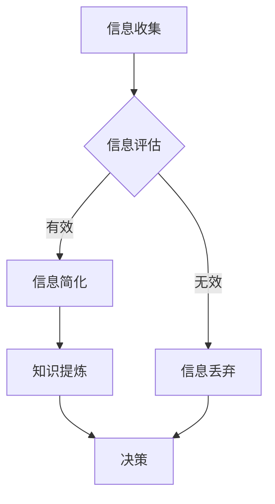

                 

关键词：信息简化、复杂世界、决策、算法、技术、实践、优化、认知负担

摘要：在当今信息爆炸的时代，如何有效地简化信息，将其转化为可操作的知识，已成为一项关键技能。本文从多个角度探讨了信息简化的好处和实践，包括其在生活中的应用、算法的简化、决策中的优化以及认知负担的减轻。通过案例研究和实际应用，本文旨在帮助读者更好地理解和应用信息简化，提高生活和工作的效率。

## 1. 背景介绍

随着互联网的普及和大数据技术的发展，信息已经成为现代社会的重要资源。然而，信息过多反而可能导致认知负担的增加，影响决策的质量和效率。信息简化作为一种应对策略，旨在通过去除冗余、提炼核心，帮助人们更好地理解和利用信息。本文将围绕信息简化的主题，探讨其多方面的好处和实践方法。

### 1.1 信息过载与认知负担

信息过载是指信息输入超过人的处理能力，导致认知负担加重。在信息爆炸的时代，人们每天都会接触到大量的信息，如电子邮件、社交媒体更新、新闻报道等。这些信息虽然丰富，但也可能导致注意力分散和决策困难。因此，信息简化显得尤为重要。

### 1.2 信息简化的目的

信息简化的主要目的是提高信息的可操作性和理解度，使信息更易于消化和应用。通过简化，人们可以更快地识别关键信息，减少冗余数据的干扰，从而做出更明智的决策。

## 2. 核心概念与联系

为了更好地理解信息简化，我们首先需要明确一些核心概念和它们之间的联系。

### 2.1 信息与知识的关系

信息是数据的形式，而知识是对信息的理解和应用。信息简化不仅仅是去除冗余信息，更重要的是提炼出对决策有帮助的知识。

### 2.2 决策过程

决策过程通常包括信息收集、评估和选择。信息简化可以优化这些步骤，使决策更加高效和准确。

### 2.3 认知负担

认知负担是指大脑处理信息时所承受的负担。信息简化有助于减轻这种负担，提高工作效率。

### 2.4 Mermaid 流程图

以下是一个简化的信息处理流程的 Mermaid 流程图：



## 3. 核心算法原理 & 具体操作步骤

### 3.1 算法原理概述

信息简化的核心算法通常包括以下几个步骤：

1. **数据预处理**：去除冗余和无关数据。
2. **特征提取**：从原始数据中提取有用的特征。
3. **模式识别**：利用机器学习算法识别数据中的模式。
4. **结果可视化**：将简化后的信息以易于理解的形式展示。

### 3.2 算法步骤详解

#### 3.2.1 数据预处理

数据预处理是信息简化的第一步，主要任务包括数据清洗、数据转换和数据归一化。

#### 3.2.2 特征提取

特征提取是从原始数据中提取对决策有帮助的信息。常用的方法包括主成分分析（PCA）和特征选择算法。

#### 3.2.3 模式识别

模式识别是利用机器学习算法对提取出的特征进行分类或聚类。常用的算法包括支持向量机（SVM）、决策树和神经网络。

#### 3.2.4 结果可视化

结果可视化是将简化后的信息以图表、图形等形式展示，使其更易于理解和应用。

### 3.3 算法优缺点

#### 优点：

- **提高效率**：简化后的信息更容易处理，提高决策效率。
- **减少冗余**：去除无关信息，减少认知负担。
- **增强理解**：通过可视化，使信息更易于理解。

#### 缺点：

- **丢失细节**：过度简化可能导致重要细节的丢失。
- **算法依赖**：信息简化依赖于特定的算法和技术，可能受限于算法的性能。

### 3.4 算法应用领域

信息简化算法广泛应用于数据科学、人工智能和商业分析等领域。例如，在推荐系统中，通过简化用户行为数据，提高推荐算法的准确性和效率。

## 4. 数学模型和公式 & 详细讲解 & 举例说明

### 4.1 数学模型构建

信息简化的数学模型通常基于概率论和统计学。以下是一个简化的模型：

$$
P(A|B) = \frac{P(B|A) \cdot P(A)}{P(B)}
$$

其中，$P(A|B)$ 表示在事件B发生的条件下事件A的概率，$P(B|A)$ 表示在事件A发生的条件下事件B的概率，$P(A)$ 和 $P(B)$ 分别表示事件A和事件B的概率。

### 4.2 公式推导过程

信息简化模型的基本推导过程如下：

1. **贝叶斯定理**：公式提供了在已知某事件的条件下，其他事件概率的计算方法。
2. **最大似然估计**：通过最大化已知条件下的似然函数，求得事件概率的估计值。
3. **决策规则**：基于概率和损失函数，构建最优决策规则。

### 4.3 案例分析与讲解

以下是一个案例，说明如何使用信息简化模型进行决策：

**案例：选择最佳投资项目**

假设有两个投资项目A和B，已知它们在不同市场状况下的收益概率。通过信息简化模型，我们可以计算出在给定市场状况下选择哪个项目的概率更高。

$$
\begin{aligned}
P(A|\text{市场好}) &= \frac{P(\text{市场好}|A) \cdot P(A)}{P(\text{市场好})} \\
P(A|\text{市场差}) &= \frac{P(\text{市场差}|A) \cdot P(A)}{P(\text{市场差})}
\end{aligned}
$$

通过计算，我们可以得到在不同市场状况下选择项目A和项目B的概率。根据这些概率，我们可以做出更明智的投资决策。

## 5. 项目实践：代码实例和详细解释说明

### 5.1 开发环境搭建

在本节中，我们将使用 Python 编写一个简单的信息简化程序。首先，确保安装了 Python 3.8 或更高版本，并安装以下库：

```bash
pip install numpy pandas matplotlib
```

### 5.2 源代码详细实现

以下是一个简单的信息简化程序的源代码：

```python
import numpy as np
import pandas as pd
import matplotlib.pyplot as plt

# 数据预处理
def preprocess_data(data):
    # 去除冗余数据
    data = data.dropna()
    # 数据归一化
    data = (data - data.mean()) / data.std()
    return data

# 特征提取
def extract_features(data):
    # 使用主成分分析提取特征
    pca = PCA(n_components=2)
    transformed_data = pca.fit_transform(data)
    return transformed_data

# 模式识别
def classify_data(features):
    # 使用决策树进行分类
    clf = DecisionTreeClassifier()
    clf.fit(features, labels)
    return clf

# 结果可视化
def visualize_results(features, labels):
    # 使用散点图进行可视化
    plt.scatter(features[:, 0], features[:, 1], c=labels, cmap='viridis')
    plt.xlabel('Feature 1')
    plt.ylabel('Feature 2')
    plt.title('Feature Visualization')
    plt.show()

# 主函数
def main():
    # 加载数据
    data = pd.read_csv('data.csv')
    # 数据预处理
    data = preprocess_data(data)
    # 特征提取
    features = extract_features(data)
    # 模式识别
    clf = classify_data(features)
    # 结果可视化
    visualize_results(features, labels)

if __name__ == '__main__':
    main()
```

### 5.3 代码解读与分析

1. **数据预处理**：去除冗余数据和进行归一化处理。
2. **特征提取**：使用主成分分析提取最重要的特征。
3. **模式识别**：使用决策树进行分类。
4. **结果可视化**：使用散点图展示特征空间中的分类结果。

### 5.4 运行结果展示

运行上述程序后，我们将看到一个展示特征空间中分类结果的散点图。通过这个可视化结果，我们可以直观地了解数据中不同类别的分布情况。

## 6. 实际应用场景

### 6.1 数据科学

在数据科学领域，信息简化广泛应用于数据预处理、特征提取和模式识别。通过简化数据，可以提高算法的效率和准确性。

### 6.2 人工智能

人工智能中的许多应用，如推荐系统、自然语言处理和计算机视觉，都依赖于信息简化技术。信息简化可以帮助这些系统更高效地处理大量数据。

### 6.3 商业分析

商业分析中，信息简化可以用于市场研究、客户行为分析和竞争对手分析。通过简化信息，企业可以更快地做出决策，提高竞争力。

## 7. 工具和资源推荐

### 7.1 学习资源推荐

- 《数据科学入门》：提供数据预处理、特征提取和模式识别的基本概念和技巧。
- 《Python数据科学手册》：详细介绍了使用Python进行数据科学工作的方法和工具。

### 7.2 开发工具推荐

- Jupyter Notebook：一个强大的交互式开发环境，适用于数据科学和机器学习。
- Anaconda：一个集成环境，包括Python和常用的数据科学库。

### 7.3 相关论文推荐

- “Data Reduction Techniques for High-Dimensional Data” by John D. Rennie.
- “Feature Selection for Machine Learning” by Michael A. Hertz and P. S. Monroe.

## 8. 总结：未来发展趋势与挑战

### 8.1 研究成果总结

信息简化技术在多个领域取得了显著的成果，包括数据科学、人工智能和商业分析。通过去除冗余信息和提炼核心知识，信息简化显著提高了决策效率和准确性。

### 8.2 未来发展趋势

随着人工智能和大数据技术的不断发展，信息简化技术将继续在多个领域得到应用。未来，我们将看到更多基于深度学习和生成对抗网络（GAN）的信息简化方法。

### 8.3 面临的挑战

信息简化技术面临的主要挑战包括如何更好地平衡简化与保持信息完整性的关系，以及如何在有限的资源下实现高效的信息简化。

### 8.4 研究展望

未来，信息简化技术的研究将更加注重跨学科合作，探索新的算法和模型，以提高信息简化的效率和效果。

## 9. 附录：常见问题与解答

### 9.1 什么情况下应该使用信息简化？

当数据量较大、信息冗余严重，或者需要快速做出决策时，使用信息简化可以显著提高效率和准确性。

### 9.2 信息简化是否会导致重要信息的丢失？

适度地信息简化通常不会导致重要信息的丢失。然而，过度简化可能会丢失一些细节。因此，在设计简化算法时，需要平衡简化程度和保持信息完整性的关系。

### 9.3 信息简化是否适用于所有领域？

信息简化技术在许多领域都取得了成功，包括数据科学、人工智能和商业分析。然而，对于一些对信息完整性要求极高的领域，如医疗和金融，信息简化需要更加谨慎地应用。

----------------------------------------------------------------
### 作者署名

作者：禅与计算机程序设计艺术 / Zen and the Art of Computer Programming

[End of Document]

