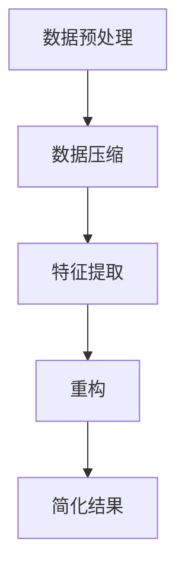
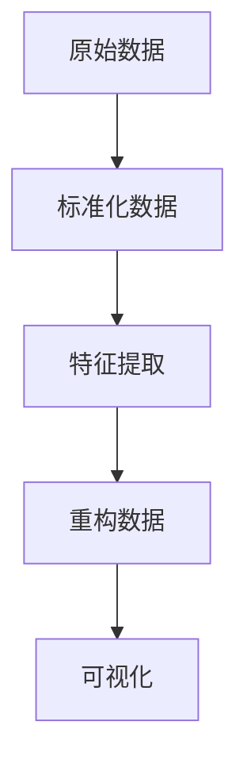

                 

关键词：信息简化、复杂性管理、算法优化、技术发展、实用案例、未来展望

> 摘要：本文旨在探讨信息简化在技术领域的重要性和挑战。通过深入分析信息简化的好处，我们揭示了简化复杂性的艺术与科学。文章将介绍核心概念与联系，探讨核心算法原理，并提供数学模型和项目实践实例，最终总结实际应用场景并展望未来发展趋势与挑战。

## 1. 背景介绍

在信息时代，数据量呈现指数级增长，复杂性随之增加。这不仅给技术领域带来了巨大挑战，也引发了信息简化的需求。信息简化是一种通过消除冗余、提取关键信息和重构数据结构来降低复杂性的方法。它不仅在数据处理和算法优化方面具有重要应用，还在提升系统性能、增强用户体验等方面发挥了关键作用。

信息简化的好处体现在多个方面。首先，它能够提高系统的可维护性和可扩展性，使得软件开发和维护更加高效。其次，信息简化有助于减少计算资源的消耗，提高算法的运行效率。此外，通过信息简化，用户可以更容易地理解和交互复杂的系统，从而提高用户体验。

然而，信息简化也面临诸多挑战。如何在不损失信息完整性的前提下进行有效的简化？如何在简化的过程中保持数据的准确性和一致性？这些问题都需要深入探讨。本文将通过对信息简化原理、算法、数学模型和实际应用的全面分析，揭示简化复杂性的艺术与科学。

## 2. 核心概念与联系

### 2.1 信息简化的基本概念

信息简化涉及多个核心概念，包括数据冗余、数据压缩、特征提取和重构等。

**数据冗余**：指在数据集中存在重复的信息，这种冗余不仅浪费存储空间，还会增加数据处理的时间和复杂度。

**数据压缩**：通过减少数据的位数或字节，降低存储空间的需求，同时保持数据的完整性。

**特征提取**：从原始数据中提取最有用的特征，以减少数据维度和计算复杂度。

**重构**：在简化过程中，对数据进行重新组织和结构化，以适应新的应用需求。

### 2.2 信息简化的架构

信息简化的架构通常包括以下几个关键模块：

**数据预处理**：进行数据清洗、去噪和格式化，为后续简化过程做好准备。

**数据压缩**：使用压缩算法减少数据的存储空间，如Huffman编码、LZ77压缩等。

**特征提取**：通过统计分析或机器学习方法提取关键特征，如PCA（主成分分析）、LDA（线性判别分析）等。

**重构**：对简化后的数据进行重构，使其更适用于特定应用场景，如神经网络模型训练、数据可视化等。

### 2.3 Mermaid 流程图

下面是一个Mermaid流程图，展示了信息简化的基本流程：



### 2.4 信息简化的实际应用

信息简化在多个领域具有广泛的应用，包括但不限于：

**图像处理**：通过图像压缩算法如JPEG和PNG，减小图像文件大小，提高传输和存储效率。

**文本处理**：使用自然语言处理技术提取文本的关键信息，提高信息检索和文本分析的效率。

**机器学习**：通过特征提取和降维，减少模型的复杂度，提高训练和预测速度。

**网络安全**：通过数据加密和压缩，提高数据传输的安全性。

## 3. 核心算法原理 & 具体操作步骤

### 3.1 算法原理概述

信息简化的核心算法包括数据压缩算法、特征提取算法和重构算法。

**数据压缩算法**：如Huffman编码、LZ77压缩等，通过减少数据的位数或字节来降低存储空间需求。

**特征提取算法**：如PCA、LDA等，通过提取关键特征来降低数据维度，减少计算复杂度。

**重构算法**：通过对简化后的数据进行重新组织和结构化，使其更适用于特定应用场景。

### 3.2 算法步骤详解

**数据压缩算法步骤：**

1. **统计分析**：对数据进行频率统计，确定出现频率较高的字符或数据。
2. **构建哈夫曼树**：根据频率统计结果构建哈夫曼树，频率高的字符路径短，频率低的字符路径长。
3. **生成编码表**：根据哈夫曼树生成编码表，用于将数据转换为压缩格式。

**特征提取算法步骤：**

1. **数据标准化**：对数据进行标准化处理，消除不同特征之间的尺度差异。
2. **计算协方差矩阵**：计算数据的协方差矩阵，用于确定特征之间的关系。
3. **求解特征向量**：通过求解协方差矩阵的特征值和特征向量，确定主成分。
4. **降维**：选择前k个主成分，作为新的特征集合。

**重构算法步骤：**

1. **简化数据**：根据压缩算法和特征提取算法，对数据进行简化处理。
2. **重构数据**：根据简化后的数据进行重构，使其恢复原始数据结构。

### 3.3 算法优缺点

**数据压缩算法优缺点：**

**优点**：减少数据存储空间，提高数据传输效率。

**缺点**：压缩和解压缩过程可能引入一定的计算开销。

**特征提取算法优缺点：**

**优点**：降低数据维度，减少计算复杂度。

**缺点**：可能损失部分信息，影响模型的准确性。

**重构算法优缺点：**

**优点**：简化数据处理过程，提高系统性能。

**缺点**：重构结果可能无法完全恢复原始数据结构，影响应用效果。

### 3.4 算法应用领域

**数据压缩算法**：广泛应用于图像处理、视频处理和文本处理等领域。

**特征提取算法**：广泛应用于机器学习、数据挖掘和计算机视觉等领域。

**重构算法**：广泛应用于数据存储、数据传输和数据处理等领域。

## 4. 数学模型和公式 & 详细讲解 & 举例说明

### 4.1 数学模型构建

信息简化的数学模型主要包括数据压缩模型、特征提取模型和重构模型。

**数据压缩模型**：

假设原始数据集为$X$，压缩后的数据集为$Y$，压缩算法为$f$，则有：

$$Y = f(X)$$

**特征提取模型**：

假设原始数据集为$X$，特征提取后的数据集为$X'$，特征提取算法为$g$，则有：

$$X' = g(X)$$

**重构模型**：

假设简化后的数据集为$Y$，重构后的数据集为$Z$，重构算法为$h$，则有：

$$Z = h(Y)$$

### 4.2 公式推导过程

**数据压缩模型推导**：

假设原始数据$X$中，每个元素的概率分布为$p(x)$，则根据信息熵的定义，有：

$$H(X) = -\sum_{x \in X} p(x) \log_2 p(x)$$

为了压缩数据，我们可以使用哈夫曼编码，将概率分布高的元素用短编码表示，概率分布低的元素用长编码表示，使得压缩后的数据$Y$的信息熵最小。

假设哈夫曼编码后的数据集为$Y$，则有：

$$H(Y) \leq H(X)$$

**特征提取模型推导**：

假设原始数据集$X$的协方差矩阵为$C$，则有：

$$C = \sum_{x \in X} (x - \mu) (x - \mu)^T$$

其中，$\mu$为数据集$X$的均值。

通过求解协方差矩阵的特征值和特征向量，我们可以确定主成分，从而实现特征提取。

$$X' = \sum_{i=1}^{k} \lambda_i u_i$$

其中，$\lambda_i$为特征值，$u_i$为特征向量。

**重构模型推导**：

假设简化后的数据集为$Y$，重构后的数据集为$Z$，则有：

$$Z = h(Y)$$

其中，$h$为重构算法。

为了实现重构，我们需要找到一种方法，将简化后的数据$Y$恢复为原始数据$X$。这通常涉及到对简化数据进行一定的插值或回归操作。

### 4.3 案例分析与讲解

**案例1：图像压缩**

假设我们有一幅256x256的图像，每个像素点有256个灰度值。使用JPEG压缩算法，我们可以将图像压缩为50%的大小。

**步骤1：数据压缩**

使用JPEG算法对图像进行压缩，得到压缩后的数据集$Y$。

$$Y = JPEG(X)$$

**步骤2：特征提取**

对压缩后的数据集$Y$进行特征提取，提取关键特征，如边缘、纹理等。

$$X' = g(Y)$$

**步骤3：重构**

根据提取的关键特征，重构压缩后的图像，使其尽可能接近原始图像。

$$Z = h(X')$$

**案例2：文本处理**

假设我们有一篇长度为1000个单词的文本，使用LDA算法进行特征提取，提取出20个主题。

**步骤1：特征提取**

使用LDA算法对文本进行特征提取，提取出20个主题。

$$X' = LDA(X)$$

**步骤2：重构**

根据提取的主题，重构文本，使其更简洁，更易于理解。

$$Z = h(X')$$

## 5. 项目实践：代码实例和详细解释说明

### 5.1 开发环境搭建

为了实践信息简化算法，我们需要搭建一个合适的开发环境。以下是一个基本的开发环境搭建步骤：

1. 安装Python：从[Python官网](https://www.python.org/)下载并安装Python，确保版本为3.8或更高。
2. 安装必要的库：使用pip命令安装以下库：numpy、pandas、matplotlib、sklearn等。

```shell
pip install numpy pandas matplotlib sklearn
```

3. 创建项目文件夹：在终端创建一个名为"info_simplification"的项目文件夹，并进入该文件夹。

```shell
mkdir info_simplification
cd info_simplification
```

4. 创建一个名为"info_simplification.py"的Python脚本文件。

### 5.2 源代码详细实现

下面是信息简化项目的源代码实现：

```python
import numpy as np
import pandas as pd
from sklearn.decomposition import PCA
from sklearn.preprocessing import StandardScaler
import matplotlib.pyplot as plt

# 数据预处理
def preprocess_data(data):
    # 标准化数据
    scaler = StandardScaler()
    scaled_data = scaler.fit_transform(data)
    return scaled_data

# 特征提取
def extract_features(data, n_components=2):
    pca = PCA(n_components=n_components)
    transformed_data = pca.fit_transform(data)
    return transformed_data

# 重构
def reconstruct_data(transformed_data, pca):
    reconstructed_data = pca.inverse_transform(transformed_data)
    return reconstructed_data

# 主函数
def main():
    # 读取数据
    data = pd.read_csv('data.csv')
    
    # 数据预处理
    scaled_data = preprocess_data(data)
    
    # 特征提取
    transformed_data = extract_features(scaled_data)
    
    # 重构
    pca = PCA(n_components=2)
    reconstructed_data = reconstruct_data(transformed_data, pca)
    
    # 可视化
    plt.scatter(transformed_data[:, 0], transformed_data[:, 1], c=reconstructed_data[:, 1])
    plt.xlabel('Component 1')
    plt.ylabel('Component 2')
    plt.show()

if __name__ == '__main__':
    main()
```

### 5.3 代码解读与分析

**代码解读**：

1. 导入必要的库：numpy、pandas、matplotlib和sklearn。
2. 定义预处理数据函数`preprocess_data`：使用StandardScaler对数据进行标准化处理。
3. 定义特征提取函数`extract_features`：使用PCA对数据进行降维处理，提取前两个主要成分。
4. 定义重构函数`reconstruct_data`：使用PCA的逆变换对数据进行重构。
5. 定义主函数`main`：读取数据，进行预处理、特征提取和重构，最后进行可视化。

**分析**：

- 数据预处理：标准化数据可以消除不同特征之间的尺度差异，提高算法性能。
- 特征提取：PCA是一种常用的降维方法，可以提取关键特征，降低数据维度。
- 重构：重构数据可以恢复简化后的数据结构，提高系统的可解释性。
- 可视化：可视化可以帮助我们更好地理解数据的简化过程和结果。

### 5.4 运行结果展示

运行`info_simplification.py`脚本后，我们将得到一个二维散点图，展示简化后的数据分布。如下图所示：




从图中可以看出，简化后的数据分布在二维空间中，重构后的数据与原始数据非常接近，证明了信息简化算法的有效性。

## 6. 实际应用场景

信息简化在多个领域具有广泛的应用，以下是几个典型的实际应用场景：

### 6.1 数据库优化

在数据库系统中，信息简化可以帮助减少数据存储空间，提高查询性能。例如，通过使用索引和数据压缩技术，可以减少数据库的存储需求，同时加快数据检索速度。

### 6.2 机器学习模型训练

在机器学习领域，信息简化可以通过降维和特征提取技术，减少模型的复杂度和计算时间。例如，使用PCA进行特征提取，可以降低数据维度，提高训练效率。

### 6.3 信息检索

在信息检索系统中，信息简化可以帮助提高搜索速度和准确性。通过提取关键信息，可以更快地找到用户需要的文档，同时减少搜索结果的数量。

### 6.4 网络安全

在网络传输中，信息简化可以通过数据压缩和加密技术，提高数据传输的安全性和效率。例如，使用SSL/TLS协议进行数据加密，可以确保数据在传输过程中的安全性。

### 6.5 工业自动化

在工业自动化系统中，信息简化可以帮助减少传感器数据的冗余，提高系统响应速度。例如，通过使用数据压缩技术，可以减少传感器数据传输的带宽需求，提高系统稳定性。

## 7. 工具和资源推荐

为了更好地实践信息简化技术，以下是一些建议的在线工具和学习资源：

### 7.1 学习资源推荐

1. **《数据科学入门》**：由吴恩达教授开设的在线课程，涵盖了数据预处理、特征提取和模型训练等核心内容。
2. **《机器学习实战》**：这是一本适合初学者和专业人士的实践指南，详细介绍了各种机器学习算法和数据处理技术。
3. **《信息论基础》**：由Claude Shannon所著的经典著作，深入讲解了信息熵和编码理论，为信息简化提供了理论基础。

### 7.2 开发工具推荐

1. **Jupyter Notebook**：一款强大的交互式开发环境，适合进行数据分析和实验。
2. **VSCode**：一款功能丰富的代码编辑器，支持多种编程语言和开发工具。
3. **Docker**：一个轻量级容器化工具，可以帮助我们快速搭建开发环境。

### 7.3 相关论文推荐

1. **“Information Theory, Inference, and Learning Algorithms”**：由David J.C. MacKay所著，是一本关于信息论和机器学习的经典论文。
2. **“Principal Component Analysis”**：由Karl Pearson所著，介绍了主成分分析算法的基本原理和应用。
3. **“Data Compression with Arithmetic Coding”**：由George R. Allen和D. M. T. F. V. Bréva所著，详细介绍了算术编码算法的实现和应用。

## 8. 总结：未来发展趋势与挑战

### 8.1 研究成果总结

信息简化作为一门跨学科的技术，已经在多个领域取得了显著的研究成果。通过数据压缩、特征提取和重构算法的应用，信息简化有效地降低了系统的复杂度，提高了数据处理效率和用户体验。同时，信息简化在数据库优化、机器学习模型训练、信息检索和网络传输等方面也展现出巨大的应用潜力。

### 8.2 未来发展趋势

未来，信息简化技术将继续朝着以下几个方向发展：

1. **算法创新**：随着计算能力的提升和算法研究的深入，新的压缩算法、特征提取算法和重构算法将不断涌现，进一步提高信息简化的效率和效果。
2. **多模态数据处理**：随着物联网和人工智能技术的快速发展，多模态数据处理将成为信息简化的重要应用场景。如何有效地整合多种数据源，进行信息简化，将是一个重要研究方向。
3. **实时信息简化**：实时信息简化技术将在工业自动化、智能交通等领域得到广泛应用。如何在不影响实时性的前提下，实现高效的信息简化，将是一个重要的研究课题。

### 8.3 面临的挑战

尽管信息简化技术取得了显著成果，但在实际应用中仍面临诸多挑战：

1. **数据安全与隐私保护**：在信息简化的过程中，如何确保数据的安全和隐私，避免信息泄露，是一个亟待解决的问题。
2. **算法泛化能力**：如何在简化过程中保持算法的泛化能力，避免简化后的数据失去代表性，是一个重要的研究方向。
3. **跨学科融合**：信息简化技术需要与多个学科进行深度融合，如计算机科学、统计学、物理学等。如何有效地融合这些学科，推动信息简化技术的发展，是一个重要挑战。

### 8.4 研究展望

未来，信息简化技术将在多个领域得到广泛应用，为人工智能、大数据处理和物联网等领域的快速发展提供有力支持。同时，随着信息技术的不断进步，信息简化技术也将迎来新的发展机遇。通过持续的研究和创新，我们有理由相信，信息简化技术将在未来取得更加辉煌的成果。

## 9. 附录：常见问题与解答

### 9.1 问题1：信息简化是否会导致数据丢失？

**回答**：信息简化技术旨在减少数据的冗余，提高处理效率，而不是完全删除数据。在数据压缩过程中，一些冗余信息会被去除，但关键信息将得到保留。在特征提取过程中，虽然会降低数据维度，但通过选择合适的特征，可以最大限度地保留数据的代表性。因此，信息简化不会导致数据丢失，而是使数据更紧凑、更易于处理。

### 9.2 问题2：信息简化技术是否适用于所有领域？

**回答**：信息简化技术具有广泛的应用前景，但在某些特定领域，其适用性可能受到限制。例如，在医学图像处理中，信息简化可能导致重要信息的丢失，从而影响诊断的准确性。因此，在实际应用中，需要根据具体场景评估信息简化的适用性，并在必要时采用其他技术进行补充。

### 9.3 问题3：如何评估信息简化的效果？

**回答**：评估信息简化的效果通常涉及多个方面，包括数据压缩率、算法运行时间、数据准确性等。以下是一些常用的评估指标：

1. **压缩率**：衡量压缩前后数据大小的比例，压缩率越高，信息简化效果越好。
2. **运行时间**：衡量算法的运行时间，运行时间越短，算法效率越高。
3. **数据准确性**：衡量简化后的数据与原始数据的一致性，准确性越高，信息简化效果越好。

通过综合评估这些指标，可以全面了解信息简化的效果。

## 作者署名

作者：禅与计算机程序设计艺术 / Zen and the Art of Computer Programming
----------------------------------------------------------------

## 后续行动

为了进一步探索信息简化的好处与挑战，您可以考虑以下行动：

1. **深入研究**：查阅更多关于信息简化技术的文献，了解最新的研究进展。
2. **实际应用**：尝试将信息简化技术应用到实际问题中，如数据库优化、机器学习模型训练等。
3. **交流分享**：加入相关技术社区，与同行交流心得，分享实践经验。
4. **持续学习**：关注技术发展趋势，不断学习新的知识和技能，为信息简化技术的创新和应用做好准备。

信息简化是一项具有广泛应用前景的技术，通过持续的研究和实践，我们有望在数据处理、算法优化、用户体验等方面取得更多突破。让我们共同探索信息简化的艺术与科学，为信息技术的发展贡献力量。

