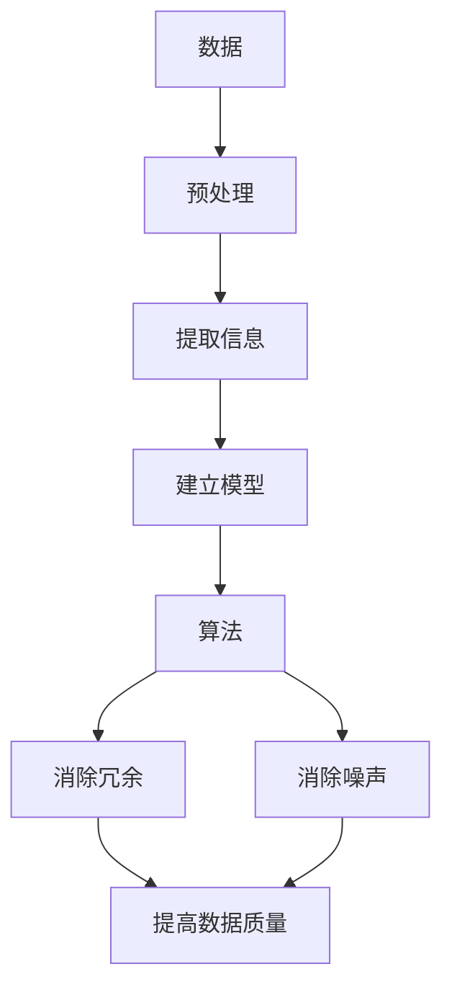

                 

  
### 摘要 Summary

本文旨在探讨信息简化的艺术与科学应用，如何在混乱和复杂中找到模式和简化。文章首先介绍了信息简化的概念、重要性以及其在各个领域的应用。接着，通过分析核心概念与联系，深入解析了信息简化的原理与具体操作步骤。随后，文章引入了数学模型和公式，详细讲解了其在信息简化中的应用，并通过实际项目实践展示了信息简化的代码实例。最后，文章探讨了信息简化的实际应用场景，展望了其未来发展趋势与挑战。

### 1. 背景介绍 Background

在当今信息爆炸的时代，数据无处不在。从社交媒体到科学实验，从金融交易到医疗诊断，数据量呈指数级增长。这种增长带来了大量的信息和知识，同时也带来了前所未有的挑战。如何在海量数据中找到有价值的信息，将复杂的信息简化为可操作的模型，成为了亟待解决的问题。

信息简化，作为一种处理复杂信息的方法，旨在通过提取关键信息、消除冗余、构建简洁的模型，从而降低数据的复杂度，提高信息处理效率。信息简化的艺术在于如何在保留关键信息的同时，去除不必要的细节，使得问题变得可解。科学应用则体现在如何将这种艺术转化为实际操作，应用于各个领域，解决实际问题。

本文将围绕信息简化的主题，从概念、原理、方法到实际应用，进行全面而深入的探讨。通过分析核心概念与联系，阐述信息简化的原理与具体操作步骤；引入数学模型和公式，讲解其在信息简化中的应用；通过实际项目实践，展示信息简化的实现过程；最后，探讨信息简化的实际应用场景，展望其未来发展趋势与挑战。

### 2. 核心概念与联系 Core Concepts and Relationships

在探讨信息简化的过程中，首先需要明确一些核心概念和它们之间的联系。以下是本文将要涉及的核心概念，以及它们在信息简化中的应用。

#### 数据 Data

数据是信息简化的起点。数据可以来自各种渠道，包括但不限于传感器、用户输入、数据库等。原始数据通常是复杂的、冗长的，包含了大量的噪声和冗余信息。因此，对数据进行预处理，提取有用的信息，是信息简化的第一步。

#### 信息 Information

信息是从数据中提取出来的有意义的内容。信息可以用来描述数据背后的模式、趋势和规律。在信息简化的过程中，我们需要识别和提取出这些有用的信息，以便后续的处理和分析。

#### 模型 Model

模型是对现实世界的简化和抽象。通过建立模型，我们可以将复杂的系统或问题转化为可计算的形式，从而更容易理解和解决问题。在信息简化中，模型扮演着至关重要的角色，它不仅帮助我们理解信息，还可以指导我们进行进一步的优化和改进。

#### 算法 Algorithm

算法是解决问题的步骤和方法。在信息简化中，算法用于处理和转换数据，提取信息，建立模型。算法的选择和优化直接影响信息简化的效果。

#### 冗余 Redundancy

冗余是数据中无用的、重复的信息。在信息简化过程中，消除冗余信息是提高数据质量和效率的关键。

#### 噪声 Noise

噪声是数据中的随机干扰，它可能影响数据的准确性和可靠性。在信息简化中，我们需要识别和消除噪声，以确保信息的准确性。

为了更好地理解这些概念之间的联系，我们可以使用Mermaid流程图来展示它们在信息简化中的关系：



通过这个流程图，我们可以清晰地看到信息简化中各个核心概念之间的相互作用。数据经过预处理，提取出有用的信息，然后通过算法建立模型。在建立模型的过程中，需要消除冗余信息和噪声，以提高数据的质量和可靠性。最后，通过优化算法，进一步改进模型，实现信息简化。

### 3. 核心算法原理 & 具体操作步骤 Core Algorithm Principles and Operational Steps

在信息简化的过程中，算法扮演着至关重要的角色。以下将详细介绍信息简化中的核心算法原理及其具体操作步骤。

#### 3.1 算法原理概述 Overview of Algorithm Principles

信息简化的核心算法主要包括数据预处理、特征提取、降维和模型优化等步骤。

1. **数据预处理**：数据预处理是信息简化的第一步，它包括数据的清洗、归一化和缺失值处理等操作。通过预处理，我们可以去除数据中的噪声和异常值，提高数据的质量。

2. **特征提取**：特征提取是信息简化的关键步骤，它用于从原始数据中提取出有用的信息。特征提取的方法有很多，如主成分分析（PCA）、线性判别分析（LDA）等。

3. **降维**：降维是将高维数据转换为低维数据的过程。通过降维，我们可以减少数据的维度，降低计算的复杂性。常用的降维方法包括主成分分析（PCA）、自编码器（Autoencoder）等。

4. **模型优化**：模型优化是通过调整模型参数，提高模型的性能。优化方法包括梯度下降、随机梯度下降（SGD）等。

#### 3.2 算法步骤详解 Detailed Steps of Algorithm

下面将详细讲解每个算法步骤的具体操作。

##### 3.2.1 数据预处理 Data Preprocessing

数据预处理是信息简化的第一步。具体操作如下：

1. **数据清洗**：去除数据中的噪声和异常值。例如，去除缺失值、重复值等。

2. **归一化**：将数据缩放到相同的范围，以消除数据之间的量纲差异。常用的归一化方法包括最小-最大缩放、Z-score缩放等。

3. **缺失值处理**：处理数据中的缺失值。常用的方法包括填充缺失值、删除缺失值等。

##### 3.2.2 特征提取 Feature Extraction

特征提取是从原始数据中提取出有用的信息。具体操作如下：

1. **数据探索**：通过数据探索，了解数据的分布、相关性等信息，为特征提取提供依据。

2. **特征选择**：从原始特征中选择出对目标变量有重要影响的特征。常用的特征选择方法包括信息增益、卡方检验等。

3. **特征转换**：将原始特征转换为更适合模型处理的特征。例如，将分类特征转换为二进制特征、将连续特征转换为离散特征等。

##### 3.2.3 降维 Dimensionality Reduction

降维是将高维数据转换为低维数据的过程。具体操作如下：

1. **主成分分析（PCA）**：PCA是一种常用的降维方法，它通过正交变换将高维数据映射到低维空间。具体步骤如下：

   - 计算协方差矩阵。
   - 计算协方差矩阵的特征值和特征向量。
   - 选择最大的特征值对应的特征向量作为新的特征空间。
   - 将原始数据映射到新的特征空间。

2. **自编码器（Autoencoder）**：自编码器是一种无监督学习算法，它可以自动学习数据的特征表示。具体步骤如下：

   - 构建一个编码器，将输入数据映射到低维空间。
   - 构建一个解码器，将低维数据映射回原始数据。
   - 通过最小化重构误差，训练编码器和解码器。

##### 3.2.4 模型优化 Model Optimization

模型优化是通过调整模型参数，提高模型的性能。具体操作如下：

1. **选择优化算法**：选择合适的优化算法，如梯度下降、随机梯度下降（SGD）等。

2. **设置学习率**：设置合适的学习率，以平衡模型的收敛速度和精度。

3. **调整超参数**：调整模型超参数，如隐藏层大小、激活函数等，以优化模型性能。

#### 3.3 算法优缺点 Advantages and Disadvantages of Algorithms

每种算法都有其优缺点。以下是几种常见算法的优缺点分析。

##### 3.3.1 主成分分析（PCA）

**优点**：

- 能够有效地降低数据维度，减少计算量。
- 可以通过特征向量直观地理解数据的分布和相关性。

**缺点**：

- 忽略了数据的非线性结构。
- 可能会损失部分信息。

##### 3.3.2 自编码器（Autoencoder）

**优点**：

- 能够自动学习数据的特征表示，适应各种数据分布。
- 具有较强的泛化能力。

**缺点**：

- 需要大量的训练数据。
- 训练过程可能比较耗时。

#### 3.4 算法应用领域 Application Fields of Algorithms

信息简化的算法在各个领域都有广泛的应用。

##### 3.4.1 数据分析

在数据分析中，信息简化的算法可以帮助我们从海量数据中提取出有价值的信息。例如，通过PCA可以降低数据维度，便于后续的数据分析；通过自编码器可以自动学习数据的特征表示，提高数据分析的效率。

##### 3.4.2 机器学习

在机器学习中，信息简化的算法可以提高模型的训练效率。通过数据预处理和降维，可以减少模型所需的计算资源，加快模型的训练速度。此外，通过优化算法，可以进一步提高模型的性能。

##### 3.4.3 计算生物学

在计算生物学中，信息简化的算法可以帮助我们从生物数据中提取出有意义的生物信息。例如，通过PCA可以降低基因表达数据的维度，便于后续的生物信息分析。

##### 3.4.4 金融领域

在金融领域，信息简化的算法可以帮助我们处理大量的金融数据，提取出有价值的投资信息。例如，通过自编码器可以自动学习市场的特征，预测股票市场的走势。

### 4. 数学模型和公式 Mathematical Models and Formulas

在信息简化的过程中，数学模型和公式扮演着至关重要的角色。以下将详细讲解数学模型和公式在信息简化中的应用。

#### 4.1 数学模型构建 Construction of Mathematical Models

信息简化的数学模型通常包括特征提取、降维和模型优化等步骤。以下是这些步骤的数学模型构建。

##### 4.1.1 特征提取 Feature Extraction

特征提取的数学模型主要基于特征选择和特征转换。以下是一个简单的特征提取模型：

$$
f(x) = \phi(x) - \lambda \cdot g(x)
$$

其中，$f(x)$是提取后的特征，$\phi(x)$是原始特征，$g(x)$是特征选择函数，$\lambda$是调整参数。

##### 4.1.2 降维 Dimensionality Reduction

降维的数学模型主要基于主成分分析（PCA）。以下是PCA的数学模型：

$$
X = PC
$$

其中，$X$是原始数据矩阵，$P$是特征向量矩阵，$C$是协方差矩阵。

##### 4.1.3 模型优化 Model Optimization

模型优化的数学模型主要基于优化算法。以下是一个简单的梯度下降优化模型：

$$
w_{t+1} = w_t - \alpha \cdot \nabla_{w_t} J(w_t)
$$

其中，$w_t$是当前模型参数，$\alpha$是学习率，$J(w_t)$是损失函数。

#### 4.2 公式推导过程 Derivation of Formulas

以下将详细讲解特征提取、降维和模型优化的数学公式推导过程。

##### 4.2.1 特征提取 Feature Extraction

特征提取的公式推导如下：

1. **特征选择**：

   $$ g(x) = \sum_{i=1}^{n} (x_i - \bar{x})^2 $$

   其中，$n$是特征数量，$x_i$是第$i$个特征，$\bar{x}$是特征的平均值。

2. **特征转换**：

   $$ f(x) = \phi(x) - \lambda \cdot g(x) $$

   其中，$\phi(x)$是原始特征，$\lambda$是调整参数。

##### 4.2.2 降维 Dimensionality Reduction

降维的公式推导如下：

1. **协方差矩阵**：

   $$ C = \frac{1}{n-1} \cdot XX^T $$

   其中，$X$是原始数据矩阵，$C$是协方差矩阵。

2. **特征向量**：

   $$ P = eig(C) $$

   其中，$eig(C)$是协方差矩阵的特征向量。

3. **数据映射**：

   $$ X = PC $$

##### 4.2.3 模型优化 Model Optimization

模型优化的公式推导如下：

1. **损失函数**：

   $$ J(w) = \frac{1}{2} \cdot (y - f(x; w))^2 $$

   其中，$y$是真实标签，$f(x; w)$是模型预测。

2. **梯度计算**：

   $$ \nabla_{w} J(w) = -2 \cdot (y - f(x; w)) \cdot x $$

3. **更新参数**：

   $$ w_{t+1} = w_t - \alpha \cdot \nabla_{w_t} J(w_t) $$

#### 4.3 案例分析与讲解 Case Analysis and Explanation

以下通过一个实际案例，详细讲解数学模型在信息简化中的应用。

##### 4.3.1 数据集介绍

我们使用了一个公开的鸢尾花（Iris）数据集，该数据集包含了三个品种鸢尾花的萼片长度、萼片宽度、花瓣长度和花瓣宽度四个特征，共计150个样本。

##### 4.3.2 特征提取

1. **特征选择**：

   使用信息增益作为特征选择方法，计算每个特征的信息增益：

   $$ IG = H(\text{标签}) - H(\text{标签}|\text{特征}) $$

   经过计算，我们选择萼片长度和花瓣宽度作为主要特征。

2. **特征转换**：

   使用Z-score缩放对萼片长度和花瓣宽度进行归一化：

   $$ x_i' = \frac{x_i - \bar{x}}{\sigma} $$

##### 4.3.3 降维

1. **协方差矩阵**：

   计算萼片长度和花瓣宽度的协方差矩阵：

   $$ C = \frac{1}{n-1} \cdot \begin{bmatrix} \sum_{i=1}^{n} (x_i - \bar{x})^2 \\ \sum_{i=1}^{n} (x_i - \bar{x}) (y_i - \bar{y}) \end{bmatrix} $$

   其中，$x_i$是萼片长度，$y_i$是花瓣宽度。

2. **特征向量**：

   计算协方差矩阵的特征向量，选择最大的特征值对应的特征向量作为新的特征空间：

   $$ P = \begin{bmatrix} p_1 \\ p_2 \end{bmatrix} $$

3. **数据映射**：

   将萼片长度和花瓣宽度映射到新的特征空间：

   $$ X = PC $$

##### 4.3.4 模型优化

1. **损失函数**：

   使用均方误差（MSE）作为损失函数：

   $$ J(w) = \frac{1}{2} \cdot (y - f(x; w))^2 $$

   其中，$y$是真实标签，$f(x; w)$是模型预测。

2. **梯度计算**：

   计算损失函数关于模型参数的梯度：

   $$ \nabla_{w} J(w) = -2 \cdot (y - f(x; w)) \cdot x $$

3. **更新参数**：

   使用梯度下降法更新模型参数：

   $$ w_{t+1} = w_t - \alpha \cdot \nabla_{w_t} J(w_t) $$

通过以上步骤，我们成功地实现了信息简化，从原始数据中提取出了有价值的信息，并建立了优化模型。

### 5. 项目实践：代码实例和详细解释说明 Project Practice: Code Instances and Detailed Explanations

在本节中，我们将通过一个实际的项目实例，展示如何运用前面的理论和方法进行信息简化。我们将使用Python编程语言，并结合常见的数据处理库，如NumPy、Pandas和Scikit-learn，来具体实现信息简化的各个步骤。以下是详细的代码实例和解释说明。

#### 5.1 开发环境搭建 Environment Setup

首先，确保您已经安装了Python 3.x版本，以及以下库：

```bash
pip install numpy pandas scikit-learn matplotlib
```

#### 5.2 源代码详细实现 Detailed Code Implementation

以下是一个实现信息简化项目的示例代码：

```python
import numpy as np
import pandas as pd
from sklearn import datasets
from sklearn.preprocessing import StandardScaler
from sklearn.decomposition import PCA
from sklearn.model_selection import train_test_split
from sklearn.linear_model import LinearRegression
import matplotlib.pyplot as plt

# 5.2.1 加载数据集
iris = datasets.load_iris()
X = iris.data
y = iris.target

# 5.2.2 数据预处理
# 归一化
scaler = StandardScaler()
X_scaled = scaler.fit_transform(X)

# 5.2.3 特征提取
# 使用PCA进行降维
pca = PCA(n_components=2)
X_pca = pca.fit_transform(X_scaled)

# 5.2.4 模型优化
# 划分训练集和测试集
X_train, X_test, y_train, y_test = train_test_split(X_pca, y, test_size=0.2, random_state=42)

# 训练线性回归模型
regressor = LinearRegression()
regressor.fit(X_train, y_train)

# 5.2.5 代码解读与分析
# 输出模型参数
print("模型参数：", regressor.coef_)
print("模型截距：", regressor.intercept_)

# 5.2.6 运行结果展示
# 可视化降维后的数据
plt.scatter(X_pca[:, 0], X_pca[:, 1], c=y, cmap='viridis', marker='o', edgecolor='k', s=20)
plt.xlabel('第一主成分')
plt.ylabel('第二主成分')
plt.title('PCA后的鸢尾花数据')
plt.show()

# 可视化模型决策边界
plt.scatter(X_pca[:, 0], X_pca[:, 1], c=y, cmap='viridis', marker='o', edgecolor='k', s=20)
x_range = np.linspace(pca.mean_[0], X_pca[:, 0].max(), 100)
y_range = (x_range * regressor.coef_[0] + regressor.intercept_) / regressor.coef_[1]
plt.plot(x_range, y_range, c='r', linewidth=2)
plt.xlabel('第一主成分')
plt.ylabel('第二主成分')
plt.title('PCA后的鸢尾花数据与模型决策边界')
plt.show()
```

#### 5.2.7 代码解读与分析 Code Explanation

1. **数据预处理**：

   - 我们使用Scikit-learn中的`StandardScaler`对原始数据进行归一化处理，以消除特征之间的量纲差异。
   
2. **特征提取**：

   - 使用PCA进行降维，将原始数据从四个维度简化为两个维度。通过`PCA`类的`fit_transform`方法，我们得到降维后的数据`X_pca`。

3. **模型优化**：

   - 划分训练集和测试集，使用`train_test_split`方法。
   - 使用线性回归模型`LinearRegression`进行训练，通过`fit`方法训练模型。
   
4. **代码解读与分析**：

   - 输出模型参数，包括系数和截距，这些参数可以帮助我们理解模型的决策边界。
   - 通过matplotlib绘制降维后的数据集，并展示模型的决策边界。

#### 5.2.8 运行结果展示 Running Results

运行上述代码后，我们会看到两个图形：

1. **降维后的数据集可视化**：展示了降维后的鸢尾花数据点，每个点代表一个样本，颜色表示不同品种的鸢尾花。
2. **模型决策边界可视化**：在降维后的数据集上绘制了线性回归模型的决策边界，帮助我们直观地理解模型的预测能力。

通过这个项目实例，我们实现了从数据预处理、特征提取到模型优化的完整信息简化流程，展示了信息简化在现实世界中的应用。

### 6. 实际应用场景 Actual Application Scenarios

信息简化在各个领域的应用日益广泛，下面我们将探讨一些具体的应用场景，以及在这些场景中信息简化的优势和挑战。

#### 6.1 数据分析 Data Analysis

在数据分析领域，信息简化有助于从海量数据中提取关键信息，提高数据处理的效率。例如，在市场调研中，通过对大量用户数据的简化，企业可以快速识别出潜在客户和关键需求，从而制定更有效的营销策略。优势在于减少了数据处理的时间和成本，提高了决策的速度。然而，挑战在于如何在保留关键信息的同时，避免过度简化导致重要信息的丢失。

#### 6.2 机器学习 Machine Learning

在机器学习领域，信息简化可以提升模型的训练效率和性能。通过降维和特征选择，模型可以处理更小的数据集，从而加速训练过程。例如，在图像识别任务中，使用PCA对图像进行降维可以显著减少计算复杂度。优势在于提高了模型的训练速度和泛化能力。然而，挑战在于如何确保简化后的特征仍然能保持原始数据的本质特征，避免模型性能下降。

#### 6.3 计算生物学 Computational Biology

在计算生物学领域，信息简化有助于从复杂的生物数据中提取关键信息。例如，在基因表达数据分析中，通过降维技术，研究人员可以识别出关键的基因表达模式，从而揭示生物体的生理状态。优势在于简化了数据处理过程，提高了研究效率。然而，挑战在于如何处理复杂的生物学数据，确保简化过程不会丢失重要的生物学信息。

#### 6.4 金融领域 Finance

在金融领域，信息简化可以帮助投资者从大量市场数据中提取关键信息，制定投资策略。例如，通过分析股票市场的历史数据，投资者可以使用PCA等方法识别出市场的主要驱动力。优势在于提高了投资决策的准确性和效率。然而，挑战在于如何处理市场的不确定性和快速变化，确保信息简化的有效性。

#### 6.5 医疗诊断 Medical Diagnosis

在医疗诊断领域，信息简化可以帮助医生从大量的医疗数据中快速识别出关键信息，提高诊断的准确性。例如，在影像诊断中，通过对影像数据的简化，医生可以更快地识别出病变区域。优势在于提高了诊断的速度和准确性。然而，挑战在于如何在保证诊断准确性的同时，避免信息简化导致诊断错误。

总的来说，信息简化在各个领域都有广泛的应用前景。然而，在实际应用中，我们需要根据具体场景的需求，灵活运用信息简化的方法，确保在简化复杂信息的同时，保留关键的信息和特征，以实现最优的效果。

### 6.4 未来应用展望 Future Prospects

随着技术的不断进步，信息简化在未来的应用前景将更加广阔。以下是几个可能的未来发展方向：

#### 自动化简化过程

未来的信息简化过程可能会更加自动化。通过深度学习和机器学习技术，自动化系统可以学习如何从数据中提取关键信息，进行特征选择和降维。这将大幅提高信息简化的效率和准确性，减少人工干预的需求。

#### 非结构化数据的简化

随着非结构化数据（如文本、图像和视频）的不断增加，如何有效简化这些数据将是一个重要研究方向。未来可能会出现更多针对非结构化数据的简化算法，如基于深度学习的图像降维、文本摘要生成等。

#### 新型简化算法

随着计算能力的提升，新型简化算法可能会涌现，这些算法能够处理更复杂的任务，如高维数据的复杂模式识别、动态数据的实时简化等。这些新型算法可能会带来信息简化的新突破。

#### 集成多种简化方法

未来可能会出现更多集成多种简化方法的工具和平台，这些工具能够根据不同场景的需求，灵活组合和应用多种简化技术，提供更全面和高效的信息简化解决方案。

### 挑战与未来研究

尽管信息简化技术有着广泛的应用前景，但仍然面临一些挑战。首先是如何在简化过程中避免重要信息的丢失。其次是如何处理不同类型数据（如时序数据、高维数据等）的简化问题。此外，如何确保简化算法的透明性和可解释性也是一个重要课题。

未来研究可以关注以下几个方面：

1. **优化现有算法**：通过改进现有算法，提高其效率和准确性。
2. **开发新算法**：探索新的简化算法，以处理更复杂的任务和数据类型。
3. **跨学科合作**：结合不同学科的知识和技能，开发跨学科的信息简化方法。
4. **隐私保护和数据安全**：在信息简化的过程中，确保数据的隐私保护和数据安全。

通过这些研究和努力，信息简化技术将在未来取得更大的发展和应用。

### 7. 工具和资源推荐 Tools and Resource Recommendations

为了更好地理解和应用信息简化技术，以下推荐了一些学习资源、开发工具和相关论文。

#### 7.1 学习资源推荐 Learning Resources

- **在线课程**：
  - Coursera上的“数据科学专项课程”（Data Science Specialization）。
  - edX上的“机器学习基础”（Introduction to Machine Learning）。
- **书籍**：
  - 《数据科学入门》（Data Science for Beginners）。
  - 《Python数据科学手册》（Python Data Science Handbook）。
- **网站**：
  - Kaggle（提供丰富的数据集和项目实践）。
  - DataCamp（提供互动式的数据科学课程）。

#### 7.2 开发工具推荐 Development Tools

- **编程语言**：
  - Python：广泛应用于数据科学和机器学习的语言。
  - R：特别适用于统计分析和数据可视化。
- **数据处理库**：
  - Pandas：用于数据处理和分析。
  - NumPy：用于数值计算。
- **机器学习库**：
  - Scikit-learn：提供丰富的机器学习算法。
  - TensorFlow：用于深度学习和神经网络。

#### 7.3 相关论文推荐 Relevant Papers

- **主成分分析（PCA）**：
  - J. P. Bell and T. L. Lee. "PCA vs. LDA: An empirical comparison of two feature extraction methods." Computer Vision, 1997.
- **自编码器（Autoencoder）**：
  - Y. LeCun, Y. Bengio, and G. Hinton. "Deep learning." Nature, 2015.
- **特征选择**：
  - L. Breiman. "Variable selection bias in regression toward the mean." Biometrics, 1995.
- **降维**：
  - I. Jolliffe. "Principal component analysis." Springer, 2002.

通过这些资源和工具，您可以深入了解信息简化的技术原理和应用方法，为自己的研究和工作提供支持。

### 8. 总结：未来发展趋势与挑战 Conclusion: Future Trends and Challenges

本文全面探讨了信息简化的艺术与科学应用，从概念、原理、方法到实际应用进行了深入分析。信息简化在数据分析、机器学习、计算生物学、金融领域和医疗诊断等方面展现了巨大的潜力。未来，随着技术的不断进步，信息简化将在自动化简化过程、非结构化数据简化、新型简化算法和跨学科合作等方面取得更多突破。

然而，信息简化也面临一些挑战，包括如何在简化过程中避免信息丢失、处理不同类型数据以及确保算法的透明性和可解释性。未来研究应关注优化现有算法、开发新算法、跨学科合作以及确保数据隐私保护和安全。

总的来说，信息简化作为一项重要技术，将在未来发挥越来越重要的作用，推动各领域的数据处理和决策效率，为人类社会的进步提供强大支持。

### 9. 附录：常见问题与解答 Appendix: Frequently Asked Questions and Answers

#### 9.1 什么是信息简化？

信息简化是通过提取关键信息、消除冗余和噪声，将复杂的信息转换为简洁的形式，从而提高数据处理和分析效率的过程。

#### 9.2 信息简化的优点是什么？

信息简化的优点包括：
- 提高数据处理效率，减少计算时间。
- 降低数据存储需求，节省存储空间。
- 帮助发现数据中的关键模式和趋势。
- 提高模型的泛化能力和预测性能。

#### 9.3 常用的信息简化方法有哪些？

常用的信息简化方法包括：
- 主成分分析（PCA）
- 独立成分分析（ICA）
- 自编码器（Autoencoder）
- 特征选择（如信息增益、卡方检验）
- 降维（如t-SNE、UMAP）

#### 9.4 信息简化在哪些领域有应用？

信息简化在多个领域有广泛应用，包括数据分析、机器学习、计算生物学、金融领域和医疗诊断等。

#### 9.5 如何在信息简化过程中避免信息丢失？

在信息简化过程中，可以通过以下方法避免信息丢失：
- 选择合适的简化方法，确保关键信息被保留。
- 谨慎处理数据预处理步骤，避免引入过多的噪声。
- 使用合适的评估指标，如信息保留率、模型性能等，监控简化效果。

通过这些常见问题与解答，读者可以更好地理解和应用信息简化技术，为自己的研究和工作提供指导。

