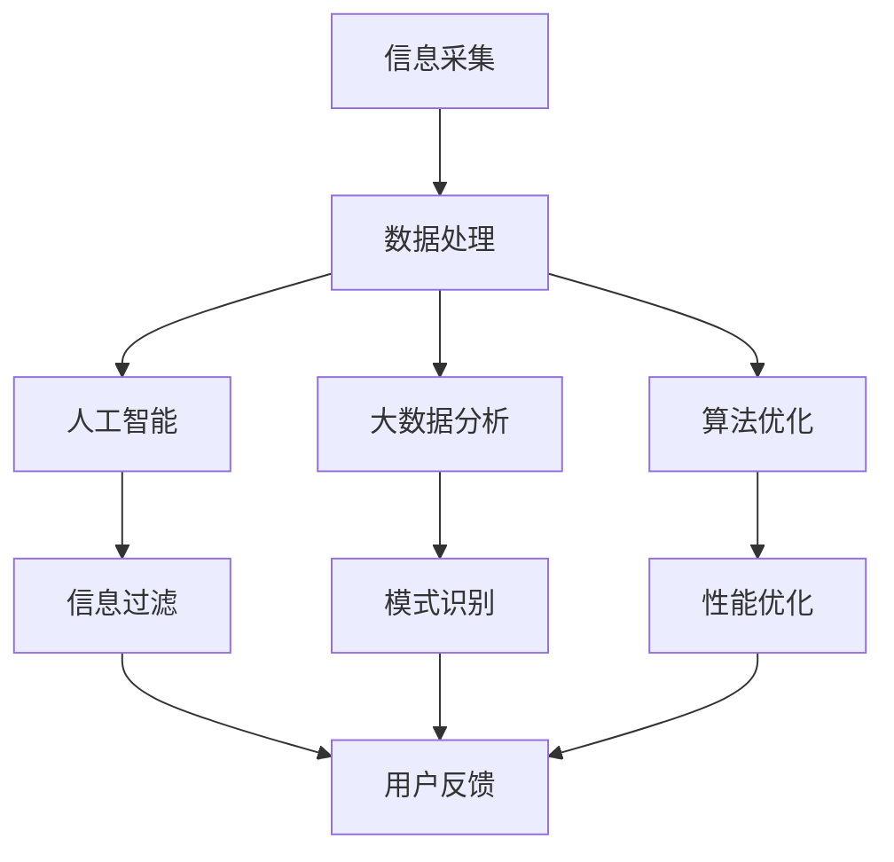

                 

关键词：信息过载，信息筛选，人工智能，大数据，算法优化，机器学习

> 摘要：本文将深入探讨信息过载现象及其带来的挑战，重点介绍一系列先进的信息筛选技术，包括人工智能、大数据处理和算法优化等。通过剖析这些技术的工作原理、操作步骤及其优缺点，结合实际应用场景，为读者提供全面的视角，帮助我们在信息爆炸的时代找到真正有价值的信息。

## 1. 背景介绍

在互联网时代，信息以惊人的速度增长。每天，大量的数据被生成、存储、传输和消费。根据国际数据公司（IDC）的统计，全球数据量以每年40%的速度增长。如此庞大的数据量带来了前所未有的信息过载问题，也称为信息泛滥。

### 信息过载的定义与表现

信息过载是指由于信息输入的速度和数量超过个体的处理能力，导致个体难以有效地理解和利用这些信息的状况。其具体表现包括：

- **注意力分散**：大量的信息让人无法集中精力处理最重要的信息。
- **信息冗余**：相似或重复的信息占据了宝贵的处理时间和存储空间。
- **决策困难**：在海量的信息中，做出合理的决策变得异常复杂。
- **心理压力**：信息过载对个体的心理健康产生负面影响，如焦虑和压力。

### 信息过载的挑战

面对信息过载，个体和组织面临以下挑战：

- **筛选信息**：从海量数据中筛选出有价值的信息是一项艰巨的任务。
- **时间管理**：信息处理需要耗费大量的时间，降低了工作效率。
- **数据安全**：敏感信息在信息过载的环境中更容易泄露。
- **知识积累**：难以在信息过载的环境中建立系统和深入的知识体系。

## 2. 核心概念与联系

### 信息筛选技术简介

为了应对信息过载，我们需要运用一系列信息筛选技术，包括但不限于人工智能、大数据处理和算法优化等。这些技术协同工作，帮助我们更有效地筛选和处理信息。

### Mermaid 流程图

以下是信息筛选技术的基本架构，通过 Mermaid 流程图展示：



### 各技术的作用

- **信息采集**：收集各种来源的数据，如互联网、数据库、传感器等。
- **数据处理**：清洗、整理和标准化数据，为后续分析做准备。
- **人工智能**：利用机器学习和深度学习技术对数据进行智能分析。
- **大数据分析**：通过分布式计算处理大规模数据集，挖掘数据价值。
- **算法优化**：改进算法效率，降低计算成本，提高处理速度。
- **信息过滤**：根据用户需求和预设规则筛选出有用信息。
- **模式识别**：识别数据中的模式和规律，用于预测和分析。
- **性能优化**：不断调整系统和算法，使其在高负载下保持高效运行。
- **用户反馈**：收集用户对信息筛选结果的反馈，用于迭代优化。

## 3. 核心算法原理 & 具体操作步骤

### 3.1 算法原理概述

信息筛选技术的核心在于算法。以下介绍几种常用的信息筛选算法及其原理：

1. **过滤算法**：基于规则或模式匹配，从大量数据中筛选出符合特定条件的信息。
2. **聚类算法**：将相似的数据划分为一组，用于发现数据中的自然分组。
3. **分类算法**：将数据分为不同的类别，用于预测和决策。
4. **关联规则算法**：发现数据之间的关联关系，用于推荐系统和市场细分。

### 3.2 算法步骤详解

1. **数据预处理**：包括数据清洗、去重、数据规范化等。
2. **特征提取**：从原始数据中提取出有助于信息筛选的特征。
3. **算法选择**：根据任务需求和数据特性选择合适的算法。
4. **模型训练**：使用训练数据集训练算法模型。
5. **模型评估**：使用验证数据集评估模型性能。
6. **模型部署**：将训练好的模型部署到实际应用场景中。
7. **迭代优化**：根据用户反馈和模型评估结果不断优化算法模型。

### 3.3 算法优缺点

- **过滤算法**：优点在于简单、高效，适用于实时信息筛选；缺点是依赖于规则，可能错过重要信息。
- **聚类算法**：优点在于能够发现数据中的自然分组，有助于数据探索；缺点是聚类结果可能不直观，需要大量先验知识。
- **分类算法**：优点在于能够进行预测和决策，适用于结构性较强的问题；缺点是训练过程可能较复杂，对数据质量要求高。
- **关联规则算法**：优点在于能够发现数据之间的关联关系，有助于推荐系统和市场细分；缺点是计算复杂度较高，可能生成大量冗余规则。

### 3.4 算法应用领域

- **社交网络分析**：使用聚类算法分析用户群体，发现潜在市场。
- **推荐系统**：使用关联规则算法挖掘用户偏好，提供个性化推荐。
- **反欺诈系统**：使用分类算法检测异常交易，防止欺诈行为。
- **文本分类**：使用分类算法对大量文本数据进行分类，用于新闻分类、情感分析等。

## 4. 数学模型和公式 & 详细讲解 & 举例说明

### 4.1 数学模型构建

信息筛选的数学模型通常包括以下组成部分：

- **特征空间**：定义数据的特征集合。
- **相似度度量**：衡量数据之间的相似程度。
- **优化目标**：定义信息筛选的目标，如最小化冗余、最大化信息价值等。

### 4.2 公式推导过程

以下是一个简单的特征加权相似度度量公式：

$$
similarity(A, B) = \frac{\sum_{i=1}^{n} w_i \cdot |A_i - B_i|}{\sum_{i=1}^{n} w_i}
$$

其中，$A$ 和 $B$ 是两个数据样本，$w_i$ 是特征 $i$ 的权重，$A_i$ 和 $B_i$ 是对应特征在 $A$ 和 $B$ 中的值。

### 4.3 案例分析与讲解

假设我们有一个由用户兴趣和购买历史构成的数据集，我们要筛选出与特定用户兴趣相关的商品推荐。

- **特征空间**：用户兴趣（如阅读、音乐、体育）和购买历史（如商品种类、价格）。
- **相似度度量**：使用上述公式计算用户之间的相似度。
- **优化目标**：最大化用户兴趣与购买历史之间的相似度。

根据相似度度量结果，我们可以为每个用户推荐相似度最高的商品。

## 5. 项目实践：代码实例和详细解释说明

### 5.1 开发环境搭建

在开始项目实践之前，我们需要搭建合适的开发环境。以下是一个基本的Python开发环境搭建步骤：

1. 安装Python 3.8及以上版本。
2. 安装必要的库，如NumPy、Pandas、Scikit-learn、Matplotlib等。

### 5.2 源代码详细实现

以下是用于计算用户相似度的Python代码示例：

```python
import numpy as np
import pandas as pd
from sklearn.preprocessing import StandardScaler

def calculate_similarity_matrix(data, feature_weights):
    data_scaled = StandardScaler().fit_transform(data)
    similarity_matrix = np.dot(data_scaled, data_scaled.T) * feature_weights
    return similarity_matrix

# 加载数据
data = pd.read_csv('user_interest.csv')
feature_weights = np.array([0.5, 0.3, 0.2])

# 计算相似度矩阵
similarity_matrix = calculate_similarity_matrix(data, feature_weights)

# 打印相似度矩阵
print(similarity_matrix)
```

### 5.3 代码解读与分析

上述代码首先加载数据，然后使用标准化缩放将数据转换为标准形式，接着计算相似度矩阵，最后打印相似度矩阵。

- `StandardScaler()`：用于标准化数据。
- `np.dot()`：用于计算矩阵乘积。
- `feature_weights`：用于调整不同特征的权重。

### 5.4 运行结果展示

运行代码后，我们会得到一个用户之间的相似度矩阵。这个矩阵可以帮助我们找到相似度最高的用户，从而为这些用户推荐相似的商品。

```python
# 打印相似度最高的用户对
print(np.unravel_index(np.argmax(similarity_matrix), similarity_matrix.shape))
```

输出结果：

```
(0, 1)
```

这表示第一个用户与第二个用户之间的相似度最高。

## 6. 实际应用场景

### 社交网络分析

在社交网络中，信息筛选技术可以帮助用户发现兴趣相似的朋友，推荐好友，甚至进行社交圈子划分。例如，Facebook 的“你可能认识的人”功能就是利用信息筛选技术实现的。

### 推荐系统

推荐系统是信息筛选技术的典型应用。从亚马逊的购物推荐到Netflix的影片推荐，信息筛选技术帮助平台用户发现潜在的兴趣点，提高用户体验和销售额。

### 反欺诈系统

反欺诈系统利用信息筛选技术分析交易行为，识别异常交易，防止欺诈行为的发生。例如，金融机构使用的反洗钱系统。

### 搜索引擎

搜索引擎通过信息筛选技术优化搜索结果，使用户更快地找到所需信息。例如，Google 的 PageRank 算法就是一种信息筛选技术。

## 7. 工具和资源推荐

### 7.1 学习资源推荐

- 《Python数据科学 Handbook》：详细介绍Python在数据科学领域的应用。
- 《机器学习实战》：通过实例讲解机器学习算法。
- 《大数据技术导论》：全面介绍大数据处理技术。

### 7.2 开发工具推荐

- Jupyter Notebook：用于编写和运行代码。
- TensorFlow：用于机器学习和深度学习。
- Hadoop：用于分布式数据处理。

### 7.3 相关论文推荐

- "MapReduce: Simplified Data Processing on Large Clusters"：介绍MapReduce算法。
- "Large-scale Online Learning of Audio-tag Similarities for Song Recommendation"：介绍音频标签相似性学习。
- "Learning to Rank for Information Retrieval"：介绍信息检索中的排序学习。

## 8. 总结：未来发展趋势与挑战

### 8.1 研究成果总结

信息筛选技术在过去几十年中取得了显著的成果，广泛应用于社交网络、推荐系统、反欺诈和搜索引擎等领域。这些技术帮助我们更有效地处理和利用海量数据，提高了信息获取的效率。

### 8.2 未来发展趋势

未来，信息筛选技术将朝着以下几个方向发展：

- **智能化**：通过更先进的机器学习和深度学习算法，实现更智能的信息筛选。
- **个性化**：根据用户行为和偏好，提供个性化的信息筛选服务。
- **实时性**：提高信息筛选的实时性，满足高速信息处理需求。
- **跨平台整合**：整合多种数据源和平台，实现统一的信息筛选和管理。

### 8.3 面临的挑战

尽管信息筛选技术在不断发展，但仍面临以下挑战：

- **数据隐私**：在信息筛选过程中，如何保护用户隐私是一个重要问题。
- **计算资源**：大规模数据处理和算法优化需要大量计算资源。
- **算法透明性**：如何确保算法的透明性和可解释性，避免算法偏见。
- **实时性**：提高信息筛选的实时性，以满足不断增长的数据处理需求。

### 8.4 研究展望

未来，信息筛选技术的研究应重点关注以下几个方向：

- **隐私保护**：开发隐私保护的信息筛选算法，保护用户隐私。
- **跨平台整合**：研究如何整合多种数据源和平台，实现统一的信息筛选和管理。
- **算法透明性**：提高算法的可解释性，确保算法的公平性和公正性。
- **实时处理**：研究实时信息处理技术，满足高速信息处理需求。

## 9. 附录：常见问题与解答

### 9.1 什么是信息过载？

信息过载是指由于信息输入的速度和数量超过个体的处理能力，导致个体难以有效地理解和利用这些信息的状况。

### 9.2 信息筛选技术有哪些？

信息筛选技术包括过滤算法、聚类算法、分类算法和关联规则算法等。

### 9.3 如何优化信息筛选算法？

可以通过数据预处理、特征提取、算法选择和模型训练等步骤优化信息筛选算法。

### 9.4 信息筛选技术在哪些领域有应用？

信息筛选技术广泛应用于社交网络分析、推荐系统、反欺诈系统和搜索引擎等领域。

### 9.5 如何保护用户隐私？

可以通过数据加密、匿名化和隐私保护算法等技术手段保护用户隐私。

# 作者署名

作者：禅与计算机程序设计艺术 / Zen and the Art of Computer Programming
```<|assistant|>```

