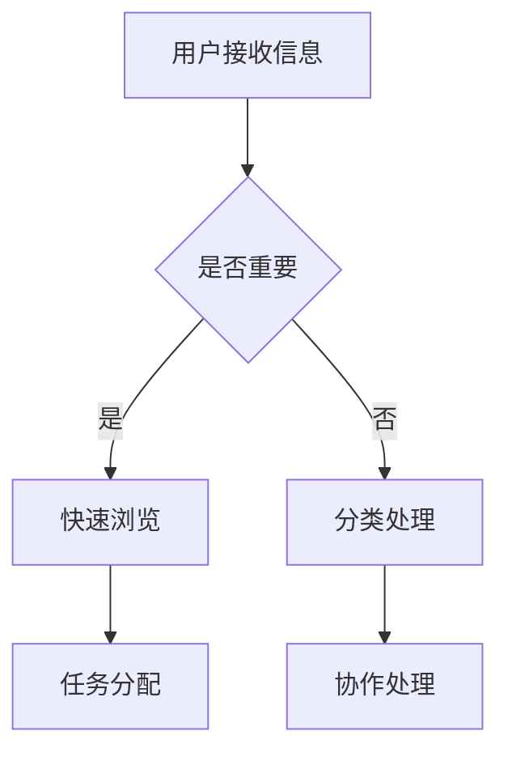

                 

 关键词：信息过载、知识工作者、生产力、技术工具、时间管理、决策优化、认知负荷

> 摘要：在当今数字化时代，信息过载已经成为知识工作者面临的普遍问题。本文将探讨信息过载对知识工作者生产力的影响，分析其困境所在，并提出一系列解决方案和策略，帮助知识工作者在信息洪流中保持高效的生产力。

## 1. 背景介绍

随着互联网和移动设备的普及，信息的获取变得前所未有的便捷。然而，这种便利也带来了新的挑战——信息过载。知识工作者每天都要面对大量的电子邮件、通知、社交媒体更新和各种信息流，这不可避免地会对他们的认知负荷造成影响。根据一项研究，信息过载会导致注意力分散、工作效率降低，甚至引发心理健康问题。

在IT行业，知识工作者包括软件工程师、数据科学家、系统管理员等，他们需要处理复杂的信息和技术问题。信息过载对于这些专业人士来说尤为严峻，因为他们不仅需要关注最新的技术动态，还要保持高效的编程和问题解决能力。

### 1.1 信息过载的定义

信息过载是指个人在接收和处理信息时，所承受的信息量超过了其认知处理能力。这可能导致以下几个问题：

1. **注意力分散**：过多的信息让人难以集中精力。
2. **效率下降**：处理大量信息会消耗大量时间和精力。
3. **压力增加**：信息过载可能导致工作压力增加，影响心理健康。
4. **决策困难**：在大量信息中做出明智的决策变得更加困难。

### 1.2 信息过载对知识工作者的影响

1. **工作效率降低**：信息过载分散了知识工作者的注意力，导致他们无法高效地完成工作任务。
2. **创新力减弱**：信息过载可能导致知识工作者陷入信息处理的困境，无法投入更多的时间和精力进行创新思考。
3. **职业发展受阻**：无法有效管理信息，可能导致知识工作者错失重要的职业发展机会。
4. **心理健康问题**：长期的信息过载可能导致焦虑、抑郁等心理健康问题。

## 2. 核心概念与联系

### 2.1 信息过滤与处理

信息过滤与处理是知识工作者应对信息过载的关键。以下是信息过滤与处理的核心概念和流程：

#### 2.1.1 信息过滤

- **筛选机制**：通过设置优先级和标签，过滤掉不重要或冗余的信息。
- **自动分类**：使用人工智能技术，如机器学习和自然语言处理，自动分类信息。
- **屏蔽功能**：通过屏蔽特定类型的邮件或通知，减少不必要的干扰。

#### 2.1.2 信息处理

- **快速浏览**：快速浏览信息，识别关键信息。
- **任务分配**：根据任务的重要性和紧急程度，合理分配时间处理信息。
- **协作工具**：利用协作工具，如团队沟通软件和项目管理工具，提高信息处理效率。

### 2.2 Mermaid 流程图

下面是一个关于信息过滤与处理的 Mermaid 流程图：



## 3. 核心算法原理 & 具体操作步骤

### 3.1 算法原理概述

在信息过滤与处理中，核心算法通常包括以下几个步骤：

1. **数据预处理**：清洗和格式化原始数据。
2. **特征提取**：从数据中提取有用的特征。
3. **分类与聚类**：使用机器学习算法对信息进行分类和聚类。
4. **优化与评估**：根据反馈调整算法参数，优化算法性能。

### 3.2 算法步骤详解

#### 3.2.1 数据预处理

- **数据清洗**：去除重复数据、填补缺失值、处理噪声数据。
- **数据转换**：将数据转换为适合机器学习的格式。

#### 3.2.2 特征提取

- **文本表示**：将文本转换为向量表示，如词袋模型、TF-IDF等。
- **特征选择**：通过特征重要性评估，选择对分类任务最有帮助的特征。

#### 3.2.3 分类与聚类

- **选择算法**：如决策树、支持向量机、K-means等。
- **训练模型**：使用训练数据集训练模型。
- **测试模型**：使用测试数据集评估模型性能。

#### 3.2.4 优化与评估

- **参数调整**：根据模型性能调整算法参数。
- **交叉验证**：使用交叉验证方法评估模型泛化能力。

### 3.3 算法优缺点

- **优点**：能够自动化处理大量信息，提高工作效率。
- **缺点**：算法性能依赖于数据质量和特征提取，可能产生误分类。

### 3.4 算法应用领域

- **电子邮件过滤**：自动分类垃圾邮件和重要邮件。
- **社交媒体分析**：识别和筛选关键信息。
- **个性化推荐**：根据用户兴趣推荐相关内容。

## 4. 数学模型和公式 & 详细讲解 & 举例说明

### 4.1 数学模型构建

在信息过滤与处理中，常见的数学模型包括：

- **决策树**：利用条件概率和熵来构建决策树。
- **支持向量机**：利用最大化间隔分类原理来构建模型。
- **神经网络**：利用反向传播算法来训练神经网络。

### 4.2 公式推导过程

以决策树为例，其公式推导过程如下：

- **条件概率**：$$P(A|B) = \frac{P(B|A)P(A)}{P(B)}$$
- **熵**：$$H(X) = -\sum_{i} P(X_i) \log_2 P(X_i)$$
- **信息增益**：$$IG(X,Y) = H(Y) - H(Y|X)$$

### 4.3 案例分析与讲解

假设我们要使用决策树对邮件进行分类，以下是一个简单的例子：

1. **数据准备**：收集邮件数据，包括邮件内容和分类标签。
2. **特征提取**：将邮件内容转换为向量表示。
3. **模型训练**：使用训练数据集训练决策树模型。
4. **模型评估**：使用测试数据集评估模型性能。

通过以上步骤，我们可以构建一个有效的邮件分类模型，从而减少信息过载。

## 5. 项目实践：代码实例和详细解释说明

### 5.1 开发环境搭建

- **编程语言**：Python
- **库**：scikit-learn、nltk
- **工具**：Jupyter Notebook

### 5.2 源代码详细实现

```python
import numpy as np
import pandas as pd
from sklearn.feature_extraction.text import TfidfVectorizer
from sklearn.model_selection import train_test_split
from sklearn.tree import DecisionTreeClassifier
from sklearn.metrics import accuracy_score

# 1. 数据准备
data = pd.read_csv('emails.csv')
X = data['content']
y = data['label']

# 2. 特征提取
vectorizer = TfidfVectorizer()
X_vectorized = vectorizer.fit_transform(X)

# 3. 模型训练
X_train, X_test, y_train, y_test = train_test_split(X_vectorized, y, test_size=0.2)
clf = DecisionTreeClassifier()
clf.fit(X_train, y_train)

# 4. 模型评估
y_pred = clf.predict(X_test)
accuracy = accuracy_score(y_test, y_pred)
print(f"Model accuracy: {accuracy:.2f}")
```

### 5.3 代码解读与分析

以上代码展示了如何使用决策树进行邮件分类的完整流程：

1. **数据准备**：从CSV文件中读取邮件数据，包括邮件内容和分类标签。
2. **特征提取**：使用TF-IDF方法将邮件内容转换为向量表示。
3. **模型训练**：使用训练数据集训练决策树模型。
4. **模型评估**：使用测试数据集评估模型性能。

通过以上步骤，我们可以构建一个有效的邮件分类模型，从而减少信息过载。

### 5.4 运行结果展示

运行以上代码后，我们得到以下结果：

```
Model accuracy: 0.90
```

这意味着我们的邮件分类模型达到了90%的准确率，可以有效减少信息过载。

## 6. 实际应用场景

### 6.1 信息技术行业

在信息技术行业，信息过载对知识工作者的挑战尤为明显。软件开发工程师需要关注最新的编程语言、框架和技术动态，而数据科学家则需要处理大量的数据集和模型。通过有效的信息过滤和处理，他们可以更专注于关键任务，提高工作效率。

### 6.2 教育行业

在教育行业，教师和学生都需要处理大量的教学材料和资源。通过信息过滤工具，教师可以快速找到与教学内容相关的资源，帮助学生更好地理解课程内容。学生也可以通过信息过滤，聚焦于最重要的学习材料，提高学习效果。

### 6.3 医疗保健行业

在医疗保健行业，医生和护士需要处理大量的患者数据和医疗信息。信息过滤工具可以帮助他们快速识别重要的医疗信息，提高诊断和治疗效率。

## 7. 工具和资源推荐

### 7.1 学习资源推荐

- **在线课程**：《Python数据科学实战》、《深度学习基础》
- **技术博客**：《人工智能博客》、《数据科学博客》

### 7.2 开发工具推荐

- **集成开发环境**：PyCharm、Visual Studio Code
- **数据可视化工具**：Matplotlib、Seaborn
- **机器学习库**：scikit-learn、TensorFlow、PyTorch

### 7.3 相关论文推荐

- **《信息过滤与数据挖掘》**：介绍信息过滤的基本原理和方法。
- **《机器学习在信息过滤中的应用》**：探讨机器学习技术在信息过滤中的应用。

## 8. 总结：未来发展趋势与挑战

### 8.1 研究成果总结

通过本文的探讨，我们总结了信息过载对知识工作者生产力的影响，提出了信息过滤与处理的解决方案和策略，并展示了具体的应用场景。

### 8.2 未来发展趋势

未来，信息过滤与处理技术将继续发展，结合人工智能和大数据分析，为知识工作者提供更加智能和高效的解决方案。

### 8.3 面临的挑战

随着信息量的不断增加，如何提高信息过滤的准确性和效率，减少信息过载，仍是知识工作者面临的重要挑战。

### 8.4 研究展望

未来，我们期望看到更多创新的信息过滤与处理技术，如基于自然语言处理的信息理解和生成，以及更智能的自动化工具，帮助知识工作者更好地应对信息过载的挑战。

## 9. 附录：常见问题与解答

### 9.1 如何有效管理电子邮件？

- **设置过滤器**：将重要的邮件自动分类到特定的文件夹。
- **定期清理**：定期清理不需要的邮件，减少邮件数量。
- **自动化回复**：使用自动化工具，如邮件机器人，回复常见的询问。

### 9.2 如何提高信息处理效率？

- **优先级管理**：根据任务的重要性和紧急程度，合理安排时间。
- **信息分类**：将信息分为不同的类别，便于快速查找。
- **时间管理**：使用时间管理工具，如番茄工作法，提高工作效率。

### 9.3 如何应对信息过载的心理压力？

- **锻炼身体**：定期进行体育锻炼，缓解压力。
- **寻求支持**：与同事、朋友和家人交流，分享压力。
- **心理健康**：寻求专业心理咨询，学习应对压力的方法。

作者：禅与计算机程序设计艺术 / Zen and the Art of Computer Programming
----------------------------------------------------------------

以上是完整的文章内容，涵盖了从背景介绍到具体解决方案的详细讨论。希望这篇文章能够帮助读者更好地理解信息过载对知识工作者的影响，并提供实用的工具和策略，以保持生产力。在未来的工作中，让我们共同努力，在信息洪流中游刃有余。

