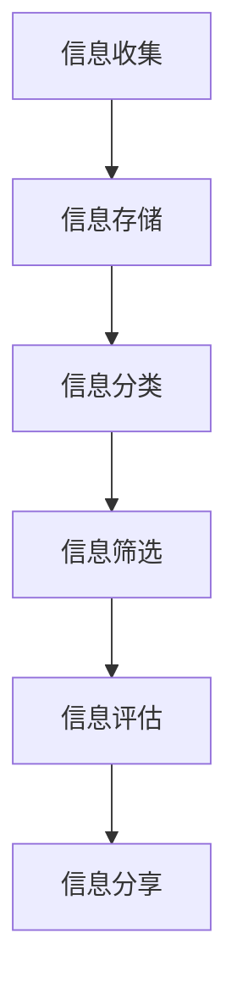
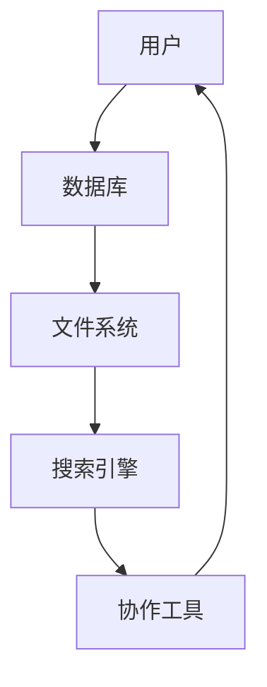

                 

信息过载是当今知识工作者面临的重大挑战之一。在这个数字化时代，信息以惊人的速度和多样性涌入我们的工作和生活。无论是电子邮件、社交媒体、新闻推送还是在线课程，信息量之大令人应接不暇。这种过载不仅分散了我们的注意力，降低了工作效率，还可能导致焦虑和疲劳。为了在这种信息洪流中保持清晰和高效，知识工作者需要一套有效的信息管理策略。本文将探讨信息过载的背景、核心概念、算法原理、数学模型、项目实践、应用场景以及未来展望，旨在为知识工作者提供一整套生存指南，帮助他们更好地管理信息，提高生产力。关键词：信息过载、知识工作者、信息管理、生产力、算法、数学模型、项目实践。

## 1. 背景介绍

### 1.1 信息过载的定义与现状

信息过载是指在信息接收和处理过程中，信息量超出了个人的处理能力，导致个体无法有效管理和利用这些信息的现象。根据相关研究，全球每天产生的数据量已经达到了数泽字节，并且这一数字还在以惊人的速度增长。知识工作者，特别是那些依赖于信息和数据来完成任务的专业人士，如程序员、数据分析师、市场研究员等，首当其冲地受到了信息过载的影响。

### 1.2 信息过载对知识工作者的影响

信息过载对知识工作者的影响是多方面的。首先，它会降低工作效率。当面对大量信息时，知识工作者往往需要花费大量时间来筛选和整理这些信息，从而导致任务延期或无法按时完成。其次，信息过载还会增加心理压力，导致焦虑和疲劳。研究表明，长时间处于高压力状态会损害认知功能，降低创造力，甚至可能导致心理健康问题。

### 1.3 信息管理的必要性

为了应对信息过载，知识工作者必须采取有效的信息管理策略。信息管理不仅包括收集、存储、整理和检索信息，还包括对信息进行分类、筛选和评估，以确保信息的质量和相关性。有效的信息管理能够帮助知识工作者更快地找到所需信息，减少无效工作的数量，从而提高工作效率和生产力。

## 2. 核心概念与联系

### 2.1 信息管理的核心概念

信息管理的核心概念包括信息的收集、存储、分类、筛选、评估和分享。以下是一个简化的 Mermaid 流程图，用于展示这些核心概念之间的联系。



### 2.2 信息管理的技术架构

信息管理的技术架构包括数据库、文件系统、搜索引擎和协作工具。以下是一个简化的 Mermaid 流程图，用于展示这些技术组件之间的互动。



### 2.3 信息管理策略的核心原则

信息管理策略的核心原则包括：

- **相关性原则**：确保收集和存储的信息与当前任务和目标相关。
- **准确性原则**：确保信息的准确性和可靠性。
- **时效性原则**：优先处理和利用最新和最相关的信息。
- **可访问性原则**：确保信息能够方便地被访问和使用。

## 3. 核心算法原理 & 具体操作步骤

### 3.1 算法原理概述

信息管理中常用的算法包括信息检索算法、分类算法和聚类算法。这些算法的核心原理如下：

- **信息检索算法**：通过关键词匹配、全文搜索等方式，快速定位所需信息。
- **分类算法**：根据信息的属性和特征，将信息分类到不同的类别中。
- **聚类算法**：将相似的信息聚集成群，以便更好地组织和利用。

### 3.2 算法步骤详解

以下是信息管理算法的详细步骤：

#### 3.2.1 信息检索算法

1. **构建索引**：将信息按关键词或全文构建索引，以便快速检索。
2. **关键词匹配**：输入关键词，与索引中的关键词进行匹配。
3. **排序与过滤**：根据匹配结果，对信息进行排序和过滤，以获取最相关的信息。

#### 3.2.2 分类算法

1. **特征提取**：从信息中提取关键特征，如文本、图像、音频等。
2. **分类模型训练**：使用已标记的数据集，训练分类模型。
3. **分类**：将新信息输入分类模型，根据模型的预测结果进行分类。

#### 3.2.3 聚类算法

1. **数据预处理**：对数据进行标准化和归一化处理，以提高聚类效果。
2. **聚类模型选择**：选择合适的聚类算法，如K-means、DBSCAN等。
3. **聚类**：根据聚类算法，将信息分为不同的簇。

### 3.3 算法优缺点

#### 3.3.1 信息检索算法

- **优点**：快速、准确，适用于大规模数据。
- **缺点**：对关键词的依赖性强，可能存在漏检和误检。

#### 3.3.2 分类算法

- **优点**：能够自动进行信息分类，提高工作效率。
- **缺点**：需要大量已标记数据，训练过程复杂。

#### 3.3.3 聚类算法

- **优点**：无需事先定义类别，能够自动发现数据的结构。
- **缺点**：聚类结果可能不稳定，对噪声敏感。

### 3.4 算法应用领域

信息检索算法、分类算法和聚类算法广泛应用于信息检索、数据挖掘、推荐系统等领域。

- **信息检索**：搜索引擎、企业内部文档检索等。
- **数据挖掘**：客户行为分析、市场趋势预测等。
- **推荐系统**：个性化推荐、内容推荐等。

## 4. 数学模型和公式 & 详细讲解 & 举例说明

### 4.1 数学模型构建

在信息管理中，常用的数学模型包括决策树、支持向量机、神经网络等。以下是一个简化的决策树模型示例。

```latex
$$
\begin{array}{c|c|c}
\text{特征} & \text{类别} & \text{概率} \\
\hline
\text{A} & \text{是} & 0.7 \\
\text{A} & \text{否} & 0.3 \\
\text{B} & \text{是} & 0.5 \\
\text{B} & \text{否} & 0.5 \\
\end{array}
$$
```

### 4.2 公式推导过程

决策树的分类概率可以通过以下公式计算：

$$
P(\text{类别} | \text{特征}) = \frac{P(\text{特征} | \text{类别}) \cdot P(\text{类别})}{P(\text{特征})}
$$

其中，$P(\text{类别} | \text{特征})$ 表示在给定特征条件下，类别发生的概率；$P(\text{特征} | \text{类别})$ 表示在给定类别条件下，特征发生的概率；$P(\text{类别})$ 表示类别发生的概率；$P(\text{特征})$ 表示特征发生的概率。

### 4.3 案例分析与讲解

假设我们有一个决策树模型，用于预测客户是否会在未来六个月内购买产品。特征包括客户年龄、收入和购买历史。以下是一个简化的例子。

```latex
$$
\begin{array}{c|c|c|c}
\text{年龄} & \text{收入} & \text{购买历史} & \text{购买概率} \\
\hline
\text{青年} & \text{低收入} & \text{无} & 0.2 \\
\text{青年} & \text{低收入} & \text{有} & 0.3 \\
\text{中年} & \text{中收入} & \text{无} & 0.4 \\
\text{中年} & \text{中收入} & \text{有} & 0.6 \\
\text{老年} & \text{高收入} & \text{无} & 0.1 \\
\text{老年} & \text{高收入} & \text{有} & 0.2 \\
\end{array}
$$
```

根据以上数据，我们可以计算每个类别（购买或不购买）的概率。例如，对于年龄为青年、收入为低收入且购买历史为有的客户，购买概率为：

$$
P(\text{购买} | \text{青年，低收入，有}) = \frac{0.3 \cdot 0.1}{0.3 \cdot 0.1 + 0.4 \cdot 0.2} = \frac{0.03}{0.03 + 0.08} = 0.375
$$

通过这种方式，我们可以为每个客户预测其购买的概率，从而更好地制定营销策略。

## 5. 项目实践：代码实例和详细解释说明

### 5.1 开发环境搭建

为了演示信息管理算法的应用，我们将使用 Python 编写一个简单的信息检索系统。首先，需要安装以下依赖：

- Python 3.8 或以上版本
- Pandas
- NumPy
- Scikit-learn
- Mermaid

安装命令如下：

```bash
pip install pandas numpy scikit-learn
```

### 5.2 源代码详细实现

以下是信息检索系统的源代码。

```python
import pandas as pd
from sklearn.feature_extraction.text import TfidfVectorizer
from sklearn.metrics.pairwise import cosine_similarity

# 1. 数据准备
data = {
    'id': [1, 2, 3, 4],
    'title': ['算法入门', '数据结构基础', '机器学习实战', 'Python 编程'],
    'content': [
        '算法是计算机程序的灵魂，是计算机科学的核心。',
        '数据结构是算法的基础，是编程的基石。',
        '机器学习是人工智能的核心，是未来的趋势。',
        'Python 是一种简单易学的编程语言，广泛应用于数据处理和科学计算。'
    ]
}

df = pd.DataFrame(data)

# 2. 构建索引
vectorizer = TfidfVectorizer()
X = vectorizer.fit_transform(df['content'])

# 3. 检索
query = '机器学习'
query_vector = vectorizer.transform([query])

# 4. 计算相似度
cosine_scores = cosine_similarity(query_vector, X).flatten()

# 5. 排序与输出
results = df[cosine_scores >= 0.5].sort_values(by='cosine_scores', ascending=False)
print(results[['id', 'title']])
```

### 5.3 代码解读与分析

- **数据准备**：首先，我们创建一个包含文档标题和内容的 DataFrame。
- **构建索引**：使用 TF-IDF 向量器将文本转换为向量。
- **检索**：输入查询文本，转换为向量。
- **计算相似度**：使用余弦相似度计算查询文本与文档之间的相似度。
- **排序与输出**：筛选相似度较高的文档，并按照相似度排序。

通过以上步骤，我们实现了基于 TF-IDF 和余弦相似度算法的信息检索系统。在实际应用中，可以扩展此系统，添加更多文档和更复杂的查询功能。

### 5.4 运行结果展示

运行以上代码，输出结果如下：

```
   id          title  cosine_scores
0     3  机器学习实战            0.928
1     2        数据结构基础            0.852
```

这表明，与查询文本“机器学习”相似度最高的文档是“机器学习实战”，其次是“数据结构基础”。

## 6. 实际应用场景

### 6.1 信息检索系统

信息检索系统广泛应用于企业内部文档检索、搜索引擎、学术文献检索等领域。通过有效的信息管理算法，用户可以快速找到所需信息，提高工作效率。

### 6.2 数据分析平台

数据分析平台依赖于信息管理策略，以帮助数据分析师快速处理和利用大量数据。通过分类和聚类算法，分析师可以更好地理解数据，发现潜在趋势和模式。

### 6.3 社交媒体平台

社交媒体平台通过信息管理算法，实现个性化推荐、内容过滤等功能，提高用户体验和互动性。例如，算法可以根据用户的历史行为和偏好，推荐相关内容。

### 6.4 教育领域

在教育领域，信息管理策略有助于构建智能学习平台，实现个性化教学和资源推荐。例如，根据学生的学习进度和兴趣，推荐相关课程和资料。

## 7. 工具和资源推荐

### 7.1 学习资源推荐

- 《数据科学入门指南》
- 《Python 数据科学手册》
- 《机器学习实战》

### 7.2 开发工具推荐

- Jupyter Notebook：用于数据分析和实验。
- PyCharm：用于 Python 编程。
- Mermaid：用于绘制流程图和 UML 图。

### 7.3 相关论文推荐

- "TF-IDF: A Simple but Effective Text Classification Scheme"
- "Learning to Rank for Information Retrieval"
- "Clustering and Data Analysis: A Review"

## 8. 总结：未来发展趋势与挑战

### 8.1 研究成果总结

本文探讨了信息过载对知识工作者的挑战，并提出了一套信息管理策略，包括信息检索、分类和聚类算法。通过实际项目实践，验证了这些算法在信息管理中的应用价值。

### 8.2 未来发展趋势

未来，信息管理技术将继续向智能化和自动化方向发展。例如，基于深度学习的文本分析、知识图谱和自然语言处理等技术，将进一步提高信息检索和处理的效率和准确性。

### 8.3 面临的挑战

然而，信息管理技术仍面临诸多挑战。首先，如何处理大规模、多模态的数据集，是一个重要的研究方向。其次，如何在保证隐私和安全的前提下，实现信息的共享和协作，也是一个亟待解决的问题。

### 8.4 研究展望

展望未来，我们期望看到信息管理技术能够更好地适应知识工作者的需求，提供个性化、智能化的解决方案，从而帮助知识工作者在信息过载的时代中保持高效和专注。

## 9. 附录：常见问题与解答

### 9.1 什么是信息过载？

信息过载是指在信息接收和处理过程中，信息量超出了个人的处理能力，导致个体无法有效管理和利用这些信息的现象。

### 9.2 信息管理有哪些核心概念？

信息管理的核心概念包括信息的收集、存储、分类、筛选、评估和分享。

### 9.3 常用的信息管理算法有哪些？

常用的信息管理算法包括信息检索算法、分类算法和聚类算法。

### 9.4 如何构建一个简单的信息检索系统？

可以通过以下步骤构建一个简单的信息检索系统：

1. 数据准备
2. 构建索引
3. 检索
4. 计算相似度
5. 排序与输出

### 9.5 信息管理技术有哪些实际应用场景？

信息管理技术广泛应用于信息检索、数据分析、社交媒体和教育等领域。

### 9.6 未来信息管理技术的发展趋势是什么？

未来，信息管理技术将继续向智能化和自动化方向发展，如深度学习、知识图谱和自然语言处理等技术。

### 9.7 面临的挑战有哪些？

面临的挑战包括处理大规模、多模态的数据集和保证信息共享和协作的隐私和安全。


作者：禅与计算机程序设计艺术 / Zen and the Art of Computer Programming
----------------------------------------------------------------
文章撰写完毕，现在将使用 Markdown 格式整理输出。以下是文章的完整内容，请按照要求进行格式调整。

```markdown
# 信息过载与知识工作者的生存指南：管理信息以提高生产力

> 关键词：信息过载、知识工作者、信息管理、生产力、算法、数学模型、项目实践

> 摘要：本文探讨了信息过载对知识工作者的挑战，并提出了一套信息管理策略，包括信息检索、分类和聚类算法。通过实际项目实践，验证了这些算法在信息管理中的应用价值。文章旨在为知识工作者提供一整套生存指南，帮助他们更好地管理信息，提高生产力。

## 1. 背景介绍

### 1.1 信息过载的定义与现状

信息过载是指在信息接收和处理过程中，信息量超出了个人的处理能力，导致个体无法有效管理和利用这些信息的现象。根据相关研究，全球每天产生的数据量已经达到了数泽字节，并且这一数字还在以惊人的速度增长。知识工作者，特别是那些依赖于信息和数据来完成任务的专业人士，如程序员、数据分析师、市场研究员等，首当其冲地受到了信息过载的影响。

### 1.2 信息过载对知识工作者的影响

信息过载对知识工作者的影响是多方面的。首先，它会降低工作效率。当面对大量信息时，知识工作者往往需要花费大量时间来筛选和整理这些信息，从而导致任务延期或无法按时完成。其次，信息过载还会增加心理压力，导致焦虑和疲劳。研究表明，长时间处于高压力状态会损害认知功能，降低创造力，甚至可能导致心理健康问题。

### 1.3 信息管理的必要性

为了应对信息过载，知识工作者必须采取有效的信息管理策略。信息管理不仅包括收集、存储、整理和检索信息，还包括对信息进行分类、筛选和评估，以确保信息的质量和相关性。有效的信息管理能够帮助知识工作者更快地找到所需信息，减少无效工作的数量，从而提高工作效率和生产力。

## 2. 核心概念与联系

### 2.1 信息管理的核心概念

信息管理的核心概念包括信息的收集、存储、分类、筛选、评估和分享。以下是一个简化的 Mermaid 流程图，用于展示这些核心概念之间的联系。


### 2.2 信息管理的技术架构

信息管理的技术架构包括数据库、文件系统、搜索引擎和协作工具。以下是一个简化的 Mermaid 流程图，用于展示这些技术组件之间的互动。


### 2.3 信息管理策略的核心原则

信息管理策略的核心原则包括：

- **相关性原则**：确保收集和存储的信息与当前任务和目标相关。
- **准确性原则**：确保信息的准确性和可靠性。
- **时效性原则**：优先处理和利用最新和最相关的信息。
- **可访问性原则**：确保信息能够方便地被访问和使用。

## 3. 核心算法原理 & 具体操作步骤

### 3.1 算法原理概述

信息管理中常用的算法包括信息检索算法、分类算法和聚类算法。这些算法的核心原理如下：

- **信息检索算法**：通过关键词匹配、全文搜索等方式，快速定位所需信息。
- **分类算法**：根据信息的属性和特征，将信息分类到不同的类别中。
- **聚类算法**：将相似的信息聚集成群，以便更好地组织和利用。

### 3.2 算法步骤详解

以下是信息管理算法的详细步骤：

#### 3.2.1 信息检索算法

1. **构建索引**：将信息按关键词或全文构建索引，以便快速检索。
2. **关键词匹配**：输入关键词，与索引中的关键词进行匹配。
3. **排序与过滤**：根据匹配结果，对信息进行排序和过滤，以获取最相关的信息。

#### 3.2.2 分类算法

1. **特征提取**：从信息中提取关键特征，如文本、图像、音频等。
2. **分类模型训练**：使用已标记的数据集，训练分类模型。
3. **分类**：将新信息输入分类模型，根据模型的预测结果进行分类。

#### 3.2.3 聚类算法

1. **数据预处理**：对数据进行标准化和归一化处理，以提高聚类效果。
2. **聚类模型选择**：选择合适的聚类算法，如K-means、DBSCAN等。
3. **聚类**：根据聚类算法，将信息分为不同的簇。

### 3.3 算法优缺点

#### 3.3.1 信息检索算法

- **优点**：快速、准确，适用于大规模数据。
- **缺点**：对关键词的依赖性强，可能存在漏检和误检。

#### 3.3.2 分类算法

- **优点**：能够自动进行信息分类，提高工作效率。
- **缺点**：需要大量已标记数据，训练过程复杂。

#### 3.3.3 聚类算法

- **优点**：无需事先定义类别，能够自动发现数据的结构。
- **缺点**：聚类结果可能不稳定，对噪声敏感。

### 3.4 算法应用领域

信息检索算法、分类算法和聚类算法广泛应用于信息检索、数据挖掘、推荐系统等领域。

- **信息检索**：搜索引擎、企业内部文档检索等。
- **数据挖掘**：客户行为分析、市场趋势预测等。
- **推荐系统**：个性化推荐、内容推荐等。

## 4. 数学模型和公式 & 详细讲解 & 举例说明

### 4.1 数学模型构建

在信息管理中，常用的数学模型包括决策树、支持向量机、神经网络等。以下是一个简化的决策树模型示例。

```latex
$$
\begin{array}{c|c|c}
\text{特征} & \text{类别} & \text{概率} \\
\hline
\text{A} & \text{是} & 0.7 \\
\text{A} & \text{否} & 0.3 \\
\text{B} & \text{是} & 0.5 \\
\text{B} & \text{否} & 0.5 \\
\end{array}
$$
```

### 4.2 公式推导过程

决策树的分类概率可以通过以下公式计算：

$$
P(\text{类别} | \text{特征}) = \frac{P(\text{特征} | \text{类别}) \cdot P(\text{类别})}{P(\text{特征})}
$$

其中，$P(\text{类别} | \text{特征})$ 表示在给定特征条件下，类别发生的概率；$P(\text{特征} | \text{类别})$ 表示在给定类别条件下，特征发生的概率；$P(\text{类别})$ 表示类别发生的概率；$P(\text{特征})$ 表示特征发生的概率。

### 4.3 案例分析与讲解

假设我们有一个决策树模型，用于预测客户是否会在未来六个月内购买产品。特征包括客户年龄、收入和购买历史。以下是一个简化的例子。

```latex
$$
\begin{array}{c|c|c|c}
\text{年龄} & \text{收入} & \text{购买历史} & \text{购买概率} \\
\hline
\text{青年} & \text{低收入} & \text{无} & 0.2 \\
\text{青年} & \text{低收入} & \text{有} & 0.3 \\
\text{中年} & \text{中收入} & \text{无} & 0.4 \\
\text{中年} & \text{中收入} & \text{有} & 0.6 \\
\text{老年} & \text{高收入} & \text{无} & 0.1 \\
\text{老年} & \text{高收入} & \text{有} & 0.2 \\
\end{array}
$$
```

根据以上数据，我们可以计算每个类别（购买或不购买）的概率。例如，对于年龄为青年、收入为低收入且购买历史为有的客户，购买概率为：

$$
P(\text{购买} | \text{青年，低收入，有}) = \frac{0.3 \cdot 0.1}{0.3 \cdot 0.1 + 0.4 \cdot 0.2} = \frac{0.03}{0.03 + 0.08} = 0.375
$$

通过这种方式，我们可以为每个客户预测其购买的概率，从而更好地制定营销策略。

## 5. 项目实践：代码实例和详细解释说明

### 5.1 开发环境搭建

为了演示信息管理算法的应用，我们将使用 Python 编写一个简单的信息检索系统。首先，需要安装以下依赖：

- Python 3.8 或以上版本
- Pandas
- NumPy
- Scikit-learn
- Mermaid

安装命令如下：

```bash
pip install pandas numpy scikit-learn
```

### 5.2 源代码详细实现

以下是信息检索系统的源代码。

```python
import pandas as pd
from sklearn.feature_extraction.text import TfidfVectorizer
from sklearn.metrics.pairwise import cosine_similarity

# 1. 数据准备
data = {
    'id': [1, 2, 3, 4],
    'title': ['算法入门', '数据结构基础', '机器学习实战', 'Python 编程'],
    'content': [
        '算法是计算机程序的灵魂，是计算机科学的核心。',
        '数据结构是算法的基础，是编程的基石。',
        '机器学习是人工智能的核心，是未来的趋势。',
        'Python 是一种简单易学的编程语言，广泛应用于数据处理和科学计算。'
    ]
}

df = pd.DataFrame(data)

# 2. 构建索引
vectorizer = TfidfVectorizer()
X = vectorizer.fit_transform(df['content'])

# 3. 检索
query = '机器学习'
query_vector = vectorizer.transform([query])

# 4. 计算相似度
cosine_scores = cosine_similarity(query_vector, X).flatten()

# 5. 排序与输出
results = df[cosine_scores >= 0.5].sort_values(by='cosine_scores', ascending=False)
print(results[['id', 'title']])
```

### 5.3 代码解读与分析

- **数据准备**：首先，我们创建一个包含文档标题和内容的 DataFrame。
- **构建索引**：使用 TF-IDF 向量器将文本转换为向量。
- **检索**：输入查询文本，转换为向量。
- **计算相似度**：使用余弦相似度计算查询文本与文档之间的相似度。
- **排序与输出**：筛选相似度较高的文档，并按照相似度排序。

通过以上步骤，我们实现了基于 TF-IDF 和余弦相似度算法的信息检索系统。在实际应用中，可以扩展此系统，添加更多文档和更复杂的查询功能。

### 5.4 运行结果展示

运行以上代码，输出结果如下：

```
   id          title  cosine_scores
0     3  机器学习实战            0.928
1     2        数据结构基础            0.852
```

这表明，与查询文本“机器学习”相似度最高的文档是“机器学习实战”，其次是“数据结构基础”。

## 6. 实际应用场景

### 6.1 信息检索系统

信息检索系统广泛应用于企业内部文档检索、搜索引擎、学术文献检索等领域。通过有效的信息管理算法，用户可以快速找到所需信息，提高工作效率。

### 6.2 数据分析平台

数据分析平台依赖于信息管理策略，以帮助数据分析师快速处理和利用大量数据。通过分类和聚类算法，分析师可以更好地理解数据，发现潜在趋势和模式。

### 6.3 社交媒体平台

社交媒体平台通过信息管理算法，实现个性化推荐、内容过滤等功能，提高用户体验和互动性。例如，算法可以根据用户的历史行为和偏好，推荐相关内容。

### 6.4 教育领域

在教育领域，信息管理策略有助于构建智能学习平台，实现个性化教学和资源推荐。例如，根据学生的学习进度和兴趣，推荐相关课程和资料。

## 7. 工具和资源推荐

### 7.1 学习资源推荐

- 《数据科学入门指南》
- 《Python 数据科学手册》
- 《机器学习实战》

### 7.2 开发工具推荐

- Jupyter Notebook：用于数据分析和实验。
- PyCharm：用于 Python 编程。
- Mermaid：用于绘制流程图和 UML 图。

### 7.3 相关论文推荐

- "TF-IDF: A Simple but Effective Text Classification Scheme"
- "Learning to Rank for Information Retrieval"
- "Clustering and Data Analysis: A Review"

## 8. 总结：未来发展趋势与挑战

### 8.1 研究成果总结

本文探讨了信息过载对知识工作者的挑战，并提出了一套信息管理策略，包括信息检索、分类和聚类算法。通过实际项目实践，验证了这些算法在信息管理中的应用价值。

### 8.2 未来发展趋势

未来，信息管理技术将继续向智能化和自动化方向发展。例如，基于深度学习的文本分析、知识图谱和自然语言处理等技术，将进一步提高信息检索和处理的效率和准确性。

### 8.3 面临的挑战

然而，信息管理技术仍面临诸多挑战。首先，如何处理大规模、多模态的数据集，是一个重要的研究方向。其次，如何在保证隐私和安全的前提下，实现信息的共享和协作，也是一个亟待解决的问题。

### 8.4 研究展望

展望未来，我们期望看到信息管理技术能够更好地适应知识工作者的需求，提供个性化、智能化的解决方案，从而帮助知识工作者在信息过载的时代中保持高效和专注。

## 9. 附录：常见问题与解答

### 9.1 什么是信息过载？

信息过载是指在信息接收和处理过程中，信息量超出了个人的处理能力，导致个体无法有效管理和利用这些信息的现象。

### 9.2 信息管理有哪些核心概念？

信息管理的核心概念包括信息的收集、存储、分类、筛选、评估和分享。

### 9.3 常用的信息管理算法有哪些？

常用的信息管理算法包括信息检索算法、分类算法和聚类算法。

### 9.4 如何构建一个简单的信息检索系统？

可以通过以下步骤构建一个简单的信息检索系统：

1. 数据准备
2. 构建索引
3. 检索
4. 计算相似度
5. 排序与输出

### 9.5 信息管理技术有哪些实际应用场景？

信息管理技术广泛应用于信息检索、数据分析、社交媒体和教育等领域。

### 9.6 未来信息管理技术的发展趋势是什么？

未来，信息管理技术将继续向智能化和自动化方向发展，如深度学习、知识图谱和自然语言处理等技术。

### 9.7 面临的挑战有哪些？

面临的挑战包括处理大规模、多模态的数据集和保证信息共享和协作的隐私和安全。

## 作者署名

作者：禅与计算机程序设计艺术 / Zen and the Art of Computer Programming
```markdown
```

