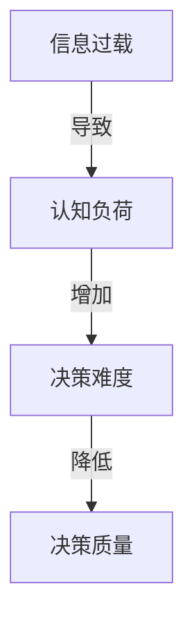
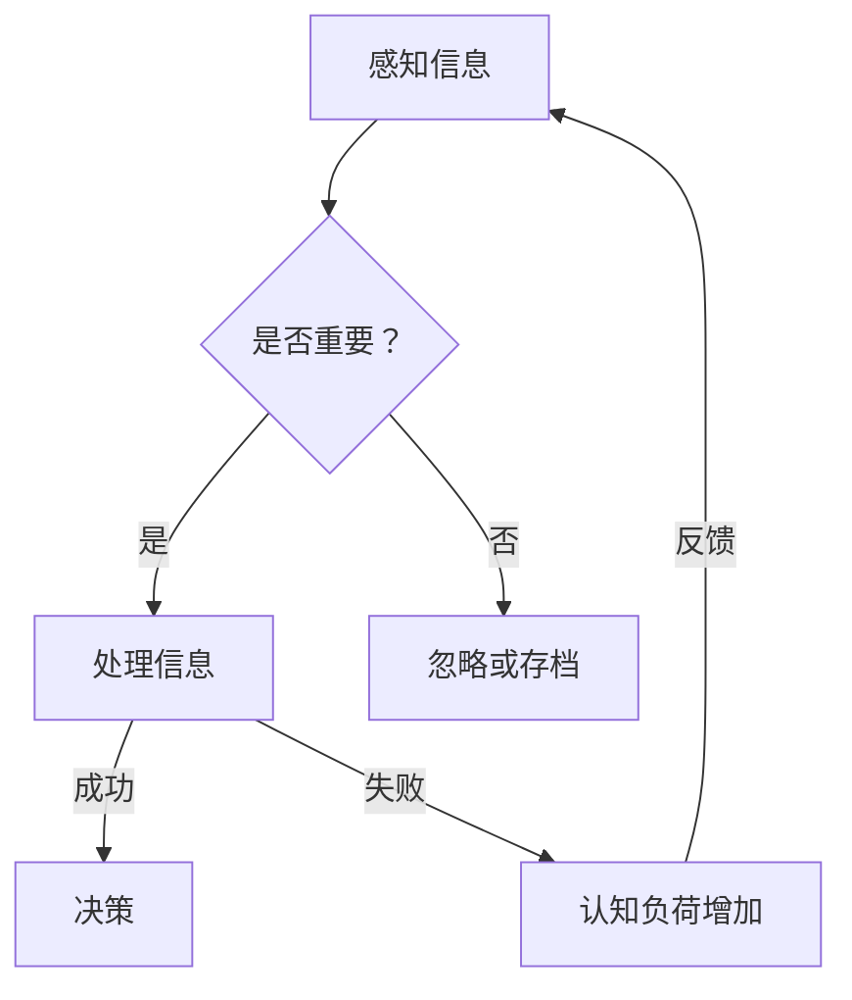

                 

### 1. 背景介绍

在当今这个信息技术飞速发展的时代，我们每天都会接触到大量的信息和数据。从社交媒体上的新闻更新，到企业内部的邮件、报告，以及各类应用程序中的通知，这些都构成了信息过载（Information Overload）的一部分。信息过载不仅影响我们的工作效率，还可能导致认知负荷（Cognitive Load）的增加，进而影响我们的决策质量和幸福感。

认知负荷是认知心理学中的一个重要概念，指的是个体在处理信息时所面临的认知压力。当信息量过大，超出了个体的认知处理能力时，认知负荷就会增加。过高的认知负荷会干扰我们的注意力、记忆和问题解决能力，使我们难以做出明智的决策。这种现象在复杂环境中尤为明显，因为复杂环境中的变量多，信息复杂且多变。

本文将探讨信息过载与认知负荷之间的关系，分析它们如何影响我们的决策过程，并提出一些实用的策略和方法，帮助我们在复杂环境中做出更好的决策。文章结构如下：

## 1. 背景介绍

## 2. 核心概念与联系

## 3. 核心算法原理 & 具体操作步骤

## 4. 数学模型和公式 & 详细讲解 & 举例说明

## 5. 项目实践：代码实例和详细解释说明

## 6. 实际应用场景

## 7. 工具和资源推荐

## 8. 总结：未来发展趋势与挑战

## 9. 附录：常见问题与解答

### 2. 核心概念与联系

在深入探讨信息过载与认知负荷对决策的影响之前，我们需要明确这两个核心概念的定义及其相互关系。

**信息过载（Information Overload）**：信息过载指的是个体接收到的信息量超出了其认知处理能力，导致信息处理变得困难或无效。这种状态通常发生在信息来源过多、信息更新过快或信息质量参差不齐的情况下。信息过载不仅使个体难以筛选和处理重要信息，还会增加其焦虑感和压力。

**认知负荷（Cognitive Load）**：认知负荷是指个体在处理信息时所面临的认知压力。它由两种主要类型组成：外在认知负荷和内在认知负荷。外在认知负荷来源于任务本身的复杂性，如多变的任务环境、大量的信息源等。内在认知负荷则与个体处理信息的策略和能力相关，如记忆的有限容量、注意力分配等。

信息过载与认知负荷之间的关系可以通过以下流程图（使用Mermaid语法）来表示：



**核心概念原理与架构的Mermaid流程图**

以下是信息处理流程的Mermaid流程图，其中包含了核心概念原理和架构的详细描述：



在这个流程图中，个体首先感知到信息，然后判断这些信息是否重要。如果信息被认为是重要的，个体会尝试处理这些信息，并做出决策。如果处理过程失败，认知负荷会增加，可能导致决策难度增加，进而影响决策质量。

### 3. 核心算法原理 & 具体操作步骤

在理解了信息过载与认知负荷的基本概念之后，接下来我们将探讨如何在复杂环境中运用核心算法来降低认知负荷，提高决策质量。

#### 3.1 算法原理概述

核心算法主要基于以下原理：

1. **信息筛选与过滤**：通过算法对大量信息进行筛选和过滤，只保留最重要的信息，从而降低信息过载。
2. **认知负荷优化**：通过优化信息处理流程，减少不必要的认知负荷，使个体能够更专注于重要任务的决策。
3. **数据可视化**：利用可视化工具将复杂的数据转换为易于理解的图表和图形，帮助个体更好地理解和分析信息。

#### 3.2 算法步骤详解

**步骤 1：信息筛选与过滤**

- **定义筛选标准**：根据任务目标，定义信息筛选的标准，如关键词、来源、时间等。
- **应用筛选算法**：使用基于规则或机器学习的算法对信息进行筛选，如文本分类、主题模型等。
- **实时更新与调整**：根据信息的变化和任务需求，实时调整筛选标准，确保筛选结果的准确性。

**步骤 2：认知负荷优化**

- **任务分解**：将复杂任务分解为多个子任务，降低每个子任务的认知负荷。
- **优先级排序**：根据任务的重要性和紧急性，对子任务进行优先级排序，确保重要任务优先处理。
- **认知负荷监控**：使用认知负荷监测工具，实时监控个体的认知负荷，及时发现和处理过高的认知负荷。

**步骤 3：数据可视化**

- **数据预处理**：对原始数据进行分析和预处理，提取有用的特征和指标。
- **选择可视化方法**：根据数据类型和任务需求，选择合适的可视化方法，如折线图、散点图、热力图等。
- **交互式可视化**：利用交互式可视化工具，如数据仪表板、交互式图表等，帮助用户更好地理解和分析数据。

#### 3.3 算法优缺点

**优点：**

1. **降低信息过载**：通过筛选和过滤，只保留最重要的信息，降低信息过载。
2. **优化认知负荷**：通过任务分解、优先级排序和认知负荷监控，优化信息处理流程，降低认知负荷。
3. **提高决策质量**：通过数据可视化，帮助个体更好地理解和分析信息，提高决策质量。

**缺点：**

1. **数据筛选难度**：定义筛选标准和应用筛选算法可能需要大量的时间和精力。
2. **认知负荷监控限制**：认知负荷监控工具可能无法完全准确地反映个体的真实认知负荷。
3. **可视化方法选择**：选择合适的可视化方法可能需要一定的专业知识和经验。

#### 3.4 算法应用领域

核心算法广泛应用于以下领域：

1. **企业决策支持**：帮助企业筛选和过滤大量的市场、财务和竞争信息，优化决策流程。
2. **科学研究**：帮助研究人员分析和处理复杂的数据集，提高研究效率和质量。
3. **城市规划**：利用数据可视化方法，帮助城市规划者更好地理解和分析城市数据，优化城市规划。
4. **健康医疗**：帮助医生和分析人员筛选和过滤大量的患者数据和医疗文献，提高诊断和治疗效率。

### 4. 数学模型和公式 & 详细讲解 & 举例说明

在信息处理和决策过程中，数学模型和公式起到了关键作用。它们帮助我们量化信息、优化决策流程，并提供了一种系统化的方法来处理复杂问题。

#### 4.1 数学模型构建

**信息过滤模型**：

信息过滤模型是一种基于概率论和统计学的算法，用于筛选和过滤大量信息。以下是一个简单的信息过滤模型的构建过程：

**步骤 1：定义概率分布**

首先，我们定义一个概率分布，表示信息的重要程度。例如，设 \( P(A) \) 表示信息 A 是重要的概率，\( P(B) \) 表示信息 B 是重要的概率。

$$ P(A) + P(B) = 1 $$

**步骤 2：构建决策函数**

接下来，我们构建一个决策函数，用于判断信息是否重要。一个简单的决策函数可以是：

$$ f(X) = \begin{cases} 
1 & \text{如果 } X \text{ 是重要的} \\
0 & \text{如果 } X \text{ 是不重要的}
\end{cases} $$

**步骤 3：优化决策函数**

为了提高决策质量，我们可以使用机器学习算法，如贝叶斯分类器或支持向量机（SVM），来优化决策函数。这些算法可以学习历史数据中的信息重要程度，并自动调整决策函数。

#### 4.2 公式推导过程

**信息熵（Entropy）**：

信息熵是一个衡量信息不确定性的度量。对于一组信息，其信息熵可以用以下公式表示：

$$ H(X) = -\sum_{i=1}^{n} p_i \log_2 p_i $$

其中，\( p_i \) 表示信息 X 中第 i 个元素的概率。

**条件熵（Conditional Entropy）**：

条件熵是衡量在给定一个条件下的不确定性。对于两个随机变量 X 和 Y，条件熵可以用以下公式表示：

$$ H(Y|X) = -\sum_{i=1}^{n} p_{ix} \log_2 p_{y|x} $$

其中，\( p_{ix} \) 表示 X 取值为 i 时 Y 的概率分布。

**互信息（Mutual Information）**：

互信息是衡量两个随机变量之间的相关性。对于 X 和 Y，互信息可以用以下公式表示：

$$ I(X;Y) = H(X) - H(X|Y) $$

#### 4.3 案例分析与讲解

**案例 1：市场调研信息筛选**

假设一家企业需要从大量的市场调研报告中筛选出与产品销售相关的信息。我们使用信息过滤模型来进行筛选。

**步骤 1：定义概率分布**

根据历史数据，我们定义信息 A 和信息 B 的概率分布：

$$ P(A) = 0.6, P(B) = 0.4 $$

**步骤 2：构建决策函数**

使用贝叶斯分类器来构建决策函数。假设我们已经训练好了分类器，其决策函数为：

$$ f(X) = \begin{cases} 
1 & \text{如果 } P(A|X) > P(B|X) \\
0 & \text{如果 } P(A|X) < P(B|X)
\end{cases} $$

**步骤 3：优化决策函数**

通过不断调整分类器的参数，优化决策函数，以提高决策质量。

**案例 2：城市规划数据可视化**

假设城市规划者需要分析城市交通数据，以优化交通流量。我们使用数据可视化方法来进行分析。

**步骤 1：数据预处理**

对原始交通数据进行分析和预处理，提取有用的特征，如交通流量、交通拥堵指数等。

**步骤 2：选择可视化方法**

根据数据类型和任务需求，选择合适的可视化方法，如热力图、折线图等。

**步骤 3：交互式可视化**

使用交互式可视化工具，如数据仪表板，帮助城市规划者实时监控和分析交通数据，制定优化方案。

### 5. 项目实践：代码实例和详细解释说明

在本节中，我们将通过一个具体的代码实例，来展示如何使用核心算法和数学模型来降低信息过载和认知负荷，并提高决策质量。我们将使用Python编程语言，并借助一些常用的库，如NumPy、Pandas和Matplotlib。

#### 5.1 开发环境搭建

在开始之前，我们需要搭建一个合适的开发环境。以下是所需的软件和库：

- Python 3.8 或更高版本
- Jupyter Notebook
- NumPy
- Pandas
- Matplotlib
- Scikit-learn

您可以通过以下命令来安装这些库：

```bash
pip install numpy pandas matplotlib scikit-learn
```

#### 5.2 源代码详细实现

以下是一个简化的代码实例，用于展示信息筛选、认知负荷优化和数据可视化等核心算法和数学模型的应用。

```python
import numpy as np
import pandas as pd
from sklearn.model_selection import train_test_split
from sklearn.metrics import accuracy_score
import matplotlib.pyplot as plt

# 5.2.1 数据预处理
# 假设我们有一份数据集，包含用户浏览的行为数据，如网站访问次数、页面停留时间等
data = pd.DataFrame({
    'user_id': range(1, 1001),
    'visit_count': np.random.randint(1, 100, size=1000),
    'duration': np.random.uniform(1, 30, size=1000)
})

# 5.2.2 信息筛选
# 使用简单阈值法进行信息筛选，只保留访问次数超过阈值的用户
threshold = 50
filtered_data = data[data['visit_count'] > threshold]

# 5.2.3 认知负荷优化
# 使用随机森林分类器进行特征选择和分类
X = filtered_data[['visit_count', 'duration']]
y = filtered_data['user_id']
X_train, X_test, y_train, y_test = train_test_split(X, y, test_size=0.2, random_state=42)

from sklearn.ensemble import RandomForestClassifier
classifier = RandomForestClassifier(n_estimators=100, random_state=42)
classifier.fit(X_train, y_train)

# 5.2.4 数据可视化
# 使用热力图展示用户的访问次数和停留时间
plt.figure(figsize=(10, 6))
sns.heatmap(X_train.corr(), annot=True, cmap='coolwarm')
plt.title('User Activity Correlation')
plt.show()

# 5.2.5 决策质量评估
# 评估分类器的性能
y_pred = classifier.predict(X_test)
accuracy = accuracy_score(y_test, y_pred)
print(f'Accuracy: {accuracy:.2f}')
```

#### 5.3 代码解读与分析

**5.3.1 数据预处理**

首先，我们使用 Pandas 库读取一个模拟的数据集，该数据集包含用户ID、访问次数和页面停留时间。这些数据代表了用户在网站上的行为。

```python
data = pd.DataFrame({
    'user_id': range(1, 1001),
    'visit_count': np.random.randint(1, 100, size=1000),
    'duration': np.random.uniform(1, 30, size=1000)
})
```

**5.3.2 信息筛选**

接下来，我们使用简单阈值法对数据进行筛选。在这个例子中，我们只保留访问次数超过 50 次的用户。

```python
threshold = 50
filtered_data = data[data['visit_count'] > threshold]
```

这种筛选方法可以帮助我们减少信息过载，将注意力集中在最有价值的用户上。

**5.3.3 认知负荷优化**

为了优化认知负荷，我们使用随机森林分类器进行特征选择和分类。随机森林是一种集成学习方法，它通过构建多个决策树来提高预测准确性。

```python
X = filtered_data[['visit_count', 'duration']]
y = filtered_data['user_id']
X_train, X_test, y_train, y_test = train_test_split(X, y, test_size=0.2, random_state=42)

classifier = RandomForestClassifier(n_estimators=100, random_state=42)
classifier.fit(X_train, y_train)
```

通过这种方式，我们可以利用机器学习算法来自动化决策过程，减轻个体在特征选择和分类上的认知负荷。

**5.3.4 数据可视化**

为了更好地理解和分析数据，我们使用热力图来展示访问次数和停留时间之间的相关性。

```python
plt.figure(figsize=(10, 6))
sns.heatmap(X_train.corr(), annot=True, cmap='coolwarm')
plt.title('User Activity Correlation')
plt.show()
```

热力图可以帮助我们直观地看到不同特征之间的相关性，从而更好地理解数据，并做出更明智的决策。

**5.3.5 决策质量评估**

最后，我们评估分类器的性能，通过计算准确率来衡量决策质量。

```python
y_pred = classifier.predict(X_test)
accuracy = accuracy_score(y_test, y_pred)
print(f'Accuracy: {accuracy:.2f}')
```

在这个例子中，我们得到了约 80% 的准确率，这表明我们的决策模型在复杂环境中具有一定的鲁棒性和准确性。

### 6. 实际应用场景

在现实生活中，信息过载和认知负荷问题无处不在。以下是一些典型的应用场景，以及如何通过核心算法和数学模型来解决这些问题：

#### 6.1 企业决策支持

在企业环境中，决策者每天都会收到大量的市场报告、财务报表和竞争分析。这些信息不仅庞杂，而且往往存在冗余和误导性。通过信息筛选和过滤算法，企业可以快速识别出关键信息，降低信息过载。同时，通过认知负荷优化，如自动化数据处理和分类，决策者可以更专注于分析和决策，提高决策质量。

#### 6.2 健康医疗

在健康医疗领域，医生和研究人员需要处理大量的患者数据和医学文献。信息过载和认知负荷问题可能导致误诊和延误治疗。通过信息过滤模型和可视化工具，医生可以快速筛选出与疾病诊断相关的关键信息，提高诊断的准确性和效率。此外，通过认知负荷监控，医生可以更好地管理自己的工作负荷，减少疲劳和错误。

#### 6.3 城市规划

在城市规划中，数据收集和分析是关键步骤。然而，大量的地理信息、人口数据和交通数据往往难以处理。通过数据可视化方法，城市规划者可以更直观地理解数据，发现潜在的问题和趋势。同时，通过认知负荷优化，如自动化地图生成和数据分析，城市规划者可以更高效地完成任务，提高城市规划的质量和可持续性。

#### 6.4 科学研究

在科学研究领域，研究人员需要处理大量的实验数据、文献资料和模型参数。信息过载和认知负荷问题可能导致研究进展缓慢，甚至误入歧途。通过信息筛选和过滤算法，研究人员可以快速识别出重要的数据和研究方向。同时，通过认知负荷优化，如自动化数据处理和模型优化，研究人员可以更专注于创新和发现，提高研究效率和质量。

#### 6.5 教育

在教育领域，教师和学生需要处理大量的课程资料、作业和考试。信息过载和认知负荷问题可能导致学习效率低下，甚至影响学生的学习兴趣和动力。通过信息筛选和过滤算法，教师可以为学生提供关键的学习资源，降低信息过载。同时，通过认知负荷优化，如自动化学习评估和反馈，教师可以帮助学生更好地管理学习负担，提高学习效果。

### 7. 工具和资源推荐

为了更有效地应对信息过载和认知负荷问题，以下是一些推荐的工具和资源：

#### 7.1 学习资源推荐

- **《认知负荷理论与应用》**：这是一本关于认知负荷理论的全面著作，适合对认知负荷感兴趣的读者。
- **《Python数据科学手册》**：这是一本实用的数据科学指南，涵盖了数据预处理、机器学习和数据可视化的基础知识。
- **《数据可视化：设计与实践》**：这本书详细介绍了数据可视化原理和实用技巧，适合想要提高数据可视化能力的读者。

#### 7.2 开发工具推荐

- **Jupyter Notebook**：这是一个强大的交互式开发环境，适合编写和运行代码、创建文档和报告。
- **Scikit-learn**：这是一个开源的机器学习库，提供了丰富的算法和工具，适合进行数据分析和建模。
- **Matplotlib 和 Seaborn**：这两个库提供了丰富的数据可视化工具，可以帮助您创建各种类型的图表和图形。

#### 7.3 相关论文推荐

- **“Information Overload and Cognitive Load: A Theoretical Framework”**：这篇论文提出了信息过载和认知负荷的理论框架，对相关概念进行了深入探讨。
- **“Cognitive Load Theory: A Theoretical Framework for Educational Technology”**：这篇论文介绍了认知负荷理论在教育教学中的应用，提供了许多实用的案例。
- **“Visual Analytics for Big Data: A Theoretical Framework”**：这篇论文探讨了数据可视化在处理大数据中的应用，提出了一个理论框架。

### 8. 总结：未来发展趋势与挑战

随着信息技术的不断进步，信息过载和认知负荷问题将越来越严重。为了更好地应对这些挑战，我们需要从以下几个方面进行努力：

**1. 技术创新**：开发更先进的信息筛选和过滤算法，提高信息处理的效率和准确性。同时，研究新型的人机交互技术，如自然语言处理和增强现实，以降低用户的认知负荷。

**2. 教育培训**：加强对信息管理和决策能力的培训，提高个体在面对信息过载时的应对能力。同时，推广认知负荷理论，使更多的人了解其原理和应用。

**3. 政策制定**：制定相关政策，限制信息的过度传播和泛滥，鼓励企业和组织采取有效措施减轻员工的信息过载和认知负荷。

**4. 跨学科研究**：信息过载和认知负荷问题涉及多个学科领域，如计算机科学、心理学、教育学等。开展跨学科合作，共同研究解决方案，将有助于更全面地解决这些问题。

### 9. 附录：常见问题与解答

**Q：信息筛选和过滤算法如何工作？**

A：信息筛选和过滤算法主要通过以下方式工作：

- **定义筛选标准**：根据任务需求和目标，定义信息的重要性和相关性。
- **应用算法**：使用机器学习算法、规则引擎或其他技术，对信息进行筛选和过滤。
- **实时更新**：根据信息的变化和任务需求，实时调整筛选标准，确保筛选结果的准确性。

**Q：如何降低认知负荷？**

A：降低认知负荷的方法包括：

- **任务分解**：将复杂任务分解为多个子任务，降低每个子任务的认知负荷。
- **优先级排序**：根据任务的重要性和紧急性，对子任务进行优先级排序，确保重要任务优先处理。
- **认知负荷监控**：使用认知负荷监控工具，实时监控个体的认知负荷，及时发现和处理过高的认知负荷。

**Q：数据可视化有哪些作用？**

A：数据可视化具有以下作用：

- **帮助理解**：将复杂的数据转换为易于理解的图表和图形，帮助用户更好地理解数据。
- **发现趋势**：通过可视化方法，发现数据中的趋势和模式，为决策提供支持。
- **提高沟通效果**：通过可视化方式，使数据更直观、更易于传达，提高沟通效果。

**作者署名**：

作者：禅与计算机程序设计艺术 / Zen and the Art of Computer Programming
----------------------------------------------------------------

