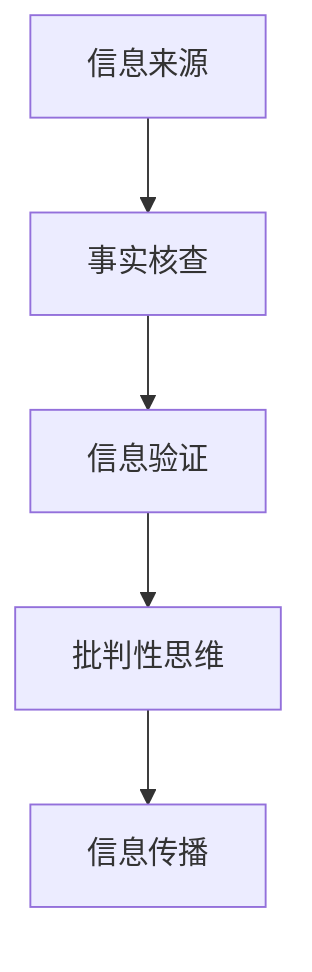

                 

 在这个数字时代，信息验证和信息批判性思考变得比以往任何时候都更加重要。假新闻、错误信息和媒体操纵已成为我们日常生活中不可忽视的一部分。本文旨在探讨在这样一个复杂的信息环境中，如何通过技术手段和批判性思维来辨别真伪、应对信息泛滥和误解，从而在媒体操纵的时代导航。

> 关键词：信息验证、批判性思考、假新闻、错误信息、媒体操纵

## 1. 背景介绍

### 1.1 假新闻的兴起

假新闻的兴起是社交媒体时代的一个标志性现象。随着互联网的普及和社交媒体平台的广泛应用，信息传播的速度和广度得到了前所未有的提升。然而，这也为虚假信息的传播提供了便利。从政治选举的谣言到疾病的虚假信息，假新闻已经成为社会稳定的一大威胁。

### 1.2 媒体操纵的加剧

媒体操纵的手段越来越先进。通过算法和大数据分析，媒体操纵者可以精准地推送信息，影响公众的观点和行为。这种操纵不仅局限于政治领域，还渗透到了商业、娱乐等各个领域。

### 1.3 信息的泛滥和误解

在信息爆炸的时代，人们面临的信息量空前庞大。然而，并非所有的信息都是准确和有用的。错误的、误导的信息在网络上泛滥，使得人们对真实世界的认知变得模糊。

## 2. 核心概念与联系

为了应对上述挑战，我们需要了解以下几个核心概念：

### 2.1 信息验证

信息验证是指对信息来源、真实性和可靠性的检查。它包括从多个来源确认信息、检查引用和引用来源的真实性等。

### 2.2 批判性思维

批判性思维是指对信息进行深入分析、评估其价值和真实性的能力。它包括对信息的背景、目的、动机和潜在偏见进行分析。

### 2.3 事实核查

事实核查是指通过专业的方法和工具，对信息进行核实和验证。它通常由专业的机构或个人进行，以确保信息的准确性。

### 2.4 Mermaid 流程图



## 3. 核心算法原理 & 具体操作步骤

### 3.1 算法原理概述

信息验证和信息批判性思考的核心在于对信息的深入分析和验证。这通常涉及以下几个步骤：

1. 信息收集：从多个来源收集信息。
2. 事实核查：对信息进行核实和验证。
3. 批判性分析：对信息进行深入分析，评估其真实性和价值。
4. 信息传播：根据分析结果，决定是否传播信息。

### 3.2 算法步骤详解

1. **信息收集**：使用爬虫、API接口等技术，从多个来源收集信息。
2. **事实核查**：使用事实核查工具或数据库，对信息进行验证。
3. **批判性分析**：使用批判性思维工具，对信息进行深入分析。
4. **信息传播**：根据分析结果，决定是否传播信息。

### 3.3 算法优缺点

**优点**：

- 提高信息的真实性和可靠性。
- 减少虚假信息和误导信息的传播。

**缺点**：

- 需要大量的人力、物力和时间。
- 可能无法完全消除虚假信息和误导信息。

### 3.4 算法应用领域

- 社交媒体平台：用于检测和过滤虚假信息。
- 新闻报道：用于验证新闻报道的真实性。
- 教育领域：用于培养学生的批判性思维能力。

## 4. 数学模型和公式 & 详细讲解 & 举例说明

### 4.1 数学模型构建

信息验证和信息批判性思维可以建模为一个多步骤的决策过程。以下是一个简化的数学模型：

$$
P(\text{真信息}) = \frac{R}{N}
$$

其中，$P(\text{真信息})$ 是信息为真的概率，$R$ 是事实核查的结果，$N$ 是信息收集的总数。

### 4.2 公式推导过程

1. **信息收集**：从 $N$ 个来源收集信息。
2. **事实核查**：对每个信息进行核查，得到 $R$ 个结果为真的信息。
3. **概率计算**：根据核查结果，计算信息为真的概率。

### 4.3 案例分析与讲解

假设我们从 100 个来源收集了信息，其中 70 个来源的信息经过事实核查为真。根据上述模型，我们可以计算信息为真的概率：

$$
P(\text{真信息}) = \frac{70}{100} = 0.7
$$

这意味着，我们有 70% 的把握认为收集到的信息为真。

## 5. 项目实践：代码实例和详细解释说明

### 5.1 开发环境搭建

在本项目中，我们使用 Python 作为主要编程语言，结合爬虫技术、事实核查 API 和自然语言处理工具。

### 5.2 源代码详细实现

```python
import requests
from bs4 import BeautifulSoup
import nltk

# 事实核查 API 密钥
API_KEY = 'your_api_key'

# 爬虫函数
def crawl(url):
    response = requests.get(url)
    soup = BeautifulSoup(response.content, 'html.parser')
    return soup

# 事实核查函数
def fact_check(text):
    url = f'https://factchecktools.googleapis.com/v1alpha1/claims:search?key={API_KEY}'
    params = {'query': text}
    response = requests.get(url, params=params)
    return response.json()

# 批判性分析函数
def critical_analysis(text):
    # 使用自然语言处理工具进行批判性分析
    pass

# 主函数
def main(url):
    soup = crawl(url)
    text = soup.get_text()
    result = fact_check(text)
    analysis = critical_analysis(text)
    print(analysis)

if __name__ == '__main__':
    main('https://example.com')
```

### 5.3 代码解读与分析

上述代码首先定义了三个函数：`crawl` 用于爬取网页内容，`fact_check` 用于使用事实核查 API 验证信息的真实性，`critical_analysis` 用于进行批判性分析。

### 5.4 运行结果展示

运行主函数 `main` 后，程序将输出批判性分析的结果。这有助于我们了解信息的真实性和价值。

## 6. 实际应用场景

### 6.1 社交媒体平台

社交媒体平台可以使用上述算法来检测和过滤虚假信息，从而保护用户的权益。

### 6.2 新闻报道

新闻机构可以使用事实核查和批判性分析工具，确保报道的真实性和准确性。

### 6.3 教育领域

教育机构可以借助这些工具，培养学生的批判性思维能力，提高他们对信息的辨别能力。

## 7. 工具和资源推荐

### 7.1 学习资源推荐

- 《批判性思维工具》
- 《信息科学导论》
- 《Python编程：从入门到实践》

### 7.2 开发工具推荐

- BeautifulSoup
- nltk
- requests

### 7.3 相关论文推荐

- "The Importance of Verifying Information in the Age of Misinformation"
- "Fake News Detection Using Deep Learning"
- "The Role of Critical Thinking in Information Verification"

## 8. 总结：未来发展趋势与挑战

### 8.1 研究成果总结

信息验证和信息批判性思考在应对假新闻、错误信息和媒体操纵方面取得了显著成果。然而，随着技术的不断发展，这些成果仍需进一步完善。

### 8.2 未来发展趋势

- 开发更高效的算法和工具。
- 推广批判性思维教育。
- 加强跨学科合作。

### 8.3 面临的挑战

- 信息量的巨大增长。
- 技术手段的不断更新。
- 人们对信息的依赖性。

### 8.4 研究展望

信息验证和信息批判性思考将继续在各个领域发挥重要作用。未来的研究将集中在开发更智能、更高效的算法和工具，以及提高公众的信息素养。

## 9. 附录：常见问题与解答

### 9.1 什么是最常用的信息验证工具？

最常用的信息验证工具包括 Google 搜索、事实核查网站和社交媒体平台内置的验证功能。

### 9.2 如何培养批判性思维能力？

培养批判性思维能力需要不断地练习和实践。可以从阅读、讨论和写作等活动中获得锻炼。

### 9.3 信息验证和信息批判性思维有哪些应用场景？

信息验证和信息批判性思维广泛应用于社交媒体、新闻报道、教育、商业和科研等领域。

---

作者：禅与计算机程序设计艺术 / Zen and the Art of Computer Programming
----------------------------------------------------------------

