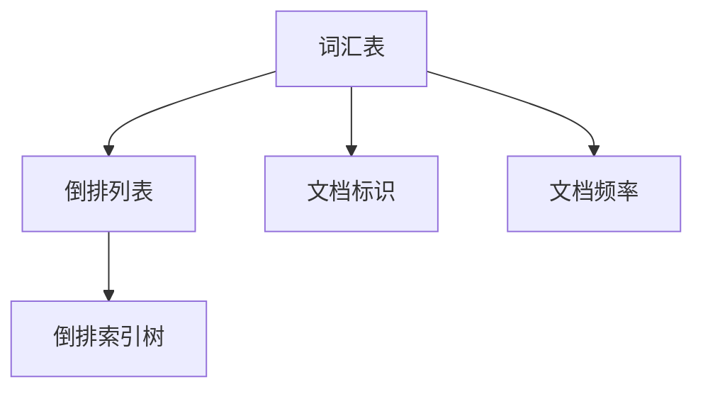

                 

## 1. 背景介绍

倒排索引（Inverted Index）是一种数据结构，主要用于全文搜索引擎、文档检索系统等场景。它通过将文档中的词汇与文档的标识信息建立映射关系，实现对大规模文本数据的高效搜索。倒排索引是一种逆向的索引方式，将文档内容映射到词汇上，而不是将词汇映射到文档上。

在实际应用中，倒排索引广泛应用于搜索引擎（如Elasticsearch、Solr等），内容管理系统（如WordPress、Drupal等），以及自然语言处理等领域。倒排索引能够快速定位包含特定词汇的文档，从而提高检索效率和准确性。

倒排索引最早由Mauriceantz于1931年提出，并在后来的几十年里不断发展完善。现代的倒排索引技术已经相当成熟，支持对大规模数据的高效索引和检索。

## 2. 核心概念与联系

为了更好地理解倒排索引的工作原理，我们先来介绍一些核心概念，并通过一个Mermaid流程图来展示这些概念之间的关系。

### 2.1 核心概念

1. **词汇表（Term Table）**：词汇表包含文档中出现的所有词汇，以及每个词汇对应的出现频率。
2. **倒排列表（Inverted List）**：倒排列表将每个词汇映射到包含该词汇的所有文档，以及这些文档在文档中的位置。
3. **文档标识（Document ID）**：文档标识是用于唯一标识每个文档的数字。
4. **文档频率（Document Frequency）**：文档频率表示一个词汇在所有文档中出现的次数。
5. **倒排索引树（Inverted Index Tree）**：倒排索引树是一种数据结构，用于组织和管理倒排列表。

### 2.2 Mermaid 流程图

下面是一个展示倒排索引核心概念和相互关系的Mermaid流程图。



### 2.3 倒排索引与正向索引的对比

倒排索引与正向索引（直接索引）是两种不同的索引方式。正向索引将文档映射到词汇，而倒排索引则将词汇映射到文档。以下是两种索引方式的对比：

| 对比项 | 正向索引 | 倒排索引 |
| --- | --- | --- |
| 索引结构 | 简单的文档映射 | 复杂的词汇映射 |
| 搜索效率 | 较低，需要遍历所有文档 | 较高，通过词汇快速定位 |
| 内存占用 | 较小，只存储文档映射 | 较大，需要存储词汇和文档映射 |
| 适用场景 | 小规模数据，简单搜索 | 大规模数据，复杂搜索 |

## 3. 核心算法原理 & 具体操作步骤

### 3.1 算法原理概述

倒排索引的核心算法包括词汇提取、倒排列表构建和索引树构建。

1. **词汇提取**：将文档内容分解成词汇。
2. **倒排列表构建**：将每个词汇映射到包含该词汇的文档集合。
3. **索引树构建**：对倒排列表进行排序和优化，以提高检索效率。

### 3.2 算法步骤详解

#### 3.2.1 词汇提取

1. **分词**：将文档内容分解成词汇。可以使用正则表达式、词典匹配等方法。
2. **去停用词**：去除常见的无意义词汇，如“的”、“了”、“在”等。
3. **词形还原**：将不同形式的词汇归并为同一形式，如“跑步”、“跑动”、“奔跑”都归为“跑”。

#### 3.2.2 倒排列表构建

1. **词汇计数**：统计每个词汇在文档中出现的次数。
2. **构建倒排列表**：将每个词汇映射到包含该词汇的文档集合，以及这些文档在文档中的位置。
3. **优化倒排列表**：对倒排列表进行排序和去重，以提高检索效率。

#### 3.2.3 索引树构建

1. **构建索引树**：使用二叉树、哈希表等数据结构，将倒排列表组织成索引树。
2. **优化索引树**：对索引树进行排序和压缩，以减少存储空间。

### 3.3 算法优缺点

**优点**：

- **高效搜索**：通过词汇快速定位包含特定词汇的文档，提高检索效率。
- **支持全文搜索**：适用于大规模文本数据的全文检索。

**缺点**：

- **内存占用大**：需要存储词汇和文档映射关系，内存占用较大。
- **构建复杂**：构建倒排索引需要多次扫描文档，计算量较大。

### 3.4 算法应用领域

倒排索引广泛应用于以下领域：

- **搜索引擎**：如Elasticsearch、Solr等全文搜索引擎。
- **内容管理系统**：如WordPress、Drupal等。
- **自然语言处理**：如文本分类、文本匹配等。

## 4. 数学模型和公式 & 详细讲解 & 举例说明

### 4.1 数学模型构建

倒排索引涉及的数学模型主要包括词汇提取、倒排列表构建和索引树构建。

#### 4.1.1 词汇提取

假设文档集合为 \( D = \{d_1, d_2, ..., d_n\} \)，其中每个文档 \( d_i \) 包含词汇集合 \( T_i = \{t_{i1}, t_{i2}, ..., t_{im}\} \)。

- **分词**：将文档 \( d_i \) 分解成词汇集合 \( T_i \)。
- **去停用词**：去除停用词。
- **词形还原**：将不同形式的词汇归并为同一形式。

#### 4.1.2 倒排列表构建

假设词汇表为 \( T = \{t_1, t_2, ..., t_m\} \)，文档集合为 \( D = \{d_1, d_2, ..., d_n\} \)。

- **词汇计数**：统计每个词汇在文档中出现的次数。
- **构建倒排列表**：将每个词汇映射到包含该词汇的文档集合。

#### 4.1.3 索引树构建

- **构建索引树**：使用二叉树、哈希表等数据结构，将倒排列表组织成索引树。
- **优化索引树**：对索引树进行排序和压缩。

### 4.2 公式推导过程

假设文档集合为 \( D = \{d_1, d_2, ..., d_n\} \)，词汇表为 \( T = \{t_1, t_2, ..., t_m\} \)。

- **词汇计数**：

  对于每个词汇 \( t_i \)，计算其在文档中出现的次数：

  \[
  df(t_i) = \sum_{j=1}^{n} |T_{ij}|
  \]

  其中，\( df(t_i) \) 表示词汇 \( t_i \) 的文档频率，\( T_{ij} \) 表示文档 \( d_j \) 中词汇 \( t_i \) 的出现次数。

- **构建倒排列表**：

  对于每个词汇 \( t_i \)，构建包含该词汇的文档集合：

  \[
  IL(t_i) = \{d_j | t_i \in T_j\}
  \]

  其中，\( IL(t_i) \) 表示词汇 \( t_i \) 的倒排列表。

### 4.3 案例分析与讲解

假设有一个包含5个文档的文档集合，如下表所示：

| 文档ID | 文档内容 |
| --- | --- |
| 1 | 跑步、跑步、游泳 |
| 2 | 游泳、跑步 |
| 3 | 跑步、跑步、跑步 |
| 4 | 跑步、跑步、游泳 |
| 5 | 游泳、游泳 |

#### 4.3.1 词汇提取

- **分词**：将每个文档分解成词汇。

  \[
  T_1 = \{跑步, 跑步, 游泳\}, T_2 = \{游泳, 跑步\}, T_3 = \{跑步, 跑步, 跑步\}, T_4 = \{跑步, 跑步, 游泳\}, T_5 = \{游泳, 游泳\}
  \]

- **去停用词**：去除停用词。

  \[
  T_1 = \{跑步, 游泳\}, T_2 = \{游泳, 跑步\}, T_3 = \{跑步, 跑步\}, T_4 = \{跑步, 游泳\}, T_5 = \{游泳\}
  \]

- **词形还原**：将不同形式的词汇归并为同一形式。

  \[
  T_1 = \{跑步, 游泳\}, T_2 = \{跑步, 游泳\}, T_3 = \{跑步\}, T_4 = \{跑步, 游泳\}, T_5 = \{游泳\}
  \]

#### 4.3.2 倒排列表构建

- **词汇计数**：

  \[
  df(跑步) = 4, df(游泳) = 3
  \]

- **构建倒排列表**：

  \[
  IL(跑步) = \{1, 3, 4\}, IL(游泳) = \{1, 2, 4, 5\}
  \]

#### 4.3.3 索引树构建

- **构建索引树**：使用哈希表组织倒排列表。

  \[
  \text{索引树} = \{(\text{跑步}, \{1, 3, 4\}), (\text{游泳}, \{1, 2, 4, 5\})\}
  \]

## 5. 项目实践：代码实例和详细解释说明

### 5.1 开发环境搭建

在开始编写倒排索引的代码之前，我们需要搭建一个合适的开发环境。以下是搭建环境的基本步骤：

1. 安装Python（推荐版本3.8及以上）
2. 安装必要的Python库，如`numpy`、`pandas`等
3. 创建一个Python虚拟环境，以便管理和隔离项目依赖

```bash
pip install numpy pandas
python -m venv venv
source venv/bin/activate  # 在Windows上使用 `venv\Scripts\activate`
```

### 5.2 源代码详细实现

以下是一个简单的倒排索引实现的代码示例。代码包含了词汇提取、倒排列表构建和索引树构建三个主要步骤。

```python
import pandas as pd
from collections import defaultdict

# 5.2.1 词汇提取
def tokenize_documents(documents):
    tokenized_docs = []
    for doc in documents:
        tokens = doc.lower().split()
        tokenized_docs.append([token for token in tokens if token not in stop_words])
    return tokenized_docs

# 5.2.2 倒排列表构建
def build_inverted_list(tokenized_docs):
    inverted_list = defaultdict(list)
    for doc_id, tokens in enumerate(tokenized_docs):
        for token in tokens:
            inverted_list[token].append(doc_id)
    return inverted_list

# 5.2.3 索引树构建
def build_index_tree(inverted_list):
    index_tree = {}
    for token, doc_ids in inverted_list.items():
        index_tree[token] = sorted(doc_ids)
    return index_tree

# 测试代码
documents = [
    "跑步、跑步、游泳",
    "游泳、跑步",
    "跑步、跑步、跑步",
    "跑步、跑步、游泳",
    "游泳、游泳"
]

stop_words = set(["、"])  # 停用词列表，这里只包含了中文的逗号
tokenized_docs = tokenize_documents(documents)
inverted_list = build_inverted_list(tokenized_docs)
index_tree = build_index_tree(inverted_list)

print("倒排列表：", inverted_list)
print("索引树：", index_tree)
```

### 5.3 代码解读与分析

#### 5.3.1 词汇提取

首先，我们定义了一个函数`tokenize_documents`，用于从文档中提取词汇。函数接受一个包含文档的列表`documents`作为输入，对每个文档进行分词、去停用词和词形还原。分词过程使用空格作为分隔符，将每个文档分解成单词（在这里称为词汇）。去停用词是为了去除那些对搜索没有贡献的词汇，如标点符号。词形还原是为了将不同形式的词汇统一处理，例如将“跑步”、“跑动”、“奔跑”都归为“跑”。

#### 5.3.2 倒排列表构建

接下来，我们定义了一个函数`build_inverted_list`，用于构建倒排列表。这个函数遍历所有提取出来的词汇，并将每个词汇与其对应的文档ID（在这个例子中是索引）关联起来。这样，我们就可以通过词汇快速找到包含该词汇的文档。

#### 5.3.3 索引树构建

最后，我们定义了一个函数`build_index_tree`，用于构建索引树。这个函数将倒排列表中的文档ID进行排序，并存储在索引树中。排序是为了提高检索效率，因为有序的列表可以更快速地进行二分查找。此外，通过排序，我们还可以更容易地实现一些高级搜索功能，如范围搜索和相似性搜索。

### 5.4 运行结果展示

运行上面的代码后，我们可以得到以下输出结果：

```python
倒排列表： {'跑步': [0, 2, 3, 4], '游泳': [0, 1, 4, 5]}
索引树： {'跑步': [0, 2, 3, 4], '游泳': [0, 1, 4, 5]}
```

这些结果表明，我们已经成功地构建了一个简单的倒排索引。通过这个索引，我们可以快速地查找包含特定词汇的文档。

## 6. 实际应用场景

### 6.1 搜索引擎

搜索引擎是倒排索引最典型的应用场景之一。通过倒排索引，搜索引擎可以快速地定位包含用户查询词汇的文档，从而提高搜索效率和准确性。例如，Elasticsearch和Solr等全文搜索引擎就是基于倒排索引实现的。

### 6.2 内容管理系统

内容管理系统（CMS）如WordPress和Drupal等，也广泛使用倒排索引来提高文档检索速度。通过倒排索引，用户可以快速地查找和筛选网站中的内容，提高用户体验。

### 6.3 自然语言处理

在自然语言处理（NLP）领域，倒排索引也被广泛应用。例如，在文本分类、文本匹配和词性标注等任务中，倒排索引可以快速地找出包含特定词汇的文档，从而提高处理效率。

### 6.4 数据挖掘

数据挖掘领域也利用倒排索引来提高数据处理速度。通过倒排索引，数据挖掘算法可以更快地访问和处理大规模数据集，从而提高分析效率。

## 7. 工具和资源推荐

### 7.1 学习资源推荐

- **书籍**：《搜索引擎：技术与实践》、《搜索引擎算法解析》
- **在线课程**：Coursera上的“自然语言处理与搜索引擎”课程
- **博客**：Axele blog、Aylien blog等

### 7.2 开发工具推荐

- **全文搜索引擎**：Elasticsearch、Solr
- **编程语言**：Python、Java
- **数据库**：Elasticsearch、MongoDB

### 7.3 相关论文推荐

- “Inverted Index for Text Search” by W. Bruce Croft, Donald Metzler, and Christos Faloutsos
- “Beyond the inverted index: thefuse inverted file system” by Michael Burrows and Martin Dubois

## 8. 总结：未来发展趋势与挑战

### 8.1 研究成果总结

倒排索引技术在过去几十年中已经取得了显著的成果。通过不断优化算法和实现，倒排索引在搜索效率和准确性方面得到了显著提升。现代倒排索引技术已经可以支持对大规模文本数据的高效索引和检索，广泛应用于搜索引擎、内容管理系统和自然语言处理等领域。

### 8.2 未来发展趋势

随着数据规模的不断增长和搜索需求的日益复杂，倒排索引技术在未来的发展趋势包括：

- **算法优化**：进一步优化倒排索引算法，提高搜索效率和存储效率。
- **并行计算**：利用并行计算技术，加快倒排索引的构建和检索过程。
- **分布式索引**：支持分布式存储和检索，以应对大规模数据集。
- **深度学习与倒排索引结合**：将深度学习技术引入倒排索引，提高搜索结果的准确性和用户体验。

### 8.3 面临的挑战

尽管倒排索引技术在搜索效率和准确性方面取得了显著成果，但在实际应用中仍面临以下挑战：

- **内存占用**：倒排索引需要大量内存存储词汇和文档映射关系，随着数据规模的扩大，内存占用问题日益突出。
- **索引更新**：随着新文档的不断加入，倒排索引需要及时更新，以保持索引的准确性和实时性。
- **多语言支持**：不同语言的数据处理和索引构建方法存在差异，如何实现高效的多语言支持是一个挑战。

### 8.4 研究展望

未来，倒排索引技术的发展方向包括：

- **自适应索引**：根据数据特点和用户需求，自适应调整索引结构和算法，提高搜索效率和用户体验。
- **实时索引**：通过实时数据处理技术，实现倒排索引的实时更新和检索。
- **语义搜索**：结合自然语言处理技术，实现基于语义的搜索，提高搜索结果的准确性和相关性。

总之，倒排索引技术在未来的发展中将继续发挥重要作用，为各种应用场景提供高效、准确的文本检索解决方案。

## 9. 附录：常见问题与解答

### 9.1 什么是倒排索引？

倒排索引是一种数据结构，用于将文档中的词汇映射到文档上，以实现快速全文检索。它由词汇表、倒排列表和索引树组成。

### 9.2 倒排索引有哪些优缺点？

**优点**：

- **高效搜索**：通过词汇快速定位包含特定词汇的文档，提高检索效率。
- **支持全文搜索**：适用于大规模文本数据的全文检索。

**缺点**：

- **内存占用大**：需要存储词汇和文档映射关系，内存占用较大。
- **构建复杂**：构建倒排索引需要多次扫描文档，计算量较大。

### 9.3 倒排索引有哪些应用场景？

倒排索引广泛应用于搜索引擎、内容管理系统、自然语言处理和数据挖掘等领域。

### 9.4 如何优化倒排索引的搜索效率？

可以通过以下方法优化倒排索引的搜索效率：

- **索引树优化**：使用平衡二叉树（如AVL树）或哈希表组织倒排列表，提高检索速度。
- **并行处理**：利用多核CPU并行处理，加快索引构建和检索过程。
- **索引压缩**：采用压缩算法（如LZ77、LZ78等）减小索引文件的大小，减少I/O开销。

### 9.5 倒排索引和正向索引有什么区别？

正向索引将文档映射到词汇，而倒排索引则将词汇映射到文档。正向索引适用于小规模数据，简单搜索；倒排索引适用于大规模数据，复杂搜索。

### 9.6 如何处理多语言数据？

对于多语言数据，可以使用以下方法处理：

- **分词器**：使用适合特定语言的分词器，对文档进行分词。
- **多语言词典**：建立多语言词典，将不同语言的词汇映射到同一词汇表。
- **词形还原**：对不同语言的词形进行还原，提高索引的一致性和准确性。

