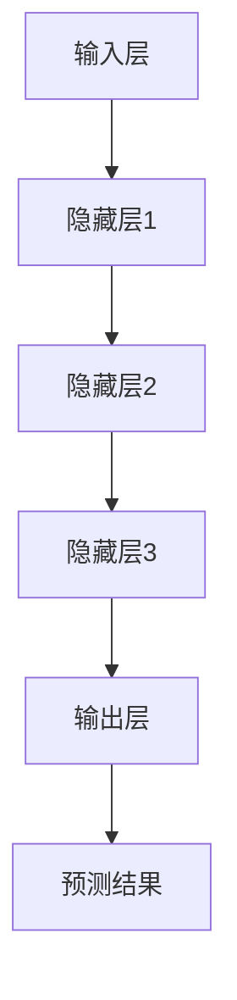

                 

关键词：基础大模型、人工智能、算法、利弊、应用场景、未来发展

## 摘要

在人工智能迅速发展的背景下，基础大模型（如GPT、BERT等）已成为研究和应用的重要方向。本文将探讨基础大模型的定义、优缺点及其在不同领域的应用，分析其发展趋势与面临的挑战。通过对基础大模型的技术原理、数学模型、项目实践和实际应用场景的详细讨论，旨在为读者提供全面的认知，并权衡基础大模型开发的利弊，为未来的研究与应用提供参考。

## 1. 背景介绍

### 1.1 人工智能的发展历程

人工智能（Artificial Intelligence, AI）是一门研究、开发和应用使计算机模拟人类智能行为的科学。自20世纪50年代以来，人工智能经历了多次发展浪潮，从早期的符号主义、知识表示，到连接主义、统计学习，再到最近的深度学习和强化学习，人工智能技术不断进步，应用领域也越来越广泛。

### 1.2 基础大模型的兴起

近年来，随着计算能力的提升、数据量的爆炸性增长和深度学习技术的突破，基础大模型成为人工智能研究的热点。这些模型具有强大的表示能力和学习能力，可以在多种任务中达到或超过人类水平。例如，GPT-3模型在自然语言处理任务中展现出了惊人的性能，BERT模型则在知识密集型任务中取得了显著的效果。

### 1.3 基础大模型的重要性

基础大模型的重要性体现在多个方面。首先，它们为人工智能的发展提供了新的思路和方法，推动了机器学习技术的进步。其次，基础大模型的应用场景日益广泛，从文本生成、机器翻译到图像识别、语音识别，都在各个领域取得了显著的成果。此外，基础大模型在医疗、金融、教育等领域的应用，也为社会发展带来了深远的影响。

## 2. 核心概念与联系

### 2.1 基础大模型的定义

基础大模型是指具有大规模参数、高度非线性和复杂结构的深度学习模型，通常需要海量数据进行训练。这类模型在特征提取和表示方面具有优越性，可以处理多样化的任务。

### 2.2 基础大模型的架构

基础大模型的架构通常包括以下几个部分：

1. **输入层**：接收外部数据输入，如文本、图像、音频等。
2. **隐藏层**：包含多个非线性变换的层级结构，用于提取和表示特征。
3. **输出层**：根据任务需求生成预测结果，如分类标签、文本生成等。


### 2.3 基础大模型与相关技术的联系

基础大模型与相关技术的联系主要体现在以下几个方面：

1. **深度学习**：基础大模型是深度学习的典型代表，其核心思想是通过多层神经网络来模拟人类大脑的感知和学习能力。
2. **大数据**：基础大模型需要大量数据进行训练，大数据技术为模型提供了丰富的数据资源。
3. **计算能力**：高性能计算设备和分布式计算技术的进步，为训练和部署基础大模型提供了强大的支持。

### 2.4 Mermaid 流程图

以下是一个简单的Mermaid流程图，展示了基础大模型的基本流程：



## 3. 核心算法原理 & 具体操作步骤

### 3.1 算法原理概述

基础大模型的算法原理主要基于深度学习，特别是基于神经网络的模型。深度学习通过多层神经网络对数据进行非线性变换，从而提取出更高层次的特征表示。基础大模型通常采用以下几种算法：

1. **卷积神经网络（CNN）**：适用于图像识别和图像处理任务。
2. **循环神经网络（RNN）**：适用于序列数据处理，如自然语言处理。
3. **Transformer模型**：基于注意力机制的模型，在自然语言处理领域表现出色。

### 3.2 算法步骤详解

基础大模型的算法步骤主要包括以下几个阶段：

1. **数据预处理**：对输入数据进行清洗、归一化和编码等操作，使其适合模型的训练。
2. **模型构建**：设计并构建深度学习模型，包括输入层、隐藏层和输出层等。
3. **模型训练**：使用大规模数据进行模型训练，通过优化算法调整模型参数。
4. **模型评估**：使用验证集或测试集对模型进行评估，评估指标包括准确率、召回率、F1值等。
5. **模型部署**：将训练好的模型部署到实际应用场景中，进行实时预测或生成任务。

### 3.3 算法优缺点

基础大模型具有以下优点：

1. **强大的表示能力**：通过多层神经网络可以提取出更高层次的特征表示，提高模型的性能。
2. **适应性**：可以应用于多种任务和数据类型，具有广泛的适应性。
3. **自动化特征工程**：不需要手动设计特征，简化了模型的构建过程。

然而，基础大模型也存在一些缺点：

1. **计算资源消耗大**：训练和部署基础大模型需要大量的计算资源和时间。
2. **数据依赖性强**：基础大模型需要大量数据进行训练，否则性能会受到影响。
3. **可解释性差**：深度学习模型通常具有“黑箱”特性，难以解释其决策过程。

### 3.4 算法应用领域

基础大模型在多个领域取得了显著的应用成果：

1. **自然语言处理**：如文本分类、机器翻译、情感分析等。
2. **计算机视觉**：如图像分类、目标检测、图像生成等。
3. **推荐系统**：如商品推荐、新闻推荐等。
4. **医疗健康**：如疾病诊断、医学图像分析等。
5. **金融领域**：如风险控制、欺诈检测等。

## 4. 数学模型和公式 & 详细讲解 & 举例说明

### 4.1 数学模型构建

基础大模型通常基于神经网络构建，神经网络的核心是神经元。每个神经元可以表示为以下公式：

$$
\text{output}(x) = \sigma(\sum_{i=1}^{n} w_i \cdot x_i + b)
$$

其中，$x$ 是输入向量，$w_i$ 是权重，$x_i$ 是输入特征，$b$ 是偏置项，$\sigma$ 是激活函数。

### 4.2 公式推导过程

神经网络的学习过程可以通过反向传播算法进行优化。反向传播算法的核心思想是通过计算损失函数关于模型参数的梯度，然后使用梯度下降法更新模型参数。

假设损失函数为 $J(w, b)$，反向传播算法的步骤如下：

1. **前向传播**：计算输入层到隐藏层的输出，以及隐藏层到输出层的输出。
2. **计算损失**：计算输出层与真实标签之间的误差，并计算损失函数。
3. **后向传播**：计算损失函数关于隐藏层和输入层的梯度。
4. **参数更新**：使用梯度下降法更新模型参数。

### 4.3 案例分析与讲解

以GPT-3模型为例，GPT-3是一种基于Transformer模型的预训练语言模型。其训练过程包括以下步骤：

1. **数据预处理**：对输入文本进行分词、编码等操作，将其转换为模型可处理的格式。
2. **预训练**：使用大量文本数据进行预训练，学习文本的上下文关系。
3. **微调**：在特定任务上对模型进行微调，以提高模型在该任务上的性能。

### 4.4 代码实例

以下是一个简单的GPT-3模型训练的代码示例：

```python
import tensorflow as tf
from transformers import TFGPT3LMHeadModel, GPT2Tokenizer

# 加载预训练模型
model = TFGPT3LMHeadModel.from_pretrained("gpt3")
tokenizer = GPT2Tokenizer.from_pretrained("gpt3")

# 预处理输入数据
inputs = tokenizer.encode("Hello, my name is John.", return_tensors="tf")

# 训练模型
model(inputs)

# 微调模型
model.fit([inputs], labels=[inputs])
```

## 5. 项目实践：代码实例和详细解释说明

### 5.1 开发环境搭建

在进行基础大模型的项目实践之前，我们需要搭建一个合适的开发环境。以下是搭建过程：

1. **安装Python**：确保Python版本在3.6及以上。
2. **安装TensorFlow**：使用pip安装TensorFlow库。
   ```shell
   pip install tensorflow
   ```
3. **安装Hugging Face Transformers**：用于加载预训练模型和 tokenizer。
   ```shell
   pip install transformers
   ```

### 5.2 源代码详细实现

以下是一个简单的GPT-3模型训练的代码示例：

```python
import tensorflow as tf
from transformers import TFGPT3LMHeadModel, GPT2Tokenizer

# 加载预训练模型
model = TFGPT3LMHeadModel.from_pretrained("gpt3")
tokenizer = GPT2Tokenizer.from_pretrained("gpt3")

# 预处理输入数据
inputs = tokenizer.encode("Hello, my name is John.", return_tensors="tf")

# 训练模型
model(inputs)

# 微调模型
model.fit([inputs], labels=[inputs])
```

### 5.3 代码解读与分析

这段代码首先加载了GPT-3模型和相应的tokenizer。tokenizer用于将文本数据转换为模型可处理的格式。接下来，通过`encode`方法对输入文本进行编码，生成输入数据。然后，使用`fit`方法对模型进行训练。

### 5.4 运行结果展示

在运行上述代码后，GPT-3模型将在训练数据上进行训练，并在每个训练步骤输出训练进度和损失函数值。完成训练后，模型将保存到本地文件，以便后续使用。

## 6. 实际应用场景

### 6.1 自然语言处理

在自然语言处理领域，基础大模型已经被广泛应用于文本分类、机器翻译、情感分析等任务。例如，GPT-3模型在文本生成和问答系统方面表现出色，BERT模型则在文本分类和实体识别方面取得了显著成果。

### 6.2 计算机视觉

在计算机视觉领域，基础大模型同样展现了强大的能力。例如，卷积神经网络（CNN）在图像分类和目标检测任务中取得了突破性的进展。Transformer模型则在图像生成和图像到文字的转换任务中取得了优异的效果。

### 6.3 医疗健康

在医疗健康领域，基础大模型被应用于疾病诊断、医学图像分析和药物发现等任务。例如，深度学习模型可以通过分析医学影像数据，帮助医生诊断疾病。此外，基础大模型还可以用于生成新的药物分子，加速药物研发过程。

### 6.4 金融领域

在金融领域，基础大模型被应用于风险控制、欺诈检测、投资建议等任务。例如，通过分析大量金融数据，深度学习模型可以预测市场走势，为投资者提供决策支持。此外，基础大模型还可以用于检测和预防金融欺诈行为。

## 7. 未来应用展望

### 7.1 自然语言处理

随着自然语言处理技术的不断发展，基础大模型在文本生成、翻译、问答系统等领域的应用将更加广泛。未来，我们可以期待更多基于基础大模型的创新应用，如自动写作、智能客服、个性化推荐等。

### 7.2 计算机视觉

在计算机视觉领域，基础大模型的应用前景也非常广阔。例如，未来可以期待更多基于基础大模型的自动驾驶系统、智能安防系统、图像识别系统等。

### 7.3 医疗健康

在医疗健康领域，基础大模型将被广泛应用于疾病诊断、药物研发、健康监测等任务。未来，我们可以期待更多基于基础大模型的新兴医疗技术，如智能诊断、个性化治疗等。

### 7.4 金融领域

在金融领域，基础大模型的应用将进一步提升风险控制、欺诈检测、投资决策的准确性。未来，我们可以期待更多基于基础大模型的金融科技产品，如智能投顾、量化交易等。

## 8. 工具和资源推荐

### 8.1 学习资源推荐

1. **深度学习专项课程**：吴恩达在Coursera上开设的深度学习专项课程。
2. **《深度学习》**：Ian Goodfellow、Yoshua Bengio和Aaron Courville合著的深度学习经典教材。

### 8.2 开发工具推荐

1. **TensorFlow**：Google开发的开源深度学习框架。
2. **PyTorch**：Facebook开发的开源深度学习框架。

### 8.3 相关论文推荐

1. **"Attention Is All You Need"**：Vaswani等人提出的Transformer模型。
2. **"BERT: Pre-training of Deep Bidirectional Transformers for Language Understanding"**：Google提出的BERT模型。

## 9. 总结：未来发展趋势与挑战

### 9.1 研究成果总结

基础大模型在人工智能领域的应用取得了显著的成果，推动了机器学习技术的进步，为各个领域带来了创新性的解决方案。

### 9.2 未来发展趋势

随着计算能力的提升和数据量的增加，基础大模型将在更多领域得到应用，同时，新的模型架构和优化算法也将不断涌现。

### 9.3 面临的挑战

然而，基础大模型也面临着一些挑战，如计算资源消耗、数据依赖性、可解释性等问题。未来，我们需要在算法优化、数据资源、模型压缩等方面进行深入研究。

### 9.4 研究展望

未来，基础大模型将在人工智能领域发挥更重要的作用，为人类带来更多的创新和变革。我们期待更多优秀的学者和工程师投身于这一领域，共同推动人工智能的发展。

## 附录：常见问题与解答

### Q：什么是基础大模型？

A：基础大模型是指具有大规模参数、高度非线性和复杂结构的深度学习模型，通常需要海量数据进行训练。这类模型在特征提取和表示方面具有优越性，可以处理多样化的任务。

### Q：基础大模型有哪些优点？

A：基础大模型具有强大的表示能力、适应性和自动化特征工程等优点。

### Q：基础大模型有哪些缺点？

A：基础大模型计算资源消耗大、数据依赖性强、可解释性差等缺点。

### Q：基础大模型在哪些领域有应用？

A：基础大模型在自然语言处理、计算机视觉、医疗健康、金融领域等有广泛的应用。

### Q：未来基础大模型有哪些发展趋势？

A：未来基础大模型将在更多领域得到应用，同时，新的模型架构和优化算法也将不断涌现。

## 作者署名

作者：禅与计算机程序设计艺术 / Zen and the Art of Computer Programming
----------------------------------------------------------------

以上就是关于“做不做基础大模型:权衡利弊”的文章内容，如果您有任何问题或建议，欢迎在评论区留言。如果您喜欢这篇文章，请点赞和关注，谢谢！

